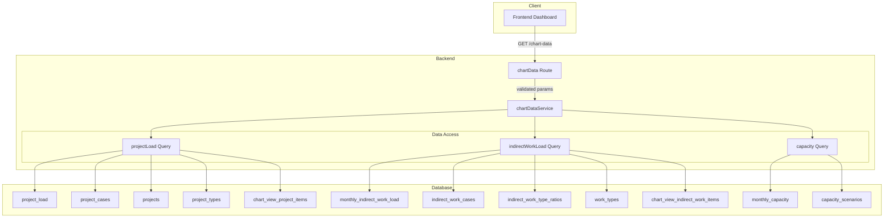
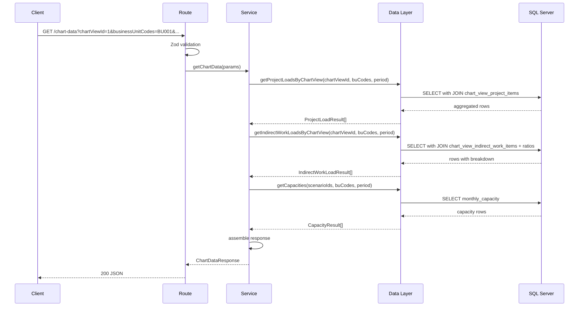
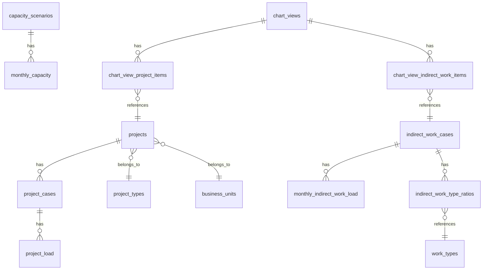

# Design Document — aggregated-chart-data-api

## Overview

**Purpose**: 操業山積ダッシュボードのチャート描画に必要な案件工数・間接工数・キャパシティの3種データを、単一のGETエンドポイント（`GET /chart-data`）で月別集約して返却する読み取り専用APIを提供する。

**Users**: フロントエンドのダッシュボードコンポーネントが本APIを利用して、積み上げチャート描画に必要な全データを1回のリクエストで取得する。

**Impact**: 既存のCRUD APIに変更は加えない。新規エンドポイントの追加のみ。

### Goals
- 案件工数（案件タイプ別集約）・間接工数（ケース別 + 種類別内訳）・キャパシティ（シナリオ別）を1エンドポイントで返却
- chartViewId指定時はビュー設定に従ったフィルタリング、未指定時は `isPrimary` ベースのデフォルト動作を提供
- 間接工数の種類別内訳を `indirect_work_type_ratios` から会計年度基準で動的導出

### Non-Goals
- 既存CRUD APIの変更・置き換え
- データの書き込み操作（POST/PUT/DELETE）
- キャッシュ機構（フロントエンドのTanStack Queryで制御）
- CSV/Excel出力（将来拡張）
- 四半期・年単位の集約粒度（将来拡張）

## Architecture

### Existing Architecture Analysis

既存バックエンドは3層アーキテクチャ（routes → services → data）を全22エンドポイントで統一的に適用している。本APIも同パターンに従い、読み取り専用の集約エンドポイントとして追加する。

- **既存パターン**: CRUD操作中心、各エンティティに1ファイルずつ（routes/services/data/types/transform）
- **本APIの特性**: 読み取り専用、複数エンティティの横断集約、transform層不要（サービス層でレスポンス構造を構築）
- **統合ポイント**: `apps/backend/src/index.ts` に `app.route('/chart-data', chartData)` でマウント

### Architecture Pattern & Boundary Map



**Architecture Integration**:
- **Selected pattern**: 3層アーキテクチャ + 3独立クエリ。各ファクトデータを独立したSQLで取得し、サービス層でレスポンスを統合する（詳細は `research.md` 参照）
- **Domain boundaries**: chartDataService が3種のデータ取得を統合する唯一の窓口。個別CRUD APIとは独立
- **Existing patterns preserved**: Hono ルーティング、Zod バリデーション、RFC 9457 エラーレスポンス、`@` エイリアスインポート
- **New components rationale**: 集約ロジックは既存CRUD サービスとは責務が異なるため、専用ファイル群を新設
- **Steering compliance**: レイヤードアーキテクチャ、型安全性、直接SQL

### Technology Stack

| Layer | Choice / Version | Role in Feature | Notes |
|-------|------------------|-----------------|-------|
| Backend | Hono v4 | ルーティング・ミドルウェア | 既存と同一 |
| Validation | Zod v4 + @hono/zod-validator | クエリパラメータバリデーション | 既存と同一 |
| Data | mssql | SQL Server接続・クエリ実行 | 既存と同一、新規ライブラリ追加なし |
| Runtime | Node.js 20+ | サーバー実行環境 | 既存と同一 |

新規ライブラリの追加は不要。

## System Flows

### chartViewId 指定時のデータ取得フロー



chartViewId未指定時は、chart_view テーブルとのJOINが `isPrimary = true` のフォールバック条件に置き換わる。ロジック分岐はサービス層で制御する。

## Requirements Traceability

| Requirement | Summary | Components | Interfaces | Flows |
|-------------|---------|------------|------------|-------|
| 1.1 | 3セクションを含むレスポンス返却 | chartDataService, chartDataRoute | API Contract | データ取得フロー |
| 1.2 | メタ情報の包含 | chartDataService | API Contract | — |
| 1.3 | 読み取り専用GET | chartDataRoute | API Contract | — |
| 1.4 | ソフトデリート除外 | chartDataData | SQL WHERE句 | — |
| 2.1 | projectTypeCode単位集約 | chartDataData | getProjectLoads | データ取得フロー |
| 2.2 | yearMonth + manhour配列 | chartDataService | API Contract | — |
| 2.3 | displayOrder昇順ソート | chartDataData | SQL ORDER BY | — |
| 2.4 | projectTypeCode NULL対応 | chartDataData | LEFT JOIN | — |
| 3.1 | ケース×BU単位返却 | chartDataData | getIndirectWorkLoads | データ取得フロー |
| 3.2 | breakdown配列の動的導出 | chartDataData | SQL JOIN + 計算 | データ取得フロー |
| 3.3 | 会計年度基準の年度判定 | chartDataData | SQL CASE式 | — |
| 3.4 | breakdown内フィールド | chartDataData, chartDataService | API Contract | — |
| 3.5 | breakdownCoverage | chartDataData | SQL SUM(ratio) | — |
| 3.6 | 比率未設定時の空配列 | chartDataData, chartDataService | LEFT JOIN | — |
| 3.7 | 比率合計>1.0の許容 | chartDataService | breakdownCoverage通知 | — |
| 3.8 | breakdown display_orderソート | chartDataData | SQL ORDER BY | — |
| 4.1 | シナリオ単位キャパシティ | chartDataData | getCapacities | データ取得フロー |
| 4.2 | capacityScenarioIds指定フィルタ | chartDataData | SQL WHERE IN | — |
| 4.3 | 未指定時空配列 | chartDataService | 条件分岐 | — |
| 5.1 | chartView案件フィルタ | chartDataData | getProjectLoadsByChartView | データ取得フロー |
| 5.2 | chartView間接作業フィルタ | chartDataData | getIndirectWorkLoadsByChartView | データ取得フロー |
| 5.3 | chartView指定時キャパシティ空配列 | chartDataService | 条件分岐 | — |
| 6.1 | isPrimaryデフォルト選択 | chartDataData | SQL WHERE is_primary=1 | — |
| 6.2 | indirectWorkCaseIds指定 | chartDataData | SQL WHERE IN | — |
| 6.3 | isPrimary間接作業自動選択 | chartDataData | SQL WHERE is_primary=1 | — |
| 7.1-7.6 | バリデーション | chartDataTypes | Zod schemas | — |
| 8.1 | 成功レスポンス構造 | chartDataRoute | API Contract | — |
| 8.2 | RFC 9457エラー | chartDataRoute | errorHelper | — |
| 8.3 | camelCaseフィールド | chartDataData, chartDataService | SQL aliases | — |

## Components and Interfaces

| Component | Domain/Layer | Intent | Req Coverage | Key Dependencies | Contracts |
|-----------|------------|--------|--------------|------------------|-----------|
| chartDataRoute | Routes | HTTPリクエスト受付・バリデーション・レスポンス返却 | 1.1, 1.3, 7.1-7.6, 8.1-8.3 | chartDataService (P0), validate (P0) | API |
| chartDataService | Services | 3種データの取得統合・条件分岐・レスポンス構築 | 1.1, 1.2, 2.2, 3.4-3.7, 4.3, 5.3, 8.1 | chartDataData (P0) | Service |
| chartDataData | Data | SQL実行・集約クエリ | 1.4, 2.1-2.4, 3.1-3.3, 3.5, 3.8, 4.1-4.2, 5.1-5.2, 6.1-6.3, 8.3 | getPool (P0) | — |
| chartDataTypes | Types | Zodスキーマ・TypeScript型定義 | 7.1-7.6 | zod (P0) | — |

### Routes Layer

#### chartDataRoute

| Field | Detail |
|-------|--------|
| Intent | `GET /chart-data` のHTTP受付、クエリパラメータバリデーション、レスポンス返却 |
| Requirements | 1.1, 1.3, 7.1-7.6, 8.1-8.3 |

**Responsibilities & Constraints**
- クエリパラメータのZodバリデーション実行
- chartDataService への委譲
- 成功時 `{ data: {...} }` 構造で200返却
- エラー時 RFC 9457 Problem Details返却

**Dependencies**
- Inbound: Frontend — HTTP GET (P0)
- Outbound: chartDataService.getChartData — ビジネスロジック委譲 (P0)
- Outbound: validate — Zodバリデーションミドルウェア (P0)

**Contracts**: API [x]

##### API Contract

| Method | Endpoint | Request | Response | Errors |
|--------|----------|---------|----------|--------|
| GET | /chart-data | ChartDataQuery (query params) | ChartDataResponse | 400 (validation), 500 (server) |

**Request Schema (ChartDataQuery)**:

```typescript
interface ChartDataQuery {
  businessUnitCodes: string   // CSV, required
  startYearMonth: string      // YYYYMM, required
  endYearMonth: string        // YYYYMM, required
  chartViewId?: number
  capacityScenarioIds?: string // CSV
  indirectWorkCaseIds?: string // CSV
}
```

**Response Schema (ChartDataResponse)**:

```typescript
interface ChartDataResponse {
  data: {
    projectLoads: ProjectLoadAggregation[]
    indirectWorkLoads: IndirectWorkLoadAggregation[]
    capacities: CapacityAggregation[]
    period: {
      startYearMonth: string
      endYearMonth: string
    }
    businessUnitCodes: string[]
  }
}

interface ProjectLoadAggregation {
  projectTypeCode: string | null
  projectTypeName: string | null
  monthly: Array<{
    yearMonth: string
    manhour: number
  }>
}

interface IndirectWorkLoadAggregation {
  indirectWorkCaseId: number
  caseName: string
  businessUnitCode: string
  monthly: Array<{
    yearMonth: string
    manhour: number
    source: 'calculated' | 'manual'
    breakdown: IndirectWorkTypeBreakdown[]
    breakdownCoverage: number
  }>
}

interface IndirectWorkTypeBreakdown {
  workTypeCode: string
  workTypeName: string
  manhour: number
}

interface CapacityAggregation {
  capacityScenarioId: number
  scenarioName: string
  monthly: Array<{
    yearMonth: string
    capacity: number
  }>
}
```

**Implementation Notes**
- CSV パラメータは Zod の `transform` でパース後、配列として service に渡す
- `chartViewId`, `capacityScenarioIds`, `indirectWorkCaseIds` はオプショナル
- レスポンスにページネーションは不要（集約データのため）

### Services Layer

#### chartDataService

| Field | Detail |
|-------|--------|
| Intent | 3種のデータ取得を統合し、パラメータ条件に応じた分岐制御とレスポンス構造構築を行う |
| Requirements | 1.1, 1.2, 2.2, 3.4-3.7, 4.3, 5.3, 8.1 |

**Responsibilities & Constraints**
- chartViewId の有無による取得ロジック分岐
- capacityScenarioIds / indirectWorkCaseIds 未指定時のデフォルト動作制御
- data層から受け取ったフラットな行データをネスト構造（月別配列）に変換
- 間接工数の breakdownCoverage 計算
- 比率未設定時の空配列処理

**Dependencies**
- Inbound: chartDataRoute — パラメータ受け渡し (P0)
- Outbound: chartDataData — SQL実行 (P0)

**Contracts**: Service [x]

##### Service Interface

```typescript
interface ChartDataServiceParams {
  businessUnitCodes: string[]
  startYearMonth: string
  endYearMonth: string
  chartViewId?: number
  capacityScenarioIds?: number[]
  indirectWorkCaseIds?: number[]
}

interface ChartDataServiceResult {
  projectLoads: ProjectLoadAggregation[]
  indirectWorkLoads: IndirectWorkLoadAggregation[]
  capacities: CapacityAggregation[]
  period: { startYearMonth: string; endYearMonth: string }
  businessUnitCodes: string[]
}

const chartDataService: {
  getChartData(params: ChartDataServiceParams): Promise<ChartDataServiceResult>
}
```

- **Preconditions**: パラメータはZodバリデーション済み
- **Postconditions**: 3セクション + メタ情報を含むレスポンス構造を返却
- **Invariants**: ソフトデリートされたレコードは結果に含まれない

**Implementation Notes**
- chartViewId指定時: `getProjectLoadsByChartView` + `getIndirectWorkLoadsByChartView` を使用
- chartViewId未指定時: `getProjectLoadsByDefault` + `getIndirectWorkLoadsByDefault` を使用
- capacityScenarioIds未指定時: `capacities` を空配列として返却
- data層の行データからネスト構造への変換はサービス層の責務

### Data Layer

#### chartDataData

| Field | Detail |
|-------|--------|
| Intent | 3種のファクトデータに対する集約SQLの実行 |
| Requirements | 1.4, 2.1-2.4, 3.1-3.3, 3.5, 3.8, 4.1-4.2, 5.1-5.2, 6.1-6.3, 8.3 |

**Responsibilities & Constraints**
- 案件工数: projectTypeCode × yearMonth でGROUP BY集約
- 間接工数: ケース × BU × yearMonth + 種類別内訳のJOIN導出
- キャパシティ: シナリオ × BU × yearMonth で取得
- ソフトデリート除外（`deleted_at IS NULL`）
- パラメタライズドクエリによるSQLインジェクション防止

**Dependencies**
- Inbound: chartDataService — クエリパラメータ (P0)
- External: mssql ConnectionPool — DB接続 (P0)

**Contracts**: なし（サービス層のみが利用）

**Key Query Patterns**:

案件工数集約（chartViewId未指定時）:
```sql
SELECT
  pt.project_type_code AS projectTypeCode,
  pt.name AS projectTypeName,
  pt.display_order AS displayOrder,
  pl.year_month AS yearMonth,
  SUM(pl.manhour) AS manhour
FROM project_load pl
JOIN project_cases pc ON pl.project_case_id = pc.project_case_id
JOIN projects p ON pc.project_id = p.project_id
LEFT JOIN project_types pt ON p.project_type_code = pt.project_type_code
WHERE p.business_unit_code IN (...)
  AND pl.year_month BETWEEN @startYearMonth AND @endYearMonth
  AND pc.is_primary = 1
  AND p.deleted_at IS NULL
  AND pc.deleted_at IS NULL
GROUP BY pt.project_type_code, pt.name, pt.display_order, pl.year_month
ORDER BY pt.display_order, pl.year_month
```

間接工数 + 種類別内訳（chartViewId未指定時）:
```sql
SELECT
  miwl.indirect_work_case_id AS indirectWorkCaseId,
  iwc.case_name AS caseName,
  miwl.business_unit_code AS businessUnitCode,
  miwl.year_month AS yearMonth,
  miwl.manhour,
  miwl.source,
  iwtr.work_type_code AS workTypeCode,
  wt.name AS workTypeName,
  wt.display_order AS workTypeDisplayOrder,
  iwtr.ratio,
  CAST(miwl.manhour * iwtr.ratio AS DECIMAL(10,2)) AS typeManhour
FROM monthly_indirect_work_load miwl
JOIN indirect_work_cases iwc ON miwl.indirect_work_case_id = iwc.indirect_work_case_id
LEFT JOIN indirect_work_type_ratios iwtr
  ON miwl.indirect_work_case_id = iwtr.indirect_work_case_id
  AND iwtr.fiscal_year = CASE
    WHEN CAST(RIGHT(miwl.year_month, 2) AS INT) >= 4
    THEN CAST(LEFT(miwl.year_month, 4) AS INT)
    ELSE CAST(LEFT(miwl.year_month, 4) AS INT) - 1
  END
LEFT JOIN work_types wt ON iwtr.work_type_code = wt.work_type_code
  AND wt.deleted_at IS NULL
WHERE miwl.indirect_work_case_id IN (...)
  AND miwl.business_unit_code IN (...)
  AND miwl.year_month BETWEEN @startYearMonth AND @endYearMonth
  AND iwc.deleted_at IS NULL
ORDER BY miwl.indirect_work_case_id, miwl.business_unit_code,
         miwl.year_month, wt.display_order
```

キャパシティ取得:
```sql
SELECT
  mc.capacity_scenario_id AS capacityScenarioId,
  cs.scenario_name AS scenarioName,
  mc.business_unit_code AS businessUnitCode,
  mc.year_month AS yearMonth,
  mc.capacity
FROM monthly_capacity mc
JOIN capacity_scenarios cs ON mc.capacity_scenario_id = cs.capacity_scenario_id
WHERE mc.capacity_scenario_id IN (...)
  AND mc.business_unit_code IN (...)
  AND mc.year_month BETWEEN @startYearMonth AND @endYearMonth
  AND cs.deleted_at IS NULL
ORDER BY mc.capacity_scenario_id, mc.year_month
```

**Implementation Notes**
- chartViewId指定時は、WHERE句の `is_primary = 1` を `chart_view_project_items` / `chart_view_indirect_work_items` とのJOINに置き換える
- `chartViewProjectItems` で `project_case_id` がNULLの場合は `is_primary = 1` のケースにフォールバック
- 全クエリでパラメタライズド入力を使用（`sql.NVarChar`, `sql.Int`, `sql.Char`）

### Types Layer

#### chartDataTypes

| Field | Detail |
|-------|--------|
| Intent | クエリパラメータ・レスポンスのZodスキーマとTypeScript型定義 |
| Requirements | 7.1-7.6 |

**Responsibilities & Constraints**
- クエリパラメータの必須/任意バリデーション
- YYYYMM形式・月範囲・期間上限のカスタムバリデーション
- CSV文字列から配列への変換（Zod transform）

**Dependencies**
- External: zod — スキーマ定義 (P0)

**Key Schemas**:

```typescript
// CSV → number[] 変換ヘルパー
const csvToNumberArray = z.string().transform((val) =>
  val.split(',').map((s) => Number(s.trim()))
)

// CSV → string[] 変換ヘルパー
const csvToStringArray = z.string().transform((val) =>
  val.split(',').map((s) => s.trim()).filter((s) => s.length > 0)
)

const yearMonthSchema = z.string()
  .regex(/^\d{6}$/, 'YYYYMM形式で指定してください')
  .refine((val) => {
    const month = parseInt(val.slice(4, 6), 10)
    return month >= 1 && month <= 12
  }, '月は01〜12の範囲で指定してください')

const chartDataQuerySchema = z.object({
  businessUnitCodes: csvToStringArray
    .refine((arr) => arr.length > 0, '1件以上指定してください')
    .refine((arr) => arr.every((c) => c.length >= 1 && c.length <= 20),
      '各コードは1〜20文字で指定してください'),
  startYearMonth: yearMonthSchema,
  endYearMonth: yearMonthSchema,
  chartViewId: z.coerce.number().int().positive().optional(),
  capacityScenarioIds: csvToNumberArray.optional(),
  indirectWorkCaseIds: csvToNumberArray.optional(),
}).refine((data) => data.startYearMonth <= data.endYearMonth,
  'startYearMonthはendYearMonth以前を指定してください'
).refine((data) => {
  // 60ヶ月以内チェック
  const startYear = parseInt(data.startYearMonth.slice(0, 4), 10)
  const startMonth = parseInt(data.startYearMonth.slice(4, 6), 10)
  const endYear = parseInt(data.endYearMonth.slice(0, 4), 10)
  const endMonth = parseInt(data.endYearMonth.slice(4, 6), 10)
  const months = (endYear - startYear) * 12 + (endMonth - startMonth) + 1
  return months <= 60
}, '期間は60ヶ月以内で指定してください')
```

## Data Models

### Logical Data Model

本APIは既存テーブルに対する読み取り専用集約であり、新規テーブルの作成やスキーマ変更は行わない。



**集約に関与するテーブル**:

| テーブル | 役割 | 結合キー |
|----------|------|----------|
| project_load | 案件工数ファクト | project_case_id, year_month |
| project_cases | 案件ケース（isPrimaryフィルタ） | project_case_id → project_id |
| projects | 案件マスタ（BUフィルタ） | project_id, business_unit_code |
| project_types | 案件タイプ（集約キー） | project_type_code |
| monthly_indirect_work_load | 間接工数ファクト | indirect_work_case_id, business_unit_code, year_month |
| indirect_work_cases | 間接作業ケース（caseName） | indirect_work_case_id |
| indirect_work_type_ratios | 種類別比率 | indirect_work_case_id, work_type_code, fiscal_year |
| work_types | 作業種類マスタ（名称・表示順） | work_type_code |
| monthly_capacity | キャパシティファクト | capacity_scenario_id, business_unit_code, year_month |
| capacity_scenarios | シナリオマスタ（名称） | capacity_scenario_id |
| chart_view_project_items | ビュー別案件設定 | chart_view_id → project_id |
| chart_view_indirect_work_items | ビュー別間接作業設定 | chart_view_id → indirect_work_case_id |

### Data Contracts & Integration

**API Data Transfer**: 前述の API Contract セクション参照。

**キー変換ルール**:
- DBカラム（snake_case）→ SQLのASエイリアスでcamelCaseに変換
- 日付型 → ISO 8601文字列（既存パターンと同一、ただし本APIでは日付カラムを返却しない）
- DECIMAL → number（JavaScriptのNumber型）

## Error Handling

### Error Strategy

既存の `errorHelper.ts` と Hono の `onError` グローバルハンドラを活用。本API固有のエラー処理はバリデーション層のみ。

### Error Categories and Responses

**User Errors (400)**:
- `businessUnitCodes` 未指定/空 → Zodバリデーションエラー
- `startYearMonth` / `endYearMonth` 不正形式 → Zodバリデーションエラー
- 期間逆転・60ヶ月超過 → Zod refineエラー

**System Errors (500)**:
- DB接続エラー → グローバルエラーハンドラで処理
- 予期しないSQL実行エラー → グローバルエラーハンドラで処理

エラーレスポンスは全て RFC 9457 Problem Details 形式。既存の `validate()` ミドルウェアがZodエラーを422で返却する。

## Testing Strategy

### Unit Tests
- `chartDataService.getChartData`: chartViewId指定/未指定の分岐ロジック
- `chartDataService.getChartData`: capacityScenarioIds未指定時の空配列返却
- `chartDataService.getChartData`: 間接工数のbreakdownネスト構造変換
- Zodスキーマ: CSV変換、YYYYMM形式、期間バリデーション

### Integration Tests
- `GET /chart-data` with 全必須パラメータ → 200 + 3セクション返却
- `GET /chart-data` with chartViewId → ビューフィルタ適用確認
- `GET /chart-data` with 不正パラメータ → 400/422エラー確認
- 間接工数の種類別内訳計算: 比率適用・会計年度判定・breakdownCoverage

### Performance Tests
- 500案件 × 36ヶ月の集約 → 2秒以内レスポンス確認

## Performance & Scalability

- **Target**: 500案件 × 36ヶ月で2秒以内
- **Strategy**: 既存のユニークインデックス（project_case_id + year_month 等）を活用したGROUP BY集約。新規インデックス追加は初期段階では不要
- **将来の最適化**: パフォーマンス問題が発生した場合、3クエリのPromise.all並列化を検討
