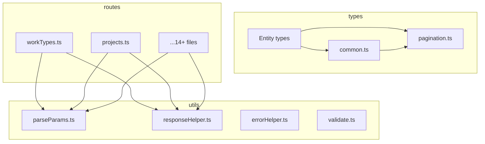

# Design Document: backend-common-utils

## Overview

**Purpose**: Backend ルートファイルおよび型ファイルに散在する共通パターン（パスパラメータ解析、ページネーション応答構築、Location ヘッダー設定、Zod スキーマ定義）を共通ユーティリティモジュールに集約し、重複コードを解消する。

**Users**: バックエンド開発者がルートハンドラおよび型定義を実装する際に、共通モジュールを利用する。

**Impact**: 14+ ルートファイルと 10+ 型ファイルの import を変更し、ローカル定義を共通モジュール参照に置き換える。API レスポンスの外部契約は一切変更しない。

### Goals
- 14 ルートファイルの `parseIntParam` 重複を解消（~110 行削減）
- 12 ルートファイルのページネーション応答構築重複を解消（~96 行削減）
- 7 ルートファイルの Location ヘッダー手動構築を解消（~14 行削減）
- 10+ 型ファイルの共通 Zod スキーマ重複を解消（~200 行削減）
- 全既存テストのパスを維持

### Non-Goals
- サービス層・データ層のリファクタリング（Phase 3 で対応）
- Transform 層の簡素化（Phase 2 で対応）
- フロントエンドの共通化（別 spec で対応）
- API レスポンス形式の変更
- 新規エンドポイントの追加

## Architecture

### Existing Architecture Analysis

**現行のレイヤー構造**:
```
routes/ → services/ → data/
                    → transform/
types/ （各レイヤーで参照）
utils/ （errorHelper.ts, validate.ts）
```

**現行の制約**:
- レイヤー間の依存方向: routes → services → data（逆方向禁止）
- `utils/` は全レイヤーから参照可能
- `types/` は全レイヤーから参照可能
- `@/` エイリアスによる絶対パスインポート

**対処する技術的負債**:
- `parseIntParam` の 2 バリアント混在（`string` vs `string | undefined`）
- `yearMonthSchema` の 4 バリエーション（バリデーション強度の不統一）
- `businessUnitCodeSchema` の regex 有無の不統一

### Architecture Pattern & Boundary Map



**Architecture Integration**:
- **Selected pattern**: Extract Method — 既存関数をユーティリティモジュールに抽出
- **Domain boundaries**: `utils/` は横断的関心事（パラメータ解析、レスポンス構築）、`types/` はスキーマ定義
- **Existing patterns preserved**: レイヤード構造、`@/` インポート、RFC 9457 エラー処理
- **New components rationale**: 責務別に 3 ファイルを新規作成（parseParams.ts, responseHelper.ts, common.ts）
- **Steering compliance**: `utils/` と `types/` の既存配置パターンに準拠

### Technology Stack

| Layer | Choice / Version | Role in Feature | Notes |
|-------|------------------|-----------------|-------|
| Backend | Hono v4 | Context 型、HTTPException | 既存依存。新規追加なし |
| Validation | Zod v4 | 共通スキーマ定義 | 既存依存。新規追加なし |
| Testing | Vitest v4 | ユニットテスト | 既存依存。新規追加なし |

新規外部依存なし。全て既存スタック内で完結。

## Requirements Traceability

| Requirement | Summary | Components | Interfaces |
|-------------|---------|------------|------------|
| 1.1-1.4 | parseIntParam 統一 | `utils/parseParams.ts` | `parseIntParam` 関数 |
| 1.5 | 14 ルートからローカル定義を削除 | 14 ルートファイル | import 変更のみ |
| 2.1-2.4 | ページネーション応答ヘルパー | `utils/responseHelper.ts` | `buildPaginatedResponse` 関数 |
| 2.5 | 12 ルートの一覧エンドポイント置換 | 12 ルートファイル | 呼び出し変更のみ |
| 3.1-3.2 | Location ヘッダーヘルパー | `utils/responseHelper.ts` | `setLocationHeader` 関数 |
| 3.3 | 7 ルートの POST ハンドラ置換 | 7 ルートファイル | 呼び出し変更のみ |
| 4.1-4.4 | yearMonthSchema 集約 | `types/common.ts` | `yearMonthSchema` |
| 5.1-5.2 | businessUnitCodeSchema 集約 | `types/common.ts` | `businessUnitCodeSchema` |
| 6.1-6.3 | colorCodeSchema 集約 | `types/common.ts` | `colorCodeSchema` |
| 7.1-7.2 | includeDisabled フィルタ集約 | `types/common.ts` | `includeDisabledFilterSchema` |
| 8.1-8.5 | 後方互換性・テスト | 全テストファイル | 既存テスト + 新規テスト |

## Components and Interfaces

| Component | Domain/Layer | Intent | Req Coverage | Key Dependencies | Contracts |
|-----------|-------------|--------|--------------|-----------------|-----------|
| `parseParams.ts` | utils | パスパラメータの型安全な解析 | 1.1-1.6 | HTTPException (P0) | Service |
| `responseHelper.ts` | utils | ページネーション応答と Location ヘッダーの構築 | 2.1-2.6, 3.1-3.4 | Hono Context (P0) | Service |
| `common.ts` | types | 共通 Zod スキーマの単一定義 | 4.1-4.6, 5.1-5.4, 6.1-6.5, 7.1-7.4 | Zod (P0), pagination.ts (P1) | Service |

### Utils Layer

#### parseParams.ts

| Field | Detail |
|-------|--------|
| Intent | パスパラメータの整数パースと妥当性検証を単一関数で提供 |
| Requirements | 1.1, 1.2, 1.3, 1.4, 1.5, 1.6 |

**Responsibilities & Constraints**
- パスパラメータの `string | undefined` → `number` 変換
- 不正入力に対する一貫した HTTPException(422) スロー
- 正の整数のみを受理（0 以下は拒否）

**Dependencies**
- External: `hono/http-exception` — HTTPException クラス (P0)

**Contracts**: Service [x]

##### Service Interface

```typescript
/**
 * パスパラメータを正の整数にパースする。
 * undefined、空文字、NaN、0以下の場合は HTTPException(422) をスローする。
 */
function parseIntParam(value: string | undefined, name: string): number;
```

- Preconditions: なし
- Postconditions: 返り値は 1 以上の整数
- Invariants: HTTPException(422) のメッセージ形式が統一されている

**Implementation Notes**
- Integration: 14 ルートファイルのローカル `parseIntParam` を削除し、`import { parseIntParam } from "@/utils/parseParams"` に置換
- Validation: `undefined` / 空文字チェック → `parseInt(value, 10)` → `Number.isNaN` + `<= 0` チェック
- Risks: なし（純粋な Extract Method）

---

#### responseHelper.ts

| Field | Detail |
|-------|--------|
| Intent | ページネーション応答構築と Location ヘッダー設定のヘルパーを提供 |
| Requirements | 2.1, 2.2, 2.3, 2.4, 2.5, 2.6, 3.1, 3.2, 3.3, 3.4 |

**Responsibilities & Constraints**
- `{ data, meta: { pagination } }` 構造のオブジェクト生成
- `totalPages` の算出（`Math.ceil(totalCount / pageSize)`）
- Hono Context への Location ヘッダー設定

**Dependencies**
- External: `hono` — Context 型 (P0)

**Contracts**: Service [x]

##### Service Interface

```typescript
/**
 * ページネーション付きレスポンスオブジェクトを構築する。
 */
interface PaginationParams {
  page: number;
  pageSize: number;
}

interface PaginatedResult<T> {
  items: T[];
  totalCount: number;
}

interface PaginatedResponse<T> {
  data: T[];
  meta: {
    pagination: {
      currentPage: number;
      pageSize: number;
      totalItems: number;
      totalPages: number;
    };
  };
}

function buildPaginatedResponse<T>(
  result: PaginatedResult<T>,
  params: PaginationParams
): PaginatedResponse<T>;

/**
 * リソース作成後の Location ヘッダーを設定する。
 */
function setLocationHeader(
  c: Context,
  basePath: string,
  resourceId: string | number
): void;
```

- Preconditions (`buildPaginatedResponse`): `params.pageSize > 0`
- Postconditions (`buildPaginatedResponse`): `totalPages >= 0`、`data` は `result.items` と同一参照
- Preconditions (`setLocationHeader`): `basePath` は `/` で始まる
- Postconditions (`setLocationHeader`): `Location` ヘッダーが `${basePath}/${resourceId}` に設定される

**Implementation Notes**
- Integration: 12 ルートファイルの `c.json({ data: result.items, meta: { pagination: {...} } }, 200)` を `c.json(buildPaginatedResponse(result, { page, pageSize }), 200)` に置換。7 ルートの `c.header("Location", ...)` を `setLocationHeader(c, basePath, id)` に置換
- Validation: `pageSize` が 0 の場合のゼロ除算を考慮（`paginationQuerySchema` が `min(1)` を保証するため実質的には発生しない）
- Risks: なし

---

### Types Layer

#### common.ts

| Field | Detail |
|-------|--------|
| Intent | 複数型ファイルで重複する Zod スキーマを単一モジュールで定義 |
| Requirements | 4.1-4.6, 5.1-5.4, 6.1-6.5, 7.1-7.4 |

**Responsibilities & Constraints**
- `yearMonthSchema`: YYYYMM 形式の 6 桁文字列バリデーション（月範囲 01-12）
- `businessUnitCodeSchema`: 1-20 文字の英数字・ハイフン・アンダースコア
- `colorCodeSchema`: `#` + 6 桁 16 進数カラーコード
- `includeDisabledFilterSchema`: ソフトデリート済みレコードの包含フラグ

**Dependencies**
- External: `zod` — Zod v4 (P0)
- Inbound: `types/pagination.ts` — `paginationQuerySchema` を参照する型ファイルが `common.ts` と組み合わせて使用 (P1)

**Contracts**: Service [x]

##### Service Interface

```typescript
import { z } from "zod";

/**
 * YYYYMM 形式の年月スキーマ。6桁数字 + 月範囲 01-12 を検証。
 */
const yearMonthSchema: z.ZodString; // with .regex() and .refine()

/**
 * 事業部コードスキーマ。1-20文字、英数字・ハイフン・アンダースコアのみ。
 */
const businessUnitCodeSchema: z.ZodString; // with .min(1).max(20).regex()

/**
 * カラーコードスキーマ。# + 6桁16進数。
 */
const colorCodeSchema: z.ZodString; // with .regex()

/**
 * ソフトデリート済みレコード包含フィルタ。デフォルト false。
 */
const includeDisabledFilterSchema: z.ZodDefault<z.ZodBoolean>;

// 導出型
type YearMonth = z.infer<typeof yearMonthSchema>;
type BusinessUnitCode = z.infer<typeof businessUnitCodeSchema>;
type ColorCode = z.infer<typeof colorCodeSchema>;
```

- Preconditions: なし
- Postconditions: 各スキーマは Zod の `safeParse` / `parse` で使用可能
- Invariants: エラーメッセージは英語で統一（既存パターンに準拠）

**Implementation Notes**
- Integration: 7 型ファイルから `yearMonthSchema` のローカル定義を削除し `import { yearMonthSchema } from "@/types/common"` に置換。同様に businessUnitCodeSchema（4 ファイル）、colorCodeSchema（2 ファイル）、includeDisabledFilterSchema（10 ファイル）を置換
- Validation: `yearMonthSchema` は最も厳密なバリアント（regex + refine）に統一。`businessUnitCodeSchema` は regex パターン付きに統一
- Risks: `businessUnitCodeSchema` に regex を追加することで、既存 DB データに regex 非合致のレコードが存在する場合に影響あり。実装時に DB データを確認すること

## Error Handling

### Error Strategy

既存の RFC 9457 エラー処理パイプラインをそのまま利用する。新規コンポーネントは以下のエラーパターンに従う:

- `parseIntParam`: `HTTPException(422)` をスロー → グローバルエラーハンドラが RFC 9457 形式に変換
- `buildPaginatedResponse`: エラーなし（入力は既にバリデーション済み）
- `setLocationHeader`: エラーなし（副作用のみ）
- 共通 Zod スキーマ: `zValidator` ミドルウェア経由でバリデーション → `validate.ts` が RFC 9457 形式に変換

### Error Categories and Responses

**User Errors (422)**:
- `parseIntParam` に不正値が渡された場合: `HTTPException(422, { message: "Invalid {name}: must be a positive integer" })` または `HTTPException(422, { message: "Missing required parameter: {name}" })`

エラーメッセージの形式は既存実装と同一。グローバルエラーハンドラの変更なし。

## Testing Strategy

### Unit Tests

テストファイル配置: `__tests__/utils/parseParams.test.ts`, `__tests__/utils/responseHelper.test.ts`, `__tests__/types/common.test.ts`

**parseParams.test.ts**:
1. 正常な正の整数文字列で number を返す
2. `undefined` で HTTPException(422) をスロー
3. 空文字で HTTPException(422) をスロー
4. NaN 値（"abc"）で HTTPException(422) をスロー
5. 0 以下の値で HTTPException(422) をスロー
6. 小数文字列（"1.5"）の動作確認（`parseInt` は整数部のみ取得）

**responseHelper.test.ts**:
1. `buildPaginatedResponse` が正しい JSON 構造を返す
2. `totalPages` が `Math.ceil(totalCount / pageSize)` で算出される
3. 空配列（0 件）で `totalPages: 0` を返す
4. `setLocationHeader` が正しい Location ヘッダーを設定する
5. `setLocationHeader` がパスとIDを正しく結合する

**common.test.ts**:
1. `yearMonthSchema` — 正常値（"202601"）を受理
2. `yearMonthSchema` — 不正月（"202613"）を拒否
3. `yearMonthSchema` — 不正形式（"2026-01"）を拒否
4. `businessUnitCodeSchema` — 正常値（"BU-001"）を受理
5. `businessUnitCodeSchema` — 不正文字（"BU 001!"）を拒否
6. `businessUnitCodeSchema` — 空文字を拒否、21 文字以上を拒否
7. `colorCodeSchema` — 正常値（"#FF5733"）を受理
8. `colorCodeSchema` — 不正形式（"FF5733", "#GGG"）を拒否
9. `includeDisabledFilterSchema` — デフォルト値 false を確認
10. `includeDisabledFilterSchema` — `true` / `"true"` の coerce を確認

### Regression Tests

既存の 24+ ルートテストおよび 13 型テストを全件実行し、リファクタリング前後で結果が同一であることを確認する。新規テストの追加は上記ユニットテストのみ。
