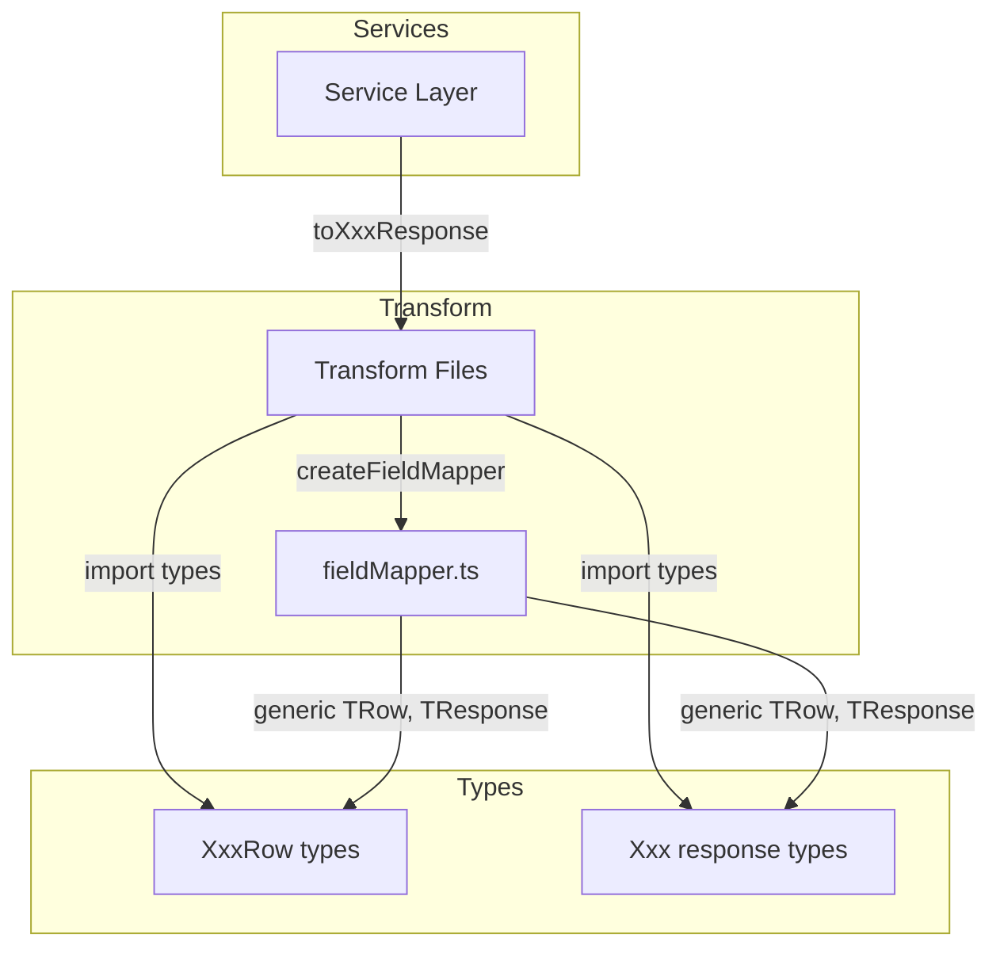

# Technical Design: Backend Transform 層の簡素化

## Overview

**Purpose**: Backend Transform 層（21ファイル, ~170行）の機械的フィールドマッピングを汎用マッパーユーティリティに置き換え、ボイラープレートを削減する。

**Users**: バックエンド開発者が新規エンティティ追加時に Transform の手書きコードを最小化できる。

**Impact**: 既存の20個の Transform ファイルを汎用マッパー定義に簡素化。API レスポンスの振る舞いは一切変更しない。

### Goals

- `utils/fieldMapper.ts` に型安全な汎用フィールドマッパーを提供する
- 純粋マッピング型 Transform（16ファイル）のボイラープレートを排除する
- カスタム変換付き Transform（4ファイル）も汎用マッパーで対応する
- 既存のエクスポートシグネチャとサービス層の呼び出しコードを一切変更しない

### Non-Goals

- `standardEffortMasterTransform.ts`（複合ロジック型）の移行
- サービス層・ルート層のリファクタリング
- 新規テストの大量追加（既存テストの維持のみ）
- Transform ファイル自体の削除（汎用マッパー呼び出しに簡素化するが、ファイルは維持）

## Architecture

### Existing Architecture Analysis

現在の Transform 層は routes → services → data のレイヤードアーキテクチャにおいて、data 層が返す `XxxRow`（snake_case）をサービス層が API レスポンス型 `Xxx`（camelCase）に変換する際に使用される。

- **呼び出しパターン**: `toXxxResponse(row)` / `.map(toXxxResponse)` で100%統一
- **インポートパス**: `import { toXxxResponse } from "@/transform/xxxTransform"`
- **依存方向**: services → transform → types（逆方向なし）

### Architecture Pattern & Boundary Map



**Architecture Integration**:
- **Selected pattern**: Factory パターン（`createFieldMapper` がマッピング定義から変換関数を生成）
- **Domain boundaries**: Transform 層内の変更のみ。utils に新規ファイル1つ追加
- **Existing patterns preserved**: エクスポートシグネチャ維持、レイヤー依存方向維持
- **New components rationale**: `fieldMapper.ts` — 20ファイルの共通パターンを1箇所に集約
- **Steering compliance**: TypeScript strict mode、`any` 型禁止、レイヤー依存方向の原則を遵守

### Technology Stack

| Layer | Choice / Version | Role in Feature | Notes |
|-------|------------------|-----------------|-------|
| Backend | TypeScript 5.9.x (strict) | 型安全なマッピング定義 | mapped types / conditional types 活用 |
| Testing | Vitest v4 | 既存テスト維持 + fieldMapper ユニットテスト | globals 有効 |

## Requirements Traceability

| Requirement | Summary | Components | Interfaces | Flows |
|-------------|---------|------------|------------|-------|
| 1.1–1.6 | 汎用フィールドマッパー提供 | fieldMapper.ts | `createFieldMapper<TRow, TResponse>` | — |
| 2.1–2.3 | カスタム変換サポート | fieldMapper.ts | `FieldMappingEntry` union 型 | — |
| 3.1–3.4 | 既存 Transform 移行 | 20 Transform ファイル | 既存シグネチャ維持 | — |
| 4.1–4.3 | 複合ロジック保全 | — (対象外) | — | — |
| 5.1–5.4 | 後方互換性保証 | fieldMapper.test.ts | — | 既存テストパス |

## Components and Interfaces

| Component | Domain/Layer | Intent | Req Coverage | Key Dependencies | Contracts |
|-----------|-------------|--------|--------------|------------------|-----------|
| `fieldMapper.ts` | utils | 宣言的マッピング定義から変換関数を生成 | 1.1–1.6, 2.1–2.3 | TypeScript 型システム (P0) | Service |
| 20 Transform files | transform | 各エンティティの Row→Response マッピング定義 | 3.1–3.4 | fieldMapper.ts (P0) | Service |
| `fieldMapper.test.ts` | tests | fieldMapper のユニットテスト | 5.1–5.4 | Vitest (P0) | — |

### Utils Layer

#### fieldMapper.ts

| Field | Detail |
|-------|--------|
| Intent | Row 型から Response 型への変換関数を宣言的マッピング定義から生成する |
| Requirements | 1.1, 1.2, 1.3, 1.4, 1.5, 1.6, 2.1, 2.2, 2.3 |

**Responsibilities & Constraints**
- マッピング定義オブジェクトを受け取り、`(row: TRow) => TResponse` 関数を返す
- `Date` インスタンスをランタイムで自動検出し `.toISOString()` に変換する
- `null` / `undefined` の Date フィールドは `null` を返す
- Response 型のすべてのキーがマッピング定義に含まれることをコンパイル時に強制する
- Row に存在しないフィールドを Response に含めないことを型で保証する

**Dependencies**
- External: TypeScript 型システム — mapped types / conditional types (P0)

**Contracts**: Service [x]

##### Service Interface

```typescript
/** フィールドマッピングエントリの型 */

// 直接マッピング: Row のキー名を指定（snake_case → camelCase は自動）
// Date 型フィールドは自動で .toISOString() に変換される
type DirectMapping<TRow> = keyof TRow & string;

// カスタム変換: Row の特定フィールドを変換関数で加工
// TKey でフィールドを絞り込むことで、transform の引数型が正確に推論される
interface TransformMapping<TRow, TKey extends keyof TRow, TValue> {
  field: TKey;
  transform: (value: TRow[TKey]) => TValue;
}

// 計算フィールド: Row 全体から値を算出（ネスト構造等）
interface ComputedMapping<TRow, TValue> {
  computed: (row: TRow) => TValue;
}

// マッピング定義: Response の各キーに対するエントリ
type FieldMappingEntry<TRow, TValue> =
  | DirectMapping<TRow>
  | TransformMapping<TRow, keyof TRow, TValue>
  | ComputedMapping<TRow, TValue>;

// マッピング定義全体: Response のすべてのキーを網羅する Record
type FieldMapping<TRow, TResponse> = {
  [K in keyof TResponse]: FieldMappingEntry<TRow, TResponse[K]>;
};

// ファクトリ関数
function createFieldMapper<TRow, TResponse>(
  mapping: FieldMapping<TRow, TResponse>
): (row: TRow) => TResponse;

// Date → ISO 文字列変換ヘルパー（オプション: 明示的に使いたい場合）
function dateToISO(value: Date): string;
function nullableDateToISO(value: Date | null | undefined): string | null;
```

- **Preconditions**: `mapping` は `TResponse` のすべてのキーを網羅する
- **Postconditions**: 返された関数は `TRow` を受け取り `TResponse` を返す。Date フィールドは ISO 8601 文字列に変換済み
- **Invariants**: マッピング定義に存在しない Row フィールドは Response に含まれない

**Implementation Notes**
- `createFieldMapper` 内部で `Object.entries(mapping)` をイテレートし、各エントリ型に応じて値を解決する
- Date 自動変換: `value instanceof Date` で判定し `.toISOString()` を適用。`null` / `undefined` は `null` を返す
- `computed` エントリは `row` 全体を受け取るため、ネスト構造や複数フィールド参照に対応可能
- パフォーマンス: マッピング定義の解析は `createFieldMapper` 呼び出し時に1回のみ。変換関数自体は軽量なオブジェクト構築のみ

### Transform Layer（移行パターン）

各 Transform ファイルは以下のパターンで移行される。ファイル自体は維持し、エクスポートシグネチャは不変。

#### Cat.1: 純粋マッピング型（16ファイル）

移行前:
```typescript
// businessUnitTransform.ts
export function toBusinessUnitResponse(row: BusinessUnitRow): BusinessUnit {
  return {
    businessUnitCode: row.business_unit_code,
    name: row.name,
    displayOrder: row.display_order,
    createdAt: row.created_at.toISOString(),
    updatedAt: row.updated_at.toISOString(),
  };
}
```

移行後:
```typescript
// businessUnitTransform.ts
import { createFieldMapper } from "@/utils/fieldMapper";
import type { BusinessUnit, BusinessUnitRow } from "@/types/businessUnit";

export const toBusinessUnitResponse = createFieldMapper<BusinessUnitRow, BusinessUnit>({
  businessUnitCode: "business_unit_code",
  name: "name",
  displayOrder: "display_order",
  createdAt: "created_at",    // Date 自動変換
  updatedAt: "updated_at",    // Date 自動変換
});
```

nullable Date を含むファイル（`capacityScenario`, `headcountPlanCase`, `indirectWorkCase`, `project` 等）:
```typescript
export const toCapacityScenarioResponse = createFieldMapper<CapacityScenarioRow, CapacityScenario>({
  // ... 通常フィールド ...
  deletedAt: "deleted_at",    // Date | null → string | null 自動変換
});
```

#### Cat.2: カスタム変換付き（4ファイル）

**`projectTransform.ts`** — `toLowerCase`:
```typescript
export const toProjectResponse = createFieldMapper<ProjectRow, Project>({
  // ... 通常フィールド ...
  status: { field: "status", transform: (v) => v.toLowerCase() },
  deletedAt: "deleted_at",
});
```

**`chartViewIndirectWorkItemTransform.ts`** — boolean coercion:
```typescript
export const toChartViewIndirectWorkItemResponse = createFieldMapper<
  ChartViewIndirectWorkItemRow,
  ChartViewIndirectWorkItem
>({
  // ... 通常フィールド ...
  isVisible: { field: "is_visible", transform: (v) => !!v },
});
```

**`chartViewProjectItemTransform.ts`** — ネスト構造:
```typescript
export const toChartViewProjectItemResponse = createFieldMapper<
  ChartViewProjectItemRow,
  ChartViewProjectItem
>({
  // ... 通常フィールド ...
  isVisible: { field: "is_visible", transform: (v) => !!v },
  color: { field: "color_code", transform: (v) => v ?? null },
  project: {
    computed: (row) => ({
      projectCode: row.project_code,
      projectName: row.project_name,
    }),
  },
  projectCase: {
    computed: (row) =>
      row.project_case_id !== null ? { caseName: row.case_name! } : null,
  },
});
```

**`chartViewTransform.ts`** — JSON.parse:
```typescript
export const toChartViewResponse = createFieldMapper<ChartViewRow, ChartView>({
  // ... 通常フィールド ...
  businessUnitCodes: {
    computed: (row) => parseBusinessUnitCodes(row.business_unit_codes),
  },
});
// parseBusinessUnitCodes はファイル内のローカル関数として維持
```

#### Cat.3: 対象外（1ファイル）

`standardEffortMasterTransform.ts` は移行対象外。3つの変換関数が相互参照しており、汎用マッパーの利点が薄い。

## Testing Strategy

### Unit Tests

`__tests__/utils/fieldMapper.test.ts`:

1. **直接マッピング**: snake_case キーから camelCase フィールドへの変換を検証
2. **Date 自動変換**: `Date` オブジェクト → ISO 8601 文字列への変換を検証
3. **Nullable Date**: `null` の Date フィールドが `null` として出力されることを検証
4. **カスタム変換**: `transform` 関数が正しく適用されることを検証
5. **Computed フィールド**: `computed` 関数が Row 全体を受け取り正しい値を返すことを検証
6. **フィールド除外**: マッピングに含まれない Row フィールドが Response に含まれないことを検証

### Integration Tests（既存テスト維持）

既存の7つの Transform テストファイルが移行後もすべてパスすることを確認:
- `businessUnitTransform.test.ts`
- `projectTransform.test.ts`
- `projectTypeTransform.test.ts`
- `workTypeTransform.test.ts`
- `chartColorPaletteTransform.test.ts`
- `indirectWorkTypeRatioTransform.test.ts`
- `standardEffortMasterTransform.test.ts`（変更なし）

## Migration Strategy

### Phase 1: fieldMapper ユーティリティ作成
- `utils/fieldMapper.ts` の実装 + テスト
- 既存コードへの影響なし

### Phase 2: Cat.1 Transform 移行（16ファイル）
- 純粋マッピング型を一括移行
- 各ファイルの変換結果が同一であることをテスト/ビルドで確認

### Phase 3: Cat.2 Transform 移行（4ファイル）
- カスタム変換付きファイルを移行
- ネスト構造・boolean coercion・JSON.parse の動作を確認

### `function` → `const` 宣言への変更について

移行後の Transform は `export const toXxxResponse = createFieldMapper(...)` となり、既存の `export function toXxxResponse(...)` から宣言形式が変わる。TypeScript の型システム上、呼び出し側（`toXxxResponse(row)` / `.map(toXxxResponse)`）は完全に互換であり、サービス層のコード変更は不要。`.name` プロパティや hoisting の挙動が異なるが、Transform 関数はモジュールトップレベルでのみ使用されるため影響はない。

### Rollback Strategy
- 各 Phase で個別にコミット。問題発生時は Phase 単位で revert 可能
- Transform ファイルのエクスポートシグネチャが不変のため、サービス層への影響なし
