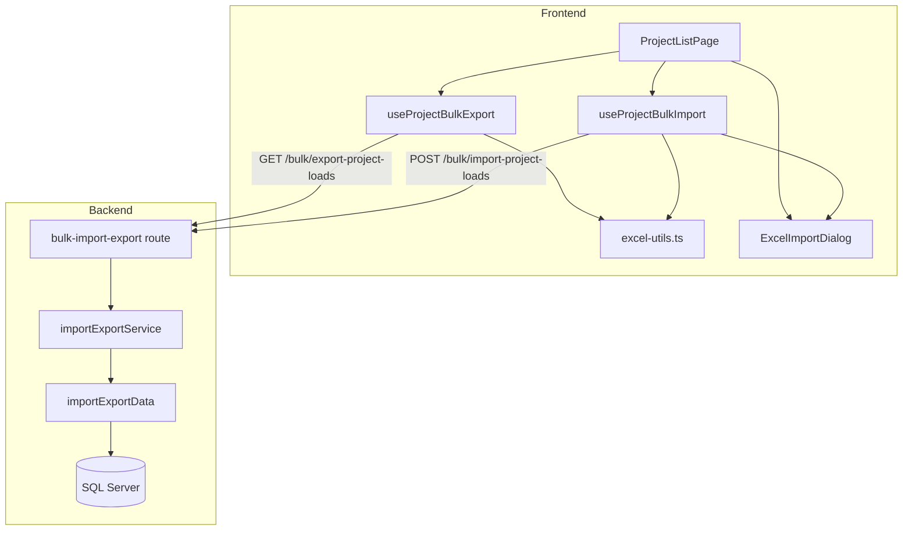
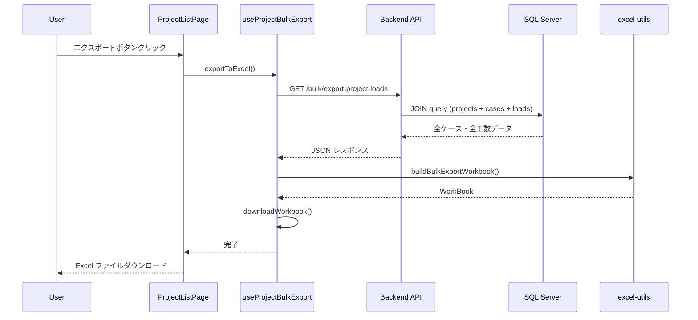
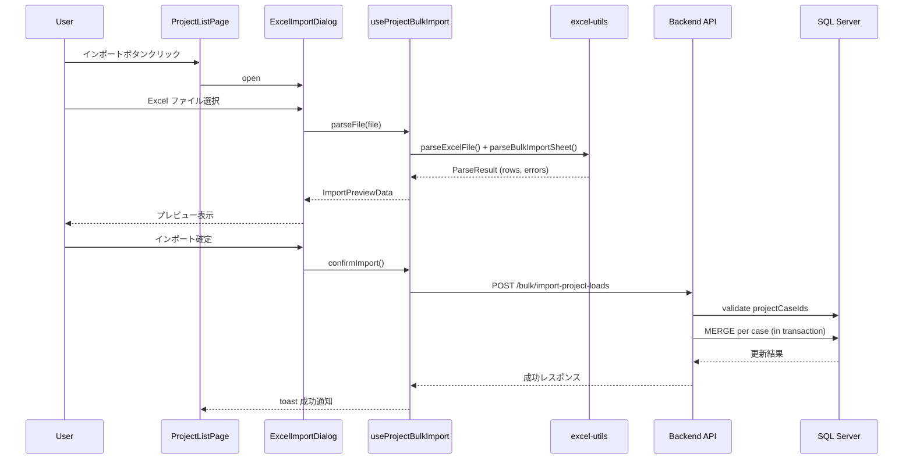
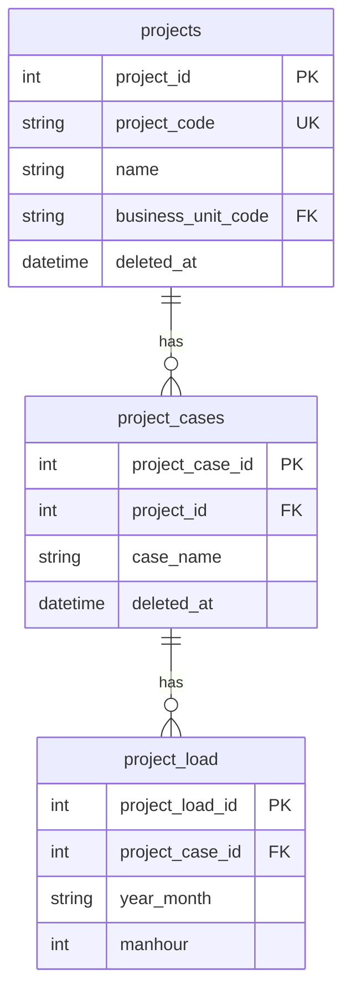

# Design Document

## Overview

**Purpose**: 案件（projects）・ケース（cases）・月別工数データの一括 Excel 入出力機能を提供し、大量データの一括確認・編集・反映を効率化する。

**Users**: プロジェクトマネージャー・事業部リーダーが、全案件の工数データを Excel ファイルで一括管理するワークフローで利用する。

**Impact**: 案件一覧画面にエクスポート/インポートボタンを追加し、バックエンドに一括データ取得・一括更新 API を新設する。既存の個別ケース単位の Excel 入出力（`excel-import-export` spec）には影響しない。

### Goals
- 全案件・全ケースの月別工数データを Excel ファイルとして一括ダウンロードできる
- Excel ファイルを編集し、インポートで工数データを一括更新できる（ラウンドトリップ互換性）
- 行単位のバリデーションエラー表示でデータ整合性を担保する

### Non-Goals
- 案件やケース自体の新規作成・削除（インポートは既存ケースの工数データ更新のみ）
- 間接工数の一括入出力（本 spec のスコープ外）
- バックエンドでの Excel ファイル生成・パース（フロントエンドの既存インフラを活用）

## Architecture

### Existing Architecture Analysis

既存システムは以下のパターンで構築されている:

- **バックエンド**: Hono + Zod バリデーション + mssql による レイヤードアーキテクチャ（routes → services → data）
- **フロントエンド**: TanStack Router + TanStack Query + feature-first 構成
- **Excel 入出力**: フロントエンドの `excel-utils.ts` + `ExcelImportDialog.tsx` で完結。バックエンドは JSON API のみ
- **Bulk 操作**: ケース単位の `PUT /bulk` エンドポイントが `projectLoads` と `monthlyIndirectWorkLoads` に存在

本機能はこれらの既存パターンを踏襲し、横断的な一括操作用のエンドポイントとフロントエンド hooks を追加する。

### Architecture Pattern & Boundary Map



**Architecture Integration**:
- **Selected pattern**: ハイブリッド方式 — バックエンドは JSON API（一括データ取得・一括更新）、フロントエンドで Excel 生成/パース（詳細は `research.md` 参照）
- **Domain boundary**: `features/projects/` 内に一括入出力の hooks を配置。既存の `case-study` feature には影響なし
- **Existing patterns preserved**: レイヤードアーキテクチャ、Zod バリデーション、RFC 9457 エラーレスポンス、`excel-utils.ts` のユーティリティ群
- **New components rationale**: 横断的な JOIN クエリと複数ケースへの一括更新は既存の個別 CRUD とは責務が異なるため、専用の route/service/data を新設

### Technology Stack

| Layer | Choice / Version | Role in Feature | Notes |
|-------|------------------|-----------------|-------|
| Frontend | React 19, TanStack Query, xlsx ^0.18.5 | Excel 生成/パース、API 呼び出し、UI | 既存依存のみ、追加パッケージなし |
| Backend | Hono v4, Zod v4, mssql v12 | JSON API、バリデーション、DB アクセス | 既存依存のみ、追加パッケージなし |
| Data | SQL Server (mssql) | projects + project_cases + project_load の JOIN クエリ | 既存テーブル、スキーマ変更なし |

## System Flows

### エクスポートフロー



### インポートフロー



**Key Decisions**:
- インポートの Excel パースとバリデーション（フォーマット・値範囲）はフロントエンドで実施
- キーコード（projectCaseId）の存在チェックと DB 更新はバックエンドで実施（トランザクション内）
- バリデーションエラーがある場合はインポート確定ボタンを無効化（フロントエンド側で制御）

## Requirements Traceability

| Requirement | Summary | Components | Interfaces | Flows |
|-------------|---------|------------|------------|-------|
| 1.1-1.7 | 一括エクスポート（UI + データ取得 + Excel 生成） | useProjectBulkExport, ProjectListPage | GET /bulk/export-project-loads | エクスポートフロー |
| 2.1-2.5 | エクスポート API | bulkRoute, importExportService, importExportData | GET /bulk/export-project-loads | エクスポートフロー |
| 3.1-3.6 | 一括インポート（UI + プレビュー + 確定） | useProjectBulkImport, ExcelImportDialog, ProjectListPage | POST /bulk/import-project-loads | インポートフロー |
| 4.1-4.6 | インポート API | bulkRoute, importExportService, importExportData | POST /bulk/import-project-loads | インポートフロー |
| 5.1-5.6 | バリデーション | useProjectBulkImport (FE), importExportService (BE) | - | インポートフロー |
| 6.1-6.6 | Excel フォーマット | buildBulkExportWorkbook, parseBulkImportSheet | - | 両フロー |
| 7.1-7.7 | フロントエンド UI | ProjectListPage, ExcelImportDialog | - | 両フロー |

## Components and Interfaces

| Component | Domain/Layer | Intent | Req Coverage | Key Dependencies | Contracts |
|-----------|--------------|--------|--------------|-----------------|-----------|
| bulkRoute | Backend / Route | `/bulk` プレフィックス配下のエクスポート・インポートエンドポイント | 2, 4 | importExportService (P0) | API |
| importExportService | Backend / Service | データ取得・バリデーション・一括更新のビジネスロジック | 2, 4, 5 | importExportData (P0), projectLoadData (P1) | Service |
| importExportData | Backend / Data | 横断的 JOIN クエリ・一括 MERGE | 2, 4 | mssql pool (P0) | - |
| importExport (types) | Backend / Types | Zod スキーマ・TypeScript 型定義 | 5, 6 | Zod (P0) | - |
| useProjectBulkExport | Frontend / Hook | エクスポートデータ取得 + Excel 生成 + ダウンロード | 1, 6 | excel-utils (P0), API client (P0) | - |
| useProjectBulkImport | Frontend / Hook | Excel パース + バリデーション + API 送信 | 3, 5, 6 | excel-utils (P0), ExcelImportDialog (P0), API client (P0) | - |
| ProjectListPage (拡張) | Frontend / Route | エクスポート/インポートボタンの配置 | 7 | useProjectBulkExport (P0), useProjectBulkImport (P0) | - |
| buildBulkExportWorkbook | Frontend / Util | 複数固定列対応の Excel ワークブック生成 | 6 | xlsx (P0) | - |
| parseBulkImportSheet | Frontend / Util | 複数固定列対応の Excel パース + バリデーション | 5, 6 | xlsx (P0) | - |

### Backend / Route

#### bulkRoute

| Field | Detail |
|-------|--------|
| Intent | `/bulk` プレフィックス配下に一括エクスポート・インポートのエンドポイントを提供 |
| Requirements | 2.1-2.5, 4.1-4.6 |

**Responsibilities & Constraints**
- `GET /bulk/export-project-loads`: 全案件・全ケースの工数データを JSON で返却
- `POST /bulk/import-project-loads`: パース済みデータを受信し、バリデーション + 一括更新を実行
- エラーレスポンスは RFC 9457 準拠
- ルートマウント: `app.route("/bulk", bulkRoute)` として `index.ts` に登録

**Dependencies**
- Inbound: Frontend API client (P0)
- Outbound: importExportService (P0)

**Contracts**: API [x]

##### API Contract

| Method | Endpoint | Request | Response | Errors |
|--------|----------|---------|----------|--------|
| GET | /bulk/export-project-loads | - | ExportDataResponse | 500 |
| POST | /bulk/import-project-loads | BulkImportRequest | BulkImportResponse | 422, 500 |

### Backend / Service

#### importExportService

| Field | Detail |
|-------|--------|
| Intent | エクスポート用データ集約とインポート時のバリデーション・一括更新 |
| Requirements | 2.1-2.5, 4.1-4.6, 5.1-5.6 |

**Responsibilities & Constraints**
- エクスポート: projects, project_cases, project_load を JOIN して構造化データを返却
- インポート: projectCaseId の存在チェック（FK 制約）、yearMonth/manhour のバリデーション、トランザクション内での一括 MERGE
- 削除済み案件・ケースはエクスポート対象外（`deleted_at IS NULL`）

**Dependencies**
- Inbound: importExportRoute (P0)
- Outbound: importExportData (P0)

**Contracts**: Service [x]

##### Service Interface

```typescript
interface ImportExportService {
  getExportData(): Promise<ExportDataResponse>;
  bulkImport(input: BulkImportInput): Promise<BulkImportResult>;
}
```

- Preconditions (bulkImport): 全 projectCaseId が有効（存在 + 未削除）
- Postconditions (bulkImport): 指定された全ケースの工数データが更新される（MERGE）
- Invariants: インポートは全ケース成功 or 全ロールバック（原子性）
- 重複行ルール: 同一 projectCaseId が複数行に存在する場合、あと勝ち（Excel 上で下にある行の値で上書き）。保存は実行するが、フロントエンドのプレビュー画面で重複警告を表示しユーザーに気づかせる

### Backend / Data

#### importExportData

| Field | Detail |
|-------|--------|
| Intent | 横断的データ取得クエリと一括 MERGE の実行 |
| Requirements | 2.1-2.2, 4.2, 4.5 |

**Responsibilities & Constraints**
- エクスポート用 JOIN クエリ: projects + project_cases + project_load
- インポート用 MERGE: 既存の `projectLoadData.bulkUpsert` パターンを踏襲
- projectCaseId の一括存在チェック
- 全操作をトランザクション内で実行

**Dependencies**
- Inbound: importExportService (P0)
- External: mssql pool (P0)

**Implementation Notes**
- エクスポートクエリは `WHERE p.deleted_at IS NULL AND pc.deleted_at IS NULL` でフィルタ
- MERGE SQL は既存 `projectLoadData.bulkUpsert` のパターンを再利用
- projectCaseId の存在チェックは `SELECT project_case_id FROM project_cases WHERE project_case_id IN (...) AND deleted_at IS NULL` で一括検証

### Backend / Types

#### importExport (types)

| Field | Detail |
|-------|--------|
| Intent | エクスポート/インポートの Zod スキーマと TypeScript 型定義 |
| Requirements | 5.1-5.4, 6.1-6.5 |

```typescript
/** エクスポートレスポンス */
interface ExportDataResponse {
  data: ExportRow[];
  yearMonths: string[]; // 全レコードに含まれる年月リスト（昇順）
}

interface ExportRow {
  projectCaseId: number;
  projectName: string;
  caseName: string;
  loads: Array<{ yearMonth: string; manhour: number }>;
}

/** インポートリクエスト */
interface BulkImportInput {
  items: BulkImportItem[];
}

interface BulkImportItem {
  projectCaseId: number;
  yearMonth: string;  // YYYYMM
  manhour: number;    // 0-99999999
}

/** インポートレスポンス */
interface BulkImportResult {
  updatedCases: number;
  updatedRecords: number;
}
```

**Zod Schemas**:
- `bulkImportItemSchema`: projectCaseId (positive int), yearMonth (yearMonthSchema), manhour (0-99999999)
- `bulkImportSchema`: `{ items: z.array(bulkImportItemSchema).min(1) }`

### Frontend / Hooks

#### useProjectBulkExport

| Field | Detail |
|-------|--------|
| Intent | エクスポートデータの取得 + Excel ファイル生成 + ダウンロード |
| Requirements | 1.1-1.7, 6.1-6.5 |

**Responsibilities & Constraints**
- `GET /project-loads/export-data` でデータ取得
- `buildBulkExportWorkbook()` で Excel 生成（3固定列 + 動的年月列）
- `downloadWorkbook()` でブラウザダウンロード
- エクスポート中はローディング状態を管理

**Dependencies**
- Outbound: Backend export-data API (P0), excel-utils (P0)

```typescript
interface UseProjectBulkExportReturn {
  exportToExcel: () => Promise<void>;
  isExporting: boolean;
}
```

**Implementation Notes**
- 既存 `useProjectLoadExcelExport` のパターンを踏襲
- ファイル名: `案件工数一括_{YYYYMMDD}.xlsx`
- データが空の場合は `showWarningToast` で通知

#### useProjectBulkImport

| Field | Detail |
|-------|--------|
| Intent | Excel パース + フロントエンドバリデーション + API 送信 |
| Requirements | 3.1-3.6, 5.1-5.6, 6.1-6.5 |

**Responsibilities & Constraints**
- `parseExcelFile()` + `parseBulkImportSheet()` で Excel パース
- フロントエンドバリデーション: ヘッダーフォーマット、yearMonth 形式、manhour 範囲
- 重複 projectCaseId 検出: 同一キーコードが複数行に存在する場合、あと勝ちでマージし、プレビュー画面で警告表示（エラーではなく警告 — インポート確定は可能）
- `POST /bulk/import-project-loads` でバックエンドへ送信
- バックエンドバリデーション: projectCaseId 存在チェック（FK 制約）

**Dependencies**
- Outbound: Backend bulk-import API (P0), excel-utils (P0)
- Inbound: ExcelImportDialog (P0)

```typescript
interface UseProjectBulkImportReturn {
  parseFile: (file: File) => Promise<ImportPreviewData>;
  confirmImport: (data: ImportPreviewData) => Promise<void>;
  isImporting: boolean;
}
```

**Implementation Notes**
- 既存 `useProjectLoadExcelImport` のパターンを踏襲
- パース時に projectCaseId 列の存在を検証
- インポート成功後は projects 関連のクエリキャッシュを invalidate

### Frontend / Util

#### buildBulkExportWorkbook

| Field | Detail |
|-------|--------|
| Intent | 複数固定列（キーコード、案件名、ケース名）+ 動的年月列の Excel ワークブック生成 |
| Requirements | 6.1-6.5 |

```typescript
interface BulkExportSheetConfig {
  sheetName: string;
  fixedHeaders: string[];       // ["キーコード", "案件名", "ケース名"]
  yearMonths: string[];          // ["2024-01", "2024-02", ...]
  rows: BulkExportRow[];
}

interface BulkExportRow {
  fixedValues: (string | number)[];  // [projectCaseId, projectName, caseName]
  monthlyValues: number[];            // [manhour1, manhour2, ...]
}

function buildBulkExportWorkbook(config: BulkExportSheetConfig): Promise<WorkBook>;
```

**Implementation Notes**
- `excel-utils.ts` に追加。既存の `buildExportWorkbook` とは並立
- ヘッダー行: `[...fixedHeaders, ...yearMonths]`
- データ行: `[...fixedValues, ...monthlyValues]`

#### parseBulkImportSheet

| Field | Detail |
|-------|--------|
| Intent | 複数固定列対応の Excel パース + バリデーション |
| Requirements | 5.1-5.4 |

```typescript
interface BulkImportParseConfig {
  fixedColumnCount: number;       // 固定列数 (3: キーコード, 案件名, ケース名)
  parseYearMonth: (header: string) => string | null;
  validateRow: (row: BulkImportRow, rowIndex: number) => ValidationError[];
}

interface BulkImportRow {
  fixedValues: (string | number | null)[];  // [projectCaseId, projectName, caseName]
  monthlyValues: Map<string, number>;
}

interface BulkImportParseResult {
  rows: BulkImportRow[];
  yearMonths: string[];
  errors: ValidationError[];
  warnings: ValidationError[];  // 重複 projectCaseId 等の警告（保存は許可）
}

function parseBulkImportSheet(
  headers: string[],
  rawRows: (string | number | null)[][],
  config: BulkImportParseConfig,
): BulkImportParseResult;
```

**Implementation Notes**
- `excel-utils.ts` に追加。既存の `parseImportSheet` とは並立
- 固定列のバリデーション: キーコード（数値）の存在チェック
- 年月列以降は既存の manhour バリデーションを再利用
- 重複 projectCaseId 検出: 同一キーコードが複数行に存在する場合、下の行の値であと勝ちマージし、`warnings` として返却（errors とは別）。プレビュー画面で警告アイコン + メッセージを表示するが、インポート確定ボタンは無効化しない

### Frontend / Route (拡張)

#### ProjectListPage

| Field | Detail |
|-------|--------|
| Intent | エクスポート/インポートボタンを案件一覧画面に追加 |
| Requirements | 7.1-7.7 |

**Implementation Notes**
- `DataTableToolbar` の隣にエクスポート/インポートボタンを配置
- エクスポートボタン: `useProjectBulkExport` の `exportToExcel()` を呼び出し。ローディング中は disabled
- インポートボタン: ダイアログ open state を管理。`ExcelImportDialog` を表示
- `ExcelImportDialog` の `onFileParsed` に `useProjectBulkImport` の `parseFile` を、`onConfirm` に `confirmImport` を注入

## Data Models

### Domain Model

本機能で新しいエンティティは追加しない。既存のドメインモデルを横断的に読み書きする。



### Logical Data Model

- **エクスポートクエリ**: projects JOIN project_cases JOIN project_load（WHERE deleted_at IS NULL）
- **年月範囲**: 全 project_load の MIN/MAX year_month から動的算出
- **インポート更新**: project_case_id + year_month を複合キーとして MERGE（既存レコード更新 / 新規レコード挿入）

### Data Contracts & Integration

**エクスポート API レスポンス**:

```typescript
// GET /project-loads/export-data
{
  data: [
    {
      projectCaseId: 1,
      projectName: "プロジェクトA",
      caseName: "標準ケース",
      loads: [
        { yearMonth: "202401", manhour: 1000 },
        { yearMonth: "202402", manhour: 2000 }
      ]
    }
  ],
  yearMonths: ["202401", "202402", "202403"]
}
```

**インポート API リクエスト**:

```typescript
// POST /project-loads/bulk-import
{
  items: [
    { projectCaseId: 1, yearMonth: "202401", manhour: 1500 },
    { projectCaseId: 1, yearMonth: "202402", manhour: 2500 },
    { projectCaseId: 2, yearMonth: "202401", manhour: 800 }
  ]
}
```

**インポート API レスポンス（成功）**:

```typescript
// 200 OK
{
  data: {
    updatedCases: 2,
    updatedRecords: 3
  }
}
```

**インポート API レスポンス（バリデーションエラー）**:

```typescript
// 422 Unprocessable Entity (RFC 9457)
{
  type: "about:blank",
  title: "Validation Error",
  status: 422,
  detail: "インポートデータにバリデーションエラーがあります",
  errors: [
    {
      pointer: "/items/0/projectCaseId",
      keyword: "invalid_reference",
      message: "存在しないケースID: 999",
      params: { projectCaseId: 999 }
    }
  ]
}
```

## Excel Format Specification

### シート構成

| 列位置 | ヘッダー | 内容 | 型 | インポート時の用途 |
|--------|---------|------|-----|------------------|
| A | キーコード | projectCaseId | number | レコード識別（必須） |
| B | 案件名 | project name | string | 表示用（インポート時は無視） |
| C | ケース名 | case name | string | 表示用（インポート時は無視） |
| D〜 | YYYY-MM | 年月ヘッダー | string | 年月識別（動的列） |

- データ行: 各セルに manhour 値（整数、0 以上）
- 年月列は時系列昇順
- 空セルは 0 として扱う

### ラウンドトリップ互換性

エクスポートされた Excel を無編集でそのままインポートした場合、データは同一内容で上書きされる（冪等）。

## Error Handling

### Error Strategy

| 種別 | 検出場所 | 対応 | レベル |
|------|---------|------|--------|
| ファイル形式不正 | フロントエンド（ExcelImportDialog） | ファイル形式エラー表示 | Error |
| ヘッダーフォーマット不正 | フロントエンド（parseBulkImportSheet） | ヘッダーエラー表示（プレビュー画面） | Error |
| manhour 値範囲外 | フロントエンド（parseBulkImportSheet） | セル単位エラー表示（プレビュー画面） | Error |
| yearMonth 形式不正 | フロントエンド（parseBulkImportSheet） | 列ヘッダーエラー表示 | Error |
| 重複 projectCaseId 行 | フロントエンド（parseBulkImportSheet） | 警告表示（あと勝ちでマージ、インポートは許可） | Warning |
| キーコード不存在 | バックエンド（importExportService） | 422 エラー + 該当行情報 | Error |
| DB 更新失敗 | バックエンド（importExportData） | 500 エラー + トランザクションロールバック | Error |
| エクスポートデータ空 | フロントエンド（useProjectBulkExport） | Warning toast 表示 | Warning |

### Error Categories and Responses

- **User Errors (422)**: バリデーションエラー → RFC 9457 形式で行単位のエラー情報を返却。フロントエンドでプレビュー画面にエラー表示
- **System Errors (500)**: DB 接続/クエリ失敗 → トランザクションロールバック + toast エラー通知

## Testing Strategy

### Unit Tests
- `parseBulkImportSheet`: 正常パース、ヘッダー不正、manhour 範囲外、空行スキップ
- `buildBulkExportWorkbook`: 固定列 + 動的年月列の正しいシート生成
- `importExportService.bulkImport`: キーコード存在チェック、バリデーションエラー返却

### Integration Tests
- `GET /project-loads/export-data`: 全案件横断データの正しい JSON 返却
- `POST /project-loads/bulk-import`: 正常インポート、バリデーションエラー、トランザクションロールバック
- ラウンドトリップ: エクスポートデータ → インポートリクエスト変換 → DB 更新 → 再エクスポートで同一データ
