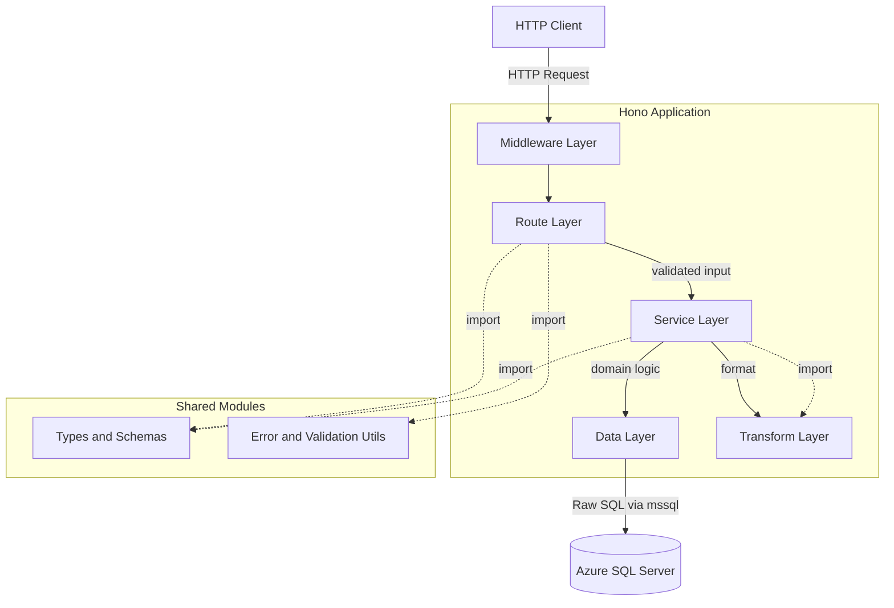
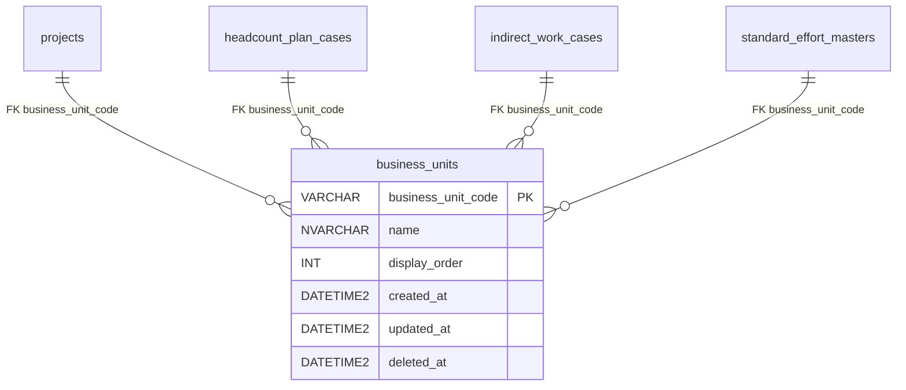

# Design Document: business-units-crud

## Overview

**Purpose**: `business_units` マスタテーブルに対する CRUD API を提供し、ビジネスユニット（組織単位）の管理を可能にする。

**Users**: フロントエンドアプリケーションおよび将来的な外部システム連携が、ビジネスユニットの参照・作成・更新・削除・復元の操作に利用する。

**Impact**: リポジトリ初の API 実装であり、DB 接続基盤、エラーハンドリング基盤、バリデーション基盤を含む。今後の他リソース CRUD（project_types, work_types 等）のテンプレートとなる。

### Goals
- `business_units` テーブルに対する完全な CRUD + 復元 API の提供
- 論理削除（ソフトデリート）対応
- RFC 9457 Problem Details 準拠のエラーレスポンス
- Hono + mssql（生 SQL）による API 基盤の確立

### Non-Goals
- 認証・認可（現フェーズでは対象外）
- フロントエンドの実装
- 他リソース（project_types, work_types, projects 等）の CRUD
- バッチ処理やイベント駆動

## Architecture

### Architecture Pattern & Boundary Map

レイヤードアーキテクチャを採用。`docs/rules/hono/crud-guide.md` および `docs/rules/folder-structure.md` に準拠する。



**Architecture Integration**:
- **Selected pattern**: レイヤードアーキテクチャ — CRUD ガイドで規定された routes → services → data の依存方向に従う
- **Domain boundaries**: ルート層はバリデーションとレスポンス返却のみ、サービス層はビジネスロジック、データ層は DB クエリ実行のみ
- **Existing patterns preserved**: なし（初回実装）
- **New components rationale**: 全レイヤーが新規。DB 接続・エラーヘルパー・バリデーションユーティリティは共通基盤として再利用可能に設計
- **Steering compliance**: `docs/rules/folder-structure.md`、`docs/rules/api-response.md`、`docs/rules/hono/` に完全準拠

### Technology Stack

| Layer | Choice / Version | Role in Feature | Notes |
|-------|------------------|-----------------|-------|
| Backend Framework | Hono + @hono/node-server | API ルーティング、ミドルウェア | CRUD ガイド準拠 |
| Validation | Zod + @hono/zod-validator | リクエストバリデーション | RFC 9457 エラー変換フック付き |
| DB Client | mssql (node-mssql) | SQL Server 接続 + コネクションプール + 生 SQL 実行 | ORM 不使用、パラメータ化クエリで SQL インジェクション防止 |
| Data / Storage | Azure SQL Server | 構築済み business_units テーブル | `.env` で接続情報管理 |
| Testing | Vitest | ユニットテスト・API テスト | `app.request()` パターン |
| Runtime | Node.js | サーバー実行環境 | |

## Requirements Traceability

| Requirement | Summary | Components | Interfaces | Flows |
|-------------|---------|------------|------------|-------|
| 1.1 | 一覧取得（論理削除除外、display_order昇順） | businessUnits route, businessUnitService, businessUnitData | GET /business-units | - |
| 1.2 | ページネーション | businessUnits route, businessUnitData | GET /business-units?page | - |
| 1.3 | 論理削除済み含むフィルタ | businessUnits route, businessUnitData | GET /business-units?filter | - |
| 1.4 | クエリバリデーションエラー | validate util | - | - |
| 2.1 | 単一取得 | businessUnits route, businessUnitService, businessUnitData | GET /business-units/:code | - |
| 2.2 | 存在しない場合 404 | businessUnitService | - | - |
| 3.1 | 新規作成 + 201 + Location | businessUnits route, businessUnitService, businessUnitData | POST /business-units | - |
| 3.2 | リクエストボディ定義 | businessUnit types | - | - |
| 3.3 | 重複チェック 409 | businessUnitService, businessUnitData | - | - |
| 3.4 | ボディバリデーションエラー | validate util | - | - |
| 4.1 | 更新 + 200 | businessUnits route, businessUnitService, businessUnitData | PUT /business-units/:code | - |
| 4.2 | 更新ボディ定義 | businessUnit types | - | - |
| 4.3 | updated_at 自動更新 | businessUnitData | - | - |
| 4.4 | 存在しない場合 404 | businessUnitService | - | - |
| 4.5 | ボディバリデーションエラー | validate util | - | - |
| 5.1 | 論理削除 + 204 | businessUnits route, businessUnitService, businessUnitData | DELETE /business-units/:code | 参照整合性チェック |
| 5.2 | 存在しない場合 404 | businessUnitService | - | - |
| 5.3 | 参照中 409 | businessUnitService, businessUnitData | - | 参照整合性チェック |
| 6.1 | 復元 + 200 | businessUnits route, businessUnitService, businessUnitData | POST .../actions/restore | - |
| 6.2 | 存在しない場合 404 | businessUnitService | - | - |
| 6.3 | 未削除の場合 409 | businessUnitService | - | - |
| 7.1 | 成功レスポンス構造 | businessUnits route | - | - |
| 7.2 | エラーレスポンス RFC 9457 | errorHelper util, グローバルエラーハンドラ | - | - |
| 7.3 | camelCase フィールド名 | businessUnitTransform | - | - |
| 7.4 | リソースフィールド定義 | businessUnit types, businessUnitTransform | - | - |
| 8.1 | businessUnitCode バリデーション | businessUnit types | - | - |
| 8.2 | name バリデーション | businessUnit types | - | - |
| 8.3 | displayOrder バリデーション | businessUnit types | - | - |
| 8.4 | 複数エラー一括返却 | validate util | - | - |

## Components and Interfaces

| Component | Domain/Layer | Intent | Req Coverage | Key Dependencies | Contracts |
|-----------|-------------|--------|--------------|------------------|-----------|
| businessUnits route | Route | CRUD エンドポイント定義 | 1.1-1.4, 2.1, 3.1, 4.1, 5.1, 6.1, 7.1 | businessUnitService (P0), validate (P0), types (P0) | API |
| businessUnitService | Service | ビジネスロジック | 2.2, 3.3, 4.4, 5.2-5.3, 6.2-6.3 | businessUnitData (P0), businessUnitTransform (P1) | Service |
| businessUnitData | Data | 生 SQL による DB クエリ実行 | 1.1-1.3, 2.1, 3.1, 4.1-4.3, 5.1, 6.1 | db client (P0) | Service |
| businessUnitTransform | Transform | DB行 ↔ API レスポンス変換 | 7.3, 7.4 | types (P1) | - |
| businessUnit types | Types | Zod スキーマ・型定義 | 3.2, 4.2, 8.1-8.3 | zod (P0) | - |
| pagination types | Types | ページネーション共通スキーマ | 1.2 | zod (P0) | - |
| validate util | Utils | RFC 9457 バリデーションフック | 1.4, 3.4, 4.5, 8.4 | zod-validator (P0) | - |
| errorHelper util | Utils | RFC 9457 エラーマッピング | 7.2 | - | - |
| problemDetail types | Types | ProblemDetail 型定義 | 7.2 | - | - |
| db client | Database | mssql コネクションプール管理 | 全 CRUD | mssql (P0) | - |
| index.ts | Entry | アプリ初期化・グローバルハンドラ | 7.2 | hono (P0) | - |

### Database Layer

#### db client (`src/database/client.ts`)

| Field | Detail |
|-------|--------|
| Intent | mssql（node-mssql）によるコネクションプール管理と生 SQL 実行基盤 |
| Requirements | 全 CRUD 操作の前提 |

**Responsibilities & Constraints**
- `.env` から接続情報（`DB_SERVER`, `DB_PORT`, `DB_DATABASE`, `DB_USER`, `DB_PASSWORD`）を読み込み
- `mssql.ConnectionPool` をシングルトンで初期化・エクスポート
- すべてのクエリはパラメータ化クエリ（`request.input()` + `request.query()`）で実行し、SQL インジェクションを防止
- コネクションプールの設定: min: 0, max: 10

**Dependencies**
- External: mssql (node-mssql) — SQL Server クライアント + コネクションプール (P0)

**Contracts**: Service [x]

##### Service Interface
```typescript
import sql from 'mssql'

// DB 行型定義（snake_case — DB のカラム名そのまま）
interface BusinessUnitRow {
  business_unit_code: string
  name: string
  display_order: number
  created_at: Date
  updated_at: Date
  deleted_at: Date | null
}

// コネクションプールのエクスポート
function getPool(): Promise<sql.ConnectionPool>
```

**Implementation Notes**
- `options.encrypt: true`（Azure SQL 必須）
- `options.trustServerCertificate: false`（本番環境向け）
- 環境変数未設定時はプロセス起動時にエラーで即時停止
- データ層では `pool.request().input('param', sql.VarChar, value).query('SELECT ...')` パターンで実行

### Types Layer

#### businessUnit types (`src/types/businessUnit.ts`)

| Field | Detail |
|-------|--------|
| Intent | ビジネスユニットの Zod スキーマと TypeScript 型定義 |
| Requirements | 3.2, 4.2, 8.1, 8.2, 8.3 |

**Contracts**: State [x]

##### State Management
```typescript
import { z } from 'zod'

// 作成用スキーマ
const createBusinessUnitSchema = z.object({
  businessUnitCode: z.string()
    .min(1)
    .max(20)
    .regex(/^[a-zA-Z0-9_-]+$/),
  name: z.string().min(1).max(100),
  displayOrder: z.number().int().min(0).default(0),
})

// 更新用スキーマ
const updateBusinessUnitSchema = z.object({
  name: z.string().min(1).max(100),
  displayOrder: z.number().int().min(0).optional(),
})

// レスポンス型
type BusinessUnit = {
  businessUnitCode: string
  name: string
  displayOrder: number
  createdAt: string
  updatedAt: string
}

type CreateBusinessUnit = z.infer<typeof createBusinessUnitSchema>
type UpdateBusinessUnit = z.infer<typeof updateBusinessUnitSchema>
```

#### pagination types (`src/types/pagination.ts`)

| Field | Detail |
|-------|--------|
| Intent | ページネーション共通クエリスキーマ |
| Requirements | 1.2 |

```typescript
const paginationQuerySchema = z.object({
  'page[number]': z.coerce.number().int().min(1).default(1),
  'page[size]': z.coerce.number().int().min(1).max(1000).default(20),
})
```

#### businessUnits list query schema

| Field | Detail |
|-------|--------|
| Intent | ビジネスユニット一覧取得用クエリスキーマ（ページネーション + フィルタ） |
| Requirements | 1.2, 1.3 |

```typescript
const businessUnitListQuerySchema = paginationQuerySchema.extend({
  'filter[includeDisabled]': z.coerce.boolean().default(false),
})
```

### Data Layer

#### businessUnitData (`src/data/businessUnitData.ts`)

| Field | Detail |
|-------|--------|
| Intent | business_units テーブルへの全 DB クエリを集約 |
| Requirements | 1.1-1.3, 2.1, 3.1, 4.1-4.3, 5.1, 5.3, 6.1 |

**Responsibilities & Constraints**
- 生 SQL（パラメータ化クエリ）による DB アクセス
- ビジネスロジックを含めない（条件分岐はサービス層）
- DB カラム名は snake_case のまま扱い、camelCase 変換は transform 層で行う

**Dependencies**
- Inbound: businessUnitService — CRUD 操作 (P0)
- Outbound: db client — mssql ConnectionPool (P0)

**Contracts**: Service [x]

##### Service Interface
```typescript
interface BusinessUnitDataService {
  findAll(params: {
    page: number
    pageSize: number
    includeDisabled: boolean
  }): Promise<{ items: BusinessUnitRow[]; totalCount: number }>

  findByCode(code: string): Promise<BusinessUnitRow | undefined>

  findByCodeIncludingDeleted(code: string): Promise<BusinessUnitRow | undefined>

  create(data: {
    businessUnitCode: string
    name: string
    displayOrder: number
  }): Promise<BusinessUnitRow>

  update(code: string, data: {
    name: string
    displayOrder?: number
  }): Promise<BusinessUnitRow | undefined>

  softDelete(code: string): Promise<BusinessUnitRow | undefined>

  restore(code: string): Promise<BusinessUnitRow | undefined>

  hasReferences(code: string): Promise<boolean>
}
```

**SQL パターン**:
- `findAll`: `SELECT ... FROM business_units WHERE deleted_at IS NULL ORDER BY display_order ASC OFFSET @offset ROWS FETCH NEXT @pageSize ROWS ONLY` + 別クエリで `COUNT(*)`
- `findByCode`: `SELECT ... WHERE business_unit_code = @code AND deleted_at IS NULL`
- `findByCodeIncludingDeleted`: `SELECT ... WHERE business_unit_code = @code`（論理削除済み含む、重複チェック・復元用）
- `create`: `INSERT INTO business_units (...) OUTPUT INSERTED.* VALUES (...)`
- `update`: `UPDATE business_units SET ... OUTPUT INSERTED.* WHERE business_unit_code = @code AND deleted_at IS NULL`
- `softDelete`: `UPDATE business_units SET deleted_at = GETDATE(), updated_at = GETDATE() OUTPUT INSERTED.* WHERE business_unit_code = @code AND deleted_at IS NULL`
- `restore`: `UPDATE business_units SET deleted_at = NULL, updated_at = GETDATE() OUTPUT INSERTED.* WHERE business_unit_code = @code AND deleted_at IS NOT NULL`
- `hasReferences`: 4 テーブルに対する EXISTS チェック（`deleted_at IS NULL` のアクティブレコードのみ）を OR 結合

### Transform Layer

#### businessUnitTransform (`src/transform/businessUnitTransform.ts`)

| Field | Detail |
|-------|--------|
| Intent | DB 行データを API レスポンス形式に変換 |
| Requirements | 7.3, 7.4 |

**Contracts**: Service [x]

##### Service Interface
```typescript
function toBusinessUnitResponse(row: BusinessUnitRow): BusinessUnit
// snake_case → camelCase 変換、Date → ISO 8601 文字列変換、deleted_at の除外
```

**Implementation Notes**
- DB からの戻り値は snake_case（`business_unit_code`, `display_order`, `created_at`, `updated_at`）
- camelCase への変換（`businessUnitCode`, `displayOrder`, `createdAt`, `updatedAt`）はこの関数が担当
- `created_at` / `updated_at` の Date → ISO 8601 string 変換
- レスポンスには `deleted_at` を含めない（一覧の `includeDisabled` 時も同様）

### Service Layer

#### businessUnitService (`src/services/businessUnitService.ts`)

| Field | Detail |
|-------|--------|
| Intent | ビジネスユニットのドメインロジック |
| Requirements | 2.2, 3.3, 4.4, 5.2, 5.3, 6.2, 6.3 |

**Responsibilities & Constraints**
- 存在チェック → 404 HTTPException
- 重複チェック → 409 HTTPException
- 参照整合性チェック → 409 HTTPException
- 復元時の状態チェック（未削除の場合 409）
- データ層を呼び出し、変換層でレスポンス形式に整形

**Dependencies**
- Inbound: businessUnits route — CRUD 操作呼び出し (P0)
- Outbound: businessUnitData — DB クエリ (P0)
- Outbound: businessUnitTransform — レスポンス変換 (P1)

**Contracts**: Service [x]

##### Service Interface
```typescript
interface BusinessUnitServiceContract {
  findAll(params: {
    page: number
    pageSize: number
    includeDisabled: boolean
  }): Promise<{ items: BusinessUnit[]; totalCount: number }>

  findByCode(code: string): Promise<BusinessUnit>
  // throws HTTPException(404) if not found or soft-deleted

  create(data: CreateBusinessUnit): Promise<BusinessUnit>
  // throws HTTPException(409) if code already exists (including soft-deleted)

  update(code: string, data: UpdateBusinessUnit): Promise<BusinessUnit>
  // throws HTTPException(404) if not found or soft-deleted

  delete(code: string): Promise<void>
  // throws HTTPException(404) if not found or already soft-deleted
  // throws HTTPException(409) if referenced by other tables

  restore(code: string): Promise<BusinessUnit>
  // throws HTTPException(404) if not found
  // throws HTTPException(409) if not soft-deleted
}
```

### Route Layer

#### businessUnits route (`src/routes/businessUnits.ts`)

| Field | Detail |
|-------|--------|
| Intent | /business-units エンドポイントの定義、バリデーション、レスポンス返却 |
| Requirements | 1.1-1.4, 2.1, 3.1, 4.1, 5.1, 6.1, 7.1 |

**Responsibilities & Constraints**
- バリデーション（validate util 使用）とレスポンス返却のみ
- ビジネスロジックはサービス層に委譲
- メソッドチェーンで定義（RPC 型推論対応）
- ステータスコードを必ず明示

**Dependencies**
- Inbound: index.ts — `app.route('/business-units', ...)` でマウント (P0)
- Outbound: businessUnitService — ビジネスロジック (P0)
- Outbound: validate util — バリデーションミドルウェア (P0)
- Outbound: businessUnit types — スキーマ定義 (P0)

**Contracts**: API [x]

##### API Contract

| Method | Endpoint | Request | Response | Status | Errors |
|--------|----------|---------|----------|--------|--------|
| GET | /business-units | query: businessUnitListQuerySchema | `{ data: BusinessUnit[], meta: { pagination } }` | 200 | 422 |
| GET | /business-units/:businessUnitCode | param: businessUnitCode | `{ data: BusinessUnit }` | 200 | 404 |
| POST | /business-units | json: createBusinessUnitSchema | `{ data: BusinessUnit }` + Location header | 201 | 409, 422 |
| PUT | /business-units/:businessUnitCode | json: updateBusinessUnitSchema | `{ data: BusinessUnit }` | 200 | 404, 422 |
| DELETE | /business-units/:businessUnitCode | - | (empty body) | 204 | 404, 409 |
| POST | /business-units/:businessUnitCode/actions/restore | - | `{ data: BusinessUnit }` | 200 | 404, 409 |

### Utils Layer

#### validate util (`src/utils/validate.ts`)

| Field | Detail |
|-------|--------|
| Intent | Zod バリデーションエラーを RFC 9457 形式に変換するカスタムフック |
| Requirements | 1.4, 3.4, 4.5, 8.4 |

`docs/rules/hono/error-handling.md` の `zodValidatorWithHook` パターンに準拠。Zod の `issues` 配列を RFC 9457 の `errors` 配列にマッピングし、複数エラーを一括返却する。

#### errorHelper util (`src/utils/errorHelper.ts`)

| Field | Detail |
|-------|--------|
| Intent | ステータスコード → RFC 9457 problem type / title マッピング |
| Requirements | 7.2 |

`docs/rules/hono/error-handling.md` に定義された `getProblemType()` / `getStatusTitle()` をそのまま実装。

### Entry Point

#### index.ts (`src/index.ts`)

| Field | Detail |
|-------|--------|
| Intent | Hono アプリ初期化、ミドルウェア設定、グローバルエラーハンドラ、ルートマウント |
| Requirements | 7.2 |

**Responsibilities & Constraints**
- 共通ミドルウェア: logger, cors, prettyJSON
- `app.onError`: HTTPException → RFC 9457 変換、予期しないエラー → 500
- `app.notFound`: 未定義ルート → 404 RFC 9457
- `app.route('/business-units', businessUnits)` でルートマウント
- `serve()` でサーバー起動

## Data Models

### Domain Model



**Business Rules & Invariants**:
- `business_unit_code` は自然キー（不変）、作成後の変更不可
- 論理削除は `deleted_at` に日時を設定（物理削除は行わない）
- 論理削除時は FK 依存テーブルにアクティブレコードが存在しないことを確認
- 復元は `deleted_at` を NULL に戻す操作

### Physical Data Model

`docs/database/table-spec.md` の `business_units` テーブル定義をそのまま使用。テーブルは構築済み。

| カラム名 | データ型 | NULL | デフォルト | 説明 |
|---------|---------|------|-----------|------|
| business_unit_code | VARCHAR(20) | NO | - | 主キー |
| name | NVARCHAR(100) | NO | - | ビジネスユニット名 |
| display_order | INT | NO | 0 | 表示順序 |
| created_at | DATETIME2 | NO | GETDATE() | 作成日時 |
| updated_at | DATETIME2 | NO | GETDATE() | 更新日時 |
| deleted_at | DATETIME2 | YES | NULL | 論理削除日時 |

### Data Contracts & Integration

**API Request/Response**:

作成リクエスト:
```typescript
{
  businessUnitCode: string  // 1-20文字, /^[a-zA-Z0-9_-]+$/
  name: string              // 1-100文字
  displayOrder?: number     // 0以上の整数, default: 0
}
```

更新リクエスト:
```typescript
{
  name: string              // 1-100文字
  displayOrder?: number     // 0以上の整数
}
```

レスポンスリソース:
```typescript
{
  businessUnitCode: string
  name: string
  displayOrder: number
  createdAt: string         // ISO 8601
  updatedAt: string         // ISO 8601
}
```

一覧レスポンス:
```typescript
{
  data: BusinessUnit[]
  meta: {
    pagination: {
      currentPage: number
      pageSize: number
      totalItems: number
      totalPages: number
    }
  }
}
```

エラーレスポンス（RFC 9457）:
```typescript
{
  type: string      // "https://example.com/problems/{problem-type}"
  status: number
  title: string
  detail: string
  instance: string  // リクエストパス
  timestamp: string // ISO 8601
  errors?: Array<{  // バリデーションエラー時のみ
    pointer: string
    keyword: string
    message: string
    params?: Record<string, unknown>
  }>
}
```

## Error Handling

### Error Categories and Responses

| カテゴリ | ステータス | problem-type | 発生条件 |
|---------|----------|-------------|---------|
| バリデーションエラー | 422 | validation-error | リクエストパラメータ不正 |
| リソース未検出 | 404 | resource-not-found | 指定コードの BU が不存在 or 論理削除済み |
| 競合 | 409 | conflict | 重複コード / FK 参照中の削除 / 未削除の復元 |
| 内部エラー | 500 | internal-error | 予期しないサーバーエラー |

**Error Flow**:
- validate util → 422（バリデーション層で即時返却）
- businessUnitService → `HTTPException(404 | 409)` を throw
- グローバルエラーハンドラ（`app.onError`）→ RFC 9457 形式に統一変換

## Testing Strategy

### Unit Tests
- `businessUnitService`: 存在チェック(404)、重複チェック(409)、参照整合性チェック(409)、復元状態チェック(409)
- `businessUnitTransform`: Date → ISO 8601 文字列変換
- `businessUnit types`: Zod スキーマの有効・無効入力パターン

### Integration Tests（API テスト）
- GET /business-units: 一覧取得、ページネーション、`filter[includeDisabled]`
- GET /business-units/:code: 正常取得、404
- POST /business-units: 正常作成(201 + Location)、重複 409、バリデーション 422
- PUT /business-units/:code: 正常更新(200)、404、バリデーション 422
- DELETE /business-units/:code: 正常削除(204)、404、参照中 409
- POST .../actions/restore: 正常復元(200)、404、未削除 409

### テスト方法
- `app.request()` パターンで HTTP リクエストをシミュレート
- データ層（`businessUnitData`）を関数オブジェクトとしてエクスポートし、テスト時に `vi.mock` で差し替える
- DB 接続（mssql）はテスト時にモック化し、実 DB への依存を排除

## File Structure

```
apps/backend/
├── package.json
├── tsconfig.json
├── vitest.config.ts
├── .env
├── src/
│   ├── index.ts
│   ├── database/
│   │   └── client.ts
│   ├── types/
│   │   ├── businessUnit.ts
│   │   ├── pagination.ts
│   │   └── problemDetail.ts
│   ├── data/
│   │   └── businessUnitData.ts
│   ├── transform/
│   │   └── businessUnitTransform.ts
│   ├── services/
│   │   └── businessUnitService.ts
│   ├── routes/
│   │   └── businessUnits.ts
│   └── utils/
│       ├── errorHelper.ts
│       └── validate.ts
└── src/__tests__/
    └── routes/
        └── businessUnits.test.ts
```
