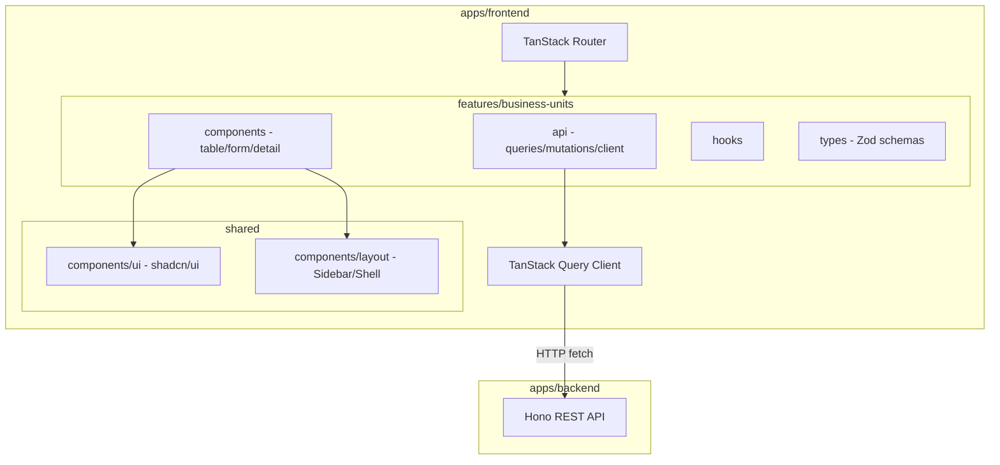
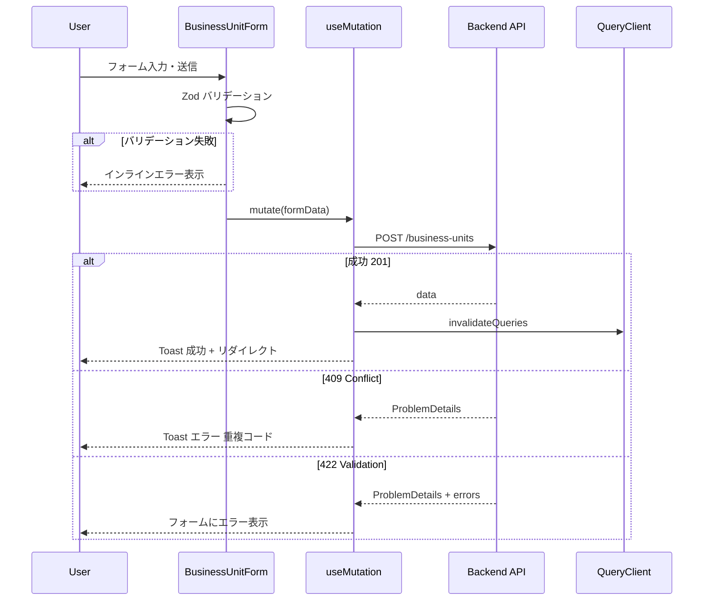
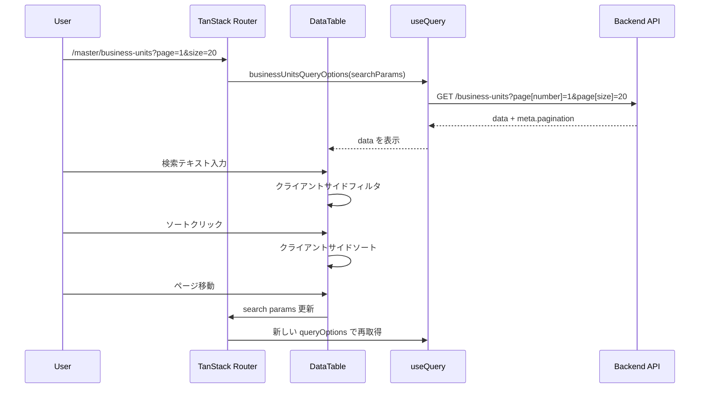

# Design Document

## Overview

**Purpose**: ビジネスユニット（`business_units`）マスターデータの管理画面を提供し、管理者が組織単位の一覧閲覧・検索・詳細確認・新規登録・編集・削除・復元を行えるようにする。

**Users**: 事業部リーダー・管理者が、マスターデータの日常的なメンテナンスに使用する。

**Impact**: 既存のバックエンド CRUD API（Hono）に対するフロントエンド UI を新規構築する。バックエンドの変更は不要。`apps/frontend` プロジェクトの初期セットアップを含む。

### Goals
- 既存 `business-units` API を呼び出す型安全なフロントエンド管理画面の提供
- nani.now 風のモダンで快適な UI/UX の実現
- TanStack エコシステム（Router/Query/Table/Form）とプロジェクトルールへの準拠
- feature-first アーキテクチャによる高凝集・低結合なモジュール構成

### Non-Goals
- バックエンド API の変更・拡張
- 他マスター画面（project-types 等）の同時実装
- 認証・認可の実装（将来スコープ）
- E2E テストの実装（将来スコープ）

## Architecture

### Existing Architecture Analysis

- **バックエンド**: Hono v4 による REST API が `apps/backend` に実装済み。`business-units` の 6 エンドポイント（CRUD + 復元）が稼働
- **フロントエンド**: `apps/frontend` は空ディレクトリ。Vite + React + TanStack Router の初期セットアップが必要
- **モノレポ**: Turborepo + pnpm によるワークスペース管理。`apps/frontend` を新規ワークスペースとして追加

### Architecture Pattern & Boundary Map



**Architecture Integration**:
- **Selected pattern**: Feature-first SPA — steering の feature-first 構成と一致。`features/business-units/` にすべてのドメインロジックを凝集
- **Domain boundaries**: API 層（TanStack Query）・表示層（Components）・型定義層（Types）を feature 内で分離。feature 外への依存は共有 UI コンポーネントとルーティングのみ
- **Existing patterns preserved**: バックエンドのレイヤード構成（routes/services/data）はそのまま維持
- **New components rationale**: フロントエンドプロジェクト全体が新規。共通レイアウト（Sidebar/Shell）は他マスタ画面でも再利用を想定
- **Steering compliance**: feature-first 構成、`@/` エイリアス、TanStack エコシステム統一、Zod 中心の型安全性

### Technology Stack

| Layer | Choice / Version | Role in Feature | Notes |
|-------|------------------|-----------------|-------|
| Build | Vite 6.x + `@vitejs/plugin-react` | ビルド・HMR | TanStack Router Vite Plugin 併用 |
| Routing | `@tanstack/react-router` + `@tanstack/router-vite-plugin` | ファイルベースルーティング | search params は `@tanstack/zod-adapter` でバリデーション |
| Data Fetching | `@tanstack/react-query` v5 | API データの取得・キャッシュ・ミューテーション | queryOptions パターン採用 |
| Table | `@tanstack/react-table` v8 | ヘッドレス UI テーブル | ソート・フィルタ・ページネーション |
| Form | `@tanstack/react-form` v1 | フォーム状態管理・バリデーション | Standard Schema（Zod 直接）対応 |
| UI Components | shadcn/ui | デザインシステムプリミティブ | nani.now 風カスタムテーマ適用 |
| Styling | Tailwind CSS v4 | ユーティリティファーストCSS | CSS 変数でテーマ制御 |
| Validation | Zod v3 | スキーマ定義・型導出 | フロント/バック共通パターン |

## System Flows

### ビジネスユニット作成フロー



### 一覧表示・検索フロー



## Requirements Traceability

| Requirement | Summary | Components | Interfaces | Flows |
|-------------|---------|------------|------------|-------|
| 1.1 | 一覧画面で API 呼び出し | BusinessUnitListPage, DataTable | businessUnitsQueryOptions | 一覧表示フロー |
| 1.2 | テーブルカラム表示 | columns.tsx | ColumnDef | - |
| 1.3 | ソート機能 | DataTable | SortingState | - |
| 1.4 | ページネーション | DataTable, PaginationControls | PaginationState, search params | 一覧表示フロー |
| 1.5 | ローディング状態 | DataTable | isLoading | - |
| 1.6 | エラー表示 | DataTable | isError | - |
| 2.1 | 検索入力欄 | DataTableToolbar | globalFilter | - |
| 2.2 | クライアントサイドフィルタ | DataTable | filterFn | 一覧表示フロー |
| 2.3 | 削除済みトグル | DataTableToolbar | includeDisabled search param | - |
| 2.4 | 削除済みの視覚的区別 | columns.tsx, StatusBadge | deletedAt | - |
| 3.1 | 詳細画面遷移 | BusinessUnitDetailPage | businessUnitQueryOptions | - |
| 3.2 | 詳細情報表示 | BusinessUnitDetailPage | BusinessUnit 型 | - |
| 3.3 | 編集・削除ボタン | BusinessUnitDetailPage | Link, Dialog | - |
| 3.4 | 戻るナビゲーション | Breadcrumb | - | - |
| 3.5 | 404 表示 | BusinessUnitDetailPage | notFoundComponent | - |
| 4.1 | 新規登録画面遷移 | BusinessUnitListPage | Link | - |
| 4.2 | 登録フォーム | BusinessUnitForm | createBusinessUnitSchema | - |
| 4.3 | リアルタイムバリデーション | BusinessUnitForm | Zod validators | - |
| 4.4 | POST API 呼び出し | useCreateBusinessUnit | createBusinessUnit mutation | 作成フロー |
| 4.5 | 成功時リダイレクト | useCreateBusinessUnit | navigate, toast | 作成フロー |
| 4.6 | 409 エラー表示 | useCreateBusinessUnit | toast | 作成フロー |
| 4.7 | 422 エラー表示 | BusinessUnitForm | form errors | 作成フロー |
| 5.1 | 編集画面遷移 | BusinessUnitEditPage | businessUnitQueryOptions | - |
| 5.2 | コード読み取り専用 | BusinessUnitForm | mode prop | - |
| 5.3 | 編集バリデーション | BusinessUnitForm | updateBusinessUnitSchema | - |
| 5.4 | PUT API 呼び出し | useUpdateBusinessUnit | updateBusinessUnit mutation | - |
| 5.5 | 更新成功リダイレクト | useUpdateBusinessUnit | navigate, toast | - |
| 5.6 | 404 エラー | useUpdateBusinessUnit | toast | - |
| 5.7 | 422 エラー | BusinessUnitForm | form errors | - |
| 6.1 | 削除確認ダイアログ | DeleteConfirmDialog | AlertDialog | - |
| 6.2 | DELETE API 呼び出し | useDeleteBusinessUnit | deleteBusinessUnit mutation | - |
| 6.3 | 削除成功リダイレクト | useDeleteBusinessUnit | navigate, toast | - |
| 6.4 | 409 エラー参照制約 | useDeleteBusinessUnit | toast | - |
| 6.5 | 404 エラー | useDeleteBusinessUnit | toast | - |
| 7.1 | 復元ボタン表示 | columns.tsx | deletedAt 条件 | - |
| 7.2 | 復元確認ダイアログ | RestoreConfirmDialog | AlertDialog | - |
| 7.3 | 復元 API 呼び出し | useRestoreBusinessUnit | restoreBusinessUnit mutation | - |
| 7.4 | 復元成功・再取得 | useRestoreBusinessUnit | invalidateQueries, toast | - |
| 7.5 | 復元 409 エラー | useRestoreBusinessUnit | toast | - |
| 8.1 | ファイルベースルーティング | routes/master/business-units/ | Route files | - |
| 8.2 | ページネーション search params | Route validateSearch | searchSchema | - |
| 8.3 | 検索条件 search params | Route validateSearch | searchSchema | - |
| 9.1-9.6 | nani.now 風ビジュアルデザイン | Theme CSS, shadcn/ui config | CSS 変数 | - |
| 10.1-10.7 | インタラクション・フィードバック | Toast, StatusBadge, Transitions | Sonner, CSS animations | - |
| 11.1-11.5 | レイアウト・レスポンシブ | AppShell, Sidebar | Sheet for mobile | - |
| 12.1-12.4 | feature モジュール構成 | features/business-units/ | index.ts exports | - |

## Components and Interfaces

| Component | Domain/Layer | Intent | Req Coverage | Key Dependencies | Contracts |
|-----------|--------------|--------|--------------|------------------|-----------|
| AppShell | Layout | サイドバー + メインコンテンツのシェルレイアウト | 11.1-11.3 | shadcn/ui Sidebar (P0) | State |
| BusinessUnitListPage | Route/Page | 一覧画面のルートコンポーネント | 1.1-1.6, 2.1-2.4, 4.1 | DataTable (P0), QueryClient (P0) | - |
| BusinessUnitDetailPage | Route/Page | 詳細画面のルートコンポーネント | 3.1-3.5 | QueryClient (P0) | - |
| BusinessUnitNewPage | Route/Page | 新規登録画面のルートコンポーネント | 4.1-4.7 | BusinessUnitForm (P0) | - |
| BusinessUnitEditPage | Route/Page | 編集画面のルートコンポーネント | 5.1-5.7 | BusinessUnitForm (P0), QueryClient (P0) | - |
| DataTable | Feature/UI | TanStack Table ラッパー（ソート・フィルタ・ページネーション） | 1.1-1.6, 2.1-2.2 | @tanstack/react-table (P0), shadcn/ui Table (P0) | State |
| DataTableToolbar | Feature/UI | 検索・フィルタ・新規登録ボタンのツールバー | 2.1-2.4, 4.1 | shadcn/ui Input, Switch (P0) | - |
| columns.tsx | Feature/Config | カラム定義・セルレンダラー | 1.2, 2.4, 7.1 | ColumnDef (P0) | - |
| BusinessUnitForm | Feature/UI | 新規登録・編集共通フォーム | 4.2-4.3, 5.2-5.3 | @tanstack/react-form (P0), Zod (P0) | Service |
| businessUnitsApi | Feature/API | API クライアント関数群 | 全 CRUD | fetch (P0) | API |
| businessUnitsQueries | Feature/API | queryOptions / mutation 定義 | 1.1, 3.1, 4.4, 5.4, 6.2, 7.3 | @tanstack/react-query (P0) | Service |
| StatusBadge | Shared/UI | アクティブ/削除済みステータスバッジ | 2.4, 10.5 | shadcn/ui Badge (P1) | - |
| DeleteConfirmDialog | Feature/UI | 削除確認ダイアログ | 6.1-6.2 | shadcn/ui AlertDialog (P0) | - |
| RestoreConfirmDialog | Feature/UI | 復元確認ダイアログ | 7.2-7.3 | shadcn/ui AlertDialog (P0) | - |

### Feature/API Layer

#### businessUnitsApi (api-client.ts)

| Field | Detail |
|-------|--------|
| Intent | バックエンド API との HTTP 通信を抽象化する薄い fetch ラッパー |
| Requirements | 1.1, 3.1, 4.4, 5.4, 6.2, 7.3 |

**Responsibilities & Constraints**
- 各 API エンドポイントに対応する関数を提供
- レスポンスの JSON パースと型アサーションを一箇所に集約
- エラーレスポンス（RFC 9457 ProblemDetails）のパースと型付きエラーの throw

**Dependencies**
- External: `fetch` API — HTTP 通信 (P0)
- Outbound: Backend API `GET/POST/PUT/DELETE /business-units` (P0)

**Contracts**: API [x]

##### API Contract

| Method | Endpoint | Request | Response | Errors |
|--------|----------|---------|----------|--------|
| GET | /business-units | `BusinessUnitListParams` | `PaginatedResponse<BusinessUnit>` | 422 |
| GET | /business-units/:code | - | `SingleResponse<BusinessUnit>` | 404 |
| POST | /business-units | `CreateBusinessUnitInput` | `SingleResponse<BusinessUnit>` | 409, 422 |
| PUT | /business-units/:code | `UpdateBusinessUnitInput` | `SingleResponse<BusinessUnit>` | 404, 422 |
| DELETE | /business-units/:code | - | 204 No Content | 404, 409 |
| POST | /business-units/:code/actions/restore | - | `SingleResponse<BusinessUnit>` | 404, 409 |

**Implementation Notes**
- API ベース URL は環境変数 `VITE_API_BASE_URL` で設定
- レスポンスの `!response.ok` 時に `ProblemDetails` 型のエラーオブジェクトを throw
- Content-Type は `application/json` 固定

#### businessUnitsQueries (queries.ts / mutations.ts)

| Field | Detail |
|-------|--------|
| Intent | TanStack Query の queryOptions / useMutation を定義し、キャッシュキーと取得ロジックを co-locate |
| Requirements | 1.1, 3.1, 4.4-4.7, 5.4-5.7, 6.2-6.5, 7.3-7.5 |

**Responsibilities & Constraints**
- `queryOptions` パターンで queryKey と queryFn を一体管理
- Mutation の `onSuccess` でキャッシュ無効化（`invalidateQueries`）
- エラーハンドリングは mutation の `onError` で Toast 表示に委譲

**Dependencies**
- Inbound: Route components — クエリ・ミューテーションの使用 (P0)
- Outbound: businessUnitsApi — API 通信 (P0)

**Contracts**: Service [x]

##### Service Interface

```typescript
// queries.ts
function businessUnitsQueryOptions(params: BusinessUnitListParams): QueryOptions<PaginatedResponse<BusinessUnit>>
function businessUnitQueryOptions(code: string): QueryOptions<SingleResponse<BusinessUnit>>

// mutations.ts
function useCreateBusinessUnit(): UseMutationResult<BusinessUnit, ProblemDetails, CreateBusinessUnitInput>
function useUpdateBusinessUnit(code: string): UseMutationResult<BusinessUnit, ProblemDetails, UpdateBusinessUnitInput>
function useDeleteBusinessUnit(): UseMutationResult<void, ProblemDetails, string>
function useRestoreBusinessUnit(): UseMutationResult<BusinessUnit, ProblemDetails, string>
```

- Preconditions: QueryClient がプロバイダーで提供されていること
- Postconditions: 成功時にキャッシュが無効化され、一覧データが最新になること
- Invariants: queryKey はエンティティ名 `'business-units'` をプレフィクスとして持つ

### Feature/UI Layer

#### DataTable

| Field | Detail |
|-------|--------|
| Intent | TanStack Table のソート・フィルタ・ページネーションをラップした汎用テーブルコンポーネント |
| Requirements | 1.1-1.6, 2.1-2.2 |

**Responsibilities & Constraints**
- `useReactTable` でテーブルインスタンスを生成
- ソート状態（`SortingState`）はクライアントサイドで管理
- ページネーション状態は URL search params と同期

**Dependencies**
- External: `@tanstack/react-table` v8 (P0)
- External: shadcn/ui `Table`, `TableHeader`, `TableBody`, `TableRow`, `TableCell` (P0)

**Contracts**: State [x]

##### State Management

```typescript
type DataTableState = {
  sorting: SortingState
  globalFilter: string
  pagination: PaginationState
}
```

- Persistence: ページネーションは URL search params に永続化。ソート・フィルタはクライアントサイド状態
- Concurrency: シングルユーザー操作のため競合なし

#### BusinessUnitForm

| Field | Detail |
|-------|--------|
| Intent | 新規登録・編集で共有するフォームコンポーネント（TanStack Form + Zod） |
| Requirements | 4.2-4.3, 5.2-5.3 |

**Responsibilities & Constraints**
- `mode: 'create' | 'edit'` プロパティで新規/編集を切り替え
- `edit` モードではビジネスユニットコードフィールドを `disabled` にする
- Zod スキーマによるフィールドレベルバリデーション

**Dependencies**
- External: `@tanstack/react-form` v1 (P0)
- External: `zod` (P0)
- Outbound: shadcn/ui `Input`, `Button`, `Label` (P1)

**Contracts**: Service [x]

##### Service Interface

```typescript
type BusinessUnitFormProps = {
  mode: 'create' | 'edit'
  defaultValues?: BusinessUnitFormValues
  onSubmit: (values: BusinessUnitFormValues) => Promise<void>
  isSubmitting: boolean
}

type BusinessUnitFormValues = {
  businessUnitCode: string
  name: string
  displayOrder: number
}
```

- Preconditions: `edit` モード時に `defaultValues` が提供されること
- Postconditions: `onSubmit` が呼ばれた時点でフォーム値は Zod スキーマでバリデーション済み

### Layout Layer

#### AppShell

| Field | Detail |
|-------|--------|
| Intent | アプリケーション全体のレイアウトシェル（サイドバー + メインコンテンツ） |
| Requirements | 11.1-11.3 |

**Responsibilities & Constraints**
- デスクトップ（1024px+）: サイドバー常時表示
- タブレット/モバイル（< 1024px）: shadcn/ui `Sheet` でオーバーレイサイドバー
- メインコンテンツは `max-w-4xl mx-auto` で中央寄せ

**Dependencies**
- External: shadcn/ui `Sidebar`, `Sheet` (P0)

**Contracts**: State [x]

##### State Management

```typescript
type SidebarState = {
  isOpen: boolean
  toggle: () => void
}
```

**Implementation Notes**
- shadcn/ui の Sidebar コンポーネント（SidebarProvider, SidebarTrigger）を活用
- マスタ管理メニュー項目: ビジネスユニット、プロジェクトタイプ等（将来拡張）

## Data Models

### Domain Model

ビジネスユニットは単一のエンティティであり、フロントエンドでは API レスポンスの DTO をそのまま使用する。

```typescript
/** API レスポンス型（バックエンドの BusinessUnit 型と一致） */
type BusinessUnit = {
  businessUnitCode: string
  name: string
  displayOrder: number
  createdAt: string
  updatedAt: string
  deletedAt?: string | null  // includeDisabled 時のみ含まれる
}
```

### Data Contracts & Integration

**API Data Transfer**

```typescript
/** 一覧取得パラメータ */
type BusinessUnitListParams = {
  page: number
  pageSize: number
  includeDisabled: boolean
}

/** ページネーション付きレスポンス */
type PaginatedResponse<T> = {
  data: T[]
  meta: {
    pagination: {
      currentPage: number
      pageSize: number
      totalItems: number
      totalPages: number
    }
  }
}

/** 単一リソースレスポンス */
type SingleResponse<T> = {
  data: T
}

/** 作成リクエスト */
type CreateBusinessUnitInput = {
  businessUnitCode: string
  name: string
  displayOrder?: number
}

/** 更新リクエスト */
type UpdateBusinessUnitInput = {
  name: string
  displayOrder?: number
}

/** RFC 9457 ProblemDetails エラー */
type ProblemDetails = {
  type: string
  status: number
  title: string
  detail: string
  instance?: string
  errors?: Array<{
    field: string
    message: string
  }>
}
```

**Zod Schemas（フロントエンド用）**

```typescript
const createBusinessUnitSchema = z.object({
  businessUnitCode: z.string().min(1).max(20).regex(/^[a-zA-Z0-9_-]+$/),
  name: z.string().min(1).max(100),
  displayOrder: z.number().int().min(0).default(0),
})

const updateBusinessUnitSchema = z.object({
  name: z.string().min(1).max(100),
  displayOrder: z.number().int().min(0).optional(),
})

const businessUnitSearchSchema = z.object({
  page: fallback(z.number().int().positive(), 1).default(1),
  pageSize: fallback(z.number().int().min(1).max(100), 20).default(20),
  search: fallback(z.string(), '').default(''),
  includeDisabled: fallback(z.boolean(), false).default(false),
})
```

## Error Handling

### Error Strategy

フロントエンドのエラーは 3 層で処理する:
1. **フォームバリデーション**: Zod スキーマによるクライアントサイドバリデーション → インラインエラー表示
2. **API エラー**: `ProblemDetails` 形式のレスポンスを解析 → Toast 通知またはフォームエラー
3. **予期しないエラー**: Error Boundary でキャッチ → エラー画面表示

### Error Categories and Responses

**User Errors (4xx)**:
- 422 バリデーションエラー → `errors` 配列の各 `field` をフォームフィールドにマッピングしてインライン表示
- 404 Not Found → 「ビジネスユニットが見つかりません」Toast + 一覧画面へリダイレクト
- 409 Conflict（作成時重複）→ 「同一コードのビジネスユニットが既に存在します」Toast
- 409 Conflict（削除時参照制約）→ 「他のデータから参照されているため削除できません」Toast

**System Errors (5xx)**:
- ネットワークエラー / 500 → 「サーバーとの通信に失敗しました」Toast（エラー通知は手動閉じ）
- TanStack Query のリトライ（デフォルト 3 回）で自動復旧を試行

## Testing Strategy

### Unit Tests
- Zod スキーマのバリデーション（`createBusinessUnitSchema`, `updateBusinessUnitSchema`, `businessUnitSearchSchema`）
- API クライアント関数のレスポンスパース・エラーハンドリング
- カラム定義のアクセサ・セルレンダラー

### Integration Tests
- `businessUnitsQueryOptions` が正しいキャッシュキーと取得関数を返すこと
- Mutation の `onSuccess` でキャッシュが無効化されること
- フォームの Zod バリデーションが TanStack Form と正しく統合されること

### E2E/UI Tests（将来スコープ）
- 一覧画面表示 → 行クリック → 詳細画面遷移
- 新規登録 → バリデーションエラー → 修正 → 成功 → リダイレクト
- 削除 → 確認ダイアログ → 成功 → 一覧更新

## Optional Sections

### Performance & Scalability

- TanStack Query の `staleTime` を 30 秒に設定し、短時間内の同一リクエストを抑制
- TanStack Table のクライアントサイドソート/フィルタにより、ソート/検索時の API コール不要
- コード分割: TanStack Router の `autoCodeSplitting` を有効化し、ルート単位でバンドルを分割
