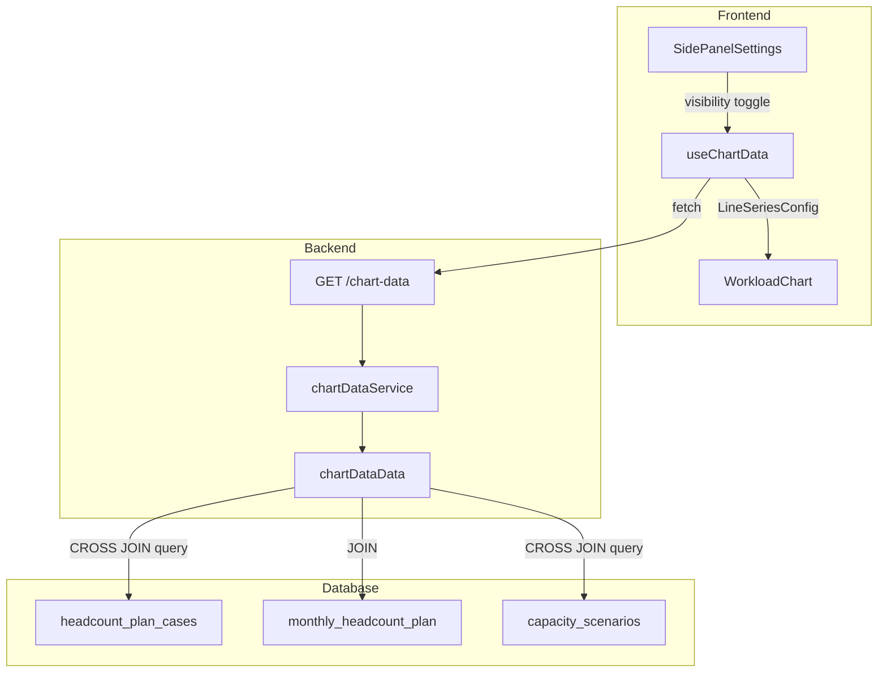
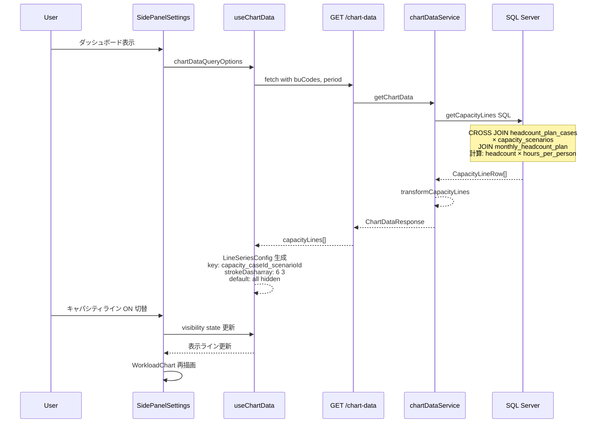

# Design Document: capacity-line-auto-generation

## Overview

**Purpose**: 人員計画ケース(n個) × キャパシティシナリオ(m個) の全組み合わせからキャパシティラインをオンザフライで動的計算し、ダッシュボードチャートに破線で表示可能にする。

**Users**: 事業部リーダーが what-if 分析として複数の人員計画×シナリオの組み合わせをチャート上で比較する。

**Impact**: 既存の `GET /chart-data` API のキャパシティ部分を `monthly_capacity` テーブル読み取りからオンザフライ SQL 計算に置き換える。フロントエンドのキャパシティ設定 UI を n×m 対応に拡張する。

### Goals
- n×m 全組み合わせのキャパシティラインを動的に計算・返却する
- デフォルト全 OFF で個別 ON/OFF 切替可能な設定 UI を提供する
- 破線表示により工数需要の面グラフと視覚的に区別する

### Non-Goals
- `monthly_capacity` テーブルの廃止（既存 calculate API との互換性維持）
- チャートビュープロファイルへのキャパシティライン設定保存（将来スコープ）
- 間接作業ケースとの組み合わせ（Issue Q10-4 で別途検討）

### Migration & Compatibility
- **チャートビュープロファイル**: 既存の `chart_view_capacity_items` は `capacity_scenario_id` 単独キーで保存されている。本変更で `capVisible` (Record<number, boolean>) → `capLineVisible` (Record<string, boolean>) に移行するため、保存済みプロファイルのキャパシティ設定は互換性がなくなる。プロファイル読み込み時に旧形式のキャパシティ設定は無視し、デフォルト全 OFF にフォールバックする。これは Req 3.1（デフォルト OFF）と整合する
- **`capacityScenarioIds` クエリパラメータ**: API パラメータとしては残すが、キャパシティライン生成には使用しない（段階的移行）

## Architecture

### Existing Architecture Analysis

現在のキャパシティデータフロー:

1. `POST /capacity-scenarios/:id/actions/calculate` → `monthly_capacity` に永続化（1:1 計算）
2. `GET /chart-data?capacityScenarioIds=1,2` → `monthly_capacity` テーブルから読み取り → フロントエンドに返却
3. フロントエンドが `capacity_{scenarioId}` キーで `LineSeriesConfig` を生成

**変更方針**: ステップ 2 の読み取り元を `monthly_capacity` テーブルから `monthly_headcount_plan × capacity_scenarios` のオンザフライ計算に置き換える。ステップ 1 は変更しない。

### Architecture Pattern & Boundary Map



**Architecture Integration**:
- **Selected pattern**: 既存レイヤードアーキテクチャ（routes → services → data）の拡張
- **Domain boundaries**: chartData ドメイン内で完結。capacity 計算ロジックは data 層の SQL に集約
- **Existing patterns preserved**: 単一 chart-data エンドポイント、transform パターン、TanStack Query 統合
- **New components rationale**: 新規コンポーネントなし。既存コンポーネントの拡張のみ

### Technology Stack

| Layer | Choice / Version | Role in Feature | Notes |
|-------|------------------|-----------------|-------|
| Frontend | React 19 + Recharts | キャパシティライン破線描画、ON/OFF 設定 UI | `strokeDasharray` 既存サポート活用 |
| Backend | Hono v4 | chart-data エンドポイント拡張 | 既存ルート変更のみ |
| Data | SQL Server (mssql) | CROSS JOIN でオンザフライ計算 | 新テーブル不要 |

## System Flows



## Requirements Traceability

| Requirement | Summary | Components | Interfaces | Flows |
|-------------|---------|------------|------------|-------|
| 1.1, 1.2, 1.3, 1.4 | n×m 自動生成・計算 | chartDataData, chartDataService | getCapacityLines SQL, transformCapacityLines | chart-data request flow |
| 2.1, 2.2 | 命名規則 | chartDataService, useChartData | CapacityLineAggregation.lineName | transform 内で生成 |
| 3.1, 3.2, 3.3, 3.4 | デフォルト OFF / ON/OFF 切替 | SidePanelSettings, useChartData | capLineVisible state | visibility toggle flow |
| 4.1, 4.2, 4.3 | 破線表示・重畳・視覚区別 | WorkloadChart, useChartData | LineSeriesConfig.strokeDasharray | chart rendering |
| 5.1, 5.2, 5.3 | オンザフライ計算 | chartDataData | getCapacityLines SQL | DB 直接計算 |
| 6.1, 6.2, 6.3 | データ整合性 | chartDataData | SQL WHERE 条件 | deleted_at フィルタ |

## Components and Interfaces

| Component | Domain/Layer | Intent | Req Coverage | Key Dependencies | Contracts |
|-----------|-------------|--------|--------------|------------------|-----------|
| chartDataData.getCapacityLines | Backend/Data | CROSS JOIN でオンザフライ計算 | 1.1-1.4, 5.1-5.3, 6.1-6.3 | mssql (P0) | Service |
| chartDataService.transformCapacityLines | Backend/Service | 行データを集約・命名 | 1.1-1.4, 2.1-2.2 | chartDataData (P0) | Service |
| chartData types | Backend/Types | 型定義の拡張 | 全要件 | Zod (P0) | API |
| useChartData | Frontend/Hook | ライン設定生成・visibility 制御 | 3.1-3.4, 4.1-4.3 | TanStack Query (P0) | State |
| SidePanelSettings | Frontend/Component | n×m ライン設定 UI | 3.1-3.4 | useChartData (P0) | State |
| WorkloadChart | Frontend/Component | 破線描画 | 4.1-4.3 | Recharts (P0) | — |

### Backend / Data Layer

#### chartDataData.getCapacityLines

| Field | Detail |
|-------|--------|
| Intent | headcount_plan_cases × capacity_scenarios の CROSS JOIN でキャパシティラインをオンザフライ計算 |
| Requirements | 1.1, 1.2, 1.3, 1.4, 5.1, 5.2, 5.3, 6.1, 6.2, 6.3 |

**Responsibilities & Constraints**
- `monthly_headcount_plan` と `capacity_scenarios` を CROSS JOIN し `headcount × hours_per_person` を SQL 内で計算
- 削除済み（`deleted_at IS NOT NULL`）のケース・シナリオを除外
- BU コードと期間でフィルタリング
- 既存の `getCapacities()` を置き換える

**Dependencies**
- Outbound: mssql connection pool — SQL 実行 (P0)

**Contracts**: Service [x]

##### Service Interface

```typescript
interface GetCapacityLinesParams {
  businessUnitCodes: string[];
  startYearMonth: string;
  endYearMonth: string;
}

type CapacityLineRow = {
  headcountPlanCaseId: number;
  caseName: string;
  capacityScenarioId: number;
  scenarioName: string;
  businessUnitCode: string;
  yearMonth: string;
  capacity: number;
};

function getCapacityLines(
  params: GetCapacityLinesParams
): Promise<CapacityLineRow[]>;
```

- Preconditions: `businessUnitCodes` は1つ以上、`startYearMonth` ≤ `endYearMonth`
- Postconditions: 削除済みケース・シナリオの行を含まない。ケースまたはシナリオが0件の場合は空配列
- Invariants: `capacity = headcount × hours_per_person`（SQL 内計算）

**SQL Design**:
```sql
SELECT
  hpc.headcount_plan_case_id AS headcountPlanCaseId,
  hpc.case_name AS caseName,
  cs.capacity_scenario_id AS capacityScenarioId,
  cs.scenario_name AS scenarioName,
  mhp.business_unit_code AS businessUnitCode,
  mhp.year_month AS yearMonth,
  CAST(mhp.headcount * cs.hours_per_person AS DECIMAL(10,2)) AS capacity
FROM headcount_plan_cases hpc
CROSS JOIN capacity_scenarios cs
INNER JOIN monthly_headcount_plan mhp
  ON mhp.headcount_plan_case_id = hpc.headcount_plan_case_id
WHERE hpc.deleted_at IS NULL
  AND cs.deleted_at IS NULL
  AND mhp.business_unit_code IN (@bu0, @bu1, ...)
  AND mhp.year_month BETWEEN @startYearMonth AND @endYearMonth
ORDER BY hpc.headcount_plan_case_id, cs.capacity_scenario_id, mhp.year_month
```

**Implementation Notes**
- 既存の `getCapacities()` メソッドは削除せず、`getCapacityLines()` を新規追加。`chartDataService` の呼び出し元を切り替える
- パラメータ化クエリで SQL インジェクションを防止（既存パターンに従う）

---

### Backend / Service Layer

#### chartDataService.transformCapacityLines

| Field | Detail |
|-------|--------|
| Intent | CapacityLineRow[] を (caseId, scenarioId) でグルーピングし、月別集計と命名を行う |
| Requirements | 1.1, 1.2, 1.3, 1.4, 2.1, 2.2 |

**Responsibilities & Constraints**
- `(headcountPlanCaseId, capacityScenarioId)` の複合キーでグルーピング
- 同一キーの複数 BU の capacity を月別に合算
- `lineName` を `{caseName}({scenarioName})` 形式で生成
- 既存の `transformCapacities()` のパターンに準拠

**Dependencies**
- Inbound: chartDataData.getCapacityLines — 行データ提供 (P0)

**Contracts**: Service [x]

##### Service Interface

```typescript
type CapacityLineAggregation = {
  headcountPlanCaseId: number;
  caseName: string;
  capacityScenarioId: number;
  scenarioName: string;
  lineName: string;
  monthly: Array<{ yearMonth: string; capacity: number }>;
};

function transformCapacityLines(
  rows: CapacityLineRow[]
): CapacityLineAggregation[];
```

- Preconditions: rows は `headcountPlanCaseId, capacityScenarioId, yearMonth` 順でソート済み
- Postconditions: 各 `CapacityLineAggregation` は月別に capacity を合算済み。`lineName` は `{caseName}({scenarioName})` 形式
- Invariants: 入力行のない (caseId, scenarioId) 組み合わせは結果に含まれない

**Implementation Notes**
- `getChartData()` 内で `capacityScenarioIds` パラメータの有無に関わらず `getCapacityLines()` を呼び出す
- レスポンスフィールドを `capacities` から `capacityLines` に変更

---

### Backend / Types

#### chartData types 拡張

| Field | Detail |
|-------|--------|
| Intent | CapacityLineRow, CapacityLineAggregation, ChartDataResponse の型定義更新 |
| Requirements | 全要件 |

**Contracts**: API [x]

##### API Contract — ChartDataResponse 変更

```typescript
// Before
type ChartDataResponse = {
  projectLoads: ProjectLoadAggregation[];
  indirectWorkLoads: IndirectWorkLoadAggregation[];
  capacities: CapacityAggregation[];
  period: { startYearMonth: string; endYearMonth: string };
  businessUnitCodes: string[];
};

// After
type ChartDataResponse = {
  projectLoads: ProjectLoadAggregation[];
  indirectWorkLoads: IndirectWorkLoadAggregation[];
  capacityLines: CapacityLineAggregation[];
  period: { startYearMonth: string; endYearMonth: string };
  businessUnitCodes: string[];
};
```

**Implementation Notes**
- `CapacityAggregation` 型は残す（既存の calculate API が参照する可能性）
- `CapacityLineRow` と `CapacityLineAggregation` を新規追加
- `CapacityRow` は `getCapacities()` と共に非推奨化（使用箇所がなければ削除）

---

### Frontend / Hook

#### useChartData 拡張

| Field | Detail |
|-------|--------|
| Intent | capacityLines からの LineSeriesConfig 生成、visibility フィルタリング、破線設定 |
| Requirements | 3.1, 3.2, 3.3, 3.4, 4.1, 4.2, 4.3 |

**Responsibilities & Constraints**
- `capacityLines` を `capacity_{caseId}_{scenarioId}` キーで `LineSeriesConfig` に変換
- 全ラインに `strokeDasharray: "6 3"` を設定
- `capLineVisible` 状態に基づき、ON のラインのみ `seriesConfig.lines` に含める
- `legendDataByMonth` のキャパシティセクションを n×m 対応に更新

**Dependencies**
- Inbound: SidePanelSettings — visibility 状態 (P0)
- External: TanStack Query — データフェッチ (P0)

**Contracts**: State [x]

##### State Management

```typescript
// UseChartDataOptions 拡張
interface UseChartDataOptions {
  projectColors?: Record<number, string>;
  projectOrder?: number[];
  indirectWorkTypeColors?: Record<string, string>;
  indirectWorkTypeOrder?: string[];
  capLineVisible?: Record<string, boolean>;
  capLineColors?: Record<string, string>;
}
```

- `capLineVisible` キー形式: `"${headcountPlanCaseId}_${capacityScenarioId}"`
- `capLineColors` キー形式: 同上
- デフォルト: `capLineVisible` に存在しないキーは `false`（OFF）

##### Return Type — availableCapacityLines

`useChartData` は `rawResponse.capacityLines` から一意なライン一覧を抽出し、SidePanelSettings に渡すための `availableCapacityLines` を返却する。

```typescript
type AvailableCapacityLine = {
  key: string; // "${headcountPlanCaseId}_${capacityScenarioId}"
  headcountPlanCaseId: number;
  caseName: string;
  capacityScenarioId: number;
  scenarioName: string;
  lineName: string;
};

interface UseChartDataReturn {
  // ... 既存フィールド
  availableCapacityLines: AvailableCapacityLine[];
}
```

- `rawResponse.capacityLines` を `(headcountPlanCaseId, capacityScenarioId)` でデデュプリケーションし生成
- SidePanelSettings はこの配列を受け取り、トグル一覧を描画する

##### LegendMonthData 型更新

```typescript
// Before
type LegendMonthData = {
  // ...
  capacities: Array<{
    scenarioId: number;
    scenarioName: string;
    capacity: number;
  }>;
  totalCapacity: number;
};

// After
type LegendMonthData = {
  // ...
  capacityLines: Array<{
    headcountPlanCaseId: number;
    capacityScenarioId: number;
    lineName: string;
    capacity: number;
  }>;
  totalCapacity: number;
};
```

- `capacityLines` 配列は visible なラインのみを含む（`capLineVisible` でフィルタ済み）
- `totalCapacity` は visible なラインの capacity 合計

**Implementation Notes**
- 既存の `capacityColors?: Record<number, string>` を `capLineColors?: Record<string, string>` に変更

---

### Frontend / Component

#### SidePanelSettings キャパシティセクション

| Field | Detail |
|-------|--------|
| Intent | n×m キャパシティラインの ON/OFF トグルと色設定 UI |
| Requirements | 3.1, 3.2, 3.3, 3.4 |

**Responsibilities & Constraints**
- `capacityLines` データから n×m の全ラインを一覧表示
- 各ラインに Switch（ON/OFF）と ColorPickerPopover を表示
- ラベルは `lineName`（`{caseName}({scenarioName})`）を表示
- デフォルト全 OFF

**Contracts**: State [x]

##### State Management

```typescript
// Props 変更
interface SidePanelSettingsProps {
  // ... 既存 props
  availableCapacityLines?: AvailableCapacityLine[];
  capLineVisible?: Record<string, boolean>;
  capLineColors?: Record<string, string>;
  onCapLineVisibleChange?: (visible: Record<string, boolean>) => void;
  onCapLineColorsChange?: (colors: Record<string, string>) => void;
}
```

- キー形式: `"${headcountPlanCaseId}_${capacityScenarioId}"`
- 既存の `capVisible` / `capColors` / `onCapVisibleChange` / `onCapColorsChange` を置き換え

**Data Source**
- SidePanelSettings は `useChartData` が返す `availableCapacityLines` を props として受け取り、トグル一覧を描画する
- 既存の `capacityScenariosQueryOptions()` による独立フェッチは不要。chart-data レスポンスから派生データとして取得する

**Implementation Notes**
- ケース名でグルーピングした表示を検討（UX 改善）。初期実装はフラットリストで十分

---

#### WorkloadChart 破線設定

| Field | Detail |
|-------|--------|
| Intent | キャパシティラインの破線表示 |
| Requirements | 4.1, 4.2, 4.3 |

**Implementation Notes**
- `WorkloadChart` 自体の変更は不要。既に `line.strokeDasharray` を `Line` コンポーネントに渡している
- `useChartData` が `strokeDasharray: "6 3"` を設定することで自動的に破線表示される
- 複数ライン間の色の区別は `CAPACITY_COLORS` パレットのローテーションで対応

## Data Models

### Domain Model

新規テーブルなし。既存テーブルの読み取りのみ。

- **headcount_plan_cases**: 人員計画ケースのマスタ（soft delete 対応）
- **capacity_scenarios**: キャパシティシナリオのマスタ（`hours_per_person` 保持、soft delete 対応）
- **monthly_headcount_plan**: 月別人員数の事実テーブル（`headcount` 保持）

**ビジネスルール**: `capacity = headcount × hours_per_person`（SQL 内で計算）

### Data Contracts & Integration

**API Data Transfer — ChartDataResponse 変更点**:

| フィールド | Before | After |
|-----------|--------|-------|
| `capacities` | `CapacityAggregation[]` | 削除 |
| `capacityLines` | — | `CapacityLineAggregation[]`（新規） |

```typescript
type CapacityLineAggregation = {
  headcountPlanCaseId: number;
  caseName: string;
  capacityScenarioId: number;
  scenarioName: string;
  lineName: string;
  monthly: Array<{ yearMonth: string; capacity: number }>;
};
```

## Error Handling

### Error Categories and Responses

**User Errors (4xx)**:
- なし（新規入力エンドポイントなし。既存のクエリパラメータバリデーションは変更なし）

**System Errors (5xx)**:
- DB 接続エラー → 既存の chartDataService のエラーハンドリングに準拠

**Business Logic Errors (422)**:
- ケースまたはシナリオが0件 → エラーではなく空配列を返却（Req 1.3）

## Testing Strategy

### Unit Tests

- `chartDataService.transformCapacityLines()`: 複数 BU の月別集計、命名規則（`{caseName}({scenarioName})`）、空入力での空配列返却
- `useChartData` hook: visibility フィルタリング（OFF のラインが lines に含まれないこと）、`strokeDasharray` の設定、`capacity_{caseId}_{scenarioId}` キー生成

### Integration Tests

- `GET /chart-data`: ケース 2 × シナリオ 2 で 4 本の capacityLines が返却されること
- `GET /chart-data`: 削除済みケース・シナリオが結果に含まれないこと
- `GET /chart-data`: ケースまたはシナリオが 0 件で空の capacityLines が返却されること
- `GET /chart-data`: capacity 計算が `headcount × hours_per_person` であること（既知の入力と期待値で検証）
