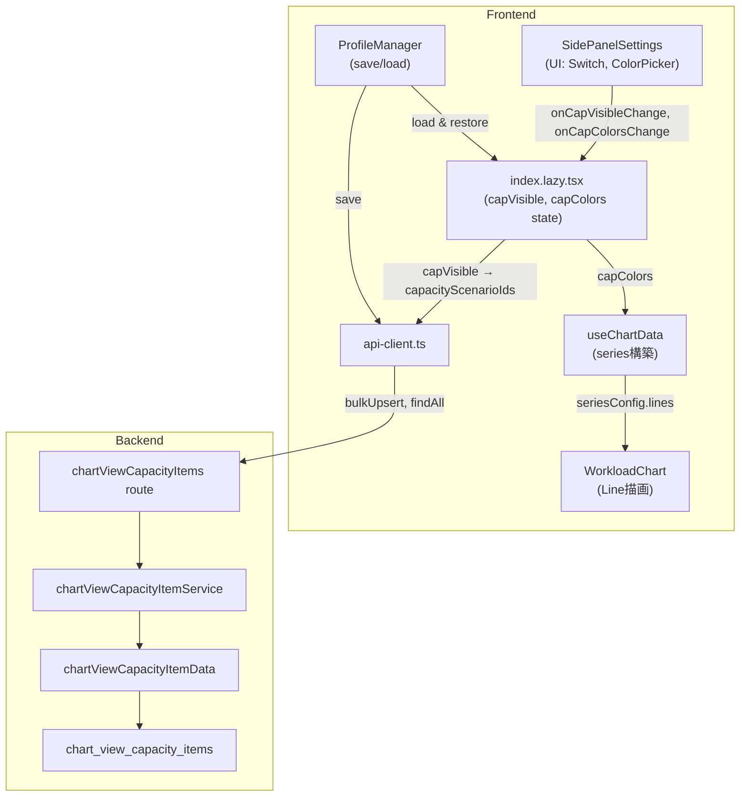

# Design Document

## Overview

**Purpose**: SidePanelSettings のキャパシティシナリオチェック状態を API パラメータおよびチャート描画に連携し、チェックON＝ライン表示・OFF＝非表示を実現する。プロファイル保存・復元時にもキャパシティ設定を保持する。

**Users**: 事業部リーダー・プロジェクトマネージャーが、工数需要とキャパシティの過不足を視覚的に確認するワークフローで使用する。

**Impact**: フロントエンドの状態管理を SidePanelSettings ローカルからページレベルに引き上げ、DB に `chart_view_capacity_items` テーブルを追加し、バックエンドに対応する API を実装する。

### Goals
- キャパシティラインの表示/非表示をチェック状態で制御する
- プロファイル保存/復元でキャパシティ設定を永続化する
- カラー重複を解消し視認性を確保する
- シードデータを36ヶ月分カバーに拡充する

### Non-Goals
- キャパシティシナリオの CRUD 管理画面（既存機能の範囲外）
- URL Search Params へのキャパシティ状態の永続化（プロファイルで管理するため不要）
- 間接作業のチャートビュー保存の改善（別イシュー）

## Architecture

### Existing Architecture Analysis

既存のチャートビュー設定保存は以下のパターンで実装済み:
- `chart_view_project_items`: 案件の表示設定（色・順序・可視性）を保存。bulkUpsert API あり。
- `chart_view_indirect_work_items`: 間接作業の表示設定を保存。個別 CRUD API のみ。
- いずれも `chart_views` テーブルとの `ON DELETE CASCADE` 外部キーで関連付け。

フロントエンドは `index.lazy.tsx`（ワークロードページ）で `projectColors` / `projectOrder` 等をページレベル state として管理し、`SidePanelSettings` にコールバック props で渡すパターンが確立済み。

### Architecture Pattern & Boundary Map



**Architecture Integration**:
- **Selected pattern**: 既存の `chart_view_project_items` パターンの踏襲
- **Domain/feature boundaries**: `workload` feature 内で完結、features 間依存なし
- **Existing patterns preserved**: ページレベル state + コールバック props、bulkUpsert API、MERGE SQL
- **New components rationale**: `chart_view_capacity_items` テーブル + バックエンド CRUD は `chart_view_project_items` と同パターンで必要
- **Steering compliance**: レイヤードアーキテクチャ（routes → services → data）を維持

### Technology Stack

| Layer | Choice / Version | Role in Feature | Notes |
|-------|------------------|-----------------|-------|
| Frontend | React 19 + TanStack Query | 状態管理・API呼び出し | 既存パターン踏襲 |
| Backend | Hono v4 | REST API エンドポイント | 既存パターン踏襲 |
| Data / Storage | SQL Server (mssql) | chart_view_capacity_items テーブル | MERGE SQL パターン |

## Requirements Traceability

| Requirement | Summary | Components | Interfaces |
|-------------|---------|------------|------------|
| 1 | チェック状態→API連携 | index.lazy.tsx, api-client.ts | chartDataParams.capacityScenarioIds |
| 2 | 上位コンポーネント管理 | index.lazy.tsx, SidePanelSettings | Props: capVisible, capColors, callbacks |
| 3 | プロファイル保存/復元 | ProfileManager, Backend API, DB | bulkUpsert/findAll capacity items |
| 4 | チャート描画 | useChartData, WorkloadChart | UseChartDataOptions.capacityColors |
| 5 | カラー重複解消 | chart-colors.ts | CAPACITY_COLORS 定数 |
| 6 | シードデータ完全性 | seed-data.sql | monthly_capacity INSERT |
| 7 | 品質保証 | 既存テスト | TypeScript, Vitest |

## Components and Interfaces

| Component | Domain/Layer | Intent | Req | Key Dependencies | Contracts |
|-----------|-------------|--------|-----|-----------------|-----------|
| index.lazy.tsx | Frontend/Page | capVisible/capColors state管理、capacityScenarioIds導出 | 1, 2 | useChartData, SidePanelSettings | State |
| SidePanelSettings | Frontend/UI | キャパシティSwitch/ColorPicker UI | 2 | index.lazy.tsx (callbacks) | Props |
| ProfileManager | Frontend/UI | キャパシティ設定の保存/復元 | 3 | api-client (capacity items API) | Props |
| useChartData | Frontend/Hook | capacityColors によるライン色カスタマイズ | 4 | api-client (chart data) | Options |
| chart-colors.ts | Frontend/Lib | カラー定義修正 | 5 | - | Constants |
| chartViewCapacityItems route | Backend/Route | REST API エンドポイント | 3 | Service | API |
| chartViewCapacityItemService | Backend/Service | ビジネスロジック | 3 | Data | Service |
| chartViewCapacityItemData | Backend/Data | DB アクセス | 3 | mssql | SQL |

### Frontend / Page Layer

#### index.lazy.tsx（ワークロードページ）

| Field | Detail |
|-------|--------|
| Intent | キャパシティ表示状態をページレベルで管理し、chartDataParams と useChartData に連携する |
| Requirements | 1, 2 |

**変更内容**

追加するステート:
```typescript
// キャパシティシナリオの表示状態（初期値: 全シナリオON）
const [capVisible, setCapVisible] = useState<Record<number, boolean>>({});
// キャパシティシナリオの色設定
const [capColors, setCapColors] = useState<Record<number, string>>({});
```

capacityScenarioIds の導出:
```typescript
const capacityScenarioIds = useMemo(() => {
  return Object.entries(capVisible)
    .filter(([, visible]) => visible)
    .map(([id]) => Number(id));
}, [capVisible]);
```

chartDataParams への統合（既存の `chartDataParamsWithProjects` を拡張）:
```typescript
const chartDataParamsWithFilters = useMemo(() => {
  if (!chartDataParams) return null;
  if (selectedProjectIds.size === 0) return null;
  const params = { ...chartDataParams };
  if (selectedProjectIds.size < allProjectIds.length) {
    params.projectIds = Array.from(selectedProjectIds);
  }
  if (capacityScenarioIds.length > 0) {
    params.capacityScenarioIds = capacityScenarioIds;
  }
  return params;
}, [chartDataParams, selectedProjectIds, allProjectIds.length, capacityScenarioIds]);
```

useChartData への capColors 連携:
```typescript
const { chartData, seriesConfig, ... } = useChartData(chartDataParamsWithFilters, {
  projectColors,
  projectOrder,
  indirectWorkTypeColors: indirectColors,
  indirectWorkTypeOrder: indirectOrder,
  capacityColors: capColors,  // 追加
});
```

SidePanelSettings への props 追加:
```typescript
<SidePanelSettings
  // ...既存props
  capVisible={capVisible}
  capColors={capColors}
  onCapVisibleChange={setCapVisible}
  onCapColorsChange={setCapColors}
  onProfileApply={handleProfileApply}
/>
```

初期化ロジック（capacityScenarios データ取得後）:
```typescript
// capacityScenarios クエリ結果を監視して初期化
useEffect(() => {
  if (capacityScenarios && Object.keys(capVisible).length === 0) {
    const vis: Record<number, boolean> = {};
    const cols: Record<number, string> = {};
    capacityScenarios.forEach((cs, i) => {
      vis[cs.capacityScenarioId] = true;
      cols[cs.capacityScenarioId] = CAPACITY_COLORS[i % CAPACITY_COLORS.length];
    });
    setCapVisible(vis);
    setCapColors(cols);
  }
}, [capacityScenarios]);
```

handleProfileApply の拡張:
```typescript
const handleProfileApply = (profile: {
  startYearMonth: string;
  endYearMonth: string;
  businessUnitCodes: string[];
  projectItems: ChartViewProjectItem[];
  capacityItems?: ChartViewCapacityItem[];  // 追加
}) => {
  // ...既存のproject復元ロジック
  // キャパシティ設定の復元
  if (profile.capacityItems && profile.capacityItems.length > 0) {
    const vis: Record<number, boolean> = {};
    const cols: Record<number, string> = {};
    for (const item of profile.capacityItems) {
      vis[item.capacityScenarioId] = item.isVisible;
      if (item.colorCode) {
        cols[item.capacityScenarioId] = item.colorCode;
      }
    }
    setCapVisible(vis);
    setCapColors(cols);
  } else {
    // 後方互換: キャパシティ設定なし → 全シナリオON
    // 既存の capVisible/capColors を維持（リセットしない）
  }
};
```

### Frontend / UI Layer

#### SidePanelSettings

| Field | Detail |
|-------|--------|
| Intent | キャパシティシナリオの Switch/ColorPicker を外部管理に変更 |
| Requirements | 2 |

**Props 追加**:
```typescript
interface SidePanelSettingsProps {
  // ...既存props
  capVisible?: Record<number, boolean>;
  capColors?: Record<number, string>;
  onCapVisibleChange?: (capVisible: Record<number, boolean>) => void;
  onCapColorsChange?: (capColors: Record<number, string>) => void;
}
```

**変更内容**:
- 内部の `useState<Record<number, boolean>>({})` (capVisible) を削除
- 内部の `useState<Record<number, string>>({})` (capColors) を削除
- props の `capVisible` / `capColors` を直接参照
- Switch の `onCheckedChange` で `onCapVisibleChange` を呼び出し
- ColorPicker の `onChange` で `onCapColorsChange` を呼び出し
- キャパシティシナリオ初期化ロジック（`if (capacityScenarios.length > 0 && ...)`) を削除（親で初期化するため）

#### ProfileManager

| Field | Detail |
|-------|--------|
| Intent | プロファイル保存時にキャパシティ設定を含め、復元時に返却する |
| Requirements | 3 |

**Props 追加**:
```typescript
interface ProfileManagerProps {
  // ...既存props
  capVisible?: Record<number, boolean>;
  capColors?: Record<number, string>;
}
```

**保存処理の変更**（handleSave / handleOverwrite）:
```typescript
// 既存: bulkUpsertProjectItems
// 追加: bulkUpsertCapacityItems
const capacityItems = Object.entries(capVisible ?? {}).map(([id, visible]) => ({
  capacityScenarioId: Number(id),
  isVisible: visible,
  colorCode: capColors?.[Number(id)] ?? null,
}));
await bulkUpsertChartViewCapacityItems(chartViewId, capacityItems);
```

**読み込み処理の変更**（handleApply）:
```typescript
// 既存: fetchChartViewProjectItems
// 追加: fetchChartViewCapacityItems
const [projectItemsRes, capacityItemsRes] = await Promise.all([
  fetchChartViewProjectItems(chartViewId),
  fetchChartViewCapacityItems(chartViewId),
]);
// onApply に capacityItems を含めて返却
onApply?.({
  ...profile,
  projectItems: projectItemsRes.data,
  capacityItems: capacityItemsRes.data,
});
```

### Frontend / Hook Layer

#### useChartData

| Field | Detail |
|-------|--------|
| Intent | capacityColors オプションでライン色をカスタマイズ可能にする |
| Requirements | 4 |

**Options 拡張**:
```typescript
interface UseChartDataOptions {
  projectColors?: Record<number, string>;
  projectOrder?: number[];
  indirectWorkTypeColors?: Record<string, string>;
  indirectWorkTypeOrder?: string[];
  capacityColors?: Record<number, string>;  // 追加
}
```

**lines 構築ロジックの変更**（既存: 269-278行目）:
```typescript
rawResponse.capacities.forEach((cap, idx) => {
  const key = `capacity_${cap.capacityScenarioId}`;
  lines.push({
    dataKey: key,
    stroke: options?.capacityColors?.[cap.capacityScenarioId]
      ?? CAPACITY_COLORS[idx % CAPACITY_COLORS.length],  // カスタム色 or デフォルト
    strokeDasharray: "5 5",
    name: cap.scenarioName,
  });
});
```

### Frontend / Lib Layer

#### chart-colors.ts

| Field | Detail |
|-------|--------|
| Intent | CAPACITY_COLORS と PROJECT_TYPE_COLORS のカラー重複を解消 |
| Requirements | 5 |

**変更内容**:
```typescript
// Before
export const CAPACITY_COLORS = [
  "#2563eb",
  "#3b82f6",  // ← PROJECT_TYPE_COLORS[0] と重複
  "#60a5fa",
  "#93c5fd",
] as const;

// After
export const CAPACITY_COLORS = [
  "#dc2626",  // red-600: 需要（青系エリア）に対するキャパシティ（赤系ライン）で直感的に区別
  "#ea580c",  // orange-600
  "#d97706",  // amber-600
  "#b91c1c",  // red-700
] as const;
```

**根拠**: キャパシティラインは「上限」を表す性質上、警告・閾値を連想させる暖色系（赤〜オレンジ）が直感的。案件エリアの青・緑系パレットとの視覚的コントラストも明確になる。

### Backend / Route Layer

#### chartViewCapacityItems route

| Field | Detail |
|-------|--------|
| Intent | チャートビューのキャパシティ設定を CRUD する REST API |
| Requirements | 3 |

**ルート構成**: `/api/chart-views/:chartViewId/capacity-items`

##### API Contract

| Method | Endpoint | Request | Response | Errors |
|--------|----------|---------|----------|--------|
| GET | `/api/chart-views/:chartViewId/capacity-items` | - | `{ data: ChartViewCapacityItem[] }` | 404 |
| PUT | `/api/chart-views/:chartViewId/capacity-items/bulk` | `{ items: BulkUpsertCapacityItemInput[] }` | `{ data: ChartViewCapacityItem[] }` | 404, 422 |

**備考**: 個別 CRUD（POST/PUT/DELETE by ID）は現時点では不要。ProfileManager の保存/読み込みは GET + bulk PUT で完結する。必要に応じて後から追加可能。

### Backend / Service Layer

#### chartViewCapacityItemService

| Field | Detail |
|-------|--------|
| Intent | チャートビュー存在確認、キャパシティシナリオ存在確認、データアクセスの呼び出し |
| Requirements | 3 |

**メソッド**:
```typescript
async function findAll(chartViewId: number): Promise<ChartViewCapacityItem[]>
async function bulkUpsert(chartViewId: number, items: BulkUpsertCapacityItemInput[]): Promise<ChartViewCapacityItem[]>
```

**bulkUpsert のバリデーション**:
1. chartView の存在確認
2. items 内の capacityScenarioId 重複チェック
3. 全 capacityScenarioId の存在確認（一括）
4. MERGE SQL でアップサート
5. リクエストに含まれない既存レコードは削除（完全同期、`chart_view_project_items` パターン踏襲）

### Backend / Data Layer

#### chartViewCapacityItemData

| Field | Detail |
|-------|--------|
| Intent | chart_view_capacity_items テーブルの SQL 操作 |
| Requirements | 3 |

**メソッド**:
```typescript
async function findAll(chartViewId: number): Promise<ChartViewCapacityItemRow[]>
async function bulkUpsert(chartViewId: number, items: BulkUpsertCapacityItemInput[]): Promise<ChartViewCapacityItemRow[]>
async function chartViewExists(chartViewId: number): Promise<boolean>
async function capacityScenarioExists(capacityScenarioId: number): Promise<boolean>
async function capacityScenariosExist(capacityScenarioIds: number[]): Promise<boolean>
```

**bulkUpsert SQL**:
```sql
-- トランザクション内で各アイテムについて MERGE
MERGE chart_view_capacity_items AS target
USING (SELECT @chartViewId AS chart_view_id, @capacityScenarioId AS capacity_scenario_id) AS source
ON target.chart_view_id = source.chart_view_id
   AND target.capacity_scenario_id = source.capacity_scenario_id
WHEN MATCHED THEN
  UPDATE SET is_visible = @isVisible, color_code = @colorCode, updated_at = GETDATE()
WHEN NOT MATCHED THEN
  INSERT (chart_view_id, capacity_scenario_id, is_visible, color_code)
  VALUES (@chartViewId, @capacityScenarioId, @isVisible, @colorCode);

-- リクエストに含まれないレコードを削除（完全同期）
DELETE FROM chart_view_capacity_items
WHERE chart_view_id = @chartViewId
  AND NOT (capacity_scenario_id IN (@id1, @id2, ...));
```

## Data Models

### Physical Data Model

#### chart_view_capacity_items テーブル（新規）

```sql
CREATE TABLE chart_view_capacity_items (
    chart_view_capacity_item_id INT IDENTITY(1,1) NOT NULL,
    chart_view_id INT NOT NULL,
    capacity_scenario_id INT NOT NULL,
    is_visible BIT NOT NULL CONSTRAINT DF_chart_view_capacity_items_is_visible DEFAULT 1,
    color_code VARCHAR(7) NULL,
    created_at DATETIME2 NOT NULL CONSTRAINT DF_chart_view_capacity_items_created_at DEFAULT GETDATE(),
    updated_at DATETIME2 NOT NULL CONSTRAINT DF_chart_view_capacity_items_updated_at DEFAULT GETDATE(),
    CONSTRAINT PK_chart_view_capacity_items PRIMARY KEY (chart_view_capacity_item_id),
    CONSTRAINT FK_chart_view_capacity_items_view FOREIGN KEY (chart_view_id)
        REFERENCES chart_views (chart_view_id) ON DELETE CASCADE,
    CONSTRAINT FK_chart_view_capacity_items_scenario FOREIGN KEY (capacity_scenario_id)
        REFERENCES capacity_scenarios (capacity_scenario_id)
);

CREATE INDEX IX_chart_view_capacity_items_view ON chart_view_capacity_items (chart_view_id);
CREATE INDEX IX_chart_view_capacity_items_scenario ON chart_view_capacity_items (capacity_scenario_id);
```

**設計根拠**:
- `chart_view_project_items` / `chart_view_indirect_work_items` と同じ関連テーブルパターン
- `ON DELETE CASCADE`: chart_views 削除時に自動削除
- `color_code`: NULL 許容（NULL の場合はデフォルト色を使用）
- `is_visible`: デフォルト 1（表示）

### Data Contracts

#### Backend 型定義

```typescript
// Row 型（DB snake_case）
export type ChartViewCapacityItemRow = {
  chart_view_capacity_item_id: number;
  chart_view_id: number;
  capacity_scenario_id: number;
  is_visible: boolean;
  color_code: string | null;
  created_at: Date;
  updated_at: Date;
  scenario_name: string | null;  // JOIN カラム
};

// Response 型（API camelCase）
export type ChartViewCapacityItem = {
  chartViewCapacityItemId: number;
  chartViewId: number;
  capacityScenarioId: number;
  scenarioName: string | null;
  isVisible: boolean;
  colorCode: string | null;
  createdAt: string;
  updatedAt: string;
};

// Request スキーマ
export const bulkUpsertChartViewCapacityItemSchema = z.object({
  items: z.array(z.object({
    capacityScenarioId: z.number().int().positive(),
    isVisible: z.boolean().default(true),
    colorCode: z.string().length(7).regex(/^#[0-9a-fA-F]{6}$/).nullable().default(null),
  })),
});

export type BulkUpsertCapacityItemInput = z.infer<
  typeof bulkUpsertChartViewCapacityItemSchema
>["items"][number];
```

#### Frontend 型定義（types/index.ts に追加）

```typescript
export type ChartViewCapacityItem = {
  chartViewCapacityItemId: number;
  chartViewId: number;
  capacityScenarioId: number;
  scenarioName: string | null;
  isVisible: boolean;
  colorCode: string | null;
  createdAt: string;
  updatedAt: string;
};

export type BulkUpsertCapacityItemInput = {
  capacityScenarioId: number;
  isVisible: boolean;
  colorCode: string | null;
};
```

### Migration Strategy

#### Migration SQL（個別クエリ）

```sql
-- migration: add chart_view_capacity_items table
CREATE TABLE chart_view_capacity_items (
    chart_view_capacity_item_id INT IDENTITY(1,1) NOT NULL,
    chart_view_id INT NOT NULL,
    capacity_scenario_id INT NOT NULL,
    is_visible BIT NOT NULL CONSTRAINT DF_chart_view_capacity_items_is_visible DEFAULT 1,
    color_code VARCHAR(7) NULL,
    created_at DATETIME2 NOT NULL CONSTRAINT DF_chart_view_capacity_items_created_at DEFAULT GETDATE(),
    updated_at DATETIME2 NOT NULL CONSTRAINT DF_chart_view_capacity_items_updated_at DEFAULT GETDATE(),
    CONSTRAINT PK_chart_view_capacity_items PRIMARY KEY (chart_view_capacity_item_id),
    CONSTRAINT FK_chart_view_capacity_items_view FOREIGN KEY (chart_view_id)
        REFERENCES chart_views (chart_view_id) ON DELETE CASCADE,
    CONSTRAINT FK_chart_view_capacity_items_scenario FOREIGN KEY (capacity_scenario_id)
        REFERENCES capacity_scenarios (capacity_scenario_id)
);

CREATE INDEX IX_chart_view_capacity_items_view ON chart_view_capacity_items (chart_view_id);
CREATE INDEX IX_chart_view_capacity_items_scenario ON chart_view_capacity_items (capacity_scenario_id);
```

#### create-tables.sql への追加

`chart_view_indirect_work_items` の直後（関連テーブルセクション）に `chart_view_capacity_items` の CREATE TABLE を追加。DROP TABLE は `chart_view_indirect_work_items` の前に追加。

#### seed-data.sql への追加

**1. シナリオ2（楽観）の monthly_capacity データ追加**:
- 全3BU（PLANT/TRANS/CO2）× 36ヶ月（202504-202803）
- キャパシティ計算: 人数 × `hours_per_person`(162h) × 稼働率80%
  - PLANT 2025年度: 165人 × 162h × 80% = 21,384h
  - PLANT 2026年度: 175人 × 162h × 80% = 22,680h
  - PLANT 2027年度: 180人 × 162h × 80% = 23,328h
  - TRANS: 50人 × 162h × 80% = 6,480h
  - CO2 2025年度: 30人 × 162h × 80% = 3,888h
  - CO2 2026年度: 35人 × 162h × 80% = 4,536h（増員想定）
  - CO2 2027年度: 35人 × 162h × 80% = 4,536h

**2. CO2 シナリオ1の monthly_capacity 延長**:
- 現在: 202504-202603（12ヶ月）
- 延長: 202604-202803（24ヶ月追加）
  - CO2 2026年度: 35人 × 128h × 80% = 3,584h（標準シナリオの hours_per_person=128h）
  - CO2 2027年度: 35人 × 128h × 80% = 3,584h

**3. 既存チャートビューへの capacity_items シードデータ**:
```sql
INSERT INTO chart_view_capacity_items (chart_view_id, capacity_scenario_id, is_visible, color_code) VALUES
(1, 1, 1, '#dc2626'),  -- PLANT全体負荷 - 標準シナリオ
(1, 2, 0, '#ea580c'),  -- PLANT全体負荷 - 楽観シナリオ（初期非表示）
(2, 1, 1, '#dc2626'),  -- TRANS全体負荷 - 標準シナリオ
(2, 2, 0, '#ea580c'),  -- TRANS全体負荷 - 楽観シナリオ（初期非表示）
(3, 1, 1, '#dc2626'),  -- CO2全体負荷 - 標準シナリオ
(3, 2, 0, '#ea580c');  -- CO2全体負荷 - 楽観シナリオ（初期非表示）
```

## Error Handling

### Error Strategy

既存パターンを踏襲:
- **chartView 不存在**: 404 Not Found
- **capacityScenario 不存在**: 422 Unprocessable Entity（バリデーションエラー）
- **items 内重複**: 422 Unprocessable Entity
- **API 通信エラー**: TanStack Query のリトライ + エラー表示（既存の仕組み）

## Testing Strategy

### Unit Tests
- `useChartData`: capacityColors オプションが lines の stroke に反映されることを確認（既存テストファイルに追加）
- `chart-colors.ts`: CAPACITY_COLORS と PROJECT_TYPE_COLORS に重複がないことを検証

### Integration Tests（Backend）
- `GET /chart-views/:id/capacity-items`: 空配列、データあり、chartView不存在の3パターン
- `PUT /chart-views/:id/capacity-items/bulk`: 新規作成、更新、完全同期（不要レコード削除）、バリデーションエラー

### E2E / Manual Tests
- PLANT/TRANS/CO2 でキャパシティライン表示を確認
- Switch OFF → ライン非表示を確認
- プロファイル保存 → 別プロファイル適用 → 元プロファイル復元 でキャパシティ設定が復元されることを確認
- 既存プロファイル（キャパシティ設定なし）適用時にデフォルト表示されることを確認
