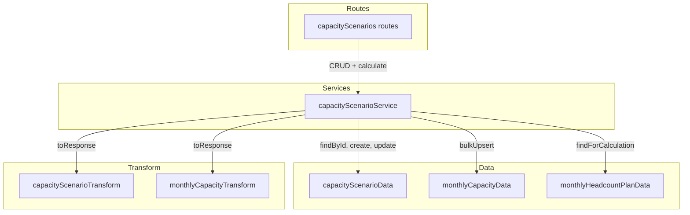
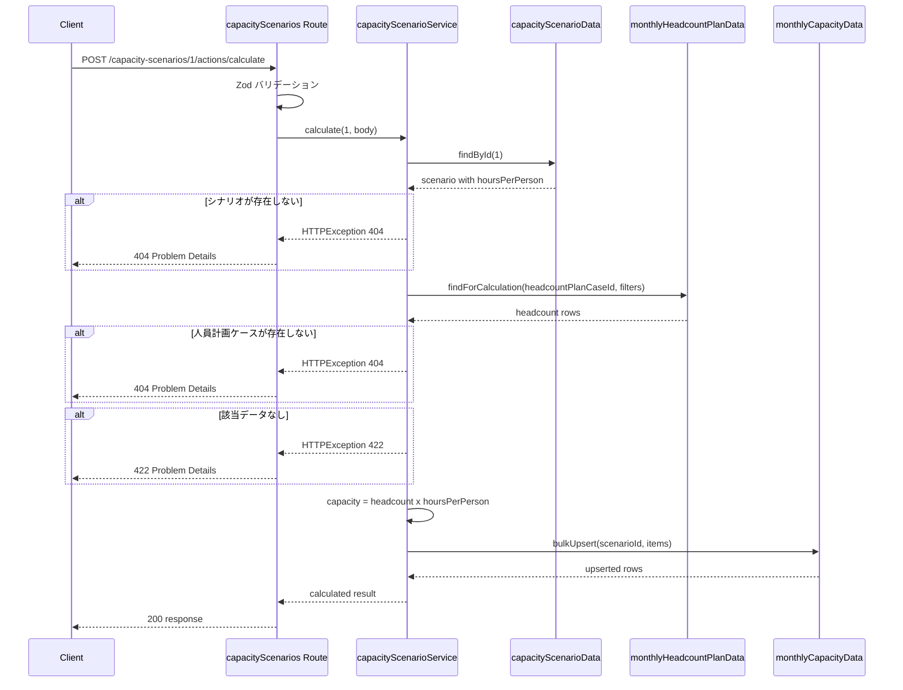
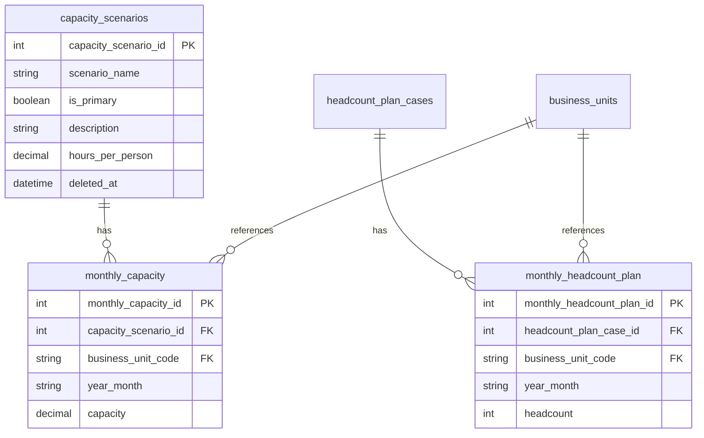

# Design Document

## Overview

**Purpose**: キャパシティシナリオに「1人当たり月間労働時間（`hoursPerPerson`）」パラメータを追加し、キャパシティの計算根拠を明確化する。さらに、人員計画データから `monthly_capacity` を自動計算するエンドポイントを提供する。

**Users**: 事業部リーダー・プロジェクトマネージャーが、シナリオの前提条件管理と what-if 分析に利用する。

**Impact**: 既存の `capacity_scenarios` エンティティにフィールドを追加し、CRUD API を拡張する。新規アクションエンドポイントを追加する。既存の `monthly_capacity` 手動入力は影響なし。

### Goals

- `capacity_scenarios` に `hoursPerPerson` パラメータを追加し、計算根拠を保持する
- 既存 CRUD API を後方互換性を保ちつつ拡張する
- 人員計画 × 労働時間によるキャパシティ自動計算エンドポイントを提供する
- 既存の手動入力ワークフローを維持する

### Non-Goals

- 月別に異なる労働時間を管理する機能（月別労働時間テーブル）
- シナリオ更新時の自動再計算（計算は明示的操作のみ）
- フロントエンド UI の変更（本設計はバックエンド API のみ対象）
- 稼働率を独立したカラムとして分離する設計

## Architecture

### Existing Architecture Analysis

現在のバックエンドは Hono v4 によるレイヤードアーキテクチャ（routes → services → data）で構成されている。

**維持するパターン**:
- Zod スキーマ中心の型定義・バリデーション
- snake_case（DB）↔ camelCase（API）の Transform 層
- Service オブジェクトパターン（非クラス）
- RFC 9457 Problem Details 形式のエラーレスポンス
- SQL MERGE ベースの bulkUpsert トランザクション

**拡張ポイント**:
- `capacity_scenarios` の各レイヤーに `hoursPerPerson` フィールドを追加
- `capacityScenarios` ルートに `POST /:id/actions/calculate` アクションを追加
- `monthlyHeadcountPlanData` に年月範囲対応のクエリメソッドを追加

### Architecture Pattern & Boundary Map



**Architecture Integration**:
- **Selected pattern**: 既存レイヤードアーキテクチャの拡張（最小変更）
- **Domain boundaries**: `capacityScenarioService` が calculate の責務を持ち、`monthlyHeadcountPlanData` と `monthlyCapacityData` を組み合わせる
- **Existing patterns preserved**: Service オブジェクトパターン、Zod バリデーション、Transform 層、RFC 9457 エラー
- **New components rationale**: 新規コンポーネントなし。既存コンポーネントの拡張のみ
- **Steering compliance**: レイヤー間依存方向（routes → services → data）を維持

### Technology Stack

| Layer | Choice / Version | Role in Feature | Notes |
|-------|------------------|-----------------|-------|
| Backend | Hono v4 | ルーティング・バリデーション | 既存利用、変更なし |
| Validation | Zod v4 + @hono/zod-validator | リクエストバリデーション | `hoursPerPerson` のスキーマ追加 |
| Data | mssql | SQL Server クエリ実行 | 既存パターンで SQL 追加 |
| Testing | Vitest v4 | ユニットテスト | 既存テストへの追加 + 新規テスト |

## System Flows

### 自動計算フロー



## Requirements Traceability

| Requirement | Summary | Components | Interfaces | Flows |
|-------------|---------|------------|------------|-------|
| 1.1 | hoursPerPerson フィールド保持 | capacityScenarioTypes, capacityScenarioData | Zod Schema, DB Schema | - |
| 1.2 | デフォルト値 160.00 | capacityScenarioTypes | Zod Schema | - |
| 1.3 | POST 時のデフォルト適用 | capacityScenarioTypes, capacityScenarioService | Create API | - |
| 1.4 | バリデーション (0超〜744以下) | capacityScenarioTypes | Zod Schema | - |
| 1.5 | DECIMAL(10,2) 精度 | capacityScenarioData | DB Schema | - |
| 2.1 | GET 一覧に hoursPerPerson 含む | capacityScenarioData, capacityScenarioTransform | List API | - |
| 2.2 | GET 詳細に hoursPerPerson 含む | capacityScenarioData, capacityScenarioTransform | Detail API | - |
| 2.3 | POST で hoursPerPerson 指定 | capacityScenarioService, capacityScenarioData | Create API | - |
| 2.4 | PUT で hoursPerPerson 更新 | capacityScenarioService, capacityScenarioData | Update API | - |
| 2.5 | PUT で hoursPerPerson 省略時に既存値維持 | capacityScenarioService | Update API | - |
| 2.6 | 後方互換性 | capacityScenarioTypes | Zod Schema | - |
| 3.1 | 自動計算エンドポイント | capacityScenarioService, capacityScenarioRoutes | Calculate API | 自動計算フロー |
| 3.2 | 計算式 headcount × hoursPerPerson | capacityScenarioService | - | 自動計算フロー |
| 3.3 | businessUnitCodes 指定フィルタ | monthlyHeadcountPlanData | findForCalculation | 自動計算フロー |
| 3.4 | businessUnitCodes 省略時は全BU | monthlyHeadcountPlanData | findForCalculation | 自動計算フロー |
| 3.5 | yearMonth 範囲指定 | monthlyHeadcountPlanData | findForCalculation | 自動計算フロー |
| 3.6 | yearMonth 省略時は全範囲 | monthlyHeadcountPlanData | findForCalculation | 自動計算フロー |
| 3.7 | MERGE upsert 格納 | monthlyCapacityData | bulkUpsert (既存) | 自動計算フロー |
| 3.8 | レスポンスに件数・詳細含む | capacityScenarioService | Calculate API | 自動計算フロー |
| 4.1 | シナリオ不在時 404 | capacityScenarioService | Calculate API | 自動計算フロー |
| 4.2 | 人員計画ケース不在時 404 | capacityScenarioService | Calculate API | 自動計算フロー |
| 4.3 | データ不在時 422 | capacityScenarioService | Calculate API | 自動計算フロー |
| 4.4 | RFC 9457 形式 | Global Error Handler (既存) | Problem Details | - |
| 5.1 | 手動入力の継続サポート | - (変更なし) | - | - |
| 5.2 | 後勝ちルール | monthlyCapacityData bulkUpsert | MERGE upsert | - |
| 5.3 | 自動計算は明示的操作のみ | capacityScenarioService | - | - |
| 6.1 | 標準シナリオ 128.00 設定 | DB マイグレーション SQL | - | - |
| 6.2 | 楽観シナリオ 162.00 設定 | DB マイグレーション SQL | - | - |
| 6.3 | デフォルト値 160.00 適用 | DB DDL DEFAULT 制約 | - | - |

## Components and Interfaces

| Component | Domain/Layer | Intent | Req Coverage | Key Dependencies | Contracts |
|-----------|-------------|--------|--------------|------------------|-----------|
| capacityScenarioTypes | Types | hoursPerPerson の Zod スキーマ・型定義 | 1.1-1.5, 2.6 | zod (P0) | - |
| capacityScenarioData | Data | DB クエリに hours_per_person を追加 | 1.1, 1.5, 2.1-2.4 | mssql (P0) | - |
| capacityScenarioTransform | Transform | hoursPerPerson のマッピング追加 | 2.1, 2.2 | - | - |
| capacityScenarioService | Service | calculate メソッド追加 | 3.1-3.8, 4.1-4.3, 5.3 | capacityScenarioData (P0), monthlyHeadcountPlanData (P0), monthlyCapacityData (P0) | Service, API |
| capacityScenarioRoutes | Routes | calculate エンドポイント追加 | 3.1 | capacityScenarioService (P0), @hono/zod-validator (P0) | API |
| monthlyHeadcountPlanData | Data | findForCalculation メソッド追加 | 3.3-3.6 | mssql (P0) | Service |
| DB Migration | Data | DDL 変更 + シードデータ更新 | 6.1-6.3 | SQL Server | - |

### Types Layer

#### capacityScenarioTypes（変更）

| Field | Detail |
|-------|--------|
| Intent | hoursPerPerson の Zod スキーマ定義と TypeScript 型の拡張 |
| Requirements | 1.1, 1.2, 1.3, 1.4, 1.5, 2.6 |

**Responsibilities & Constraints**
- `createCapacityScenarioSchema` に `hoursPerPerson` を optional（デフォルト 160.00）で追加
- `updateCapacityScenarioSchema` に `hoursPerPerson` を optional で追加
- `calculateCapacitySchema` を新規定義（自動計算リクエスト用）
- `CapacityScenarioRow` に `hours_per_person: number` を追加
- `CapacityScenario` に `hoursPerPerson: number` を追加

**Contracts**: Service [x]

##### Service Interface

```typescript
// Zod スキーマ追加（既存スキーマへの拡張）
const hoursPerPersonField = z.number()
  .gt(0, { message: 'hoursPerPerson must be greater than 0' })
  .lte(744, { message: 'hoursPerPerson must be 744 or less' })

// createCapacityScenarioSchema への追加フィールド
// hoursPerPerson: hoursPerPersonField.optional().default(160.00)

// updateCapacityScenarioSchema への追加フィールド
// hoursPerPerson: hoursPerPersonField.optional()

// 新規スキーマ
const calculateCapacitySchema = z.object({
  headcountPlanCaseId: z.number().int().positive(),
  businessUnitCodes: z.array(z.string().min(1).max(20)).optional(),
  yearMonthFrom: z.string().regex(/^\d{6}$/).optional(),
  yearMonthTo: z.string().regex(/^\d{6}$/).optional(),
})

type CalculateCapacity = z.infer<typeof calculateCapacitySchema>

// 拡張された行型
interface CapacityScenarioRow {
  // ...existing fields
  hours_per_person: number
}

// 拡張されたレスポンス型
interface CapacityScenario {
  // ...existing fields
  hoursPerPerson: number
}

// 計算結果レスポンス型
interface CalculateCapacityResult {
  calculated: number
  hoursPerPerson: number
  items: MonthlyCapacity[]
}
```
- Preconditions: なし
- Postconditions: 型定義がバリデーションルールと整合している
- Invariants: `hoursPerPerson` は 0 超 744 以下

**Implementation Notes**
- 既存の `yearMonth` バリデーションパターン（YYYYMM + 月 01-12 チェック）を `calculateCapacitySchema` でも再利用する
- `CalculateCapacityResult` はサービス層の戻り値型として定義し、ルート層でレスポンス構築に使用

### Data Layer

#### capacityScenarioData（変更）

| Field | Detail |
|-------|--------|
| Intent | INSERT/UPDATE/SELECT クエリに hours_per_person カラムを追加 |
| Requirements | 1.1, 1.5, 2.1, 2.2, 2.3, 2.4 |

**Responsibilities & Constraints**
- 全 SELECT クエリの選択カラムに `hours_per_person` を追加
- `create` メソッドの INSERT 文に `hours_per_person` を追加
- `update` メソッドの動的 SET 句に `hours_per_person` を追加

**Contracts**: Service [x]

##### Service Interface

```typescript
// 既存メソッドのシグネチャ変更なし
// create の data パラメータに hoursPerPerson が追加される（型定義から自動反映）
// update の data パラメータに hoursPerPerson が追加される（型定義から自動反映）
```
- Preconditions: DB に `hours_per_person` カラムが存在すること
- Postconditions: クエリ結果に `hours_per_person` が含まれる
- Invariants: DB 制約 `hours_per_person > 0 AND hours_per_person <= 744`

**Implementation Notes**
- SQL の動的 SET 句構築パターンは既存実装（`scenarioName`, `isPrimary`, `description` の条件分岐）を踏襲

#### monthlyHeadcountPlanData（変更）

| Field | Detail |
|-------|--------|
| Intent | 自動計算用の人員計画データ取得メソッドを追加 |
| Requirements | 3.3, 3.4, 3.5, 3.6 |

**Responsibilities & Constraints**
- 新規メソッド `findForCalculation` を追加
- `headcountPlanCaseId` + 任意の `businessUnitCodes[]` + 任意の `yearMonthFrom/To` でフィルタリング
- headcount plan case の存在チェックは既存の `headcountPlanCaseExists` を利用

**Dependencies**
- Inbound: capacityScenarioService — 自動計算のデータ取得 (P0)

**Contracts**: Service [x]

##### Service Interface

```typescript
interface MonthlyHeadcountPlanData {
  // 既存メソッド（変更なし）
  // ...

  // 新規メソッド
  findForCalculation(params: {
    headcountPlanCaseId: number
    businessUnitCodes?: string[]
    yearMonthFrom?: string
    yearMonthTo?: string
  }): Promise<MonthlyHeadcountPlanRow[]>
}
```
- Preconditions: `headcountPlanCaseId` が正の整数、`yearMonthFrom/To` が YYYYMM 形式
- Postconditions: 条件に合致する行を `business_unit_code ASC, year_month ASC` で返却
- Invariants: なし

**Implementation Notes**
- SQL の WHERE 句を動的に構築（`businessUnitCodes` 指定時は `IN` 句、`yearMonthFrom/To` 指定時は `>=` / `<=` 条件を追加）
- パラメータ化クエリで SQL インジェクションを防止

### Transform Layer

#### capacityScenarioTransform（変更）

| Field | Detail |
|-------|--------|
| Intent | `hours_per_person` → `hoursPerPerson` のマッピングを追加 |
| Requirements | 2.1, 2.2 |

**Responsibilities & Constraints**
- `toCapacityScenarioResponse` に `hoursPerPerson: row.hours_per_person` を追加

**Implementation Notes**
- 1行追加のみの変更

### Service Layer

#### capacityScenarioService（変更）

| Field | Detail |
|-------|--------|
| Intent | 既存 CRUD に hoursPerPerson を反映 + calculate メソッドを新規追加 |
| Requirements | 2.3, 2.4, 2.5, 3.1, 3.2, 3.3, 3.4, 3.5, 3.6, 3.7, 3.8, 4.1, 4.2, 4.3, 5.3 |

**Responsibilities & Constraints**
- 既存の `create` / `update` は型定義の変更に伴い自動的に `hoursPerPerson` を処理
- 新規 `calculate` メソッドは以下の手順を実行:
  1. シナリオ存在確認 → 404
  2. 人員計画ケース存在確認 → 404
  3. 人員計画データ取得（フィルタリング付き）
  4. データ不在時 → 422
  5. `headcount × hoursPerPerson` 計算
  6. `monthlyCapacityData.bulkUpsert` で格納
  7. 結果を `CalculateCapacityResult` として返却

**Dependencies**
- Inbound: capacityScenarioRoutes — ルートハンドラから呼び出し (P0)
- Outbound: capacityScenarioData — シナリオ取得 (P0)
- Outbound: monthlyHeadcountPlanData — 人員計画データ取得 (P0)
- Outbound: monthlyCapacityData — 計算結果格納 (P0)
- Outbound: capacityScenarioTransform — レスポンス変換 (P0)
- Outbound: monthlyCapacityTransform — 計算結果のレスポンス変換 (P0)

**Contracts**: Service [x] / API [x]

##### Service Interface

```typescript
interface CapacityScenarioService {
  // 既存メソッド（シグネチャ変更なし、内部で hoursPerPerson を処理）
  findAll(params: { page: number; pageSize: number; includeDisabled: boolean }): Promise<{ items: CapacityScenario[]; totalCount: number }>
  findById(id: number): Promise<CapacityScenario>
  create(data: CreateCapacityScenario): Promise<CapacityScenario>
  update(id: number, data: UpdateCapacityScenario): Promise<CapacityScenario>
  delete(id: number): Promise<void>
  restore(id: number): Promise<CapacityScenario>

  // 新規メソッド
  calculate(
    capacityScenarioId: number,
    data: CalculateCapacity
  ): Promise<CalculateCapacityResult>
}
```
- Preconditions: `capacityScenarioId` が正の整数、`data` が `calculateCapacitySchema` でバリデーション済み
- Postconditions: `monthly_capacity` に計算結果が upsert 済み、結果が返却される
- Invariants: 計算式 `capacity = headcount × hoursPerPerson`

##### API Contract

| Method | Endpoint | Request | Response | Errors |
|--------|----------|---------|----------|--------|
| POST | /capacity-scenarios/:capacityScenarioId/actions/calculate | CalculateCapacity | CalculateCapacityResult | 404, 422 |

**Implementation Notes**
- `calculate` 内でシナリオ取得には内部的に `capacityScenarioData.findById` を使用（削除済みシナリオは除外）
- 人員計画ケースの存在確認は `monthlyHeadcountPlanData.headcountPlanCaseExists` を使用
- 計算結果の `items` は `monthlyCapacityTransform.toMonthlyCapacityResponse` で変換

### Routes Layer

#### capacityScenarioRoutes（変更）

| Field | Detail |
|-------|--------|
| Intent | calculate アクションエンドポイントを追加 |
| Requirements | 3.1 |

**Responsibilities & Constraints**
- `POST /:id/actions/calculate` エンドポイントを追加
- `calculateCapacitySchema` による JSON ボディバリデーション
- レスポンス構造: `{ data: CalculateCapacityResult }`

**Contracts**: API [x]

##### API Contract

| Method | Endpoint | Request | Response | Errors |
|--------|----------|---------|----------|--------|
| POST | /:id/actions/calculate | `{ headcountPlanCaseId, businessUnitCodes?, yearMonthFrom?, yearMonthTo? }` | `{ data: { calculated, hoursPerPerson, items } }` | 404, 422 |

**Implementation Notes**
- 既存の `POST /:id/actions/restore` パターンを踏襲
- パスパラメータ `id` は `parseIntParam` で数値変換

## Data Models

### Domain Model



**Business Rule**: `monthly_capacity.capacity = monthly_headcount_plan.headcount × capacity_scenarios.hours_per_person`（自動計算時）

### Physical Data Model

#### capacity_scenarios テーブル（変更）

**追加カラム**:

| カラム名 | データ型 | NULL | デフォルト | 制約 |
|---------|---------|------|-----------|------|
| hours_per_person | DECIMAL(10,2) | NO | 160.00 | > 0 AND <= 744 |

**DDL**:

```sql
ALTER TABLE capacity_scenarios
  ADD hours_per_person DECIMAL(10, 2) NOT NULL
    CONSTRAINT DF_capacity_scenarios_hours_per_person DEFAULT 160.00;

ALTER TABLE capacity_scenarios
  ADD CONSTRAINT CK_capacity_scenarios_hours_per_person
    CHECK (hours_per_person > 0 AND hours_per_person <= 744);
```

### Data Contracts & Integration

**Calculate API Request**:

```typescript
{
  headcountPlanCaseId: number      // 必須、正の整数
  businessUnitCodes?: string[]     // 任意、対象 BU コード配列
  yearMonthFrom?: string           // 任意、YYYYMM 形式
  yearMonthTo?: string             // 任意、YYYYMM 形式
}
```

**Calculate API Response**:

```typescript
{
  data: {
    calculated: number             // 生成/更新件数
    hoursPerPerson: number         // 使用した労働時間
    items: Array<{
      monthlyCapacityId: number
      capacityScenarioId: number
      businessUnitCode: string
      yearMonth: string
      capacity: number
      createdAt: string
      updatedAt: string
    }>
  }
}
```

## Error Handling

### Error Categories and Responses

**User Errors (4xx)**:
- `hoursPerPerson` バリデーションエラー → 既存の Zod バリデーションミドルウェアが 422 を返却
- `calculateCapacitySchema` バリデーションエラー → 同上

**Not Found (404)**:
- シナリオ不在: `Capacity scenario with ID '{id}' not found`
- 人員計画ケース不在: `Headcount plan case with ID '{id}' not found`

**Business Logic Errors (422)**:
- 指定条件に人員計画データなし: `No headcount plan data found for the specified conditions`

すべてのエラーは既存のグローバルエラーハンドラにより RFC 9457 Problem Details 形式で返却される。

## Testing Strategy

### Unit Tests

1. **capacityScenarioTypes**: `hoursPerPerson` の Zod バリデーション（境界値 0, 0.01, 744, 744.01、デフォルト値、optional 動作）
2. **calculateCapacitySchema**: リクエストバリデーション（必須フィールド、YYYYMM 形式、配列バリデーション）
3. **capacityScenarioTransform**: `hours_per_person` → `hoursPerPerson` マッピング

### Integration Tests

1. **CRUD API + hoursPerPerson**: POST/PUT/GET で `hoursPerPerson` が正しく入出力されること
2. **後方互換性**: `hoursPerPerson` なしの POST/PUT リクエストが正常動作すること
3. **Calculate API 正常系**: 人員計画データから正しくキャパシティが計算・格納されること
4. **Calculate API エラー系**: シナリオ不在 404、人員計画ケース不在 404、データ不在 422 が返却されること
5. **Calculate API フィルタリング**: `businessUnitCodes` / `yearMonthFrom` / `yearMonthTo` によるフィルタリングが正しく動作すること

## Migration Strategy

### Phase 1: DB スキーマ変更

```sql
-- 1. カラム追加（デフォルト値あり、既存行に自動適用）
ALTER TABLE capacity_scenarios
  ADD hours_per_person DECIMAL(10, 2) NOT NULL
    CONSTRAINT DF_capacity_scenarios_hours_per_person DEFAULT 160.00;

ALTER TABLE capacity_scenarios
  ADD CONSTRAINT CK_capacity_scenarios_hours_per_person
    CHECK (hours_per_person > 0 AND hours_per_person <= 744);

-- 2. 既存シードデータの更新
UPDATE capacity_scenarios
SET hours_per_person = 128.00
WHERE scenario_name = N'標準シナリオ';

UPDATE capacity_scenarios
SET hours_per_person = 162.00
WHERE scenario_name = N'楽観シナリオ';
```

### Phase 2: バックエンドコード変更

1. Types → Data → Transform → Service → Routes の順に変更
2. 各レイヤーの変更後にテストを追加・実行

### Rollback

- DB: `ALTER TABLE capacity_scenarios DROP COLUMN hours_per_person;`（制約も自動削除）
- Code: Git revert
