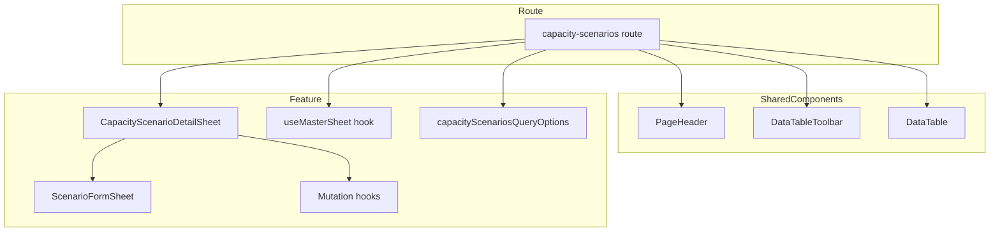

# Design Document

## Overview

**Purpose**: キャパシティシナリオのマスタ管理画面を「稼働時間」にリネームし、標準マスタ管理画面パターン（PageHeader + DataTableToolbar + DataTable + DetailSheet）に統一する。月別キャパシティ計算結果表示を削除し、シミュレーション画面に一本化する。

**Users**: 事業部リーダー・プロジェクトマネージャーがキャパシティシナリオのCRUD管理に使用する。

**Impact**: 現在の2カラム独自レイアウト（CapacityScenarioList + MonthlyCapacityTable）を、他のマスタ管理画面と同一のパターンに置き換える。

### Goals
- サイドバーおよびページタイトルを「稼働時間」に変更
- 標準マスタ管理画面パターンに統一（作業種類・ビジネスユニットと同等のUI）
- MonthlyCapacityTable および関連コードの削除
- TypeScript ビルドエラーなし・既存テスト通過

### Non-Goals
- バックエンド API の変更（エンドポイント・スキーマ・DB）
- CapacityScenario のデータモデル変更（code/displayOrder の追加等）
- シミュレーション画面への変更
- CapacityScenarioList コンポーネントの削除（シミュレーション画面で継続使用）

## Architecture

### Existing Architecture Analysis

現在のキャパシティシナリオ画面は独自の2カラムレイアウトを採用している:
- ルート: `createLazyFileRoute` による遅延ルート
- 状態管理: `useCapacityScenariosPage` カスタムフック（selectedScenarioId + monthlyCapacitiesQuery）
- リスト: `CapacityScenarioList`（ラジオボタン型リスト + インラインCRUD）
- 詳細: `MonthlyCapacityTable`（月別キャパシティピボットテーブル）

標準マスタ管理画面パターン（work-types, business-units, project-types）:
- ルート: `createFileRoute` + `validateSearch` による検索パラメータ管理
- 状態管理: `useMasterSheet<TEntity>()` フック（view/edit/create/closed の4モード）
- リスト: `DataTable` + `DataTableToolbar`
- 詳細: `DetailSheet`（Sheet コンポーネント内で view/edit/create モード切替）

### Architecture Pattern & Boundary Map



**Architecture Integration**:
- Selected pattern: 標準マスタ管理画面パターン（既存3画面で実績あり）
- Domain/feature boundaries: `indirect-case-study` feature 内に DetailSheet を新規追加、既存の ScenarioFormSheet を再利用
- Existing patterns preserved: useMasterSheet, DataTable, DataTableToolbar, PageHeader, column-helpers
- New components rationale: CapacityScenarioDetailSheet のみ新規作成（標準パターンの DetailSheet に相当）

### Technology Stack

| Layer | Choice / Version | Role in Feature | Notes |
|-------|------------------|-----------------|-------|
| Frontend | React 19 + TanStack Router | ルーティング・検索パラメータ管理 | createFileRoute に変更 |
| UI | shadcn/ui + DataTable | テーブル表示・Sheet 表示 | 既存共有コンポーネント |
| State | useMasterSheet + TanStack Query | Sheet 状態管理・データフェッチ | 既存フック |

## Requirements Traceability

| Requirement | Summary | Components | Interfaces | Flows |
|-------------|---------|------------|------------|-------|
| 1.1 | サイドバー名称変更 | SidebarNav | — | — |
| 1.2 | ページタイトル変更 | Route（PageHeader） | — | — |
| 2.1 | PageHeader 使用 | Route | — | — |
| 2.2 | DataTableToolbar 使用 | Route | capacityScenarioSearchSchema | — |
| 2.3 | DataTable 使用 | Route | createColumns | — |
| 2.4 | テーブルカラム定義 | Route | createColumns | — |
| 2.5 | 行クリックで詳細表示 | Route, CapacityScenarioDetailSheet | useMasterSheet | — |
| 2.6 | 共通カラムヘルパー使用 | Route | column-helpers | — |
| 3.1 | 新規作成 DetailSheet | CapacityScenarioDetailSheet | useMasterSheet.openCreate | — |
| 3.2 | 閲覧 DetailSheet | CapacityScenarioDetailSheet | useMasterSheet.openView | — |
| 3.3 | 編集 DetailSheet | CapacityScenarioDetailSheet | useMasterSheet.switchToEdit | — |
| 3.4 | 削除確認ダイアログ | CapacityScenarioDetailSheet | DeleteConfirmDialog | — |
| 3.5 | useMasterSheet 使用 | Route | useMasterSheet | — |
| 4.1–4.5 | MonthlyCapacity 関連削除 | — | — | — |
| 5.1–5.3 | 品質保証 | — | — | — |

## Components and Interfaces

| Component | Domain/Layer | Intent | Req Coverage | Key Dependencies | Contracts |
|-----------|--------------|--------|--------------|------------------|-----------|
| Route（index.tsx） | Route | 画面レイアウト・状態管理 | 1.2, 2.1–2.6, 3.5 | useMasterSheet (P0), DataTable (P0) | State |
| CapacityScenarioDetailSheet | Feature/UI | CRUD操作のSheet UI | 3.1–3.4 | ScenarioFormSheet (P0), Mutations (P0) | State |
| SidebarNav 修正 | Layout | ナビゲーション名称変更 | 1.1 | — | — |
| capacityScenarioSearchSchema | Feature/Types | 検索パラメータ定義 | 2.2 | — | — |

### Route Layer

#### capacity-scenarios/index.tsx（書き換え）

| Field | Detail |
|-------|--------|
| Intent | 稼働時間マスタ管理画面のレイアウトと状態管理 |
| Requirements | 1.2, 2.1, 2.2, 2.3, 2.4, 2.5, 2.6, 3.5 |

**Responsibilities & Constraints**
- `createLazyFileRoute` → `createFileRoute` に変更（検索パラメータのバリデーションが必要なため）
- `validateSearch` で `capacityScenarioSearchSchema` を使用
- `useMasterSheet<CapacityScenario>()` で Sheet 状態管理
- `useQuery(capacityScenariosQueryOptions({ includeDisabled }))` でデータ取得
- 標準レイアウト: PageHeader → Card(DataTableToolbar + DataTable) → CapacityScenarioDetailSheet

**Dependencies**
- Inbound: TanStack Router — ルーティング (P0)
- Outbound: useMasterSheet — Sheet 状態管理 (P0)
- Outbound: capacityScenariosQueryOptions — データ取得 (P0)
- Outbound: DataTable, DataTableToolbar, PageHeader — UI 表示 (P0)
- Outbound: CapacityScenarioDetailSheet — CRUD UI (P0)

**Contracts**: State [x]

##### State Management

```typescript
// 検索パラメータスキーマ
const capacityScenarioSearchSchema = z.object({
  search: z.string().optional().default(""),
  includeDisabled: z.boolean().optional().default(false),
});

// カラム定義
function createColumns(options?: {
  onRestore?: (id: number) => void;
}): ColumnDef<CapacityScenario>[] {
  return [
    createSortableColumn<CapacityScenario>({ accessorKey: "scenarioName", label: "名前" }),
    // hoursPerPerson カラム（カスタム: 数値フォーマット + "時間/人" 表示）
    // isPrimary カラム（カスタム: Badge 表示）
    createStatusColumn<CapacityScenario>(),
    createDateTimeColumn<CapacityScenario>({ accessorKey: "updatedAt", label: "更新日時" }),
    createRestoreActionColumn<CapacityScenario, number>({ idKey: "capacityScenarioId", onRestore: options?.onRestore }),
  ];
}
```

**Implementation Notes**
- ファイル名は `index.lazy.tsx` → `index.tsx` に変更（eager route）
- CapacityScenario は `code` フィールドがないため、scenarioName を主要カラムとして表示
- hoursPerPerson と isPrimary は標準ヘルパーにないため、カスタムカラム定義が必要
- globalFilter は scenarioName に対して適用

### Feature Layer

#### CapacityScenarioDetailSheet（新規作成）

| Field | Detail |
|-------|--------|
| Intent | キャパシティシナリオの閲覧・作成・編集・削除を行う DetailSheet |
| Requirements | 3.1, 3.2, 3.3, 3.4 |

**Responsibilities & Constraints**
- 標準 DetailSheet パターンに準拠（WorkTypeDetailSheet と同等の構造）
- view モード: scenarioName, description, hoursPerPerson, isPrimary, createdAt, updatedAt を DetailRow で表示
- edit/create モード: 既存の ScenarioFormSheet コンポーネントを組み込み
- 削除確認: DeleteConfirmDialog（entityLabel="シナリオ"）
- 復元確認: RestoreConfirmDialog（entityLabel="シナリオ"）

**Dependencies**
- Inbound: Route — Sheet 状態 (P0)
- Outbound: ScenarioFormSheet — フォーム UI (P0)
- Outbound: useCreateCapacityScenario, useUpdateCapacityScenario, useDeleteCapacityScenario, useRestoreCapacityScenario — Mutations (P0)
- Outbound: DeleteConfirmDialog, RestoreConfirmDialog — 確認ダイアログ (P1)

**Contracts**: State [x]

##### State Management

```typescript
interface CapacityScenarioDetailSheetProps {
  sheetState: MasterSheetState<CapacityScenario>;
  isOpen: boolean;
  onOpenChange: (open: boolean) => void;
  openEdit: () => void;
  openView: (updatedEntity?: CapacityScenario) => void;
  close: () => void;
  onMutationSuccess: () => void;
}
```

**Implementation Notes**
- ScenarioFormSheet の既存 Props（open, onOpenChange, mode, defaultValues, onSubmit, isSubmitting）をそのまま活用
- エラーハンドリング: 409（名前重複）、422（バリデーション）、404（削除済み）を ApiError でハンドリング（標準パターン準拠）
- view モードでの isPrimary 表示は Badge コンポーネントを使用

## Data Models

データモデルの変更なし。既存の CapacityScenario 型をそのまま使用する。

```typescript
type CapacityScenario = {
  capacityScenarioId: number;
  scenarioName: string;
  isPrimary: boolean;
  description: string | null;
  hoursPerPerson: number;
  createdAt: string;
  updatedAt: string;
  deletedAt: string | null;
};
```

## Error Handling

標準マスタ管理画面パターンのエラーハンドリングに準拠:
- **409 Conflict**: 名前重複時にトースト通知
- **422 Validation**: バリデーションエラー時にフォームフィールドエラー表示
- **404 Not Found**: 削除済みエンティティ操作時にトースト通知
- **500 Server Error**: 汎用エラーメッセージのトースト通知

## Testing Strategy

### Unit Tests
- CapacityScenarioDetailSheet の各モード（view/edit/create）の表示確認（既存 DetailSheet テストに準拠）

### Integration Tests
- 不要（UI リファクタリングのため、バックエンド API に変更なし）

### Verification
- `npx tsc -b` でビルドエラーがないことを確認
- `pnpm --filter frontend test` で既存テストが通過することを確認
- シミュレーション画面（`/indirect/simulation`）の動作に影響がないことを手動確認

## 削除対象ファイル一覧

| ファイル | 理由 |
|---------|------|
| `src/features/indirect-case-study/components/MonthlyCapacityTable.tsx` | マスタ画面でのみ使用。計算結果表示はシミュレーション画面に一本化 |
| `src/features/indirect-case-study/components/__tests__/MonthlyCapacityTable.test.ts` | 上記コンポーネントのテスト |
| `src/features/indirect-case-study/hooks/useCapacityScenariosPage.ts` | マスタ画面専用フック。標準パターンでは不要 |

## 修正対象ファイル一覧

| ファイル | 変更内容 |
|---------|---------|
| `src/routes/master/capacity-scenarios/index.lazy.tsx` | → `index.tsx` に変更。標準マスタ管理画面パターンで全面書き換え |
| `src/features/indirect-case-study/index.ts` | MonthlyCapacityTable エクスポート削除、CapacityScenarioDetailSheet エクスポート追加 |
| `src/components/layout/SidebarNav.tsx` | 「キャパシティシナリオ」→「稼働時間」に変更 |

## 新規作成ファイル一覧

| ファイル | 内容 |
|---------|------|
| `src/features/indirect-case-study/components/CapacityScenarioDetailSheet.tsx` | 標準パターン準拠の DetailSheet |
