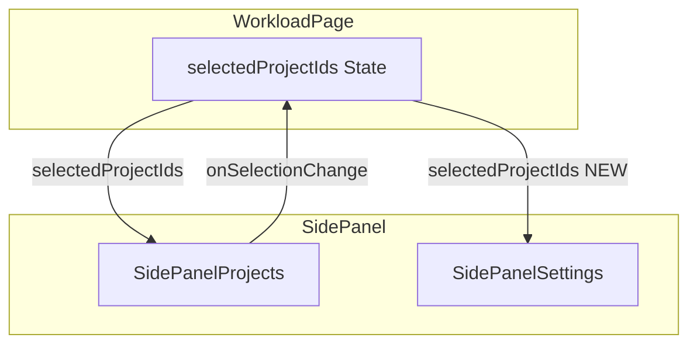

# Design Document

## Overview

**Purpose**: 案件タブ（`SidePanelProjects`）で選択した案件のみが、設定タブ（`SidePanelSettings`）の「案件設定」セクションに表示されるようにする。現状では `selectedProjectIds` が `SidePanelSettings` に渡されていないため、常にBU配下の全案件が表示されるバグを修正する。

**Users**: 事業部リーダー・プロジェクトマネージャーが、選択中の案件に対して色設定・並び順変更を行うワークフローで利用する。

**Impact**: `SidePanelSettings` コンポーネントの props インターフェースと内部フィルタリングロジックを変更し、`WorkloadPage` からの props 渡しを追加する。

### Goals
- 案件タブの選択状態が設定タブの案件設定にリアルタイムに反映される
- 既存の色設定・並び順変更・プロファイル適用機能が正常に動作し続ける
- TypeScript 型安全性を維持する

### Non-Goals
- `SidePanelSettings` の内部状態管理のリファクタリング（カスタムフック抽出等）
- キャパシティ設定セクションへの変更
- バックエンド API の変更

## Architecture

### Existing Architecture Analysis

**現在のデータフロー**:
- `WorkloadPage` が `selectedProjectIds` を `useState<Set<number>>` で管理
- `SidePanelProjects` は `selectedProjectIds` と `onSelectionChange` を props で受け取り、チェックボックスで操作
- `SidePanelSettings` は `businessUnitCodes` のみを受け取り、`projectsQueryOptions` で全案件を独自に取得
- `projOrder` は全案件IDで初期化される

**問題箇所**:
- `WorkloadPage` → `SidePanelSettings` の props に `selectedProjectIds` が含まれない
- `SidePanelSettings` 内の `projOrder` 初期化が全案件を対象としている

### Architecture Pattern & Boundary Map



**Architecture Integration**:
- Selected pattern: Props ドリリング（既存パターンの拡張）
- Domain/feature boundaries: `workload` feature 内で完結、feature 間依存なし
- Existing patterns preserved: `SidePanelProjects` と同じ props パターンを踏襲
- New components rationale: 新規コンポーネント不要
- Steering compliance: feature-first 構成を維持

### Technology Stack

| Layer | Choice / Version | Role in Feature | Notes |
|-------|------------------|-----------------|-------|
| Frontend | React 19 + TanStack Query | コンポーネント状態管理・データフェッチ | 変更なし、既存利用 |

## Requirements Traceability

| Requirement | Summary | Components | Interfaces | Flows |
|-------------|---------|------------|------------|-------|
| 1.1 | 選択案件のみ表示 | SidePanelSettings, WorkloadPage | SidePanelSettingsProps | Props 伝播 |
| 1.2 | リアルタイム更新 | SidePanelSettings | useEffect 差分更新 | selectedProjectIds 変更検知 |
| 1.3 | selectedProjectIds の props 渡し | WorkloadPage | SidePanelSettingsProps | Props 伝播 |
| 2.1 | projOrder を選択案件に限定 | SidePanelSettings | 内部ロジック | 差分更新 |
| 2.2 | 新規案件を末尾追加 | SidePanelSettings | 内部ロジック | 差分更新 |
| 2.3 | 解除案件を除外 | SidePanelSettings | 内部ロジック | 差分更新 |
| 2.4 | projColors 同期 | SidePanelSettings | 内部ロジック | 差分更新 |
| 3.1 | 色設定の正常動作 | SidePanelSettings | onProjectColorsChange | 既存フロー |
| 3.2 | 並び順変更の正常動作 | SidePanelSettings | moveProjUp/Down | 既存フロー |
| 3.3 | プロファイル適用の正常動作 | SidePanelSettings | handleProfileApply | プロファイル復元フロー |
| 4.1 | Props 型定義 | SidePanelSettings | SidePanelSettingsProps | - |
| 4.2 | ビルド通過 | 全体 | - | - |

## Components and Interfaces

| Component | Domain/Layer | Intent | Req Coverage | Key Dependencies | Contracts |
|-----------|--------------|--------|--------------|------------------|-----------|
| SidePanelSettings | UI / workload | 選択案件の色設定・並び順管理 | 1.1-1.3, 2.1-2.4, 3.1-3.3, 4.1 | WorkloadPage (P0) | State |
| WorkloadPage | Route / workload | selectedProjectIds の伝播 | 1.3, 4.2 | SidePanelSettings (P0) | - |

### UI Layer

#### SidePanelSettings

| Field | Detail |
|-------|--------|
| Intent | 選択中の案件に対する色設定・並び順管理・プロファイル適用を提供する |
| Requirements | 1.1, 1.2, 1.3, 2.1, 2.2, 2.3, 2.4, 3.1, 3.2, 3.3, 4.1 |

**Responsibilities & Constraints**
- 受け取った `selectedProjectIds` に基づいて `projects` をフィルタリングし、選択中の案件のみを表示する
- `projOrder` と `projColors` を `selectedProjectIds` の変更に追従して差分更新する
- 既存の色設定・並び順変更・プロファイル適用ロジックは選択案件に対してのみ動作する

**Dependencies**
- Inbound: `WorkloadPage` — `selectedProjectIds` props 提供 (P0)
- Inbound: `projectsQueryOptions` — 全案件データ取得 (P0)
- Outbound: `onProjectColorsChange` — 色設定変更通知 (P1)
- Outbound: `onProfileApply` — プロファイル適用通知 (P1)

**Contracts**: State [x]

##### State Management

**Props インターフェース変更**:
```typescript
interface SidePanelSettingsProps {
  from: string | undefined;
  months: number;
  businessUnitCodes: string[];
  selectedProjectIds: Set<number>;  // 追加
  onPeriodChange: (from: string | undefined, months: number) => void;
  onProjectColorsChange?: (colors: Record<number, string>) => void;
  onProfileApply?: (profile: {
    chartViewId: number;
    startYearMonth: string;
    endYearMonth: string;
    projectItems: BulkUpsertProjectItemInput[];
    businessUnitCodes: string[] | null;
  }) => void;
}
```

**フィルタリングロジック**:
- `projects` を `selectedProjectIds` でフィルタし、`filteredProjects` を導出する
- `filteredProjects` は `useMemo` で算出し、不要な再計算を防ぐ

**projOrder 差分更新ロジック**:
- `useEffect` で `selectedProjectIds` と `projects` の変更を監視
- 追加された案件: `projOrder` の末尾に追加し、デフォルト色を割り当て
- 削除された案件: `projOrder` から除外（色設定は残置しても害なし）
- 既存の並び順を維持する

**プロファイル適用時のフィルタ**:
- `handleProfileApply` 内で `profile.projectItems` を `selectedProjectIds` でフィルタしてから `projOrder` と `projColors` を復元する

**Implementation Notes**
- `useEffect` の依存配列には `selectedProjectIds` のサイズまたはシリアライズ値を使用し、`Set` オブジェクトの参照変更による不要な再実行を回避する
- 初期化ロジック（L88-99）は `useEffect` に統合し、レンダー中の `setState` 呼び出しを排除する
- `onProjectColorsChange` は `projOrder` 更新時にも呼び出し、親コンポーネントの色設定を同期する

### Route Layer

#### WorkloadPage

| Field | Detail |
|-------|--------|
| Intent | `selectedProjectIds` を `SidePanelSettings` に伝播する |
| Requirements | 1.3, 4.2 |

**Implementation Notes**
- `SidePanelSettings` の JSX に `selectedProjectIds={selectedProjectIds}` を追加するのみ
- 既存の `handleProjectSelectionChange` による状態更新は変更不要

## Error Handling

### Error Strategy
本修正はUI内部の props 伝播とフィルタリングのみであり、新規のエラーパスは発生しない。

- **空の選択状態**: `selectedProjectIds.size === 0` の場合、案件設定セクションは空リストを表示する（既存の `projOrder.map` が空配列を返す）
- **プロファイル適用時のミスマッチ**: プロファイルに含まれる案件が現在の選択に含まれない場合、該当案件はフィルタにより除外される

## Testing Strategy

### Manual Testing
1. 案件タブで一部の案件を解除し、設定タブに切り替え → 選択中の案件のみが表示される
2. 設定タブを開いた状態で案件タブに切り替え、案件を追加 → 設定タブの案件リストに追加される
3. 設定タブで色設定・並び順を変更 → 正常に動作し、チャートに反映される
4. プロファイルを適用 → 選択中の案件に対してのみ設定が適用される
5. BU を変更 → 全案件が選択状態にリセットされ、設定タブに全案件が表示される

### Unit/Integration Test Focus
- `SidePanelSettings` の `filteredProjects` が `selectedProjectIds` に基づいて正しくフィルタされる
- `projOrder` の差分更新で追加・削除が正しく反映される
- TypeScript コンパイルが通る（`pnpm --filter frontend build`）
