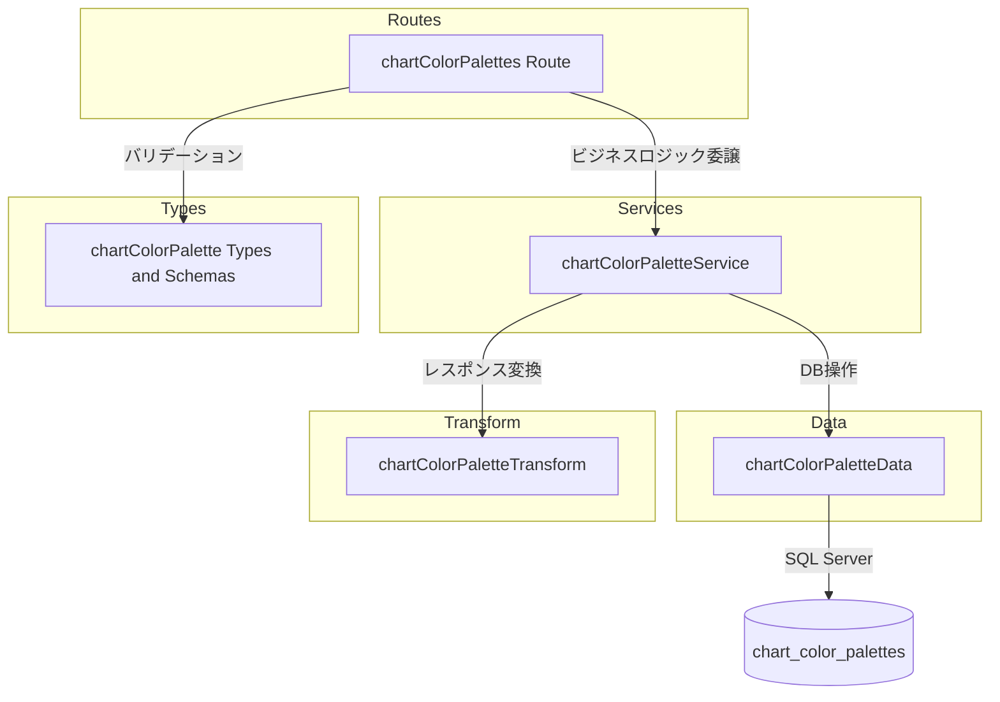

# Technical Design: chart-color-palettes-crud-api

## Overview

**Purpose**: チャート描画で使用するカラーパレット（色の定義）を管理する CRUD API を提供する。
**Users**: フロントエンド開発者およびシステム管理者が、チャートの色選択肢の参照・登録・変更・削除に使用する。
**Impact**: 新規トップレベルエンドポイント `/chart-color-palettes` を追加する。既存コードへの変更は `index.ts` のルート登録のみ。

### Goals
- `chart_color_palettes` テーブルに対する完全な CRUD 操作の提供
- 既存の設定テーブル API と一貫したパターンの維持
- `display_order` による表示順序制御

### Non-Goals
- `chart_color_settings` との連携・参照整合性チェック
- フロントエンド実装
- ページネーション（少数データのため不要）

## Architecture

### Existing Architecture Analysis

既存の設定テーブル CRUD と同一の4層レイヤードアーキテクチャを踏襲する。

- **routes 層**: Hono ルーター、リクエスト検証、レスポンス整形
- **services 層**: ビジネスロジック、存在確認
- **data 層**: SQL Server への直接クエリ（mssql ライブラリ）
- **transform 層**: DB 行（snake_case）→ API レスポンス（camelCase）変換

`chart_color_palettes` は親テーブルを持たない独立した設定テーブルであり、既存パターンの中で最もシンプルな構成となる。

### Architecture Pattern & Boundary Map



**Architecture Integration**:
- Selected pattern: レイヤードアーキテクチャ（既存踏襲）
- Domain boundaries: routes → services → data の単方向依存
- Existing patterns preserved: 物理削除、トップレベルエンドポイント
- New components rationale: 各層に1ファイルずつ追加
- Steering compliance: `structure.md` のバックエンド構成規約に準拠

### Technology Stack

| Layer | Choice / Version | Role in Feature | Notes |
|-------|------------------|-----------------|-------|
| Backend | Hono v4 | HTTP ルーティング・ミドルウェア | 既存 |
| Validation | Zod | リクエストボディ・パスパラメータ検証 | 既存 |
| Data | mssql | SQL Server クエリ実行 | 既存 |
| Testing | Vitest | ユニットテスト | 既存 |

新規依存なし。すべて既存スタック内で完結する。

## Requirements Traceability

| Requirement | Summary | Components | Interfaces | Flows |
|-------------|---------|------------|------------|-------|
| 1.1 - 1.2 | 一覧取得 | Route, Service, Data, Transform | GET / → findAll | - |
| 2.1 - 2.2 | 個別取得 | Route, Service, Data, Transform | GET /:paletteId → findById | - |
| 3.1 - 3.4 | 作成 | Route, Service, Data, Transform | POST / → create | INSERT → 201 |
| 4.1 - 4.4 | 更新 | Route, Service, Data, Transform | PUT /:paletteId → update | 存在確認 → UPDATE |
| 5.1 - 5.2 | 削除 | Route, Service, Data | DELETE /:paletteId → delete | 存在確認 → DELETE |
| 6.1 - 6.5 | レスポンス形式 | Transform, Route | toResponse 関数 | - |
| 7.1 - 7.3 | バリデーション | Types (Zod), Route | Zod スキーマ | - |
| 8.1 - 8.4 | テスト | 全コンポーネント | Vitest + app.request() | - |

## Components and Interfaces

| Component | Domain/Layer | Intent | Req Coverage | Key Dependencies | Contracts |
|-----------|-------------|--------|--------------|-----------------|-----------|
| chartColorPalettes Route | Routes | HTTP エンドポイント定義 | 1-5, 7.1 | Service (P0), Types (P0) | API |
| chartColorPaletteService | Services | ビジネスロジック | 1-5 | Data (P0), Transform (P0) | Service |
| chartColorPaletteData | Data | SQL クエリ実行 | 1-5 | mssql (P0) | - |
| chartColorPaletteTransform | Transform | DB行→レスポンス変換 | 6.3-6.5 | Types (P0) | - |
| chartColorPalette Types | Types | Zod スキーマ・型定義 | 7.1-7.3, 6.4-6.5 | Zod (P0) | - |

### Types Layer

#### chartColorPalette Types

| Field | Detail |
|-------|--------|
| Intent | Zod スキーマによるバリデーション定義と TypeScript 型の一元管理 |
| Requirements | 7.1, 7.2, 7.3, 6.4, 6.5 |

**Responsibilities & Constraints**
- 作成・更新のリクエストスキーマ定義
- DB 行型（snake_case）と API レスポンス型（camelCase）の定義
- `colorCode` は `#` + 6桁16進数の正規表現で検証

**Contracts**: Service [x]

##### Service Interface

```typescript
// Zod スキーマ
const createChartColorPaletteSchema: z.ZodObject<{
  name: z.ZodString           // min 1, max 100
  colorCode: z.ZodString      // regex: /^#[0-9A-Fa-f]{6}$/
  displayOrder: z.ZodDefault<z.ZodNumber>  // integer, default 0
}>

const updateChartColorPaletteSchema: z.ZodObject<{
  name: z.ZodString           // min 1, max 100
  colorCode: z.ZodString      // regex: /^#[0-9A-Fa-f]{6}$/
  displayOrder: z.ZodOptional<z.ZodNumber>  // integer
}>

// DB 行型
type ChartColorPaletteRow = {
  chart_color_palette_id: number
  name: string
  color_code: string
  display_order: number
  created_at: Date
  updated_at: Date
}

// API レスポンス型
type ChartColorPalette = {
  chartColorPaletteId: number
  name: string
  colorCode: string
  displayOrder: number
  createdAt: string
  updatedAt: string
}
```

### Routes Layer

#### chartColorPalettes Route

| Field | Detail |
|-------|--------|
| Intent | HTTP エンドポイント定義とリクエスト受付 |
| Requirements | 1.1-1.2, 2.1-2.2, 3.1-3.4, 4.1-4.4, 5.1-5.2, 7.1 |

**Responsibilities & Constraints**
- Hono ルーターインスタンスの定義
- パスパラメータ `paletteId` の解析と正の整数バリデーション
- Zod バリデーションミドルウェアの適用
- HTTP ステータスコードの適切な設定（201, 200, 204）

**Dependencies**
- Inbound: index.ts — ルート登録 (P0)
- Outbound: chartColorPaletteService — ビジネスロジック委譲 (P0)
- Outbound: Types — Zod スキーマ (P0)

**Contracts**: API [x]

##### API Contract

| Method | Endpoint | Request | Response | Errors |
|--------|----------|---------|----------|--------|
| GET | / | - | `{ data: ChartColorPalette[] }` | - |
| GET | /:paletteId | - | `{ data: ChartColorPalette }` | 404 |
| POST | / | CreateChartColorPalette | `{ data: ChartColorPalette }` | 422 |
| PUT | /:paletteId | UpdateChartColorPalette | `{ data: ChartColorPalette }` | 404, 422 |
| DELETE | /:paletteId | - | 204 No Content | 404 |

ベースパス: `/chart-color-palettes`

**Implementation Notes**
- Integration: `index.ts` に `app.route('/chart-color-palettes', chartColorPalettes)` を追加
- Validation: `parseIntParam` ヘルパーでパスパラメータ検証（既存パターン）
- Risks: なし

### Services Layer

#### chartColorPaletteService

| Field | Detail |
|-------|--------|
| Intent | ビジネスロジックの実行と存在確認 |
| Requirements | 1.1-1.2, 2.1-2.2, 3.1-3.3, 4.1-4.3, 5.1-5.2 |

**Responsibilities & Constraints**
- リソースの存在確認（findById で 404）
- HTTPException による適切なエラーステータス返却
- レスポンスの Transform 層経由での変換

**Dependencies**
- Inbound: Route — ビジネスロジック呼び出し (P0)
- Outbound: chartColorPaletteData — DB 操作 (P0)
- Outbound: chartColorPaletteTransform — レスポンス変換 (P0)

**Contracts**: Service [x]

##### Service Interface

```typescript
interface ChartColorPaletteService {
  findAll(): Promise<ChartColorPalette[]>
  findById(paletteId: number): Promise<ChartColorPalette>
  create(data: CreateChartColorPalette): Promise<ChartColorPalette>
  update(paletteId: number, data: UpdateChartColorPalette): Promise<ChartColorPalette>
  delete(paletteId: number): Promise<void>
}
```

- Preconditions: paletteId が正の整数であること
- Postconditions: findAll/findById/create/update は変換済みレスポンス型を返却。delete は void
- Invariants: 存在しないリソースへの操作は 404、不正入力は 422

### Data Layer

#### chartColorPaletteData

| Field | Detail |
|-------|--------|
| Intent | SQL Server への直接クエリ実行 |
| Requirements | 1.1, 2.1, 3.1, 4.1, 5.1 |

**Responsibilities & Constraints**
- `chart_color_palettes` テーブルへの CRUD SQL 実行
- 一覧取得は `display_order ASC` でソート
- 物理削除（`DELETE FROM`）
- パラメータ化クエリによる SQL インジェクション防止
- INSERT 時に `OUTPUT INSERTED.*` で作成行を返却
- UPDATE 時に `OUTPUT INSERTED.*` で更新行を返却

**Dependencies**
- Inbound: Service — DB 操作呼び出し (P0)
- External: mssql — SQL Server 接続 (P0)

**Contracts**: Service [x]

##### Service Interface

```typescript
interface ChartColorPaletteData {
  findAll(): Promise<ChartColorPaletteRow[]>
  findById(paletteId: number): Promise<ChartColorPaletteRow | undefined>
  create(data: {
    name: string
    colorCode: string
    displayOrder: number
  }): Promise<ChartColorPaletteRow>
  update(paletteId: number, data: {
    name: string
    colorCode: string
    displayOrder?: number
  }): Promise<ChartColorPaletteRow | undefined>
  deleteById(paletteId: number): Promise<boolean>
}
```

- Preconditions: `getPool()` で接続プール取得済み
- Postconditions: CRUD 結果を DB 行型で返却
- Invariants: SQL パラメータは mssql の型指定を使用（`sql.Int`, `sql.NVarChar(100)`, `sql.VarChar(7)`）

**Implementation Notes**
- Integration: `getPool()` による既存接続プール共有
- Validation: SQL パラメータ型指定（name は `sql.NVarChar(100)`、color_code は `sql.VarChar(7)`、display_order は `sql.Int`）

### Transform Layer

#### chartColorPaletteTransform

| Field | Detail |
|-------|--------|
| Intent | DB 行（snake_case）から API レスポンス（camelCase）への変換 |
| Requirements | 6.3, 6.4, 6.5 |

**Responsibilities & Constraints**
- snake_case → camelCase のフィールド名変換
- Date 型 → ISO 8601 文字列変換

**Contracts**: なし（純粋な変換関数）

##### Service Interface

```typescript
function toChartColorPaletteResponse(row: ChartColorPaletteRow): ChartColorPalette
```

## Data Models

### Physical Data Model

テーブル定義は `docs/database/table-spec.md` の `chart_color_palettes` セクションに準拠。以下は設計上の要点のみ。

| カラム | 型 | 設計上の注意点 |
|--------|-----|---------------|
| chart_color_palette_id | INT IDENTITY | 主キー、自動採番 |
| name | NVARCHAR(100) | パレット名 |
| color_code | VARCHAR(7) | `#RRGGBB` 形式 |
| display_order | INT | デフォルト 0、一覧ソートキー |
| created_at | DATETIME2 | GETDATE() |
| updated_at | DATETIME2 | GETDATE() |

**Consistency & Integrity**:
- 物理削除: `deleted_at` カラムなし
- ユニーク制約なし（同名パレットの登録を許容）

### Data Contracts & Integration

**API Data Transfer**:
- Request: camelCase JSON（Zod スキーマで検証）
- Response: camelCase JSON（Transform 層で変換）
- 日時: ISO 8601 文字列

## Error Handling

### Error Categories and Responses

| Category | Status | Trigger | Detail |
|----------|--------|---------|--------|
| Resource Not Found | 404 | paletteId が存在しない | `Chart color palette with ID '{id}' not found` |
| Validation Error | 422 | Zod スキーマ検証失敗 | RFC 9457 errors 配列 |
| Invalid Param | 422 | パスパラメータが正の整数でない | `Invalid paletteId: must be a positive integer` |

すべてのエラーは RFC 9457 Problem Details 形式で返却する（既存のグローバルエラーハンドラが `HTTPException` を自動変換）。

## Testing Strategy

### Unit Tests

テスト配置: `apps/backend/src/__tests__/`（ソース構造をミラー）

- **Types テスト** (`types/chartColorPalette.test.ts`):
  - Zod スキーマの正常値・境界値・不正値の検証
  - colorCode の正規表現検証（`#FF5733` OK, `FF5733` NG, `#GG0000` NG）
  - name の長さ制限（空文字 NG, 100文字 OK, 101文字 NG）

- **Transform テスト** (`transform/chartColorPaletteTransform.test.ts`):
  - snake_case → camelCase 変換の正確性
  - Date → ISO 8601 文字列変換

- **Service テスト** (`services/chartColorPaletteService.test.ts`):
  - 存在しないリソースへのアクセスで 404
  - 正常系の CRUD フロー

- **Route テスト** (`routes/chartColorPalettes.test.ts`):
  - Hono `app.request()` による各エンドポイントの結合テスト
  - ステータスコード・レスポンス構造の検証
  - パスパラメータバリデーション
  - Location ヘッダの検証（POST 201）
  - バリデーションエラーのレスポンス形式検証
