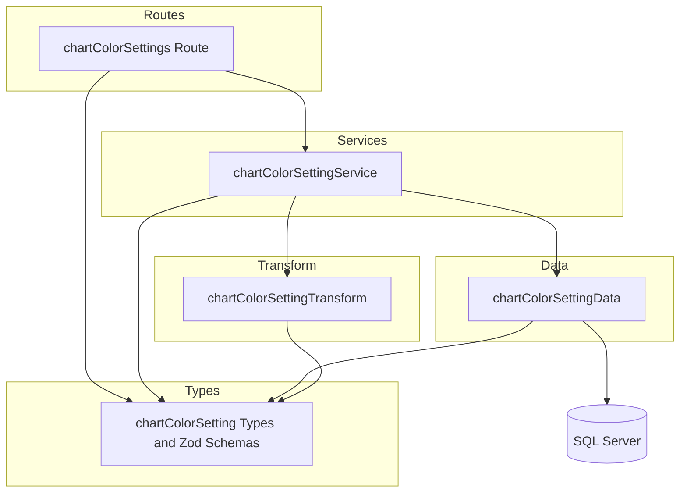

# Technical Design: chart-color-settings-crud-api

## Overview

**Purpose**: チャートの各要素（案件・間接作業など）に割り当てる色を管理する CRUD API を提供する。設定テーブル `chart_color_settings` に対する標準的な CRUD 操作に加え、一括 Upsert エンドポイントを実装する。

**Users**: フロントエンドアプリケーションがチャート描画時に色設定を取得・管理するために使用する。

**Impact**: 既存のバックエンド API に新しいエンドポイント `/chart-color-settings` を追加する。既存の機能への影響はない。

### Goals
- `chart_color_settings` テーブルに対する CRUD API（一覧・個別取得・作成・更新・削除）の実装
- `target_type` + `target_id` に基づく一括 Upsert エンドポイントの実装
- 既存のレイヤードアーキテクチャパターンとの完全な一貫性
- RFC 9457 準拠のエラーレスポンス

### Non-Goals
- フロントエンド UI の実装
- `chart_color_palettes` テーブルの API 実装
- `chart_stack_order_settings` テーブルの API 実装
- 色設定のデフォルト値自動割り当てロジック

## Architecture

### Existing Architecture Analysis

既存のバックエンドは Hono v4 ベースのレイヤードアーキテクチャ（routes → services → data）で構成されている。本機能はこのパターンを踏襲する。

主な差分として、`chart_color_settings` は設定テーブルであり:
- `deleted_at` カラムを持たない → 物理削除
- ソフトデリート / リストア API は不要
- `filter[includeDisabled]` パラメータは不要

### Architecture Pattern & Boundary Map



**Architecture Integration**:
- Selected pattern: レイヤードアーキテクチャ（routes → services → data）— 既存パターンの踏襲
- Domain boundary: 設定テーブル専用の CRUD — 他のエンティティとの依存なし
- Existing patterns preserved: Hono メソッドチェイン、`validate()` ヘルパー、`HTTPException` によるエラーハンドリング、Transform 層での snake_case → camelCase 変換
- New components: 5 ファイル（routes, services, data, transform, types）— 既存パターンに従った標準構成
- Steering compliance: レイヤー間依存方向の遵守、Zod スキーマ中心の型安全性

### Technology Stack

| Layer | Choice / Version | Role in Feature | Notes |
|-------|------------------|-----------------|-------|
| Backend | Hono v4 | ルーティング・ミドルウェア | 既存と同一 |
| Validation | Zod + @hono/zod-validator | リクエストバリデーション | 既存と同一 |
| Data | mssql | SQL Server アクセス | 既存と同一。MERGE 文を一括 Upsert に使用 |
| Testing | Vitest | ユニットテスト・API テスト | 既存と同一 |

## Requirements Traceability

| Requirement | Summary | Components | Interfaces | Flows |
|-------------|---------|------------|------------|-------|
| 1.1–1.5 | 一覧取得（ページネーション + フィルタ） | Route, Service, Data | API: GET / | — |
| 2.1–2.2 | 個別取得 | Route, Service, Data | API: GET /:id | — |
| 3.1–3.5 | 作成（ユニーク制約チェック） | Route, Service, Data | API: POST / | — |
| 4.1–4.5 | 更新（部分更新 + 重複チェック） | Route, Service, Data | API: PUT /:id | — |
| 5.1–5.2 | 削除（物理削除） | Route, Service, Data | API: DELETE /:id | — |
| 6.1–6.4 | 一括 Upsert | Route, Service, Data | API: PUT /bulk | Upsert Flow |
| 7.1–7.4 | バリデーション + エラーハンドリング | Types (Zod), Route | — | — |

## Components and Interfaces

| Component | Domain/Layer | Intent | Req Coverage | Key Dependencies | Contracts |
|-----------|--------------|--------|--------------|-----------------|-----------|
| chartColorSettings Route | Route | HTTP エンドポイント定義 | 1–6 | Service (P0), Types (P0) | API |
| chartColorSettingService | Service | ビジネスロジック | 1–7 | Data (P0), Transform (P0) | Service |
| chartColorSettingData | Data | DB アクセス | 1–6 | mssql (P0), Types (P0) | — |
| chartColorSettingTransform | Transform | DB 行 → API レスポンス変換 | 1–6 | Types (P0) | — |
| chartColorSetting Types | Types | Zod スキーマ・型定義 | 7 | Zod (P0), pagination (P0) | — |

### Types Layer

#### chartColorSetting Types

| Field | Detail |
|-------|--------|
| Intent | Zod バリデーションスキーマと TypeScript 型の定義 |
| Requirements | 7.1, 7.2, 7.3, 7.4 |

**Responsibilities & Constraints**
- `targetType` のバリデーション（`project`, `indirect_work` 等の有効値）
- `colorCode` のバリデーション（`#` + 6桁16進数）
- DB 行型（snake_case）と API レスポンス型（camelCase）の分離

**Contracts**: State [x]

##### Type Definitions

```typescript
// Zod スキーマ
const colorCodeSchema: z.ZodString  // regex: /^#[0-9A-Fa-f]{6}$/
const targetTypeSchema: z.ZodEnum   // ['project', 'indirect_work']

// 作成スキーマ
interface CreateChartColorSettingInput {
  targetType: string    // VARCHAR(20)
  targetId: number      // INT
  colorCode: string     // VARCHAR(7), #RRGGBB
}

// 更新スキーマ（全フィールドオプショナル）
interface UpdateChartColorSettingInput {
  targetType?: string
  targetId?: number
  colorCode?: string
}

// 一括 Upsert 用スキーマ
interface BulkUpsertChartColorSettingInput {
  items: CreateChartColorSettingInput[]
}

// 一覧取得クエリスキーマ
interface ChartColorSettingListQuery extends PaginationQuery {
  'filter[targetType]'?: string
}

// DB 行型（snake_case）
interface ChartColorSettingRow {
  chart_color_setting_id: number
  target_type: string
  target_id: number
  color_code: string
  created_at: Date
  updated_at: Date
}

// API レスポンス型（camelCase）
interface ChartColorSetting {
  chartColorSettingId: number
  targetType: string
  targetId: number
  colorCode: string
  createdAt: string   // ISO 8601
  updatedAt: string   // ISO 8601
}
```

### Route Layer

#### chartColorSettings Route

| Field | Detail |
|-------|--------|
| Intent | HTTP リクエストの受付・バリデーション・レスポンス返却 |
| Requirements | 1.1–1.5, 2.1–2.2, 3.1–3.2, 4.1, 5.1, 6.1–6.2 |

**Responsibilities & Constraints**
- Hono メソッドチェインによるエンドポイント定義
- `validate()` ヘルパーによる Zod バリデーション適用
- HTTP ステータスコードの明示的設定（200, 201, 204）
- `Location` ヘッダーの設定（POST 201）

**Dependencies**
- Inbound: Hono app — ルートマウント (P0)
- Outbound: chartColorSettingService — ビジネスロジック委譲 (P0)
- Outbound: Types — バリデーションスキーマ (P0)

**Contracts**: API [x]

##### API Contract

| Method | Endpoint | Request | Response | Errors |
|--------|----------|---------|----------|--------|
| GET | /chart-color-settings | Query: page[number], page[size], filter[targetType] | `{ data: ChartColorSetting[], meta: { pagination } }` | 422 |
| GET | /chart-color-settings/:id | Param: id (INT) | `{ data: ChartColorSetting }` | 404 |
| POST | /chart-color-settings | Body: CreateChartColorSettingInput | `{ data: ChartColorSetting }` + Location header | 409, 422 |
| PUT | /chart-color-settings/:id | Param: id, Body: UpdateChartColorSettingInput | `{ data: ChartColorSetting }` | 404, 409, 422 |
| DELETE | /chart-color-settings/:id | Param: id (INT) | 204 No Content | 404 |
| PUT | /chart-color-settings/bulk | Body: BulkUpsertChartColorSettingInput | `{ data: ChartColorSetting[] }` | 422 |

**Implementation Notes**
- `/bulk` ルートは `/:id` より前に定義する（Hono のルートマッチング順序）
- Route ファイルを `apps/backend/src/index.ts` で `/chart-color-settings` にマウント

### Service Layer

#### chartColorSettingService

| Field | Detail |
|-------|--------|
| Intent | ビジネスロジックの実行（存在チェック・重複チェック・エラー判定） |
| Requirements | 2.2, 3.4–3.5, 4.3–4.5, 5.2, 6.3 |

**Responsibilities & Constraints**
- 存在チェック（404）と重複チェック（409）の実行
- `HTTPException` の throw によるエラーレスポンス生成
- Transform 層を使用した DB 行 → API レスポンス変換
- 一括 Upsert のトランザクション管理委譲

**Dependencies**
- Inbound: Route — CRUD 操作の委譲 (P0)
- Outbound: chartColorSettingData — DB アクセス (P0)
- Outbound: chartColorSettingTransform — レスポンス変換 (P0)

**Contracts**: Service [x]

##### Service Interface

```typescript
interface ChartColorSettingService {
  findAll(params: {
    page: number
    pageSize: number
    targetType?: string
  }): Promise<{ items: ChartColorSetting[]; totalCount: number }>

  findById(id: number): Promise<ChartColorSetting>
  // Throws HTTPException(404) if not found

  create(data: CreateChartColorSettingInput): Promise<ChartColorSetting>
  // Throws HTTPException(409) if target_type + target_id duplicate

  update(id: number, data: UpdateChartColorSettingInput): Promise<ChartColorSetting>
  // Throws HTTPException(404) if not found
  // Throws HTTPException(409) if target_type + target_id duplicate with another record

  delete(id: number): Promise<void>
  // Throws HTTPException(404) if not found

  bulkUpsert(items: CreateChartColorSettingInput[]): Promise<ChartColorSetting[]>
  // Rolls back entire transaction on any failure
}
```

- Preconditions: 入力データは Zod バリデーション済み
- Postconditions: 成功時は変換済みの API レスポンス型を返却
- Invariants: `target_type` + `target_id` のユニーク制約は常に維持される

### Data Layer

#### chartColorSettingData

| Field | Detail |
|-------|--------|
| Intent | SQL Server への CRUD クエリ実行 |
| Requirements | 1.1–1.5, 2.1, 3.1, 4.1, 5.1, 6.1 |

**Responsibilities & Constraints**
- パラメタライズドクエリによる SQL インジェクション防止
- `BASE_SELECT` 定数によるカラム定義の一元管理
- `OFFSET ... FETCH NEXT` によるページネーション
- `MERGE` 文による一括 Upsert
- `deleted_at` 関連の WHERE 条件は一切含まない（設定テーブル）

**Dependencies**
- Inbound: Service — DB 操作の委譲 (P0)
- External: mssql — SQL Server 接続 (P0)

**Key Methods**:
- `findAll(params)`: ページネーション + `target_type` フィルタ付き一覧取得
- `findById(id)`: 単一レコード取得
- `findByTarget(targetType, targetId)`: ユニーク制約チェック用
- `findByTargetExcluding(targetType, targetId, excludeId)`: 更新時の重複チェック用
- `create(data)`: INSERT + OUTPUT INSERTED
- `update(id, data)`: 動的 SET 句による部分更新
- `hardDelete(id)`: `DELETE FROM` による物理削除
- `bulkUpsert(items)`: MERGE 文によるトランザクション付き一括 Upsert

### Transform Layer

#### chartColorSettingTransform

| Field | Detail |
|-------|--------|
| Intent | DB 行（snake_case）→ API レスポンス（camelCase）の変換 |
| Requirements | 1.1, 2.1, 3.1, 4.1, 6.2 |

**Responsibilities & Constraints**
- `ChartColorSettingRow` → `ChartColorSetting` のマッピング
- `Date` → ISO 8601 文字列への変換

**Transform Function**:
```typescript
function toChartColorSettingResponse(row: ChartColorSettingRow): ChartColorSetting
```

## Data Models

### Physical Data Model

既存のテーブル定義に準拠（`docs/database/table-spec.md` 参照）。

| カラム名 | データ型 | NULL | デフォルト | 説明 |
|---------|---------|------|-----------|------|
| chart_color_setting_id | INT IDENTITY(1,1) | NO | — | 主キー |
| target_type | VARCHAR(20) | NO | — | 対象タイプ |
| target_id | INT | NO | — | 対象 ID |
| color_code | VARCHAR(7) | NO | — | カラーコード (#RRGGBB) |
| created_at | DATETIME2 | NO | GETDATE() | 作成日時 |
| updated_at | DATETIME2 | NO | GETDATE() | 更新日時 |

**インデックス**:
- PK: `chart_color_setting_id`
- UQ: `(target_type, target_id)`

**特記**: `deleted_at` カラムなし（設定テーブル → 物理削除）

### Data Contracts & Integration

**API Request/Response**:

作成リクエスト:
```json
{
  "targetType": "project",
  "targetId": 1,
  "colorCode": "#FF5733"
}
```

一覧レスポンス:
```json
{
  "data": [
    {
      "chartColorSettingId": 1,
      "targetType": "project",
      "targetId": 1,
      "colorCode": "#FF5733",
      "createdAt": "2026-01-31T00:00:00.000Z",
      "updatedAt": "2026-01-31T00:00:00.000Z"
    }
  ],
  "meta": {
    "pagination": {
      "currentPage": 1,
      "pageSize": 20,
      "totalItems": 1,
      "totalPages": 1
    }
  }
}
```

一括 Upsert リクエスト:
```json
{
  "items": [
    { "targetType": "project", "targetId": 1, "colorCode": "#FF5733" },
    { "targetType": "project", "targetId": 2, "colorCode": "#33FF57" }
  ]
}
```

## Error Handling

### Error Categories and Responses

| カテゴリ | HTTP Status | 発生条件 | レスポンス形式 |
|---------|------------|---------|-------------|
| Not Found | 404 | 指定 ID のレコードが存在しない | RFC 9457 Problem Details |
| Conflict | 409 | `target_type` + `target_id` の重複 | RFC 9457 Problem Details |
| Validation Error | 422 | Zod バリデーション失敗、不正な colorCode | RFC 9457 Problem Details + errors 配列 |
| Internal Error | 500 | 予期しないエラー | グローバルエラーハンドラで処理 |

エラーレスポンスは既存のグローバルエラーハンドラ（`app.onError`）と `problemResponse` ユーティリティを使用。409 Conflict のハンドリングは `getProblemType` に `conflict` マッピングを追加する（既存定義に含まれていれば追加不要）。

## Testing Strategy

### Unit Tests
- `chartColorSettingService`: 存在チェック・重複チェック・物理削除のロジック検証
- `chartColorSettingTransform`: snake_case → camelCase 変換の正確性
- Zod スキーマ: 有効/無効な入力に対するバリデーション結果

### Integration Tests (API Tests)
- `GET /chart-color-settings`: ページネーション・`filter[targetType]` フィルタの動作
- `GET /chart-color-settings/:id`: 正常取得・404 エラー
- `POST /chart-color-settings`: 正常作成（201 + Location）・409 重複・422 バリデーションエラー
- `PUT /chart-color-settings/:id`: 部分更新・404・409 重複
- `DELETE /chart-color-settings/:id`: 物理削除（204）・404
- `PUT /chart-color-settings/bulk`: 一括 Upsert 成功・バリデーションエラー時のロールバック

### テスト配置
- `apps/backend/src/__tests__/routes/chartColorSettings.test.ts`
- `apps/backend/src/__tests__/services/chartColorSettingService.test.ts`
- Hono の `app.request()` メソッドによる API テスト
