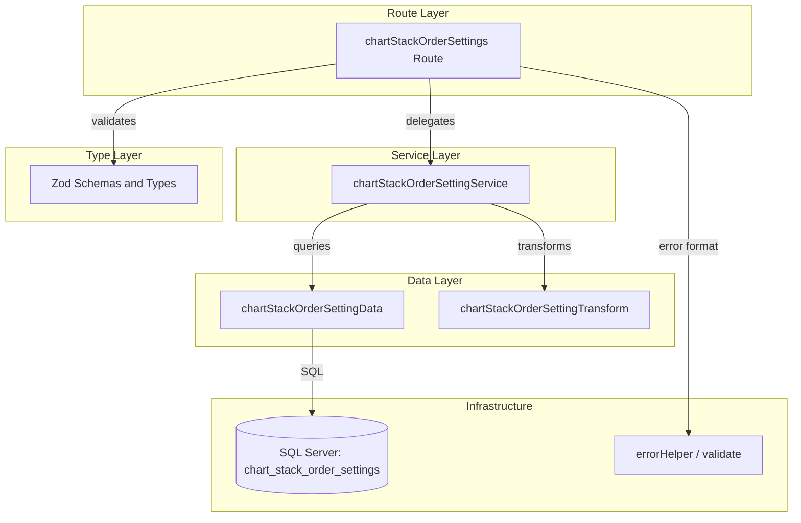

# Design Document: chart-stack-order-settings-crud-api

## Overview

**Purpose**: チャートの積み上げ表示順序設定（`chart_stack_order_settings`）に対するCRUD APIを提供し、フロントエンドクライアントがチャート要素の積み上げ順序を管理できるようにする。

**Users**: フロントエンドアプリケーションが、チャート描画時の積み上げ順序の取得・設定・一括変更に利用する。

**Impact**: バックエンドに新規トップレベルAPIエンドポイント `/chart-stack-order-settings` を追加する。既存コンポーネントへの変更は `index.ts` へのルート登録のみ。

### Goals

- `chart_stack_order_settings` テーブルに対する標準CRUD操作（一覧・取得・作成・更新・削除）を提供する
- 一括upsertエンドポイントにより、複数設定の同時更新を効率的に処理する
- 既存のレイヤードアーキテクチャパターン（routes → services → data）に準拠する
- 物理削除・RFC 9457エラーハンドリング・Zodバリデーションの既存パターンを踏襲する

### Non-Goals

- `target_type` / `target_id` が参照する実体（案件・間接作業等）の存在検証は行わない（ポリモーフィック参照のため外部キー制約なし）
- フロントエンドUIの実装
- チャート描画ロジックの実装
- `chart_color_settings` / `chart_color_palettes` 等の他設定テーブルの実装

## Architecture

### Architecture Pattern & Boundary Map



**Architecture Integration**:
- **選択パターン**: レイヤードアーキテクチャ（routes → services → data）。プロジェクト全体で確立済みのパターンに準拠。
- **ドメイン境界**: `chartStackOrderSetting` として独立した設定ドメイン。他エンティティへの依存なし。
- **既存パターン維持**: 物理削除CRUD（`indirectWorkTypeRatios` 参照）、ページネーション（`businessUnits` 参照）、一括upsert（`indirectWorkTypeRatios` 参照）。
- **新規コンポーネント根拠**: 既存のいずれのコンポーネントにも属さない独立リソースのため、全レイヤーで新規ファイルを作成。
- **Steering準拠**: レイヤー間の依存方向（上位→下位のみ）、命名規則（camelCase/snake_case）、@エイリアスによるインポートを遵守。

### Technology Stack

| Layer | Choice / Version | Role in Feature | Notes |
|-------|------------------|-----------------|-------|
| Backend Framework | Hono v4 | ルーティング・ミドルウェア | 既存 |
| Validation | Zod + @hono/zod-validator | リクエストバリデーション | 既存 `validate` ユーティリティ再利用 |
| Database | SQL Server (mssql) | データ永続化 | 直接SQL、ORM不使用 |
| Testing | Vitest | ルートハンドラテスト | mock service パターン |

## Requirements Traceability

| Requirement | Summary | Components | Interfaces | Notes |
|-------------|---------|------------|------------|-------|
| 1.1-1.6 | 一覧取得（ページネーション + targetTypeフィルタ） | Route, Service, Data | API: GET / | ページネーションはマスタテーブルパターン適用 |
| 2.1-2.2 | 個別取得 | Route, Service, Data | API: GET /:id | |
| 3.1-3.4 | 新規作成 | Route, Service, Data | API: POST / | ユニーク制約チェック含む |
| 4.1-4.4 | 更新 | Route, Service, Data | API: PUT /:id | excludeIdパターンで重複チェック |
| 5.1-5.2 | 物理削除 | Route, Service, Data | API: DELETE /:id | |
| 6.1-6.4 | 一括upsert | Route, Service, Data | API: PUT /bulk | MERGE文 + トランザクション |
| 7.1-7.5 | バリデーション | Types (Zod), validate | Middleware | |
| 8.1-8.3 | エラーハンドリング | errorHelper, global onError | RFC 9457 | 既存インフラ再利用 |

## Components and Interfaces

| Component | Domain/Layer | Intent | Req Coverage | Key Dependencies | Contracts |
|-----------|-------------|--------|--------------|------------------|-----------|
| chartStackOrderSettings Route | Route | HTTPリクエスト受付・バリデーション・レスポンス返却 | 1-8 | Service (P0), validate (P0) | API |
| chartStackOrderSettingService | Service | ビジネスロジック・存在確認・重複チェック | 1-6, 8 | Data (P0), Transform (P1) | Service |
| chartStackOrderSettingData | Data | SQL実行・DB操作 | 1-6 | mssql getPool (P0) | - |
| chartStackOrderSettingTransform | Transform | DB Row → API Response変換 | 1-6 | Types (P0) | - |
| Zod Schemas / Types | Types | スキーマ定義・型導出 | 7 | zod (P0) | - |

### Route Layer

#### chartStackOrderSettings Route

| Field | Detail |
|-------|--------|
| Intent | HTTP エンドポイント定義、リクエストバリデーション、サービス委譲 |
| Requirements | 1.1-1.6, 2.1-2.2, 3.1-3.4, 4.1-4.4, 5.1-5.2, 6.1-6.4, 7.1-7.5, 8.1-8.3 |

**Responsibilities & Constraints**
- Hono ルートチェインで全エンドポイントを定義する
- `validate` ミドルウェアでリクエストボディ・クエリパラメータをバリデーションする
- `parseIntParam` でパスパラメータを検証する
- `/bulk` エンドポイントは `/:id` パターンより前に定義する（ルートマッチング順序）

**Dependencies**
- Outbound: `chartStackOrderSettingService` — ビジネスロジック委譲 (P0)
- External: `@/utils/validate` — Zodバリデーションミドルウェア (P0)
- External: `@/utils/errorHelper` — parseIntParam (P0)

**Contracts**: API [x]

##### API Contract

| Method | Endpoint | Request | Response | Status | Errors |
|--------|----------|---------|----------|--------|--------|
| GET | / | Query: `listQuerySchema` | `{ data: ChartStackOrderSetting[], meta: { pagination } }` | 200 | - |
| GET | /:id | Param: id (int) | `{ data: ChartStackOrderSetting }` | 200 | 404, 422 |
| POST | / | Body: `createChartStackOrderSettingSchema` | `{ data: ChartStackOrderSetting }` | 201 | 409, 422 |
| PUT | /bulk | Body: `bulkUpsertChartStackOrderSettingSchema` | `{ data: ChartStackOrderSetting[] }` | 200 | 422 |
| PUT | /:id | Body: `updateChartStackOrderSettingSchema` | `{ data: ChartStackOrderSetting }` | 200 | 404, 409, 422 |
| DELETE | /:id | Param: id (int) | (empty) | 204 | 404, 422 |

**Implementation Notes**
- ルート登録: `index.ts` にトップレベルで `app.route('/chart-stack-order-settings', chartStackOrderSettings)` を追加
- POST成功時: `Location` ヘッダーに `/chart-stack-order-settings/{id}` を設定
- DELETE成功時: `c.body(null, 204)` で空レスポンス

### Service Layer

#### chartStackOrderSettingService

| Field | Detail |
|-------|--------|
| Intent | ビジネスロジック実行、存在確認、ユニーク制約検証、Transform呼び出し |
| Requirements | 1.1-1.6, 2.1-2.2, 3.1-3.4, 4.1-4.4, 5.1-5.2, 6.1-6.4, 8.1-8.3 |

**Responsibilities & Constraints**
- レコードの存在確認（404エラー）
- `(targetType, targetId)` 複合キーのユニーク制約チェック（409エラー）
- 一括upsertの入力重複検証（422エラー）
- DB行からAPIレスポンスへの変換をTransform経由で実行する

**Dependencies**
- Outbound: `chartStackOrderSettingData` — DB操作 (P0)
- Outbound: `chartStackOrderSettingTransform` — レスポンス変換 (P1)
- External: `hono/http-exception` — HTTPException (P0)

**Contracts**: Service [x]

##### Service Interface

```typescript
interface ChartStackOrderSettingService {
  findAll(params: {
    page: number
    pageSize: number
    targetType?: string
  }): Promise<{
    data: ChartStackOrderSetting[]
    pagination: PaginationMeta
  }>

  findById(id: number): Promise<ChartStackOrderSetting>

  create(data: CreateChartStackOrderSetting): Promise<ChartStackOrderSetting>

  update(id: number, data: UpdateChartStackOrderSetting): Promise<ChartStackOrderSetting>

  delete(id: number): Promise<void>

  bulkUpsert(data: BulkUpsertChartStackOrderSetting): Promise<ChartStackOrderSetting[]>
}
```

- Preconditions:
  - `findById` / `update` / `delete`: 対象IDのレコードが存在すること（存在しない場合 HTTPException 404）
  - `create`: `(targetType, targetId)` が未使用であること（重複の場合 HTTPException 409）
  - `update`: 更新後の `(targetType, targetId)` が自身以外と重複しないこと（重複の場合 HTTPException 409）
  - `bulkUpsert`: `items` 配列内で `(targetType, targetId)` の重複がないこと（重複の場合 HTTPException 422）
- Postconditions:
  - 正常系では常にTransform済みレスポンスオブジェクトを返却する
- Invariants:
  - サービス層はDB行型（snake_case）を直接返却しない

**Implementation Notes**
- トップレベルリソースのため、親リソースの存在確認は不要
- `bulkUpsert` の重複チェック: `items.map(i => \`${i.targetType}:${i.targetId}\`)` で一意性を検証

### Data Layer

#### chartStackOrderSettingData

| Field | Detail |
|-------|--------|
| Intent | SQL Server への直接クエリ実行、DB操作の抽象化 |
| Requirements | 1.1-1.6, 2.1-2.2, 3.1-3.4, 4.1-4.4, 5.1-5.2, 6.1-6.4 |

**Responsibilities & Constraints**
- `getPool()` による接続プール取得
- パラメータ化クエリによるSQLインジェクション防止
- `SELECT_COLUMNS` 定数でカラムリストを一元管理
- ページネーション: `OFFSET @offset ROWS FETCH NEXT @pageSize ROWS ONLY`
- 一括upsert: `sql.Transaction` + `MERGE` 文でアトミック操作

**Dependencies**
- External: `mssql` — SQL Server接続 (P0)
- External: `@/database/connection` — getPool (P0)

**Contracts**: Service [x]

##### Service Interface

```typescript
interface ChartStackOrderSettingData {
  findAll(params: {
    page: number
    pageSize: number
    targetType?: string
  }): Promise<{ items: ChartStackOrderSettingRow[]; totalCount: number }>

  findById(id: number): Promise<ChartStackOrderSettingRow | undefined>

  targetExists(
    targetType: string,
    targetId: number,
    excludeId?: number
  ): Promise<boolean>

  create(data: {
    targetType: string
    targetId: number
    stackOrder: number
  }): Promise<ChartStackOrderSettingRow>

  update(
    id: number,
    data: Partial<{
      targetType: string
      targetId: number
      stackOrder: number
    }>
  ): Promise<ChartStackOrderSettingRow | undefined>

  deleteById(id: number): Promise<boolean>

  bulkUpsert(
    items: Array<{
      targetType: string
      targetId: number
      stackOrder: number
    }>
  ): Promise<ChartStackOrderSettingRow[]>
}
```

- `targetExists`: `(target_type, target_id)` の複合ユニーク制約チェック。`excludeId` 指定時は自身を除外。
- `bulkUpsert`: `sql.Transaction` 内で各アイテムに対し `MERGE` 文を実行。`(target_type, target_id)` をマッチキーとする。完了後に全件取得して返却。
- `findAll`: `targetType` が指定された場合、`WHERE target_type = @targetType` を動的に付加。COUNT クエリとデータ取得クエリを分離実行。

### Transform Layer

#### chartStackOrderSettingTransform

| Field | Detail |
|-------|--------|
| Intent | DB Row（snake_case）から API Response（camelCase）への変換 |
| Requirements | 1.6 |

**Responsibilities & Constraints**
- `Date` → ISO 8601文字列への変換
- snake_case → camelCase のフィールドマッピング

```typescript
function toChartStackOrderSettingResponse(
  row: ChartStackOrderSettingRow
): ChartStackOrderSetting
```

### Types Layer

#### Zod Schemas and TypeScript Types

| Field | Detail |
|-------|--------|
| Intent | バリデーションスキーマ定義と型導出 |
| Requirements | 7.1-7.5 |

**スキーマ定義**:

```typescript
// 作成スキーマ
const createChartStackOrderSettingSchema: z.ZodObject<{
  targetType: z.ZodString      // .max(20)
  targetId: z.ZodNumber         // .int().positive()
  stackOrder: z.ZodNumber       // .int()
}>

// 更新スキーマ
const updateChartStackOrderSettingSchema: z.ZodObject<{
  targetType?: z.ZodOptional<z.ZodString>
  targetId?: z.ZodOptional<z.ZodNumber>
  stackOrder?: z.ZodOptional<z.ZodNumber>
}>

// 一括upsertスキーマ
const bulkUpsertChartStackOrderSettingSchema: z.ZodObject<{
  items: z.ZodArray<z.ZodObject<{
    targetType: z.ZodString
    targetId: z.ZodNumber
    stackOrder: z.ZodNumber
  }>>  // .min(1)
}>

// 一覧クエリスキーマ
const listQuerySchema: z.ZodObject<{
  page: z.ZodDefault<z.ZodCoerce<z.ZodNumber>>          // default(1)
  pageSize: z.ZodDefault<z.ZodCoerce<z.ZodNumber>>      // default(20)
  'filter[targetType]': z.ZodOptional<z.ZodString>
}>
```

**型定義**:

```typescript
// DB行型（snake_case）
type ChartStackOrderSettingRow = {
  chart_stack_order_setting_id: number
  target_type: string
  target_id: number
  stack_order: number
  created_at: Date
  updated_at: Date
}

// APIレスポンス型（camelCase）
type ChartStackOrderSetting = {
  chartStackOrderSettingId: number
  targetType: string
  targetId: number
  stackOrder: number
  createdAt: string
  updatedAt: string
}

// リクエスト型（Zodから導出）
type CreateChartStackOrderSetting = z.infer<typeof createChartStackOrderSettingSchema>
type UpdateChartStackOrderSetting = z.infer<typeof updateChartStackOrderSettingSchema>
type BulkUpsertChartStackOrderSetting = z.infer<typeof bulkUpsertChartStackOrderSettingSchema>

// ページネーションメタ型
type PaginationMeta = {
  currentPage: number
  pageSize: number
  totalItems: number
  totalPages: number
}
```

## Data Models

### Domain Model

`chart_stack_order_settings` はポリモーフィック参照パターンを採用した設定テーブルである。`target_type` + `target_id` の組み合わせで任意のエンティティ（案件、間接作業等）を参照し、その積み上げ順序を `stack_order` で管理する。外部キー制約は持たず、独立したドメインとして機能する。

- **集約ルート**: `ChartStackOrderSetting`（単独エンティティ、子要素なし）
- **ビジネスルール**: `(target_type, target_id)` は一意でなければならない
- **不変条件**: `stack_order` は整数値

### Physical Data Model

テーブル `chart_stack_order_settings` は既に定義済み（`docs/database/table-spec.md` 参照）。

| カラム名 | データ型 | NULL | 説明 |
|---------|---------|------|------|
| chart_stack_order_setting_id | INT IDENTITY(1,1) | NO | 主キー |
| target_type | VARCHAR(20) | NO | 対象タイプ |
| target_id | INT | NO | 対象ID |
| stack_order | INT | NO | 積み上げ順序 |
| created_at | DATETIME2 | NO | 作成日時 |
| updated_at | DATETIME2 | NO | 更新日時 |

**インデックス**:
- `PK_chart_stack_order_settings` (chart_stack_order_setting_id) — 主キー
- `UQ_chart_stack_order_settings_target` (target_type, target_id) — ユニーク制約

**物理削除**: `deleted_at` カラムなし。DELETE文による物理削除。

### Data Contracts

**APIレスポンス（一覧）**:
```json
{
  "data": [
    {
      "chartStackOrderSettingId": 1,
      "targetType": "project",
      "targetId": 42,
      "stackOrder": 1,
      "createdAt": "2026-01-31T00:00:00.000Z",
      "updatedAt": "2026-01-31T00:00:00.000Z"
    }
  ],
  "meta": {
    "pagination": {
      "currentPage": 1,
      "pageSize": 20,
      "totalItems": 50,
      "totalPages": 3
    }
  }
}
```

**APIレスポンス（単一）**:
```json
{
  "data": {
    "chartStackOrderSettingId": 1,
    "targetType": "project",
    "targetId": 42,
    "stackOrder": 1,
    "createdAt": "2026-01-31T00:00:00.000Z",
    "updatedAt": "2026-01-31T00:00:00.000Z"
  }
}
```

**一括upsertリクエスト**:
```json
{
  "items": [
    { "targetType": "project", "targetId": 42, "stackOrder": 1 },
    { "targetType": "project", "targetId": 43, "stackOrder": 2 }
  ]
}
```

## Error Handling

既存のグローバルエラーハンドリング（`index.ts` の `app.onError`）と `errorHelper.ts` の `problemResponse` を再利用する。

### Error Categories and Responses

| シナリオ | Status | Type | Detail |
|---------|--------|------|--------|
| IDが存在しない | 404 | resource-not-found | `Chart stack order setting with ID '{id}' not found` |
| (targetType, targetId) 重複 | 409 | conflict | `Chart stack order setting with target type '{type}' and target ID '{id}' already exists` |
| バリデーションエラー | 422 | validation-error | `The request contains invalid parameters` |
| パスパラメータ不正 | 422 | validation-error | `Parameter '{name}' must be a positive integer` |
| サーバー内部エラー | 500 | internal-error | `An unexpected error occurred` |

## Testing Strategy

### Unit Tests (Route Layer)

既存パターン（`vitest` + `vi.mock` + Hono `app.request()`）に準拠。

- GET `/chart-stack-order-settings` — 一覧取得（ページネーション・フィルタパラメータ・デフォルト値）
- GET `/chart-stack-order-settings/:id` — 個別取得（正常系・404エラー）
- POST `/chart-stack-order-settings` — 新規作成（正常系・バリデーションエラー・409重複エラー）
- PUT `/chart-stack-order-settings/:id` — 更新（正常系・404エラー・409重複エラー）
- DELETE `/chart-stack-order-settings/:id` — 削除（正常系・404エラー）
- PUT `/chart-stack-order-settings/bulk` — 一括upsert（正常系・入力重複エラー・バリデーションエラー）
- パスパラメータ不正（非整数値）→ 422エラー

### テスト構成

- テストファイル: `apps/backend/src/__tests__/routes/chartStackOrderSettings.test.ts`
- サービス層を `vi.mock` でモック化
- `createApp()` ヘルパーでルート登録 + グローバルエラーハンドラを構成
- 各エンドポイントの正常系・異常系をカバー
