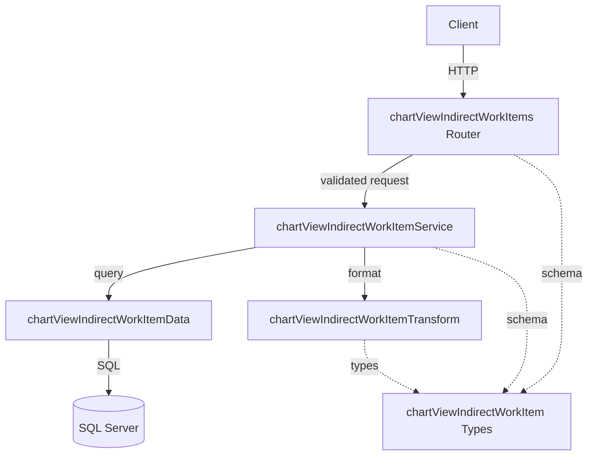

# Design Document

## Overview

**Purpose**: チャートビュー間接作業項目（chart_view_indirect_work_items）のCRUD APIを提供し、チャートビューにどの間接作業ケースを含めるかを管理する。

**Users**: 事業部リーダーがチャートビューの間接作業構成を設定・管理するために使用する。フロントエンド開発者は統一されたAPI形式でデータを取得する。

**Impact**: 既存の chart_views API にネストされた子リソースエンドポイントを追加する。既存機能への変更はルート登録（index.ts）への1行追加のみ。

### Goals
- chart_view_indirect_work_items テーブルに対する完全なCRUD操作を提供する
- 既存の関連テーブルCRUDパターン（indirectWorkTypeRatios等）と一貫した設計にする
- RFC 9457 Problem Details形式のエラーハンドリングを実装する

### Non-Goals
- バルクupsert操作（現時点では不要）
- ページネーション（1チャートビューあたりの項目数は限定的）
- chart_view_project_items の実装（別spec）

## Architecture

### Existing Architecture Analysis

既存のレイヤードアーキテクチャ（routes → services → data → transform → types）に完全に準拠する。関連テーブルCRUDの確立パターン（`indirectWorkTypeRatios`）を踏襲する。

- **Routes**: Honoルーターでエンドポイント定義、`parseIntParam` でパスパラメータバリデーション
- **Services**: ビジネスロジック（親存在確認、所有権検証、外部キー検証、重複チェック）
- **Data**: SQL Server直接クエリ（mssqlライブラリ）、パラメータ化クエリ
- **Transform**: DB Row（snake_case）→ API Response（camelCase）変換
- **Types**: Zodスキーマ + TypeScript型定義

### Architecture Pattern & Boundary Map



**Architecture Integration**:
- **Selected pattern**: レイヤードアーキテクチャ（既存パターン踏襲）
- **Domain boundaries**: chartViewIndirectWorkItem は chartViews ドメインのサブリソース
- **Existing patterns preserved**: ネストURL、物理削除、parseIntParam、validate ユーティリティ
- **New components**: 5ファイル（routes, services, data, transform, types）
- **Steering compliance**: routes → services → data の依存方向を遵守

### Technology Stack

| Layer | Choice / Version | Role in Feature | Notes |
|-------|------------------|-----------------|-------|
| Backend | Hono v4 | ルーティング・バリデーション | 既存パターン踏襲 |
| Validation | Zod + @hono/zod-validator | リクエストバリデーション | validate ユーティリティ経由 |
| Data | mssql | SQL Server接続・クエリ | パラメータ化クエリ |
| Test | Vitest | ユニットテスト | app.request() パターン |

## Requirements Traceability

| Requirement | Summary | Components | Interfaces | Flows |
|-------------|---------|------------|------------|-------|
| 1.1 | 一覧取得 | Router, Service, Data, Transform | GET API | - |
| 1.2 | caseName JOIN | Data, Transform, Types | - | - |
| 1.3 | displayOrder昇順ソート | Data | - | - |
| 1.4, 1.5 | 親チャートビュー存在確認 | Service, Data | - | - |
| 2.1 | 単一取得 | Router, Service, Data, Transform | GET API | - |
| 2.2 | caseName JOIN | Data, Transform, Types | - | - |
| 2.3 | 存在しないID 404 | Service | - | - |
| 2.4 | chartViewId不一致 404 | Service | - | - |
| 3.1 | 新規作成 201 | Router, Service, Data | POST API | - |
| 3.2 | Location ヘッダ | Router | - | - |
| 3.3 | リクエストボディ | Types | - | - |
| 3.4 | 親チャートビュー不存在 404 | Service, Data | - | - |
| 3.5 | 間接作業ケース不存在 422 | Service, Data | - | - |
| 3.6 | 重複 409 | Service, Data | - | - |
| 3.7 | バリデーションエラー 422 | Router, Types | - | - |
| 4.1 | 更新 200 | Router, Service, Data | PUT API | - |
| 4.2 | 更新フィールド | Types | - | - |
| 4.3 | 存在しないID 404 | Service | - | - |
| 4.4 | chartViewId不一致 404 | Service | - | - |
| 4.5 | バリデーションエラー 422 | Router, Types | - | - |
| 5.1 | 物理削除 204 | Router, Service, Data | DELETE API | - |
| 5.2 | 存在しないID 404 | Service | - | - |
| 5.3 | chartViewId不一致 404 | Service | - | - |
| 6.1-6.5 | レスポンス形式 | Transform, Types | - | - |
| 7.1-7.4 | バリデーション | Router, Types | - | - |
| 8.1-8.4 | テスト | Test | - | - |

## Components and Interfaces

| Component | Domain/Layer | Intent | Req Coverage | Key Dependencies | Contracts |
|-----------|--------------|--------|--------------|------------------|-----------|
| chartViewIndirectWorkItems Router | routes | HTTPエンドポイント定義 | 1.1, 2.1, 3.1-3.2, 4.1, 5.1, 7.1 | Service (P0), Types (P0) | API |
| chartViewIndirectWorkItemService | services | ビジネスロジック | 1.4-1.5, 2.3-2.4, 3.4-3.6, 4.3-4.4, 5.2-5.3 | Data (P0), Transform (P0) | Service |
| chartViewIndirectWorkItemData | data | DBクエリ実行 | 1.2-1.3, 全CRUD操作 | mssql (P0) | - |
| chartViewIndirectWorkItemTransform | transform | Row→Response変換 | 6.1-6.5 | Types (P0) | - |
| chartViewIndirectWorkItem Types | types | Zodスキーマ・型定義 | 3.3, 4.2, 7.2-7.4 | Zod (P0) | - |

### Routes Layer

#### chartViewIndirectWorkItems Router

| Field | Detail |
|-------|--------|
| Intent | チャートビュー間接作業項目のHTTPエンドポイントを定義する |
| Requirements | 1.1, 2.1, 3.1, 3.2, 4.1, 5.1, 7.1 |

**Responsibilities & Constraints**
- `/chart-views/:chartViewId/indirect-work-items` 配下の全CRUDエンドポイントを定義
- `parseIntParam` でパスパラメータをバリデーション
- `validate` ユーティリティでリクエストボディをバリデーション
- Service層へのリクエスト委譲とレスポンス整形

**Dependencies**
- Outbound: chartViewIndirectWorkItemService — ビジネスロジック実行 (P0)
- Outbound: Types — Zodスキーマ参照 (P0)
- External: @/utils/validate — バリデーションミドルウェア (P0)

**Contracts**: API [x]

##### API Contract

| Method | Endpoint | Request | Response | Errors |
|--------|----------|---------|----------|--------|
| GET | /chart-views/:chartViewId/indirect-work-items | - | `{ data: ChartViewIndirectWorkItem[] }` | 404 |
| GET | /chart-views/:chartViewId/indirect-work-items/:id | - | `{ data: ChartViewIndirectWorkItem }` | 404 |
| POST | /chart-views/:chartViewId/indirect-work-items | CreateChartViewIndirectWorkItem | `{ data: ChartViewIndirectWorkItem }` | 404, 409, 422 |
| PUT | /chart-views/:chartViewId/indirect-work-items/:id | UpdateChartViewIndirectWorkItem | `{ data: ChartViewIndirectWorkItem }` | 404, 422 |
| DELETE | /chart-views/:chartViewId/indirect-work-items/:id | - | 204 No Content | 404 |

**Implementation Notes**
- ルート登録: `index.ts` に `app.route('/chart-views/:chartViewId/indirect-work-items', chartViewIndirectWorkItems)` を追加
- POST成功時: `Location` ヘッダに `/chart-views/{chartViewId}/indirect-work-items/{id}` を設定
- `parseIntParam` はルートファイル内にローカル定義（既存パターン踏襲）

### Services Layer

#### chartViewIndirectWorkItemService

| Field | Detail |
|-------|--------|
| Intent | チャートビュー間接作業項目のビジネスロジックを提供する |
| Requirements | 1.4, 1.5, 2.3, 2.4, 3.4, 3.5, 3.6, 4.3, 4.4, 5.2, 5.3 |

**Responsibilities & Constraints**
- 親チャートビューの存在確認（論理削除済みも404扱い）
- 子リソースの所有権検証（chartViewIdの一致確認）
- 外部キー参照の存在確認（indirectWorkCaseId）
- 同一チャートビュー内の重複チェック（chartViewId + indirectWorkCaseId）

**Dependencies**
- Outbound: chartViewIndirectWorkItemData — DBクエリ実行 (P0)
- Outbound: chartViewIndirectWorkItemTransform — レスポンス変換 (P0)

**Contracts**: Service [x]

##### Service Interface

```typescript
interface ChartViewIndirectWorkItemService {
  findAll(chartViewId: number): Promise<ChartViewIndirectWorkItem[]>
  findById(chartViewId: number, id: number): Promise<ChartViewIndirectWorkItem>
  create(chartViewId: number, data: CreateChartViewIndirectWorkItem): Promise<ChartViewIndirectWorkItem>
  update(chartViewId: number, id: number, data: UpdateChartViewIndirectWorkItem): Promise<ChartViewIndirectWorkItem>
  delete(chartViewId: number, id: number): Promise<void>
}
```

- **Preconditions**:
  - `chartViewId` は正の整数
  - `id` は正の整数（findById, update, delete）
  - 作成時: `data.indirectWorkCaseId` は正の整数
- **Postconditions**:
  - findAll: 指定チャートビューに紐づく全項目を displayOrder 昇順で返却
  - findById: 指定IDの項目を返却。chartViewId不一致なら HTTPException(404)
  - create: 新規レコード挿入後、caseName含むレスポンスを返却
  - update: updated_at を更新し、更新後のレスポンスを返却
  - delete: 対象レコードを物理削除
- **Invariants**:
  - 親チャートビューが存在しない（または論理削除済み）場合は HTTPException(404)
  - indirectWorkCaseId が存在しない場合は HTTPException(422)
  - 同一チャートビュー内に同じ indirectWorkCaseId が既に存在する場合は HTTPException(409)

### Data Layer

#### chartViewIndirectWorkItemData

| Field | Detail |
|-------|--------|
| Intent | chart_view_indirect_work_items テーブルへのCRUDクエリを実行する |
| Requirements | 1.2, 1.3, 全CRUD操作 |

**Responsibilities & Constraints**
- SQL Server へのパラメータ化クエリ実行
- LEFT JOIN で indirect_work_cases テーブルから case_name を取得
- displayOrder ASC でソート
- 物理削除（DELETE文）

**Dependencies**
- External: mssql — SQL Server接続 (P0)
- External: @/database/client — コネクションプール取得 (P0)

**Contracts**: Service [x]

##### Service Interface

```typescript
interface ChartViewIndirectWorkItemData {
  findAll(chartViewId: number): Promise<ChartViewIndirectWorkItemRow[]>
  findById(id: number): Promise<ChartViewIndirectWorkItemRow | undefined>
  create(data: {
    chartViewId: number
    indirectWorkCaseId: number
    displayOrder: number
    isVisible: boolean
  }): Promise<ChartViewIndirectWorkItemRow>
  update(id: number, data: Partial<{
    displayOrder: number
    isVisible: boolean
  }>): Promise<ChartViewIndirectWorkItemRow | undefined>
  deleteById(id: number): Promise<boolean>
  chartViewExists(chartViewId: number): Promise<boolean>
  indirectWorkCaseExists(indirectWorkCaseId: number): Promise<boolean>
  duplicateExists(chartViewId: number, indirectWorkCaseId: number, excludeId?: number): Promise<boolean>
}
```

- **findAll SQL**:
  ```sql
  SELECT i.*, c.case_name
  FROM chart_view_indirect_work_items i
  LEFT JOIN indirect_work_cases c ON i.indirect_work_case_id = c.indirect_work_case_id
  WHERE i.chart_view_id = @chartViewId
  ORDER BY i.display_order ASC
  ```
- **chartViewExists SQL**: `SELECT 1 FROM chart_views WHERE chart_view_id = @chartViewId AND deleted_at IS NULL`
- **indirectWorkCaseExists SQL**: `SELECT 1 FROM indirect_work_cases WHERE indirect_work_case_id = @indirectWorkCaseId AND deleted_at IS NULL`
- **duplicateExists SQL**: `SELECT 1 FROM chart_view_indirect_work_items WHERE chart_view_id = @chartViewId AND indirect_work_case_id = @indirectWorkCaseId [AND chart_view_indirect_work_item_id != @excludeId]`

### Transform Layer

#### chartViewIndirectWorkItemTransform

| Field | Detail |
|-------|--------|
| Intent | DB Row（snake_case）から API Response（camelCase）への変換 |
| Requirements | 6.4, 6.5 |

**Responsibilities & Constraints**
- snake_case → camelCase のフィールド名変換
- Date → ISO 8601文字列への変換
- case_name → caseName のマッピング

**Dependencies**
- Inbound: chartViewIndirectWorkItemService — 変換呼び出し (P0)

**Contracts**: Service [x]

##### Service Interface

```typescript
function toChartViewIndirectWorkItemResponse(
  row: ChartViewIndirectWorkItemRow
): ChartViewIndirectWorkItem
```

### Types Layer

#### chartViewIndirectWorkItem Types

| Field | Detail |
|-------|--------|
| Intent | ZodスキーマとTypeScript型を定義する |
| Requirements | 3.3, 4.2, 7.2, 7.3, 7.4 |

**Responsibilities & Constraints**
- Zodスキーマによるリクエストバリデーション
- DB Row型の定義（snake_case）
- API Response型の定義（camelCase）

## Data Models

### Domain Model

- **Aggregate**: ChartView（chart_views がルートエンティティ）
- **Entity**: ChartViewIndirectWorkItem（chart_view_indirect_work_items）
- **参照先**: IndirectWorkCase（indirect_work_cases）
- **Business Rules**:
  - 1つのチャートビューに同一の間接作業ケースは1つのみ紐づけ可能
  - 親チャートビューが論理削除されている場合、子リソースへのアクセスは拒否

### Logical Data Model

**Structure Definition**:
- ChartView (1) → (*) ChartViewIndirectWorkItem: 1対多（カスケード削除）
- IndirectWorkCase (1) → (*) ChartViewIndirectWorkItem: 1対多（参照のみ）

**Consistency & Integrity**:
- 親テーブル（chart_views）削除時にカスケード削除
- indirect_work_cases への外部キー参照（カスケード削除なし）

### Data Contracts & Integration

**API Data Transfer**

DB Row型:
```typescript
type ChartViewIndirectWorkItemRow = {
  chart_view_indirect_work_item_id: number
  chart_view_id: number
  indirect_work_case_id: number
  display_order: number
  is_visible: boolean
  created_at: Date
  updated_at: Date
  case_name: string | null  // JOINで取得
}
```

API Response型:
```typescript
type ChartViewIndirectWorkItem = {
  chartViewIndirectWorkItemId: number
  chartViewId: number
  indirectWorkCaseId: number
  caseName: string | null
  displayOrder: number
  isVisible: boolean
  createdAt: string  // ISO 8601
  updatedAt: string  // ISO 8601
}
```

Create Schema:
```typescript
const createChartViewIndirectWorkItemSchema = z.object({
  indirectWorkCaseId: z.number().int().positive(),
  displayOrder: z.number().int().min(0).default(0),
  isVisible: z.boolean().default(true),
})
```

Update Schema:
```typescript
const updateChartViewIndirectWorkItemSchema = z.object({
  displayOrder: z.number().int().min(0).optional(),
  isVisible: z.boolean().optional(),
})
```

## Error Handling

### Error Categories and Responses

**User Errors (4xx)**:
- **404 Not Found**: 親チャートビュー不存在/論理削除済み、子リソース不存在、chartViewId不一致
- **409 Conflict**: 同一チャートビュー内で同じ indirectWorkCaseId の重複登録
- **422 Validation Error**: リクエストボディバリデーション失敗、indirectWorkCaseId の参照先不存在

全エラーは RFC 9457 Problem Details形式で返却。既存の `errorHelper.ts`（`problemResponse`, `getProblemType`, `getStatusTitle`）と `validate.ts` を使用。

## Testing Strategy

### Unit Tests
テストファイル: `apps/backend/src/__tests__/routes/chartViewIndirectWorkItems.test.ts`

- **正常系**: 一覧取得（displayOrder昇順確認）、単一取得（caseName含む）、新規作成（201 + Location）、更新（200）、物理削除（204）
- **バリデーション**: 必須項目欠落、型不正（文字列→数値）、範囲外値（負の displayOrder）
- **エラーケース**: 存在しないチャートビューID（404）、存在しない項目ID（404）、chartViewId不一致（404）、重複 indirectWorkCaseId（409）、存在しない indirectWorkCaseId（422）
- **テスト方法**: Vitest + `app.request()` メソッド

## File Structure

新規作成ファイル:
```
apps/backend/src/
  routes/chartViewIndirectWorkItems.ts
  services/chartViewIndirectWorkItemService.ts
  data/chartViewIndirectWorkItemData.ts
  transform/chartViewIndirectWorkItemTransform.ts
  types/chartViewIndirectWorkItem.ts
  __tests__/routes/chartViewIndirectWorkItems.test.ts
```

変更ファイル:
```
apps/backend/src/index.ts  (ルート登録追加)
```
