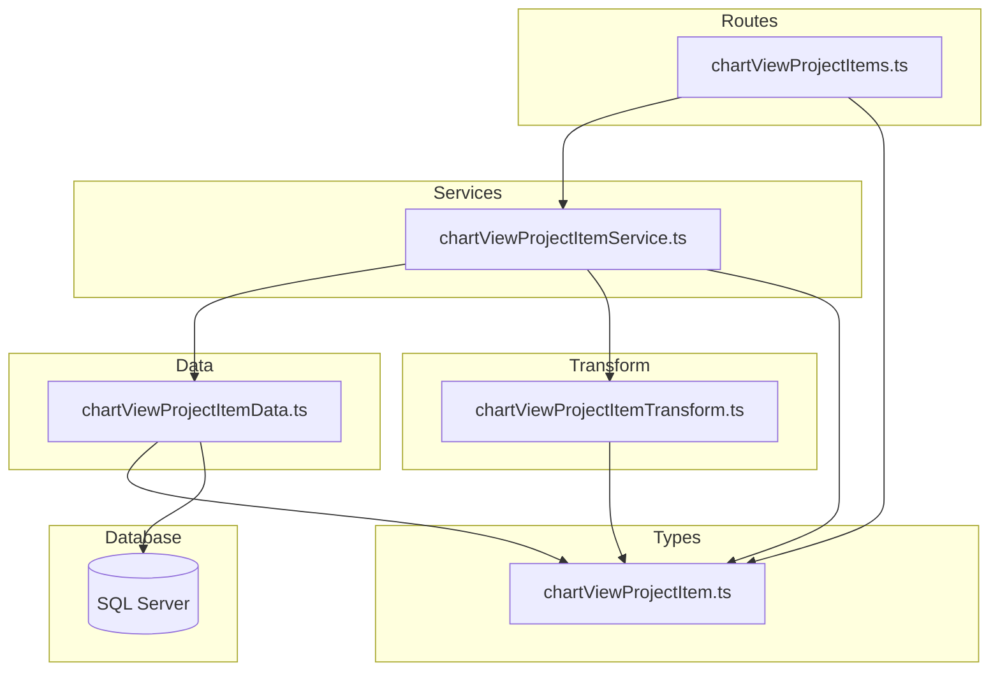

# Design Document: chart-view-project-items-crud-api

## Overview

**Purpose**: チャートビューに含まれる案件項目（chart_view_project_items）のCRUD APIを提供し、事業部リーダーがチャート上に表示する案件の構成・表示順序・表示/非表示を管理できるようにする。

**Users**: 事業部リーダー、フロントエンド開発者が、チャートビュー管理画面で案件項目の追加・削除・並び替えを行う。

**Impact**: 既存の chart-views CRUD API にネストされた子リソースのエンドポイントを追加する。物理削除パターン（projectLoads と同等）を採用し、JOINによる関連リソース情報の付加が固有の設計要素。

### Goals
- chart_view_project_items テーブルに対するCRUD操作（一覧・単一取得・作成・更新・物理削除）の提供
- 表示順序の一括更新エンドポイントの提供
- 関連リソース情報（案件名・案件ケース名）を含むレスポンスの返却
- 外部キー参照先（chart_views, projects, project_cases）の存在検証

### Non-Goals
- chart_view_indirect_work_items のCRUD操作
- ページネーション（1チャートビューあたりの項目数は限定的）
- 論理削除・復元（関連テーブルのため物理削除を採用）
- フロントエンド実装

## Architecture

### Existing Architecture Analysis

既存のネストされたリソースAPI（projectLoads, monthlyHeadcountPlans 等）のパターンを踏襲する。差異は以下の通り：

- **JOINが必要**: 一覧・単一取得時に projects / project_cases テーブルをJOIN
- **複数の外部キー検証**: 作成時に chart_views, projects, project_cases の3テーブルの存在・整合性を検証
- **一括表示順序更新**: `/display-order` エンドポイントを新規追加（既存の `/bulk` upsertとは異なるセマンティクス）
- **projectId の変更禁止**: 更新時に projectId の変更を受け付けない設計

### Architecture Pattern & Boundary Map



**Architecture Integration**:
- **Selected pattern**: 既存のレイヤードアーキテクチャを踏襲（projectLoads パターンがベース）
- **Domain/feature boundaries**: chartViewProjectItem の各層ファイルが責務を分離。データ層に外部キー検証メソッドを配置
- **Existing patterns preserved**: validate ミドルウェア、parseIntParam、problemResponse ヘルパー
- **New components rationale**: 5ファイル（types, data, transform, service, routes）は既存パターンの直接的な拡張
- **Steering compliance**: レイヤー間の依存方向（routes → services → data）を厳守

### Technology Stack

| Layer | Choice / Version | Role in Feature | Notes |
|-------|------------------|-----------------|-------|
| Backend | Hono v4 | ルーティング・ミドルウェア | 既存と同一 |
| Validation | Zod + @hono/zod-validator | リクエストバリデーション | |
| Data | mssql | SQL Server クエリ実行（JOIN含む） | projects, project_cases との JOIN |
| Test | Vitest | ユニットテスト | 既存と同一 |

## Requirements Traceability

| Requirement | Summary | Components | Interfaces | Notes |
|-------------|---------|------------|------------|-------|
| 1.1, 1.2, 1.3, 1.4 | 一覧取得（display_order昇順・親リソース検証・関連情報付き） | Data, Transform, Service, Routes | API: GET / | JOIN で案件情報を付加 |
| 2.1, 2.2, 2.3 | 単一取得（404処理・所属チェック） | Data, Transform, Service, Routes | API: GET /:id | |
| 3.1, 3.2, 3.3, 3.4, 3.5, 3.6, 3.7 | 新規作成（FK検証・バリデーション） | Data, Service, Routes, Types | API: POST / | 3テーブルの存在検証 |
| 4.1, 4.2, 4.3, 4.4, 4.5, 4.6 | 更新（projectId変更禁止・FK検証） | Data, Service, Routes, Types | API: PUT /:id | |
| 5.1, 5.2, 5.3 | 物理削除 | Data, Service, Routes | API: DELETE /:id | |
| 6.1, 6.2, 6.3, 6.4 | 一括表示順序更新 | Data, Service, Routes, Types | API: PUT /display-order | トランザクション |
| 7.1, 7.2, 7.3, 7.4, 7.5 | レスポンス形式 | Transform, Routes | 全エンドポイント | ネストオブジェクト |
| 8.1, 8.2, 8.3, 8.4, 8.5, 8.6 | バリデーション | Types, Service, Data | Zod スキーマ | FK存在検証 |
| 9.1, 9.2, 9.3, 9.4 | テスト | テストファイル | Vitest | |

## Components and Interfaces

| Component | Domain/Layer | Intent | Req Coverage | Key Dependencies | Contracts |
|-----------|-------------|--------|--------------|------------------|-----------|
| chartViewProjectItem.ts | Types | Zodスキーマ・型定義 | 7, 8 | — | State |
| chartViewProjectItemData.ts | Data | SQLクエリ実行・FK存在検証 | 1, 2, 3, 4, 5, 6, 8.6 | database/client (P0) | Service |
| chartViewProjectItemTransform.ts | Transform | Row→Response変換（ネストオブジェクト含む） | 7 | types (P0) | — |
| chartViewProjectItemService.ts | Service | ビジネスロジック・FK検証 | 1–6, 8 | Data (P0), Transform (P0) | Service |
| chartViewProjectItems.ts | Routes | HTTPエンドポイント | 1–8 | Service (P0), Types (P0), validate (P0) | API |

### Types Layer

#### chartViewProjectItem.ts

| Field | Detail |
|-------|--------|
| Intent | Zodバリデーションスキーマとリクエスト・レスポンス・DB行のTypeScript型を定義 |
| Requirements | 7.3, 7.4, 7.5, 8.1, 8.2, 8.3, 8.4, 8.5 |

**Contracts**: State [x]

##### State Management

```typescript
// --- Zod スキーマ ---

/** 作成用スキーマ */
// createChartViewProjectItemSchema = z.object({
//   projectId: z.number().int().positive(),
//   projectCaseId: z.number().int().positive().nullable().optional(),
//   displayOrder: z.number().int().min(0).default(0),
//   isVisible: z.boolean().default(true),
// })

/** 更新用スキーマ（projectId は変更不可） */
// updateChartViewProjectItemSchema = z.object({
//   projectCaseId: z.number().int().positive().nullable().optional(),
//   displayOrder: z.number().int().min(0).optional(),
//   isVisible: z.boolean().optional(),
// })

/** 一括表示順序更新用スキーマ */
// updateDisplayOrderSchema = z.object({
//   items: z.array(
//     z.object({
//       chartViewProjectItemId: z.number().int().positive(),
//       displayOrder: z.number().int().min(0),
//     })
//   ).min(1),
// })

// --- TypeScript 型 ---

type CreateChartViewProjectItem = z.infer<typeof createChartViewProjectItemSchema>
type UpdateChartViewProjectItem = z.infer<typeof updateChartViewProjectItemSchema>
type UpdateDisplayOrder = z.infer<typeof updateDisplayOrderSchema>

/** DB行型（snake_case — JOINカラム含む） */
type ChartViewProjectItemRow = {
  chart_view_project_item_id: number
  chart_view_id: number
  project_id: number
  project_case_id: number | null
  display_order: number
  is_visible: boolean
  created_at: Date
  updated_at: Date
  // JOIN カラム
  project_code: string
  project_name: string
  case_name: string | null
}

/** APIレスポンス型（camelCase） */
type ChartViewProjectItem = {
  chartViewProjectItemId: number
  chartViewId: number
  projectId: number
  projectCaseId: number | null
  displayOrder: number
  isVisible: boolean
  createdAt: string   // ISO 8601
  updatedAt: string   // ISO 8601
  project: {
    projectCode: string
    projectName: string
  }
  projectCase: {
    caseName: string
  } | null
}
```

**Implementation Notes**:
- `is_visible` は SQL Server の BIT 型。mssql ドライバは boolean として返す
- `projectCaseId` は nullable かつ optional（作成時に省略可能、null を明示的に設定可能）
- DB行型に JOIN 先のカラム（`project_code`, `project_name`, `case_name`）を含む

---

### Data Layer

#### chartViewProjectItemData.ts

| Field | Detail |
|-------|--------|
| Intent | chart_view_project_items テーブルへのSQLクエリ実行と外部キー存在検証 |
| Requirements | 1.1, 1.2, 1.3, 2.1, 2.2, 2.3, 3.1, 3.5, 3.6, 3.7, 4.1, 4.5, 5.1, 6.1, 8.6 |

**Dependencies**:
- Inbound: chartViewProjectItemService — CRUD操作・FK検証 (P0)
- External: mssql / database/client — DB接続 (P0)

**Contracts**: Service [x]

##### Service Interface

```typescript
interface ChartViewProjectItemDataInterface {
  findAll(chartViewId: number): Promise<ChartViewProjectItemRow[]>

  findById(id: number): Promise<ChartViewProjectItemRow | undefined>

  create(data: {
    chartViewId: number
    projectId: number
    projectCaseId: number | null
    displayOrder: number
    isVisible: boolean
  }): Promise<ChartViewProjectItemRow>

  update(id: number, data: {
    projectCaseId?: number | null
    displayOrder?: number
    isVisible?: boolean
  }): Promise<ChartViewProjectItemRow | undefined>

  deleteById(id: number): Promise<boolean>

  updateDisplayOrders(
    items: Array<{ chartViewProjectItemId: number; displayOrder: number }>
  ): Promise<void>

  chartViewExists(chartViewId: number): Promise<boolean>

  projectExists(projectId: number): Promise<boolean>

  projectCaseBelongsToProject(
    projectCaseId: number,
    projectId: number
  ): Promise<boolean>
}
```

- **Preconditions**: DB接続が確立されていること
- **Postconditions**: 各メソッドは指定された条件に合致するレコードを返す。見つからない場合は undefined
- **Invariants**: すべてのクエリはパラメータ化されている（SQLインジェクション防止）

**Implementation Notes**:
- `findAll`: projects テーブルを INNER JOIN、project_cases テーブルを LEFT JOIN。`display_order ASC` でソート
- `findById`: 同じ JOIN 構成。単一レコード返却
- `create`: INSERT の OUTPUT 句で ID を取得後、`findById` で JOIN 込みのレコードを返却
- `update`: 動的SET句を構築。`updated_at = GETDATE()` を常に含む。UPDATE 後に `findById` で最新レコードを返却
- `deleteById`: 物理削除（`DELETE FROM`）
- `updateDisplayOrders`: トランザクション内でループ UPDATE。各行の `display_order` と `updated_at` を更新
- `chartViewExists`: chart_views テーブルで `deleted_at IS NULL` 条件付き EXISTS 検証
- `projectExists`: projects テーブルで `deleted_at IS NULL` 条件付き EXISTS 検証
- `projectCaseBelongsToProject`: project_cases テーブルで `project_id` 一致 AND `deleted_at IS NULL` 条件付き EXISTS 検証

---

### Transform Layer

#### chartViewProjectItemTransform.ts

| Field | Detail |
|-------|--------|
| Intent | ChartViewProjectItemRow（snake_case + JOINカラム）→ ChartViewProjectItem（camelCase + ネストオブジェクト）の変換 |
| Requirements | 7.3, 7.4, 7.5 |

**Implementation Notes**:
- snake_case → camelCase のフィールドマッピング
- `created_at` / `updated_at` を `.toISOString()` で ISO 8601 文字列に変換
- JOINカラムをネストオブジェクトに変換:
  - `project_code`, `project_name` → `project: { projectCode, projectName }`
  - `case_name` → `projectCase: { caseName } | null`（project_case_id が null の場合は null）

---

### Service Layer

#### chartViewProjectItemService.ts

| Field | Detail |
|-------|--------|
| Intent | CRUD操作のビジネスロジック。外部キー存在検証・所属チェック・エラーハンドリングを担当 |
| Requirements | 1.1–1.4, 2.1–2.3, 3.1–3.7, 4.1–4.6, 5.1–5.3, 6.1–6.4, 8.6 |

**Dependencies**:
- Inbound: chartViewProjectItems route — HTTPハンドラ (P0)
- Outbound: chartViewProjectItemData — DB操作・FK検証 (P0)
- Outbound: chartViewProjectItemTransform — レスポンス変換 (P0)

**Contracts**: Service [x]

##### Service Interface

```typescript
interface ChartViewProjectItemServiceInterface {
  findAll(chartViewId: number): Promise<ChartViewProjectItem[]>
  // throws HTTPException(404) if chartView not found

  findById(chartViewId: number, id: number): Promise<ChartViewProjectItem>
  // throws HTTPException(404) if not found or chartViewId mismatch

  create(
    chartViewId: number,
    data: CreateChartViewProjectItem
  ): Promise<ChartViewProjectItem>
  // throws HTTPException(404) if chartView not found
  // throws HTTPException(422) if project/projectCase not found or mismatch

  update(
    chartViewId: number,
    id: number,
    data: UpdateChartViewProjectItem
  ): Promise<ChartViewProjectItem>
  // throws HTTPException(404) if not found or chartViewId mismatch
  // throws HTTPException(422) if projectCase not found or mismatch

  delete(chartViewId: number, id: number): Promise<void>
  // throws HTTPException(404) if not found or chartViewId mismatch

  updateDisplayOrder(
    chartViewId: number,
    data: UpdateDisplayOrder
  ): Promise<ChartViewProjectItem[]>
  // throws HTTPException(404) if chartView not found
  // throws HTTPException(422) if items contain IDs not belonging to chartView
}
```

- **Preconditions**: 各メソッドの引数がバリデーション済みであること（ルート層で実施）
- **Postconditions**: 成功時は変換済みレスポンスを返す。失敗時は適切な HTTPException をスロー
- **Invariants**:
  - `create` / `update` 時に FK 参照先の存在を検証
  - `update` では `projectId` の変更を受け付けない（スキーマに含まれていない）
  - `findById` / `update` / `delete` では `chartViewId` の所属チェックを実施

**Implementation Notes**:
- `findAll`: `chartViewExists()` で親リソース検証後、`findAll()` → `map(toResponse)` で返却
- `findById`: `findById()` で取得後、`chart_view_id !== chartViewId` なら 404
- `create`: (1) `chartViewExists()` → (2) `projectExists()` → (3) `projectCaseId` が指定されていれば `projectCaseBelongsToProject()` → (4) `create()` → `toResponse()`
- `update`: (1) `findById()` で存在・所属チェック → (2) `projectCaseId` が指定されていれば `projectCaseBelongsToProject()` で既存 `project_id` との整合性検証 → (3) `update()` → `toResponse()`
- `delete`: `findById()` で存在・所属チェック後、`deleteById()`
- `updateDisplayOrder`: (1) `chartViewExists()` → (2) 全IDの所属チェック（`findById()` で検証） → (3) `updateDisplayOrders()` → (4) `findAll()` → `map(toResponse)` で更新後の一覧を返却

---

### Routes Layer

#### chartViewProjectItems.ts

| Field | Detail |
|-------|--------|
| Intent | HTTPエンドポイント定義。バリデーション・レスポンス整形を担当 |
| Requirements | 1.1, 2.1, 3.1–3.2, 4.1, 5.1, 6.1, 7.1–7.2, 8.1–8.4 |

**Contracts**: API [x]

##### API Contract

| Method | Endpoint | Request | Response | Status | Errors |
|--------|----------|---------|----------|--------|--------|
| GET | / | chartViewId: number (path) | `{ data: ChartViewProjectItem[] }` | 200 | 404 |
| GET | /:id | chartViewId, id: number (path) | `{ data: ChartViewProjectItem }` | 200 | 404 |
| POST | / | chartViewId (path) + CreateChartViewProjectItem (json) | `{ data: ChartViewProjectItem }` + Location header | 201 | 404, 422 |
| PUT | /display-order | chartViewId (path) + UpdateDisplayOrder (json) | `{ data: ChartViewProjectItem[] }` | 200 | 404, 422 |
| PUT | /:id | chartViewId, id (path) + UpdateChartViewProjectItem (json) | `{ data: ChartViewProjectItem }` | 200 | 404, 422 |
| DELETE | /:id | chartViewId, id: number (path) | (no body) | 204 | 404 |

**Implementation Notes**:
- `app.route('/chart-views/:chartViewId/project-items', chartViewProjectItems)` で index.ts にマウント
- `PUT /display-order` を `PUT /:id` より前に定義（ルート競合回避）
- `parseIntParam()` で `chartViewId` と `id` を正の整数として検証
- メソッドチェーンでルートを定義し、`ChartViewProjectItemsRoute` 型をエクスポート

## Data Models

### Domain Model

```mermaid
erDiagram
    chart_views ||--o{ chart_view_project_items : contains
    projects ||--o{ chart_view_project_items : referenced_by
    project_cases ||--o{ chart_view_project_items : optionally_referenced_by

    chart_view_project_items {
        int chart_view_project_item_id PK
        int chart_view_id FK
        int project_id FK
        int project_case_id FK_nullable
        int display_order
        boolean is_visible
        datetime created_at
        datetime updated_at
    }
```

**Business Rules & Invariants**:
- chart_view_project_item_id は自動採番（IDENTITY）、変更不可
- chart_view_id は必須。chart_views に存在し、論理削除されていないこと
- project_id は必須・変更不可。projects に存在し、論理削除されていないこと
- project_case_id は任意。指定時は project_cases に存在し、かつ該当 project_id に所属すること
- display_order はデフォルト 0。一括更新でチャート内の積み上げ順序を制御
- is_visible はデフォルト true
- 物理削除のみ（`deleted_at` カラムなし）
- chart_views の論理削除時は ON DELETE CASCADE により本テーブルのレコードが物理削除される

### Physical Data Model

対象テーブル `chart_view_project_items` のスキーマは `docs/database/table-spec.md` に定義済み。新規テーブル作成やスキーマ変更は不要。

### Data Contracts & Integration

**API Data Transfer**:

レスポンス例（一覧取得）:
```json
{
  "data": [
    {
      "chartViewProjectItemId": 1,
      "chartViewId": 10,
      "projectId": 5,
      "projectCaseId": 12,
      "displayOrder": 0,
      "isVisible": true,
      "createdAt": "2026-01-31T00:00:00.000Z",
      "updatedAt": "2026-01-31T00:00:00.000Z",
      "project": {
        "projectCode": "PRJ-001",
        "projectName": "新規開発プロジェクトA"
      },
      "projectCase": {
        "caseName": "標準ケース"
      }
    },
    {
      "chartViewProjectItemId": 2,
      "chartViewId": 10,
      "projectId": 8,
      "projectCaseId": null,
      "displayOrder": 1,
      "isVisible": true,
      "createdAt": "2026-01-31T00:00:00.000Z",
      "updatedAt": "2026-01-31T00:00:00.000Z",
      "project": {
        "projectCode": "PRJ-002",
        "projectName": "改修プロジェクトB"
      },
      "projectCase": null
    }
  ]
}
```

レスポンス例（一括表示順序更新リクエスト）:
```json
{
  "items": [
    { "chartViewProjectItemId": 2, "displayOrder": 0 },
    { "chartViewProjectItemId": 1, "displayOrder": 1 }
  ]
}
```

## Error Handling

### Error Strategy

既存のグローバルエラーハンドラ（index.ts の `app.onError`）と RFC 9457 Problem Details 形式に従う。サービス層から HTTPException をスローし、グローバルハンドラが統一的に処理する。

### Error Categories and Responses

| Status | Type | Trigger | Detail |
|--------|------|---------|--------|
| 404 | resource-not-found | チャートビューID不存在・論理削除済み | `Chart view with ID '{id}' not found` |
| 404 | resource-not-found | 案件項目ID不存在・所属不一致 | `Chart view project item with ID '{id}' not found` |
| 422 | validation-error | Zodバリデーション失敗 | errors 配列にフィールド別詳細 |
| 422 | validation-error | projectId の案件が不存在 | `Project with ID '{id}' not found` |
| 422 | validation-error | projectCaseId の案件ケースが不存在・所属不一致 | `Project case with ID '{id}' not found or does not belong to project '{projectId}'` |
| 422 | validation-error | 一括更新でchartViewに属さないIDが含まれる | `Chart view project item with ID '{id}' does not belong to chart view '{chartViewId}'` |

## Testing Strategy

### Unit Tests

テストファイルの配置は既存パターンに従い `src/__tests__/` にソース構造をミラーする。

#### routes/chartViewProjectItems.test.ts
- GET / — 一覧取得（200、空リスト、404 チャートビュー不存在）
- GET /:id — 単一取得（200、404 項目不存在、404 所属不一致）
- POST / — 作成（201、Location ヘッダ、422 バリデーションエラー、422 案件不存在、422 案件ケース所属不一致、404 チャートビュー不存在）
- PUT /display-order — 一括表示順序更新（200、422 所属不一致ID、422 バリデーションエラー）
- PUT /:id — 更新（200、404、422、projectCaseId 検証）
- DELETE /:id — 削除（204、404、404 所属不一致）

#### services/chartViewProjectItemService.test.ts
- findAll — 親リソース検証とデータ層呼び出し・Transform適用の検証
- findById — 正常系と404例外・所属チェックの検証
- create — FK存在検証（chartView, project, projectCase）の正常系・エラー系
- update — projectCaseId の整合性検証（既存 projectId との所属チェック）
- delete — 正常系と404例外・所属チェックの検証
- updateDisplayOrder — トランザクション・所属チェック・更新後一覧返却の検証

#### data/chartViewProjectItemData.test.ts
- findAll — JOIN付きSQL実行と display_order ソート
- findById — JOIN付きパラメータ化クエリの検証
- create — INSERT + OUTPUT + findById の検証
- update — 動的SET句の生成
- deleteById — 物理削除（DELETE FROM）
- updateDisplayOrders — トランザクション内ループUPDATEの検証
- chartViewExists / projectExists / projectCaseBelongsToProject — EXISTS句の検証

**テストパターン**:
- `vi.mock()` でサービス層・データ層をモック
- `app.request()` でHTTPリクエストをシミュレート
- mssql の `getPool` / `request` / `input` / `query` をモック
