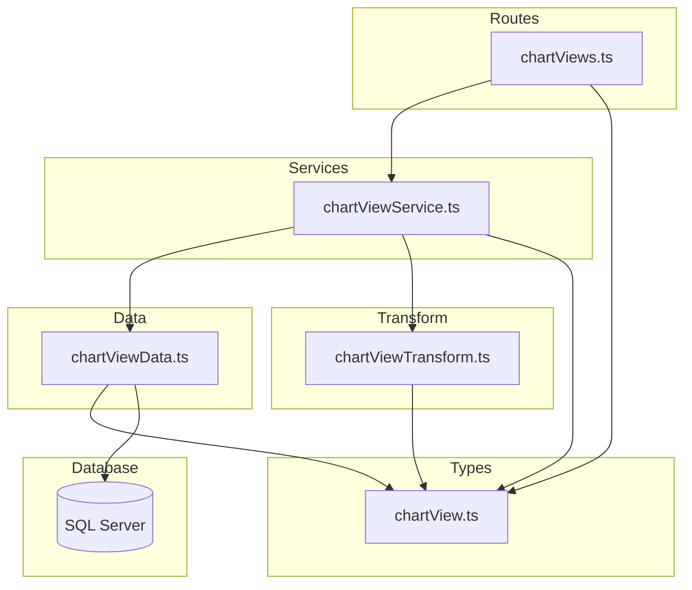
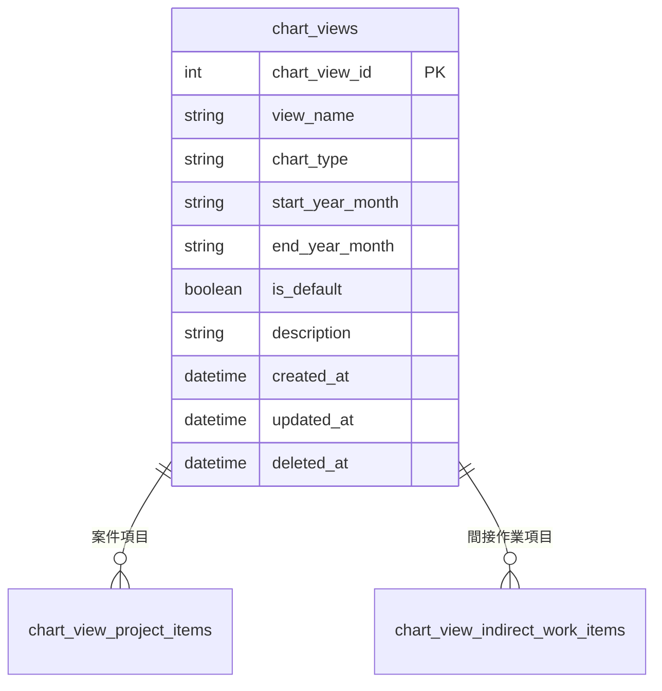

# Design Document: chart-views-crud-api

## Overview

**Purpose**: チャートビュー（chart_views）のCRUD APIを提供し、事業部リーダーが積み上げチャートの表示設定（表示期間・チャートタイプ・デフォルトビュー）を登録・参照・更新・削除できるようにする。

**Users**: 事業部リーダー、フロントエンド開発者が、チャートビュー管理画面やAPI連携で利用する。

**Impact**: 既存のレイヤードアーキテクチャに新規エンティティを追加。外部キーなし・子テーブルCASCADE削除のシンプルなCRUD構成。`startYearMonth` ≤ `endYearMonth` のクロスフィールドバリデーションが固有の設計要素。

### Goals
- chart_views テーブルに対する完全なCRUD操作（一覧・単一取得・作成・更新・論理削除・復元）の提供
- YYYYMM形式の年月フィールドに対するクロスフィールドバリデーション
- 既存のレイヤードアーキテクチャパターン（routes → services → data → transform → types）への準拠

### Non-Goals
- chart_view_project_items / chart_view_indirect_work_items（子テーブル）のCRUD操作
- chart_stack_order_settings / chart_color_settings（設定テーブル）の管理
- chartType のenum定義・バリデーション（将来課題）
- フロントエンド実装

## Architecture

### Existing Architecture Analysis

既存のバックエンドは6エンティティ（businessUnits, projectTypes, workTypes, projects, projectCases, headcountPlanCases）のCRUD APIを実装済み。すべて以下のパターンに従う：

- **レイヤード構成**: routes → services → data + transform + types
- **ソフトデリート**: deleted_at カラムによる論理削除
- **RFC 9457**: エラーレスポンスは Problem Details 形式
- **共有ユーティリティ**: paginationQuerySchema, problemResponse, validate ミドルウェア

chart_views の実装における既存との差異：
- INT IDENTITY 主キー（headcountPlanCases と同パターン）
- 外部キーなし（JOINやFK存在チェックが不要）
- 子テーブルは ON DELETE CASCADE のため、論理削除時の参照チェック（hasReferences）不要
- `startYearMonth` ≤ `endYearMonth` のクロスフィールドバリデーションが必要

### Architecture Pattern & Boundary Map



**Architecture Integration**:
- **Selected pattern**: 既存のレイヤードアーキテクチャを踏襲
- **Domain/feature boundaries**: chartView の各層ファイルが責務を分離。外部キーがないため他エンティティのDataモジュールへの依存なし
- **Existing patterns preserved**: validate ミドルウェア、problemResponse ヘルパー、paginationQuerySchema
- **New components rationale**: 5ファイル（types, data, transform, service, routes）は既存パターンの直接的な拡張
- **Steering compliance**: レイヤー間の依存方向（routes → services → data）を厳守

### Technology Stack

| Layer | Choice / Version | Role in Feature | Notes |
|-------|------------------|-----------------|-------|
| Backend | Hono v4 | ルーティング・ミドルウェア | 既存と同一 |
| Validation | Zod + @hono/zod-validator | リクエストバリデーション | `.refine()` でクロスフィールドバリデーション追加 |
| Data | mssql | SQL Server クエリ実行 | 単純なCRUD（JOIN不要） |
| Test | Vitest | ユニットテスト | 既存と同一 |

## Requirements Traceability

| Requirement | Summary | Components | Interfaces | Notes |
|-------------|---------|------------|------------|-------|
| 1.1, 1.2, 1.3, 1.4 | 一覧取得（ページネーション・ソフトデリートフィルタ） | Data, Transform, Service, Routes | API: GET / | |
| 2.1, 2.2, 2.3 | 単一取得（404処理） | Data, Transform, Service, Routes | API: GET /:id | |
| 3.1, 3.2, 3.3, 3.4, 3.5 | 新規作成（バリデーション・年月整合性チェック） | Data, Service, Routes, Types | API: POST / | `.refine()` で年月バリデーション |
| 4.1, 4.2, 4.3, 4.4, 4.5 | 更新（部分更新・年月整合性チェック） | Data, Service, Routes, Types | API: PUT /:id | サービス層で既存値マージ後にバリデーション |
| 5.1, 5.2, 5.3 | 論理削除 | Data, Service, Routes | API: DELETE /:id | hasReferences 不要（CASCADE） |
| 6.1, 6.2, 6.3 | 復元 | Data, Service, Routes | API: POST /:id/actions/restore | |
| 7.1, 7.2, 7.3, 7.4, 7.5 | レスポンス形式 | Transform, Routes | 全エンドポイント | RFC 9457、camelCase |
| 8.1, 8.2, 8.3, 8.4, 8.5 | バリデーション | Types, Service, Routes | Zod スキーマ | |
| 9.1, 9.2, 9.3, 9.4 | テスト | テストファイル | Vitest | |

## Components and Interfaces

| Component | Domain/Layer | Intent | Req Coverage | Key Dependencies | Contracts |
|-----------|-------------|--------|--------------|------------------|-----------|
| chartView.ts | Types | Zodスキーマ・型定義 | 7, 8 | pagination.ts (P0) | — |
| chartViewData.ts | Data | SQLクエリ実行 | 1, 2, 3, 4, 5, 6 | database/client (P0) | Service |
| chartViewTransform.ts | Transform | Row→Response変換 | 7 | types (P0) | — |
| chartViewService.ts | Service | ビジネスロジック | 1–6, 8.4 | Data (P0), Transform (P0) | Service |
| chartViews.ts | Routes | HTTPエンドポイント | 1–8 | Service (P0), Types (P0), validate (P0) | API |

### Types Layer

#### chartView.ts

| Field | Detail |
|-------|--------|
| Intent | Zodバリデーションスキーマとリクエスト・レスポンス・DB行のTypeScript型を定義 |
| Requirements | 7.4, 7.5, 8.1, 8.2, 8.3, 8.4, 8.5 |

**Contracts**: State [x]

##### State Management

```typescript
// --- YYYYMM バリデーション用ヘルパー ---
// yearMonthSchema: z.string().length(6).regex(/^\d{6}$/)

// --- Zod スキーマ ---

/** 作成用スキーマ */
// createChartViewSchema = z.object({
//   viewName: z.string().min(1).max(100),
//   chartType: z.string().min(1).max(50),
//   startYearMonth: yearMonthSchema,
//   endYearMonth: yearMonthSchema,
//   isDefault: z.boolean().default(false),
//   description: z.string().max(500).optional().nullable(),
// }).refine(
//   data => data.startYearMonth <= data.endYearMonth,
//   { path: ['endYearMonth'], message: 'endYearMonth must be >= startYearMonth' }
// )

/** 更新用スキーマ */
// updateChartViewSchema = z.object({
//   viewName: z.string().min(1).max(100).optional(),
//   chartType: z.string().min(1).max(50).optional(),
//   startYearMonth: yearMonthSchema.optional(),
//   endYearMonth: yearMonthSchema.optional(),
//   isDefault: z.boolean().optional(),
//   description: z.string().max(500).optional().nullable(),
// })
// ※ クロスフィールドバリデーションはサービス層で実施

/** 一覧取得クエリスキーマ */
// chartViewListQuerySchema = paginationQuerySchema.extend({
//   'filter[includeDisabled]': z.coerce.boolean().default(false)
// })

// --- TypeScript 型 ---

type CreateChartView = z.infer<typeof createChartViewSchema>
type UpdateChartView = z.infer<typeof updateChartViewSchema>
type ChartViewListQuery = z.infer<typeof chartViewListQuerySchema>

/** DB行型（snake_case） */
type ChartViewRow = {
  chart_view_id: number
  view_name: string
  chart_type: string
  start_year_month: string
  end_year_month: string
  is_default: boolean
  description: string | null
  created_at: Date
  updated_at: Date
  deleted_at: Date | null
}

/** APIレスポンス型（camelCase） */
type ChartView = {
  chartViewId: number
  viewName: string
  chartType: string
  startYearMonth: string
  endYearMonth: string
  isDefault: boolean
  description: string | null
  createdAt: string   // ISO 8601
  updatedAt: string   // ISO 8601
}
```

**Implementation Notes**:
- `isDefault` は SQL Server の BIT 型。mssql ドライバは boolean として返す
- `yearMonthSchema` は YYYYMM 形式の6桁数字文字列をバリデーション
- 作成時の `.refine()` で `startYearMonth <= endYearMonth` を文字列比較で検証（YYYYMM形式は辞書順で正しく大小判定可能）
- 更新用スキーマにはクロスフィールド `.refine()` を含めない（部分更新のため）

---

### Data Layer

#### chartViewData.ts

| Field | Detail |
|-------|--------|
| Intent | chart_views テーブルへのSQLクエリ実行 |
| Requirements | 1.1, 1.2, 1.3, 1.4, 2.1, 2.2, 2.3, 3.1, 4.1, 5.1, 5.2, 6.1, 6.2 |

**Dependencies**:
- Inbound: chartViewService — CRUDオペレーション (P0)
- External: mssql / database/client — DB接続 (P0)

**Contracts**: Service [x]

##### Service Interface

```typescript
interface ChartViewDataInterface {
  findAll(params: {
    page: number
    pageSize: number
    includeDisabled: boolean
  }): Promise<{ items: ChartViewRow[]; totalCount: number }>

  findById(id: number): Promise<ChartViewRow | undefined>

  findByIdIncludingDeleted(id: number): Promise<ChartViewRow | undefined>

  create(data: {
    viewName: string
    chartType: string
    startYearMonth: string
    endYearMonth: string
    isDefault: boolean
    description: string | null
  }): Promise<ChartViewRow>

  update(id: number, data: {
    viewName?: string
    chartType?: string
    startYearMonth?: string
    endYearMonth?: string
    isDefault?: boolean
    description?: string | null
  }): Promise<ChartViewRow | undefined>

  softDelete(id: number): Promise<ChartViewRow | undefined>

  restore(id: number): Promise<ChartViewRow | undefined>
}
```

- **Preconditions**: DB接続が確立されていること
- **Postconditions**: 各メソッドは指定された条件に合致するレコードを返す。見つからない場合は undefined
- **Invariants**: すべてのクエリはパラメータ化されている（SQLインジェクション防止）

**Implementation Notes**:
- `findAll` / `findById`: JOINなし。chart_views テーブルへの単純なSELECT
- `create`: INSERT の OUTPUT 句で作成されたレコードを直接返す（JOINなしのため OUTPUT で十分）
- `update`: 動的SET句を構築。UPDATE 後に `findById` を呼び出して最新レコードを返す
- `softDelete` / `restore`: OUTPUT 句で直接返却
- `hasReferences` は不要（子テーブルが CASCADE 削除のため）

---

### Transform Layer

#### chartViewTransform.ts

| Field | Detail |
|-------|--------|
| Intent | ChartViewRow（snake_case）→ ChartView（camelCase）の変換 |
| Requirements | 7.4, 7.5 |

**Implementation Notes**:
- snake_case → camelCase のフィールドマッピング
- `created_at` / `updated_at` を `.toISOString()` で ISO 8601 文字列に変換
- 外部キーのJOINフィールドがないため、マッピングは直接的

---

### Service Layer

#### chartViewService.ts

| Field | Detail |
|-------|--------|
| Intent | CRUD操作のビジネスロジック。年月クロスフィールドバリデーション・エラーハンドリングを担当 |
| Requirements | 1.1–1.4, 2.1–2.3, 3.1–3.5, 4.1–4.5, 5.1–5.3, 6.1–6.3, 8.4 |

**Dependencies**:
- Inbound: chartViews route — HTTPハンドラ (P0)
- Outbound: chartViewData — DB操作 (P0)
- Outbound: chartViewTransform — レスポンス変換 (P0)

**Contracts**: Service [x]

##### Service Interface

```typescript
interface ChartViewServiceInterface {
  findAll(params: {
    page: number
    pageSize: number
    includeDisabled: boolean
  }): Promise<{ items: ChartView[]; totalCount: number }>

  findById(id: number): Promise<ChartView>
  // throws HTTPException(404) if not found

  create(data: CreateChartView): Promise<ChartView>
  // startYearMonth <= endYearMonth は Zod スキーマで検証済み

  update(id: number, data: UpdateChartView): Promise<ChartView>
  // throws HTTPException(404) if not found
  // throws HTTPException(422) if merged startYearMonth > endYearMonth

  delete(id: number): Promise<void>
  // throws HTTPException(404) if not found

  restore(id: number): Promise<ChartView>
  // throws HTTPException(404) if not found or not deleted
}
```

- **Preconditions**: 各メソッドの引数がバリデーション済みであること（ルート層で実施）
- **Postconditions**: 成功時は変換済みレスポンスを返す。失敗時は適切な HTTPException をスロー
- **Invariants**: update 時、`startYearMonth` または `endYearMonth` の一方のみが指定された場合、既存値とマージして大小関係を検証する

**Implementation Notes**:
- `update`: 既存レコードを `chartViewData.findById()` で取得し、リクエストの `startYearMonth` / `endYearMonth` と既存値をマージした上でクロスフィールドバリデーションを実施。違反時は HTTPException(422) をスロー
- `delete`: hasReferences チェック不要（子テーブルCASCADE）。`findById` で存在確認後、`softDelete()` を実行
- `restore`: `findByIdIncludingDeleted()` で存在・削除状態を確認後、`restore()` を実行

---

### Routes Layer

#### chartViews.ts

| Field | Detail |
|-------|--------|
| Intent | HTTPエンドポイント定義。バリデーション・レスポンス整形を担当 |
| Requirements | 1.1–1.4, 2.1–2.3, 3.1–3.2, 4.1, 5.1, 6.1, 7.1–7.3, 8.1–8.3, 8.5 |

**Contracts**: API [x]

##### API Contract

| Method | Endpoint | Request | Response | Status | Errors |
|--------|----------|---------|----------|--------|--------|
| GET | / | ChartViewListQuery (query) | `{ data: ChartView[], meta: { pagination } }` | 200 | 422 |
| GET | /:id | id: number (path) | `{ data: ChartView }` | 200 | 404 |
| POST | / | CreateChartView (json) | `{ data: ChartView }` + Location header | 201 | 422 |
| PUT | /:id | id: number (path) + UpdateChartView (json) | `{ data: ChartView }` | 200 | 404, 422 |
| DELETE | /:id | id: number (path) | (no body) | 204 | 404 |
| POST | /:id/actions/restore | id: number (path) | `{ data: ChartView }` | 200 | 404 |

**Implementation Notes**:
- ルートを `app.route('/chart-views', chartViews)` で index.ts にマウント
- メソッドチェーンでルートを定義し、`ChartViewsRoute` 型をエクスポート
- パスパラメータ `:id` は各ハンドラ内で `Number(c.req.param('id'))` で取得

## Data Models

### Domain Model



**Business Rules & Invariants**:
- chart_view_id は自動採番（IDENTITY）、変更不可
- `startYearMonth` ≤ `endYearMonth` を常に満たすこと（作成時・更新時に検証）
- is_default はデフォルト false
- 論理削除（deleted_at）のあるレコードは通常のクエリから除外
- 子テーブル（chart_view_project_items, chart_view_indirect_work_items）は ON DELETE CASCADE — 論理削除時に影響なし、物理削除時に連動削除

### Physical Data Model

対象テーブル `chart_views` のスキーマは `docs/database/table-spec.md` に定義済み。新規テーブル作成やスキーマ変更は不要。

### Data Contracts & Integration

**API Data Transfer**:

レスポンス例（単一取得）:
```json
{
  "data": {
    "chartViewId": 1,
    "viewName": "2026年度全体ビュー",
    "chartType": "stacked-area",
    "startYearMonth": "202604",
    "endYearMonth": "202703",
    "isDefault": true,
    "description": "2026年度のプロジェクト工数積み上げ表示",
    "createdAt": "2026-01-31T00:00:00.000Z",
    "updatedAt": "2026-01-31T00:00:00.000Z"
  }
}
```

レスポンス例（一覧取得）:
```json
{
  "data": [
    {
      "chartViewId": 1,
      "viewName": "2026年度全体ビュー",
      "chartType": "stacked-area",
      "startYearMonth": "202604",
      "endYearMonth": "202703",
      "isDefault": true,
      "description": null,
      "createdAt": "2026-01-31T00:00:00.000Z",
      "updatedAt": "2026-01-31T00:00:00.000Z"
    }
  ],
  "meta": {
    "pagination": {
      "currentPage": 1,
      "pageSize": 20,
      "totalItems": 1,
      "totalPages": 1
    }
  }
}
```

## Error Handling

### Error Strategy

既存のグローバルエラーハンドラ（index.ts の `app.onError`）と RFC 9457 Problem Details 形式に従う。サービス層から HTTPException をスローし、グローバルハンドラが統一的に処理する。

### Error Categories and Responses

| Status | Type | Trigger | Detail |
|--------|------|---------|--------|
| 404 | resource-not-found | ID不存在、論理削除済み | `Chart view with ID '{id}' not found` |
| 422 | validation-error | Zodバリデーション失敗 | errors 配列にフィールド別詳細 |
| 422 | validation-error | startYearMonth > endYearMonth | `endYearMonth must be greater than or equal to startYearMonth` |

## Testing Strategy

### Unit Tests

テストファイルの配置は既存パターンに従い `src/__tests__/` にソース構造をミラーする。

#### routes/chartViews.test.ts
- GET / — 一覧取得（200、ページネーション検証、空リスト、includeDisabledフィルタ）
- GET /:id — 単一取得（200、404）
- POST / — 作成（201、Location ヘッダ、422 バリデーションエラー、年月大小関係エラー）
- PUT /:id — 更新（200、404、422、年月大小関係エラー）
- DELETE /:id — 削除（204、404）
- POST /:id/actions/restore — 復元（200、404）

#### services/chartViewService.test.ts
- findAll — データ層呼び出しとTransform適用の検証
- findById — 正常系と404例外の検証
- create — 正常系の検証
- update — 部分更新と年月クロスフィールドバリデーション（既存値マージ）の検証
- delete — 正常系と404例外の検証（参照チェックなし）
- restore — 削除状態チェックの検証

#### data/chartViewData.test.ts
- findAll — SQL実行とページネーション
- findById — パラメータ化クエリの検証
- create — INSERT + OUTPUT の検証
- update — 動的SET句の生成
- softDelete / restore — deleted_at の操作

**テストパターン**:
- `vi.mock()` でサービス層・データ層をモック
- `app.request()` でHTTPリクエストをシミュレート
- mssql の `getPool` / `request` / `input` / `query` をモック
