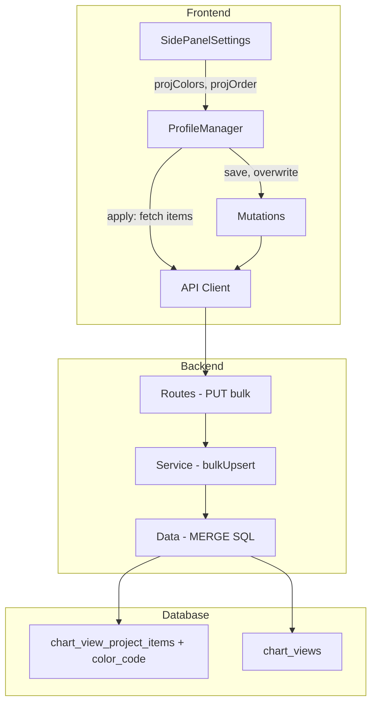
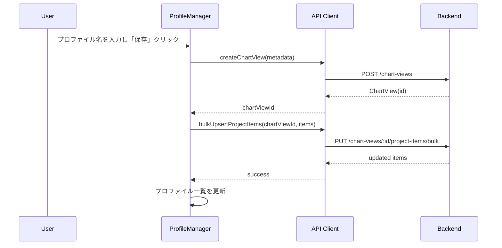
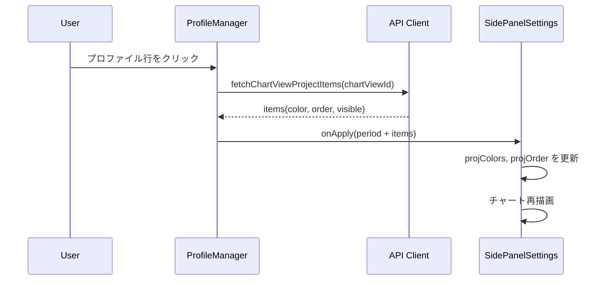
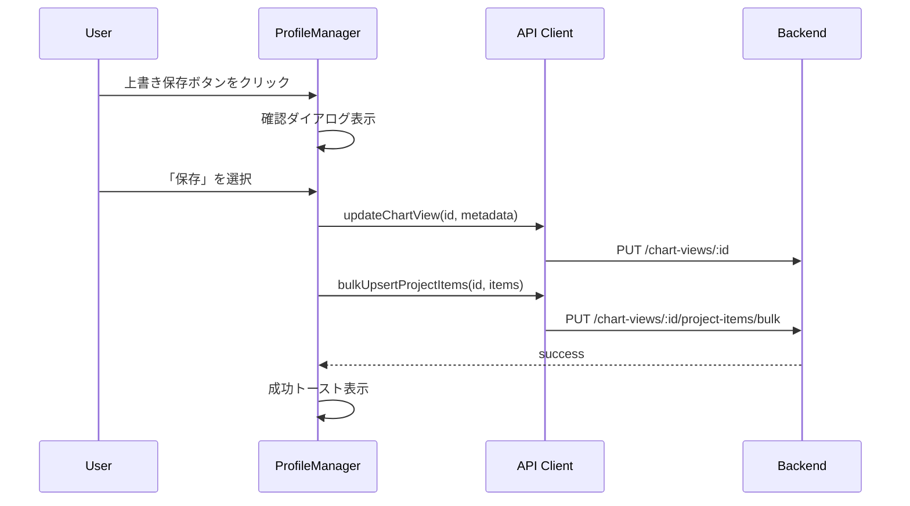

# Design Document: color-profiling-extend

## Overview

**Purpose**: Workload のプロファイル（ChartView）管理機能を拡張し、案件ごとの色・並び順・表示/非表示をプロファイルに紐づけて保存・復元・上書きできるようにする。

**Users**: 事業部リーダー・プロジェクトマネージャーが Workload 画面でチャート表示設定をプロファイルとして管理し、表示状態を完全に再現する。

**Impact**: `chart_view_project_items` テーブルに `color_code` カラムを追加。バックエンドに一括更新 API を追加。フロントエンドの ProfileManager に保存・適用・上書きフローを実装。

### Goals
- プロファイル保存時に案件の色・並び順・表示/非表示を永続化する
- プロファイル適用時に完全な画面状態を復元する
- 既存プロファイルへの上書き保存を可能にする
- 旧プロファイル（color 未保存）との後方互換性を維持する

### Non-Goals
- `chart_color_settings` テーブル（グローバル色設定）の廃止やリファクタリング
- キャパシティシナリオの色・表示設定のプロファイル化
- プロファイルの共有機能（ユーザー間）
- プロファイルのインポート/エクスポート

## Architecture

### Existing Architecture Analysis

現在のプロファイル管理は以下の構成:
- **バックエンド**: ChartView（メタデータ）と ChartViewProjectItem（案件リスト）が分離。色は `chart_color_settings` でグローバル管理
- **フロントエンド**: ProfileManager が ChartView の CRUD を担当。色・並び順は SidePanelSettings のローカル state で管理（バックエンドと未同期）
- **制約**: ProfileManager と SidePanelSettings 間のデータフローが限定的（期間設定のみ）

### Architecture Pattern & Boundary Map



**Architecture Integration**:
- **選択パターン**: 既存のレイヤードアーキテクチャ（routes → services → data）を踏襲
- **ドメイン境界**: ChartViewProjectItem エンティティの拡張。新規エンティティは不要
- **既存パターン維持**: SQL MERGE bulkUpsert パターン、TanStack Query mutations パターン
- **新規コンポーネント**: バックエンドの `PUT /bulk` エンドポイントと対応するデータ層メソッド。フロントエンドの `useBulkUpsertChartViewProjectItems` mutation
- **ステアリング準拠**: レイヤー間依存方向（routes → services → data）を維持

### Technology Stack

| Layer | Choice / Version | Role in Feature | Notes |
|-------|------------------|-----------------|-------|
| Frontend | React 19 + TanStack Query | プロファイル保存/適用/上書きの状態管理 | 既存の mutation / query パターンを拡張 |
| Frontend UI | shadcn/ui + Lucide Icons | 上書き保存ボタン・確認ダイアログ | 既存の Button / AlertDialog を使用 |
| Backend | Hono v4 + Zod v4 | 一括更新 API エンドポイント・バリデーション | 既存ルーティングパターンに準拠 |
| Database | SQL Server (mssql) | MERGE ベースの bulkUpsert | 既存パターンを踏襲 |

## System Flows

### プロファイル新規保存フロー



### プロファイル適用フロー



### プロファイル上書き保存フロー



## Requirements Traceability

| Requirement | Summary | Components | Interfaces | Flows |
|-------------|---------|------------|------------|-------|
| 1.1 | color フィールドをスキーマに追加 | chartViewProjectItem 型・データ層・変換層 | Service, API | - |
| 1.2–1.4 | color の CRUD 対応 | chartViewProjectItemData, routes | API Contract | - |
| 1.5 | color 未指定時の NULL 保存 | chartViewProjectItemData | - | - |
| 2.1 | PUT /bulk エンドポイント提供 | routes, service, data | API Contract | - |
| 2.2–2.3 | upsert + 完全同期（未送信分削除） | chartViewProjectItemData.bulkUpsert | Service | - |
| 2.4 | リクエストスキーマ定義 | bulkUpsertChartViewProjectItemSchema | API Contract | - |
| 2.5 | バリデーションエラーの RFC 9457 対応 | routes, service | API Contract | - |
| 2.6 | 成功時レスポンス | service, transform | API Contract | - |
| 3.1–3.2 | 新規保存時のアイテム同時保存 | ProfileManager | State | 新規保存フロー |
| 3.3 | 保存失敗時のエラートースト | ProfileManager | - | 新規保存フロー |
| 3.4 | 保存後の一覧更新 | ProfileManager, mutations | State | 新規保存フロー |
| 4.1–4.4 | 適用時の完全復元 | ProfileManager, SidePanelSettings | State | 適用フロー |
| 4.5 | 旧プロファイルの後方互換 | ProfileManager | - | 適用フロー |
| 5.1 | 上書き保存ボタン | ProfileManager UI | - | - |
| 5.2 | 確認ダイアログ | ProfileManager UI | - | 上書き保存フロー |
| 5.3–5.4 | 上書き保存処理 | ProfileManager, mutations | State | 上書き保存フロー |
| 5.5–5.6 | 成功/失敗トースト | ProfileManager | - | 上書き保存フロー |
| 6.1 | フロントエンド型に color 追加 | ChartViewProjectItem 型 | - | - |
| 6.2–6.3 | API クライアント・mutation 追加 | api-client, mutations | Service | - |
| 6.4 | キャッシュ無効化 | mutations | State | - |

## Components and Interfaces

| Component | Domain/Layer | Intent | Req Coverage | Key Dependencies | Contracts |
|-----------|-------------|--------|--------------|-----------------|-----------|
| chartViewProjectItem 型 | Backend / Types | スキーマに color 追加 | 1.1, 2.4 | Zod v4 (P0) | - |
| chartViewProjectItemData | Backend / Data | bulkUpsert メソッド追加 | 1.2–1.5, 2.2–2.3 | mssql (P0) | Service |
| chartViewProjectItemService | Backend / Service | bulkUpsert ビジネスロジック | 2.2–2.3, 2.5–2.6 | Data Layer (P0) | Service |
| chartViewProjectItems routes | Backend / Routes | PUT /bulk エンドポイント | 2.1, 2.5 | Service (P0), Zod Validator (P0) | API |
| chartViewProjectItemTransform | Backend / Transform | color 変換追加 | 1.4 | - | - |
| ChartViewProjectItem 型 (FE) | Frontend / Types | color フィールド追加 | 6.1 | - | - |
| api-client | Frontend / API | bulkUpsert API 関数 | 6.2 | - | - |
| useBulkUpsertChartViewProjectItems | Frontend / Mutations | 一括更新 mutation | 6.3–6.4 | TanStack Query (P0) | State |
| ProfileManager | Frontend / Components | 保存・適用・上書きの全フロー | 3.1–5.6 | mutations (P0), queries (P0) | State |
| SidePanelSettings | Frontend / Components | ProfileManager への props 受け渡し | 3.1, 4.1–4.4 | ProfileManager (P0) | - |

### Backend / Types

#### chartViewProjectItem スキーマ拡張

| Field | Detail |
|-------|--------|
| Intent | `createChartViewProjectItemSchema` と `updateChartViewProjectItemSchema` に `color` フィールドを追加 |
| Requirements | 1.1, 2.4 |

**Responsibilities & Constraints**
- `color` は `z.string().max(7).nullable().optional()` として定義（CSS hex カラーコード、例: `#FF5733`）
- `bulkUpsertChartViewProjectItemSchema` を新規定義: アイテム配列のバリデーション

**Contracts**: API [x]

##### API Contract — bulkUpsertChartViewProjectItemSchema

```typescript
// 新規スキーマ
const bulkUpsertChartViewProjectItemSchema = z.object({
  items: z.array(
    z.object({
      projectId: z.number().int().positive(),
      projectCaseId: z.number().int().positive().nullable().optional(),
      displayOrder: z.number().int().min(0).default(0),
      isVisible: z.boolean().default(true),
      color: z.string().max(7).nullable().optional(),
    })
  ),
})
```

### Backend / Data

#### chartViewProjectItemData.bulkUpsert

| Field | Detail |
|-------|--------|
| Intent | トランザクション内で MERGE + DELETE NOT IN による完全同期 |
| Requirements | 1.2–1.5, 2.2–2.3 |

**Responsibilities & Constraints**
- MERGE ON 条件: `(chart_view_id, project_id, project_case_id)`
- MATCHED: `display_order`, `is_visible`, `color_code`, `updated_at` を更新
- NOT MATCHED: 新規レコード挿入
- MERGE 後: リクエストに含まれない `(project_id, project_case_id)` の組み合わせを DELETE
- 全操作を単一 Transaction で実行

**Dependencies**
- Inbound: chartViewProjectItemService — bulkUpsert 呼び出し (P0)
- External: mssql — SQL Server 接続 (P0)

**Contracts**: Service [x]

##### Service Interface

```typescript
interface ChartViewProjectItemDataBulkUpsert {
  bulkUpsert(
    chartViewId: number,
    items: Array<{
      projectId: number
      projectCaseId: number | null
      displayOrder: number
      isVisible: boolean
      color: string | null
    }>
  ): Promise<ChartViewProjectItemRow[]>
}
```

- Preconditions: `chartViewId` が有効な整数、`items` が空でない配列
- Postconditions: 指定された items のみが `chart_view_project_items` に存在する状態（完全同期）
- Invariants: トランザクション内で原子的に実行。失敗時はロールバック

**Implementation Notes**
- 既存の `chartColorSettingData.bulkUpsert` の MERGE パターンを踏襲
- DELETE NOT IN は MERGE ループ完了後に1回実行
- `color_code` が `NULL` の場合、DB に `NULL` を格納（フォールバック用）

### Backend / Service

#### chartViewProjectItemService.bulkUpsert

| Field | Detail |
|-------|--------|
| Intent | chartView 存在確認 + データ層呼び出し + レスポンス変換 |
| Requirements | 2.2–2.3, 2.5–2.6 |

**Responsibilities & Constraints**
- `chartViewId` の存在バリデーション（404 Not Found）
- items 配列の各 `projectId` の存在バリデーション（422 Unprocessable Entity）
- `projectCaseId` が指定されている場合、`projectId` との関連バリデーション
- データ層の `bulkUpsert` 呼び出し
- レスポンスの変換（`toChartViewProjectItemResponse`）

**Dependencies**
- Inbound: routes — HTTP リクエストハンドラ (P0)
- Outbound: chartViewProjectItemData.bulkUpsert (P0)

**Contracts**: Service [x]

##### Service Interface

```typescript
interface ChartViewProjectItemServiceBulkUpsert {
  bulkUpsert(
    chartViewId: number,
    items: Array<{
      projectId: number
      projectCaseId: number | null
      displayOrder: number
      isVisible: boolean
      color: string | null
    }>
  ): Promise<
    | { success: true; data: ChartViewProjectItem[] }
    | { success: false; status: 404 | 422; error: ProblemDetails }
  >
}
```

### Backend / Routes

#### PUT /chart-views/:chartViewId/project-items/bulk

| Field | Detail |
|-------|--------|
| Intent | 一括更新エンドポイントの提供 |
| Requirements | 2.1, 2.5 |

**Contracts**: API [x]

##### API Contract

| Method | Endpoint | Request | Response | Errors |
|--------|----------|---------|----------|--------|
| PUT | `/chart-views/:chartViewId/project-items/bulk` | `{ items: BulkUpsertItem[] }` | `{ data: ChartViewProjectItem[] }` | 400, 404, 422, 500 |

**Request Body:**
```typescript
{
  items: Array<{
    projectId: number
    projectCaseId: number | null
    displayOrder: number
    isVisible: boolean
    color: string | null
  }>
}
```

**Response Body (200):**
```typescript
{
  data: ChartViewProjectItem[]  // 更新後の全アイテム
}
```

**Error Response (RFC 9457):**
```typescript
{
  type: string
  title: string
  status: number
  detail: string
}
```

### Backend / Transform

#### chartViewProjectItemTransform 拡張

| Field | Detail |
|-------|--------|
| Intent | `color_code` カラムの snake_case → camelCase 変換 |
| Requirements | 1.4 |

**Implementation Notes**
- `toChartViewProjectItemResponse` に `color: row.color_code ?? null` を追加
- `ChartViewProjectItemRow` 型に `color_code: string | null` を追加

### Frontend / Types

#### ChartViewProjectItem 型拡張

| Field | Detail |
|-------|--------|
| Intent | `color` フィールドの追加 |
| Requirements | 6.1 |

**Implementation Notes**
- `ChartViewProjectItem` 型に `color: string | null` を追加

### Frontend / API & Mutations

#### api-client: bulkUpsertChartViewProjectItems

| Field | Detail |
|-------|--------|
| Intent | PUT /bulk エンドポイントの呼び出し関数 |
| Requirements | 6.2 |

```typescript
async function bulkUpsertChartViewProjectItems(
  chartViewId: number,
  items: Array<{
    projectId: number
    projectCaseId: number | null
    displayOrder: number
    isVisible: boolean
    color: string | null
  }>
): Promise<ApiResponse<ChartViewProjectItem[]>>
```

#### useBulkUpsertChartViewProjectItems mutation

| Field | Detail |
|-------|--------|
| Intent | 一括更新 mutation hook |
| Requirements | 6.3–6.4 |

**Contracts**: State [x]

##### State Management
- **onSuccess**: `chartViewProjectItems` クエリキーを無効化
- **キャッシュ無効化対象**: `workloadKeys.chartViewProjectItems(chartViewId)`

### Frontend / Components

#### ProfileManager 拡張

| Field | Detail |
|-------|--------|
| Intent | 保存・適用・上書き保存の全フローを統合 |
| Requirements | 3.1–5.6 |

**Responsibilities & Constraints**
- 新規保存: ChartView 作成 → bulkUpsert 呼び出し
- 適用: ChartViewProjectItems を fetch → onApply コールバックで色・並び順・表示状態を返す
- 上書き保存: 確認ダイアログ → ChartView 更新 + bulkUpsert 呼び出し
- エラー/成功トースト表示

**Dependencies**
- Inbound: SidePanelSettings — props 経由で色・並び順・表示状態を受け取る (P0)
- Outbound: useCreateChartView, useUpdateChartView, useBulkUpsertChartViewProjectItems — mutations (P0)

**Contracts**: State [x]

##### State Management

**拡張後の ProfileManagerProps:**

```typescript
interface ProfileManagerProps {
  chartType: string
  startYearMonth: string
  endYearMonth: string
  // 新規追加
  projectItems: Array<{
    projectId: number
    projectCaseId: number | null
    displayOrder: number
    isVisible: boolean
    color: string | null
  }>
  onApply?: (profile: {
    chartViewId: number
    startYearMonth: string
    endYearMonth: string
    // 新規追加
    projectItems: Array<{
      projectId: number
      projectCaseId: number | null
      displayOrder: number
      isVisible: boolean
      color: string | null
    }>
  }) => void
}
```

- `projectItems`: SidePanelSettings から受け取る現在の画面状態
- `onApply` コールバック: 適用時に fetch した項目データを含めて返す

**Implementation Notes**
- 上書き保存ボタン: Lucide `Save` アイコン、各プロファイル行の削除ボタン左に配置
- 確認ダイアログ: shadcn/ui の `AlertDialog` を使用
- 成功/失敗トースト: `sonner` の `toast.success()` / `toast.error()` を使用

#### SidePanelSettings 拡張

| Field | Detail |
|-------|--------|
| Intent | ProfileManager への projectItems props 構築と適用時の状態復元 |
| Requirements | 3.1, 4.1–4.4 |

**Implementation Notes**
- `projColors`, `projOrder` から `projectItems` 配列を構築して ProfileManager に渡す
- `onProfileApply` コールバック受信時に `setProjColors`, `setProjOrder` を更新
- 旧プロファイル（items 無し）の場合は期間設定のみ復元（4.5）

## Data Models

### Physical Data Model

**chart_view_project_items テーブル変更:**

| Column | Type | Nullable | Default | Notes |
|--------|------|----------|---------|-------|
| color_code | VARCHAR(7) | YES | NULL | CSS hex カラーコード（例: #FF5733）。**新規追加** |

**ALTER TABLE:**
```sql
ALTER TABLE chart_view_project_items
ADD color_code VARCHAR(7) NULL;
```

### Data Contracts & Integration

**API Data Transfer — BulkUpsert Request:**

```typescript
// Request
{
  items: Array<{
    projectId: number           // 必須
    projectCaseId: number | null // オプション
    displayOrder: number         // デフォルト: 0
    isVisible: boolean           // デフォルト: true
    color: string | null         // オプション、例: "#FF5733"
  }>
}

// Response
{
  data: Array<{
    chartViewProjectItemId: number
    chartViewId: number
    projectId: number
    projectCaseId: number | null
    displayOrder: number
    isVisible: boolean
    color: string | null
    createdAt: string
    updatedAt: string
    project: { projectCode: string; projectName: string }
    projectCase: { caseName: string } | null
  }>
}
```

## Error Handling

### Error Categories and Responses

| Category | Condition | Status | Response |
|----------|----------|--------|----------|
| User Error | 無効なリクエストボディ | 400 | Zod バリデーションエラー詳細 |
| User Error | chartViewId が存在しない | 404 | `{ type: "not-found", title: "Chart View が見つかりません" }` |
| User Error | projectId が存在しない | 422 | `{ type: "unprocessable-entity", title: "指定されたプロジェクトが存在しません" }` |
| System Error | DB 接続エラー・トランザクション失敗 | 500 | `{ type: "internal-error", title: "内部サーバーエラー" }` |
| Frontend | API 呼び出し失敗 | - | `toast.error()` でユーザーに通知 |

## Testing Strategy

### Unit Tests
- `chartViewProjectItemData.bulkUpsert`: MERGE + DELETE の正常系・異常系
- `chartViewProjectItemService.bulkUpsert`: バリデーション・エラーハンドリング
- `toChartViewProjectItemResponse`: `color` フィールドの変換（NULL / 非 NULL）
- `bulkUpsertChartViewProjectItemSchema`: Zod スキーマバリデーション

### Integration Tests
- `PUT /chart-views/:id/project-items/bulk`: 正常系（upsert + 削除）、バリデーションエラー、存在しない chartViewId
- 新規保存フロー: ChartView 作成 → bulkUpsert の連続呼び出し
- 上書き保存フロー: ChartView 更新 + bulkUpsert
- 既存の CRUD エンドポイントが `color` フィールドを正しく処理すること

### E2E Tests（手動確認）
- プロファイル新規保存 → 適用で色・並び順・表示状態が復元されること
- プロファイル上書き保存 → 再適用で更新後の状態が復元されること
- 旧プロファイル（color 未保存）の適用で期間設定のみ復元されること
