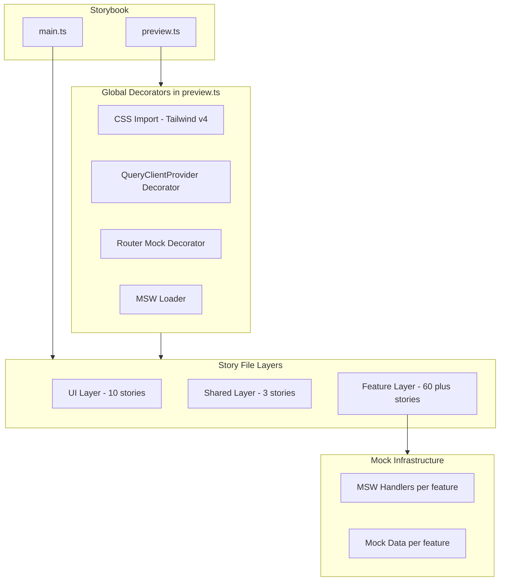

# Design Document

## Overview

**Purpose**: 操業管理システムの全 UI コンポーネント（約70以上）を Storybook でカタログ化し、UI インベントリ（棚卸し）基盤を構築する。これにより、UIスタイルの不整合・重複を可視化し、後続のリデザインフェーズの判断材料を提供する。

**Users**: フロントエンド開発者が、コンポーネントの現状確認・バリアント比較・アクセシビリティ検証・スタイル改善の影響範囲評価に利用する。

**Impact**: 既存の Storybook v10.2.7 セットアップを拡張し、サンプルストーリーを実プロダクションコンポーネントのストーリーに置き換える。アプリケーションコード自体への変更はない。

### Goals
- 全プロダクションコンポーネント（コアUI 10 + 共有 3 + feature 約60）のストーリーを CSF3 形式で作成する
- feature コンポーネントの外部依存（TanStack Query/Form/Table/Router、Recharts）をモックし、API サーバーなしに独立描画可能にする
- UI インベントリレポートで不整合・重複・共通化候補を記録する

### Non-Goals
- コンポーネントのリデザイン・スタイル変更（後続仕様のスコープ）
- E2E テストやビジュアルリグレッションテストの CI/CD 統合
- デザイントークンの体系化
- feature コンポーネントのリファクタリングや共通化の実施

## Architecture

### Existing Architecture Analysis

現在の Storybook セットアップ状況:
- **フレームワーク**: `@storybook/react-vite`（Vite 設定を自動継承）
- **アドオン**: chromatic, addon-vitest, addon-a11y, addon-docs（すべてインストール済み）
- **ストーリー検出パターン**: `../src/**/*.stories.@(js|jsx|mjs|ts|tsx)`（コロケーション対応済み）
- **Vitest 統合**: `storybookTest` プラグイン + Playwright ブラウザテスト設定済み
- **preview.ts**: Controls matchers のみ設定（グローバルデコレータ・CSS インポートなし）

**要対応事項**:
- preview.ts にグローバル CSS インポートとプロバイダデコレータを追加
- MSW のセットアップ（`msw-storybook-addon`、`mockServiceWorker.js`）
- サンプルストーリー（`src/stories/`）の削除

### Architecture Pattern & Boundary Map



**Architecture Integration**:
- **Selected pattern**: グローバルデコレータ + MSW ハンドラによるレイヤード構成
- **Domain boundaries**: ストーリーファイルはコンポーネントとコロケーション配置し、モックデータは feature 単位で管理
- **Existing patterns preserved**: Storybook の既存 main.ts 設定（ストーリー検出パターン、アドオン構成）はそのまま維持
- **New components rationale**: MSW ハンドラ・グローバルデコレータ・モックデータファクトリが新規追加要素
- **Steering compliance**: フロントエンドの feature-first 構成に準拠し、feature 間の依存を作らない

### Technology Stack

| Layer | Choice / Version | Role in Feature | Notes |
|-------|------------------|-----------------|-------|
| Storybook | v10.2.7 | コンポーネントカタログ基盤 | インストール済み |
| Addon - Docs | @storybook/addon-docs | Props テーブル自動生成・ドキュメントページ | インストール済み |
| Addon - A11y | @storybook/addon-a11y | axe-core によるアクセシビリティ検証 | インストール済み |
| Addon - Vitest | @storybook/addon-vitest | ストーリーベースのテスト実行 | インストール済み |
| MSW | msw + msw-storybook-addon | ネットワークリクエストモック | 新規追加 |
| CSS | Tailwind CSS v4 | Vite プラグイン経由でスタイル適用 | preview.ts での CSS インポートが必要 |

## Requirements Traceability

| Requirement | Summary | Components | Interfaces |
|-------------|---------|------------|------------|
| 1.1-1.11 | コアUI 全10コンポーネントのストーリー | CoreUIStories | CSF3 Meta + StoryObj |
| 2.1-2.4 | ファイル構成・命名・階層・args | 全ストーリーファイル | CSF3 Meta title 階層 |
| 3.1-3.2 | サンプルストーリー削除 | src/stories/ 削除 | N/A |
| 4.1-4.3 | 共有コンポーネントのストーリー | SharedStories | CSF3 Meta + Router Decorator |
| 5.1-5.8 | フォーム系 feature ストーリー | FormStories | MSW Handlers + QueryClient |
| 6.1-6.7 | テーブル系 feature ストーリー | TableStories | Mock Column Defs + Data |
| 7.1-7.4 | チャート系 feature ストーリー | ChartStories | Mock Chart Data |
| 8.1-8.10 | ダイアログ・パネル系ストーリー | InteractionStories | CSF3 Args + Actions |
| 9.1-9.6 | 間接工数管理系ストーリー | IndirectStories | Mock Grid/Matrix Data |
| 10.1-10.6 | モック・デコレータ基盤 | StorybookInfra | GlobalDecorators + MSWSetup |
| 11.1-11.2 | アクセシビリティ検証 | addon-a11y 設定 | axe-core |
| 12.1-12.3 | ドキュメント・Controls | addon-docs 設定 | Props Table + Controls |
| 13.1-13.3 | UI インベントリレポート | ui-inventory.md | N/A |

## Components and Interfaces

| Component | Domain/Layer | Intent | Req Coverage | Key Dependencies | Contracts |
|-----------|-------------|--------|-------------|-----------------|-----------|
| StorybookGlobalConfig | Infra | グローバルデコレータ・ローダー・CSS 設定 | 10, 11, 12 | MSW, QueryClient, Router | State |
| MSWSetup | Infra | ネットワークモック基盤 | 10.1, 10.2 | msw, msw-storybook-addon | Service |
| MockDataFactories | Infra | 型安全なモックデータ生成 | 10.6 | Zod Schemas | Service |
| CoreUIStories | UI | コアUIプリミティブのストーリー群 | 1, 2 | shadcn/ui components | State |
| SharedStories | Shared | 共有コンポーネントのストーリー群 | 4, 2 | Router Decorator | State |
| FeatureFormStories | Feature | フォーム系ストーリー群 | 5, 2 | MSW, QueryClient, TanStack Form | State |
| FeatureTableStories | Feature | テーブル系ストーリー群 | 6, 2 | Mock Data, TanStack Table | State |
| FeatureChartStories | Feature | チャート系ストーリー群 | 7, 2 | Mock Chart Data, Recharts | State |
| FeatureInteractionStories | Feature | ダイアログ・パネル系ストーリー群 | 8, 2 | MSW, QueryClient | State |
| FeatureIndirectStories | Feature | 間接工数管理系ストーリー群 | 9, 2 | Mock Grid Data | State |
| UIInventoryReport | Docs | UI インベントリレポート | 13 | 全ストーリー完了後 | N/A |

### Infrastructure Layer

#### StorybookGlobalConfig

| Field | Detail |
|-------|--------|
| Intent | preview.ts にグローバルデコレータ・ローダー・CSS インポートを設定し、全ストーリーの実行基盤を提供する |
| Requirements | 10.1, 10.2, 10.3, 11.1, 12.1, 12.3 |

**Responsibilities & Constraints**
- Tailwind CSS v4 のグローバルスタイルを全ストーリーに適用する
- `QueryClientProvider` デコレータで TanStack Query のコンテキストを全ストーリーに提供する
- `RouterProvider` デコレータで TanStack Router のコンテキストを必要なストーリーに提供する
- MSW の `mswLoader` を登録してネットワークモックを有効化する
- 各ストーリーの QueryClient はストーリー間で状態を共有しないよう、ストーリーごとに新規インスタンスを生成する

**Dependencies**
- External: `msw-storybook-addon` — MSW ローダー提供（P0）
- External: `@tanstack/react-query` — QueryClientProvider（P0）
- External: `@tanstack/react-router` — メモリルーター生成（P1）

**Contracts**: State [x]

##### State Management

```typescript
// .storybook/preview.ts の構成

import type { Preview } from '@storybook/react-vite'
import { QueryClient, QueryClientProvider } from '@tanstack/react-query'
import { initialize, mswLoader } from 'msw-storybook-addon'

// Global CSS
import '../src/styles/globals.css'

// MSW initialization
initialize()

// Decorator: QueryClientProvider（ストーリーごとに新規 QueryClient）
const withQueryClient: Decorator = (Story) => {
  const queryClient = new QueryClient({
    defaultOptions: {
      queries: { retry: false, staleTime: Infinity },
    },
  })
  return (
    <QueryClientProvider client={queryClient}>
      <Story />
    </QueryClientProvider>
  )
}

const preview: Preview = {
  decorators: [withQueryClient],
  loaders: [mswLoader],
  parameters: {
    controls: {
      matchers: {
        color: /(background|color)$/i,
        date: /Date$/i,
      },
    },
  },
}
```

**Implementation Notes**
- CSS インポートパスは実際のプロジェクト構成に合わせて調整が必要（`@/styles/` エイリアスは Storybook のビルドでは解決できない可能性があるため相対パスを使用）
- `QueryClient` の `staleTime: Infinity` により、ストーリー描画時に不要なリフェッチを防止
- Router デコレータは AppShell・DataTableToolbar 等のルーター依存コンポーネントのストーリーでのみ使用（per-story decorator）

#### MSWSetup

| Field | Detail |
|-------|--------|
| Intent | MSW ハンドラの定義パターンと、feature ごとのハンドラ管理構造を提供する |
| Requirements | 10.1, 10.2, 5.8 |

**Responsibilities & Constraints**
- `public/mockServiceWorker.js` を生成し、Storybook のビルドに含める
- feature ごとに MSW ハンドラファイルを管理する
- ハンドラはストーリー単位で `parameters.msw.handlers` として注入する

**Dependencies**
- External: `msw` v2 — ServiceWorker ベースのリクエストインターセプト（P0）
- External: `msw-storybook-addon` — Storybook 統合ローダー（P0）

**Contracts**: Service [x]

##### Service Interface

```typescript
// MSW ハンドラの定義パターン（feature ごと）
// 例: features/business-units/components/__mocks__/handlers.ts

import { http, HttpResponse } from 'msw'
import type { BusinessUnit } from '@/features/business-units/types'

const mockBusinessUnits: BusinessUnit[] = [/* ... */]

export const businessUnitsHandlers = [
  http.get('/api/business-units', () => {
    return HttpResponse.json({ data: mockBusinessUnits })
  }),
  http.get('/api/business-units/:id', ({ params }) => {
    const unit = mockBusinessUnits.find(u => u.id === params.id)
    return unit
      ? HttpResponse.json({ data: unit })
      : new HttpResponse(null, { status: 404 })
  }),
]
```

**Implementation Notes**
- MSW ハンドラは API レスポンス規約（`docs/rules/api-response.md`）に準拠した `{ data, meta, links }` 形式でレスポンスを返す
- ハンドラファイルの配置: `features/[feature]/components/__mocks__/handlers.ts`
- 共通のベース URL やレスポンス構造はユーティリティとして `src/__mocks__/utils.ts` に抽出可能

#### MockDataFactories

| Field | Detail |
|-------|--------|
| Intent | 各 feature の型定義（Zod スキーマ）に準拠した型安全なモックデータ生成を提供する |
| Requirements | 10.6, 7.4, 6.5 |

**Responsibilities & Constraints**
- 既存の Zod スキーマから推論された型（`z.infer<typeof schema>`）を使用してモックデータを定義する
- `satisfies` 演算子で型安全性を検証する
- モックデータはストーリーの args またはハンドラレスポンスとして使用する

**Dependencies**
- Inbound: 各 feature の `types/` — Zod スキーマ・型定義（P0）

**Contracts**: Service [x]

##### Service Interface

```typescript
// モックデータの型安全な定義パターン
// 例: features/business-units/components/__mocks__/data.ts

import type { BusinessUnit } from '@/features/business-units/types'

export const mockBusinessUnit = {
  id: '1',
  businessUnitCode: 'BU001',
  businessUnitName: 'エンジニアリング事業部',
  isDisabled: false,
} satisfies BusinessUnit

export const mockBusinessUnits: BusinessUnit[] = [
  mockBusinessUnit,
  { id: '2', businessUnitCode: 'BU002', businessUnitName: 'プラント事業部', isDisabled: false },
  { id: '3', businessUnitCode: 'BU003', businessUnitName: '環境事業部', isDisabled: true },
]
```

### UI Layer

#### CoreUIStories

| Field | Detail |
|-------|--------|
| Intent | shadcn/ui ベースのコアUIプリミティブ10コンポーネントの全バリアント・状態をストーリーとして網羅する |
| Requirements | 1.1-1.11, 2.1-2.4 |

**Responsibilities & Constraints**
- 外部依存なし（デコレータ不要、props のみで描画可能）
- 各コンポーネントの CVA バリアント定義に基づき、全バリアント・サイズの組み合わせをストーリー化する
- `argTypes` で props の型情報を Storybook Controls に反映する

**Contracts**: State [x]

##### State Management

```typescript
// ストーリーファイルのテンプレートパターン（CSF3）
// 例: components/ui/button.stories.tsx

import type { Meta, StoryObj } from '@storybook/react-vite'
import { Button } from './button'

const meta = {
  title: 'UI/Button',
  component: Button,
  tags: ['autodocs'],
  argTypes: {
    variant: {
      control: 'select',
      options: ['default', 'destructive', 'outline', 'secondary', 'ghost', 'link'],
    },
    size: {
      control: 'select',
      options: ['default', 'sm', 'lg', 'icon'],
    },
  },
} satisfies Meta<typeof Button>

export default meta
type Story = StoryObj<typeof meta>

export const Default: Story = {
  args: { children: 'ボタン', variant: 'default', size: 'default' },
}

export const Destructive: Story = {
  args: { children: '削除', variant: 'destructive' },
}

// ... 各バリアント・サイズの組み合わせ
```

**Implementation Notes**
- `tags: ['autodocs']` により addon-docs のドキュメントページが自動生成される（12.1, 12.2 対応）
- Badge コンポーネントは要件書記載の4バリアントに加え、実装に存在する `success` バリアントも含める（計5バリアント）
- Sheet コンポーネントは `side` prop（top, right, bottom, left）ごとにストーリーを作成する

### Shared Layer

#### SharedStories

| Field | Detail |
|-------|--------|
| Intent | 共有コンポーネント（DataTableToolbar, DeleteConfirmDialog）とレイアウトコンポーネント（AppShell）のストーリーを提供する |
| Requirements | 4.1-4.3, 2.3 |

**Responsibilities & Constraints**
- `DataTableToolbar` は `@tanstack/react-router` の `Link` と feature 間依存（`DebouncedSearchInput`）を持つため、Router デコレータとモックが必要
- `DeleteConfirmDialog` は props のみで描画可能（依存なし）
- `AppShell` は `useRouterState` と `Link` に依存するため、Router デコレータが必要

**Dependencies**
- External: `@tanstack/react-router` — Link, useRouterState（P1）
- Inbound: `features/business-units/components/DebouncedSearchInput` — DataTableToolbar 内で使用（P2）

**Contracts**: State [x]

##### State Management

```typescript
// Router デコレータパターン（per-story）
import { createMemoryHistory, createRootRoute, createRouter, RouterProvider } from '@tanstack/react-router'

const withRouter: Decorator = (Story) => {
  const rootRoute = createRootRoute({ component: Story })
  const router = createRouter({
    routeTree: rootRoute,
    history: createMemoryHistory({ initialEntries: ['/'] }),
  })
  return <RouterProvider router={router} />
}

// AppShell ストーリー
const meta = {
  title: 'Layout/AppShell',
  component: AppShell,
  decorators: [withRouter],
} satisfies Meta<typeof AppShell>
```

### Feature Layer

#### FeatureFormStories

| Field | Detail |
|-------|--------|
| Intent | 各 feature のフォームコンポーネント（BusinessUnitForm, ProjectForm, CaseForm 等）のストーリーを提供する |
| Requirements | 5.1-5.8, 2.1-2.4 |

**Responsibilities & Constraints**
- TanStack Form を内部で使用するコンポーネントは、ストーリー上でフォーム操作（入力・バリデーション）を実行可能にする
- TanStack Query に依存するフォーム（ProjectForm, CaseForm）は MSW ハンドラでセレクトボックスの選択肢データを提供する
- 新規作成モード（initialValues なし）と編集モード（initialValues あり）をそれぞれストーリーとして定義する

**Dependencies**
- External: MSW Handlers — セレクトボックスの選択肢データ（P0）
- External: QueryClientProvider — TanStack Query コンテキスト（P0）
- External: TanStack Form — フォーム内部で使用（P1）

**Contracts**: State [x]

##### State Management

```typescript
// フォームストーリーのパターン
// 例: features/projects/components/ProjectForm.stories.tsx

import type { Meta, StoryObj } from '@storybook/react-vite'
import { http, HttpResponse } from 'msw'
import { ProjectForm } from './ProjectForm'

const meta = {
  title: 'Features/Projects/ProjectForm',
  component: ProjectForm,
  tags: ['autodocs'],
  parameters: {
    msw: {
      handlers: [
        http.get('/api/business-units/select', () => {
          return HttpResponse.json({ data: mockBusinessUnitsForSelect })
        }),
        http.get('/api/project-types/select', () => {
          return HttpResponse.json({ data: mockProjectTypesForSelect })
        }),
      ],
    },
  },
} satisfies Meta<typeof ProjectForm>

export default meta
type Story = StoryObj<typeof meta>

export const CreateMode: Story = {
  args: { mode: 'create' },
}

export const EditMode: Story = {
  args: { mode: 'edit', initialValues: mockProject },
}
```

**Implementation Notes**
- フォームコンポーネントの `onSubmit` コールバックは Storybook の `fn()` でモックし、Actions パネルで呼び出しを確認可能にする
- バリデーションエラー状態は、ストーリーの `play` 関数で不正な値を入力してトリガーする方法と、初期値でエラー状態を再現する方法の2通りを検討する

#### FeatureTableStories

| Field | Detail |
|-------|--------|
| Intent | 各 feature のデータテーブルコンポーネントのストーリーを、空・少量・大量データ状態で提供する |
| Requirements | 6.1-6.7, 2.1-2.4 |

**Responsibilities & Constraints**
- TanStack Table を内部で使用するコンポーネントは、カラム定義とデータを props またはストーリー args で注入する
- 各テーブルで空データ（0件）、少量データ（3-5件）、大量データ（50-100件）の3状態をストーリー化する
- ツールバーコンポーネントは検索・フィルター操作の各状態を個別ストーリーとして提供する

**Dependencies**
- External: TanStack Table — テーブル内部で使用（P1）

**Contracts**: State [x]

##### State Management

```typescript
// テーブルストーリーのパターン
// 例: features/business-units/components/DataTable.stories.tsx

const meta = {
  title: 'Features/BusinessUnits/DataTable',
  component: DataTable,
  tags: ['autodocs'],
} satisfies Meta<typeof DataTable>

export const Empty: Story = {
  args: { data: [], columns: businessUnitColumns },
}

export const FewItems: Story = {
  args: { data: mockBusinessUnits.slice(0, 3), columns: businessUnitColumns },
}

export const ManyItems: Story = {
  args: { data: generateMockBusinessUnits(50), columns: businessUnitColumns },
}
```

#### FeatureChartStories

| Field | Detail |
|-------|--------|
| Intent | Recharts ベースのチャートコンポーネントのストーリーを、実際のデータ形状に近いモックデータで提供する |
| Requirements | 7.1-7.4, 2.1-2.4 |

**Responsibilities & Constraints**
- Recharts の `ResponsiveContainer` は固定高さの親要素が必要なため、ストーリーデコレータで wrapper を提供する
- モックデータは月別の時系列データ形式で、積み上げ面グラフの複数シリーズを含む

**Dependencies**
- External: Recharts — チャートライブラリ（P0）

**Contracts**: State [x]

##### State Management

```typescript
// チャートストーリーのパターン
const meta = {
  title: 'Features/Workload/WorkloadChart',
  component: WorkloadChart,
  tags: ['autodocs'],
  decorators: [
    (Story) => (
      <div style={{ width: '100%', height: 500 }}>
        <Story />
      </div>
    ),
  ],
} satisfies Meta<typeof WorkloadChart>

export const Default: Story = {
  args: {
    data: mockMonthlyDataPoints,
    seriesConfig: mockSeriesConfig,
  },
}
```

#### FeatureInteractionStories

| Field | Detail |
|-------|--------|
| Intent | ダイアログ・パネル・セレクター等のインタラクションコンポーネントのストーリーを提供する |
| Requirements | 8.1-8.10, 2.1-2.4 |

**Responsibilities & Constraints**
- ダイアログ系（DeleteConfirmDialog, RestoreConfirmDialog 等）は `open` prop で制御し、デフォルトで開いた状態のストーリーを提供する
- SidePanel 系は展開・折りたたみの両状態をストーリー化する
- BusinessUnitSelector は TanStack Query 依存のため MSW ハンドラが必要

**Dependencies**
- External: MSW Handlers — BusinessUnitSelector のデータ（P1）
- External: QueryClientProvider — BusinessUnitSelector（P1）

**Contracts**: State [x]

**Implementation Notes**
- 複数 feature に存在する DeleteConfirmDialog と RestoreConfirmDialog は、共有の `DeleteConfirmDialog`（`components/shared/`）と feature 固有のものを区別してストーリー化する
- ダイアログのストーリーでは `args.open: true` をデフォルトにし、閉じた状態は別ストーリーで提供する
- Storybook の `fn()` で `onConfirm`、`onOpenChange` 等のコールバックをモックする

#### FeatureIndirectStories

| Field | Detail |
|-------|--------|
| Intent | 間接工数管理の専用コンポーネント（グリッド・マトリクス・リスト）のストーリーを提供する |
| Requirements | 9.1-9.6, 2.1-2.4 |

**Responsibilities & Constraints**
- `MonthlyHeadcountGrid` や `IndirectWorkRatioMatrix` は複雑なデータ構造を持つため、モックデータの型定義を慎重に行う
- 各リスト系コンポーネント（CapacityScenarioList 等）は空状態と複数アイテム状態を提供する

**Contracts**: State [x]

**Implementation Notes**
- indirect-case-study feature は他の feature と比較してコンポーネント数が最も多く（12個）、モックデータの作成量も最大
- グリッド・マトリクス系コンポーネントのモックデータは月数（12ヶ月分）× 行数のデータを生成する

### Documentation Layer

#### UIInventoryReport

| Field | Detail |
|-------|--------|
| Intent | 全ストーリー作成完了後、UIの不整合・重複・共通化候補を記録したインベントリレポートを生成する |
| Requirements | 13.1-13.3 |

**Responsibilities & Constraints**
- 全ストーリーの作成が完了した後に実施する
- Storybook 上でのビジュアル確認に基づいて不整合を記録する
- `.kiro/specs/design-system/ui-inventory.md` に出力する

**Implementation Notes**
- レポートの観点: (1) 類似パターンの重複、(2) スタイルの不整合、(3) 共通化候補、(4) 依存関係概要、(5) リデザイン優先順位
- DataTable が3つの feature で重複、DeleteConfirmDialog が4つの feature で重複していることは事前に判明済み — これらを共通化候補として記録する

## Error Handling

### Error Strategy

本 feature はストーリーファイルの作成であり、ランタイムエラーハンドリングのスコープ外。ストーリー開発時に発生しうる問題への対応を定義する。

### Error Categories and Responses

**ストーリー描画エラー**:
- MSW ハンドラ未定義によるネットワークエラー → コンソール警告で未定義エンドポイントを通知、ストーリーの `parameters.msw.handlers` に追加
- QueryClient 未提供 → グローバルデコレータの `QueryClientProvider` で解消
- CSS 未反映 → preview.ts の CSS インポートパスを確認

**ビルドエラー**:
- 型エラー → `satisfies` 演算子でモックデータの型安全性を担保
- インポートパスエラー → `@/` エイリアスが Storybook ビルドで解決されることを確認（Vite 設定の自動継承）

## Testing Strategy

### Storybook Vitest Integration
- 既存の `storybookTest` プラグイン（vitest.config.ts）により、全ストーリーが自動的に Vitest テストとして実行される
- Playwright ブラウザ環境でヘッドレス実行

### テスト項目
1. **描画テスト**: 全ストーリーがエラーなく描画されることを `pnpm --filter frontend test` で検証
2. **アクセシビリティテスト**: addon-a11y によるパネル内自動検証（11.1, 11.2）
3. **インタラクションテスト**: フォーム入力・ダイアログ操作等を `play` 関数で定義（将来拡張）
