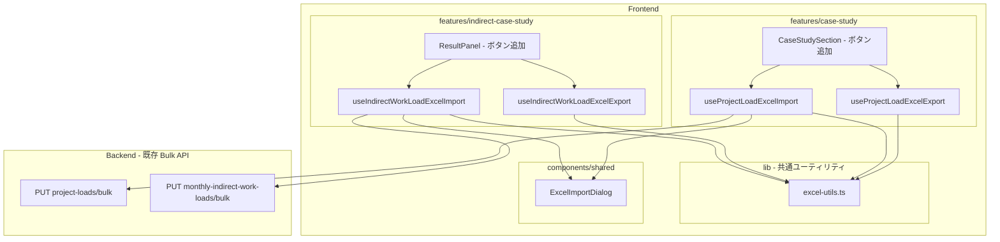
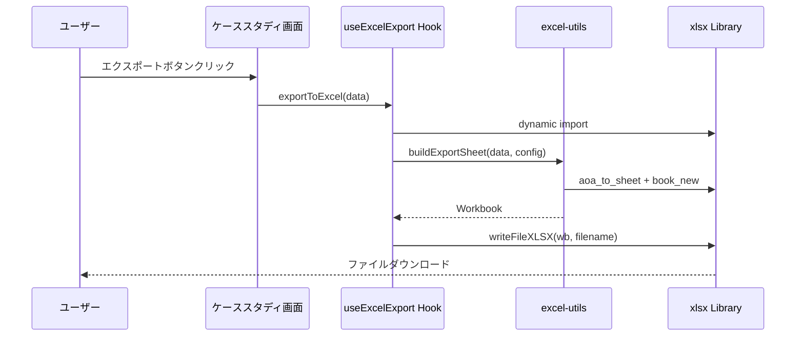
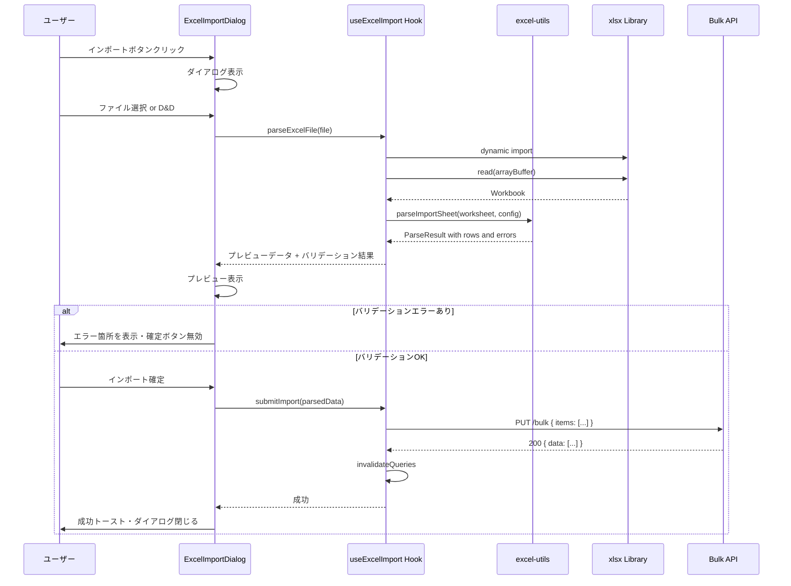

# Design Document — excel-import-export

## Overview

**Purpose**: 案件工数（projectLoad）と間接工数（monthlyIndirectWorkLoad）の Excel インポート/エクスポート機能を提供し、大量データの一括入出力と外部連携を可能にする。

**Users**: プロジェクトマネージャーおよび事業部リーダーが、ケーススタディ画面から Excel ファイルを介してデータの入出力を行う。

**Impact**: フロントエンドに Excel 読み書きユーティリティ・インポートダイアログ・エクスポート/インポートフックを追加。バックエンドは既存の Bulk API をそのまま利用し変更なし。

### Goals
- 案件工数・間接工数の Excel エクスポート（ダウンロード）
- Excel ファイルからのインポート（プレビュー + バリデーション + Bulk API 連携）
- エクスポート → インポートのラウンドトリップ互換
- 共通 UI コンポーネントによる一貫したユーザー体験

### Non-Goals
- バックエンドへのファイルアップロード機能（フロントエンド完結）
- 既存の計算結果エクスポート（`useExcelExport`）の変更
- Excel テンプレートダウンロード機能（将来検討）
- Web Worker によるバックグラウンド処理（将来検討）

## Architecture

### Existing Architecture Analysis

既存のパターンと制約:
- **Excel エクスポート**: `useExcelExport.ts` で `xlsx` の動的 import + `aoa_to_sheet` + `writeFileXLSX` パターンが確立
- **Bulk API**: `PUT /project-cases/:id/project-loads/bulk` と `PUT /indirect-work-cases/:id/monthly-indirect-work-loads/bulk` が実装済み
- **Mutation パターン**: `useMutation` + `queryClient.invalidateQueries` + `toast` が統一的
- **ダイアログ**: `Dialog`（Radix UI）を複雑なワークフロー向けに、`AlertDialog` を単純確認向けに使い分け

### Architecture Pattern & Boundary Map



**Architecture Integration**:
- **Selected pattern**: 共通ユーティリティ + Feature Hook パターン（既存 feature-first 構成を踏襲）
- **Domain/feature boundaries**: Excel の低レベル操作は `lib/excel-utils.ts` に集約、feature 固有のデータ変換は各 feature hook 内で実施
- **Existing patterns preserved**: 動的 import、useMutation + invalidateQueries、Dialog/AlertDialog ベース UI
- **New components rationale**: `ExcelImportDialog` は 2つの feature で共有されるため `components/shared/` に配置
- **Steering compliance**: feature 間依存なし、レイヤー方向の遵守

### Technology Stack

| Layer | Choice / Version | Role in Feature | Notes |
|-------|------------------|-----------------|-------|
| Frontend | React 19 + TanStack Query | UI・状態管理・API 通信 | 既存 |
| Excel 処理 | xlsx v0.18.5 | Excel 読み書き | 導入済み・動的 import |
| UI プリミティブ | Radix UI Dialog | インポートダイアログ（マルチステップ向け） | 既存 shadcn/ui |
| バリデーション | Zod v3 | インポートデータ検証 | フロントエンド既存 |
| Backend | Hono v4 | Bulk API | 既存・変更なし |

## System Flows

### エクスポートフロー



### インポートフロー



## Requirements Traceability

| Requirement | Summary | Components | Interfaces | Flows |
|-------------|---------|------------|------------|-------|
| 1.1 | 案件工数エクスポート実行 | useProjectLoadExcelExport, CaseStudySection | ExportConfig | エクスポートフロー |
| 1.2 | シート構成（行=ケース名,列=年月、単一行） | useProjectLoadExcelExport, excel-utils | ExportSheetConfig | — |
| 1.3 | ヘッダー行 | excel-utils | ExportSheetConfig | — |
| 1.4 | エクスポート中ローディング | CaseStudySection | isExporting state | — |
| 1.5 | データなし通知 | CaseStudySection | — | — |
| 2.1 | 間接工数エクスポート実行 | useIndirectWorkLoadExcelExport, ResultPanel | ExportConfig | エクスポートフロー |
| 2.2 | シート構成（行=BU名,列=年月） | useIndirectWorkLoadExcelExport, excel-utils | ExportSheetConfig | — |
| 2.3 | ヘッダー行 | excel-utils | ExportSheetConfig | — |
| 2.4 | エクスポート中ローディング | ResultPanel | isExporting state | — |
| 2.5 | データなし通知 | ResultPanel | — | — |
| 2.6 | 既存エクスポート非影響 | — | — | — |
| 3.1 | インポートダイアログ表示 | ExcelImportDialog, CaseStudySection | ExcelImportDialogProps | インポートフロー |
| 3.2 | ファイル解析・プレビュー | useProjectLoadExcelImport, excel-utils | ParseResult | インポートフロー |
| 3.3 | プレビュー確認 | ExcelImportDialog | ImportPreviewData | インポートフロー |
| 3.4 | Bulk API 連携 | useProjectLoadExcelImport | BulkProjectLoadInput | インポートフロー |
| 3.5 | フォーマットエラー表示 | ExcelImportDialog | ValidationError | インポートフロー |
| 3.6 | manhour 範囲エラー | excel-utils | ValidationError | — |
| 3.7 | 成功通知・データ更新 | useProjectLoadExcelImport | — | インポートフロー |
| 3.8 | API エラー通知 | useProjectLoadExcelImport | — | インポートフロー |
| 4.1–4.9 | 間接工数インポート（3.x と対称） | useIndirectWorkLoadExcelImport, ExcelImportDialog, ResultPanel | ParseResult, ValidationError | インポートフロー |
| 4.10 | source = "manual" 設定 | useIndirectWorkLoadExcelImport | — | — |
| 5.1–5.3 | ラウンドトリップ互換 | excel-utils | ExportSheetConfig | — |
| 6.1 | 共通ダイアログ | ExcelImportDialog | ExcelImportDialogProps | — |
| 6.2 | D&D / ファイル選択 | ExcelImportDialog | — | — |
| 6.3 | xlsx/xls 対応 | excel-utils | — | — |
| 6.4 | 非対応形式エラー | ExcelImportDialog | — | — |
| 6.5 | インポート中ローディング | ExcelImportDialog | isImporting state | — |
| 6.6 | 大量データ対応 | excel-utils | — | — |
| 7.1–7.6 | バリデーション | excel-utils | ValidationError, ValidateImportConfig | — |

## Components and Interfaces

| Component | Domain/Layer | Intent | Req Coverage | Key Dependencies | Contracts |
|-----------|-------------|--------|--------------|-----------------|-----------|
| excel-utils | lib | Excel 読み書き共通ユーティリティ | 1.2–1.3, 2.2–2.3, 3.2, 3.6, 4.2, 4.6, 5.1–5.3, 6.3, 6.6, 7.1–7.6 | xlsx (P0) | Service |
| ExcelImportDialog | shared | インポートダイアログ UI | 3.1, 3.3, 3.5, 4.1, 4.3, 4.5, 6.1–6.5 | excel-utils (P0), Radix Dialog (P0) | State |
| useProjectLoadExcelExport | case-study | 案件工数エクスポート hook | 1.1–1.5 | excel-utils (P0), xlsx (P0) | Service |
| useProjectLoadExcelImport | case-study | 案件工数インポート hook | 3.1–3.8 | excel-utils (P0), useBulkUpsertProjectLoads (P0) | Service |
| useIndirectWorkLoadExcelExport | indirect-case-study | 間接工数エクスポート hook | 2.1–2.6 | excel-utils (P0), xlsx (P0) | Service |
| useIndirectWorkLoadExcelImport | indirect-case-study | 間接工数インポート hook | 4.1–4.10 | excel-utils (P0), useBulkSaveMonthlyIndirectWorkLoads (P0) | Service |

### lib — 共通ユーティリティ

#### excel-utils

| Field | Detail |
|-------|--------|
| Intent | Excel ファイルの読み書き・バリデーションの共通ロジックを提供 |
| Requirements | 1.2, 1.3, 2.2, 2.3, 3.2, 3.6, 5.1–5.3, 6.3, 6.6, 7.1–7.6 |

**Responsibilities & Constraints**
- Excel ワークブック/ワークシートの生成・解析を担当
- feature 固有のビジネスロジックを含まない（データ変換設定は外部から注入）
- `xlsx` パッケージへの直接依存をこのモジュールに集約

**Dependencies**
- External: `xlsx` v0.18.5 — Excel 読み書き (P0)

**Contracts**: Service [x]

##### Service Interface

```typescript
/** エクスポートシート設定 */
interface ExportSheetConfig {
  /** シート名 */
  sheetName: string;
  /** 最左列のヘッダーラベル（例: "案件名", "BU名"） */
  rowHeaderLabel: string;
  /** 年月リスト（YYYY-MM 形式の表示用） */
  yearMonths: string[];
  /** 行データ: [行ラベル, ...月別値] */
  rows: ExportRow[];
}

interface ExportRow {
  label: string;
  values: number[];
}

/** インポートパース設定 */
interface ImportParseConfig {
  /** 最低限必要な列数 */
  minColumns: number;
  /** yearMonth の変換関数（ヘッダー文字列 → YYYYMM） */
  parseYearMonth: (header: string) => string | null;
  /** 行ごとのバリデーション */
  validateRow: (row: ImportRow, rowIndex: number) => ValidationError[];
}

interface ImportRow {
  /** 最左列の値（案件名 or BU 名） */
  rowLabel: string;
  /** 年月ごとの値: Map<YYYYMM, number> */
  monthlyValues: Map<string, number>;
}

interface ParseResult {
  rows: ImportRow[];
  yearMonths: string[];
  errors: ValidationError[];
}

interface ValidationError {
  row: number;
  column?: number;
  field: string;
  message: string;
  value?: string | number;
}

/** ワークブック生成 */
function buildExportWorkbook(config: ExportSheetConfig): WorkBook;

/** Excel ファイルのダウンロード */
function downloadWorkbook(workbook: WorkBook, filename: string): void;

/** Excel ファイルの解析 */
function parseExcelFile(
  file: File
): Promise<{ headers: string[]; rawRows: (string | number | null)[][] }>;

/** パース結果のバリデーション付き変換 */
function parseImportSheet(
  headers: string[],
  rawRows: (string | number | null)[][],
  config: ImportParseConfig
): ParseResult;

/** 共通バリデーション: manhour 範囲チェック */
function validateManhour(value: number): boolean;

/** 共通バリデーション: yearMonth フォーマットチェック（YYYYMM） */
function validateYearMonth(value: string): boolean;
```

- **Preconditions**: `file` は有効な `.xlsx` / `.xls` ファイル
- **Postconditions**: `ParseResult.errors` が空の場合、`rows` は Bulk API に送信可能な形式
- **Invariants**: yearMonth は常に YYYYMM（6桁）形式で返却

**Implementation Notes**
- `xlsx` は動的 import（`await import("xlsx")`）でバンドル分割
- `aoa_to_sheet` でエクスポート、`sheet_to_json` でインポートパース
- カラム幅は自動調整（ラベル列: 20、月列: 12）

### components/shared

#### ExcelImportDialog

| Field | Detail |
|-------|--------|
| Intent | ファイル選択・プレビュー・バリデーション表示・インポート確定の共通ダイアログ |
| Requirements | 3.1, 3.3, 3.5, 4.1, 4.3, 4.5, 6.1–6.5 |

**Responsibilities & Constraints**
- ファイルアップロード UI（D&D + ファイル選択ボタン）
- インポートプレビューテーブルの表示
- バリデーションエラーの可視化
- インポート確定/キャンセルの制御
- feature 固有のデータ変換ロジックを含まない（props 経由で注入）

**Dependencies**
- Inbound: Feature hooks — ダイアログ制御 (P0)
- External: Radix Dialog — ダイアログ基盤 (P0)。AlertDialog ではなく Dialog を使用（ファイル選択・プレビュー・バリデーション表示のマルチステップワークフローに適合）

**Contracts**: State [x]

##### State Management

```typescript
interface ExcelImportDialogProps {
  open: boolean;
  onOpenChange: (open: boolean) => void;
  /** ダイアログタイトル */
  title: string;
  /** ダイアログ説明文 */
  description: string;
  /** ファイル解析関数（feature hook から注入） */
  onFileParsed: (file: File) => Promise<ImportPreviewData>;
  /** インポート確定関数 */
  onConfirm: (data: ImportPreviewData) => Promise<void>;
  /** インポート中フラグ */
  isImporting: boolean;
}

interface ImportPreviewData {
  /** プレビュー用ヘッダー（年月リスト） */
  headers: string[];
  /** プレビュー用行データ */
  rows: ImportPreviewRow[];
  /** バリデーションエラー */
  errors: ValidationError[];
  /** 総件数 */
  totalRecords: number;
}

interface ImportPreviewRow {
  label: string;
  values: (number | null)[];
  /** この行にエラーがあるか */
  hasError: boolean;
}

/** ダイアログ内部ステート */
type ImportDialogStep = "file-select" | "preview";
```

- **Persistence**: ローカルステートのみ（ダイアログクローズでリセット）
- **Concurrency**: シングルファイル処理、確定ボタンは処理中無効化

**Implementation Notes**
- ステップ管理: `file-select` → `preview` の 2 ステップ
- ファイル選択: `<input type="file" accept=".xlsx,.xls">` + D&D ゾーン
- プレビュー: テーブル表示（最大 50 行プレビュー、全件数は別途表示）
- エラー行: 赤色ハイライト + ツールチップでエラー詳細
- 確定ボタン: `errors.length > 0` で disabled

### features/case-study

#### useProjectLoadExcelExport

| Field | Detail |
|-------|--------|
| Intent | 案件工数データを Excel ファイルとしてエクスポート |
| Requirements | 1.1–1.5 |

**Dependencies**
- Outbound: excel-utils — ワークブック生成・ダウンロード (P0)
- External: xlsx — 動的 import (P0)

**Contracts**: Service [x]

##### Service Interface

```typescript
interface ProjectLoadExportParams {
  /** 選択中のケース名（Excel の行ラベルおよびファイル名に使用） */
  caseName: string;
  /** 選択中のケースの月別工数データ */
  loads: Array<{ yearMonth: string; manhour: number }>;
  /** 年月リスト（YYYY-MM 形式） */
  yearMonths: string[];
}

interface UseProjectLoadExcelExportReturn {
  exportToExcel: (params: ProjectLoadExportParams) => Promise<void>;
  isExporting: boolean;
}

function useProjectLoadExcelExport(): UseProjectLoadExcelExportReturn;
```

- **Preconditions**: `loads` が空でないこと（空の場合はトースト通知）
- **Postconditions**: Excel ファイルがダウンロードされる（1データ行 = 選択中のケース）

#### useProjectLoadExcelImport

| Field | Detail |
|-------|--------|
| Intent | Excel ファイルから案件工数データを解析・Bulk API 経由で更新 |
| Requirements | 3.1–3.8 |

**Dependencies**
- Outbound: excel-utils — ファイル解析・バリデーション (P0)
- Outbound: useBulkUpsertProjectLoads — Bulk API mutation (P0)
- Outbound: ExcelImportDialog — UI (P1)

**Contracts**: Service [x]

##### Service Interface

```typescript
interface ProjectLoadImportContext {
  /** インポート先の ProjectCase ID（画面上で選択済み） */
  projectCaseId: number;
}

interface UseProjectLoadExcelImportReturn {
  /** ファイル解析（ExcelImportDialog.onFileParsed に渡す） */
  parseFile: (file: File) => Promise<ImportPreviewData>;
  /** インポート確定（ExcelImportDialog.onConfirm に渡す） */
  confirmImport: (data: ImportPreviewData) => Promise<void>;
  isImporting: boolean;
}

function useProjectLoadExcelImport(
  context: ProjectLoadImportContext
): UseProjectLoadExcelImportReturn;
```

- **Preconditions**: `projectCaseId` が有効な ID であること
- **Postconditions**: 成功時にクエリキャッシュが無効化され、最新データがリフェッチされる。単一の Bulk API コール（`PUT /project-cases/:projectCaseId/project-loads/bulk`）で完結

### features/indirect-case-study

#### useIndirectWorkLoadExcelExport

| Field | Detail |
|-------|--------|
| Intent | 間接工数入力データを Excel ファイルとしてエクスポート |
| Requirements | 2.1–2.6 |

**Dependencies**
- Outbound: excel-utils — ワークブック生成・ダウンロード (P0)
- External: xlsx — 動的 import (P0)

**Contracts**: Service [x]

##### Service Interface

```typescript
interface IndirectWorkLoadExportParams {
  indirectWorkCaseName: string;
  businessUnits: Array<{
    businessUnitName: string;
    businessUnitCode: string;
    loads: Array<{ yearMonth: string; manhour: number }>;
  }>;
  yearMonths: string[];
}

interface UseIndirectWorkLoadExcelExportReturn {
  exportToExcel: (params: IndirectWorkLoadExportParams) => Promise<void>;
  isExporting: boolean;
}

function useIndirectWorkLoadExcelExport(): UseIndirectWorkLoadExcelExportReturn;
```

- **Preconditions**: `businessUnits` が空でないこと
- **Postconditions**: Excel ファイルがダウンロードされる

#### useIndirectWorkLoadExcelImport

| Field | Detail |
|-------|--------|
| Intent | Excel ファイルから間接工数データを解析・Bulk API 経由で更新 |
| Requirements | 4.1–4.10 |

**Dependencies**
- Outbound: excel-utils — ファイル解析・バリデーション (P0)
- Outbound: useBulkSaveMonthlyIndirectWorkLoads — Bulk API mutation (P0)
- Outbound: ExcelImportDialog — UI (P1)

**Contracts**: Service [x]

##### Service Interface

```typescript
interface IndirectWorkLoadImportContext {
  indirectWorkCaseId: number;
  /** BU 名 → businessUnitCode の解決に必要 */
  businessUnits: Array<{ businessUnitName: string; businessUnitCode: string }>;
}

interface UseIndirectWorkLoadExcelImportReturn {
  parseFile: (file: File) => Promise<ImportPreviewData>;
  confirmImport: (data: ImportPreviewData) => Promise<void>;
  isImporting: boolean;
}

function useIndirectWorkLoadExcelImport(
  context: IndirectWorkLoadImportContext
): UseIndirectWorkLoadExcelImportReturn;
```

- **Preconditions**: `indirectWorkCaseId` が有効な ID であること
- **Postconditions**: 成功時にクエリキャッシュが無効化。`source` は `"manual"` に設定

## Data Models

### Domain Model

本機能は新規データモデルを導入しない。既存の `ProjectLoad` と `MonthlyIndirectWorkLoad` を Excel ファイルとの入出力に使用する。

**既存エンティティ（変更なし）**:
- `ProjectLoad`: `{ projectCaseId, yearMonth (YYYYMM), manhour }`
- `MonthlyIndirectWorkLoad`: `{ indirectWorkCaseId, businessUnitCode, yearMonth (YYYYMM), manhour, source }`

### Data Contracts & Integration

**Excel ファイルフォーマット（案件工数）**:

プロジェクト + ケースを指定した状態で、選択中のケースの月別工数を 1 データ行で出力する。

| | A列 | B列 | C列 | ... |
|---|---|---|---|---|
| 1行目 | ケース名 | 2026-04 | 2026-05 | ... |
| 2行目 | Case A | 100 | 200 | ... |

インポート時は A列のケース名は参照情報として無視し、B列以降の年月 + 値のみを使用する（対象ケースは画面上で選択済み）。

**Excel ファイルフォーマット（間接工数）**:

| | A列 | B列 | C列 | ... |
|---|---|---|---|---|
| 1行目 | BU名 | 2026-04 | 2026-05 | ... |
| 2行目 | 設計部 | 500 | 600 | ... |
| 3行目 | 製造部 | 800 | 700 | ... |

**yearMonth 変換規則**:
- Excel ヘッダー: `YYYY-MM`（表示用）
- API リクエスト: `YYYYMM`（6桁文字列）
- 変換: `"2026-04"` → `"202604"`

**API リクエスト形式（既存 Bulk API）**:

案件工数:
```typescript
// PUT /project-cases/:projectCaseId/project-loads/bulk
{
  items: Array<{ yearMonth: string; manhour: number }>
}
```

間接工数:
```typescript
// PUT /indirect-work-cases/:indirectWorkCaseId/monthly-indirect-work-loads/bulk
{
  items: Array<{
    businessUnitCode: string;
    yearMonth: string;
    manhour: number;
    source: "calculated" | "manual";
  }>
}
```

## Error Handling

### Error Strategy

フロントエンドの 2 段階バリデーション:
1. **パース時バリデーション**: ファイル形式・構造チェック（excel-utils 内）
2. **データバリデーション**: 値範囲・重複・参照整合性チェック（feature hook 内）

### Error Categories and Responses

**User Errors**:
- 非対応ファイル形式 → 「.xlsx または .xls ファイルを選択してください」トースト
- 空ファイル / シートなし → 「有効なデータが見つかりません」エラー
- ヘッダー不正（年月列なし） → 「ヘッダー行のフォーマットが不正です」エラー

**Data Validation Errors**:
- manhour 範囲外（< 0 or > 99,999,999） → セルレベルエラー表示
- yearMonth 不正フォーマット → 列ヘッダーレベルエラー
- 重複 yearMonth（案件工数、単一行内の列重複） → 列レベルエラー
- 重複 businessUnitCode + yearMonth（間接工数） → 行レベルエラー
- 存在しない BU 名（間接工数） → 行レベルエラー
- 数値以外の値 → セルレベルエラー

**System Errors**:
- Bulk API 失敗 → `toast.error()` でエラー内容表示、ダイアログは閉じない
- ファイル読み込み失敗 → `toast.error("ファイルの読み込みに失敗しました")`

## Testing Strategy

### Unit Tests
- `excel-utils.ts`: `buildExportWorkbook` / `parseImportSheet` / バリデーション関数のテスト
- yearMonth 変換（YYYY-MM ↔ YYYYMM）の正常系・異常系
- manhour バリデーション境界値（0, 99999999, -1, 100000000）
- 重複検出ロジック

### Integration Tests
- エクスポート → インポートのラウンドトリップテスト（生成した Excel をパースして元データと一致確認）
- インポート hook + Bulk API mutation の結合テスト（MSW 等でモック）
- バリデーションエラー時の UI 表示テスト

### E2E/UI Tests
- エクスポートボタンクリック → ファイルダウンロード確認
- インポートダイアログ: ファイル選択 → プレビュー → 確定フロー
- バリデーションエラー時の確定ボタン無効化確認
- 大量データ（100行）のインポート正常動作確認
