# Design Document: frontend-common-utils

## Overview

**Purpose**: Frontend コードベースに散在する重複ユーティリティ関数・マジックナンバー・ローカルコンポーネントを共通モジュールに集約し、保守性と一貫性を向上させる。

**Users**: 開発者が日時フォーマット・フォームバリデーション・キャッシュ設定・詳細画面表示を実装する際に、共通モジュールを利用する。

**Impact**: 既存の4つの feature（work-types, business-units, project-types, projects）と4つの detail route に対し、ローカル定義を共通モジュールへのインポートに置換する。外部から観測可能な振る舞いは変更しない。

### Goals
- 重複関数（formatDateTime × 4, displayOrder validator × 3）を単一モジュールに集約
- staleTime マジックナンバー（31箇所）を名前付き定数に置換
- ローカルコンポーネント（DetailRow × 4, NotFoundState × 4）を共有コンポーネントに抽出
- 抽出モジュールのユニットテストを追加

### Non-Goals
- columns.tsx のカラムファクトリ化（Phase 2 で対応）
- フォームフィールドラッパーの抽出（Phase 2 で対応）
- API クライアント・Query Key・Mutation Hook のファクトリ化（Phase 2 で対応）
- 共有コンポーネントの barrel export（index.ts）導入

## Architecture

### Existing Architecture Analysis

既存の Frontend は feature-first 構成で、各 feature が独自に API クライアント・コンポーネント・型を内包する。共通モジュールは以下の2つのレイヤーに配置される:

- `src/lib/` — 純粋関数・定数（React に依存しない）
- `src/components/shared/` — 共有 React コンポーネント

現在の課題は、feature 間で共通化すべき関数・コンポーネントがローカルに定義されている点。

### Architecture Pattern & Boundary Map

```mermaid
graph TB
    subgraph SharedModules[共通モジュール - 新規作成]
        FU[lib/format-utils.ts]
        VA[lib/validators.ts]
        CO[lib/api/constants.ts]
        DR[components/shared/DetailRow.tsx]
        NF[components/shared/NotFoundState.tsx]
    end

    subgraph Features[feature レイヤー]
        WT[work-types/columns.tsx]
        BU[business-units/columns.tsx]
        PT[project-types/columns.tsx]
        PJ[projects/columns.tsx]
        WTF[work-types/WorkTypeForm.tsx]
        BUF[business-units/BusinessUnitForm.tsx]
        PTF[project-types/ProjectTypeForm.tsx]
    end

    subgraph Queries[queries レイヤー]
        Q1[work-types/queries.ts]
        Q2[business-units/queries.ts]
        Q3[project-types/queries.ts]
        Q4[projects/queries.ts]
        Q5[case-study/queries.ts]
        Q6[indirect-case-study/queries.ts]
        Q7[workload/queries.ts]
    end

    subgraph Routes[route レイヤー]
        R1[business-units detail]
        R2[project-types detail]
        R3[work-types detail]
        R4[projects detail]
    end

    WT --> FU
    BU --> FU
    PT --> FU
    PJ --> FU
    WTF --> VA
    BUF --> VA
    PTF --> VA
    Q1 --> CO
    Q2 --> CO
    Q3 --> CO
    Q4 --> CO
    Q5 --> CO
    Q6 --> CO
    Q7 --> CO
    R1 --> DR
    R2 --> DR
    R3 --> DR
    R4 --> DR
    R1 --> NF
    R2 --> NF
    R3 --> NF
    R4 --> NF
    R1 --> FU
    R2 --> FU
    R3 --> FU
    R4 --> FU
```



**Architecture Integration**:
- Selected pattern: Extract Method — 既存のローカル定義を共通モジュールに抽出
- Domain/feature boundaries: 共通モジュールは feature に依存しない。依存方向は features/routes → lib/shared のみ
- Existing patterns preserved: `lib/` の小ファイル構成、`components/shared/` の名前付きエクスポート
- Steering compliance: feature 間の依存禁止原則を維持。共通化は `lib/` と `components/shared/` で行う

### Technology Stack

| Layer | Choice / Version | Role in Feature | Notes |
|-------|------------------|-----------------|-------|
| Frontend | React 19 + TypeScript 5.9 | コンポーネント・型定義 | strict mode |
| Routing | TanStack Router | notFoundComponent の統合 | Link コンポーネント使用 |
| Forms | TanStack Form | validators prop の型互換 | `FieldValidateFn` 型 |
| Query | TanStack Query | staleTime 定数の参照 | queryOptions 内で使用 |
| Test | Vitest 4 | ユニットテスト | globals 有効 |

## Requirements Traceability

| Requirement | Summary | Components | Interfaces |
|-------------|---------|------------|------------|
| 1.1-1.5 | formatDateTime 共通化 | `format-utils.ts` | `formatDateTime()` |
| 2.1-2.4 | displayOrder バリデータ共通化 | `validators.ts` | `displayOrderValidators` |
| 3.1-3.4 | staleTime 定数一元管理 | `api/constants.ts` | `STALE_TIMES` |
| 4.1-4.4 | DetailRow 共有コンポーネント | `DetailRow.tsx` | `DetailRowProps` |
| 5.1-5.5 | NotFoundState 共有コンポーネント | `NotFoundState.tsx` | `NotFoundStateProps` |
| 6.1-6.4 | ユニットテスト | テストファイル群 | — |
| 7.1-7.5 | 後方互換性 | 全コンポーネント | — |

## Components and Interfaces

| Component | Domain/Layer | Intent | Req Coverage | Key Dependencies | Contracts |
|-----------|--------------|--------|--------------|------------------|-----------|
| `format-utils.ts` | lib | 日時フォーマットユーティリティ | 1.1-1.5 | なし | Service |
| `validators.ts` | lib | フォームバリデータ集約 | 2.1-2.4 | TanStack Form (P1) | Service |
| `api/constants.ts` | lib/api | クエリキャッシュ定数 | 3.1-3.4 | なし | Service |
| `DetailRow.tsx` | components/shared | 詳細画面ラベル・値ペア表示 | 4.1-4.4 | なし | State |
| `NotFoundState.tsx` | components/shared | リソース未検出状態表示 | 5.1-5.5 | TanStack Router Link (P1) | State |

### lib レイヤー

#### format-utils.ts

| Field | Detail |
|-------|--------|
| Intent | 日時フォーマットユーティリティの提供 |
| Requirements | 1.1, 1.2, 1.3, 1.4, 1.5 |

**Responsibilities & Constraints**
- `ja-JP` ロケールでの日時フォーマットを一元提供
- React に依存しない純粋関数
- 既存の出力と完全一致すること

**Dependencies**
- External: なし（`Date.prototype.toLocaleString` のみ使用）

**Contracts**: Service [x]

##### Service Interface

```typescript
/**
 * 日時文字列を ja-JP ロケールでフォーマットする
 * @param dateStr - ISO 8601 形式の日時文字列
 * @returns "yyyy/MM/dd HH:mm" 形式の文字列
 */
export function formatDateTime(dateStr: string): string;
```

- Preconditions: `dateStr` は `new Date()` で有効にパース可能な文字列
- Postconditions: `ja-JP` ロケールで year(numeric), month(2-digit), day(2-digit), hour(2-digit), minute(2-digit) のフォーマット文字列を返す
- Invariants: 同一入力に対して常に同一出力

**Implementation Notes**
- 既存の実装をそのまま抽出: `new Date(dateStr).toLocaleString("ja-JP", { year: "numeric", month: "2-digit", day: "2-digit", hour: "2-digit", minute: "2-digit" })`

---

#### validators.ts

| Field | Detail |
|-------|--------|
| Intent | TanStack Form 用の共通バリデータ提供 |
| Requirements | 2.1, 2.2, 2.3, 2.4 |

**Responsibilities & Constraints**
- TanStack Form の `validators` prop と型互換なオブジェクトを提供
- バリデーションエラーメッセージは日本語
- React に依存しない純粋関数

**Dependencies**
- External: TanStack Form — validators 型互換 (P1)

**Contracts**: Service [x]

##### Service Interface

```typescript
type FieldValidateFn<T> = (params: { value: T }) => string | undefined;

interface FieldValidators<T> {
  onChange: FieldValidateFn<T>;
  onBlur: FieldValidateFn<T>;
}

/**
 * displayOrder フィールド用バリデータ
 * - 整数チェック: "表示順は整数で入力してください"
 * - 非負チェック: "表示順は0以上で入力してください"
 */
export const displayOrderValidators: FieldValidators<number>;
```

- Preconditions: `value` は `number` 型（TanStack Form のフィールド値）
- Postconditions: バリデーションエラー文字列または `undefined`
- Invariants: `onChange` と `onBlur` は同一ロジック

**Implementation Notes**
- 内部で共通のバリデーション関数を定義し、`onChange` と `onBlur` の両方に同一関数を設定
- 将来の拡張: `stringLengthValidator`, `numberRangeValidator` 等のファクトリ関数を追加可能

---

#### api/constants.ts

| Field | Detail |
|-------|--------|
| Intent | TanStack Query の staleTime 定数を一元管理 |
| Requirements | 3.1, 3.2, 3.3, 3.4 |

**Responsibilities & Constraints**
- キャッシュ戦略の意図を名前で表現する定数オブジェクト
- 値は既存のマジックナンバーと完全一致
- `lib/api/index.ts` から re-export

**Dependencies**
- External: なし

**Contracts**: Service [x]

##### Service Interface

```typescript
/**
 * TanStack Query staleTime 定数
 * データ更新頻度に応じたカテゴリ別キャッシュ時間
 */
export const STALE_TIMES: {
  /** 1分 — 頻繁に更新されるデータ */
  readonly SHORT: 60_000;
  /** 2分 — 一覧/詳細クエリ */
  readonly STANDARD: 120_000;
  /** 5分 — 関連データ/月次データ */
  readonly MEDIUM: 300_000;
  /** 30分 — マスタデータ */
  readonly LONG: 1_800_000;
} as const;
```

- Preconditions: なし
- Postconditions: 読み取り専用定数
- Invariants: 値はミリ秒単位の正の整数

**Implementation Notes**
- `lib/api/index.ts` に `export { STALE_TIMES } from "./constants"` を追加
- 置換マッピング: `60 * 1000` → `STALE_TIMES.SHORT`, `2 * 60 * 1000` → `STALE_TIMES.STANDARD`, `5 * 60 * 1000` → `STALE_TIMES.MEDIUM`, `30 * 60 * 1000` → `STALE_TIMES.LONG`

---

### components/shared レイヤー

#### DetailRow.tsx

| Field | Detail |
|-------|--------|
| Intent | 詳細画面のラベル・値ペア表示 |
| Requirements | 4.1, 4.2, 4.3, 4.4 |

**Responsibilities & Constraints**
- 3カラムグリッドレイアウトで label と value を表示
- 既存の `components/shared/` パターンに準拠（名前付きエクスポート、`className` prop）

**Dependencies**
- Inbound: 4つの detail route — 詳細情報表示 (P1)

**Contracts**: State [x]

##### State Management

```typescript
interface DetailRowProps {
  /** 項目ラベル */
  label: string;
  /** 表示値 */
  value: string;
  /** 追加の CSS クラス */
  className?: string;
}

export function DetailRow(props: DetailRowProps): React.ReactElement;
```

- State model: stateless（props のみ）
- レイアウト: `grid grid-cols-3 gap-4`
  - `dt`: `text-sm font-medium text-muted-foreground`
  - `dd`: `col-span-2 text-sm`

**Implementation Notes**
- 既存の4箇所のローカル定義と完全一致する UI を提供
- `className` prop は `cn()` で外側の `div` にマージ

---

#### NotFoundState.tsx

| Field | Detail |
|-------|--------|
| Intent | リソース未検出時の状態表示 |
| Requirements | 5.1, 5.2, 5.3, 5.4, 5.5 |

**Responsibilities & Constraints**
- エンティティ名とリンク先をパラメータ化した NotFound UI を提供
- TanStack Router の `Link` コンポーネントを使用
- 既存の `EmptyState` / `ErrorState` と同等のレイアウトパターン

**Dependencies**
- External: `@tanstack/react-router` — `Link` コンポーネント (P1)

**Contracts**: State [x]

##### State Management

```typescript
interface NotFoundStateProps {
  /** 表示用エンティティ名（例: "ビジネスユニット"） */
  entityName: string;
  /** 一覧ページへの戻りパス（例: "/master/business-units"） */
  backTo: string;
  /** 戻りリンクのラベル（デフォルト: "一覧に戻る"） */
  backLabel?: string;
  /** 追加の CSS クラス */
  className?: string;
}

export function NotFoundState(props: NotFoundStateProps): React.ReactElement;
```

- State model: stateless（props のみ）
- レイアウト: `flex flex-col items-center justify-center py-16 space-y-4`
  - メッセージ: `text-lg font-medium` — `"{entityName}が見つかりません"`
  - リンク: `text-sm text-primary hover:underline` — TanStack Router `Link`

**Implementation Notes**
- 4つの detail route の `notFoundComponent` と `isError || !data` 時の表示を統合
- `backLabel` のデフォルト値は `"一覧に戻る"`

## Testing Strategy

### Unit Tests

| テスト対象 | ファイルパス | テスト内容 |
|-----------|------------|-----------|
| `formatDateTime` | `__tests__/lib/format-utils.test.ts` | ISO 文字列入力 → "yyyy/MM/dd HH:mm" 出力の検証 |
| `displayOrderValidators` | `__tests__/lib/validators.test.ts` | 整数・非整数・負数・0・正数の各ケース |
| `STALE_TIMES` | `__tests__/lib/api/constants.test.ts` | 各定数値がミリ秒仕様と一致 |

テストは既存パターンに従い、Vitest の `describe`/`it`/`expect` で記述。日本語テスト名を使用。

### Integration Verification

コンポーネントテスト（`DetailRow`, `NotFoundState`）は本スコープに含めない。これらは stateless なプレゼンテーショナルコンポーネントであり、ユニットテストの対価が低い。代わりに、リファクタリング後の手動画面確認で後方互換性を検証する。
