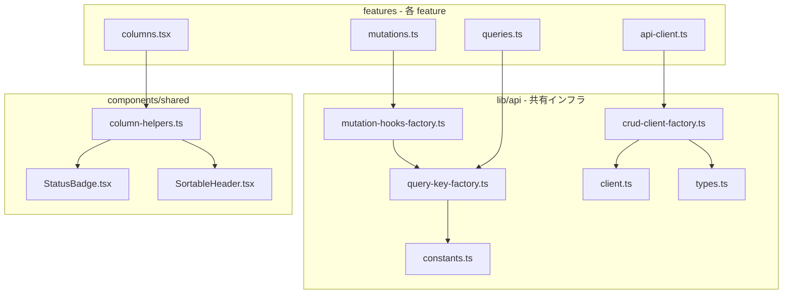

# Design Document

## Overview

**Purpose**: フロントエンドの CRUD ボイラープレート（API クライアント・Query Key・Mutation Hook・カラム定義）をファクトリ関数に抽象化し、feature 間の重複コードを削減する。

**Users**: フロントエンド開発者が新規エンティティ追加時や既存パターン修正時に、ファクトリ呼び出しのみで CRUD インフラを構築できるようにする。

**Impact**: 対象4 feature（`work-types`, `business-units`, `project-types`, `projects`）の `api-client.ts`, `queries.ts`, `mutations.ts`, `columns.tsx` をファクトリ呼び出しに置換し、約435行の重複を解消する。

### Goals
- CRUD API クライアント・Query Key・Mutation Hook のボイラープレートをファクトリ関数で生成可能にする
- カラム定義の共通パターン（ステータス・復元・日時・ソータブル）をヘルパー関数で提供する
- 対象4 feature を実際にファクトリ呼び出しに移行し、重複を実削減する
- 既存の外部 API レスポンスおよび UI の振る舞いを一切変更しない

### Non-Goals
- リンクカラムの汎用化（feature ごとにルートパス・パラメータが異なり、汎用化の効果が薄い）
- `case-study`, `indirect-case-study`, `workload` 等の非マスター feature への適用（本スコープ外）
- Select クエリ（Projects 固有）のファクトリ化
- トースト通知の統一（Phase 4 のスコープ）
- Backend 側の変更

## Architecture

### Existing Architecture Analysis

現在の各 feature は以下の3層構造を持つ:
- `api/api-client.ts` — fetch ベースの CRUD 関数群（`fetchList`, `fetchDetail`, `create`, `update`, `delete`, `restore`）
- `api/queries.ts` — Query Key Factory + queryOptions 定義
- `api/mutations.ts` — 4つの Mutation Hook（`useCreate`, `useUpdate`, `useDelete`, `useRestore`）
- `components/columns.tsx` — TanStack Table カラム定義

Phase 1 で導入済みの共有基盤:
- `lib/api/client.ts` — `API_BASE_URL`, `ApiError`, `handleResponse<T>()`
- `lib/api/constants.ts` — `STALE_TIMES`
- `lib/api/types.ts` — `PaginatedResponse<T>`, `SingleResponse<T>`, `ProblemDetails`, `SelectOption`
- `components/shared/StatusBadge.tsx`, `SortableHeader.tsx`

### Architecture Pattern & Boundary Map



**Architecture Integration**:
- Selected pattern: ファクトリ関数パターン（設定オブジェクト → 型付きオブジェクト返却）
- Domain boundary: `lib/api/` に API インフラファクトリ、`components/shared/` にカラムヘルパーを配置
- Existing patterns preserved: feature-first 構成、`@/` エイリアス、re-export パターン
- New components: 3つのファクトリ関数 + 1つのカラムヘルパーモジュール
- Steering compliance: features 間依存禁止、lib 層への共通化

### Technology Stack

| Layer | Choice / Version | Role in Feature | Notes |
|-------|------------------|-----------------|-------|
| Frontend | React 19 + TypeScript 5.9 | ファクトリ関数の実行環境 | strict mode 必須 |
| Data Fetching | TanStack Query v5 | queryOptions / useMutation | 既存バージョン維持 |
| Table | TanStack Table v8 | ColumnDef 型 | 既存バージョン維持 |
| Routing | TanStack Router | Link コンポーネント（カラム内） | 既存バージョン維持 |
| Testing | Vitest v4 | ファクトリのユニットテスト | 既存テスト基盤 |

## Requirements Traceability

| Requirement | Summary | Components | Interfaces |
|-------------|---------|------------|------------|
| 1.1–1.7 | CRUD API クライアントファクトリ | `CrudClientFactory` | `CrudClientConfig`, `CrudClient` |
| 2.1–2.4 | Query Key Factory ジェネレータ | `QueryKeyFactory` | `QueryKeys` |
| 3.1–3.5 | 標準 queryOptions ファクトリ | `QueryOptionsFactory` | `createListQueryOptions`, `createDetailQueryOptions` |
| 4.1–4.7 | CRUD Mutation Hook ファクトリ | `MutationHooksFactory` | `CrudMutationConfig`, `CrudMutations` |
| 5.1–5.7 | カラム定義ヘルパー関数群 | `ColumnHelpers` | `createStatusColumn`, `createRestoreActionColumn`, `createDateTimeColumn`, `createSortableColumn` |
| 6.1–6.7 | 既存 feature への適用 | 各 feature の api-client/queries/mutations/columns | — |
| 7.1–7.5 | 型安全性とテスト | 全コンポーネント | — |

## Components and Interfaces

| Component | Domain/Layer | Intent | Req Coverage | Key Dependencies | Contracts |
|-----------|--------------|--------|--------------|------------------|-----------|
| CrudClientFactory | lib/api | CRUD API クライアント生成 | 1.1–1.7 | client.ts (P0), types.ts (P0) | Service |
| QueryKeyFactory | lib/api | Query Key + queryOptions 生成 | 2.1–2.4, 3.1–3.5 | constants.ts (P1) | Service |
| MutationHooksFactory | lib/api | Mutation Hook 生成 | 4.1–4.7 | QueryKeyFactory (P0) | Service |
| ColumnHelpers | components/shared | カラム定義ヘルパー | 5.1–5.7 | StatusBadge (P0), SortableHeader (P0) | Service |

### lib/api Layer

#### CrudClientFactory

| Field | Detail |
|-------|--------|
| Intent | 設定オブジェクトから型安全な CRUD API クライアントを生成する |
| Requirements | 1.1, 1.2, 1.3, 1.4, 1.5, 1.6, 1.7 |

**Responsibilities & Constraints**
- リソースパス・ID フィールド名・ページネーション設定から6つの API 関数を生成
- `API_BASE_URL`, `handleResponse` を内部で使用し、HTTP 通信の詳細を隠蔽
- 生成されるリクエストは既存の手書き API クライアントと完全に同一であること

**Dependencies**
- Outbound: `lib/api/client.ts` — `API_BASE_URL`, `handleResponse` (P0)
- Outbound: `lib/api/types.ts` — `PaginatedResponse<T>`, `SingleResponse<T>` (P0)

**Contracts**: Service [x]

##### Service Interface

```typescript
// --- 設定型 ---

interface BaseListParams {
  includeDisabled?: boolean;
}

interface PaginatedListParams extends BaseListParams {
  page: number;
  pageSize: number;
}

interface CrudClientConfig<
  TEntity,
  TCreateInput,
  TUpdateInput,
  TId extends string | number,
  TListParams extends BaseListParams,
> {
  resourcePath: string;           // e.g. "work-types"
  paginated?: boolean;            // default: false
}

// --- 戻り値型 ---

interface CrudClient<
  TEntity,
  TCreateInput,
  TUpdateInput,
  TId extends string | number,
  TListParams extends BaseListParams,
> {
  fetchList(params: TListParams): Promise<PaginatedResponse<TEntity>>;
  fetchDetail(id: TId): Promise<SingleResponse<TEntity>>;
  create(input: TCreateInput): Promise<SingleResponse<TEntity>>;
  update(id: TId, input: TUpdateInput): Promise<SingleResponse<TEntity>>;
  delete(id: TId): Promise<void>;
  restore(id: TId): Promise<SingleResponse<TEntity>>;
}

// --- ファクトリ関数 ---

function createCrudClient<
  TEntity,
  TCreateInput,
  TUpdateInput,
  TId extends string | number = string,
  TListParams extends BaseListParams = BaseListParams,
>(
  config: CrudClientConfig<TEntity, TCreateInput, TUpdateInput, TId, TListParams>,
): CrudClient<TEntity, TCreateInput, TUpdateInput, TId, TListParams>;
```

- Preconditions: `config.resourcePath` は空でない文字列
- Postconditions: 返却オブジェクトの各メソッドが `API_BASE_URL + "/" + resourcePath` に対して正しい HTTP メソッドでリクエストを送信
- Invariants: 生成されるリクエストは既存の手書き API クライアントと同一の URL・メソッド・ヘッダー・ボディ

**Implementation Notes**
- `fetchList`: `paginated: true` の場合は `page[number]`, `page[size]` を URLSearchParams に追加。`includeDisabled` は `filter[includeDisabled]` として追加
- `fetchDetail` / `update` / `delete`: `encodeURIComponent(String(id))` で一律エンコード
- `restore`: `/{id}/actions/restore` に POST
- `create`: `Content-Type: application/json` ヘッダー付き POST
- `update`: `Content-Type: application/json` ヘッダー付き PUT
- 各 feature の `api-client.ts` では `createCrudClient` の戻り値を分割代入でエクスポートし、既存のインポートパスを維持

#### QueryKeyFactory

| Field | Detail |
|-------|--------|
| Intent | リソース名から Query Key Factory と queryOptions ヘルパーを生成する |
| Requirements | 2.1, 2.2, 2.3, 2.4, 3.1, 3.2, 3.3, 3.4, 3.5 |

**Responsibilities & Constraints**
- リソース名文字列から5つの階層的キー生成関数を返す
- リスト / 詳細用の queryOptions ヘルパー関数を提供
- TanStack Query の `queryKey` プレフィックスマッチングに対応

**Dependencies**
- Outbound: `lib/api/constants.ts` — `STALE_TIMES` (P1)
- External: `@tanstack/react-query` — `queryOptions` (P0)

**Contracts**: Service [x]

##### Service Interface

```typescript
// --- Query Key 型 ---

interface QueryKeys<TId extends string | number, TListParams> {
  all: readonly [string];
  lists: () => readonly [string, "list"];
  list: (params: TListParams) => readonly [string, "list", TListParams];
  details: () => readonly [string, "detail"];
  detail: (id: TId) => readonly [string, "detail", TId];
}

// --- ファクトリ関数 ---

function createQueryKeys<
  TId extends string | number = string,
  TListParams = unknown,
>(
  resourceName: string,
): QueryKeys<TId, TListParams>;

// --- queryOptions ヘルパー ---

function createListQueryOptions<TEntity, TListParams>(options: {
  queryKeys: QueryKeys<unknown, TListParams>;
  fetchList: (params: TListParams) => Promise<PaginatedResponse<TEntity>>;
  staleTime?: number;
}): (params: TListParams) => ReturnType<typeof queryOptions>;

function createDetailQueryOptions<TEntity, TId extends string | number>(options: {
  queryKeys: QueryKeys<TId, unknown>;
  fetchDetail: (id: TId) => Promise<SingleResponse<TEntity>>;
  staleTime?: number;
}): (id: TId) => ReturnType<typeof queryOptions>;
```

- Preconditions: `resourceName` は空でない文字列
- Postconditions: `keys.all` が `[resourceName]` と一致し、各レベルが正しくネスト
- Invariants: 既存の各 feature の Query Key 構造と完全に互換

**Implementation Notes**
- `staleTime` のデフォルト値は `STALE_TIMES.STANDARD`（2分）
- `createListQueryOptions` / `createDetailQueryOptions` は `queryOptions()` をラップし、TanStack Query の型推論を維持
- 各 feature の `queries.ts` では生成されたキーとヘルパーを使用し、カスタムクエリ（Select 用等）は個別定義

#### MutationHooksFactory

| Field | Detail |
|-------|--------|
| Intent | CRUD 操作用の4つの Mutation Hook を一括生成する |
| Requirements | 4.1, 4.2, 4.3, 4.4, 4.5, 4.6, 4.7 |

**Responsibilities & Constraints**
- API クライアントと Query Key Factory を受け取り、キャッシュ無効化付き Mutation Hook を返す
- 各フックは呼び出し側で `onSuccess` 等のコールバックを追加可能

**Dependencies**
- Inbound: `QueryKeyFactory` — キャッシュ無効化キー (P0)
- External: `@tanstack/react-query` — `useMutation`, `useQueryClient` (P0)

**Contracts**: Service [x]

##### Service Interface

```typescript
// --- 設定型 ---

interface CrudMutationConfig<
  TEntity,
  TCreateInput,
  TUpdateInput,
  TId extends string | number,
  TListParams,
> {
  client: CrudClient<TEntity, TCreateInput, TUpdateInput, TId, BaseListParams>;
  queryKeys: QueryKeys<TId, TListParams>;
}

// --- 戻り値型 ---

interface CrudMutations<
  TEntity,
  TCreateInput,
  TUpdateInput,
  TId extends string | number,
> {
  useCreate: (options?: {
    onSuccess?: (data: SingleResponse<TEntity>) => void;
  }) => UseMutationResult<SingleResponse<TEntity>, Error, TCreateInput>;

  useUpdate: (
    id: TId,
    options?: {
      onSuccess?: (data: SingleResponse<TEntity>) => void;
    },
  ) => UseMutationResult<SingleResponse<TEntity>, Error, TUpdateInput>;

  useDelete: (options?: {
    onSuccess?: () => void;
  }) => UseMutationResult<void, Error, TId>;

  useRestore: (options?: {
    onSuccess?: (data: SingleResponse<TEntity>) => void;
  }) => UseMutationResult<SingleResponse<TEntity>, Error, TId>;
}

// --- ファクトリ関数 ---

function createCrudMutations<
  TEntity,
  TCreateInput,
  TUpdateInput,
  TId extends string | number,
  TListParams,
>(
  config: CrudMutationConfig<TEntity, TCreateInput, TUpdateInput, TId, TListParams>,
): CrudMutations<TEntity, TCreateInput, TUpdateInput, TId>;
```

- Preconditions: `config.client` と `config.queryKeys` が有効なオブジェクト
- Postconditions: 各 Hook が `useQueryClient` で正しいキーを無効化
- Invariants: キャッシュ無効化パターンが既存の手書き Mutation と同一

**Implementation Notes**
- `useCreate`: `mutationFn` → `client.create`, `onSuccess` → `invalidate(queryKeys.lists())`
- `useUpdate(id)`: `mutationFn` → `client.update(id, input)`, `onSuccess` → `invalidate(queryKeys.lists())` + `invalidate(queryKeys.detail(id))`
- `useDelete`: `mutationFn` → `client.delete`, `onSuccess` → `invalidate(queryKeys.lists())`
- `useRestore`: `mutationFn` → `client.restore`, `onSuccess` → `invalidate(queryKeys.lists())`
- 呼び出し側の `onSuccess` は組み込みの無効化ロジックの**後**に実行

### components/shared Layer

#### ColumnHelpers

| Field | Detail |
|-------|--------|
| Intent | テーブルカラムの共通パターンをヘルパー関数で提供する |
| Requirements | 5.1, 5.2, 5.3, 5.4, 5.5, 5.6, 5.7 |

**Responsibilities & Constraints**
- 4つのヘルパー関数で `ColumnDef<T>` を返す
- 既存の `StatusBadge`, `SortableHeader`, `formatDateTime` を内部で使用
- ジェネリクス `<TData>` で任意のエンティティ型に対応

**Dependencies**
- Outbound: `StatusBadge` — 削除状態表示 (P0)
- Outbound: `SortableHeader` — ソートヘッダー (P0)
- Outbound: `lib/format-utils.ts` — `formatDateTime` (P1)
- External: `@tanstack/react-table` — `ColumnDef` (P0)

**Contracts**: Service [x]

##### Service Interface

```typescript
// --- ステータスカラム ---

function createStatusColumn<TData extends { deletedAt?: string | null }>(options?: {
  id?: string;              // default: "status"
  header?: string;          // default: "ステータス"
  activeLabel?: string;     // default: "アクティブ"
  deletedLabel?: string;    // default: "削除済み"
}): ColumnDef<TData>;

// --- 復元アクションカラム ---

function createRestoreActionColumn<
  TData extends { deletedAt?: string | null },
  TId extends string | number = string,
>(options: {
  idKey: keyof TData;                    // e.g. "workTypeCode" or "projectId"
  onRestore?: (id: TId) => void;
}): ColumnDef<TData>;

// --- 日時カラム ---

function createDateTimeColumn<TData>(options: {
  accessorKey: keyof TData & string;     // e.g. "updatedAt"
  label: string;                         // e.g. "更新日時"
}): ColumnDef<TData>;

// --- ソータブルカラム ---

function createSortableColumn<TData>(options: {
  accessorKey: keyof TData & string;     // e.g. "name"
  label: string;                         // e.g. "名称"
}): ColumnDef<TData>;
```

- Preconditions: `accessorKey` / `idKey` がエンティティ型のプロパティに一致
- Postconditions: 返却される `ColumnDef` が TanStack Table の `useReactTable` で使用可能
- Invariants: 生成されるカラムの表示が既存の手書きカラムと視覚的に同一

**Implementation Notes**
- `createStatusColumn`: `StatusBadge` に `!!row.original.deletedAt` を渡す
- `createRestoreActionColumn`: `row.original.deletedAt` が truthy かつ `onRestore` が提供されている場合のみボタン表示。`e.stopPropagation()` を付与
- `createDateTimeColumn`: `formatDateTime(row.original[accessorKey])` でセル値を整形
- `createSortableColumn`: `SortableHeader` のみの最小カラム定義

## Data Models

本リファクタリングはデータモデルに変更を加えない。既存の `PaginatedResponse<T>`, `SingleResponse<T>`, 各エンティティ型をそのまま使用する。

新たに導入する型（`CrudClientConfig`, `CrudClient`, `QueryKeys`, `CrudMutationConfig`, `CrudMutations`）はすべてファクトリの設定・戻り値型であり、API レスポンスやデータ構造には影響しない。

## Error Handling

### Error Strategy
既存の `ApiError` + `handleResponse<T>()` をそのまま使用する。ファクトリで生成される API 関数は既存の手書き関数と同一のエラーハンドリングを維持する。

- HTTP 4xx/5xx → `ApiError` throw（`ProblemDetails` 付き）
- 204 No Content → `undefined` 返却（delete 操作）
- ネットワークエラー → fetch の例外がそのまま伝播

ファクトリ自体はランタイムエラーを発生させない（設定ミスは TypeScript のコンパイル時に検出）。

## Testing Strategy

### Unit Tests
1. **`createCrudClient`**: 設定から6つの関数が生成されること、各関数が正しい URL・メソッドで fetch を呼び出すことを検証（fetch を mock）
2. **`createQueryKeys`**: 生成されるキー配列の構造が既存パターンと一致することを検証
3. **`createListQueryOptions` / `createDetailQueryOptions`**: 返却オブジェクトの `queryKey` と `staleTime` が正しいことを検証
4. **`createCrudMutations`**: 各 Hook のキャッシュ無効化パターンが正しいことを検証（`useQueryClient` を mock）
5. **カラムヘルパー4関数**: 返却される `ColumnDef` の構造（`id`, `accessorKey`, `header`, `cell`）を検証

### Integration Tests
1. **feature 移行後の型互換性**: `pnpm --filter frontend tsc --noEmit` で型チェック全パス
2. **既存テストの全パス**: `pnpm --filter frontend test` で既存テストが壊れていないことを確認

### テスト配置
- ファクトリのユニットテスト: `apps/frontend/src/lib/__tests__/api/` 配下
- カラムヘルパーのユニットテスト: `apps/frontend/src/components/__tests__/shared/` 配下
