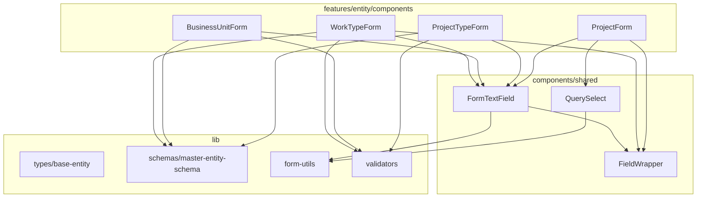

# Design Document

## Overview

**Purpose**: フロントエンドのフォームフィールド構造（Label + Input + Error）と非同期 Select の状態管理、およびエンティティ型・Zod スキーマの共通基盤を提供し、各 feature の重複コードを削減する。

**Users**: フロントエンド開発者がマスターデータ管理画面やその他のフォームを実装する際に使用する。

**Impact**: 既存の4つのフォームコンポーネント（WorkTypeForm, BusinessUnitForm, ProjectTypeForm, ProjectForm）と4つの型定義ファイルを簡素化し、今後の新規フォーム実装のテンプレートを確立する。

### Goals

- フォームフィールドのレイアウトボイラープレート（Label + Input + Error）を共通コンポーネントに集約
- 非同期データ Select の Loading/Error/Success 状態管理を統一
- エンティティ共通フィールドの基底型インターフェースを定義
- Zod バリデーションスキーマの共通ルールを一元化

### Non-Goals

- TanStack Form の `useForm` フック自体の抽象化（フォームインスタンスは各コンポーネントで個別管理）
- `form.Field` コンポーネント自体のラップ（型推論の複雑化を回避）
- フォームの送信ロジック（onSubmit, エラーハンドリング）の共通化
- バックエンド型定義の変更

## Architecture

### Existing Architecture Analysis

現在のフォーム実装は以下の構造で各 feature に重複している:

```
features/[entity]/components/[Entity]Form.tsx
├── useForm() フック初期化
├── form.Field render prop ×3〜7 フィールド
│   ├── div.space-y-2
│   ├── Label (+ 必須マーク)
│   ├── Input / Select
│   └── Error メッセージ
└── Submit ボタン
```

既存の共有ユーティリティ:
- `lib/form-utils.ts` — `getErrorMessage()` ヘルパー
- `lib/validators.ts` — `displayOrderValidators`

### Architecture Pattern & Boundary Map



**Architecture Integration**:
- **Selected pattern**: レイアウトラッパー + フィールドヘルパー（`research.md` Decision 参照）
- **Domain boundaries**: 共有コンポーネント層（`components/shared/`）と共有ライブラリ層（`lib/`）に配置。feature 層から import する方向のみ許可
- **Existing patterns preserved**: feature-first 構成、`@/` エイリアス import、shadcn/ui コンポーネント利用
- **New components rationale**: FieldWrapper はレイアウト抽象化、FormTextField は最頻出パターンのショートカット、QuerySelect は非同期 Select の状態管理を集約
- **Steering compliance**: features 間依存なし、共有コンポーネントは `components/shared/` に配置

### Technology Stack

| Layer | Choice / Version | Role in Feature | Notes |
|-------|------------------|-----------------|-------|
| Frontend UI | React 19 + shadcn/ui | Label, Input, Select コンポーネント | 既存利用 |
| Form | @tanstack/react-form ^1.12.2 | form.Field render prop 内で FieldWrapper/FormTextField を使用 | v1.x API |
| Data Fetching | @tanstack/react-query | QuerySelect の isLoading/isError/data 状態 | 既存利用 |
| Validation | Zod v3 | master-entity-schema の共通スキーマ定義 | フロントエンド側は v3 |
| Icons | lucide-react | Loader2 スピナー | 既存利用 |

## Requirements Traceability

| Requirement | Summary | Components | Interfaces |
|-------------|---------|------------|------------|
| 1.1〜1.6 | FormField レイアウトラッパー | FieldWrapper, FormTextField | FieldWrapperProps, FormTextFieldProps |
| 2.1〜2.6 | QuerySelect 3状態管理 | QuerySelect | QuerySelectProps |
| 3.1〜3.5 | 共通基底型 | base-entity モジュール | SoftDeletableEntity, MasterEntity |
| 4.1〜4.6 | 共通 Zod スキーマ | master-entity-schema モジュール | codeSchema, nameSchema, displayOrderSchema, colorCodeSchema |
| 5.1〜5.6 | 既存フォームへの適用 | WorkTypeForm, BusinessUnitForm, ProjectTypeForm, ProjectForm | — |

## Components and Interfaces

| Component | Domain/Layer | Intent | Req Coverage | Key Dependencies | Contracts |
|-----------|--------------|--------|--------------|-----------------|-----------|
| FieldWrapper | components/shared | フォームフィールドの Label + children + Error レイアウト | 1.1, 1.2, 1.3, 1.4, 1.6 | form-utils (P1) | Props |
| FormTextField | components/shared | テキスト入力フィールドの完全なレイアウト | 1.1, 1.3, 1.5, 1.6 | FieldWrapper (P0), shadcn/Input (P0) | Props |
| QuerySelect | components/shared | 非同期 Select の Loading/Error/Success 3状態 | 2.1〜2.6 | shadcn/Select (P0), lucide-react (P1) | Props |
| base-entity | lib/types | 共通基底型インターフェース | 3.1〜3.5 | なし | TypeScript Interface |
| master-entity-schema | lib/schemas | 共通 Zod スキーマヘルパー | 4.1〜4.6 | Zod v3 (P0) | Zod Schema |

### Shared Components Layer

#### FieldWrapper

| Field | Detail |
|-------|--------|
| Intent | フォームフィールドの Label + children + Error メッセージの統一レイアウトを提供 |
| Requirements | 1.1, 1.2, 1.3, 1.4, 1.6 |

**Responsibilities & Constraints**
- `div.space-y-2` 内に Label、children、Error メッセージを配置
- TanStack Form の `field` オブジェクトから errors を受け取り、`getErrorMessage()` で表示
- `form.Field` の render prop 内で使用される（form.Field 自体はラップしない）

**Dependencies**
- Outbound: `@/lib/form-utils` — getErrorMessage (P1)
- External: `@/components/ui/label` — Label コンポーネント (P0)

**Contracts**: Props

##### Props Interface

```typescript
interface FieldWrapperProps {
  /** フィールドラベルテキスト */
  label: string;
  /** HTML id / htmlFor 属性 */
  htmlFor?: string;
  /** 必須マーク表示 */
  required?: boolean;
  /** TanStack Form の field.state.meta.errors */
  errors?: unknown[];
  /** Label 横のカスタムコンテンツ（カラープレビュー等） */
  labelSuffix?: React.ReactNode;
  /** フィールド入力コンテンツ */
  children: React.ReactNode;
  /** 追加 CSS クラス */
  className?: string;
}
```

- Preconditions: `label` は空文字でないこと
- Postconditions: `errors` が空配列または undefined の場合、エラーメッセージは非表示
- Invariants: `div.space-y-2 > Label > children > ErrorMessage` の構造を常に維持

**Implementation Notes**
- Integration: 既存の `getErrorMessage()` を内部で呼び出し。errors が空の場合は p 要素自体をレンダリングしない
- Validation: errors の型は TanStack Form の `field.state.meta.errors` と同一（`unknown[]`）

#### FormTextField

| Field | Detail |
|-------|--------|
| Intent | テキスト入力フィールド（Label + Input + Error）のショートカットコンポーネント |
| Requirements | 1.1, 1.3, 1.5, 1.6 |

**Responsibilities & Constraints**
- FieldWrapper + shadcn/ui Input を組み合わせた最頻出パターンのコンビニエンスコンポーネント
- TanStack Form の `field` オブジェクト（AnyFieldApi）を受け取り、value/onChange/onBlur を自動接続
- string / number 両方の値型をサポート

**Dependencies**
- Inbound: 各 feature の Form コンポーネント — フォームフィールド描画 (P0)
- Outbound: FieldWrapper — レイアウト (P0)
- External: `@/components/ui/input` — Input コンポーネント (P0)

**Contracts**: Props

##### Props Interface

```typescript
interface FormTextFieldProps {
  /** TanStack Form の field オブジェクト（form.Field render prop から取得） */
  field: AnyFieldApi;
  /** フィールドラベル */
  label: string;
  /** 必須マーク表示 */
  required?: boolean;
  /** プレースホルダー */
  placeholder?: string;
  /** 無効状態 */
  disabled?: boolean;
  /** Input の type 属性 */
  type?: "text" | "number";
  /** Label 横のカスタムコンテンツ */
  labelSuffix?: React.ReactNode;
  /** Input の追加属性（min, max, step, maxLength 等） */
  inputProps?: React.ComponentPropsWithoutRef<typeof Input>;
}
```

- Preconditions: `field` は TanStack Form の form.Field render prop から取得された有効なオブジェクト
- Postconditions: field.state.value と Input の value が同期される
- Invariants: FieldWrapper と同一の DOM 構造を出力

**Implementation Notes**
- Integration: `field.state.value` を Input の value に、`field.handleChange` を onChange に、`field.handleBlur` を onBlur に接続
- type="number" の場合は `Number(e.target.value)` で変換して `field.handleChange` に渡す
- `field.state.meta.errors` を FieldWrapper の errors prop に渡す

#### QuerySelect

| Field | Detail |
|-------|--------|
| Intent | TanStack Query の結果に基づき Loading/Error/Success の3状態を自動切替する Select コンポーネント |
| Requirements | 2.1, 2.2, 2.3, 2.4, 2.5, 2.6 |

**Responsibilities & Constraints**
- query 結果の `isLoading`, `isError`, `data`, `refetch` に応じて3つの UI 状態を切り替え
- TanStack Form に依存しない独立コンポーネント（`value`, `onValueChange` で外部制御）
- shadcn/ui の Select コンポーネントをベースに構築

**Dependencies**
- Inbound: ProjectForm — 事業部/プロジェクトタイプ Select (P0)
- External: `@/components/ui/select` — Select/SelectTrigger/SelectContent/SelectItem (P0)
- External: `@/components/ui/button` — 再試行ボタン (P1)
- External: `lucide-react` — Loader2 スピナー (P1)

**Contracts**: Props

##### Props Interface

```typescript
interface SelectOption {
  value: string;
  label: string;
}

interface QuerySelectProps {
  /** 現在の選択値 */
  value: string | undefined;
  /** 値変更コールバック */
  onValueChange: (value: string) => void;
  /** プレースホルダーテキスト */
  placeholder?: string;
  /** Select の id 属性 */
  id?: string;
  /** TanStack Query の結果から必要なフィールド */
  queryResult: {
    isLoading: boolean;
    isError: boolean;
    data: SelectOption[] | undefined;
    refetch: () => void;
  };
  /** 「未選択」オプションを先頭に追加（任意フィールド用） */
  allowEmpty?: boolean;
  /** 「未選択」時のラベル */
  emptyLabel?: string;
  /** 無効状態 */
  disabled?: boolean;
}
```

- Preconditions: `queryResult` の `data` は `SelectOption[]` 形式に事前変換されていること
- Postconditions: Loading 中は Loader2 + テキスト、Error 時は エラーメッセージ + 再試行ボタン、Success 時は shadcn/ui Select を表示
- Invariants: `allowEmpty` が true の場合、先頭に sentinel 値 `"__none__"` の SelectItem を追加。`onValueChange` で `"__none__"` を受け取った場合は空文字列に変換して呼び出し元に渡す

**Implementation Notes**
- Integration: FieldWrapper と組み合わせて使用する（QuerySelect 自体は Label/Error を含まない）
- `queryResult` の型は UseQueryResult のサブセット。呼び出し側で `useQuery` の結果をそのまま渡せる
- `allowEmpty` + `emptyLabel` で ProjectForm の projectTypeCode パターン（任意 Select）に対応

### Library Layer

#### base-entity モジュール

| Field | Detail |
|-------|--------|
| Intent | エンティティの共通タイムスタンプフィールドとマスターデータ共通フィールドの基底型を定義 |
| Requirements | 3.1, 3.2, 3.3, 3.4, 3.5 |

**Responsibilities & Constraints**
- `SoftDeletableEntity`: createdAt, updatedAt, deletedAt の共通タイムスタンプ
- `MasterEntity`: SoftDeletableEntity に name, displayOrder を追加
- 既存型の外部インターフェースを変更しない（後方互換性の維持）

**Dependencies**
- なし（純粋な型定義）

**Contracts**: TypeScript Interface

##### Interface Definition

```typescript
// lib/types/base-entity.ts

/** ソフトデリート対応エンティティの共通タイムスタンプ */
export interface SoftDeletableEntity {
  createdAt: string;
  updatedAt: string;
  deletedAt?: string | null;
}

/** マスターデータエンティティの共通フィールド */
export interface MasterEntity extends SoftDeletableEntity {
  name: string;
  displayOrder: number;
}
```

**Implementation Notes**
- 既存の `WorkType` は `interface WorkType extends MasterEntity { workTypeCode: string; color: string | null; }` に変更
- 既存の `BusinessUnit` は `interface BusinessUnit extends MasterEntity { businessUnitCode: string; }` に変更
- 既存の `ProjectType` は `interface ProjectType extends MasterEntity { projectTypeCode: string; }` に変更
- `Project` は `MasterEntity` ではなく `SoftDeletableEntity` を extends（displayOrder がないため）

#### master-entity-schema モジュール

| Field | Detail |
|-------|--------|
| Intent | マスターデータの code/name/displayOrder/color の共通 Zod バリデーションスキーマを提供 |
| Requirements | 4.1, 4.2, 4.3, 4.4, 4.5, 4.6 |

**Responsibilities & Constraints**
- 各スキーマは既存のバリデーションルールと完全一致する
- 日本語エラーメッセージを含む
- 個別スキーマとして export し、各 feature の create/update スキーマ内で合成可能にする

**Dependencies**
- External: Zod v3 (P0)

**Contracts**: Zod Schema

##### Schema Definition

```typescript
// lib/schemas/master-entity-schema.ts

import { z } from "zod";

/** マスターコードフィールド: 英数字・ハイフン・アンダースコア、1〜20文字 */
export const codeSchema = z
  .string()
  .min(1, "コードは必須です")
  .max(20, "コードは20文字以内で入力してください")
  .regex(
    /^[a-zA-Z0-9_-]+$/,
    "英数字・ハイフン・アンダースコアのみ使用できます"
  );

/** 名称フィールド: 1〜100文字 */
export const nameSchema = z
  .string()
  .min(1, "名称は必須です")
  .max(100, "名称は100文字以内で入力してください");

/** 表示順フィールド: 0以上の整数 */
export const displayOrderSchema = z
  .number()
  .int("表示順は整数で入力してください")
  .min(0, "表示順は0以上で入力してください");

/** カラーコードフィールド: #RRGGBB 形式、nullable/optional */
export const colorCodeSchema = z
  .string()
  .regex(
    /^#[0-9A-Fa-f]{6}$/,
    "カラーコードは #RRGGBB 形式で入力してください"
  )
  .nullable()
  .optional();
```

**Implementation Notes**
- `codeSchema` のエラーメッセージは汎用形（「コードは必須です」）。既存の feature 固有メッセージ（「作業種類コードは必須です」等）から汎用化する
- 各 feature の create スキーマは `z.object({ workTypeCode: codeSchema, name: nameSchema, displayOrder: displayOrderSchema.default(0), ... })` の形で合成
- update スキーマは `displayOrderSchema.optional()` の形で optional 化

## Error Handling

### Error Strategy

本フィーチャーで新たに導入するエラーパターンはない。既存の以下のパターンを維持する:

- **フィールドバリデーションエラー**: `field.state.meta.errors` → `getErrorMessage()` → `text-destructive` 表示
- **QuerySelect データ取得エラー**: `queryResult.isError` → エラーメッセージ + 再試行ボタン表示

### Error Categories and Responses

**User Errors**: Zod バリデーションエラー → FieldWrapper 内のエラーメッセージ表示
**System Errors**: TanStack Query 取得失敗 → QuerySelect の再試行 UI

## Testing Strategy

### Unit Tests

1. **FieldWrapper**: label 表示、required マーク、errors 表示/非表示、children レンダリング
2. **FormTextField**: field オブジェクトとの value/onChange/onBlur 接続、disabled 状態、type="number" 変換
3. **QuerySelect**: isLoading 時の Loader2 表示、isError 時のエラー+再試行ボタン、成功時の SelectItem レンダリング、allowEmpty 時の未選択オプション
4. **master-entity-schema**: codeSchema/nameSchema/displayOrderSchema/colorCodeSchema のバリデーションルール検証
5. **base-entity 型**: 既存型が基底型を extends した後も同一フィールドを持つことの型チェック

### Integration Tests

1. **FormTextField + FieldWrapper**: TanStack Form の form.Field 内での正しいレンダリング
2. **QuerySelect + FieldWrapper**: FieldWrapper 内に QuerySelect を配置した場合のレイアウト
3. **既存フォームリファクタリング**: WorkTypeForm 等が共通コンポーネント使用後もビルド・型チェックを通過すること

