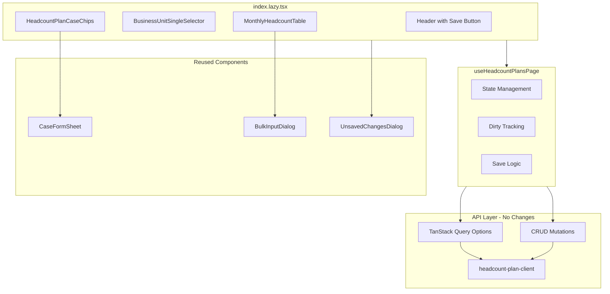

# Design Document: headcount-plan-fullwide-layout

## Overview

**Purpose**: 人員計画ケース画面（`/master/headcount-plans`）のレイアウトを2カラムからフルワイド1カラムに刷新し、ケース選択をチップボタン方式に、月次データを全年度一覧テーブルに変更する。

**Users**: 事業部リーダーが月次人員計画の確認・編集・複数年比較を行うために利用する。

**Impact**: 既存の2カラムレイアウト（`HeadcountPlanCaseList` + `MonthlyHeadcountGrid`）を廃止し、新規コンポーネント（`HeadcountPlanCaseChips` + `MonthlyHeadcountTable`）に置き換える。API/バックエンド変更は不要。

### Goals
- ケース選択のチップボタン化により画面占有率を最適化
- 全年度（前2年〜後8年、計11行）の月次データを一覧表示し、年度切り替えを廃止
- 既存のケースCRUD操作・一括入力・未保存変更検知を維持

### Non-Goals
- バックエンドAPI の変更
- 月次データの年度範囲の動的カスタマイズ
- テーブルの仮想化（132セルは仮想化不要レベル）
- 他画面への影響（この画面のみの変更）

## Architecture

### Existing Architecture Analysis

- **現在のレイアウト**: `grid-cols-[1fr_2fr]` の2カラム。左パネルに `HeadcountPlanCaseList`（ラジオボタン形式）、右パネルに `MonthlyHeadcountGrid`（1年度分の6列×2行グリッド）
- **状態管理**: `useHeadcountPlansPage` フックが `selectedCaseId`、`fiscalYear`（単一年度）、`isDirty`（boolean）を管理
- **データフロー**: `MonthlyHeadcountGrid` 内部で `localData: Record<string, number>` を管理し、親に `onDirtyChange` / `onLocalDataChange` コールバックで通知
- **既存パターン**: チップセレクターは `BusinessUnitSingleSelector` と `IndirectWorkCaseChips` で確立済み

### Architecture Pattern & Boundary Map



**Architecture Integration**:
- **Selected pattern**: 新規コンポーネント作成（Option B） — UIパターンが根本的に異なるため
- **Domain boundaries**: `indirect-case-study` feature 内で完結。API/クエリ/型定義は変更なし
- **Existing patterns preserved**: チップセレクター、`CaseFormSheet`、`UnsavedChangesDialog`、`normalizeNumericInput`
- **New components rationale**: `HeadcountPlanCaseChips`（リスト→チップ）、`MonthlyHeadcountTable`（グリッド→テーブル）はUI責務が根本的に異なる
- **Steering compliance**: feature-first 構成、@ エイリアスインポート、features間依存なし

### Technology Stack

| Layer | Choice / Version | Role in Feature | Notes |
|-------|------------------|-----------------|-------|
| Frontend | React 19 + TanStack Router | ページルーティング・コンポーネント | 既存 |
| State | TanStack Query | サーバーデータフェッチ・キャッシュ | 既存 |
| UI | shadcn/ui + Tailwind CSS v4 | チップ・テーブル・ダイアログ | 既存 |
| Utility | `normalizeNumericInput` | IME対応数値入力 | 既存 |

新規依存なし。全て既存技術スタックの範囲内。

## Requirements Traceability

| Requirement | Summary | Components | Interfaces | Notes |
|-------------|---------|------------|------------|-------|
| 1.1 | 1カラムレイアウト | HeadcountPlansPage | — | 2カラムグリッド削除 |
| 1.2 | BU→ケース→テーブル縦積み | HeadcountPlansPage | — | 縦方向レイアウト |
| 1.3 | レスポンシブ対応 | HeadcountPlansPage | — | `overflow-x-auto` |
| 2.1 | チップボタン表示 | HeadcountPlanCaseChips | HeadcountPlanCaseChipsProps | チップパターン踏襲 |
| 2.2 | ケース選択切り替え | HeadcountPlanCaseChips | `onSelect` callback | — |
| 2.3 | 選択状態の強調表示 | HeadcountPlanCaseChips | — | `bg-primary/10 border-primary` |
| 2.4 | Primary★バッジ | HeadcountPlanCaseChips | — | ★テキスト表示 |
| 2.5 | 削除済みケース表示 | HeadcountPlanCaseChips | — | `opacity-50` + 復元 |
| 2.6 | 削除済みスイッチ | HeadcountPlanCaseChips | HeadcountPlanCaseChipsProps | Switch統合 |
| 2.7 | 新規作成ボタン | HeadcountPlanCaseChips | `onCreate` callback | dashed border |
| 2.8 | CaseFormSheet呼び出し | HeadcountPlanCaseChips | — | 既存再利用 |
| 3.1 | 全年度テーブル表示 | MonthlyHeadcountTable | MonthlyHeadcountTableProps | 11行×12ヶ月 |
| 3.2 | sticky年度列 | MonthlyHeadcountTable | — | `sticky left-0` |
| 3.3 | 当年度ハイライト | MonthlyHeadcountTable | — | `bg-primary/5` |
| 3.4 | IME対応数値入力 | MonthlyHeadcountTable | — | `normalizeNumericInput` |
| 3.5 | dirtyハイライト | MonthlyHeadcountTable | — | `bg-amber-50` |
| 3.6 | 月名ヘッダー | MonthlyHeadcountTable | — | 4月〜3月 |
| 4.1 | ケース編集 | HeadcountPlanCaseChips | `onEdit` callback | CaseFormSheet |
| 4.2 | ケース削除 | HeadcountPlanCaseChips | `onDelete` callback | AlertDialog |
| 4.3 | ケース復元 | HeadcountPlanCaseChips | `onRestore` callback | — |
| 4.4 | 作成後自動選択 | HeadcountPlanCaseChips | `onCreated` callback | mutation onSuccess |
| 5.1 | 年度選択機能 | BulkInputDialog | — | 既存機能 |
| 5.2 | 選択年度への適用 | useHeadcountPlansPage | `handleBulkSet` | — |
| 5.3 | 既存一括入力維持 | BulkInputDialog | — | 変更なし |
| 6.1 | ページ離脱警告 | HeadcountPlansPage | — | `useUnsavedChanges` |
| 6.2 | 保存ボタン有効化 | HeadcountPlansPage | — | `isDirty` 連動 |
| 6.3 | 全年度一括保存 | useHeadcountPlansPage | `saveHeadcountPlans` | — |
| 7.1 | 変更データ送信 | useHeadcountPlansPage | `saveHeadcountPlans` | 差分のみ送信 |
| 7.2 | 成功トースト | useHeadcountPlansPage | — | `toast-utils` |
| 7.3 | エラートースト | useHeadcountPlansPage | — | `toast-utils` |

## Components and Interfaces

| Component | Domain/Layer | Intent | Req Coverage | Key Dependencies | Contracts |
|-----------|-------------|--------|--------------|------------------|-----------|
| HeadcountPlansPage | Route/Page | ページレイアウト（1カラム） | 1.1-1.3, 6.1-6.2 | useHeadcountPlansPage (P0) | — |
| HeadcountPlanCaseChips | Feature/UI | チップ方式ケースセレクター | 2.1-2.8, 4.1-4.4 | CaseFormSheet (P0), mutations (P0) | State |
| MonthlyHeadcountTable | Feature/UI | 全年度月次データテーブル | 3.1-3.6 | BulkInputDialog (P1) | State |
| useHeadcountPlansPage | Feature/Hook | ページ状態管理（全年度対応） | 5.2, 6.3, 7.1-7.3 | TanStack Query (P0), mutations (P0) | State |

### Feature/Hook

#### useHeadcountPlansPage (改修)

| Field | Detail |
|-------|--------|
| Intent | ページ全体の状態管理。全年度データの取得・ローカル編集・dirty追跡・保存を担当 |
| Requirements | 5.2, 6.3, 7.1, 7.2, 7.3 |

**Responsibilities & Constraints**
- 全年度分の `localData` と `originalData` を一元管理
- `originalData` と `localData` の差分比較による isDirty 判定
- セル単位の dirty 判定関数 `isCellDirty(yearMonth)` を提供
- 保存時は変更があったセルのみを API に送信
- BU 変更時に状態をリセット

**Dependencies**
- Inbound: HeadcountPlansPage — ページから呼び出し (P0)
- Outbound: `monthlyHeadcountPlansQueryOptions` — データフェッチ (P0)
- Outbound: `useBulkUpdateMonthlyHeadcountPlans` — データ保存 (P0)
- Outbound: `headcountPlanCasesQueryOptions` — ケース一覧取得 (P0)

**Contracts**: State [x]

##### State Management

```typescript
interface UseHeadcountPlansPageReturn {
  // ケース一覧
  cases: HeadcountPlanCase[];
  isLoadingCases: boolean;

  // 選択状態
  selectedCaseId: number | null;
  setSelectedCaseId: (id: number | null) => void;

  // includeDisabled
  includeDisabled: boolean;
  setIncludeDisabled: (value: boolean) => void;

  // 全年度リスト
  fiscalYears: number[];

  // データ管理
  localData: Record<string, number>;
  originalData: Record<string, number>;
  isCellDirty: (yearMonth: string) => boolean;
  handleCellChange: (yearMonth: string, value: number) => void;

  // 一括入力
  handleBulkSet: (year: number, headcount: number) => void;
  handleBulkInterpolation: (year: number, monthlyValues: number[]) => void;

  // Dirty・保存
  isDirty: boolean;
  saveHeadcountPlans: () => Promise<void>;
  isSaving: boolean;
}
```

- `fiscalYears`: `generateFiscalYearOptions()` で前2年〜後8年の配列を生成（現行ロジック踏襲）
- `originalData`: API レスポンスから構築した初期値スナップショット
- `localData`: ユーザー編集を反映した現在値
- `isCellDirty(ym)`: `localData[ym] !== originalData[ym]` を返す
- `isDirty`: `Object.keys(localData).some(ym => localData[ym] !== originalData[ym])`
- 保存成功時: `originalData` を `localData` のスナップショットで更新、成功トースト表示
- 保存失敗時: エラートースト表示、`localData` は保持

**Implementation Notes**
- `fiscalYear` 単一管理の state を削除。`fiscalYears` 配列のみ提供
- `setHeadcountDirty` / `setHeadcountLocalData` コールバックを廃止し、フック内部で完結
- `handleBulkSet` / `handleBulkInterpolation` は `localData` を直接更新

### Feature/UI

#### HeadcountPlanCaseChips (新規)

| Field | Detail |
|-------|--------|
| Intent | チップボタン方式でケースを選択し、CRUD操作（作成・編集・削除・復元）を提供 |
| Requirements | 2.1, 2.2, 2.3, 2.4, 2.5, 2.6, 2.7, 2.8, 4.1, 4.2, 4.3, 4.4 |

**Responsibilities & Constraints**
- `IndirectWorkCaseChips` と `BusinessUnitSingleSelector` のチップパターンを踏襲
- CRUD mutation 呼び出しをコンポーネント内部で管理（`HeadcountPlanCaseList` と同じ責務配置）
- `CaseFormSheet` と `AlertDialog` を内部でレンダリング

**Dependencies**
- Outbound: `CaseFormSheet` — ケース作成・編集フォーム (P0)
- Outbound: `useCreateHeadcountPlanCase` / `useUpdateHeadcountPlanCase` / `useDeleteHeadcountPlanCase` / `useRestoreHeadcountPlanCase` — CRUD mutations (P0)
- External: `AlertDialog` — 削除確認 (P1)

**Contracts**: State [x]

##### State Management

```typescript
interface HeadcountPlanCaseChipsProps {
  cases: HeadcountPlanCase[];
  selectedCaseId: number | null;
  onSelect: (id: number) => void;
  businessUnitCode: string;
  isLoading: boolean;
  includeDisabled: boolean;
  onIncludeDisabledChange: (value: boolean) => void;
}
```

- 内部 state: `formOpen`, `formMode`, `editTarget`, `deleteTargetId`（`HeadcountPlanCaseList` から移植）
- mutation の `onSuccess` で `onSelect(newCaseId)` を呼び出し、作成後自動選択 (4.4)

**Implementation Notes**
- チップスタイル: 選択時 `border-primary bg-primary/10 text-primary`、非選択時 `border-border bg-background text-muted-foreground`
- 削除済み: `opacity-50`、クリック無効、復元ボタン（`RotateCcw` アイコン）を表示
- Primary: チップ内に `★` テキストバッジ（`IndirectWorkCaseChips` の「主」バッジと同パターン）
- 新規作成: `border-dashed` スタイルの `+新規` チップ
- 削除済みスイッチ: チップ行の右端に配置
- 各チップの編集・削除操作: チップ右クリックまたはコンテキストメニューではなく、選択中のケースに対してテーブルヘッダー領域に「ケース編集」ボタンを配置

#### MonthlyHeadcountTable (新規)

| Field | Detail |
|-------|--------|
| Intent | 全年度（11行）× 12ヶ月の月次人員数テーブルを表示・編集 |
| Requirements | 3.1, 3.2, 3.3, 3.4, 3.5, 3.6 |

**Responsibilities & Constraints**
- プレゼンテーション層に集中。状態管理はフック層が担当
- `<table>` ベースのレイアウト（TanStack Table は不使用 — 固定構造のため）
- 年度列の `sticky left-0` 固定

**Dependencies**
- Inbound: useHeadcountPlansPage — `localData`, `originalData`, `handleCellChange`, `isCellDirty` (P0)
- External: `normalizeNumericInput` — IME対応数値入力 (P1)

**Contracts**: State [x]

##### State Management

```typescript
interface MonthlyHeadcountTableProps {
  fiscalYears: number[];
  localData: Record<string, number>;
  isCellDirty: (yearMonth: string) => boolean;
  onCellChange: (yearMonth: string, value: number) => void;
  currentFiscalYear: number;
  onOpenBulkInput: () => void;
}
```

- `fiscalYears`: 表示する年度の配列（11要素）
- `localData`: yearMonth → headcount のマッピング
- `isCellDirty`: セル単位の dirty 判定関数
- `onCellChange`: セル値変更コールバック
- `currentFiscalYear`: 当年度（ハイライト用）
- `onOpenBulkInput`: 一括入力ダイアログを開くコールバック

**Implementation Notes**
- テーブル構造: `<table>` > `<thead>` (年度 + 4月〜3月) > `<tbody>` (年度行 × 11)
- 年度セル: `sticky left-0 z-10 bg-card` で固定。当年度行は `bg-primary/5`
- 入力セル: `<input type="text" inputMode="numeric">` + `normalizeNumericInput`
- dirty セル: `isCellDirty(ym) ? "bg-amber-50" : ""` で条件付きクラス
- テーブルコンテナ: `overflow-x-auto` でレスポンシブ対応
- ヘッダー行にテーブルタイトル「月次人員数」、「一括入力」ボタン、「ケース編集」ボタンを配置

### Route/Page

#### HeadcountPlansPage (改修)

| Field | Detail |
|-------|--------|
| Intent | 人員計画ケース画面の1カラムレイアウト |
| Requirements | 1.1, 1.2, 1.3, 6.1, 6.2 |

**Implementation Notes**
- 2カラムグリッド (`grid-cols-[1fr_2fr]`) を廃止し、`flex flex-col` の縦積みレイアウトに変更
- 構成: Header → BUSelector → CaseChips → MonthlyHeadcountTable（ケース選択済みの場合）→ UnsavedChangesDialog
- `MonthlyHeadcountGrid` のインポートを `MonthlyHeadcountTable` に置き換え
- `HeadcountPlanCaseList` のインポートを `HeadcountPlanCaseChips` に置き換え
- 「左のリストからケースを選択してください」のプレースホルダは「ケースを選択してください」に変更

## Error Handling

### Error Strategy
- **保存失敗**: エラートースト表示 + `localData` 保持（データ損失なし）
- **API フェッチ失敗**: TanStack Query のデフォルトリトライ動作に委任
- **バリデーション**: `normalizeNumericInput` で入力値を正規化、負数は 0 にクランプ

### Error Categories and Responses
- **User Errors**: 不正な数値入力 → `normalizeNumericInput` で自動正規化
- **System Errors**: API 通信失敗 → エラートースト + データ保持
- **Business Logic Errors**: なし（人員数の制約はバックエンド側で処理）

## Testing Strategy

### Manual Testing Items
- ケースチップの選択・切り替えで月次データが正しく表示されること
- 全年度（11行）のデータが正しく表示・編集できること
- 当年度行のハイライトが正しく表示されること
- dirty セルの `bg-amber-50` ハイライトが正しく動作すること
- ケース CRUD（作成・編集・削除・復元）が正常に動作すること
- 一括入力が選択年度に正しく適用されること
- 未保存変更時のページ離脱警告が動作すること
- 保存成功/失敗時のトースト表示が正しいこと
- レスポンシブ表示（狭い画面での横スクロール）

### Type Safety Verification
- `npx tsc -b` でエラーがないこと
- 旧コンポーネント（`HeadcountPlanCaseList`, `MonthlyHeadcountGrid`）の参照が完全に削除されていること
