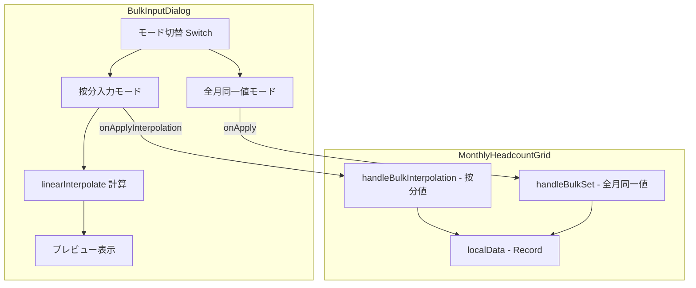
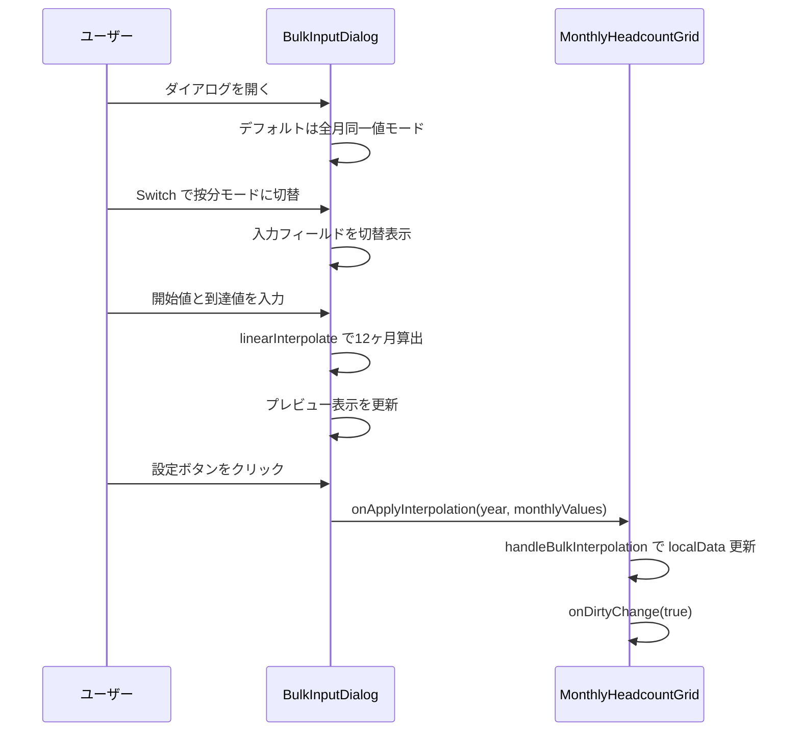

# Design Document

## Overview

**Purpose**: 人員計画の一括入力ダイアログ（BulkInputDialog）に按分入力モードを追加し、開始値と到達値の線形補間による12ヶ月分の人員数自動算出を提供する。

**Users**: 事業部リーダーが月次の人員増減計画を効率的に入力するために使用する。

**Impact**: 既存の BulkInputDialog コンポーネントを拡張し、MonthlyHeadcountGrid との連携インターフェースに新しいコールバックを追加する。

### Goals
- 開始値・到達値の指定による12ヶ月線形補間の自動算出
- 計算結果のリアルタイムプレビュー
- 既存の全月同一値モードとの完全な互換性維持

### Non-Goals
- 年度をまたいだ按分（24ヶ月以上）のサポート（Open Question Q1-3）
- バックエンドAPIの変更（フロントエンドのみの機能追加）
- 按分以外の補間方式（指数、S カーブ等）

## Architecture

### Existing Architecture Analysis

現在のデータフロー:
1. MonthlyHeadcountGrid が BulkInputDialog を管理
2. BulkInputDialog は `onApply(year, headcount)` で単一値を通知
3. MonthlyHeadcountGrid の `handleBulkSet` が全月に同一値を設定
4. `localData` 状態（`Record<string, number>`）を更新し、親コンポーネントに通知

変更方針:
- BulkInputDialog に按分モードのUIと計算ロジックを追加
- 新しいコールバック `onApplyInterpolation` で12ヶ月分の個別値を通知
- MonthlyHeadcountGrid に `handleBulkInterpolation` ハンドラを追加

### Architecture Pattern & Boundary Map



**Architecture Integration**:
- Selected pattern: 既存コンポーネント拡張（props 追加 + 内部状態管理）
- Domain boundaries: 計算ロジックは純粋関数として BulkInputDialog 内に配置
- Existing patterns preserved: `onApply` コールバック、`normalizeNumericInput` ヘルパー、`AlertDialog` パターン
- New components rationale: 新規コンポーネント不要、既存 BulkInputDialog の拡張のみ

### Technology Stack

| Layer | Choice / Version | Role in Feature | Notes |
|-------|------------------|-----------------|-------|
| Frontend | React 19 + shadcn/ui Switch | モード切替UI | 既存 Switch コンポーネント使用 |
| State | React useState | モード・入力値・プレビュー管理 | 外部状態管理不要 |

## System Flows



## Requirements Traceability

| Requirement | Summary | Components | Interfaces | Flows |
|-------------|---------|------------|------------|-------|
| 1.1 | モード切替トグル | BulkInputDialog | Switch + mode state | ダイアログ表示フロー |
| 1.2 | デフォルトモード | BulkInputDialog | useState 初期値 | ダイアログ表示フロー |
| 1.3 | 全月同一値の入力表示 | BulkInputDialog | 既存 UI | - |
| 1.4 | 按分入力の入力表示 | BulkInputDialog | startValue, endValue フィールド | - |
| 2.1 | 線形補間算出 | linearInterpolate | 純粋関数 | 按分計算フロー |
| 2.2 | 四捨五入整数化 | linearInterpolate | Math.round | - |
| 2.3 | 対象期間12ヶ月固定 | linearInterpolate | MONTH_COUNT=12 | - |
| 2.4 | 計算例の検証 | linearInterpolate | テストケース | - |
| 2.5 | 同一値ケース | linearInterpolate | startValue===endValue | - |
| 2.6 | 減員パターン | linearInterpolate | startValue > endValue | - |
| 3.1 | プレビュー表示 | BulkInputDialog | InterpolationPreview 表示領域 | プレビュー更新フロー |
| 3.2 | リアルタイム更新 | BulkInputDialog | useMemo による派生 | プレビュー更新フロー |
| 3.3 | 月ラベル付き表示 | BulkInputDialog | MONTH_LABELS 定数 | - |
| 4.1 | 0以上整数バリデーション | BulkInputDialog | normalizeNumericInput | - |
| 4.2 | 未入力時ボタン無効化 | BulkInputDialog | disabled 条件 | - |
| 4.3 | 既存バリデーション維持 | BulkInputDialog | モード分岐 | - |
| 5.1 | 既存モード不変 | BulkInputDialog | onApply 維持 | - |
| 5.2 | 全月同一値コールバック | BulkInputDialog, MonthlyHeadcountGrid | onApply(year, headcount) | 既存フロー |
| 5.3 | 按分コールバック | BulkInputDialog, MonthlyHeadcountGrid | onApplyInterpolation | 按分計算フロー |

## Components and Interfaces

| Component | Domain/Layer | Intent | Req Coverage | Key Dependencies | Contracts |
|-----------|--------------|--------|--------------|------------------|-----------|
| BulkInputDialog | UI | 一括入力ダイアログ（全月同一値 + 按分入力） | 1.1-1.4, 2.1-2.6, 3.1-3.3, 4.1-4.3, 5.1-5.3 | MonthlyHeadcountGrid (P0) | State |
| MonthlyHeadcountGrid | UI | 月次人員グリッド（按分ハンドラ追加） | 5.3 | BulkInputDialog (P0) | State |
| linearInterpolate | Logic | 線形補間の純粋関数 | 2.1-2.6 | なし | Service |

### UI Layer

#### BulkInputDialog（拡張）

| Field | Detail |
|-------|--------|
| Intent | 全月同一値モードと按分入力モードを持つ一括入力ダイアログ |
| Requirements | 1.1-1.4, 2.1-2.6, 3.1-3.3, 4.1-4.3, 5.1-5.3 |

**Responsibilities & Constraints**
- モード切替（Switch）による入力フィールドの動的切替
- 按分モード時の開始値・到達値の入力管理
- linearInterpolate による12ヶ月分の計算結果の算出とプレビュー表示
- 既存の全月同一値モードの動作を一切変更しない

**Dependencies**
- Inbound: MonthlyHeadcountGrid — ダイアログの開閉と年度情報 (P0)
- External: shadcn/ui Switch — モード切替UI (P1)
- External: normalizeNumericInput — 数値入力正規化 (P1)

**Contracts**: State [x]

##### State Management

```typescript
// 拡張後の Props
interface BulkInputDialogProps {
  open: boolean;
  onOpenChange: (open: boolean) => void;
  fiscalYear: number;
  fiscalYearOptions: number[];
  onApply: (year: number, headcount: number) => void;
  onApplyInterpolation: (year: number, monthlyValues: number[]) => void;
}

// 内部状態
type BulkInputMode = "uniform" | "interpolation";
// mode: BulkInputMode (default: "uniform")
// startValue: number (按分開始値)
// endValue: number (按分到達値)
```

**Implementation Notes**
- プレビューは `useMemo` で `startValue`, `endValue` から派生算出し、再レンダリングを最小化
- プレビューレイアウト: 6列×2行のグリッド（`grid grid-cols-6`）で MonthlyHeadcountGrid と同じ配置
- モード切替時に入力値をリセットせず保持（ユーザーの入力を失わない）
- 「設定」ボタンの disabled 条件: 按分モード時は startValue と endValue の両方が有効な場合のみ有効化

#### MonthlyHeadcountGrid（拡張）

| Field | Detail |
|-------|--------|
| Intent | BulkInputDialog の按分結果を受け取って localData に反映 |
| Requirements | 5.3 |

**Responsibilities & Constraints**
- 新しい `handleBulkInterpolation` コールバックで按分結果を `localData` に設定
- 既存の `handleBulkSet` は変更しない

**Contracts**: State [x]

##### State Management

```typescript
// 新規ハンドラ
const handleBulkInterpolation = useCallback(
  (year: number, monthlyValues: number[]) => {
    // MONTHS 配列とインデックスを対応させて localData を更新
    // monthlyValues[0] = 4月, monthlyValues[11] = 3月
  },
  [onDirtyChange]
);
```

### Logic Layer

#### linearInterpolate

| Field | Detail |
|-------|--------|
| Intent | 開始値と到達値から12ヶ月分の線形補間値を算出する純粋関数 |
| Requirements | 2.1-2.6 |

**Responsibilities & Constraints**
- 入力: startValue（4月）、endValue（3月）
- 出力: 12要素の number 配列（各月の人員数）
- 各値は `Math.round(startValue + (endValue - startValue) * i / 11)` で算出（i=0..11）
- 副作用なし、テスト可能な純粋関数

**Contracts**: Service [x]

##### Service Interface

```typescript
/**
 * 線形補間で12ヶ月分の値を算出する
 * @param startValue 開始月（4月）の値
 * @param endValue 到達月（3月）の値
 * @returns 12要素の配列 [4月, 5月, ..., 2月, 3月]
 */
function linearInterpolate(startValue: number, endValue: number): number[];
```

- Preconditions: startValue >= 0, endValue >= 0, 両方とも整数
- Postconditions: 戻り値は12要素の配列、各要素は0以上の整数、result[0] === startValue、result[11] === endValue
- Invariants: 配列長は常に12

## Data Models

### Domain Model

この機能はフロントエンドのみの変更であり、データモデルの変更はない。既存の `MonthlyHeadcountPlan`（yearMonth + headcount）のデータ構造をそのまま使用する。按分計算の結果は既存の `BulkMonthlyHeadcountInput` 形式で API に送信される。

## Error Handling

### Error Categories and Responses

**User Errors**:
- 非数値入力 → `normalizeNumericInput` で自動正規化（既存パターン踏襲）
- 負の値入力 → `Math.max(0, val)` で0にクランプ
- 未入力状態 → 「設定」ボタン disabled で送信を防止

## Testing Strategy

### Unit Tests
1. `linearInterpolate(10, 15)` → Issue #63 の計算例と一致すること
2. `linearInterpolate(15, 10)` → 減少方向の補間が正しいこと
3. `linearInterpolate(10, 10)` → 全月10で統一されること
4. `linearInterpolate(0, 0)` → 全月0であること
5. `linearInterpolate(0, 11)` → 各月が0, 1, 2, ..., 11 であること

### Component Tests (Storybook)
1. Default story: 全月同一値モードが表示されること
2. InterpolationMode story: 按分モードに切替後、入力フィールドが表示されること
3. WithPreview story: 開始値・到達値指定時にプレビューが表示されること
