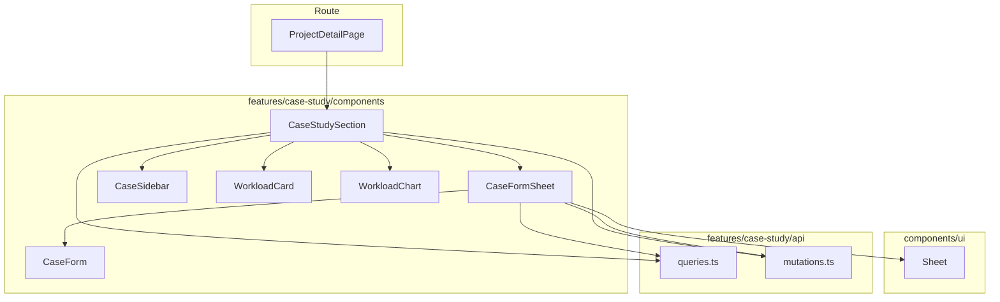

# 設計書: improve-case-study-ui

## Overview

**Purpose**: 案件詳細画面にケーススタディ機能を統合し、案件コンテキストを維持したまま、ケースの一覧・選択・工数確認・作成・編集・削除をシームレスに行える画面を提供する。

**Users**: 事業部リーダーおよびプロジェクトマネージャーが、案件情報を参照しながらケーススタディのシミュレーション操作を行う。

**Impact**: 独立していたケーススタディ画面（`/master/projects/$projectId/case-study/`）を案件詳細画面に統合し、3つのルートファイルを削除する。

### Goals

- 案件詳細画面内でケーススタディの全操作（一覧・選択・工数表示/編集・ケース作成/編集/削除）を完結させる
- 新規ケース作成時に案件情報（開始年月・期間月数・総工数）を初期値として自動設定する
- 不要になった独立ルートを削除し、コードベースを整理する

### Non-Goals

- バックエンド API の変更
- 案件詳細画面の基本情報カードのレイアウト変更
- CaseForm / CaseSidebar / WorkloadCard / WorkloadChart の内部実装変更
- 他画面（workload チャート画面等）への影響

## Architecture

### Existing Architecture Analysis

**現在の構成:**
- 案件詳細画面（`$projectId/index.tsx`）は案件基本情報の表示 + 「ケーススタディ」ボタンで別画面遷移
- ケーススタディ画面（`$projectId/case-study/index.tsx`）は CaseSidebar + WorkloadCard + WorkloadChart を統合した全画面レイアウト
- 新規作成画面（`case-study/new.tsx`）と編集画面（`case-study/$caseId/edit.tsx`）は独立ページとして CaseForm を表示
- features/case-study/components/ 配下にすべての再利用可能コンポーネントが配置済み

**維持するパターン:**
- feature-first 構成（features/case-study/ 内にコンポーネント・API・型を凝集）
- TanStack Query によるデータフェッチとキャッシュ管理
- Sheet コンポーネントによるフォーム表示（ProjectEditSheet, indirect-case-study/CaseFormSheet で確立済み）

### Architecture Pattern & Boundary Map



**Architecture Integration:**
- **選択パターン**: コンポーネント分離（ルートコンポーネントの100行ルール遵守）
- **責務境界**: CaseStudySection がケーススタディの全状態を管理、CaseFormSheet がフォーム表示を担当
- **維持するパターン**: Sheet パターン、feature-first 構成、TanStack Query キャッシュ管理
- **新規コンポーネント**: CaseStudySection（統合ビュー）、CaseFormSheet（Sheet フォーム）
- **steering 準拠**: features 間の依存排除、@ エイリアスインポート、100行前後のルートコンポーネント

### Technology Stack

| Layer | Choice / Version | Role | Notes |
|-------|------------------|------|-------|
| Frontend UI | React 19 + shadcn/ui Sheet | ケース作成・編集の Sheet 表示 | 既存コンポーネント使用 |
| Routing | TanStack Router | ルート整理（不要ルート削除） | routeTree.gen.ts 自動再生成 |
| Data | TanStack Query | ケースデータ・工数データのフェッチ・キャッシュ | 既存 queryOptions 使用 |
| Form | TanStack Form + Zod v3 | ケース作成・編集フォーム | 既存 CaseForm 使用 |

新規ライブラリの追加なし。

## Requirements Traceability

| Requirement | Summary | Components | Interfaces | Flows |
|-------------|---------|------------|------------|-------|
| 1.1 | 案件詳細画面にケーススタディセクション表示 | CaseStudySection, ProjectDetailPage | — | — |
| 1.2 | ケース一覧サイドバー表示 | CaseStudySection, CaseSidebar | CaseSidebarProps | — |
| 1.3 | ケース選択時の工数表示 | CaseStudySection, WorkloadCard, WorkloadChart | — | ケース選択フロー |
| 1.4 | 案件基本情報の常時表示 | ProjectDetailPage | — | — |
| 1.5 | ケーススタディボタン削除 | ProjectDetailPage | — | — |
| 2.1–2.3 | 新規作成時の初期値設定 | CaseFormSheet, CaseForm | CaseFormSheetProps | 新規作成フロー |
| 2.4 | 初期値の変更可能性 | CaseForm | CaseFormProps | — |
| 2.5 | 編集時は既存データ使用 | CaseFormSheet | CaseFormSheetProps | — |
| 3.1 | 新規作成を Sheet で表示 | CaseFormSheet | CaseFormSheetProps | 新規作成フロー |
| 3.2 | 編集を Sheet で表示 | CaseFormSheet | CaseFormSheetProps | 編集フロー |
| 3.3 | 完了後の Sheet 閉じ + 一覧更新 | CaseFormSheet, CaseStudySection | — | — |
| 3.4 | 削除確認ダイアログ | CaseStudySection, DeleteConfirmDialog | — | 削除フロー |
| 4.1 | 独立ルートファイル削除 | — | — | — |
| 4.2 | routeTree.gen.ts 更新 | — | — | — |
| 4.3–4.4 | TypeScript エラーなし + テスト通過 | — | — | — |
| 5.1–5.4 | 工数表示・編集・保存・エラー通知 | WorkloadCard, WorkloadChart | — | — |

## Components and Interfaces

| Component | Domain/Layer | Intent | Req Coverage | Key Dependencies | Contracts |
|-----------|-------------|--------|--------------|-----------------|-----------|
| ProjectDetailPage | Route | 案件詳細 + CaseStudySection 配置 | 1.1, 1.4, 1.5 | CaseStudySection (P0), projectQueryOptions (P0) | — |
| CaseStudySection | case-study/components | ケーススタディの統合ビュー | 1.1–1.3, 3.3, 3.4, 5.1–5.4 | CaseSidebar (P0), WorkloadCard (P0), WorkloadChart (P0), CaseFormSheet (P0) | State |
| CaseFormSheet | case-study/components | Sheet でケースフォームを表示 | 2.1–2.5, 3.1–3.3 | CaseForm (P0), Sheet (P0), projectCaseQueryOptions (P1) | Service, State |

### Route Layer

#### ProjectDetailPage（変更）

| Field | Detail |
|-------|--------|
| Intent | 案件基本情報の表示 + ケーススタディセクションの配置 |
| Requirements | 1.1, 1.4, 1.5 |

**Responsibilities & Constraints**
- 案件基本情報カードの表示（既存のまま）
- CaseStudySection の配置（カード下部に追加）
- 「ケーススタディ」ボタンの削除
- 100行前後に収まるレイアウト記述

**Dependencies**
- Inbound: TanStack Router — ルートパラメータ `projectId` (P0)
- Outbound: CaseStudySection — ケーススタディ統合ビュー (P0)
- Outbound: projectQueryOptions — 案件データ取得 (P0)

**Implementation Notes**
- ケーススタディボタン（`FlaskConical` アイコン + Link）を削除
- 詳細カードと DeleteConfirmDialog の間に `<CaseStudySection projectId={id} project={project} />` を配置
- CaseStudySection に `projectId` と `project` データを props で渡す

### case-study/components Layer

#### CaseStudySection（新規）

| Field | Detail |
|-------|--------|
| Intent | ケーススタディの全操作を統合する自己完結セクション |
| Requirements | 1.1–1.3, 3.3, 3.4, 5.1–5.4 |

**Responsibilities & Constraints**
- ケース選択状態（`selectedCaseId`）の管理
- チャートデータのリアルタイム反映状態管理
- CaseSidebar / WorkloadCard / WorkloadChart の配置とデータ接続
- CaseFormSheet の open/close 状態管理（新規作成・編集）
- ケース削除の確認ダイアログ制御

**Dependencies**
- Inbound: ProjectDetailPage — `projectId`, `project` (P0)
- Outbound: CaseSidebar — ケース一覧表示 (P0)
- Outbound: WorkloadCard — 工数テーブル表示 (P0)
- Outbound: WorkloadChart — チャート表示 (P0)
- Outbound: CaseFormSheet — ケース作成・編集 Sheet (P0)
- Outbound: DeleteConfirmDialog — 削除確認 (P1)
- External: projectCaseQueryOptions, projectLoadsQueryOptions — データ取得 (P0)
- External: useDeleteProjectCase — ケース削除 (P1)

**Contracts**: State [x]

##### State Management

```typescript
type CaseStudySectionState = {
  selectedCaseId: number | null
  chartData: Array<{ yearMonth: string; manhour: number }>
  formSheet: {
    open: boolean
    mode: 'create' | 'edit'
    editCaseId: number | null
  }
  caseToDelete: ProjectCase | null
}
```

- **selectedCaseId**: ケース選択時に更新。ケース削除時にリセット
- **chartData**: WorkloadCard の `onWorkloadsChange` コールバックで更新。ケース選択切り替え時にリセット
- **formSheet**: CaseSidebar の `onNewCase` / `onEditCase` コールバックで open + mode を設定。フォーム完了時に close
- **caseToDelete**: 削除対象のケース。確認ダイアログの制御に使用

##### Props Interface

```typescript
interface CaseStudySectionProps {
  projectId: number
  project: Project
}
```

**Implementation Notes**
- case-study/index.tsx から状態管理ロジック・クエリ・コールバックを移植
- CaseSidebar の `onNewCase` → `setFormSheet({ open: true, mode: 'create', editCaseId: null })`
- CaseSidebar の `onEditCase` → `setFormSheet({ open: true, mode: 'edit', editCaseId: caseId })`
- レイアウト: サイドバー（w-64）+ メインエリア（flex-1）の flex 構成を維持
- CaseFormSheet の `onSuccess` コールバックで formSheet を close し、QueryClient のキャッシュを自動無効化に委任

#### CaseFormSheet（新規）

| Field | Detail |
|-------|--------|
| Intent | Sheet 内でケース作成・編集フォームを表示する |
| Requirements | 2.1–2.5, 3.1–3.3 |

**Responsibilities & Constraints**
- Sheet の open/close 制御
- 作成モード: 案件情報から初期値を設定して CaseForm に渡す
- 編集モード: ケースデータを取得して CaseForm に渡す
- フォーム送信（create / update mutation の実行）
- 成功時のトースト通知 + Sheet クローズ
- エラー時のトースト通知

**Dependencies**
- Inbound: CaseStudySection — Sheet 状態 + 案件データ (P0)
- Outbound: CaseForm — フォーム表示 (P0)
- Outbound: Sheet UI — スライドパネル (P0)
- External: projectCaseQueryOptions — 編集時のケースデータ取得 (P1)
- External: useCreateProjectCase — ケース作成 (P0)
- External: useUpdateProjectCase — ケース更新 (P0)

**Contracts**: Service [x] / State [x]

##### Props Interface

```typescript
interface CaseFormSheetProps {
  open: boolean
  onOpenChange: (open: boolean) => void
  mode: 'create' | 'edit'
  projectId: number
  project: Project
  editCaseId: number | null
  onSuccess: () => void
}
```

##### Service Interface

```typescript
// 作成モード
// - CaseForm に defaultValues を渡す:
//   { startYearMonth: project.startYearMonth,
//     durationMonths: project.durationMonths,
//     totalManhour: project.totalManhour }
// - onSubmit で useCreateProjectCase.mutateAsync を実行

// 編集モード
// - useQuery(projectCaseQueryOptions(projectId, editCaseId)) でケースデータ取得
//   enabled: open && mode === 'edit' && editCaseId != null
// - CaseForm に既存ケースデータを defaultValues として渡す
// - onSubmit で useUpdateProjectCase.mutateAsync を実行
```

- **Preconditions**: `open === true` かつ `mode` に応じたデータが利用可能
- **Postconditions**: 成功時に `onSuccess()` + `onOpenChange(false)` を呼び出し
- **Invariants**: 編集モードでは案件情報による初期値上書きを行わない

**Implementation Notes**
- `ProjectEditSheet` の実装パターンを踏襲（`SheetContent side="right" className="w-full sm:max-w-lg overflow-y-auto"`）
- 作成時の defaultValues で `project.totalManhour` は `number` だが CaseForm の `totalManhour` は `number | null` → 型変換が必要
- エラーハンドリングは既存の case-study/new.tsx, $caseId/edit.tsx のパターンを踏襲（ApiError 分岐 + toast）
- CaseForm の `onCancel` は `() => onOpenChange(false)` に接続

## Error Handling

### Error Strategy

既存のケーススタディ画面のエラーハンドリングパターンをそのまま踏襲する。

### Error Categories and Responses

| カテゴリ | 状況 | 対応 |
|---------|------|------|
| 409 Conflict | ケース名重複（作成時）| toast.error '同一名称のケースが既に存在します' |
| 409 Conflict | 参照あり削除不可 | toast.error '他のデータから参照されているため削除できません' |
| 422 Validation | 入力エラー | toast.error '入力内容にエラーがあります' |
| 404 Not Found | ケース未発見（編集時） | toast.error 'ケースが見つかりません' |
| その他 | 作成/更新失敗 | toast.error '作成/更新に失敗しました' |

トースト通知は `duration: Infinity` で永続表示（既存パターン準拠）。

## Testing Strategy

### Unit Tests

- CaseStudySection: ケース選択時の状態更新（selectedCaseId, chartData リセット）
- CaseFormSheet: 作成モードで案件情報が defaultValues に含まれることの検証
- CaseFormSheet: 編集モードで既存ケースデータが defaultValues に使用されることの検証

### Integration Tests

- 案件詳細画面でケーススタディセクションが表示されることの確認
- Sheet を開いてフォーム送信 → 成功トースト + Sheet クローズの確認
- ケース削除 → 確認ダイアログ → 削除実行 → 一覧更新の確認

### E2E Tests（任意）

- 案件詳細画面 → 新規ケース作成 → 初期値確認 → 保存 → 一覧に表示される
- ケース選択 → 工数編集 → チャートリアルタイム更新
- ケース編集 → Sheet で編集 → 保存 → 一覧に反映
