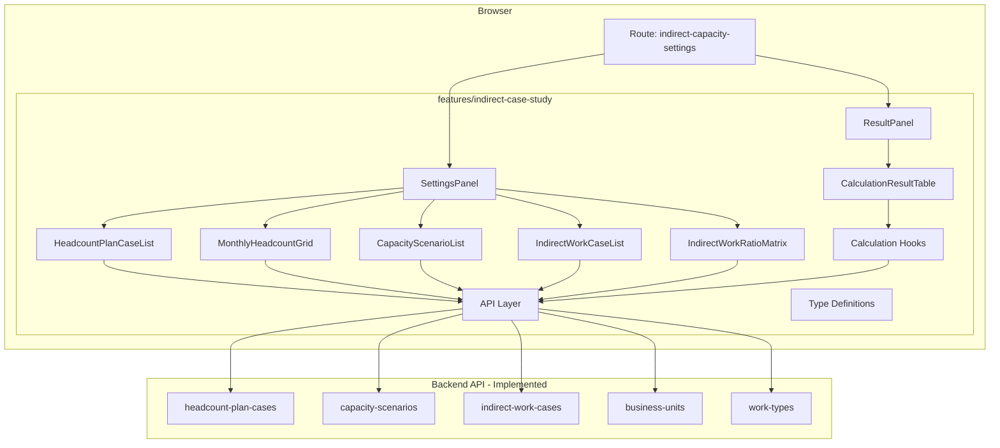
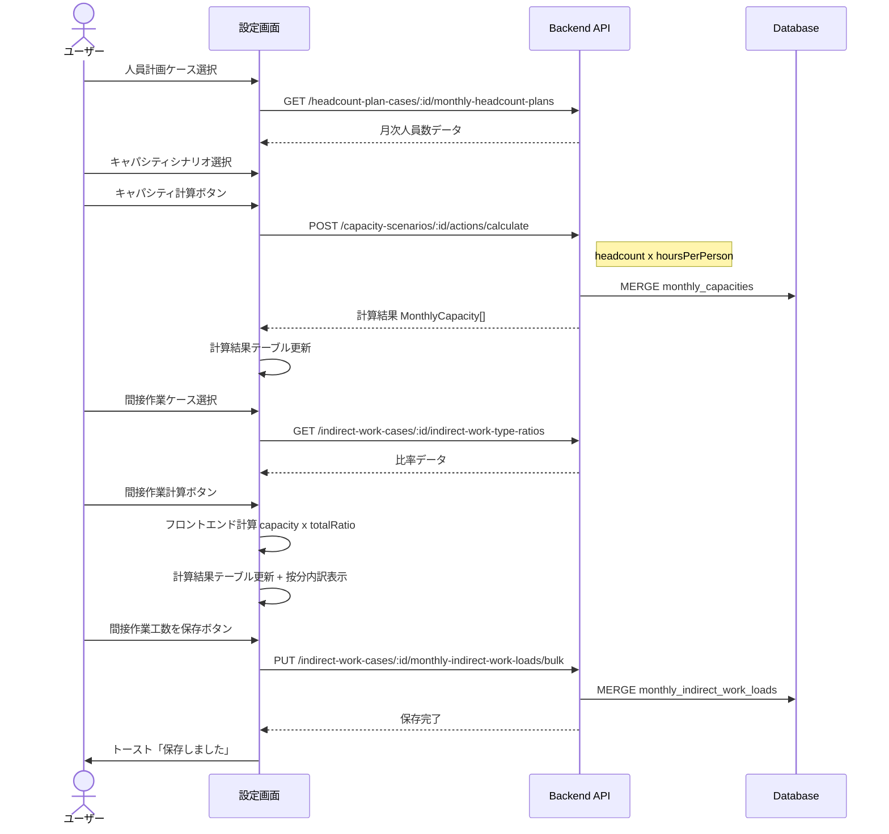
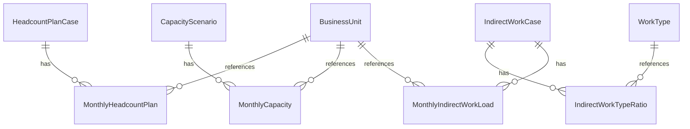

# Design Document: 間接作業・キャパシティ設定画面

## Overview

**Purpose**: ビジネスユニットごとのキャパシティ（生産能力）と間接作業工数を、複数ケース・シナリオで計算・比較・管理するための設定画面を提供する。

**Users**: 事業部リーダーが月次の人員過不足を確認し、間接作業の工数影響をシミュレーションする。

**Impact**: バックエンドAPI（9エンティティ分）は実装済み。本設計はフロントエンド画面の新規構築に焦点を当てる。

### Goals
- 人員計画ケース・キャパシティシナリオ・間接作業ケースのCRUD操作を1画面で提供
- キャパシティ計算（サーバーサイド）と間接工数計算（クライアントサイド）の実行・結果表示
- 計算結果のDB保存とExcelエクスポート
- 既存フロントエンドパターン（TanStack Router/Query/Form、shadcn/ui）との一貫性維持

### Non-Goals
- バックエンドAPIの新規作成・変更（全て実装済み）
- ダッシュボード（workload画面）との直接統合
- リアルタイム共同編集
- 複数BUの横断比較表示（単一BU選択のみ）

---

## Architecture

### Existing Architecture Analysis

既存フロントエンドは feature-first 構成で、各 feature が `types/`, `api/`, `components/`, `hooks/` を内包する。TanStack Router のファイルベースルーティング、TanStack Query の Query Key Factory パターン、TanStack Form + Zod バリデーションが確立済み。

本画面は既存マスタ管理画面（一覧→詳細→編集のCRUDフロー）とは異なり、2カラムの設定+結果レイアウトを持つ。workload 画面の複合レイアウトパターンを参考にしつつ、独自のUI構成を取る。

### Architecture Pattern & Boundary Map



**Architecture Integration**:
- **Selected pattern**: feature-first + ハイブリッド分割。1つの feature 内でエンティティ別にファイル分割
- **Domain boundaries**: `features/indirect-case-study/` が全責務を所有。workload feature とは独立
- **Existing patterns preserved**: Query Key Factory、useMutation + invalidation、TanStack Form + Zod、@エイリアスインポート
- **New components rationale**: 2カラムレイアウト、グリッド入力、マトリクス入力、折りたたみテーブルは既存に前例なし
- **Steering compliance**: features間依存禁止、`features/components/` 配下にフォルダ不作成、ルートコンポーネント100行前後

### Technology Stack

| Layer | Choice / Version | Role in Feature | Notes |
|-------|------------------|-----------------|-------|
| Frontend Framework | React 19 + Vite 7 | SPA ランタイム | 既存 |
| Routing | TanStack Router | ファイルベースルーティング、search params管理 | 既存 |
| Data Fetching | TanStack Query | APIデータ取得・キャッシュ・mutation | 既存 |
| Forms | TanStack Form + Zod v3 | ケース編集フォームのバリデーション | 既存 |
| UI Components | shadcn/ui + Radix UI | Button, Input, Sheet, Select, Switch, Badge 等 | 既存 |
| Styling | Tailwind CSS v4 | レスポンシブレイアウト、ユーティリティ CSS | 既存 |
| Toast | sonner | 操作フィードバック通知 | 既存 |
| Excel Export | xlsx (SheetJS) | クライアントサイドExcelファイル生成 | **新規依存**。動的インポート |

---

## System Flows

### キャパシティ計算 → 間接工数計算 → 保存フロー



**Key Decisions**:
- キャパシティ計算はサーバーサイド（APIアクション）で、計算時にDB自動保存（MERGE）される。そのため「計算結果を保存」での再保存は不要
- 「間接作業工数を保存」ボタンは間接工数のみを bulk PUT で保存する
- 間接工数計算はフロントエンドで実行し、保存は明示的なユーザーアクション（自動保存しない）

---

## Requirements Traceability

| Requirement | Summary | Components | Interfaces | Flows |
|-------------|---------|------------|------------|-------|
| 1.1-1.6 | BU選択 | Route, BusinessUnitSelect | search params | - |
| 2.1-2.9 | 人員計画ケースCRUD | HeadcountPlanCaseList, CaseFormSheet | headcount-plan-client, mutations | - |
| 3.1-3.8 | 月次人員数入力 | MonthlyHeadcountGrid, BulkInputDialog | headcount-plan-client, mutations | - |
| 4.1-4.8 | キャパシティシナリオCRUD | CapacityScenarioList, ScenarioFormSheet | capacity-scenario-client, mutations | - |
| 5.1-5.6 | キャパシティ計算 | SettingsPanel | capacity-scenario-client | 計算フロー |
| 6.1-6.6 | 間接作業ケースCRUD | IndirectWorkCaseList, CaseFormSheet | indirect-work-client, mutations | - |
| 7.1-7.6 | 間接作業比率入力 | IndirectWorkRatioMatrix | indirect-work-client, mutations | - |
| 8.1-8.5 | 間接工数計算 | ResultPanel, useIndirectWorkCalculation | - | 計算フロー |
| 9.1-9.8 | 計算結果表示 | CalculationResultTable | useIndirectWorkCalculation | - |
| 10.1-10.5 | 間接作業工数保存 | ResultPanel | mutations | 保存フロー。キャパシティは計算API実行時にDB自動保存されるため、ここでは間接工数のみ保存 |
| 11.1-11.3 | レスポンシブ | Route layout | Tailwind CSS | - |
| 12.1-12.5 | 未保存警告 | useUnsavedChanges, UnsavedChangesDialog | useBlocker | - |
| 13.1-13.3 | Excelエクスポート | useExcelExport | xlsx (dynamic import) | - |
| 14.1-14.6 | 操作フィードバック | 各mutation hook | sonner toast | - |

---

## Components and Interfaces

### Summary

| Component | Domain | Intent | Req Coverage | Key Dependencies | Contracts |
|-----------|--------|--------|--------------|------------------|-----------|
| Route (index.tsx) | Routing | 2カラムレイアウト + BU選択 + search params | 1, 11 | TanStack Router (P0) | State |
| SettingsPanel | UI Container | 左カラム: ケース管理 + 入力 + 計算ボタン | 2-8 | 子コンポーネント群 (P0) | - |
| ResultPanel | UI Container | 右カラム: 計算結果表示 + 間接工数保存 + エクスポート | 9, 10, 13 | useIndirectWorkCalculation (P0) | - |
| HeadcountPlanCaseList | UI | 人員計画ケース一覧 + 選択 | 2 | queries (P0) | - |
| CaseFormSheet | UI | ケース作成・編集オーバーレイ（汎用） | 2, 4, 6 | TanStack Form (P0), Sheet (P1) | Service |
| MonthlyHeadcountGrid | UI + Logic | 月次人員数12ヶ月グリッド入力 | 3 | queries, mutations (P0) | State |
| BulkInputDialog | UI | 一括入力ダイアログ | 3.5-3.6 | AlertDialog (P1) | - |
| CapacityScenarioList | UI | キャパシティシナリオ一覧 + 選択 | 4 | queries (P0) | - |
| ScenarioFormSheet | UI | シナリオ編集オーバーレイ | 4 | TanStack Form (P0), Sheet (P1) | Service |
| IndirectWorkCaseList | UI | 間接作業ケース一覧 + 選択 | 6 | queries (P0) | - |
| IndirectWorkRatioMatrix | UI + Logic | 年度×種類の比率マトリクス入力 | 7 | queries, mutations (P0) | State |
| CalculationResultTable | UI | 計算結果テーブル（折りたたみ行付き） | 9 | 計算hooks (P0) | - |
| UnsavedChangesDialog | UI | 未保存警告ダイアログ | 12 | useBlocker (P0) | - |
| useIndirectCaseStudyPage | Hook | ページ全体の状態管理（選択・計算結果・dirty統合） | 1-12 | 子hooks群 (P0) | State |
| useCapacityCalculation | Hook | キャパシティ計算API呼び出し | 5 | capacity-scenario-client (P0) | Service |
| useIndirectWorkCalculation | Hook | 間接工数のフロントエンド計算 | 8, 9 | - | Service |
| useUnsavedChanges | Hook | 未保存変更検知 + 遷移ガード | 12 | TanStack Router useBlocker (P0) | State |
| useExcelExport | Hook | Excel出力 | 13 | xlsx dynamic import (P1) | Service |
| API Layer | Data | 7エンティティのfetch関数群 | All | fetch, handleResponse (P0) | API |
| Query Layer | Data | Query Key Factory + queryOptions | All | TanStack Query (P0) | - |
| Mutation Layer | Data | useMutation hooks | 2-7, 10 | TanStack Query (P0) | - |

---

### Routing Layer

#### Route: /master/indirect-capacity-settings/index.tsx

| Field | Detail |
|-------|--------|
| Intent | 画面全体のレイアウト、BU選択、search params管理 |
| Requirements | 1.1-1.6, 11.1-11.3, 12.1-12.5 |

**Responsibilities & Constraints**
- 2カラムレスポンシブレイアウトの管理（100行前後に収める）
- BU選択状態をURL search paramsで管理
- 全状態管理は `useIndirectCaseStudyPage` フックに委譲

**Contracts**: State [x]

##### State Management

```typescript
// Search params schema
interface IndirectCapacitySearchParams {
  bu: string          // 選択中のBUコード
}
```

ルートコンポーネントはレイアウトのみに責務を限定し、全ページ状態を `useIndirectCaseStudyPage` に抽出する。

**Implementation Notes**
- `validateSearch` に Zod スキーマを使用（`.catch()` でデフォルト値設定）
- レスポンシブ: `grid grid-cols-1 lg:grid-cols-2` + ブレークポイント制御
- BU変更時は `useIndirectCaseStudyPage` 内で全ローカルstateをリセット

---

### UI Containers

#### SettingsPanel

| Field | Detail |
|-------|--------|
| Intent | 左カラムのケース管理・入力・計算ボタンを統括 |
| Requirements | 2-8 |

**Responsibilities & Constraints**
- キャパシティ設定セクションと間接作業設定セクションの表示
- 各子コンポーネントへの選択状態・コールバック伝達
- 計算ボタンの活性/非活性制御

**Implementation Notes**
- スクロール可能なパネル（`overflow-y-auto`）
- セクション区切りに `Separator` コンポーネント使用

#### ResultPanel

| Field | Detail |
|-------|--------|
| Intent | 右カラムの計算結果表示・間接工数保存・エクスポートを統括 |
| Requirements | 9, 10, 13 |

**Responsibilities & Constraints**
- 計算結果データの受け取りと表示委譲
- 間接作業工数の保存アクション管理（キャパシティは計算API実行時にDB自動保存済みのため保存対象外）
- エクスポートアクションの管理
- 選択中条件のサマリー表示

**Implementation Notes**
- 計算結果がない場合は空状態メッセージを表示
- 「間接作業工数を保存」ボタンは `isPending` 中にスピナー表示
- ボタンラベルは「計算結果を保存」ではなく「間接作業工数を保存」とし、保存対象を明確化

---

### CRUD Components

#### CaseFormSheet（汎用ケース編集オーバーレイ）

| Field | Detail |
|-------|--------|
| Intent | 人員計画ケース・間接作業ケースの作成/編集フォーム |
| Requirements | 2.2, 2.4, 2.7, 2.8, 6.2, 6.4 |

**Contracts**: Service [x]

##### Service Interface

```typescript
interface CaseFormSheetProps {
  open: boolean
  onOpenChange: (open: boolean) => void
  mode: 'create' | 'edit'
  caseType: 'headcountPlan' | 'indirectWork'
  defaultValues?: CaseFormValues
  onSubmit: (values: CaseFormValues) => Promise<void>
  isSubmitting: boolean
}

interface CaseFormValues {
  caseName: string        // 1-100文字、必須
  description: string     // 0-500文字、任意
  isPrimary: boolean
}
```

**Implementation Notes**
- shadcn/ui `Sheet` コンポーネントで右側スライドイン
- TanStack Form + Zod バリデーション
- `caseType` による微小なラベル差分のみ（フォーム構造は共通）

#### ScenarioFormSheet

| Field | Detail |
|-------|--------|
| Intent | キャパシティシナリオの作成/編集フォーム |
| Requirements | 4.2, 4.4, 4.7, 4.8 |

**Contracts**: Service [x]

##### Service Interface

```typescript
interface ScenarioFormSheetProps {
  open: boolean
  onOpenChange: (open: boolean) => void
  mode: 'create' | 'edit'
  defaultValues?: ScenarioFormValues
  onSubmit: (values: ScenarioFormValues) => Promise<void>
  isSubmitting: boolean
}

interface ScenarioFormValues {
  scenarioName: string       // 1-100文字、必須
  description: string        // 0-500文字、任意
  hoursPerPerson: number     // 0超〜744以下、デフォルト160.00
  isPrimary: boolean
}
```

#### HeadcountPlanCaseList / CapacityScenarioList / IndirectWorkCaseList

Summary-only components。ラジオボタン選択 + [編集][削除][復元] ボタンのリスト表示。既存の `DataTableToolbar` パターンを簡略化したリスト形式。

**共通Props**:
```typescript
interface CaseListProps<T> {
  items: T[]
  selectedId: number | null
  onSelect: (id: number) => void
  onEdit: (item: T) => void
  onDelete: (id: number) => void
  onRestore: (id: number) => void
  onCreate: () => void
  isLoading: boolean
  includeDisabled: boolean
  onIncludeDisabledChange: (value: boolean) => void
}
```

---

### Input Components

#### MonthlyHeadcountGrid

| Field | Detail |
|-------|--------|
| Intent | 年度ごとの12ヶ月人員数入力グリッド |
| Requirements | 3.1-3.4, 3.8 |

**Responsibilities & Constraints**
- 12ヶ月（4月〜翌3月）のグリッド表示
- 年度ドロップダウンによるページング
- 各セルは数値入力（0以上の整数）
- 変更はローカルstateに保持、保存ボタンで一括送信

**Contracts**: State [x]

##### State Management

```typescript
interface MonthlyHeadcountGridProps {
  headcountPlanCaseId: number
  businessUnitCode: string
  fiscalYear: number
  onFiscalYearChange: (year: number) => void
  onDirtyChange: (isDirty: boolean) => void
}

// Internal state: Map<yearMonth, headcount>
type HeadcountMap = Record<string, number>
```

**Implementation Notes**
- `2 x 6` グリッドレイアウト（上半期6ヶ月 + 下半期6ヶ月）
- `Input type="number" min={0} step={1}` で整数制約
- デバウンスなしの即時反映（ローカルstate）
- 年度切替時にAPIから該当年度データを取得

#### BulkInputDialog

| Field | Detail |
|-------|--------|
| Intent | 月次人員数の一括入力ダイアログ |
| Requirements | 3.5, 3.6 |

Summary-only component。`AlertDialog` で年度選択 + 人数入力 → 全月に同一値設定。

#### IndirectWorkRatioMatrix

| Field | Detail |
|-------|--------|
| Intent | 年度×作業種類の2次元比率入力マトリクス |
| Requirements | 7.1-7.6 |

**Responsibilities & Constraints**
- 行: 作業種類（`GET /work-types` から取得）
- 列: 年度（複数年度を横並び表示）
- セル: 比率入力（UI上は0-100%、API送信時に0-1変換）
- 合計行の自動計算表示

**Contracts**: State [x]

##### State Management

```typescript
interface IndirectWorkRatioMatrixProps {
  indirectWorkCaseId: number
  onDirtyChange: (isDirty: boolean) => void
}

// Internal state: Map<`${fiscalYear}-${workTypeCode}`, ratio>
type RatioMap = Record<string, number>
```

**Implementation Notes**
- 作業種類行 × 年度列のテーブル形式
- 合計行は `reduce` で年度ごとの比率合計を算出
- 比率は表示時に `× 100` → `%` 表示、保存時に `÷ 100` → 0-1 変換

---

### Calculation Components

#### CalculationResultTable

| Field | Detail |
|-------|--------|
| Intent | キャパシティ・間接工数の月次計算結果を表形式で表示 |
| Requirements | 9.1-9.8 |

**Responsibilities & Constraints**
- 行構成: 人員数、キャパシティ、間接内訳（折りたたみ）、間接合計、直接作業可能時間
- 列: 12ヶ月（4月〜翌3月）+ 年間合計
- 間接内訳は作業種類ごとの按分計算（フロントエンド算出、DB非保存）
- 年度切替ドロップダウン

**Implementation Notes**
- HTML `<table>` ベース（TanStack Table は不要、固定構造のため）
- 折りたたみ: ローカルstate `isBreakdownExpanded`
- 按分計算: `capacity × ratio[year][workType]`
- 直接作業可能時間: `capacity - indirectTotal`
- 年間合計: 各行の12ヶ月値を `reduce` で合算

---

### Hooks

#### useIndirectCaseStudyPage

| Field | Detail |
|-------|--------|
| Intent | ページ全体の状態管理を一元化し、ルートコンポーネントを100行前後に保つ |
| Requirements | 1-12（横断） |

**Contracts**: State [x]

##### State Management

```typescript
interface UseIndirectCaseStudyPageParams {
  businessUnitCode: string
}

interface UseIndirectCaseStudyPageReturn {
  // 選択状態
  selectedHeadcountPlanCaseId: number | null
  setSelectedHeadcountPlanCaseId: (id: number | null) => void
  selectedCapacityScenarioId: number | null
  setSelectedCapacityScenarioId: (id: number | null) => void
  selectedIndirectWorkCaseId: number | null
  setSelectedIndirectWorkCaseId: (id: number | null) => void

  // 計算結果
  capacityResult: CalculateCapacityResult | null
  indirectWorkResult: IndirectWorkCalcResult | null

  // 年度
  settingsFiscalYear: number
  setSettingsFiscalYear: (year: number) => void
  resultFiscalYear: number
  setResultFiscalYear: (year: number) => void

  // 計算アクション
  calculateCapacity: () => Promise<void>
  calculateIndirectWork: () => void
  isCalculatingCapacity: boolean

  // 保存アクション
  saveIndirectWorkLoads: () => Promise<void>
  isSavingResults: boolean

  // dirty統合
  isDirty: boolean
  headcountDirty: boolean
  setHeadcountDirty: (dirty: boolean) => void
  ratioDirty: boolean
  setRatioDirty: (dirty: boolean) => void
  indirectWorkResultDirty: boolean
}
```

**Responsibilities & Constraints**
- 全ページ状態（選択、計算結果、年度、dirty）を一元管理
- BU変更時に全stateをリセット
- `isDirty` は `headcountDirty || ratioDirty || indirectWorkResultDirty` のOR結合で算出
- 内部で `useCapacityCalculation`、`useIndirectWorkCalculation` を利用

**Implementation Notes**
- ルートコンポーネントは本hookの戻り値を SettingsPanel / ResultPanel に伝達するだけ
- `indirectWorkResultDirty` は間接工数計算実行後に `true`、保存完了後に `false`
- キャパシティ計算結果はAPIが自動保存するため dirty 追跡不要

---

#### useCapacityCalculation

| Field | Detail |
|-------|--------|
| Intent | キャパシティ計算APIの呼び出しと結果管理 |
| Requirements | 5.1-5.6 |

**Contracts**: Service [x]

##### Service Interface

```typescript
interface UseCapacityCalculationReturn {
  calculate: (params: CalculateCapacityParams) => Promise<CalculateCapacityResult>
  isCalculating: boolean
  result: CalculateCapacityResult | null
  error: ApiError | null
}

interface CalculateCapacityParams {
  capacityScenarioId: number
  headcountPlanCaseId: number
  businessUnitCodes?: string[]
  yearMonthFrom?: string
  yearMonthTo?: string
}

interface CalculateCapacityResult {
  calculated: number
  hoursPerPerson: number
  items: MonthlyCapacity[]
}
```

#### useIndirectWorkCalculation

| Field | Detail |
|-------|--------|
| Intent | 間接工数のフロントエンド計算ロジック |
| Requirements | 8.1-8.5, 9.4, 9.5 |

**Contracts**: Service [x]

##### Service Interface

```typescript
interface UseIndirectWorkCalculationReturn {
  calculate: (params: IndirectWorkCalcParams) => IndirectWorkCalcResult
  result: IndirectWorkCalcResult | null
}

interface IndirectWorkCalcParams {
  capacities: MonthlyCapacity[]
  ratios: IndirectWorkTypeRatio[]
}

interface IndirectWorkCalcResult {
  monthlyLoads: MonthlyIndirectWorkLoadInput[]   // 月次合計工数
  breakdown: MonthlyBreakdown[]                   // 月次×種類別按分
}

interface MonthlyIndirectWorkLoadInput {
  businessUnitCode: string
  yearMonth: string
  manhour: number
  source: 'calculated'
}

interface MonthlyBreakdown {
  yearMonth: string
  businessUnitCode: string
  items: Array<{ workTypeCode: string; manhour: number }>
  total: number
}
```

**Implementation Notes**
- 年度判定: `month >= 4 ? year : year - 1`
- 合計比率: `ratios.filter(r => r.fiscalYear === fy).reduce((sum, r) => sum + r.ratio, 0)`
- 按分: `Math.round(capacity × ratio)` で整数丸め
- 直接作業可能時間は本hookの責務外（CalculationResultTable で算出）

#### useUnsavedChanges

| Field | Detail |
|-------|--------|
| Intent | 未保存変更の検知と遷移ガード |
| Requirements | 12.1-12.5 |

**Contracts**: State [x]

##### State Management

```typescript
interface UseUnsavedChangesParams {
  isDirty: boolean
  onSave?: () => Promise<void>
}

interface UseUnsavedChangesReturn {
  showDialog: boolean
  handleConfirmLeave: () => void
  handleCancelLeave: () => void
  handleSaveAndLeave: () => Promise<void>
}
```

**isDirty 統合方式**:

本画面には3つの独立した編集対象があり、`useIndirectCaseStudyPage` で以下のようにOR結合する:

```typescript
// useIndirectCaseStudyPage 内での統合
const isDirty = headcountDirty || ratioDirty || indirectWorkResultDirty
```

| dirty フラグ | 対象 | true になるタイミング | false になるタイミング |
|-------------|------|---------------------|----------------------|
| `headcountDirty` | 月次人員数 | グリッド入力で値変更時 | 「人員計画を保存」成功時 |
| `ratioDirty` | 間接作業比率 | マトリクス入力で値変更時 | 「間接作業設定を保存」成功時 |
| `indirectWorkResultDirty` | 間接工数計算結果 | 間接作業計算実行時 | 「間接作業工数を保存」成功時 |

キャパシティ計算結果は計算API実行時にDB自動保存されるため、dirty追跡の対象外。

`isDirty` が `true` の状態で BU切替・ケース切替・画面遷移・ブラウザ閉じを試みた場合に、未保存警告ダイアログを表示する。

**Implementation Notes**
- TanStack Router の `useBlocker({ condition: isDirty })` で SPA 内遷移をブロック
- `window.addEventListener('beforeunload', handler)` でブラウザ閉じを検知
- ダイアログは3ボタン: キャンセル / 保存せず移動 / 保存
- 「保存」ボタン押下時は、`isDirty` が `true` な全対象を順次保存する

#### useExcelExport

| Field | Detail |
|-------|--------|
| Intent | 計算結果のExcelファイル生成・ダウンロード |
| Requirements | 13.1-13.3 |

**Contracts**: Service [x]

##### Service Interface

```typescript
interface UseExcelExportReturn {
  exportToExcel: (params: ExcelExportParams) => Promise<void>
  isExporting: boolean
}

interface ExcelExportParams {
  headcountPlanCaseName: string
  scenarioName: string
  indirectWorkCaseName: string
  fiscalYear: number
  tableData: CalculationTableData
}
```

**Implementation Notes**
- `xlsx` パッケージを動的インポート: `const XLSX = await import('xlsx')`
- `XLSX.utils.aoa_to_sheet()` でテーブルデータをシート化
- `XLSX.writeFileXLSX()` でXLSXダウンロード（バンドルサイズ最適化）

---

### API Layer

#### Type Definitions（エンティティ別ファイル分割）

```
types/
├── headcount-plan.ts     # HeadcountPlanCase, MonthlyHeadcountPlan, schemas
├── capacity-scenario.ts  # CapacityScenario, MonthlyCapacity, CalculateCapacityResult, schemas
├── indirect-work.ts      # IndirectWorkCase, IndirectWorkTypeRatio, MonthlyIndirectWorkLoad, schemas
├── calculation.ts        # フロントエンド計算関連の型
├── common.ts             # 共通型 re-export (PaginatedResponse, SingleResponse等)
└── index.ts              # 全エクスポート
```

**Key Type Definitions**:

```typescript
// headcount-plan.ts
interface HeadcountPlanCase {
  headcountPlanCaseId: number
  caseName: string
  description: string | null
  businessUnitCode: string | null
  businessUnitName: string | null
  isPrimary: boolean
  createdAt: string
  updatedAt: string
  deletedAt: string | null
}

interface MonthlyHeadcountPlan {
  monthlyHeadcountPlanId: number
  headcountPlanCaseId: number
  businessUnitCode: string
  yearMonth: string
  headcount: number
  createdAt: string
  updatedAt: string
}

// capacity-scenario.ts
interface CapacityScenario {
  capacityScenarioId: number
  scenarioName: string
  isPrimary: boolean
  description: string | null
  hoursPerPerson: number
  createdAt: string
  updatedAt: string
  deletedAt: string | null
}

interface MonthlyCapacity {
  monthlyCapacityId: number
  capacityScenarioId: number
  businessUnitCode: string
  yearMonth: string
  capacity: number
  createdAt: string
  updatedAt: string
}

// indirect-work.ts
interface IndirectWorkCase {
  indirectWorkCaseId: number
  caseName: string
  isPrimary: boolean
  description: string | null
  businessUnitCode: string
  businessUnitName: string | null
  createdAt: string
  updatedAt: string
  deletedAt: string | null
}

interface IndirectWorkTypeRatio {
  indirectWorkTypeRatioId: number
  indirectWorkCaseId: number
  workTypeCode: string
  fiscalYear: number
  ratio: number
  createdAt: string
  updatedAt: string
}

interface MonthlyIndirectWorkLoad {
  monthlyIndirectWorkLoadId: number
  indirectWorkCaseId: number
  businessUnitCode: string
  yearMonth: string
  manhour: number
  source: 'calculated' | 'manual'
  createdAt: string
  updatedAt: string
}
```

#### API Client（エンティティ別ファイル分割）

```
api/
├── headcount-plan-client.ts   # fetchHeadcountPlanCases, CRUD, bulk
├── capacity-scenario-client.ts # fetchCapacityScenarios, CRUD, calculate, bulk
├── indirect-work-client.ts    # fetchIndirectWorkCases, CRUD, ratios, loads, bulk
├── queries.ts                 # 全 Query Key Factory + queryOptions
└── mutations.ts               # 全 useMutation hooks
```

**API Contract（代表例）**:

| Method | Endpoint | Request | Response | Errors |
|--------|----------|---------|----------|--------|
| GET | /headcount-plan-cases | ListParams + filter[businessUnitCode] | PaginatedResponse | - |
| POST | /headcount-plan-cases | CaseFormValues + businessUnitCode | SingleResponse | 422 |
| PUT | /headcount-plan-cases/:id | CaseFormValues | SingleResponse | 404, 422 |
| DELETE | /headcount-plan-cases/:id | - | 204 | 404, 409 |
| POST | /headcount-plan-cases/:id/actions/restore | - | SingleResponse | 404 |
| PUT | /headcount-plan-cases/:id/monthly-headcount-plans/bulk | BulkItems | { data: items[] } | 404, 422 |
| POST | /capacity-scenarios/:id/actions/calculate | CalculateCapacityParams | { data: CalculateCapacityResult } | 404, 422 |

#### Query Key Factory

```typescript
const indirectCaseStudyKeys = {
  all: ['indirect-case-study'] as const

  // Headcount Plan Cases
  headcountPlanCases: () => [...indirectCaseStudyKeys.all, 'headcount-plan-cases'] as const
  headcountPlanCaseList: (params: ListParams) =>
    [...indirectCaseStudyKeys.headcountPlanCases(), 'list', params] as const
  headcountPlanCaseDetail: (id: number) =>
    [...indirectCaseStudyKeys.headcountPlanCases(), 'detail', id] as const
  monthlyHeadcountPlans: (caseId: number, bu: string) =>
    [...indirectCaseStudyKeys.headcountPlanCases(), caseId, 'monthly', bu] as const

  // Capacity Scenarios
  capacityScenarios: () => [...indirectCaseStudyKeys.all, 'capacity-scenarios'] as const
  capacityScenarioList: (params: ListParams) =>
    [...indirectCaseStudyKeys.capacityScenarios(), 'list', params] as const
  monthlyCapacities: (scenarioId: number) =>
    [...indirectCaseStudyKeys.capacityScenarios(), scenarioId, 'monthly'] as const

  // Indirect Work Cases
  indirectWorkCases: () => [...indirectCaseStudyKeys.all, 'indirect-work-cases'] as const
  indirectWorkCaseList: (params: ListParams) =>
    [...indirectCaseStudyKeys.indirectWorkCases(), 'list', params] as const
  indirectWorkTypeRatios: (caseId: number) =>
    [...indirectCaseStudyKeys.indirectWorkCases(), caseId, 'ratios'] as const
  monthlyIndirectWorkLoads: (caseId: number) =>
    [...indirectCaseStudyKeys.indirectWorkCases(), caseId, 'monthly-loads'] as const

  // Master data
  businessUnits: () => ['business-units'] as const
  workTypes: () => ['work-types'] as const
}
```

---

## Data Models

### Domain Model

バックエンドで実装済みのデータモデルをそのまま利用。フロントエンド固有のデータモデル変更はない。



**Business Rules**:
- キャパシティ = 人員数 × hoursPerPerson（サーバーサイド計算）
- 間接工数 = キャパシティ × Σ(年度別比率)（フロントエンド計算）
- 年度判定: 4月〜翌3月（month >= 4 → year, month < 4 → year - 1）
- 間接内訳の按分はDB非保存（表示用のみ）
- 直接作業可能時間 = キャパシティ − 間接工数合計（DB非保存）

### Data Contracts

フロントエンドが扱うAPIレスポンス・リクエストの形式は、バックエンドで定義済みのZodスキーマに準拠する。フロントエンド側のZodスキーマはフォーム入力バリデーション用に別途定義する（バックエンドスキーマのサブセット）。

---

## Error Handling

### Error Strategy

既存パターンに準拠。`ApiError` クラスの `problemDetails.status` でエラー種別を判定し、sonner トーストで通知。

### Error Categories and Responses

**User Errors (4xx)**:
- 404 Not Found → 「対象が見つかりません」トースト
- 409 Conflict → 「参照されているため削除できません」トースト
- 422 Validation → フィールドレベルのバリデーションエラー表示 + トースト

**System Errors (5xx)**:
- 500 Internal → 「サーバーエラーが発生しました」トースト

**Business Logic Errors**:
- キャパシティ未計算で間接工数計算を試行 → ボタン非活性で防止
- ケース未選択で計算を試行 → ボタン非活性で防止

---

## Testing Strategy

### Unit Tests
- `useIndirectWorkCalculation`: 年度判定ロジック、比率合計計算、按分計算の正確性
- `useCapacityCalculation`: APIレスポンスの変換、エラーハンドリング
- Zodバリデーションスキーマ: 各フィールドの境界値テスト

### Integration Tests
- ケースCRUDフロー: 作成→一覧表示→編集→削除→復元
- 計算フロー: キャパシティ計算→間接工数計算→結果表示→保存
- BU切替: データのリロードとstate リセット

### E2E Tests
- 全計算フロー: BU選択→ケース作成→人員数入力→シナリオ選択→計算→保存
- 未保存警告: 変更後の画面遷移ブロック
- Excelエクスポート: ファイルダウンロードの検証

---

## File Structure

```
apps/frontend/src/
├── features/indirect-case-study/
│   ├── index.ts
│   ├── types/
│   │   ├── headcount-plan.ts
│   │   ├── capacity-scenario.ts
│   │   ├── indirect-work.ts
│   │   ├── calculation.ts
│   │   ├── common.ts
│   │   └── index.ts
│   ├── api/
│   │   ├── headcount-plan-client.ts
│   │   ├── capacity-scenario-client.ts
│   │   ├── indirect-work-client.ts
│   │   ├── queries.ts
│   │   └── mutations.ts
│   ├── components/
│   │   ├── SettingsPanel.tsx
│   │   ├── ResultPanel.tsx
│   │   ├── HeadcountPlanCaseList.tsx
│   │   ├── CapacityScenarioList.tsx
│   │   ├── IndirectWorkCaseList.tsx
│   │   ├── CaseFormSheet.tsx
│   │   ├── ScenarioFormSheet.tsx
│   │   ├── MonthlyHeadcountGrid.tsx
│   │   ├── BulkInputDialog.tsx
│   │   ├── IndirectWorkRatioMatrix.tsx
│   │   ├── CalculationResultTable.tsx
│   │   └── UnsavedChangesDialog.tsx
│   └── hooks/
│       ├── useIndirectCaseStudyPage.ts
│       ├── useCapacityCalculation.ts
│       ├── useIndirectWorkCalculation.ts
│       ├── useUnsavedChanges.ts
│       └── useExcelExport.ts
├── routes/master/indirect-capacity-settings/
│   └── index.tsx
└── components/layout/AppShell.tsx  (menu item追加のみ)
```
