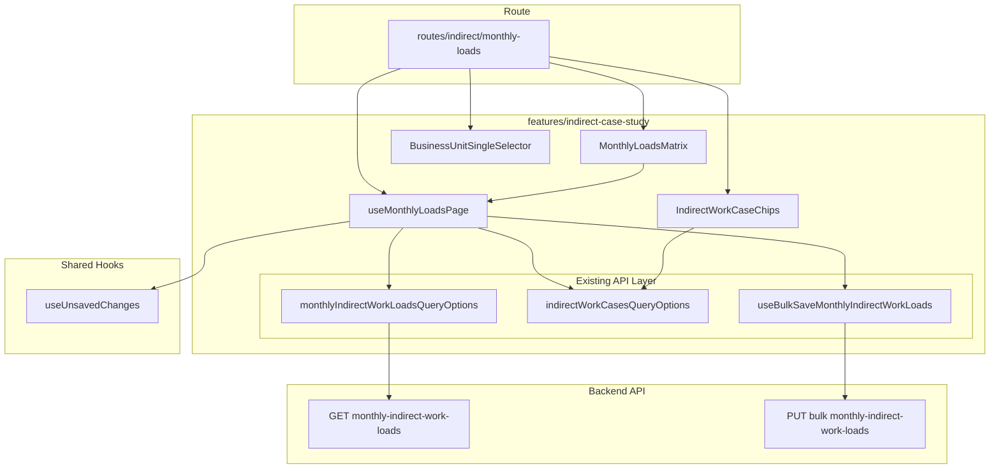
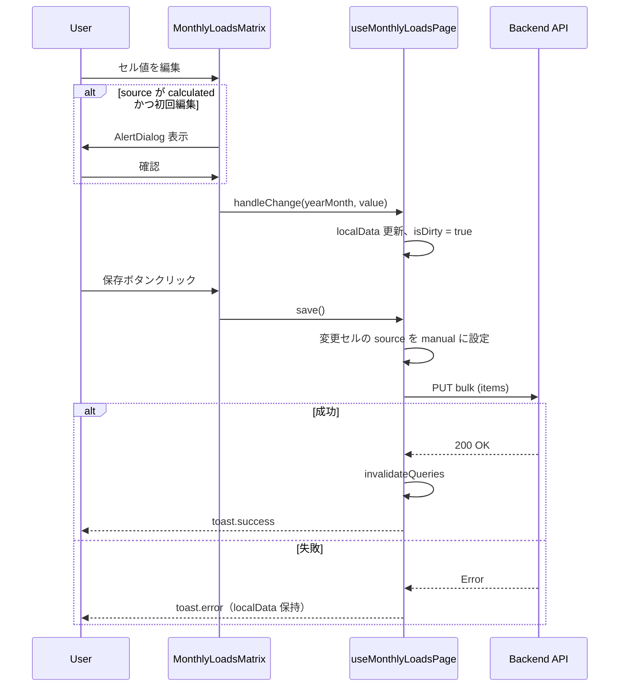
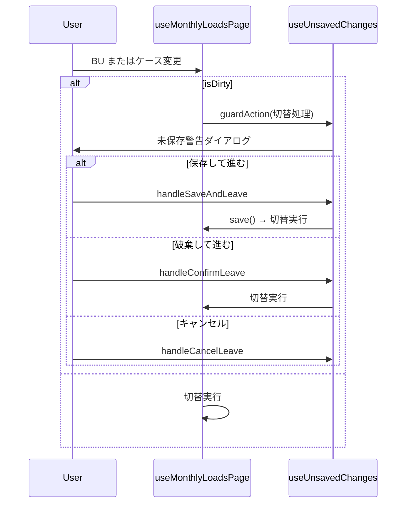

# Design Document: indirect-monthly-loads-view

## Overview

**Purpose**: 保存済みの間接工数（`monthly_indirect_work_loads`）を閲覧・手動編集できる専用画面を提供する。シミュレーション再実行なしで工数データの確認・調整を可能にする。

**Users**: 事業部リーダーが月次の間接工数を確認し、計算結果を実態に合わせて手動調整するワークフローで使用する。

**Impact**: 既存の `features/indirect-case-study/` を拡張し、新規ルート `/indirect/monthly-loads` とマトリクス編集 UI を追加する。既存 API・mutation・型はすべて再利用する。

### Goals
- 保存済み間接工数をマトリクス形式（年度×月）で一覧表示する
- インライン編集で工数値を手動調整し、`source: 'manual'` を自動設定する
- Tab/Enter キーによる連続入力を可能にする
- 既存の BU セレクタ・未保存警告パターンとの一貫性を維持する

### Non-Goals
- 間接工数の新規行追加・削除
- 計算結果との差分可視化
- 手動編集値を計算値に戻す機能
- Excel エクスポート

## Architecture

### Existing Architecture Analysis

既存の `features/indirect-case-study/` は以下の責務を持つ:
- **API 層**: `api/queries.ts`（Query Key Factory + queryOptions）、`api/mutations.ts`（bulk upsert 含む）、`api/indirect-work-client.ts`（fetch 関数）
- **型定義**: `types/indirect-work.ts`（`MonthlyIndirectWorkLoad` 型、Zod スキーマ）
- **コンポーネント**: `IndirectWorkCaseList`（CRUD 付きリスト）、`IndirectWorkRatioMatrix`（インライン編集マトリクス）、`BusinessUnitSingleSelector`（チップ式 BU 選択）
- **Hook**: `useIndirectWorkCasesPage`（ページ状態管理）、`useUnsavedChanges`（未保存警告）

本機能は上記アセットを最大限再利用し、新規コンポーネント・hook・ルートファイルのみ追加する。

### Architecture Pattern & Boundary Map



**Architecture Integration**:
- **Selected pattern**: 既存 feature 拡張（Option A/C ハイブリッド）
- **Domain boundary**: `indirect-case-study` feature 内に閉じ、features 間依存なし
- **Existing patterns preserved**: マトリクス編集、BU セレクタ URL 連動、dirty 状態管理、useBlocker 未保存警告
- **New components rationale**: `MonthlyLoadsMatrix`（年度×月マトリクス + キーボードナビ）、`IndirectWorkCaseChips`（軽量ケース選択）、`useMonthlyLoadsPage`（ページ状態管理）
- **Steering compliance**: レイヤードアーキテクチャ、feature-first 構成、Zod スキーマ中心

### Technology Stack

| Layer | Choice / Version | Role in Feature | Notes |
|-------|------------------|-----------------|-------|
| Frontend | React 19 + TanStack Router | ルーティング、search params 管理 | 既存パターン踏襲 |
| State | TanStack Query v5 | サーバー状態管理、キャッシュ無効化 | 既存 queryOptions 再利用 |
| UI | shadcn/ui + Tailwind CSS v4 | Input、Badge、AlertDialog | 既存コンポーネント利用 |
| Validation | Zod v3 | search params バリデーション | 既存パターン踏襲 |
| Backend | 既存 API（変更なし） | GET / PUT bulk | 新規エンドポイント不要 |

## System Flows

### 編集・保存フロー



### BU/ケース切替フロー



## Requirements Traceability

| Requirement | Summary | Components | Interfaces | Flows |
|-------------|---------|------------|------------|-------|
| 1.1 | BU セレクタ + URL 連動 | BusinessUnitSingleSelector, Route | search params schema | - |
| 1.2 | ケースチップ選択 | IndirectWorkCaseChips | IndirectWorkCaseChipsProps | - |
| 1.3 | マトリクス表示（5年度×12ヶ月） | MonthlyLoadsMatrix | MonthlyLoadsMatrixProps | - |
| 1.4 | source 視覚区別 | MonthlyLoadsMatrix | - | - |
| 1.5 | 年度合計列 | MonthlyLoadsMatrix | - | - |
| 1.6 | 空状態表示 | Route（lazy） | - | - |
| 2.1 | 編集セルハイライト | MonthlyLoadsMatrix | - | - |
| 2.2 | source: manual 自動設定 | useMonthlyLoadsPage | save() | 編集・保存フロー |
| 2.3 | 成功トースト + リフレッシュ | useMonthlyLoadsPage | save() | 編集・保存フロー |
| 2.4 | エラートースト + データ保持 | useMonthlyLoadsPage | save() | 編集・保存フロー |
| 2.5 | calculated 上書き警告 | MonthlyLoadsMatrix | AlertDialog | 編集・保存フロー |
| 2.6 | 未保存警告ダイアログ | useMonthlyLoadsPage, useUnsavedChanges | guardAction | BU/ケース切替フロー |
| 3.1 | 数値入力制限 | MonthlyLoadsMatrix | normalizeNumericInput | - |
| 3.2 | バリデーションエラー表示 | MonthlyLoadsMatrix | - | - |
| 3.3 | 保存ボタン無効化 | Route（lazy）, useMonthlyLoadsPage | hasValidationErrors | - |
| 4.1 | サイドナビメニュー追加 | SidebarNav | menuItems | - |
| 4.2 | メニュークリック遷移 | SidebarNav | href | - |
| 5.1 | 上下配置レイアウト | Route（lazy） | - | - |
| 5.2 | BU セレクタ URL 連動 | Route, BusinessUnitSingleSelector | search params | - |
| 5.3 | ローディング表示 | Route（lazy） | isLoading | - |
| 5.4 | Tab/Enter キーボード移動 | MonthlyLoadsMatrix | onKeyDown | - |

## Components and Interfaces

| Component | Domain/Layer | Intent | Req Coverage | Key Dependencies | Contracts |
|-----------|-------------|--------|--------------|-----------------|-----------|
| Route (index.tsx + index.lazy.tsx) | Routing | ルート定義 + ページレイアウト | 1.1, 1.6, 3.3, 5.1, 5.2, 5.3 | useMonthlyLoadsPage (P0) | State |
| useMonthlyLoadsPage | Hook | ページ状態管理（BU/ケース選択、dirty、保存） | 2.1-2.6, 3.3 | API queries/mutations (P0), useUnsavedChanges (P0) | State |
| MonthlyLoadsMatrix | UI | 年度×月マトリクス、インライン編集、キーボードナビ | 1.3-1.5, 2.1, 2.5, 3.1, 3.2, 5.4 | useMonthlyLoadsPage (P0) | State |
| IndirectWorkCaseChips | UI | チップ形式ケース選択 | 1.2 | indirectWorkCasesQueryOptions (P1) | - |
| SidebarNav（変更） | Layout | メニュー項目追加 | 4.1, 4.2 | - | - |

### Routing Layer

#### Route: /indirect/monthly-loads

| Field | Detail |
|-------|--------|
| Intent | ルート定義（search params）とページレイアウト構成 |
| Requirements | 1.1, 1.6, 3.3, 5.1, 5.2, 5.3 |

**Responsibilities & Constraints**
- `index.tsx`: Zod search schema 定義（`bu: z.string()`）
- `index.lazy.tsx`: ページレイアウト構成、BU セレクタ → ケースチップ → マトリクスの上下配置
- ローディング・空状態の条件分岐

**Dependencies**
- Inbound: TanStack Router — ルーティング (P0)
- Outbound: useMonthlyLoadsPage — ページ状態 (P0)
- Outbound: BusinessUnitSingleSelector — BU 選択 UI (P0)
- Outbound: IndirectWorkCaseChips — ケース選択 UI (P0)
- Outbound: MonthlyLoadsMatrix — データ表示・編集 UI (P0)

**Contracts**: State [x]

##### State Management

```typescript
// index.tsx
const searchSchema = z.object({
  bu: z.string().catch("").default(""),
});
```

**Implementation Notes**
- `index.lazy.tsx` は100行前後でレイアウトを記述（ルール準拠）
- `useUnsavedChanges` の `UnsavedChangesDialog` をページレベルで配置
- 保存ボタンはヘッダー領域に配置し、`isDirty && !hasValidationErrors` で活性化

### Hook Layer

#### useMonthlyLoadsPage

| Field | Detail |
|-------|--------|
| Intent | ページ全体の状態管理（BU/ケース選択、ローカル編集状態、保存、バリデーション） |
| Requirements | 2.1-2.6, 3.3 |

**Responsibilities & Constraints**
- BU コード・ケース ID の選択状態管理
- API データからローカル状態への初期化
- dirty セルの追跡と `source` 自動設定
- バリデーションエラー状態の集約
- 保存処理と成功/失敗のハンドリング

**Dependencies**
- Inbound: Route (lazy) — businessUnitCode, navigate (P0)
- Outbound: indirectWorkCasesQueryOptions — ケース一覧取得 (P0)
- Outbound: monthlyIndirectWorkLoadsQueryOptions — 月次データ取得 (P0)
- Outbound: useBulkSaveMonthlyIndirectWorkLoads — 保存 mutation (P0)
- Outbound: useUnsavedChanges — 未保存警告 (P0)

**Contracts**: State [x]

##### State Management

```typescript
interface UseMonthlyLoadsPageParams {
  businessUnitCode: string;
}

interface UseMonthlyLoadsPageReturn {
  // ケース選択
  cases: IndirectWorkCase[];
  isLoadingCases: boolean;
  selectedCaseId: number | null;
  setSelectedCaseId: (id: number | null) => void;

  // 月次データ
  monthlyLoads: MonthlyIndirectWorkLoad[];
  isLoadingLoads: boolean;

  // ローカル編集状態
  localData: Record<string, number>;           // key: yearMonth (YYYYMM)
  originalSources: Record<string, string>;     // key: yearMonth, value: "calculated" | "manual"
  dirtyKeys: Set<string>;                      // 編集済み yearMonth のセット
  hasValidationErrors: boolean;

  // 操作
  handleChange: (yearMonth: string, value: number) => void;
  save: () => Promise<void>;
  isSaving: boolean;
  isDirty: boolean;

  // 未保存警告
  unsaved: UseUnsavedChangesReturn;

  // calculated 警告状態
  hasAcknowledgedCalculatedWarning: boolean;
  setHasAcknowledgedCalculatedWarning: (v: boolean) => void;
}
```

- `localData`: API データから初期化。キー `yearMonth`（YYYYMM）、値 `manhour`
- `originalSources`: API データの元 `source` を保持。calculated 上書き検知に使用
- `dirtyKeys`: 編集されたセルの `yearMonth` を追跡。保存時に変更分のみ送信
- `hasAcknowledgedCalculatedWarning`: ケース単位で calculated 上書き警告の表示済みフラグ。ケース切替でリセット

**Implementation Notes**
- BU 変更時: `selectedCaseId`, `localData`, `dirtyKeys` をリセット
- ケース変更時: `localData`, `dirtyKeys`, `hasAcknowledgedCalculatedWarning` をリセット
- 保存時: `dirtyKeys` に含まれる項目のみ `items` 配列に変換し、`source: "manual"` を設定して bulk upsert
- `useUnsavedChanges` の `guardAction` で BU/ケース切替を保護

### UI Layer

#### MonthlyLoadsMatrix

| Field | Detail |
|-------|--------|
| Intent | 年度×月（4月〜3月）のマトリクス形式で工数を表示・インライン編集、キーボードナビゲーション |
| Requirements | 1.3, 1.4, 1.5, 2.1, 2.5, 3.1, 3.2, 5.4 |

**Responsibilities & Constraints**
- API データを年度×月のマトリクスに変換して表示
- 各セルを `<Input>` で編集可能にする
- `source` に応じたセル背景色の区別（calculated: 通常、manual: 強調色）
- 編集済みセルのハイライト（`dirtyKeys` 参照）
- 年度合計列（読み取り専用、リアルタイム計算）
- Tab（右移動）/ Enter（下移動）のキーボードナビゲーション
- `calculated` セル初回編集時の AlertDialog トリガー

**Dependencies**
- Inbound: Route (lazy) — props (P0)
- External: normalizeNumericInput — 全角→半角変換 (P1)
- External: AlertDialog (shadcn/ui) — 確認ダイアログ (P1)

**Contracts**: State [x]

##### State Management

```typescript
interface MonthlyLoadsMatrixProps {
  localData: Record<string, number>;
  originalSources: Record<string, string>;
  dirtyKeys: Set<string>;
  fiscalYears: number[];
  onChange: (yearMonth: string, value: number) => void;
  onCalculatedEditAttempt: () => boolean;  // true: 許可、false: AlertDialog 表示
}
```

**マトリクス構造**:

| | 4月 | 5月 | ... | 3月 | 合計 |
|------|------|------|-----|------|------|
| FY2024 | Input | Input | ... | Input | 計算値 |
| FY2025 | Input | Input | ... | Input | 計算値 |
| ... | ... | ... | ... | ... | ... |

**キーボードナビゲーション仕様**:
- 各 Input に `data-row={yearIndex}` `data-col={monthIndex}` を付与
- `onKeyDown`:
  - `Tab`: デフォルト挙動（右方向移動）。最終列の場合は次行先頭へ
  - `Enter`: `e.preventDefault()`、`data-row={yearIndex+1}` `data-col={monthIndex}` の Input にフォーカス

**セル視覚区別**:
- `calculated` + 未編集: 通常背景
- `manual`（元から）: `bg-blue-50` 等の軽い強調
- 編集済み（dirty）: `bg-amber-50` + `ring` 等のハイライト

**Implementation Notes**
- `yearMonth` ↔ マトリクス座標の変換: `YYYYMM` → 年度 = `MM >= 4 ? YYYY : YYYY-1`、列 = `(MM + 8) % 12`
- 合計列: `fiscalYears.map(fy => months.reduce((sum, m) => sum + (localData[toYearMonth(fy, m)] ?? 0), 0))`
- セル数は最大60（5年度×12ヶ月）で React.memo は不要（軽量）

#### IndirectWorkCaseChips

| Field | Detail |
|-------|--------|
| Intent | 間接工数ケースをチップ（ボタン群）形式で表示し、1クリックで選択切替 |
| Requirements | 1.2 |

**Responsibilities & Constraints**
- BU に紐づくケース一覧をチップ表示
- 選択状態のハイライト（`BusinessUnitSingleSelector` と同じスタイルパターン）
- `isPrimary` ケースにマーカー表示（任意）

**Dependencies**
- Inbound: Route (lazy) — props (P0)

**Contracts**: — (プレゼンテーションのみ)

```typescript
interface IndirectWorkCaseChipsProps {
  cases: IndirectWorkCase[];
  selectedCaseId: number | null;
  onSelect: (caseId: number) => void;
  isLoading: boolean;
}
```

**Implementation Notes**
- `BusinessUnitSingleSelector` と同じ `button` + `border-primary bg-primary/10` パターンを踏襲
- ケース名（`caseName`）をチップラベルとして表示

### Layout Layer（変更）

#### SidebarNav

| Field | Detail |
|-------|--------|
| Intent | 「間接作業管理」セクションに「月次間接工数」メニュー項目を追加 |
| Requirements | 4.1, 4.2 |

**Implementation Notes**
- `menuItems` 配列の「間接作業管理」`children` に追加:
  ```
  { label: "月次間接工数", href: "/indirect/monthly-loads", icon: Table }
  ```

## Data Models

### Domain Model

本機能で新規データモデルの追加はない。既存の `MonthlyIndirectWorkLoad` エンティティを使用する。

**キーとなるビジネスルール**:
- ユニーク制約: `(indirect_work_case_id, business_unit_code, year_month)` — 同一ケース・BU・年月に1レコード
- `source` フィールド: 手動編集時は `"manual"`、計算保存時は `"calculated"`
- `manhour`: 整数、0以上、最大99999999

### Data Contracts & Integration

**既存 API（変更なし）**:

| Method | Endpoint | Request | Response | Errors |
|--------|----------|---------|----------|--------|
| GET | `/indirect-work-cases/:id/monthly-indirect-work-loads` | query: businessUnitCode | `PaginatedResponse<MonthlyIndirectWorkLoad>` | 404 (case not found) |
| PUT | `/indirect-work-cases/:id/monthly-indirect-work-loads/bulk` | `{ items: BulkUpsertItem[] }` | `{ data: MonthlyIndirectWorkLoad[] }` | 400, 404 |

**BulkUpsertItem 型**（既存）:
```typescript
interface BulkUpsertItem {
  businessUnitCode: string;
  yearMonth: string;       // YYYYMM
  manhour: number;         // 整数、0-99999999
  source: "calculated" | "manual";
}
```

## Error Handling

### Error Categories and Responses

**User Errors**:
- 不正な数値入力 → フィールドレベルバリデーション（`manhour` 範囲外: 赤枠 + メッセージ）
- 未保存で画面遷移 → `useUnsavedChanges` の AlertDialog

**System Errors**:
- API 保存失敗 → `toast.error("保存に失敗しました")`、ローカルデータ保持
- データ取得失敗 → TanStack Query のデフォルトリトライ（3回）

## Testing Strategy

### Unit Tests
- `useMonthlyLoadsPage`: dirty 状態追跡、保存時の source 自動設定、BU/ケース変更時のリセット
- `MonthlyLoadsMatrix`: yearMonth ↔ マトリクス座標変換、合計計算、キーボードナビゲーション
- `IndirectWorkCaseChips`: 選択状態のレンダリング

### Integration Tests
- ページ全体: BU 選択 → ケース選択 → データ表示のフロー
- 編集 → 保存 → キャッシュ無効化 → 再取得のフロー
- calculated 上書き警告 → 編集 → 保存のフロー
