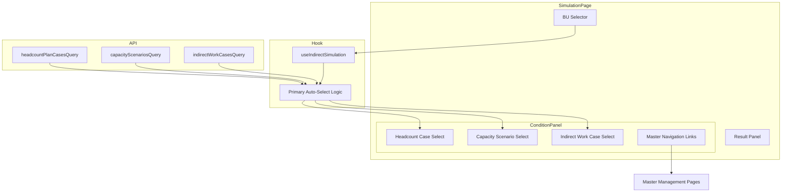
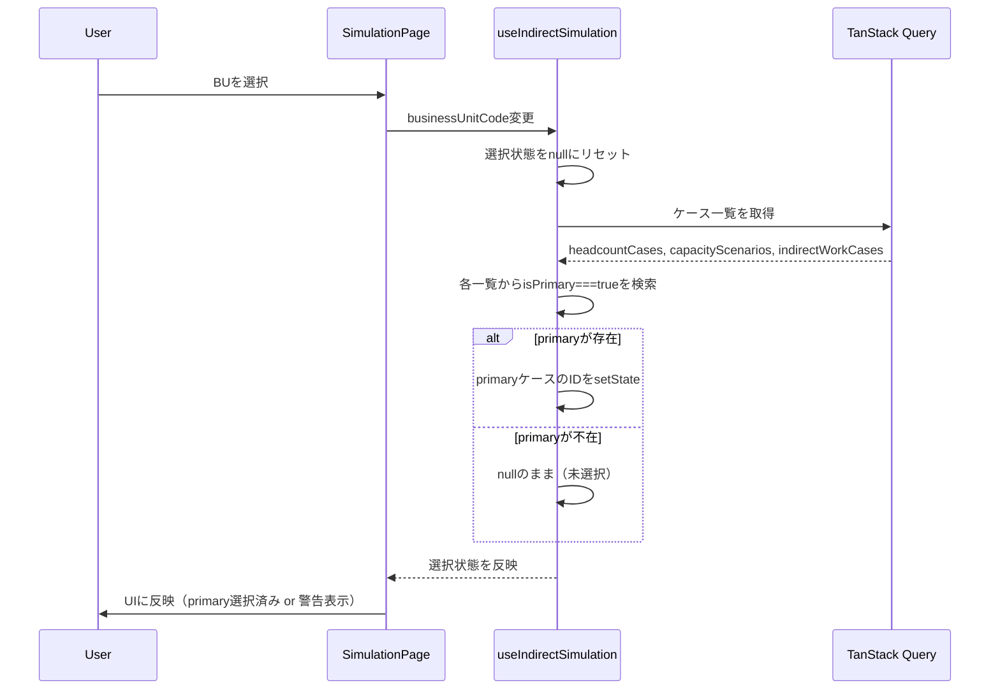

# Design Document

## Overview

**Purpose**: 間接工数画面の計算条件パネルにおいて、各エンティティ（人員計画ケース・キャパシティシナリオ・間接作業ケース）のprimaryケースをデフォルト選択し、ユーザーが任意のケースに変更可能にする機能を提供する。

**Users**: 事業部リーダーが間接工数のシミュレーション・確認ワークフローで利用する。

**Impact**: 既存の `useIndirectSimulation` フックとシミュレーション画面のUIを拡張し、ケース選択の自動化と柔軟性を両立させる。

### Goals
- BU選択時にprimaryケースを自動でデフォルト選択し、手動選択の手間を削減する
- primaryケース以外への切り替えをセレクタUIで可能にする
- primary未設定時にユーザーへの視覚的フィードバックと手動選択の誘導を行う
- 計算条件パネルからマスタ管理画面への直接遷移を提供する

### Non-Goals
- バックエンドでのprimary排他制御（同一スコープ内でprimaryを1つに制限する制約）
- Issue #70の画面統合（simulation + monthly-loads の1画面化）全体の実装
- 計算ロジック（キャパシティ計算・間接工数計算）の変更
- マスタ管理画面側の変更

## Architecture

### Existing Architecture Analysis

現在のシミュレーション画面は以下の構造で動作する:

- **画面コンポーネント**: `simulation/index.lazy.tsx` — BU選択、ケース選択UI、計算ボタン、結果表示を管理
- **ロジックフック**: `useIndirectSimulation` — 3つの `useState<number | null>(null)` でケース選択を管理。BU変更時にすべて `null` にリセット
- **データ取得**: TanStack Query の `queryOptions` でケース一覧を取得。レスポンスに `isPrimary` が含まれるが未使用
- **UIコンポーネント**: `SelectSection` ローカルコンポーネントが shadcn/ui の `Select` をラップ

**変更が必要な箇所**:
- `useIndirectSimulation` — primary自動選択ロジックの追加
- `simulation/index.lazy.tsx` — SelectSection拡張（primaryバッジ、マスタ遷移リンク、警告表示）

### Architecture Pattern & Boundary Map



**Architecture Integration**:
- 選択パターン: 既存フック内にprimary自動選択ロジックをインライン追加（`research.md`参照）
- ドメイン境界: `indirect-case-study` feature 内で完結。他featureへの影響なし
- 既存パターン維持: TanStack Query によるデータ取得、shadcn/ui の Select コンポーネント
- 新規コンポーネント: `CaseSelectSection` — 既存 `SelectSection` をprimaryバッジ・遷移リンク・警告表示で拡張

### Technology Stack

| Layer | Choice / Version | Role in Feature | Notes |
|-------|------------------|-----------------|-------|
| Frontend UI | shadcn/ui Select, Badge, Link | ケース選択UI、primaryバッジ表示 | 既存コンポーネント活用 |
| Frontend Logic | React useState + useEffect | primary自動選択、選択状態管理 | 既存フック拡張 |
| Data Fetching | TanStack Query | ケース一覧取得（isPrimary含む） | 既存クエリそのまま利用 |
| Routing | TanStack Router Link | マスタ画面遷移リンク | 既存ルートへのリンク |

## System Flows

### BU選択 → primary自動選択フロー



**Key Decisions**:
- 自動選択はケース一覧データの取得完了後に実行（useEffectで監視）
- BU変更時は一旦 `null` にリセットした後、新データで再自動選択
- 複数primaryがある場合は配列の最初の要素を選択

## Requirements Traceability

| Requirement | Summary | Components | Interfaces | Flows |
|-------------|---------|------------|------------|-------|
| 1.1 | BU選択時にprimary自動選択 | useIndirectSimulation | AutoSelectLogic | BU選択フロー |
| 1.2 | BUスコープのprimaryのみ対象 | useIndirectSimulation | AutoSelectLogic | BU選択フロー |
| 1.3 | グローバルスコープのprimary選択 | useIndirectSimulation | AutoSelectLogic | BU選択フロー |
| 1.4 | BU切替時にprimaryでリセット | useIndirectSimulation | AutoSelectLogic | BU選択フロー |
| 2.1 | セレクタUIの提供 | CaseSelectSection | CaseSelectSectionProps | — |
| 2.2 | ケース変更の即時反映 | CaseSelectSection, useIndirectSimulation | setState | — |
| 2.3 | 全ケースを選択肢に表示 | CaseSelectSection | CaseSelectSectionProps | — |
| 2.4 | non-primary選択の視覚的表示 | CaseSelectSection | CaseSelectSectionProps | — |
| 2.5 | primaryケースの区別表示 | CaseSelectSection | CaseSelectSectionProps | — |
| 3.1 | primary不在時の未選択表示 | CaseSelectSection | CaseSelectSectionProps | BU選択フロー |
| 3.2 | primary未設定の警告表示 | CaseSelectSection | CaseSelectSectionProps | — |
| 3.3 | 手動選択の受け入れ | useIndirectSimulation | setState | — |
| 3.4 | 未選択時の再計算ボタン無効化 | useIndirectSimulation | canRecalculate | — |
| 4.1 | マスタ遷移リンク配置 | CaseSelectSection | CaseSelectSectionProps | — |
| 4.2 | リンククリックで遷移 | CaseSelectSection | TanStack Router Link | — |
| 4.3 | 3マスタ画面への対応 | CaseSelectSection | masterPath prop | — |
| 5.1 | ケース存在検証 | useIndirectSimulation | AutoSelectLogic | BU選択フロー |
| 5.2 | 削除済みケースのリセット | useIndirectSimulation | AutoSelectLogic | — |
| 5.3 | 全選択完了時のみ再計算有効 | useIndirectSimulation | canRecalculate | — |

## Components and Interfaces

| Component | Domain/Layer | Intent | Req Coverage | Key Dependencies | Contracts |
|-----------|-------------|--------|--------------|------------------|-----------|
| useIndirectSimulation | Hook | ケース選択管理にprimary自動選択を追加 | 1.1-1.4, 3.3-3.4, 5.1-5.3 | TanStack Query (P0) | State |
| CaseSelectSection | UI | primaryバッジ・遷移リンク・警告付きセレクタ | 2.1-2.5, 3.1-3.2, 4.1-4.3 | shadcn/ui Select (P0), TanStack Router Link (P1) | Props |

### Hook Layer

#### useIndirectSimulation（拡張）

| Field | Detail |
|-------|--------|
| Intent | ケース一覧取得完了時にprimaryケースを自動選択し、手動変更も可能にする |
| Requirements | 1.1, 1.2, 1.3, 1.4, 3.3, 3.4, 5.1, 5.2, 5.3 |

**Responsibilities & Constraints**
- 既存のケース選択ステート管理を維持しつつ、primary自動選択ロジックを追加
- BU変更時のリセット後、新しいケースデータで再度primary自動選択を実行
- 複数primaryが存在する場合は配列先頭を採用
- ユーザーの手動選択はsetStateで即座に反映（自動選択を上書き）

**Dependencies**
- Inbound: SimulationPage — ケース選択UIの状態ソース (P0)
- Outbound: TanStack Query — ケース一覧データ取得 (P0)

**Contracts**: State [x]

##### State Management

```typescript
// 既存の戻り値に追加する新しいプロパティ
interface UseIndirectSimulationExtension {
  /** 各エンティティにprimaryケースが存在するかどうか */
  hasPrimaryHeadcountCase: boolean;
  hasPrimaryCapacityScenario: boolean;
  hasPrimaryIndirectWorkCase: boolean;

  /** 現在の選択がprimaryかどうか */
  isHeadcountCasePrimary: boolean;
  isCapacityScenarioPrimary: boolean;
  isIndirectWorkCasePrimary: boolean;

  /** primaryケースにリセットする */
  resetToDefaults: () => void;
}
```

- **自動選択ロジック**: ケース一覧クエリの `data` が変更されたときに `useEffect` でprimaryケースを検索し、選択状態が `null` の場合のみ自動設定する
- **リセットロジック**: BU変更時に選択を `null` にリセット → ケースデータ更新 → useEffectでprimary自動選択が再実行される
- **整合性チェック**: 選択中のケースIDが現在のケース一覧に存在しない場合、primaryまたは `null` にフォールバック

**Implementation Notes**
- 自動選択のuseEffectは、既存のBUリセットロジック（L93-105）の後に実行される順序を保証する必要がある。依存配列にケースデータと選択状態の両方を含め、`selectedId === null` の場合のみ実行する条件分岐で制御する
- `canRecalculate` は既存の `canCalculateCapacity` と `canCalculateIndirectWork` を統合した新しいcomputed値として追加。3つのケースすべてが選択済みの場合に `true`

### UI Layer

#### CaseSelectSection

| Field | Detail |
|-------|--------|
| Intent | primaryバッジ・マスタ遷移リンク・未設定警告を含むケース選択UIコンポーネント |
| Requirements | 2.1, 2.2, 2.3, 2.4, 2.5, 3.1, 3.2, 4.1, 4.2, 4.3 |

**Responsibilities & Constraints**
- 既存の `SelectSection` を置き換える新しいコンポーネント
- ケースセレクタ、primaryバッジ表示、マスタ画面遷移リンク、primary未設定警告を統合
- `simulation/index.lazy.tsx` 内のローカルコンポーネントとして定義（既存パターンを維持）

**Dependencies**
- Inbound: SimulationPage — props経由でケースデータと選択状態を受け取る (P0)
- External: shadcn/ui Select — ドロップダウンUI (P0)
- External: TanStack Router Link — マスタ画面遷移 (P1)
- External: lucide-react — アイコン (P2)

**Contracts**: Props [x]

##### Props Interface

```typescript
interface CaseSelectSectionProps {
  /** セクションのラベルテキスト */
  label: string;
  /** セレクタの無効化状態 */
  disabled: boolean;
  /** 現在選択中のケースID */
  value: number | null;
  /** ケース変更時のコールバック */
  onValueChange: (value: string) => void;
  /** プレースホルダーテキスト */
  placeholder: string;
  /** 選択可能なケース一覧（isPrimaryフラグ含む） */
  items: Array<{
    value: string;
    label: string;
    isPrimary: boolean;
  }>;
  /** マスタ管理画面へのパス */
  masterPath: string;
  /** primaryケースが存在するかどうか */
  hasPrimary: boolean;
}
```

**UI構成**:

```
┌─────────────────────────────────────────────┐
│ ラベル                          → マスタへ   │
│ ┌─────────────────────────────────────────┐ │
│ │ [Select: ケースA ★]              ▼      │ │
│ └─────────────────────────────────────────┘ │
│                                             │
│ ⚠ primaryケースが設定されていません          │  ← hasPrimary===falseの場合のみ表示
└─────────────────────────────────────────────┘
```

- ラベル行の右端にマスタ管理画面への遷移リンク（`→` アイコン + テキスト）
- Select内のprimaryケースの選択肢に `★` バッジを付与
- `hasPrimary === false` かつ `value === null` の場合、セレクタ下部に警告メッセージを表示（`text-amber-600`）

**Implementation Notes**
- `SelectItem` 内でprimaryケースに `★` を表示するため、`items` にisPrimaryフラグを含める
- マスタ遷移リンクは `<Link to={masterPath}>` で実装。TanStack Router の型安全なリンクを利用
- 警告メッセージは `hasPrimary === false && value === null` の条件でのみレンダリング

## Data Models

### Domain Model

本機能はデータモデルの変更を伴わない。既存の `isPrimary: boolean` フラグをフロントエンドで活用するのみ。

**既存エンティティと`isPrimary`の関係**:

| エンティティ | スコープ | primaryの意味 |
|---|---|---|
| HeadcountPlanCase | BU単位 | そのBUの基準人員計画 |
| CapacityScenario | グローバル | 標準稼働時間シナリオ |
| IndirectWorkCase | BU単位 | そのBUの基準間接作業比率 |

### Data Contracts & Integration

**API Data Transfer**: 既存APIレスポンスをそのまま利用。変更なし。

各ケース一覧APIのレスポンスに含まれる `isPrimary` フィールド:
- `GET /headcount-plan-cases?businessUnitCode=XXX` → `HeadcountPlanCase[]` (各要素に `isPrimary: boolean`)
- `GET /capacity-scenarios` → `CapacityScenario[]` (各要素に `isPrimary: boolean`)
- `GET /indirect-work-cases?businessUnitCode=XXX` → `IndirectWorkCase[]` (各要素に `isPrimary: boolean`)

## Error Handling

### Error Categories and Responses

**User Errors**:
- ケース未選択で再計算を試行 → ボタン無効化で防止（3.4, 5.3）
- primary未設定 → 警告メッセージ表示 + マスタ画面への誘導（3.2, 4.1）

**System Errors**:
- ケース一覧取得失敗 → TanStack Queryの既存エラーハンドリングに委譲
- 選択中ケースが削除済み → primaryまたはnullにフォールバック（5.2）

## Testing Strategy

### Unit Tests
- `useIndirectSimulation` の自動選択ロジック: primaryが存在する場合に正しく選択されること
- `useIndirectSimulation` の自動選択ロジック: primaryが存在しない場合にnullのままであること
- `useIndirectSimulation` のBU変更時: 新BUのprimaryで再選択されること
- `useIndirectSimulation` の整合性チェック: 削除済みケースがリセットされること

### UI Tests
- `CaseSelectSection`: primaryバッジが正しく表示されること
- `CaseSelectSection`: primary未設定時に警告メッセージが表示されること
- `CaseSelectSection`: マスタ遷移リンクが正しいパスを指すこと
- `CaseSelectSection`: ケース変更が `onValueChange` を正しく呼び出すこと
