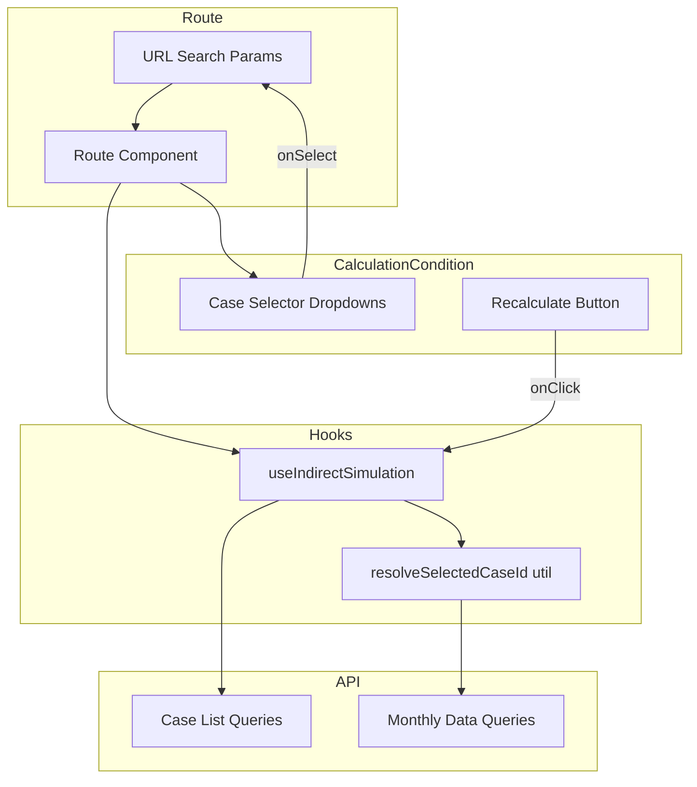
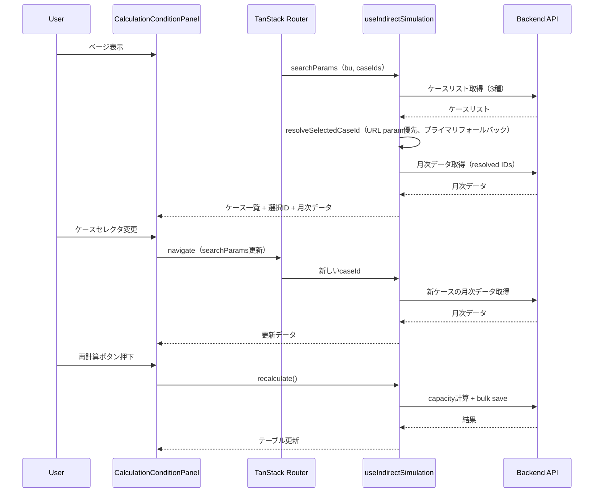

# Design Document

## Overview

**Purpose**: 間接工数画面（`/indirect/`）の計算条件パネルにケースセレクタを追加し、人員計画ケース・稼働時間シナリオ・間接作業ケースをユーザーが任意に選択して what-if 分析を実行できるようにする。

**Users**: 事業部リーダー・プロジェクトマネージャーが、異なるシナリオ組み合わせで間接工数への影響を比較する。

**Impact**: 現在の `CalculationConditionPanel`（読み取り専用表示）を選択可能なUIに改修し、`useIndirectSimulation` フックの入力をパラメータ化する。

### Goals
- 3種のケース（人員計画・稼働時間・間接作業）をドロップダウンで選択可能にする
- 選択状態をURL検索パラメータに永続化する
- 選択したケースの組み合わせで再計算を実行できる

### Non-Goals
- ケースのCRUD操作（既存マスタ管理画面で実施）
- 複数ケースの同時表示・並列比較UI
- バックエンドAPIの変更

## Architecture

### Existing Architecture Analysis

現在の間接工数画面のデータフロー：

1. ルートコンポーネントが `useIndirectSimulation(businessUnitCode)` を呼び出し
2. フック内部でケースリストを取得し、`findPrimaryId()` でプライマリを自動検出
3. プライマリIDで月次データを取得
4. 再計算ボタン押下でプライマリIDを使った計算パイプラインを実行

**変更ポイント**: フックへの入力にケースIDを追加し、プライマリ自動検出をフォールバックに格下げする。

### Architecture Pattern & Boundary Map



**Architecture Integration**:
- **Selected pattern**: 既存のフック入力拡張パターン（最小変更で後方互換を維持）
- **Domain boundaries**: `indirect-case-study` feature 内で完結
- **Existing patterns preserved**: URL検索パラメータによるBU選択、TanStack Query によるデータ取得、`CalculationConditionPanel` の3カラムレイアウト
- **New components rationale**: `CaseSelect` は共通セレクタUIとして新設（3箇所で同一パターン）
- **Steering compliance**: features間の依存排除、`@` エイリアスインポート

### Technology Stack

| Layer | Choice / Version | Role in Feature | Notes |
|-------|------------------|-----------------|-------|
| Frontend UI | shadcn/ui Select (Radix UI) | ケースセレクタドロップダウン | 既存導入済み |
| State / URL | TanStack Router Search Params + Zod | ケース選択状態の永続化 | 既存BUパラメータパターンを拡張 |
| Data Fetching | TanStack Query | ケースリスト・月次データ取得 | 既存クエリオプションを流用 |

## System Flows

### ケース選択→再計算フロー



## Requirements Traceability

| Requirement | Summary | Components | Interfaces | Flows |
|-------------|---------|------------|------------|-------|
| 1.1 | BUに紐づく人員計画ケース一覧表示 | CaseSelect, useIndirectSimulation | headcountPlanCasesQuery | ケース選択フロー |
| 1.2 | 人員計画ケース選択で計算条件設定 | CaseSelect, CalculationConditionPanel | onCaseChange → navigate | ケース選択フロー |
| 1.3 | プライマリケースの初期選択 | useIndirectSimulation | resolveSelectedCaseId | ケース解決フロー |
| 1.4 | ケース未登録時の表示 | CaseSelect | placeholder表示 | - |
| 1.5 | 未選択時の再計算ボタン無効化 | CalculationConditionPanel | canRecalculate | - |
| 2.1 | 稼働時間シナリオ一覧表示 | CaseSelect, useIndirectSimulation | capacityScenariosQuery | ケース選択フロー |
| 2.2 | シナリオ選択で計算条件設定 | CaseSelect, CalculationConditionPanel | onCaseChange → navigate | ケース選択フロー |
| 2.3 | プライマリシナリオの初期選択 | useIndirectSimulation | resolveSelectedCaseId | ケース解決フロー |
| 2.4 | シナリオ未登録時の表示 | CaseSelect | placeholder表示 | - |
| 2.5 | 未選択時の再計算ボタン無効化 | CalculationConditionPanel | canRecalculate | - |
| 3.1 | BUに紐づく間接作業ケース一覧表示 | CaseSelect, useIndirectSimulation | indirectWorkCasesQuery | ケース選択フロー |
| 3.2 | 間接作業ケース選択で計算条件設定 | CaseSelect, CalculationConditionPanel | onCaseChange → navigate | ケース選択フロー |
| 3.3 | プライマリケースの初期選択 | useIndirectSimulation | resolveSelectedCaseId | ケース解決フロー |
| 3.4 | ケース未登録時の表示 | CaseSelect | placeholder表示 | - |
| 3.5 | 未選択時の再計算ボタン無効化 | CalculationConditionPanel | canRecalculate | - |
| 4.1 | ケース変更時のURLパラメータ反映 | Route searchSchema | navigate with search params | ケース選択フロー |
| 4.2 | URLパラメータからのケース復元 | useIndirectSimulation | resolveSelectedCaseId | ケース解決フロー |
| 4.3 | 無効IDのフォールバック | useIndirectSimulation | resolveSelectedCaseId | ケース解決フロー |
| 5.1 | 選択ケース組み合わせで再計算実行 | useIndirectSimulation | recalculate() | 再計算フロー |
| 5.2 | 再計算中のローディング状態 | CalculationConditionPanel | isRecalculating | 再計算フロー |
| 5.3 | 再計算完了後のテーブル更新 | IndirectOverviewTable | クエリキャッシュ無効化 | 再計算フロー |
| 5.4 | 再計算エラー時のトースト表示 | useIndirectSimulation | sonner toast | 再計算フロー |

## Components and Interfaces

| Component | Domain/Layer | Intent | Req Coverage | Key Dependencies | Contracts |
|-----------|-------------|--------|--------------|-----------------|-----------|
| Route searchSchema拡張 | Route | ケースIDのURL永続化 | 4.1, 4.2, 4.3 | TanStack Router, Zod (P0) | State |
| CaseSelect | UI | ケースドロップダウンセレクタ | 1.1, 1.4, 2.1, 2.4, 3.1, 3.4 | shadcn/ui Select (P0) | - |
| CalculationConditionPanel改修 | UI | ケース選択UIの統合 | 1.2, 1.5, 2.2, 2.5, 3.2, 3.5, 5.2 | CaseSelect (P0), useIndirectSimulation (P0) | State |
| useIndirectSimulation改修 | Hooks | ケースID入力のパラメータ化 | 1.3, 2.3, 3.3, 4.2, 4.3, 5.1, 5.4 | TanStack Query (P0), simulation-utils (P1) | Service |
| resolveSelectedCaseId | Utils | 選択ID解決ロジック | 1.3, 2.3, 3.3, 4.3 | - | Service |

### Route Layer

#### Route searchSchema拡張

| Field | Detail |
|-------|--------|
| Intent | 3つのケースIDをURL検索パラメータとして管理する |
| Requirements | 4.1, 4.2, 4.3 |

**Responsibilities & Constraints**
- `bu` に加えて `headcountCaseId`, `capacityScenarioId`, `indirectWorkCaseId` を検索パラメータとして定義
- 各IDは数値型、デフォルト値 `0`（未指定を意味）
- `z.number().catch(0).default(0)` で不正値をサイレントにフォールバック

**Contracts**: State [x]

##### State Management

```typescript
// routes/indirect/index.tsx
const indirectSearchSchema = z.object({
  bu: z.string().catch("").default(""),
  headcountCaseId: z.number().catch(0).default(0),
  capacityScenarioId: z.number().catch(0).default(0),
  indirectWorkCaseId: z.number().catch(0).default(0),
})

type IndirectSearchParams = z.infer<typeof indirectSearchSchema>
```

**Implementation Notes**
- 既存の `bu` パラメータパターンを踏襲
- `0` は「未指定（プライマリにフォールバック）」を意味する規約
- BU変更時に `headcountCaseId` と `indirectWorkCaseId` を `0` にリセットする（BU依存のため）

### UI Layer

#### CaseSelect

| Field | Detail |
|-------|--------|
| Intent | ケース選択用の汎用ドロップダウンコンポーネント |
| Requirements | 1.1, 1.4, 2.1, 2.4, 3.1, 3.4 |

**Responsibilities & Constraints**
- shadcn/ui `Select` をラップした軽量コンポーネント
- ケース一覧の表示、選択、プライマリバッジ（★）表示
- ケースが0件の場合は「未登録」プレースホルダー表示
- CRUD機能は含まない（マスタ管理画面へのリンクで代替）

**Dependencies**
- External: shadcn/ui Select — ドロップダウンUI (P0)

**Contracts**: Service [x]

##### Service Interface

```typescript
interface CaseSelectProps<T> {
  /** 選択肢となるケース一覧 */
  items: T[]
  /** 現在の選択ID（0は未選択） */
  selectedId: number
  /** 選択変更コールバック */
  onSelect: (id: number) => void
  /** ケースからIDを取得する関数 */
  getId: (item: T) => number
  /** ケースから表示名を取得する関数 */
  getLabel: (item: T) => string
  /** ケースがプライマリかを判定する関数 */
  getIsPrimary: (item: T) => boolean
  /** ケースが0件時のプレースホルダーテキスト */
  emptyLabel: string
  /** ローディング中かどうか */
  isLoading?: boolean
  /** 無効化 */
  disabled?: boolean
}
```

- Preconditions: `items` は有効（非削除）なケースのみ
- Postconditions: `onSelect` は選択されたケースのIDを返す
- Invariants: `selectedId` が `items` 内に存在しない場合はプレースホルダー表示

**Implementation Notes**
- ジェネリクスで3種のケース型（HeadcountPlanCase, CapacityScenario, IndirectWorkCase）に対応
- プライマリケースのアイテムには「★」バッジを付与
- 配置先: `features/indirect-case-study/components/CaseSelect.tsx`

#### CalculationConditionPanel改修

| Field | Detail |
|-------|--------|
| Intent | 既存の読み取り専用表示をケースセレクタ付きに改修 |
| Requirements | 1.2, 1.5, 2.2, 2.5, 3.2, 3.5, 5.2 |

**Responsibilities & Constraints**
- 3カラムグリッドレイアウトを維持
- 各カラムに条件ラベル + CaseSelect を配置
- 再計算ボタンの有効/無効制御（全3ケース選択済みかつ非計算中）

**Dependencies**
- Inbound: Route Component — ケース一覧・選択ID・コールバック (P0)
- Outbound: CaseSelect — ドロップダウン描画 (P0)

**Contracts**: State [x]

##### State Management

```typescript
interface CalculationConditionPanelProps {
  /** 人員計画ケース一覧 */
  headcountPlanCases: HeadcountPlanCase[]
  /** 稼働時間シナリオ一覧 */
  capacityScenarios: CapacityScenario[]
  /** 間接作業ケース一覧 */
  indirectWorkCases: IndirectWorkCase[]
  /** 選択中の人員計画ケースID */
  selectedHeadcountCaseId: number
  /** 選択中の稼働時間シナリオID */
  selectedCapacityScenarioId: number
  /** 選択中の間接作業ケースID */
  selectedIndirectWorkCaseId: number
  /** 人員計画ケース変更コールバック */
  onHeadcountCaseChange: (id: number) => void
  /** 稼働時間シナリオ変更コールバック */
  onCapacityScenarioChange: (id: number) => void
  /** 間接作業ケース変更コールバック */
  onIndirectWorkCaseChange: (id: number) => void
  /** 再計算可能フラグ */
  canRecalculate: boolean
  /** 再計算中フラグ */
  isRecalculating: boolean
  /** 再計算実行コールバック */
  onRecalculate: () => void
  /** データローディング中フラグ */
  isLoading?: boolean
}
```

**Implementation Notes**
- 既存のマスタ管理画面リンク（ExternalLink アイコン）は維持
- 再計算中は全セレクタを `disabled` にする（5.2）
- 既存の「未設定」表示はCaseSelectの `emptyLabel` に移行

### Hooks Layer

#### useIndirectSimulation改修

| Field | Detail |
|-------|--------|
| Intent | ケースID入力のパラメータ化とフォールバックロジックの統合 |
| Requirements | 1.3, 2.3, 3.3, 4.2, 4.3, 5.1, 5.4 |

**Responsibilities & Constraints**
- 入力にケースIDパラメータを追加（オプション、0は未指定）
- ケースリスト取得後に `resolveSelectedCaseId` で有効IDを解決
- 解決済みIDで月次データを取得
- 再計算フローは解決済みIDを使用
- ケース一覧データを戻り値に追加（セレクタUIで使用）

**Dependencies**
- Outbound: TanStack Query — データ取得 (P0)
- Outbound: resolveSelectedCaseId — ID解決 (P1)
- Outbound: capacityCalc, indirectCalc — 再計算ロジック (P0)

**Contracts**: Service [x]

##### Service Interface

```typescript
interface UseIndirectSimulationInput {
  businessUnitCode: string
  /** URL検索パラメータから渡されるケースID（0 = 未指定） */
  selectedHeadcountCaseId?: number
  selectedCapacityScenarioId?: number
  selectedIndirectWorkCaseId?: number
}

interface UseIndirectSimulationResult {
  // ケース一覧（セレクタ用）
  headcountPlanCases: HeadcountPlanCase[]
  capacityScenarios: CapacityScenario[]
  indirectWorkCases: IndirectWorkCase[]

  // 解決済みケースID（実際に使用されるID）
  resolvedHeadcountCaseId: number
  resolvedCapacityScenarioId: number
  resolvedIndirectWorkCaseId: number

  // 月次データ
  monthlyHeadcountPlans: MonthlyHeadcountPlan[]
  monthlyCapacities: MonthlyCapacity[]
  monthlyIndirectWorkLoads: MonthlyIndirectWorkLoad[]
  ratios: IndirectWorkTypeRatio[]

  // 状態フラグ
  canRecalculate: boolean
  isRecalculating: boolean
  isLoadingData: boolean
  lastCalculatedAt: string | null
  availableFiscalYears: number[]

  // アクション
  recalculate: () => void
}
```

- Preconditions: `businessUnitCode` が非空
- Postconditions: `resolvedXxxId` は有効なケースIDまたは `0`（ケースが存在しない場合）
- Invariants: `canRecalculate` は3つの `resolvedXxxId` がすべて `> 0` の場合のみ `true`

**Implementation Notes**
- 既存の `primaryXxxId` / `primaryXxxName` は `resolvedXxxId` に置換
- ケースリストデータを戻り値に追加（現在はフック内部でのみ使用）
- 再計算フローのID参照を `resolvedXxxId` に変更

### Utils Layer

#### resolveSelectedCaseId

| Field | Detail |
|-------|--------|
| Intent | URL param → プライマリ → 0 の3段階フォールバックでケースIDを解決 |
| Requirements | 1.3, 2.3, 3.3, 4.3 |

**Responsibilities & Constraints**
- 指定IDがケースリスト内に存在すればそのまま返す
- 存在しなければプライマリIDにフォールバック
- プライマリもなければ `0` を返す

**Contracts**: Service [x]

##### Service Interface

```typescript
/**
 * ケースID解決ユーティリティ
 * URL param > プライマリ > 0 のフォールバック
 */
function resolveSelectedCaseId<T>(
  items: T[],
  selectedId: number,
  getId: (item: T) => number,
  getIsPrimary: (item: T) => boolean,
): number
```

- Preconditions: `items` は有効なケースのリスト
- Postconditions: 返却値は `items` 内の有効なIDまたは `0`
- Invariants: `selectedId > 0` かつリスト内に存在する場合はそのまま返す

**Implementation Notes**
- 配置先: `features/indirect-case-study/hooks/simulation-utils.ts`（既存の `findPrimaryId` の隣に追加）
- 既存の `findPrimaryId` を内部で利用
- BU変更時のリセットはルートコンポーネント側で `selectedId = 0` を渡すことで実現

## Data Models

バックエンドAPIおよびDBスキーマの変更はなし。既存のケースリスト取得API・月次データ取得APIをそのまま利用する。

### Data Contracts & Integration

**URL Search Parameters（新規）**:

| Parameter | Type | Default | Description |
|-----------|------|---------|-------------|
| `bu` | string | `""` | 事業部コード（既存） |
| `headcountCaseId` | number | `0` | 人員計画ケースID（0=未指定） |
| `capacityScenarioId` | number | `0` | 稼働時間シナリオID（0=未指定） |
| `indirectWorkCaseId` | number | `0` | 間接作業ケースID（0=未指定） |

例: `/indirect/?bu=BU001&headcountCaseId=5&capacityScenarioId=3&indirectWorkCaseId=7`

## Error Handling

### Error Strategy
フロントエンドのみの変更のため、既存のエラーハンドリングパターンを踏襲。

### Error Categories and Responses
- **ケースリスト取得失敗**: TanStack Query の既存リトライ + エラー状態表示
- **無効なURL param**: `z.number().catch(0)` でサイレントにデフォルト値へフォールバック（ユーザーエラーではなく正常な遷移）
- **再計算エラー**: 既存の `sonner` トースト通知（5.4）

## Testing Strategy

### Unit Tests
- `resolveSelectedCaseId`: URL param優先、プライマリフォールバック、ケース0件時の各パターン
- `indirectSearchSchema`: Zod バリデーション（正常値・不正値・デフォルト値）

### Integration Tests
- `useIndirectSimulation`: ケースID指定時の月次データ取得確認、BU変更時のリセット動作
- `CalculationConditionPanel`: セレクタ変更時のコールバック呼び出し、再計算ボタンの有効/無効制御

### E2E/UI Tests
- ケース選択→再計算→テーブル更新の一連のフロー
- URL検索パラメータの永続化と復元
- BU変更時のケースリセットと再選択
