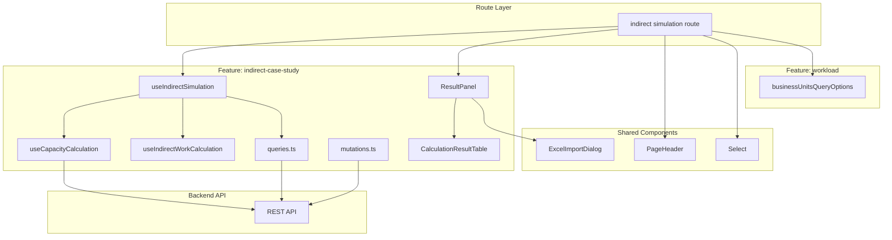
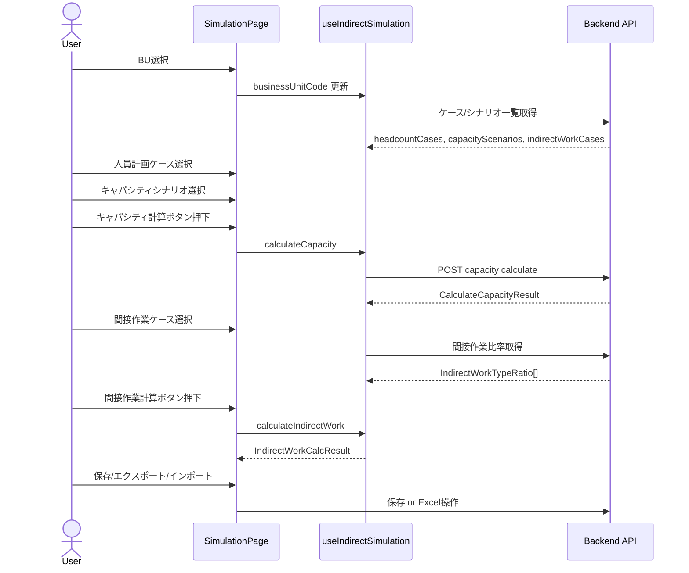

# Design Document: indirect-simulation

## Overview

**Purpose**: 間接作業シミュレーション画面は、BU・ケース・シナリオを選択して一気通貫でキャパシティ計算→間接作業計算→結果確認→保存/エクスポート/インポートを実行するための専用画面を提供する。既存の `indirect-capacity-settings` 画面からマスタCRUD操作を除外した軽量なシミュレーションワークフローである。

**Users**: 事業部リーダー・プロジェクトマネージャーが、人員計画と間接作業の工数シミュレーションに利用する。

**Impact**: 既存の `indirect-case-study` feature にシミュレーション専用フックを追加し、新規ルート `routes/indirect/simulation/` を作成する。既存画面への影響は SidebarNav へのリンク追加のみ。

### Goals
- BU選択→ケース/シナリオ選択→計算→結果確認→保存/エクスポート/インポートの一連のフローを単一画面で完結させる
- 既存の計算フック・コンポーネント・クエリを最大限再利用し、新規コードを最小化する
- マスタCRUD操作を排除し、読み取り専用のドロップダウン選択のみとする

### Non-Goals
- ケース・シナリオの作成・編集・削除機能（マスタ管理画面の責務）
- 人員数・間接作業比率の直接編集（マスタ管理画面の責務）
- 複数シナリオの並列比較機能（将来拡張の対象）

## Architecture

### Existing Architecture Analysis
- `indirect-case-study` feature にマスタCRUD・計算・結果管理がすべて集約
- `useIndirectCaseStudyPage`（296行）がオーケストレーションフックとして全ロジックを管理
- 計算フック（`useCapacityCalculation`, `useIndirectWorkCalculation`）は独立して利用可能
- `ResultPanel` が結果表示・保存・エクスポート・インポートを統合

### Architecture Pattern & Boundary Map



**Architecture Integration**:
- **Selected pattern**: ハイブリッドアプローチ — 既存 feature 内にフック追加、ルートは新規ディレクトリ
- **Domain boundaries**: `indirect-case-study` feature が間接作業ドメインのロジック全体を所有。シミュレーション画面はその読み取り専用のビュー
- **Existing patterns preserved**: TanStack Router ファイルベースルーティング、TanStack Query によるデータフェッチ、URL Search Params によるBU状態管理
- **New components rationale**: `useIndirectSimulation` のみ新規作成（`useIndirectCaseStudyPage` からCRUDを除外した軽量版）
- **Steering compliance**: features 間依存は `workload` feature の `businessUnitsQueryOptions` のみ（既存パターンと同一）

### Technology Stack

| Layer | Choice / Version | Role in Feature | Notes |
|-------|------------------|-----------------|-------|
| Frontend Framework | React 19 + Vite 7 | SPA レンダリング | 既存と同一 |
| Routing | TanStack Router | ファイルベースルーティング、Search Params | `index.tsx` + `index.lazy.tsx` パターン |
| Data Fetching | TanStack Query | クエリ・ミューテーション管理 | 既存 queryOptions を再利用 |
| UI Components | shadcn/ui + Radix UI | Select、Button、Table 等 | 既存と同一 |
| Validation | Zod v3 | Search Params バリデーション | `z.string().catch("").default("")` パターン |
| Notifications | sonner | トースト通知 | 保存・エラー時の通知 |

新規依存なし。すべて既存技術スタック内で完結。

## System Flows

### シミュレーションワークフロー



計算フローはキャパシティ計算→間接作業計算の順序依存がある。間接作業計算はキャパシティ計算結果を入力として使用するため、キャパシティ計算完了前は間接作業ケース選択・計算ボタンを無効化する。

## Requirements Traceability

| Requirement | Summary | Components | Interfaces | Flows |
|-------------|---------|------------|------------|-------|
| 1.1 | `/indirect/simulation` ルート | SimulationRoute | createFileRoute | - |
| 1.2 | SidebarNav リンク追加 | SidebarNav | menuItems 配列 | - |
| 1.3 | ナビゲーション遷移 | SidebarNav | TanStack Router Link | - |
| 2.1 | BU選択表示 | SimulationPage | Select, businessUnitsQueryOptions | - |
| 2.2 | BU連動データ読み込み | useIndirectSimulation | queryOptions | BU選択→クエリ |
| 2.3 | BU未選択時の無効化 | SimulationPage | disabled 制御 | - |
| 3.1, 3.2 | ケース/シナリオ選択 | SimulationPage | Select, useIndirectSimulation | - |
| 3.3 | CRUD機能の排除 | SimulationPage | - | - |
| 4.1, 4.2, 4.3, 4.4 | キャパシティ計算 | useIndirectSimulation | useCapacityCalculation | 計算フロー |
| 5.1, 5.2, 5.3, 5.4, 5.5 | 間接作業計算 | useIndirectSimulation | useIndirectWorkCalculation | 計算フロー |
| 6.1, 6.2, 6.3 | 結果テーブル表示 | ResultPanel, CalculationResultTable | ResultPanelProps | - |
| 7.1, 7.2, 7.3, 7.4 | 結果保存 | ResultPanel | useBulkSaveMonthlyIndirectWorkLoads | 保存フロー |
| 8.1, 8.2, 8.3 | Excelエクスポート | ResultPanel | useExcelExport, useIndirectWorkLoadExcelExport | - |
| 9.1, 9.2, 9.3, 9.4 | Excelインポート | ResultPanel, ExcelImportDialog | useIndirectWorkLoadExcelImport | インポートフロー |

## Components and Interfaces

| Component | Domain/Layer | Intent | Req Coverage | Key Dependencies | Contracts |
|-----------|------------|--------|--------------|-----------------|-----------|
| SimulationRoute | Route | ルート定義と Search Params | 1.1 | TanStack Router (P0) | - |
| SimulationPage | Route/UI | ページ全体のレイアウトと状態管理 | 1.1, 2.1-2.3, 3.1-3.3 | useIndirectSimulation (P0), ResultPanel (P0) | State |
| useIndirectSimulation | Feature/Hook | シミュレーション専用オーケストレーション | 2.2, 3.1-3.2, 4.1-4.4, 5.1-5.5 | useCapacityCalculation (P0), useIndirectWorkCalculation (P0), queries (P0) | State |
| SidebarNav | Layout/UI | ナビゲーションリンク追加 | 1.2, 1.3 | - | - |
| ResultPanel | Feature/UI | 結果表示・保存・エクスポート・インポート（既存） | 6.1-6.3, 7.1-7.4, 8.1-8.3, 9.1-9.4 | CalculationResultTable (P0), ExcelImportDialog (P1) | State |

### Route Layer

#### SimulationRoute

| Field | Detail |
|-------|--------|
| Intent | `/indirect/simulation` ルートの定義と Search Params バリデーション |
| Requirements | 1.1 |

**Responsibilities & Constraints**
- Search Params の Zod スキーマによるバリデーション（`bu` パラメータ）
- Lazy loading によるコード分割

**Dependencies**
- External: TanStack Router — ファイルベースルーティング (P0)
- External: Zod v3 — Search Params バリデーション (P0)

**Contracts**: State [x]

##### State Management
```typescript
// routes/indirect/simulation/index.tsx
const simulationSearchSchema = z.object({
  bu: z.string().catch("").default(""),
});
```

**Implementation Notes**
- `indirect-capacity-settings` の Search Params パターンと同一
- `index.tsx` でルート定義、`index.lazy.tsx` でコンポーネント実装

---

#### SimulationPage

| Field | Detail |
|-------|--------|
| Intent | シミュレーション画面の全体レイアウトとBU選択を管理 |
| Requirements | 1.1, 2.1, 2.2, 2.3, 3.1, 3.2, 3.3, 6.3 |

**Responsibilities & Constraints**
- BU選択の URL Search Params 管理
- 左パネル（選択コントロール）と右パネル（結果表示）の2カラムレイアウト
- useIndirectSimulation フックの呼び出しと ResultPanel への props 受け渡し
- 100行前後でレイアウトを記述（CLAUDE.md 規約）

**Dependencies**
- Inbound: SimulationRoute — Search Params (P0)
- Outbound: useIndirectSimulation — シミュレーションロジック (P0)
- Outbound: ResultPanel — 結果表示・アクション (P0)
- External: businessUnitsQueryOptions (`@/features/workload`) — BU一覧取得 (P0)
- External: workTypesQueryOptions (`@/features/work-types`) — 作業種類一覧取得 (P0)

**Contracts**: State [x]

##### State Management
```typescript
// routes/indirect/simulation/index.lazy.tsx

// BU選択（URL駆動）
// search.bu → selectedBu（未指定時は先頭BU自動選択）

// ページレイアウト
// Left Panel: BU Select + ケース/シナリオ Select + 計算ボタン群
// Right Panel: ResultPanel
```

**Implementation Notes**
- BU選択パターンは `indirect-capacity-settings/index.lazy.tsx` と同一
- 左パネルにはドロップダウン3つ（人員計画ケース、キャパシティシナリオ、間接作業ケース）と計算ボタン2つを配置
- CRUD関連UI（CaseFormSheet, ScenarioFormSheet, MonthlyHeadcountGrid, IndirectWorkRatioMatrix）は配置しない

---

### Feature Layer (indirect-case-study)

#### useIndirectSimulation

| Field | Detail |
|-------|--------|
| Intent | シミュレーション画面専用のオーケストレーションフック |
| Requirements | 2.2, 3.1, 3.2, 4.1, 4.2, 4.3, 4.4, 5.1, 5.2, 5.3, 5.4, 5.5 |

**Responsibilities & Constraints**
- ケース・シナリオの選択状態管理
- クエリ呼び出し（一覧取得・比率取得・月次人員取得）
- キャパシティ計算・間接作業計算の実行と結果管理
- 計算可否条件の算出（`canCalculateCapacity`, `canCalculateIndirectWork`）
- CRUD操作・dirty tracking・ローカル編集状態は含まない

**Dependencies**
- Outbound: useCapacityCalculation — キャパシティ計算実行 (P0)
- Outbound: useIndirectWorkCalculation — 間接作業計算実行 (P0)
- Outbound: queries.ts — headcountPlanCasesQueryOptions, capacityScenariosQueryOptions, indirectWorkCasesQueryOptions, indirectWorkTypeRatiosQueryOptions, monthlyHeadcountPlansQueryOptions (P0)
- External: TanStack Query — データフェッチ・キャッシュ (P0)

**Contracts**: State [x]

##### State Management
```typescript
interface UseIndirectSimulationParams {
  businessUnitCode: string;
}

interface UseIndirectSimulationReturn {
  // クエリ結果
  headcountCases: HeadcountPlanCase[];
  capacityScenarios: CapacityScenario[];
  indirectWorkCases: IndirectWorkCase[];
  monthlyHeadcountPlans: MonthlyHeadcountPlan[];
  ratios: IndirectWorkTypeRatio[];
  isLoadingCases: boolean;

  // 選択状態
  selectedHeadcountPlanCaseId: number | null;
  setSelectedHeadcountPlanCaseId: (id: number | null) => void;
  selectedCapacityScenarioId: number | null;
  setSelectedCapacityScenarioId: (id: number | null) => void;
  selectedIndirectWorkCaseId: number | null;
  setSelectedIndirectWorkCaseId: (id: number | null) => void;

  // 計算結果
  capacityResult: CalculateCapacityResult | null;
  indirectWorkResult: IndirectWorkCalcResult | null;

  // 計算アクション
  calculateCapacity: () => Promise<void>;
  calculateIndirectWork: () => void;
  isCalculatingCapacity: boolean;
  canCalculateCapacity: boolean;
  canCalculateIndirectWork: boolean;

  // 結果保存
  saveIndirectWorkLoads: () => Promise<void>;
  isSavingResults: boolean;
  indirectWorkResultDirty: boolean;

  // 年度
  resultFiscalYear: number;
  setResultFiscalYear: (year: number) => void;
}
```

- `businessUnitCode` 変更時にすべての選択状態と計算結果をリセット
- `canCalculateCapacity`: `selectedHeadcountPlanCaseId !== null && selectedCapacityScenarioId !== null`
- `canCalculateIndirectWork`: `capacityResult !== null && selectedIndirectWorkCaseId !== null`
- `calculateIndirectWork`: `capacityResult.items`（MonthlyCapacity[]）と `ratios`（IndirectWorkTypeRatio[]）を入力として `useIndirectWorkCalculation` を呼び出す
- `indirectWorkResultDirty`: 計算完了時に `true`、保存成功時に `false` に設定

**Implementation Notes**
- `useIndirectCaseStudyPage` の約60%のコードを削減した軽量版
- TanStack Query のキャッシュにより、マスタ管理画面と同じデータを取得しても API 呼び出しは最適化される
- `saveIndirectWorkLoads` は既存の `useBulkSaveMonthlyIndirectWorkLoads` ミューテーションを利用

---

### Layout Layer

#### SidebarNav（変更）

| Field | Detail |
|-------|--------|
| Intent | 「案件・間接作業管理」セクションにシミュレーション画面リンクを追加 |
| Requirements | 1.2, 1.3 |

**Implementation Notes**
- `menuItems` の「案件・間接作業管理」セクションの `children` 配列に新規エントリを追加
- `{ label: "間接作業シミュレーション", href: "/indirect/simulation", icon: Play }`
- `Play` アイコン（lucide-react）を使用（シミュレーション実行を示唆するアイコン）
- 「間接作業・キャパシティ」の直後に配置

---

### Feature Layer — 既存コンポーネント（変更なし）

以下のコンポーネント・フックは変更なしでそのまま利用する。

| Component | Usage in Simulation |
|-----------|-------------------|
| `CalculationResultTable` | ResultPanel 経由で計算結果テーブルを表示 |
| `ResultPanel` | 結果表示・保存・エクスポート・インポートの統合パネル |
| `useCapacityCalculation` | キャパシティ計算 API 呼び出し |
| `useIndirectWorkCalculation` | 間接作業のクライアントサイド計算 |
| `useExcelExport` | 計算結果の Excel エクスポート |
| `useIndirectWorkLoadExcelExport` | 間接工数の Excel エクスポート |
| `useIndirectWorkLoadExcelImport` | Excel インポート（パース・バリデーション・確定） |
| `ExcelImportDialog` | 汎用インポートダイアログ |

## Error Handling

### Error Categories and Responses

**User Errors**:
- BU未選択時 → ドロップダウン・計算ボタンを disabled 化（エラーメッセージ不要）
- ケース/シナリオ未選択時 → 計算ボタンを disabled 化

**System Errors**:
- キャパシティ計算 API エラー → `toast.error()` でエラー内容通知、計算結果をリセット
- 間接作業計算エラー → `toast.error()` でエラー内容通知
- 保存 API エラー → `toast.error()` でエラー内容通知（既存 `ResultPanel` の動作）

**Business Logic Errors**:
- Excel インポート時の形式エラー → `ExcelImportDialog` のプレビューでバリデーションエラー表示（既存動作）

## Testing Strategy

### Unit Tests
- `useIndirectSimulation`: 選択状態管理、計算可否条件、BU変更時のリセット動作
- `useIndirectSimulation`: `calculateCapacity` / `calculateIndirectWork` の呼び出し連携
- `useIndirectSimulation`: `saveIndirectWorkLoads` のミューテーション呼び出し

### Integration Tests
- BU選択 → ケース/シナリオ一覧取得 → 選択 → キャパシティ計算 → 間接作業計算の一連のフロー
- 計算結果の Excel エクスポート → ファイルダウンロード確認
- Excel インポート → データ反映確認

### E2E Tests
- `/indirect/simulation` への遷移と画面表示
- SidebarNav からのナビゲーション
- 計算→保存の完全なワークフロー
