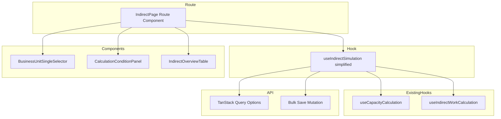
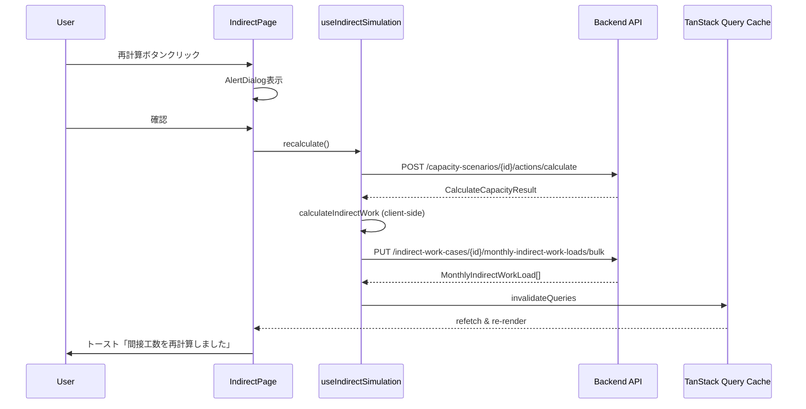

# Design Document: indirect-ux-consolidation

## Overview

**Purpose**: 間接工数管理の2画面（simulation / monthly-loads）を1画面に統合し、primaryケース自動表示・1ボタン再計算・読み取り専用テーブルによるシンプルなUXを実現する。

**Users**: 事業部リーダーが、BUを選択するだけで間接工数の現状を一覧確認し、マスタデータ変更後にワンクリックで再計算できる。

**Impact**: 既存の `/indirect/simulation` と `/indirect/monthly-loads` の2画面を `/indirect` の1画面に統合。ケース選択ドロップダウン・2段階計算・エクスポート/インポート・手動編集を廃止し、コードベースを大幅に簡素化する。

### Goals
- 画面表示時にprimaryケースの保存済みデータを自動表示（ゼロクリック閲覧）
- 再計算を確認ダイアログ付き1ボタンで完了（キャパシティ計算→間接工数計算→保存を内部連続実行）
- 不要機能の廃止によるコードベース簡素化（削除ファイル13+）

### Non-Goals
- バックエンドAPI・DB変更（既存APIをそのまま活用）
- ケース選択機能（primaryケース以外の選択は不要）
- エクスポート/インポート機能の代替（完全廃止）
- 手動編集機能の代替（マスタ変更→再計算で対応）

## Architecture

### Existing Architecture Analysis

**現在のデータフロー**:
1. ユーザーが3つのドロップダウンからケースを手動選択
2. 「キャパシティ計算」ボタンでAPI呼び出し → ローカルステートに結果保持
3. 「間接作業計算」ボタンでクライアントサイド計算 → ローカルステートに結果保持
4. 「保存」ボタンで結果をバルク保存

**問題点**:
- `useIndirectSimulation` が350行で、選択ステート管理・dirty追跡・2段階計算オーケストレーションを複合管理
- 計算結果がローカルステートに保持され、保存済みデータとの二重管理が発生
- monthly-loads画面が保存済みデータの閲覧・編集を別途担当し、関心が分散

**維持する既存パターン**:
- `@` エイリアスによるインポート
- TanStack Query の `queryOptions` パターン + `STALE_TIMES.MEDIUM`
- `findPrimaryId` / `derivePrimaryState` によるprimaryケース検出
- `useCapacityCalculation` / `useIndirectWorkCalculation` による計算ロジック
- `sonner` によるトースト通知
- URLパラメータ `?bu={code}` によるBU選択の永続化

### Architecture Pattern & Boundary Map



**Architecture Integration**:
- **Selected pattern**: 既存フックの簡素化+ルート改修（ハイブリッド）。詳細は `research.md` の Architecture Pattern Evaluation 参照
- **Domain boundaries**: `indirect-case-study` feature 内で完結。他featureへの影響なし
- **Existing patterns preserved**: TanStack Query、primaryケース自動選択、URL params、sonnerトースト
- **New components rationale**: `CalculationConditionPanel`（テキスト表示+リンク、旧CaseSelectSectionの置き換え）、`IndirectOverviewTable`（旧CalculationResultTableの改修）
- **Steering compliance**: feature-first構成、`@` エイリアス、shadcn/uiプリミティブ

### Technology Stack

| Layer | Choice / Version | Role in Feature | Notes |
|-------|------------------|-----------------|-------|
| Frontend | React 19 + TanStack Router + TanStack Query | ルーティング・データフェッチ・キャッシュ | 変更なし |
| UI | shadcn/ui（AlertDialog, Button, Badge） | 確認ダイアログ・操作UI | AlertDialog既存、追加不要 |
| State | TanStack Query キャッシュ | 保存済みデータの直接表示 | ローカルステート管理を廃止しクエリ結果を直接使用 |
| Notification | sonner | トースト通知 | 変更なし |

## System Flows

### 再計算フロー



## Requirements Traceability

| Requirement | Summary | Components | Interfaces | Flows |
|-------------|---------|------------|------------|-------|
| 1.1 | BU横並びタブ表示 | BusinessUnitSingleSelector | — | — |
| 1.2 | BU選択で保存済みデータ表示 | useIndirectSimulation, IndirectOverviewTable | savedLoadsQuery | — |
| 1.3 | 初期表示で先頭BU自動選択 | IndirectPage | URL params | — |
| 1.4 | 選択中BUハイライト | BusinessUnitSingleSelector | — | — |
| 2.1 | primaryケース名テキスト表示 | CalculationConditionPanel | primaryState | — |
| 2.2 | マスタ遷移リンク配置 | CalculationConditionPanel | Link | — |
| 2.3 | マスタ画面遷移 | CalculationConditionPanel | TanStack Router Link | — |
| 2.4 | 未設定時の警告色表示 | CalculationConditionPanel | primaryState | — |
| 2.5 | 全設定時に再計算ボタン有効 | CalculationConditionPanel | canRecalculate | — |
| 2.6 | 未設定時に再計算ボタン無効 | CalculationConditionPanel | canRecalculate | — |
| 3.1 | 月別+年合計カラム | IndirectOverviewTable | — | — |
| 3.2 | 入力セクション表示 | IndirectOverviewTable | headcountQuery, capacityQuery | — |
| 3.3 | 内訳セクション表示 | IndirectOverviewTable | ratiosQuery, workTypesQuery | — |
| 3.4 | 集計セクション表示 | IndirectOverviewTable | — | — |
| 3.5 | 人員数年合計を「-」表示 | IndirectOverviewTable | — | — |
| 3.6 | 全セル読み取り専用 | IndirectOverviewTable | — | — |
| 3.7 | 直接行の表示 | IndirectOverviewTable | — | — |
| 4.1 | データ存在年度のみチップ表示 | IndirectOverviewTable | availableFiscalYears | — |
| 4.2 | アクティブ年度ハイライト | IndirectOverviewTable | — | — |
| 4.3 | 年度チップクリックで切替 | IndirectOverviewTable | fiscalYear state | — |
| 4.4 | テーブル上部に配置 | IndirectOverviewTable | — | — |
| 5.1 | 確認ダイアログ表示 | IndirectPage | AlertDialog | 再計算フロー |
| 5.2 | 確認後に連続計算+保存 | useIndirectSimulation | recalculate() | 再計算フロー |
| 5.3 | 完了後テーブル更新+トースト | useIndirectSimulation, IndirectPage | invalidateQueries | 再計算フロー |
| 5.4 | キャンセルで変更なし | IndirectPage | AlertDialog | — |
| 5.5 | 実行中ローディング表示 | IndirectPage | isRecalculating | — |
| 5.6 | 失敗時エラートースト | useIndirectSimulation | toast.error | — |
| 6.1 | 間接工数メニュー1つ | SidebarNav | — | — |
| 6.2 | /indirect遷移 | SidebarNav | — | — |
| 6.3 | 旧メニュー非表示 | SidebarNav | — | — |
| 7.1 | monthly-loadsルート廃止 | Route files | — | — |
| 7.2-7.7 | 不要機能削除 | 各コンポーネント・フック | — | — |
| 8.1 | 最終計算日時表示 | IndirectOverviewTable | lastCalculatedAt | — |
| 8.2 | 未計算時は非表示 | IndirectOverviewTable | lastCalculatedAt | — |

## Components and Interfaces

| Component | Domain/Layer | Intent | Req Coverage | Key Dependencies | Contracts |
|-----------|-------------|--------|--------------|-----------------|-----------|
| useIndirectSimulation | Hook | primaryケース自動検出+保存済みデータクエリ+1ボタン再計算 | 1.2, 2.1, 2.5, 5.2, 5.3, 5.6 | TanStack Query (P0), useCapacityCalculation (P0), useIndirectWorkCalculation (P0) | State |
| IndirectPage | Route/UI | 画面レイアウト・BU選択・再計算ダイアログ | 1.1, 1.3, 5.1, 5.4, 5.5 | useIndirectSimulation (P0), BusinessUnitSingleSelector (P1) | — |
| CalculationConditionPanel | UI | primaryケース名テキスト表示+マスタリンク+再計算ボタン | 2.1-2.6 | primaryState (P0), TanStack Router Link (P1) | — |
| IndirectOverviewTable | UI | 統合テーブル+年度チップ+最終計算日時 | 3.1-3.7, 4.1-4.4, 8.1-8.2 | クエリデータ (P0) | — |
| SidebarNav | UI | メニュー統合 | 6.1-6.3 | — | — |

### Hook Layer

#### useIndirectSimulation（簡素化）

| Field | Detail |
|-------|--------|
| Intent | primaryケースの自動検出、保存済みデータの並列クエリ、1ボタン再計算の統合実行 |
| Requirements | 1.2, 2.1, 2.5, 5.2, 5.3, 5.6 |

**Responsibilities & Constraints**
- primaryケースIDの自動検出と `derivePrimaryState` の提供
- 保存済みデータ（人員計画・キャパシティ・間接工数）のTanStack Queryによる並列フェッチ
- 1ボタン再計算: キャパシティ計算API呼び出し → クライアントサイド間接工数計算 → バルク保存 → クエリ無効化
- ケース選択ステート・dirty追跡・setterは**廃止**（primaryケースのみ使用）

**Dependencies**
- Inbound: IndirectPage — フック呼び出し (P0)
- Outbound: headcountPlanCasesQueryOptions — primaryケースID取得 (P0)
- Outbound: capacityScenariosQueryOptions — primaryシナリオID取得 (P0)
- Outbound: indirectWorkCasesQueryOptions — primaryケースID取得 (P0)
- Outbound: monthlyHeadcountPlansQueryOptions — 人員データフェッチ (P0)
- Outbound: monthlyCapacitiesQueryOptions — キャパシティデータフェッチ (P0)
- Outbound: monthlyIndirectWorkLoadsQueryOptions — 間接工数データフェッチ (P0)
- Outbound: indirectWorkTypeRatiosQueryOptions — 比率データフェッチ (P0)
- Outbound: useCapacityCalculation — キャパシティ計算 (P0)
- Outbound: useIndirectWorkCalculation — 間接工数計算 (P0)
- Outbound: useBulkSaveMonthlyIndirectWorkLoads — 結果保存 (P0)

**Contracts**: State [x]

##### State Management

```typescript
interface UseIndirectSimulationReturn {
  // primaryケース情報
  primaryHeadcountCaseId: number | null;
  primaryCapacityScenarioId: number | null;
  primaryIndirectWorkCaseId: number | null;
  primaryHeadcountCaseName: string | null;
  primaryCapacityScenarioName: string | null;
  primaryIndirectWorkCaseName: string | null;
  hasPrimaryHeadcountCase: boolean;
  hasPrimaryCapacityScenario: boolean;
  hasPrimaryIndirectWorkCase: boolean;
  canRecalculate: boolean;

  // 保存済みデータ（TanStack Queryから直接）
  monthlyHeadcountPlans: MonthlyHeadcountPlan[];
  monthlyCapacities: MonthlyCapacity[];
  monthlyIndirectWorkLoads: MonthlyIndirectWorkLoad[];
  ratios: IndirectWorkTypeRatio[];

  // ローディング状態
  isLoadingData: boolean;

  // 最終計算日時
  lastCalculatedAt: string | null;

  // 利用可能年度
  availableFiscalYears: number[];

  // 再計算アクション
  recalculate: () => Promise<void>;
  isRecalculating: boolean;
}
```

- **State model**: ケース選択ステートを廃止し、primaryケースIDを派生ステートとして保持。保存済みデータはTanStack Queryのキャッシュから直接参照
- **Persistence**: TanStack Query キャッシュ（`STALE_TIMES.MEDIUM`）
- **Concurrency**: `recalculate` 実行中は `isRecalculating: true` で再実行を防止

**Implementation Notes**
- `recalculate()` は `async` 関数で、キャパシティ計算API→クライアントサイド間接工数計算→バルク保存→クエリ無効化を順次実行。エラー時は `toast.error` で通知し中断
- `availableFiscalYears` は `monthlyIndirectWorkLoads` と `monthlyCapacities` の `yearMonth` から `getFiscalYear()` で抽出し、ソート済み配列として返す
- `lastCalculatedAt` は `monthlyIndirectWorkLoads` のうち `source === "calculated"` のレコードのみを対象に `updatedAt` フィールドの最大値から算出。データが空または該当レコードがない場合は `null`
- 既存の `findPrimaryId` / `derivePrimaryState` をそのまま使用
- BU変更時はクエリキーが変わるためTanStack Queryが自動的にリフェッチ（手動リセット不要）

### Route Layer

#### IndirectPage

| Field | Detail |
|-------|--------|
| Intent | 画面レイアウト構成、BU選択のURL管理、再計算確認ダイアログの表示制御 |
| Requirements | 1.1, 1.3, 5.1, 5.4, 5.5 |

**Implementation Notes**
- ルートパス: `/indirect` → `routes/indirect/index.tsx` + `routes/indirect/index.lazy.tsx`
- Search params: `z.object({ bu: z.string().catch("").default("") })`（既存パターン維持）
- レイアウト構成（100行前後）:
  - ヘッダー: 「間接工数」タイトル
  - BU選択行: `BusinessUnitSingleSelector`（既存コンポーネントそのまま）
  - 計算条件パネル: `CalculationConditionPanel`（新規）
  - 結果テーブル: `IndirectOverviewTable`（既存 `CalculationResultTable` の改修）
- `AlertDialog` の状態管理（`open` / `setOpen`）はルートコンポーネント内でローカル管理

### UI Components Layer

#### CalculationConditionPanel

| Field | Detail |
|-------|--------|
| Intent | primaryケース名のテキスト表示、マスタ画面遷移リンク、再計算ボタン |
| Requirements | 2.1, 2.2, 2.3, 2.4, 2.5, 2.6 |

```typescript
interface CalculationConditionPanelProps {
  // 各エンティティのprimaryケース名（null = 未設定）
  headcountPlanCaseName: string | null;
  capacityScenarioName: string | null;
  indirectWorkCaseName: string | null;
  // 再計算
  canRecalculate: boolean;
  isRecalculating: boolean;
  onRecalculate: () => void;
}
```

**Implementation Notes**
- 3つの条件項目を横並び（`grid-cols-3`）で表示
- 各項目: ラベル + ケース名テキスト + `→` アイコン（`Link` to master page）
- ケース名が `null` の場合: 「未設定」を `text-amber-600` で表示、`→` はマスタ画面への遷移リンク
- 再計算ボタン: `canRecalculate` が `false` の場合は `disabled`、`isRecalculating` 中は `Loader2` アイコン表示
- マスタ画面パス: 人員計画→`/master/headcount-plans`、稼働時間→`/master/capacity-scenarios`、間接作業→`/master/indirect-work-cases`

#### IndirectOverviewTable（既存 CalculationResultTable の改修）

| Field | Detail |
|-------|--------|
| Intent | 人員/キャパ/内訳/間接計/直接の統合読み取り専用テーブル + 年度チップ + 最終計算日時 |
| Requirements | 3.1-3.7, 4.1-4.4, 8.1-8.2 |

```typescript
interface IndirectOverviewTableProps {
  monthlyHeadcountPlans: MonthlyHeadcountPlan[];
  monthlyCapacities: MonthlyCapacity[];
  monthlyIndirectWorkLoads: MonthlyIndirectWorkLoad[];
  ratios: IndirectWorkTypeRatio[];
  workTypes: WorkType[];
  // 年度
  availableFiscalYears: number[];
  fiscalYear: number;
  onFiscalYearChange: (year: number) => void;
  // 最終計算日時
  lastCalculatedAt: string | null;
}
```

**Implementation Notes**
- 既存 `CalculationResultTable` をリネーム・改修。propsインターフェースを上記に変更
- **空状態**: `monthlyCapacities` と `monthlyIndirectWorkLoads` が共に空配列の場合、テーブルの代わりに「再計算を実行してデータを生成してください」というメッセージを表示する。primaryケース未設定の場合は「計算条件のケースを設定してください」と表示する
- **年度チップ**: `Select` コンポーネントを廃止し、`availableFiscalYears` を横並びの `Button variant="outline"` で表示。アクティブ年度は `variant="default"` でハイライト。データが空の場合は現在年度のみ表示
- **テーブル行構成**:
  - 人員数（人）: `monthlyHeadcountPlans` から。年合計は「-」
  - キャパシティ（時間）: `monthlyCapacities` から
  - 間接内訳（折りたたみ可能）: `ratios` × capacity で算出（既存ロジック維持）
  - 間接計（時間）: `monthlyIndirectWorkLoads` から
  - **直接（時間）**: キャパシティ − 間接計（新規追加行）
- **最終計算日時**: テーブル下部に `ⓘ 最終計算: YYYY-MM-DD HH:mm` をグレーテキストで表示。`lastCalculatedAt` が `null` の場合は非表示
- 全セル読み取り専用（`<td>` のみ、`<input>` なし）
- 条件サマリー（旧テーブル上部のケース名表示）は `CalculationConditionPanel` に移行するため削除

#### SidebarNav（既存改修）

| Field | Detail |
|-------|--------|
| Intent | 間接工数関連メニューを1項目に統合 |
| Requirements | 6.1, 6.2, 6.3 |

**Implementation Notes**
- 「間接作業管理」配下を以下に変更:
  - 「間接工数」→ `/indirect`（1メニューのみ）
- 旧「間接工数計算」（`/indirect/simulation`）と「月次間接工数」（`/indirect/monthly-loads`）を削除

## Data Models

### Domain Model

データモデルに変更なし。既存の以下のエンティティをそのまま使用:

- `HeadcountPlanCase`（isPrimary フラグあり）→ `MonthlyHeadcountPlan`
- `CapacityScenario`（isPrimary フラグあり）→ `MonthlyCapacity`
- `IndirectWorkCase`（isPrimary フラグあり）→ `IndirectWorkTypeRatio`, `MonthlyIndirectWorkLoad`

### Data Contracts & Integration

**API Data Transfer**: 変更なし。既存の以下のエンドポイントをそのまま使用:
- `GET /headcount-plan-cases` — ケースリスト（isPrimary検出用）
- `GET /capacity-scenarios` — シナリオリスト（isPrimary検出用）
- `GET /indirect-work-cases` — ケースリスト（isPrimary検出用）
- `GET /headcount-plan-cases/{id}/monthly-headcount-plans` — 人員データ
- `GET /capacity-scenarios/{id}/monthly-capacities` — キャパシティデータ
- `GET /indirect-work-cases/{id}/monthly-indirect-work-loads` — 間接工数データ
- `GET /indirect-work-cases/{id}/indirect-work-type-ratios` — 比率データ
- `POST /capacity-scenarios/{id}/actions/calculate` — キャパシティ計算
- `PUT /indirect-work-cases/{id}/monthly-indirect-work-loads/bulk` — 間接工数バルク保存

## Error Handling

### Error Strategy
- 再計算フロー中のエラー: `toast.error` で通知し処理を中断。テーブルは変更前の保存済みデータを維持
- データフェッチエラー: TanStack Queryのデフォルトリトライ（3回）に委ねる。ローディング中は `Loader2` 表示
- primaryケース未設定: 警告色テキスト表示 + 再計算ボタン無効化（エラーではなく状態表示）

## Testing Strategy

### Unit Tests
- `useIndirectSimulation` フックのリファクタリング後の動作確認:
  - primaryケースの自動検出
  - `canRecalculate` の条件判定
  - `recalculate()` の連続実行フロー
  - `availableFiscalYears` の年度抽出ロジック
  - `lastCalculatedAt` の算出ロジック

### Integration Tests
- BU切り替え時のクエリ再実行とテーブル更新
- 再計算→クエリ無効化→テーブル自動更新の一連フロー
- primaryケース未設定時の警告表示と再計算ボタン無効化

## File Change Summary

### 新規作成
| File | Purpose |
|------|---------|
| `routes/indirect/index.tsx` | ルート設定（search params） |
| `routes/indirect/index.lazy.tsx` | IndirectPage ルートコンポーネント |
| `components/CalculationConditionPanel.tsx` | 計算条件パネル |

### 改修
| File | Change |
|------|--------|
| `hooks/useIndirectSimulation.ts` | 大幅簡素化（350行→150行程度） |
| `components/CalculationResultTable.tsx` | IndirectOverviewTable に改修（年度チップ、直接行、propsインターフェース変更） |
| `components/layout/SidebarNav.tsx` | メニュー統合 |
| `features/indirect-case-study/index.ts` | パブリックAPI整理（不要エクスポート削除） |

### 削除
| File | Reason |
|------|--------|
| `routes/indirect/simulation/index.tsx` | ルート統合 |
| `routes/indirect/simulation/index.lazy.tsx` | ルート統合 |
| `routes/indirect/monthly-loads/index.tsx` | 画面廃止 |
| `routes/indirect/monthly-loads/index.lazy.tsx` | 画面廃止 |
| `components/ResultPanel.tsx` | 不要（エクスポート/インポート/保存UIを含む） |
| `components/MonthlyLoadsMatrix.tsx` | 不要（手動編集UI） |
| `components/HeadcountPlanCaseChips.tsx` | 不要（ケース選択UI） |
| `components/IndirectWorkCaseChips.tsx` | 不要（ケース選択UI） |
| `hooks/useMonthlyLoadsPage.ts` | 不要（monthly-loads画面用） |
| `hooks/useExcelExport.ts` | 不要（エクスポート機能） |
| `hooks/useIndirectWorkLoadExcelExport.ts` | 不要（エクスポート機能） |
| `hooks/useIndirectWorkLoadExcelImport.ts` | 不要（インポート機能） |
