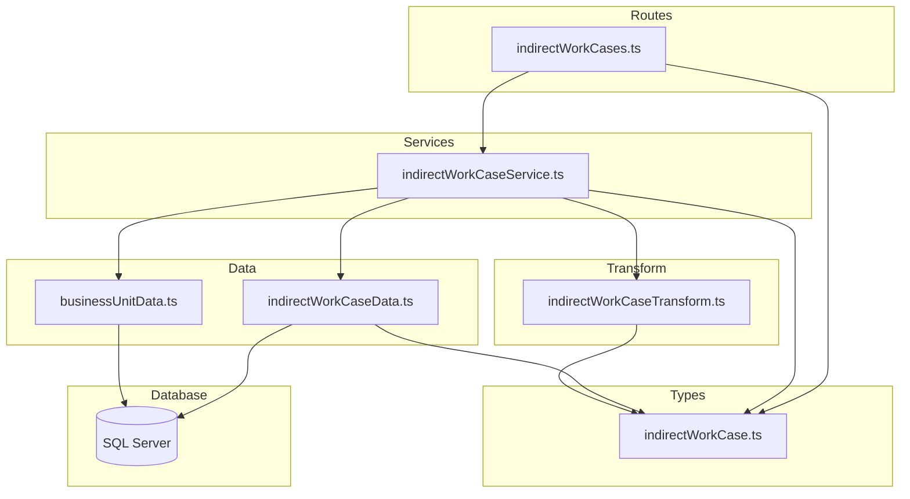
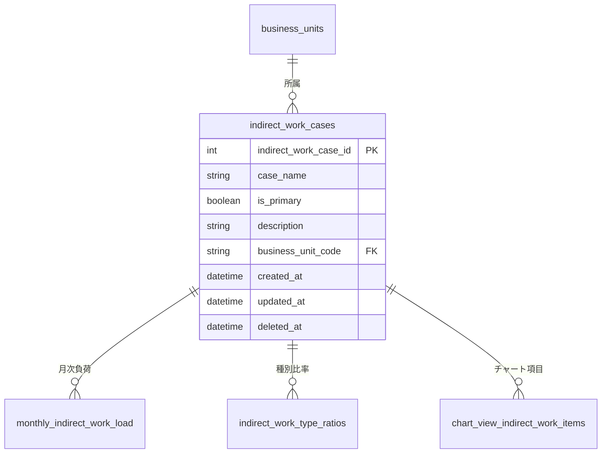

# Design Document: indirect-work-cases-crud-api

## Overview

**Purpose**: 間接作業ケース（indirect_work_cases）のCRUD APIを提供し、事業部リーダーが間接作業の工数計画シナリオの登録・参照・更新・削除を行えるようにする。

**Users**: 事業部リーダー、フロントエンド開発者が、間接作業ケースの管理画面やAPI連携で利用する。

**Impact**: headcount_plan_cases と同一のレイヤードアーキテクチャパターンを踏襲し、`business_unit_code` NOT NULL 制約と3テーブル参照チェックの差分に対応する。

### Goals
- indirect_work_cases テーブルに対する完全なCRUD操作（一覧・単一取得・作成・更新・論理削除・復元）の提供
- 外部キー（business_unit_code）に対応するビジネスユニット名をJOINで取得しレスポンスに含める
- 既存のレイヤードアーキテクチャパターン（routes → services → data → transform → types）への準拠

### Non-Goals
- monthly_indirect_work_load / indirect_work_type_ratios（子テーブル）のCRUD操作
- ビジネスユニットのフィルタリング・検索機能
- フロントエンド実装
- バッチ処理・非同期処理

## Architecture

### Existing Architecture Analysis

headcount_plan_cases の CRUD API が先行実装されており、同一のレイヤード構成を採用する。主な差分は以下の通り：

- `business_unit_code` が **NOT NULL**（headcount_plan_cases では NULL 許可）
- 削除時の参照チェック対象が `monthly_indirect_work_load`, `indirect_work_type_ratios`, `chart_view_indirect_work_items` の3テーブル
- 作成時の `businessUnitCode` が必須フィールド

### Architecture Pattern & Boundary Map



**Architecture Integration**:
- **Selected pattern**: 既存のレイヤードアーキテクチャを踏襲
- **Domain/feature boundaries**: indirectWorkCase の各層ファイルが責務を分離。外部キーチェックには既存の businessUnitData を再利用
- **Existing patterns preserved**: validate ミドルウェア、problemResponse ヘルパー、paginationQuerySchema
- **New components rationale**: 5ファイル（types, data, transform, service, routes）は既存パターンの直接的な拡張
- **Steering compliance**: レイヤー間の依存方向（routes → services → data）を厳守

### Technology Stack

| Layer | Choice / Version | Role in Feature | Notes |
|-------|------------------|-----------------|-------|
| Backend | Hono v4 | ルーティング・ミドルウェア | 既存と同一 |
| Validation | Zod + @hono/zod-validator | リクエストバリデーション | 既存と同一 |
| Data | mssql | SQL Server クエリ実行 | LEFT JOIN追加 |
| Test | Vitest | ユニットテスト | 既存と同一 |

## Requirements Traceability

| Requirement | Summary | Components | Interfaces | Notes |
|-------------|---------|------------|------------|-------|
| 1.1, 1.2, 1.3, 1.4, 1.5 | 一覧取得（ページネーション・JOIN・ソフトデリートフィルタ） | Data, Transform, Service, Routes | API: GET / | LEFT JOIN で businessUnitName 取得 |
| 2.1, 2.2, 2.3, 2.4 | 単一取得（JOIN・404処理） | Data, Transform, Service, Routes | API: GET /:id | |
| 3.1, 3.2, 3.3, 3.4, 3.5 | 新規作成（バリデーション・FK存在チェック） | Data, Service, Routes, Types | API: POST / | businessUnitCode 必須 |
| 4.1, 4.2, 4.3, 4.4, 4.5 | 更新（部分更新・FK存在チェック） | Data, Service, Routes, Types | API: PUT /:id | businessUnitCode は optional だが nullable 不可 |
| 5.1, 5.2, 5.3, 5.4 | 論理削除（参照チェック） | Data, Service, Routes | API: DELETE /:id | 3テーブル参照チェック |
| 6.1, 6.2, 6.3 | 復元 | Data, Service, Routes | API: POST /:id/actions/restore | |
| 7.1, 7.2, 7.3, 7.4, 7.5 | レスポンス形式 | Transform, Routes | 全エンドポイント | RFC 9457、camelCase |
| 8.1, 8.2, 8.3, 8.4 | バリデーション | Types, Routes | Zod スキーマ | |
| 9.1, 9.2, 9.3, 9.4 | テスト | テストファイル | Vitest | |

## Components and Interfaces

| Component | Domain/Layer | Intent | Req Coverage | Key Dependencies | Contracts |
|-----------|-------------|--------|--------------|------------------|-----------|
| indirectWorkCase.ts | Types | Zodスキーマ・型定義 | 7, 8 | pagination.ts (P0) | — |
| indirectWorkCaseData.ts | Data | SQLクエリ実行 | 1, 2, 3, 4, 5, 6 | database/client (P0) | Service |
| indirectWorkCaseTransform.ts | Transform | Row→Response変換 | 7 | types (P0) | — |
| indirectWorkCaseService.ts | Service | ビジネスロジック | 1–6 | Data (P0), Transform (P0), businessUnitData (P1) | Service |
| indirectWorkCases.ts | Routes | HTTPエンドポイント | 1–8 | Service (P0), Types (P0), validate (P0) | API |

### Types Layer

#### indirectWorkCase.ts

| Field | Detail |
|-------|--------|
| Intent | Zodバリデーションスキーマとリクエスト・レスポンス・DB行のTypeScript型を定義 |
| Requirements | 7.4, 7.5, 8.1, 8.2, 8.3, 8.4 |

**Contracts**: State [x]

##### State Management

```typescript
// --- Zod スキーマ ---

/** 作成用スキーマ */
// createIndirectWorkCaseSchema
// - caseName: string, min(1), max(100) — 必須
// - isPrimary: boolean, default(false) — 任意
// - description: string, max(500), optional, nullable — 任意
// - businessUnitCode: string, min(1), max(20), regex(/^[a-zA-Z0-9_-]+$/) — 必須

/** 更新用スキーマ */
// updateIndirectWorkCaseSchema
// - caseName: string, min(1), max(100), optional — 任意
// - isPrimary: boolean, optional — 任意
// - description: string, max(500), optional, nullable — 任意
// - businessUnitCode: string, min(1), max(20), regex(/^[a-zA-Z0-9_-]+$/), optional — 任意（省略可だが null 不可）

/** 一覧取得クエリスキーマ */
// indirectWorkCaseListQuerySchema = paginationQuerySchema.extend({
//   'filter[includeDisabled]': z.coerce.boolean().default(false)
// })

// --- TypeScript 型 ---

type CreateIndirectWorkCase = z.infer<typeof createIndirectWorkCaseSchema>
type UpdateIndirectWorkCase = z.infer<typeof updateIndirectWorkCaseSchema>
type IndirectWorkCaseListQuery = z.infer<typeof indirectWorkCaseListQuerySchema>

/** DB行型（snake_case） */
type IndirectWorkCaseRow = {
  indirect_work_case_id: number
  case_name: string
  is_primary: boolean
  description: string | null
  business_unit_code: string
  business_unit_name: string | null  // LEFT JOIN で取得（BU論理削除時にnull）
  created_at: Date
  updated_at: Date
  deleted_at: Date | null
}

/** APIレスポンス型（camelCase） */
type IndirectWorkCase = {
  indirectWorkCaseId: number
  caseName: string
  isPrimary: boolean
  description: string | null
  businessUnitCode: string
  businessUnitName: string | null  // JOINで取得した名称（BU論理削除時にnull）
  createdAt: string   // ISO 8601
  updatedAt: string   // ISO 8601
}
```

**Implementation Notes**:
- `business_unit_code` は DB 上 NOT NULL のため、Row 型でも `string`（null 不可）
- `business_unit_name` は LEFT JOIN の結果であり、BU が論理削除された場合に null になりうる
- 更新スキーマの `businessUnitCode` は optional だが nullable ではない（headcount_plan_cases との差分）

---

### Data Layer

#### indirectWorkCaseData.ts

| Field | Detail |
|-------|--------|
| Intent | indirect_work_cases テーブルへのSQLクエリ実行。business_units とのLEFT JOINを含む |
| Requirements | 1.1, 1.2, 1.3, 1.4, 2.1, 2.3, 2.4, 3.1, 4.1, 5.1, 5.2, 5.4, 6.1, 6.2 |

**Dependencies**:
- Inbound: indirectWorkCaseService — CRUDオペレーション (P0)
- External: mssql / database/client — DB接続 (P0)

**Contracts**: Service [x]

##### Service Interface

```typescript
interface IndirectWorkCaseDataInterface {
  findAll(params: {
    page: number
    pageSize: number
    includeDisabled: boolean
  }): Promise<{ items: IndirectWorkCaseRow[]; totalCount: number }>

  findById(id: number): Promise<IndirectWorkCaseRow | undefined>

  findByIdIncludingDeleted(id: number): Promise<IndirectWorkCaseRow | undefined>

  create(data: {
    caseName: string
    isPrimary: boolean
    description: string | null
    businessUnitCode: string
  }): Promise<IndirectWorkCaseRow>

  update(id: number, data: {
    caseName?: string
    isPrimary?: boolean
    description?: string | null
    businessUnitCode?: string
  }): Promise<IndirectWorkCaseRow | undefined>

  softDelete(id: number): Promise<IndirectWorkCaseRow | undefined>

  restore(id: number): Promise<IndirectWorkCaseRow | undefined>

  hasReferences(id: number): Promise<boolean>
}
```

- **Preconditions**: DB接続が確立されていること
- **Postconditions**: 各メソッドは指定された条件に合致するレコードを返す。見つからない場合は undefined
- **Invariants**: すべてのクエリはパラメータ化されている（SQLインジェクション防止）

**Implementation Notes**:
- `findAll` / `findById`: `LEFT JOIN business_units bu ON iwc.business_unit_code = bu.business_unit_code AND bu.deleted_at IS NULL` でビジネスユニット名を取得
- `create`: INSERT 後に `findById` を呼び出して JOIN 結果を含む完全な Row を返す
- `update`: UPDATE 後に `findById` を呼び出す
- `softDelete` / `restore`: OUTPUT 句で直接返却
- `hasReferences`: `monthly_indirect_work_load`, `indirect_work_type_ratios`, `chart_view_indirect_work_items` の3テーブルに対する EXISTS チェックを OR 結合で1クエリに集約

---

### Transform Layer

#### indirectWorkCaseTransform.ts

| Field | Detail |
|-------|--------|
| Intent | IndirectWorkCaseRow（snake_case）→ IndirectWorkCase（camelCase）の変換 |
| Requirements | 7.4, 7.5 |

**Implementation Notes**:
- snake_case → camelCase のフィールドマッピング
- `created_at` / `updated_at` を `.toISOString()` で ISO 8601 文字列に変換
- `business_unit_name` → `businessUnitName` のマッピング（null 許容）

---

### Service Layer

#### indirectWorkCaseService.ts

| Field | Detail |
|-------|--------|
| Intent | CRUD操作のビジネスロジック。外部キー存在チェック・参照整合性チェック・エラーハンドリングを担当 |
| Requirements | 1.1–1.5, 2.1–2.4, 3.1–3.5, 4.1–4.5, 5.1–5.4, 6.1–6.3 |

**Dependencies**:
- Inbound: indirectWorkCases route — HTTPハンドラ (P0)
- Outbound: indirectWorkCaseData — DB操作 (P0)
- Outbound: indirectWorkCaseTransform — レスポンス変換 (P0)
- Outbound: businessUnitData.findByCode — FK存在チェック (P1)

**Contracts**: Service [x]

##### Service Interface

```typescript
interface IndirectWorkCaseServiceInterface {
  findAll(params: {
    page: number
    pageSize: number
    includeDisabled: boolean
  }): Promise<{ items: IndirectWorkCase[]; totalCount: number }>

  findById(id: number): Promise<IndirectWorkCase>
  // throws HTTPException(404) if not found

  create(data: CreateIndirectWorkCase): Promise<IndirectWorkCase>
  // throws HTTPException(422) if businessUnitCode invalid

  update(id: number, data: UpdateIndirectWorkCase): Promise<IndirectWorkCase>
  // throws HTTPException(404) if not found
  // throws HTTPException(422) if businessUnitCode invalid

  delete(id: number): Promise<void>
  // throws HTTPException(404) if not found
  // throws HTTPException(409) if has references

  restore(id: number): Promise<IndirectWorkCase>
  // throws HTTPException(404) if not found or not deleted
}
```

- **Preconditions**: 各メソッドの引数がバリデーション済みであること（ルート層で実施）
- **Postconditions**: 成功時は変換済みレスポンスを返す。失敗時は適切な HTTPException をスロー
- **Invariants**: businessUnitCode が指定された場合、必ず business_units テーブルに存在確認を行う

**Implementation Notes**:
- `create`: businessUnitCode は必須のため、常に `businessUnitData.findByCode()` で存在チェックを実行。存在しなければ HTTPException(422) をスロー
- `update`: businessUnitCode が指定されている場合のみ存在チェック。省略時は既存値を維持
- `delete`: `indirectWorkCaseData.hasReferences()` で3テーブルの参照チェック後、`softDelete()` を実行
- `restore`: `findByIdIncludingDeleted()` で存在・削除状態を確認後、`restore()` を実行

---

### Routes Layer

#### indirectWorkCases.ts

| Field | Detail |
|-------|--------|
| Intent | HTTPエンドポイント定義。バリデーション・レスポンス整形を担当 |
| Requirements | 1.1–1.5, 2.1–2.4, 3.1–3.2, 4.1, 5.1, 6.1, 7.1–7.3, 8.1–8.4 |

**Contracts**: API [x]

##### API Contract

| Method | Endpoint | Request | Response | Status | Errors |
|--------|----------|---------|----------|--------|--------|
| GET | / | IndirectWorkCaseListQuery (query) | `{ data: IndirectWorkCase[], meta: { pagination } }` | 200 | 422 |
| GET | /:id | id: number (path) | `{ data: IndirectWorkCase }` | 200 | 404 |
| POST | / | CreateIndirectWorkCase (json) | `{ data: IndirectWorkCase }` + Location header | 201 | 422 |
| PUT | /:id | id: number (path) + UpdateIndirectWorkCase (json) | `{ data: IndirectWorkCase }` | 200 | 404, 422 |
| DELETE | /:id | id: number (path) | (no body) | 204 | 404, 409 |
| POST | /:id/actions/restore | id: number (path) | `{ data: IndirectWorkCase }` | 200 | 404 |

**Implementation Notes**:
- ルートを `app.route('/indirect-work-cases', indirectWorkCases)` で index.ts にマウント
- メソッドチェーンでルートを定義し、`IndirectWorkCasesRoute` 型をエクスポート
- パスパラメータ `:id` は各ハンドラ内で `Number(c.req.param('id'))` で取得

## Data Models

### Domain Model



**Business Rules & Invariants**:
- indirect_work_case_id は自動採番（IDENTITY）、変更不可
- business_unit_code は NOT NULL — 必ず事業部に紐づく
- is_primary はデフォルト false
- 論理削除（deleted_at）のあるレコードは通常のクエリから除外
- 削除前に monthly_indirect_work_load, indirect_work_type_ratios, chart_view_indirect_work_items への参照がないことを確認

### Physical Data Model

対象テーブル `indirect_work_cases` のスキーマは `docs/database/table-spec.md` に定義済み。新規テーブル作成やスキーマ変更は不要。

### Data Contracts & Integration

**API Data Transfer**:

レスポンス例（単一取得）:
```json
{
  "data": {
    "indirectWorkCaseId": 1,
    "caseName": "標準ケース",
    "isPrimary": true,
    "description": "間接作業の標準工数計画",
    "businessUnitCode": "plant",
    "businessUnitName": "プラント事業",
    "createdAt": "2026-01-31T00:00:00.000Z",
    "updatedAt": "2026-01-31T00:00:00.000Z"
  }
}
```

レスポンス例（一覧取得）:
```json
{
  "data": [
    {
      "indirectWorkCaseId": 1,
      "caseName": "標準ケース",
      "isPrimary": true,
      "description": null,
      "businessUnitCode": "plant",
      "businessUnitName": "プラント事業",
      "createdAt": "2026-01-31T00:00:00.000Z",
      "updatedAt": "2026-01-31T00:00:00.000Z"
    }
  ],
  "meta": {
    "pagination": {
      "currentPage": 1,
      "pageSize": 20,
      "totalItems": 1,
      "totalPages": 1
    }
  }
}
```

## Error Handling

### Error Strategy

既存のグローバルエラーハンドラ（index.ts の `app.onError`）と RFC 9457 Problem Details 形式に従う。サービス層から HTTPException をスローし、グローバルハンドラが統一的に処理する。

### Error Categories and Responses

| Status | Type | Trigger | Detail |
|--------|------|---------|--------|
| 404 | resource-not-found | ID不存在、論理削除済み | `Indirect work case with ID '{id}' not found` |
| 409 | conflict | 参照整合性違反（削除時） | `Indirect work case with ID '{id}' is referenced by other resources and cannot be deleted` |
| 422 | validation-error | Zodバリデーション失敗 | errors 配列にフィールド別詳細 |
| 422 | validation-error | businessUnitCode 不存在 | `Business unit with code '{code}' not found` |

## Testing Strategy

### Unit Tests

テストファイルの配置は既存パターンに従い `src/__tests__/` にソース構造をミラーする。

#### routes/indirectWorkCases.test.ts
- GET / — 一覧取得（200、ページネーション検証、空リスト）
- GET /:id — 単一取得（200、404）
- POST / — 作成（201、Location ヘッダ、422 バリデーションエラー、422 businessUnitCode不存在）
- PUT /:id — 更新（200、404、422）
- DELETE /:id — 削除（204、404、409 参照整合性）
- POST /:id/actions/restore — 復元（200、404）

#### services/indirectWorkCaseService.test.ts
- findAll — データ層呼び出しとTransform適用の検証
- findById — 正常系と404例外の検証
- create — FK存在チェックと422例外の検証
- update — 部分更新とFK存在チェックの検証
- delete — 参照チェック（3テーブル）と409例外の検証
- restore — 削除状態チェックの検証

#### data/indirectWorkCaseData.test.ts
- findAll — LEFT JOIN 含むSQL実行とページネーション
- findById — パラメータ化クエリの検証
- create — INSERT + findById の連携
- update — 動的SET句の生成
- softDelete / restore — deleted_at の操作
- hasReferences — 3テーブルへの EXISTS チェック

**テストパターン**:
- `vi.mock()` でサービス層・データ層をモック
- `app.request()` でHTTPリクエストをシミュレート
- mssql の `getPool` / `request` / `input` / `query` をモック
