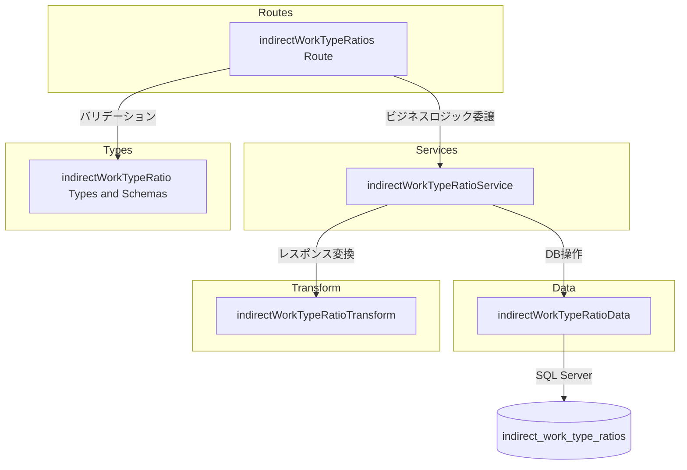

# Technical Design: indirect-work-type-ratios-crud-api

## Overview

**Purpose**: 間接作業ケース配下の作業種別ごとの年度別配分比率を管理する CRUD API を提供する。
**Users**: 事業部リーダーおよび API 利用者が、間接作業の配分比率の参照・設定・一括更新に使用する。
**Impact**: 既存の `/indirect-work-cases` ルート配下にネストリソースとして新規 API を追加する。既存コードへの変更は `index.ts` のルート登録のみ。

### Goals
- `indirect_work_type_ratios` テーブルに対する完全な CRUD 操作の提供
- 既存の `projectLoads` API と一貫したネストリソースパターンの維持
- バルク Upsert によるの効率的な一括操作の提供

### Non-Goals
- 配分比率の合計が 1.0 であることのバリデーション（ビジネスルールとしては将来検討）
- 間接作業ケース自体の CRUD（既存 API で対応済み）
- フロントエンド実装

## Architecture

### Existing Architecture Analysis

既存のファクトテーブル CRUD（`projectLoads`）と同一の4層レイヤードアーキテクチャを踏襲する。

- **routes 層**: Hono ルーター、リクエスト検証、レスポンス整形
- **services 層**: ビジネスロジック、存在確認、重複チェック
- **data 層**: SQL Server への直接クエリ（mssql ライブラリ）
- **transform 層**: DB 行（snake_case）→ API レスポンス（camelCase）変換

既存パターンとの差異は、ユニーク制約が3カラム複合キー（`indirect_work_case_id` + `work_type_code` + `fiscal_year`）である点のみ。

### Architecture Pattern & Boundary Map



**Architecture Integration**:
- Selected pattern: レイヤードアーキテクチャ（既存踏襲）
- Domain boundaries: routes → services → data の単方向依存
- Existing patterns preserved: ネストリソース、物理削除、バルク Upsert
- New components rationale: 各層に1ファイルずつ追加（projectLoads と同構成）
- Steering compliance: `structure.md` のバックエンド構成規約に準拠

### Technology Stack

| Layer | Choice / Version | Role in Feature | Notes |
|-------|------------------|-----------------|-------|
| Backend | Hono v4 | HTTP ルーティング・ミドルウェア | 既存 |
| Validation | Zod | リクエストボディ・パスパラメータ検証 | 既存 |
| Data | mssql | SQL Server クエリ実行 | 既存 |
| Testing | Vitest | ユニットテスト | 既存 |

新規依存なし。すべて既存スタック内で完結する。

## Requirements Traceability

| Requirement | Summary | Components | Interfaces | Flows |
|-------------|---------|------------|------------|-------|
| 1.1 - 1.4 | 一覧取得 | Route, Service, Data, Transform | GET / → findAll | - |
| 2.1 - 2.4 | 単一取得 | Route, Service, Data, Transform | GET /:id → findById | - |
| 3.1 - 3.6 | 新規作成 | Route, Service, Data, Transform | POST / → create | 親存在確認 → ユニーク検証 → workType検証 → INSERT |
| 4.1 - 4.5 | 更新 | Route, Service, Data, Transform | PUT /:id → update | 存在確認 → ユニーク検証 → UPDATE |
| 5.1 - 5.4 | 削除 | Route, Service, Data | DELETE /:id → delete | 存在確認 → DELETE |
| 6.1 - 6.6 | 一括登録・更新 | Route, Service, Data, Transform | PUT /bulk → bulkUpsert | 親存在確認 → 重複検証 → MERGE |
| 7.1 - 7.5 | バリデーション | Types (Zod Schemas), Route | Zod スキーマ | - |
| 8.1 - 8.5 | レスポンス形式 | Transform, Route | toResponse 関数 | - |

## Components and Interfaces

| Component | Domain/Layer | Intent | Req Coverage | Key Dependencies | Contracts |
|-----------|-------------|--------|--------------|-----------------|-----------|
| indirectWorkTypeRatios Route | Routes | HTTP エンドポイント定義 | 1-6, 7.4-7.5 | Service (P0), Types (P0) | API |
| indirectWorkTypeRatioService | Services | ビジネスロジック | 1-6, 3.5-3.6, 4.5 | Data (P0), Transform (P0) | Service |
| indirectWorkTypeRatioData | Data | SQL クエリ実行 | 1-6 | mssql (P0) | - |
| indirectWorkTypeRatioTransform | Transform | DB行→レスポンス変換 | 8.3-8.5 | Types (P0) | - |
| indirectWorkTypeRatio Types | Types | Zod スキーマ・型定義 | 7.1-7.3, 8.3-8.5 | Zod (P0) | - |

### Types Layer

#### indirectWorkTypeRatio Types

| Field | Detail |
|-------|--------|
| Intent | Zod スキーマによるバリデーション定義と TypeScript 型の一元管理 |
| Requirements | 7.1, 7.2, 7.3, 8.3, 8.4, 8.5 |

**Responsibilities & Constraints**
- 作成・更新・バルク操作のリクエストスキーマ定義
- DB 行型（snake_case）と API レスポンス型（camelCase）の定義
- ratio は `z.number().min(0).max(1)` で検証（小数精度は DB 側で担保）

**Contracts**: Service [x]

##### Service Interface

```typescript
// Zod スキーマ
const createIndirectWorkTypeRatioSchema: z.ZodObject<{
  workTypeCode: z.ZodString        // max 20 chars
  fiscalYear: z.ZodNumber          // integer
  ratio: z.ZodNumber               // 0.0000 - 1.0000
}>

const updateIndirectWorkTypeRatioSchema: z.ZodObject<{
  workTypeCode: z.ZodOptional<z.ZodString>
  fiscalYear: z.ZodOptional<z.ZodNumber>
  ratio: z.ZodOptional<z.ZodNumber>
}>

const bulkUpsertIndirectWorkTypeRatioSchema: z.ZodObject<{
  items: z.ZodArray<z.ZodObject<{
    workTypeCode: z.ZodString
    fiscalYear: z.ZodNumber
    ratio: z.ZodNumber
  }>>
}>

// DB 行型
type IndirectWorkTypeRatioRow = {
  indirect_work_type_ratio_id: number
  indirect_work_case_id: number
  work_type_code: string
  fiscal_year: number
  ratio: number
  created_at: Date
  updated_at: Date
}

// API レスポンス型
type IndirectWorkTypeRatio = {
  indirectWorkTypeRatioId: number
  indirectWorkCaseId: number
  workTypeCode: string
  fiscalYear: number
  ratio: number
  createdAt: string
  updatedAt: string
}
```

### Routes Layer

#### indirectWorkTypeRatios Route

| Field | Detail |
|-------|--------|
| Intent | HTTP エンドポイント定義とリクエスト受付 |
| Requirements | 1.1-1.4, 2.1-2.4, 3.1-3.3, 4.1-4.3, 5.1-5.4, 6.1-6.4, 7.4-7.5 |

**Responsibilities & Constraints**
- Hono ルーターインスタンスの定義
- パスパラメータの解析と正の整数バリデーション
- Zod バリデーションミドルウェアの適用
- HTTP ステータスコードの適切な設定
- `/bulk` ルートを `/:indirectWorkTypeRatioId` より前に定義（ルート優先順位）

**Dependencies**
- Inbound: index.ts — ルート登録 (P0)
- Outbound: indirectWorkTypeRatioService — ビジネスロジック委譲 (P0)
- Outbound: Types — Zod スキーマ (P0)

**Contracts**: API [x]

##### API Contract

| Method | Endpoint | Request | Response | Errors |
|--------|----------|---------|----------|--------|
| GET | / | - | `{ data: IndirectWorkTypeRatio[] }` | 404 |
| GET | /:indirectWorkTypeRatioId | - | `{ data: IndirectWorkTypeRatio }` | 404 |
| POST | / | CreateIndirectWorkTypeRatio | `{ data: IndirectWorkTypeRatio }` | 404, 409, 422 |
| PUT | /:indirectWorkTypeRatioId | UpdateIndirectWorkTypeRatio | `{ data: IndirectWorkTypeRatio }` | 404, 409, 422 |
| DELETE | /:indirectWorkTypeRatioId | - | 204 No Content | 404 |
| PUT | /bulk | BulkUpsertIndirectWorkTypeRatio | `{ data: IndirectWorkTypeRatio[] }` | 404, 422 |

ベースパス: `/indirect-work-cases/:indirectWorkCaseId/indirect-work-type-ratios`

**Implementation Notes**
- Integration: `index.ts` に `app.route('/indirect-work-cases/:indirectWorkCaseId/indirect-work-type-ratios', indirectWorkTypeRatios)` を追加
- Validation: `parseIntParam` ヘルパーでパスパラメータ検証（既存パターン）
- Risks: なし

### Services Layer

#### indirectWorkTypeRatioService

| Field | Detail |
|-------|--------|
| Intent | ビジネスロジックの実行と整合性検証 |
| Requirements | 1.1-1.3, 2.1-2.4, 3.1-3.6, 4.1-4.5, 5.1-5.4, 6.1-6.6 |

**Responsibilities & Constraints**
- 親エンティティ（indirect_work_cases）の存在確認
- ユニーク制約（case + workType + fiscalYear）の重複チェック
- workTypeCode の存在確認（work_types テーブル、deleted_at IS NULL）
- バルク操作内の重複検出（workTypeCode + fiscalYear の組み合わせ）
- HTTPException による適切なエラーステータス返却

**Dependencies**
- Inbound: Route — ビジネスロジック呼び出し (P0)
- Outbound: indirectWorkTypeRatioData — DB 操作 (P0)
- Outbound: indirectWorkTypeRatioTransform — レスポンス変換 (P0)

**Contracts**: Service [x]

##### Service Interface

```typescript
interface IndirectWorkTypeRatioService {
  findAll(indirectWorkCaseId: number): Promise<IndirectWorkTypeRatio[]>
  findById(indirectWorkCaseId: number, indirectWorkTypeRatioId: number): Promise<IndirectWorkTypeRatio>
  create(indirectWorkCaseId: number, data: CreateIndirectWorkTypeRatio): Promise<IndirectWorkTypeRatio>
  update(indirectWorkCaseId: number, indirectWorkTypeRatioId: number, data: UpdateIndirectWorkTypeRatio): Promise<IndirectWorkTypeRatio>
  delete(indirectWorkCaseId: number, indirectWorkTypeRatioId: number): Promise<void>
  bulkUpsert(indirectWorkCaseId: number, data: BulkUpsertIndirectWorkTypeRatio): Promise<IndirectWorkTypeRatio[]>
}
```

- Preconditions: 各メソッドで親エンティティ ID が正の整数であること
- Postconditions: findAll/findById/create/update は変換済みレスポンス型を返却。delete は void
- Invariants: 存在しないリソースへの操作は 404、重複は 409、不正入力は 422

**Implementation Notes**
- Validation: create 時に workTypeCode の存在チェックを data 層経由で実行
- Risks: workTypeCode の存在チェックで deleted_at IS NULL 条件を忘れると論理削除済みマスタへの参照を許可してしまう

### Data Layer

#### indirectWorkTypeRatioData

| Field | Detail |
|-------|--------|
| Intent | SQL Server への直接クエリ実行 |
| Requirements | 1.1, 2.1, 3.1, 4.1, 5.1, 6.1-6.3, 6.6 |

**Responsibilities & Constraints**
- `indirect_work_type_ratios` テーブルへの CRUD SQL 実行
- `indirect_work_cases` の存在確認クエリ（deleted_at IS NULL）
- `work_types` の存在確認クエリ（deleted_at IS NULL）
- ユニーク制約チェッククエリ（3カラム複合キー）
- バルク MERGE 文の実行（トランザクション管理）
- パラメータ化クエリによる SQL インジェクション防止

**Dependencies**
- Inbound: Service — DB 操作呼び出し (P0)
- External: mssql — SQL Server 接続 (P0)

**Contracts**: Service [x]

##### Service Interface

```typescript
interface IndirectWorkTypeRatioData {
  findAll(indirectWorkCaseId: number): Promise<IndirectWorkTypeRatioRow[]>
  findById(indirectWorkTypeRatioId: number): Promise<IndirectWorkTypeRatioRow | undefined>
  create(data: {
    indirectWorkCaseId: number
    workTypeCode: string
    fiscalYear: number
    ratio: number
  }): Promise<IndirectWorkTypeRatioRow>
  update(indirectWorkTypeRatioId: number, data: Partial<{
    workTypeCode: string
    fiscalYear: number
    ratio: number
  }>): Promise<IndirectWorkTypeRatioRow | undefined>
  deleteById(indirectWorkTypeRatioId: number): Promise<boolean>
  bulkUpsert(
    indirectWorkCaseId: number,
    items: Array<{ workTypeCode: string; fiscalYear: number; ratio: number }>
  ): Promise<IndirectWorkTypeRatioRow[]>
  indirectWorkCaseExists(indirectWorkCaseId: number): Promise<boolean>
  workTypeExists(workTypeCode: string): Promise<boolean>
  compositeKeyExists(
    indirectWorkCaseId: number,
    workTypeCode: string,
    fiscalYear: number,
    excludeId?: number
  ): Promise<boolean>
}
```

- Preconditions: getPool() で接続プール取得済み
- Postconditions: CRUD 結果を DB 行型で返却
- Invariants: SQL パラメータは mssql の型指定を使用（sql.Int, sql.VarChar, sql.Decimal 等）

**Implementation Notes**
- Integration: `getPool()` による既存接続プール共有
- Validation: SQL パラメータ型指定（ratio は `sql.Decimal(5, 4)`、fiscal_year は `sql.Int`、work_type_code は `sql.VarChar(20)`）
- Risks: MERGE 文の ON 条件が3カラムになるため、テストで正確性を検証

### Transform Layer

#### indirectWorkTypeRatioTransform

| Field | Detail |
|-------|--------|
| Intent | DB 行（snake_case）から API レスポンス（camelCase）への変換 |
| Requirements | 8.3, 8.4, 8.5 |

**Responsibilities & Constraints**
- snake_case → camelCase のフィールド名変換
- Date 型 → ISO 8601 文字列変換
- ratio の数値型維持（DB の DECIMAL → JavaScript number）

**Contracts**: なし（純粋な変換関数）

##### Service Interface

```typescript
function toIndirectWorkTypeRatioResponse(row: IndirectWorkTypeRatioRow): IndirectWorkTypeRatio
```

## Data Models

### Physical Data Model

テーブル定義は `docs/database/table-spec.md` の `indirect_work_type_ratios` セクションに準拠。以下は設計上の要点のみ。

| カラム | 型 | 設計上の注意点 |
|--------|-----|---------------|
| indirect_work_type_ratio_id | INT IDENTITY | 主キー、自動採番 |
| indirect_work_case_id | INT | FK → indirect_work_cases、CASCADE DELETE |
| work_type_code | VARCHAR(20) | FK → work_types |
| fiscal_year | INT | 年度 |
| ratio | DECIMAL(5,4) | 0.0000 〜 1.0000 |
| created_at | DATETIME2 | GETDATE() |
| updated_at | DATETIME2 | GETDATE() |

**Consistency & Integrity**:
- ユニーク制約: `UQ_indirect_work_type_ratios_case_wt_fy (indirect_work_case_id, work_type_code, fiscal_year)`
- CASCADE DELETE: 親 `indirect_work_cases` 削除時に自動削除
- 物理削除: deleted_at カラムなし

### Data Contracts & Integration

**API Data Transfer**:
- Request: camelCase JSON（Zod スキーマで検証）
- Response: camelCase JSON（Transform 層で変換）
- ratio: JavaScript number 型（DB の DECIMAL(5,4) から自動変換）

## Error Handling

### Error Categories and Responses

| Category | Status | Trigger | Detail |
|----------|--------|---------|--------|
| Parent Not Found | 404 | indirectWorkCaseId が存在しない | `Indirect work case with ID '{id}' not found` |
| Resource Not Found | 404 | indirectWorkTypeRatioId が存在しない | `Indirect work type ratio with ID '{id}' not found` |
| Duplicate Key | 409 | 同一 case + workType + fiscalYear | `Indirect work type ratio for work type '{code}' and fiscal year '{year}' already exists` |
| Invalid Work Type | 422 | workTypeCode が work_types に存在しない | `Work type with code '{code}' not found` |
| Validation Error | 422 | Zod スキーマ検証失敗 | RFC 9457 errors 配列 |
| Invalid Param | 422 | パスパラメータが正の整数でない | `Invalid {name}: must be a positive integer` |

すべてのエラーは RFC 9457 Problem Details 形式で返却する（既存のグローバルエラーハンドラが `HTTPException` を自動変換）。

## Testing Strategy

### Unit Tests

テスト配置: `apps/backend/src/__tests__/`（ソース構造をミラー）

- **Types テスト** (`types/indirectWorkTypeRatio.test.ts`):
  - Zod スキーマの正常値・境界値・不正値の検証
  - ratio の範囲（0.0000, 1.0000, 境界外）
  - workTypeCode の長さ制限

- **Transform テスト** (`transform/indirectWorkTypeRatioTransform.test.ts`):
  - snake_case → camelCase 変換の正確性
  - Date → ISO 8601 文字列変換
  - ratio の数値型維持

- **Service テスト** (`services/indirectWorkTypeRatioService.test.ts`):
  - 親エンティティ存在確認のモック
  - ユニーク制約重複チェックのロジック
  - workTypeCode 存在チェック
  - バルク操作内の重複検出
  - 各エラーケースでの HTTPException ステータスコード

- **Data テスト** (`data/indirectWorkTypeRatioData.test.ts`):
  - SQL クエリの構造検証（モック）
  - パラメータバインドの型検証

- **Route テスト** (`routes/indirectWorkTypeRatios.test.ts`):
  - Hono `app.request()` による各エンドポイントの結合テスト
  - ステータスコード・レスポンス構造の検証
  - パスパラメータバリデーション
  - Location ヘッダの検証（POST 201）
