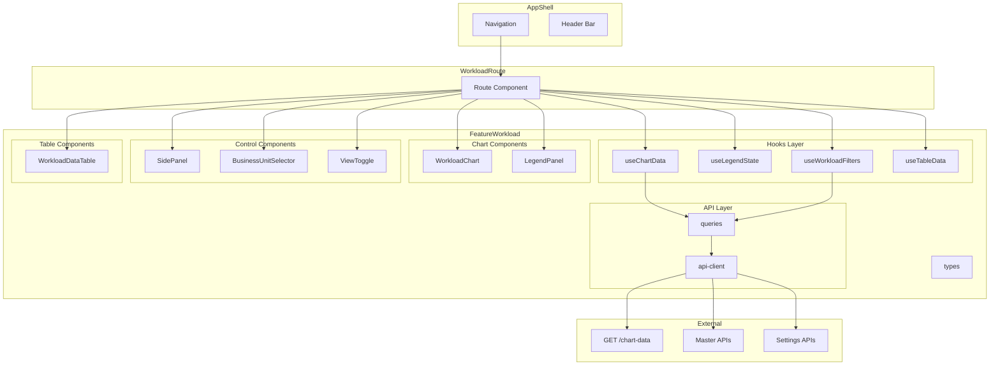
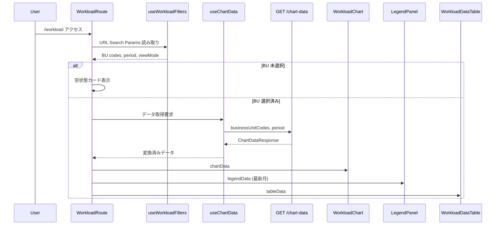
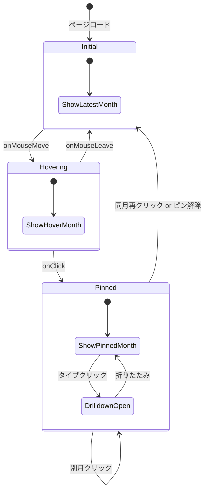
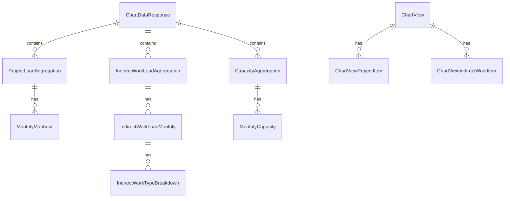

# Technical Design: メインダッシュボード (main-dashboard)

## Overview

**Purpose**: 操業山積管理システムのメインダッシュボード画面を提供し、ビジネスユニットの案件工数・間接作業工数・キャパシティを時系列チャートとデータテーブルで可視化する。

**Users**: 部門マネージャー、計画担当者、プロジェクトマネージャー、経営層が、リソースの需給バランス確認・案件別工数分析・シナリオ比較のワークフローで利用する。

**Impact**: フロントエンドに新規ルート `/workload` と Feature モジュール `features/workload/` を追加。既存のマスタ管理機能への影響なし。バックエンド API は実装済みであり、フロントエンド実装のみがスコープ。

### Goals
- 積み上げエリアチャートとキャパシティラインによる需給可視化
- 固定凡例パネルによるデータ詳細確認（ホバー/クリック連動）
- サイドパネルでの案件選択・間接作業設定・表示設定の統合操作
- 仮想スクロール対応データテーブルによる大量データの表形式確認
- 60fps 維持のスムーズなインタラクション

### Non-Goals
- バックエンド API の新規実装・変更（全て実装済み）
- マスタデータの CRUD 操作（既存画面で対応）
- リアルタイムデータ同期（ポーリング/WebSocket）
- 印刷・PDF エクスポート機能
- ユーザー認証・認可（将来スコープ）

## Architecture

### Existing Architecture Analysis

現在のフロントエンドは以下のパターンに従う:
- **Feature Module パターン**: `features/[feature]/` に api, components, hooks, types を内包
- **TanStack エコシステム**: Router（ファイルベースルーティング）, Query（データ取得）, Table（テーブル）, Form（フォーム）
- **API Client パターン**: `fetch` + `handleResponse<T>` + `ApiError`（RFC 9457）
- **Query Key Factory**: `xxxKeys.all → lists → list(params) → details → detail(id)`
- **状態管理**: URL Search Params + TanStack Query キャッシュ（外部状態管理ライブラリなし）
- **レイアウト**: AppShell（デスクトップサイドバー 256px + ヘッダー 56px）

ダッシュボードは既存パターンを踏襲しつつ、以下の点で拡張が必要:
- Recharts による チャート描画（既存 Feature にチャート使用なし）
- `@tanstack/react-virtual` による仮想スクロール（既存 Feature はページネーション）
- カスタムフックによる複合状態管理（凡例パネル、サイドパネル）

### Architecture Pattern & Boundary Map



**Architecture Integration**:
- **Selected pattern**: Feature Module パターン（既存の `features/` 構成に準拠）
- **Domain boundaries**: `features/workload/` がダッシュボード全機能を所有。他の Feature への依存なし
- **Existing patterns preserved**: Query Key Factory, API Client + handleResponse, Zod スキーマ, URL Search Params
- **New components rationale**: チャート・凡例パネル・サイドパネル・仮想テーブルは全て新規ドメイン
- **Steering compliance**: Feature-first 構成、`@/` エイリアス、camelCase 命名

### Technology Stack

| Layer | Choice / Version | Role in Feature | Notes |
|-------|------------------|-----------------|-------|
| Chart | Recharts ^3.7.0 | 積み上げエリアチャート + キャパシティライン | インストール済み・未使用 |
| Table | @tanstack/react-table ^8.21.3 | データテーブル（列ピン固定・リサイズ） | 既存利用 |
| Virtualization | @tanstack/react-virtual ^3.x | テーブル行仮想スクロール | **新規インストール必要** |
| Data Fetching | @tanstack/react-query ^5.80.7 | API データ取得・キャッシュ | 既存利用 |
| Routing | @tanstack/react-router ^1.121.3 | `/workload` ルート・Search Params | 既存利用 |
| Validation | zod ^4.3.6 | Search Params・設定入力バリデーション | 既存利用 |
| UI | shadcn/ui + Radix UI | ボタン・バッジ・スイッチ・セパレータ等 | 既存利用 |
| Icons | lucide-react ^0.513.0 | UI アイコン | 既存利用 |
| Styling | Tailwind CSS ^4.1.11 | レスポンシブレイアウト・スタイリング | 既存利用 |

## System Flows

### チャートデータ取得・表示フロー



### 凡例パネル状態遷移



## Requirements Traceability

| Requirement | Summary | Components | Interfaces | Flows |
|-------------|---------|------------|------------|-------|
| 1 | 積み上げエリアチャート | WorkloadChart, ChartAreas | useChartData | データ取得フロー |
| 2 | キャパシティライン | WorkloadChart, ChartCapacityLines | useChartData | データ取得フロー |
| 3 | 固定凡例パネル | LegendPanel | useLegendState | 凡例状態遷移 |
| 4 | クリック詳細表示 | LegendPanel, WorkloadChart | useLegendState | 凡例状態遷移 |
| 5 | 案件ドリルダウン | LegendDrilldown | useLegendState | 凡例状態遷移 |
| 6 | BU 選択 | BusinessUnitSelector | useWorkloadFilters, queries | データ取得フロー |
| 7 | 表示期間設定 | PeriodSelector | useWorkloadFilters | データ取得フロー |
| 8 | 案件選択 | SidePanelProjects | queries | データ取得フロー |
| 9 | 間接作業設定 | SidePanelIndirect | mutations | — |
| 10 | 表示設定 | SidePanelSettings | mutations | — |
| 11 | ビュー切替 | ViewToggle | useWorkloadFilters | — |
| 12 | データテーブル | WorkloadDataTable | useTableData | データ取得フロー |
| 13 | テーブルフィルタリング | WorkloadDataTable | useTableData | — |
| 14 | 年単位表示切替 | WorkloadDataTable | useTableData | — |
| 15 | プロファイル管理 | ProfileManager | queries, mutations | — |
| 16 | サイドパネル | SidePanel | — | — |
| 17 | コンテキスト操作 | WorkloadChart | — | — |
| 18 | データ取得・キャッシュ | queries, api-client | useChartData | データ取得フロー |
| 19 | ローディング・エラー・空状態 | SkeletonChart, EmptyState, ErrorState | useChartData | データ取得フロー |
| 20 | パフォーマンス | WorkloadChart, WorkloadDataTable | — | — |
| 21 | レスポンシブ | 全コンポーネント | — | — |
| 22 | データ整合性 | useChartData | — | データ取得フロー |

## Components and Interfaces

| Component | Domain/Layer | Intent | Req Coverage | Key Dependencies | Contracts |
|-----------|-------------|--------|-------------|-----------------|-----------|
| api-client | API | チャートデータ・マスタ・設定 API 呼び出し | 18 | @/lib/api (P0) | Service |
| queries | API | TanStack Query queryOptions 定義 | 18 | api-client (P0) | Service |
| mutations | API | 設定保存 mutations | 9, 10, 15 | api-client (P0) | Service |
| useChartData | Hooks | API データ取得と Recharts 形式への変換 | 1, 2, 18, 22 | queries (P0) | State |
| useLegendState | Hooks | 凡例パネル状態マシン | 3, 4, 5 | — | State |
| useWorkloadFilters | Hooks | URL Search Params によるフィルタ管理 | 6, 7, 11 | @tanstack/react-router (P0) | State |
| useTableData | Hooks | テーブルデータ加工・年フィルタ | 12, 13, 14 | useChartData (P1) | State |
| WorkloadChart | UI/Chart | ComposedChart ラッパー | 1, 2, 4, 7, 17, 20 | Recharts (P0), useChartData (P0) | — |
| LegendPanel | UI/Chart | 固定凡例パネル | 3, 4, 5 | useLegendState (P0) | — |
| SidePanel | UI/Control | 600px 開閉式 3 タブパネル | 16 | — | — |
| SidePanelProjects | UI/Control | 案件選択タブ | 8 | queries (P1) | — |
| SidePanelIndirect | UI/Control | 間接作業設定タブ | 9 | mutations (P1) | — |
| SidePanelSettings | UI/Control | 設定タブ（期間・表示設定） | 7, 10 | mutations (P1) | — |
| BusinessUnitSelector | UI/Control | BU マルチセレクト | 6 | queries (P1) | — |
| ViewToggle | UI/Control | ビュー切替セグメント | 11 | — | — |
| WorkloadDataTable | UI/Table | 仮想化データテーブル | 12, 13, 14, 20 | @tanstack/react-virtual (P0) | — |
| ProfileManager | UI/Control | プロファイル保存・呼出 | 15 | queries (P1), mutations (P1) | — |
| SkeletonChart | UI/Feedback | チャートスケルトンローダー | 19 | — | — |
| EmptyState | UI/Feedback | 空状態・エラーカード | 19 | — | — |

### API Layer

#### api-client

| Field | Detail |
|-------|--------|
| Intent | バックエンド API への HTTP リクエスト発行 |
| Requirements | 18 |

**Responsibilities & Constraints**
- `GET /chart-data` への集約データリクエスト
- マスタ API（BU, 案件, 案件タイプ, 間接作業ケース, キャパシティシナリオ）への一覧取得
- 設定 API（chart-color-settings, chart-stack-order-settings, chart-views）への CRUD
- 既存の `handleResponse<T>` + `ApiError` パターンを使用

**Dependencies**
- Outbound: `@/lib/api` — handleResponse, ApiError, API_BASE_URL (P0)

**Contracts**: Service [x]

##### Service Interface

```typescript
// --- Chart Data ---
interface ChartDataParams {
  businessUnitCodes: string[]
  startYearMonth: string
  endYearMonth: string
  capacityScenarioIds?: number[]
  indirectWorkCaseIds?: number[]
  chartViewId?: number
}

type ChartDataApiResponse = SingleResponse<ChartDataResponse>

function fetchChartData(params: ChartDataParams): Promise<ChartDataApiResponse>

// --- Master Data (for selections) ---
function fetchBusinessUnits(): Promise<PaginatedResponse<BusinessUnit>>
function fetchCapacityScenarios(): Promise<PaginatedResponse<CapacityScenario>>
function fetchIndirectWorkCases(): Promise<PaginatedResponse<IndirectWorkCase>>
function fetchProjects(params: { businessUnitCodes?: string[] }): Promise<PaginatedResponse<Project>>
function fetchProjectTypes(): Promise<PaginatedResponse<ProjectType>>

// --- Chart Color Settings ---
function fetchChartColorSettings(targetType?: string): Promise<PaginatedResponse<ChartColorSetting>>
function bulkUpsertChartColorSettings(items: ChartColorSettingInput[]): Promise<void>

// --- Chart Stack Order Settings ---
function fetchChartStackOrderSettings(targetType?: string): Promise<PaginatedResponse<ChartStackOrderSetting>>
function bulkUpsertChartStackOrderSettings(items: ChartStackOrderSettingInput[]): Promise<void>

// --- Chart Views (Profiles) ---
function fetchChartViews(): Promise<PaginatedResponse<ChartView>>
function createChartView(input: CreateChartViewInput): Promise<SingleResponse<ChartView>>
function updateChartView(id: number, input: UpdateChartViewInput): Promise<SingleResponse<ChartView>>
function deleteChartView(id: number): Promise<void>
```

#### queries

| Field | Detail |
|-------|--------|
| Intent | TanStack Query の queryOptions と Key Factory 定義 |
| Requirements | 18 |

**Contracts**: Service [x]

##### Service Interface

```typescript
// Query Key Factory
const workloadKeys = {
  all: ['workload'] as const
  chartData: (params: ChartDataParams) => [...workloadKeys.all, 'chart-data', params] as const
  businessUnits: () => ['business-units', 'all'] as const
  capacityScenarios: () => ['capacity-scenarios', 'all'] as const
  indirectWorkCases: () => ['indirect-work-cases', 'all'] as const
  projects: (buCodes: string[]) => [...workloadKeys.all, 'projects', buCodes] as const
  projectTypes: () => ['project-types', 'all'] as const
  colorSettings: (targetType?: string) => [...workloadKeys.all, 'color-settings', targetType] as const
  stackOrderSettings: (targetType?: string) => [...workloadKeys.all, 'stack-order-settings', targetType] as const
  chartViews: () => [...workloadKeys.all, 'chart-views'] as const
}

function chartDataQueryOptions(params: ChartDataParams): QueryOptions<ChartDataApiResponse>
// staleTime: 5 * 60 * 1000 (5分)

function businessUnitsQueryOptions(): QueryOptions<PaginatedResponse<BusinessUnit>>
// staleTime: 30 * 60 * 1000 (30分 — マスタデータ長期キャッシュ)

function projectTypesQueryOptions(): QueryOptions<PaginatedResponse<ProjectType>>
// staleTime: 30 * 60 * 1000
```

### Hooks Layer

#### useChartData

| Field | Detail |
|-------|--------|
| Intent | API データ取得と Recharts 用データ変換 |
| Requirements | 1, 2, 18, 22 |

**Responsibilities & Constraints**
- `ChartDataResponse` を Recharts の `MonthlyDataPoint[]` 配列に変換
- 案件タイプ別の Area シリーズ設定を生成（displayOrder 昇順）
- 間接作業ケース別の Area シリーズ設定を生成
- キャパシティシナリオ別の Line シリーズ設定を生成
- チャートとテーブルで同一データソースを共有（Req 22）
- `useMemo` でデータ変換結果を安定化

**Dependencies**
- Inbound: WorkloadChart, LegendPanel, WorkloadDataTable — データ提供 (P0)
- Outbound: queries — chartDataQueryOptions (P0)

**Contracts**: State [x]

##### State Management

```typescript
interface ChartSeriesConfig {
  areas: AreaSeriesConfig[]
  lines: LineSeriesConfig[]
}

interface AreaSeriesConfig {
  dataKey: string
  stackId: string
  fill: string
  stroke: string
  fillOpacity: number
  name: string
  type: 'project' | 'indirect'
}

interface LineSeriesConfig {
  dataKey: string
  stroke: string
  strokeDasharray: string
  name: string
}

interface MonthlyDataPoint {
  month: string  // "YYYY/MM" 表示用
  yearMonth: string  // "YYYYMM" 内部キー
  [seriesKey: string]: string | number
}

interface LegendMonthData {
  yearMonth: string
  month: string
  projectTypes: Array<{
    code: string | null
    name: string | null
    manhour: number
    projects?: Array<{ name: string; manhour: number }>
  }>
  indirectWorks: Array<{
    caseId: number
    caseName: string
    manhour: number
  }>
  capacities: Array<{
    scenarioId: number
    scenarioName: string
    capacity: number
  }>
  totalManhour: number
  totalCapacity: number
}

interface UseChartDataReturn {
  // Recharts 用データ
  chartData: MonthlyDataPoint[]
  seriesConfig: ChartSeriesConfig
  // 凡例パネル用データ
  legendDataByMonth: Map<string, LegendMonthData>
  latestMonth: string | null
  // テーブル用生データ
  rawResponse: ChartDataResponse | undefined
  // TanStack Query 状態
  isLoading: boolean
  isError: boolean
  error: Error | null
  refetch: () => void
}
```

#### useLegendState

| Field | Detail |
|-------|--------|
| Intent | 凡例パネルの状態管理（ホバー/固定/ドリルダウン） |
| Requirements | 3, 4, 5 |

**Responsibilities & Constraints**
- 3 状態（initial / hovering / pinned）の遷移管理
- 固定中はホバー更新を無効化
- ドリルダウンは固定状態でのみ有効

**Contracts**: State [x]

##### State Management

```typescript
type LegendMode = 'initial' | 'hovering' | 'pinned'

interface LegendState {
  mode: LegendMode
  activeMonth: string | null  // 表示中の yearMonth
  pinnedMonth: string | null  // 固定中の yearMonth
  expandedTypeCode: string | null  // ドリルダウン展開中の案件タイプコード
}

type LegendAction =
  | { type: 'HOVER'; yearMonth: string }
  | { type: 'HOVER_LEAVE' }
  | { type: 'CLICK'; yearMonth: string }
  | { type: 'UNPIN' }
  | { type: 'TOGGLE_DRILLDOWN'; typeCode: string }

interface UseLegendStateReturn {
  state: LegendState
  dispatch: React.Dispatch<LegendAction>
  activeMonth: string | null  // 現在表示すべき yearMonth
  isPinned: boolean
}
```

#### useWorkloadFilters

| Field | Detail |
|-------|--------|
| Intent | URL Search Params によるフィルタ状態管理 |
| Requirements | 6, 7, 11 |

**Responsibilities & Constraints**
- BU コード（配列）、開始/終了年月、ビューモードを URL Search Params で管理
- ブックマーク・共有可能な URL を生成
- Zod バリデーションによる Search Params パース

**Dependencies**
- Outbound: @tanstack/react-router — useSearch, useNavigate (P0)

**Contracts**: State [x]

##### State Management

```typescript
// URL Search Params スキーマ
const workloadSearchSchema = z.object({
  bu: z.array(z.string()).catch([]).default([]),
  from: z.string().regex(/^\d{6}$/).optional().catch(undefined),
  to: z.string().regex(/^\d{6}$/).optional().catch(undefined),
  view: z.enum(['chart', 'table', 'both']).catch('both').default('both'),
  tab: z.enum(['projects', 'indirect', 'settings']).catch('projects').default('projects'),
})

type WorkloadSearchParams = z.infer<typeof workloadSearchSchema>

interface UseWorkloadFiltersReturn {
  filters: WorkloadSearchParams
  setBusinessUnits: (codes: string[]) => void
  setPeriod: (from: string | undefined, to: string | undefined) => void
  setViewMode: (mode: 'chart' | 'table' | 'both') => void
  setSidePanelTab: (tab: 'projects' | 'indirect' | 'settings') => void
  hasBusinessUnits: boolean
  chartDataParams: ChartDataParams | null  // BU 未選択時は null
}
```

#### useTableData

| Field | Detail |
|-------|--------|
| Intent | テーブル表示用データの加工・フィルタリング |
| Requirements | 12, 13, 14 |

**Responsibilities & Constraints**
- ChartDataResponse からテーブル行データを生成（キャパシティ行 + 間接作業行 + 案件行）
- 年切替による月別列の動的生成
- テキスト検索 + 行タイプフィルタの適用
- クライアントサイドフィルタリング（API 再取得不要）

**Contracts**: State [x]

##### State Management

```typescript
type TableRowType = 'capacity' | 'indirect' | 'project'

interface TableRow {
  id: string
  rowType: TableRowType
  name: string
  businessUnitCode?: string
  projectTypeCode?: string | null
  projectTypeName?: string | null
  total: number
  monthly: Record<string, number>  // key: "01"~"12", value: manhour
}

interface UseTableDataReturn {
  rows: TableRow[]
  selectedYear: number
  availableYears: number[]
  setSelectedYear: (year: number) => void
  searchText: string
  setSearchText: (text: string) => void
  rowTypeFilter: TableRowType | 'all'
  setRowTypeFilter: (filter: TableRowType | 'all') => void
  filteredRows: TableRow[]
  monthColumns: ColumnDef<TableRow>[]
}
```

### UI / Chart Components

#### WorkloadChart

| Field | Detail |
|-------|--------|
| Intent | Recharts ComposedChart による積み上げエリアチャート+キャパシティライン描画 |
| Requirements | 1, 2, 4, 7, 17, 20 |

**Responsibilities & Constraints**
- ComposedChart に Area（案件タイプ別 + 間接作業別）と Line（キャパシティシナリオ別）を描画
- スタック順序: 下から「間接作業 → 案件タイプ（displayOrder 昇順）」
- Area: `fillOpacity: 0.8`（案件）/ `0.7`（間接作業）、Line: 破線スタイル（`strokeDasharray: "5 5"`）
- カスタムカーソル（縦破線）+ ツールチップ非表示
- onClick → useLegendState.dispatch CLICK、onMouseMove → HOVER、onMouseLeave → HOVER_LEAVE
- `useMemo` でデータ・シリーズ設定を安定化

**低スペック PC 対応（必須）**
- **アニメーション全面禁止**: 全ての Area, Line, Tooltip に `isAnimationActive={false}` + `animationDuration={0}` を設定。Recharts v3 はチャートレベルの一括無効化がないため、各コンポーネント個別に指定
- **ドット描画禁止**: 全ての Area に `dot={false}` + `activeDot={false}` を設定。60 データポイント × 10+ シリーズ = 600+ の `<circle>` SVG 要素を排除
- **キャパシティライン**: `dot={false}` を基本とし、マーカー表示は CSS で `<circle>` の代わりに `strokeWidth` の変化で代替。ドットが必須の場合は `dot={{ r: 2 }}` の最小サイズに制限
- **カーブタイプ**: `type="monotone"` を使用（`natural` や `basis` より計算コストが低い）
- **onMouseMove スロットリング**: `requestAnimationFrame` でスロットリングし、16ms 未満の連続イベントを間引く
- **React.memo**: WorkloadChart を `React.memo` でラップし、props 変更がない場合の再レンダリングを防止
- **CSS `contain: content`**: チャートコンテナに設定し、内部の再描画がページ全体のリフローを引き起こさないようにする

**Dependencies**
- Inbound: Route Component — 描画対象 (P0)
- External: Recharts — ComposedChart, Area, Line, XAxis, YAxis, CartesianGrid, Tooltip (P0)
- Outbound: useLegendState — イベントディスパッチ (P0)

**Implementation Notes**
- キャパシティライン: 青系グラデーションカラー、破線スタイル
- XAxis: `dataKey="month"` で YYYY/MM 表示、`tick` の fontSize を 12 に制限
- YAxis: 工数（人時）の数値フォーマット
- ResponsiveContainer でチャート幅をコンテナに追従
- `accessibilityLayer={false}` を設定し、不要な ARIA 要素の生成を抑制（Recharts v3 デフォルト true）

#### LegendPanel

| Field | Detail |
|-------|--------|
| Intent | チャート右側の固定凡例パネル |
| Requirements | 3, 4, 5 |

**Responsibilities & Constraints**
- 固定幅 288px、チャート右側に常時表示
- ヘッダー: 選択中年月（YYYY/MM）+ ピンアイコン（固定時表示）
- セクション: 案件タイプ（色ラベル + 名称 + 工数値）、間接作業（色ラベル + ケース名 + 工数値）、キャパシティ（色ラベル + シナリオ名 + 値）、サマリー（合計工数・稼働率）
- コンテンツ領域スクロール可能（`overflow-y: auto`）
- 固定状態で案件タイプクリック → LegendDrilldown 展開

**Dependencies**
- Inbound: Route Component — 凡例表示 (P0)
- Outbound: useLegendState — 状態参照・ディスパッチ (P0)
- Outbound: useChartData — legendDataByMonth (P0)

#### LegendDrilldown

| Field | Detail |
|-------|--------|
| Intent | 凡例パネル内の案件タイプドリルダウン |
| Requirements | 5 |

**Implementation Notes**
- Radix UI Collapsible を使用したアコーディオン表示
- 固定状態でのみクリック可能（hovering 時は disabled）
- 展開時: 所属案件リスト（案件名 + 個別工数）

### UI / Control Components

#### SidePanel

| Field | Detail |
|-------|--------|
| Intent | 左側 600px 開閉式コントロールパネル |
| Requirements | 16 |

**Responsibilities & Constraints**
- 幅 600px（開時）、CSS transition による開閉アニメーション
- 3 タブ構成:「案件」「間接作業」「設定」
- 初期状態: 開
- 閉時にメインエリアを全幅拡張
- モバイル（768px 未満）: 全画面オーバーレイ（Sheet 使用）

**Dependencies**
- External: @radix-ui/react-collapsible — パネル開閉基盤 (P2)

**Implementation Notes**
- インライン型パネル（オーバーレイではなく、コンテンツを押し出す）
- `transition: width 200ms ease` でスムーズな開閉
- タブ切替は useWorkloadFilters の `tab` パラメータで URL 永続化

#### BusinessUnitSelector

| Field | Detail |
|-------|--------|
| Intent | ヘッダー右側の BU マルチセレクト |
| Requirements | 6 |

**Responsibilities & Constraints**
- チェックボックスリスト + 全選択/全解除ボタン
- BU 名での検索フィルタリング
- 選択中 BU 数のバッジ表示
- 選択変更時にデータ再取得トリガー

**Dependencies**
- Outbound: queries — businessUnitsQueryOptions (P1)
- Outbound: useWorkloadFilters — setBusinessUnits (P0)

#### ViewToggle

| Field | Detail |
|-------|--------|
| Intent | ビュー切替 UI |
| Requirements | 11 |

**Implementation Notes**
- 3 オプション: チャート / テーブル / チャート&テーブル
- セグメントコントロール（ボタングループ）スタイル
- useWorkloadFilters の `view` パラメータで URL 永続化

#### PeriodSelector

| Field | Detail |
|-------|--------|
| Intent | 表示期間設定 UI |
| Requirements | 7 |

**Implementation Notes**
- 開始/終了年月の YYYY/MM 入力フィールド
- プリセットボタン: 12ヶ月 / 24ヶ月 / 36ヶ月
- リセットボタン（デフォルト期間に戻す）
- Zod バリデーション: 形式チェック、開始≤終了、60ヶ月以内

#### SidePanelProjects

| Field | Detail |
|-------|--------|
| Intent | サイドパネル案件タブ |
| Requirements | 8 |

**Implementation Notes**
- 案件カードリスト（案件名・BU 名・案件タイプ・総工数・期間）
- 検索フィルタリング + ソート（案件名/工数/期間/開始日）
- 全選択/全解除ボタン + 個別トグル
- 日本語ロケール対応ソート（`Intl.Collator`）

#### SidePanelIndirect

| Field | Detail |
|-------|--------|
| Intent | サイドパネル間接作業タブ |
| Requirements | 9 |

**Implementation Notes**
- 間接作業ケースごとの表示/非表示スイッチ（shadcn/ui Switch）
- 上下ボタンによる積み上げ順序変更（MVP — 将来 DnD 拡張可能）
- プリセットカラーパレット（グレー系 8 色）からの色選択
- デフォルト色リセット機能
- 変更時に chart-color-settings / chart-stack-order-settings を bulk upsert

#### SidePanelSettings

| Field | Detail |
|-------|--------|
| Intent | サイドパネル設定タブ |
| Requirements | 7, 10 |

**Implementation Notes**
- 期間設定セクション: PeriodSelector を配置
- 表示設定セクション: 案件タイプ並び順・色設定、キャパシティ表示/非表示・色設定
- プロファイル管理セクション: ProfileManager を配置
- 設定変更はリアルタイムにチャートへ反映

#### ProfileManager

| Field | Detail |
|-------|--------|
| Intent | 表示プロファイルの保存・呼出 |
| Requirements | 15 |

**Responsibilities & Constraints**
- 現在の表示設定（色・順序）を名前付きプロファイルとして保存
- 保存済みプロファイル一覧からの選択・適用
- chart-views API を使用

**Dependencies**
- Outbound: queries — chartViewsQueryOptions (P1)
- Outbound: mutations — createChartView, updateChartView (P1)

### UI / Table Components

#### WorkloadDataTable

| Field | Detail |
|-------|--------|
| Intent | 仮想スクロール対応データテーブル |
| Requirements | 12, 13, 14, 20 |

**Responsibilities & Constraints**
- 3 行タイプ: キャパシティ（青系背景・太字）、間接作業（灰色系背景）、案件（白背景）
- 固定列: 案件名（280px・左ピン）、BU（80px）、案件タイプ（100px）、合計工数（100px）
- 月別列: 各 80px × 12 列（年切替で動的生成）
- 数値フォーマット: 0 → 「-」、その他 → カンマ区切り日本語ロケール
- キャパシティ超過セル: 赤系背景警告
- 仮想スクロール: 行高さ 48px 固定、`@tanstack/react-virtual` 使用
- 列リサイズ: ドラッグ（最小 60px 〜 最大 400px）

**Dependencies**
- External: @tanstack/react-table — useReactTable (P0)
- External: @tanstack/react-virtual — useVirtualizer (P0)
- Outbound: useTableData — rows, filteredRows, monthColumns (P0)

**Contracts**: State [x]

##### State Management

```typescript
// TanStack Table state
interface WorkloadTableState {
  columnPinning: {
    left: ['name', 'businessUnit', 'projectType', 'total']
  }
  columnSizing: Record<string, number>
  globalFilter: string
}

// Virtual scroll config
interface VirtualConfig {
  rowHeight: 48
  overscan: 5
  containerHeight: number  // 動的計算（画面高さに応じて）
}
```

**Implementation Notes**
- CSS Grid レイアウト: `<table display="grid">`, `<thead position="sticky">`, `<tbody height=virtualizer.getTotalSize()>`
- 列ピン固定: `column.getIsPinned()` + `position: sticky` + `left: column.getStart('left')px`
- 列リサイズ: `columnResizeMode: 'onEnd'` + `header.getResizeHandler()`
- defaultColumn: `{ minSize: 60, maxSize: 400 }`

### UI / Feedback Components

#### SkeletonChart, EmptyState, ErrorState

| Field | Detail |
|-------|--------|
| Intent | ローディング・空状態・エラー表示 |
| Requirements | 19 |

**Implementation Notes**
- **SkeletonChart**: チャート・テーブルのプレースホルダー（Tailwind `animate-pulse` ベース）
- **EmptyState**: 「ビジネスユニットを選択してください」等の操作案内カード
- **ErrorState**: エラーカード + リトライボタン（`refetch()` 呼び出し）
- **Overlay Spinner**: 再取得中にチャート上に表示するオーバーレイ+スピナー

## Data Models

### Domain Model

フロントエンドのドメインモデルはバックエンド API レスポンスに対応する。



**Key Entities**:
- `ChartDataResponse`: 集約チャートデータ（API レスポンス直接型）
- `MonthlyDataPoint`: Recharts 用に変換された月別フラットデータ
- `LegendMonthData`: 凡例パネル用の月別詳細データ
- `TableRow`: テーブル表示用の行データ

### Data Contracts & Integration

**API Data Transfer**:

バックエンド `GET /chart-data` のレスポンス型（`ChartDataResponse`）は `apps/backend/src/types/chartData.ts` で定義済み。フロントエンドでは同等の型を `features/workload/types/index.ts` に定義する。

```typescript
// フロントエンド型定義（バックエンドレスポンスと対応）
type ChartDataResponse = {
  projectLoads: ProjectLoadAggregation[]
  indirectWorkLoads: IndirectWorkLoadAggregation[]
  capacities: CapacityAggregation[]
  period: { startYearMonth: string; endYearMonth: string }
  businessUnitCodes: string[]
}

type ProjectLoadAggregation = {
  projectTypeCode: string | null
  projectTypeName: string | null
  monthly: Array<{ yearMonth: string; manhour: number }>
}

type IndirectWorkLoadAggregation = {
  indirectWorkCaseId: number
  caseName: string
  businessUnitCode: string
  monthly: Array<{
    yearMonth: string
    manhour: number
    source: 'calculated' | 'manual'
    breakdown: Array<{
      workTypeCode: string
      workTypeName: string
      manhour: number
    }>
    breakdownCoverage: number
  }>
}

type CapacityAggregation = {
  capacityScenarioId: number
  scenarioName: string
  monthly: Array<{ yearMonth: string; capacity: number }>
}
```

## Error Handling

### Error Strategy

既存の `ApiError` + RFC 9457 Problem Details パターンを踏襲する。

### Error Categories and Responses

**User Errors (4xx)**:
- BU 未選択 → 空状態カード（「ビジネスユニットを選択してください」）— API 呼び出し自体を行わない
- 不正な期間指定 → インラインバリデーションエラー（Zod）

**System Errors (5xx)**:
- API 取得失敗 → エラーカード + リトライボタン
- 再取得失敗 → トースト通知（sonner）

**Business Logic Errors (422)**:
- 表示期間 60ヶ月超過 → フォームバリデーションエラー
- 対象データなし → 空状態カード（「表示可能な案件がありません」）

## Testing Strategy

### Unit Tests
- `useLegendState`: 状態遷移（initial → hovering → pinned → initial）、ドリルダウン展開/折りたたみ
- `useChartData`: API レスポンスから MonthlyDataPoint[] への変換、シリーズ設定生成
- `useTableData`: 行データ生成、年フィルタ、テキスト検索、行タイプフィルタ
- `workloadSearchSchema`: URL Search Params バリデーション（BU 配列、期間形式、ビューモード）

### Integration Tests
- チャートデータ取得 → 描画フロー: BU 選択 → API 呼び出し → チャート描画
- 凡例パネル連動: チャートクリック → 凡例固定 → ドリルダウン展開
- 設定変更 → 反映フロー: 色設定変更 → API 保存 → チャート更新
- フィルタ連動: BU 変更 → テーブル更新 → 年切替 → 列再生成

### E2E / UI Tests
- BU 選択 → チャート表示 → 凡例パネル確認
- サイドパネル操作 → 案件選択 → チャート更新
- ビュー切替（チャート / テーブル / 両方）
- URL 共有（Search Params 復元）

## Performance & Scalability

### Target Metrics（Req 20）

| メトリクス | 目標 | 実現手段 |
|-----------|------|----------|
| チャート初回描画 | 500ms 以内 | `isAnimationActive={false}`, `dot={false}`, `useMemo` |
| テーブル初回描画 | 200ms 以内 | 仮想スクロール（DOM 要素削減） |
| ホバー応答 | 16ms 以内（60fps） | `useCallback` でハンドラ安定化 |
| データ更新反映 | 200ms 以内 | TanStack Query キャッシュ更新 |
| テーブルスクロール | 60fps | 行仮想化（48px 固定高さ） |
| テーブルフィルタ反映 | 50ms 以内 | クライアントサイドフィルタ |

### 低スペック PC 対応方針

本システムのユーザーには低スペック PC（CPU 2コア、メモリ 4-8GB、統合 GPU）の利用者が含まれるため、Recharts 描画においてパフォーマンスを最優先設計とする。

**Recharts 描画最適化（必須ルール）**:
| 最適化項目 | 設定 | 効果 |
|-----------|------|------|
| アニメーション全面禁止 | `isAnimationActive={false}` + `animationDuration={0}` を全 Area/Line/Tooltip に設定 | CPU 負荷の大幅削減。SVG パス補間計算を排除 |
| ドット描画禁止 | `dot={false}` + `activeDot={false}` を全 Area に設定 | 600+ の `<circle>` SVG 要素を排除。DOM ツリーを軽量化 |
| アクセシビリティレイヤー無効化 | `accessibilityLayer={false}` | 不要な ARIA 要素生成を抑制（Recharts v3 デフォルト true） |
| カーブタイプ | `type="monotone"` 固定 | `natural`/`basis` より補間計算が軽量 |
| CSS contain | チャートコンテナに `contain: content` | 内部再描画のリフロー範囲を制限 |

**React レンダリング最適化**:
| 最適化項目 | 手法 | 効果 |
|-----------|------|------|
| データ安定化 | `useMemo` で chartData, seriesConfig, legendDataByMonth を安定化 | 不要な再計算を防止 |
| ハンドラ安定化 | `useCallback` で onMouseMove, onClick を安定化 | 子コンポーネントの不要な再レンダリングを防止 |
| マウスイベントスロットリング | `requestAnimationFrame` で onMouseMove を間引き | 16ms 未満の連続呼び出しを排除 |
| コンポーネントメモ化 | WorkloadChart を `React.memo` でラップ | props 未変更時の再レンダリングを完全に防止 |

**テーブル最適化**:
- 仮想スクロール: `@tanstack/react-virtual` で最大 1,000 行を ~20 行の DOM に削減
- 列リサイズ: `columnResizeMode: 'onEnd'` でドラッグ中のリアルタイム再レンダリングを回避

**キャッシュ戦略**:
- チャートデータ staleTime 5 分（不要な API 再取得を防止）
- マスタデータ staleTime 30 分（長期キャッシュ）
