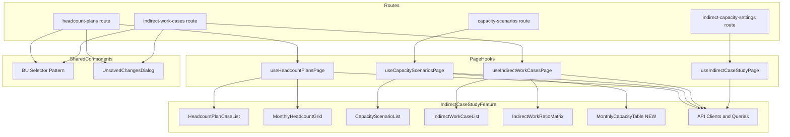

# Design Document: master-management-screens

## Overview

**Purpose**: `indirect-capacity-settings` 画面に混在する3ドメインのマスタ管理機能を、独立した専用画面に分離し、各マスタの管理効率を向上させる。

**Users**: 事業部リーダーが人員計画ケース・キャパシティシナリオ・間接作業ケースを個別に管理するワークフローで使用する。

**Impact**: 既存の `indirect-capacity-settings` 画面はそのまま維持し、3つの新規ルート・ページを追加する。既存コンポーネントの `index.ts` エクスポートを追加するのみで、内部実装の変更は行わない。

### Goals
- 3つの独立したマスタ管理画面を提供する（`/master/headcount-plans`, `/master/capacity-scenarios`, `/master/indirect-work-cases`）
- 既存コンポーネントを再利用し、コード重複を回避する
- サイドバーから各画面へのナビゲーションを提供する

### Non-Goals
- 既存 `indirect-capacity-settings` 画面の変更・削除
- `indirect-case-study` feature の分離・リファクタリング
- バックエンド API の新規追加・変更
- 計算機能（キャパシティ計算・間接作業計算）の各画面への配置

## Architecture

### Existing Architecture Analysis

現在の `indirect-capacity-settings` 画面は `SettingsPanel` コンポーネントに5つのサブコンポーネントを集約し、`useIndirectCaseStudyPage` フックが3ドメインの状態を一括管理している。各サブコンポーネントは props でデータと選択状態を受け取り、ミューテーションは内部で完結する設計となっている。

新画面は以下の既存資産を活用する:
- **API クライアント**: `headcount-plan-client.ts`, `capacity-scenario-client.ts`, `indirect-work-client.ts`
- **クエリオプション**: `headcountPlanCasesQueryOptions`, `capacityScenariosQueryOptions`, `indirectWorkCasesQueryOptions`, `monthlyCapacitiesQueryOptions`
- **ミューテーション**: 全 CRUD ミューテーション（既にエクスポート済み）
- **コンポーネント**: `HeadcountPlanCaseList`, `MonthlyHeadcountGrid`, `CapacityScenarioList`, `IndirectWorkCaseList`, `IndirectWorkRatioMatrix`（エクスポート追加が必要）

### Architecture Pattern & Boundary Map



**Architecture Integration**:
- **Selected pattern**: ハイブリッドアプローチ — 既存 feature のエクスポート追加 + 新規ルート・フック作成
- **Domain boundaries**: 各ページフックが1ドメインの状態管理を担当し、コンポーネントはミューテーションを内部で実行
- **Existing patterns preserved**: lazy route pattern、URL search params による BU 選択、`useUnsavedChanges` フック
- **New components rationale**: `MonthlyCapacityTable` のみ新規作成（月別キャパシティの読み取り表示は既存に該当なし）

### Technology Stack

| Layer | Choice / Version | Role in Feature | Notes |
|-------|------------------|-----------------|-------|
| Frontend | React 19 + TanStack Router | ルーティング・ページコンポーネント | 既存パターンに準拠 |
| State Management | TanStack Query | サーバー状態管理・キャッシュ | 既存クエリオプション再利用 |
| UI | shadcn/ui + Tailwind CSS v4 | UIコンポーネント・スタイリング | 既存デザインシステム |

## Requirements Traceability

| Requirement | Summary | Components | Interfaces | Flows |
|-------------|---------|------------|------------|-------|
| 1.1 | ケース一覧の左パネル表示 | HeadcountPlanCaseList, useHeadcountPlansPage | HeadcountPlanCaseListProps | - |
| 1.2 | ケース新規作成 | HeadcountPlanCaseList | CaseFormSheet | - |
| 1.3 | ケース選択で右パネル表示 | MonthlyHeadcountGrid, useHeadcountPlansPage | MonthlyHeadcountGridProps | - |
| 1.4 | ケース編集 | HeadcountPlanCaseList | CaseFormSheet | - |
| 1.5 | ケース削除 | HeadcountPlanCaseList | AlertDialog | - |
| 1.6 | BU セレクタ | HeadcountPlansPage | BU Selector Pattern | - |
| 1.7 | 年度切替 | MonthlyHeadcountGrid, useHeadcountPlansPage | onFiscalYearChange | - |
| 1.8 | 月別データ保存 | useHeadcountPlansPage | useBulkUpdateMonthlyHeadcountPlans | Save Flow |
| 2.1 | シナリオ一覧表示 | CapacityScenarioList, useCapacityScenariosPage | CapacityScenarioListProps | - |
| 2.2 | シナリオ新規作成 | CapacityScenarioList | ScenarioFormSheet | - |
| 2.3 | シナリオ選択で詳細表示 | MonthlyCapacityTable, useCapacityScenariosPage | MonthlyCapacityTableProps | - |
| 2.4 | シナリオ編集 | CapacityScenarioList | ScenarioFormSheet | - |
| 2.5 | シナリオ削除 | CapacityScenarioList | AlertDialog | - |
| 3.1 | ケース一覧の左パネル表示 | IndirectWorkCaseList, useIndirectWorkCasesPage | IndirectWorkCaseListProps | - |
| 3.2 | ケース新規作成 | IndirectWorkCaseList | CaseFormSheet | - |
| 3.3 | ケース選択で右パネル表示 | IndirectWorkRatioMatrix, useIndirectWorkCasesPage | IndirectWorkRatioMatrixProps | - |
| 3.4 | ケース編集 | IndirectWorkCaseList | CaseFormSheet | - |
| 3.5 | ケース削除 | IndirectWorkCaseList | AlertDialog | - |
| 3.6 | BU セレクタ | IndirectWorkCasesPage | BU Selector Pattern | - |
| 3.7 | 比率データ保存 | useIndirectWorkCasesPage | useBulkUpdateIndirectWorkTypeRatios | Save Flow |
| 4.1 | メニュー項目表示 | SidebarNav | menuItems | - |
| 4.2 | メニュークリックで遷移 | SidebarNav | Link | - |
| 4.3 | アクティブ状態表示 | SidebarNav | startsWith | - |
| 5.1 | TypeScript エラーなし | All | - | Build |
| 5.2 | 既存テスト維持 | All | - | Test |
| 5.3 | コンポーネント再利用 | All | index.ts exports | - |

## Components and Interfaces

| Component | Domain/Layer | Intent | Req Coverage | Key Dependencies | Contracts |
|-----------|--------------|--------|--------------|------------------|-----------|
| HeadcountPlansPage | UI/Route | 人員計画ケース管理ページ | 1.1-1.8 | useHeadcountPlansPage (P0), BU Selector (P0) | State |
| CapacityScenariosPage | UI/Route | キャパシティシナリオ管理ページ | 2.1-2.5 | useCapacityScenariosPage (P0) | State |
| IndirectWorkCasesPage | UI/Route | 間接作業ケース管理ページ | 3.1-3.7 | useIndirectWorkCasesPage (P0), BU Selector (P0) | State |
| useHeadcountPlansPage | Hooks | 人員計画ページの状態管理 | 1.1-1.8 | TanStack Query (P0) | Service, State |
| useCapacityScenariosPage | Hooks | シナリオページの状態管理 | 2.1-2.5 | TanStack Query (P0) | Service, State |
| useIndirectWorkCasesPage | Hooks | 間接作業ページの状態管理 | 3.1-3.7 | TanStack Query (P0) | Service, State |
| MonthlyCapacityTable | UI/Component | 月別キャパシティ読み取り表示 | 2.3 | monthlyCapacitiesQueryOptions (P0) | State |

### Routes Layer

#### HeadcountPlansPage

| Field | Detail |
|-------|--------|
| Intent | 人員計画ケースの CRUD と月別データ入力を2カラムレイアウトで提供する |
| Requirements | 1.1, 1.2, 1.3, 1.4, 1.5, 1.6, 1.7, 1.8 |

**Responsibilities & Constraints**
- ルート定義（`/master/headcount-plans/`）と search params バリデーション（`bu: string`）
- BU セレクタの表示と URL パラメータ連動
- 左パネル: `HeadcountPlanCaseList`、右パネル: `MonthlyHeadcountGrid` の2カラムレイアウト
- `useUnsavedChanges` による未保存データの離脱防止

**Dependencies**
- Inbound: TanStack Router — ルーティング (P0)
- Outbound: useHeadcountPlansPage — 状態管理 (P0)
- Outbound: HeadcountPlanCaseList — ケース一覧 (P0)
- Outbound: MonthlyHeadcountGrid — 月別入力 (P0)
- External: businessUnitsQueryOptions — BU リスト取得 (P0)

**Contracts**: State [x]

##### State Management
- **State model**: URL search params (`bu`) + useHeadcountPlansPage が管理する選択状態・dirty 状態
- **Persistence**: TanStack Query のキャッシュ + サーバー永続化（保存ボタン押下時）

**Implementation Notes**
- `index.tsx` + `index.lazy.tsx` の lazy route パターンを使用（既存 `indirect-capacity-settings` と同一パターン）
- BU セレクタは既存パターン（`businessUnitsQueryOptions` + `Select` コンポーネント）を複製
- `AppShell.tsx` のレイアウト条件に `/master/headcount-plans` を追加（`h-full` 適用）

#### CapacityScenariosPage

| Field | Detail |
|-------|--------|
| Intent | キャパシティシナリオの CRUD と月別労働時間の詳細表示を提供する |
| Requirements | 2.1, 2.2, 2.3, 2.4, 2.5 |

**Responsibilities & Constraints**
- ルート定義（`/master/capacity-scenarios/`）
- BU セレクタなし（キャパシティシナリオはグローバルマスタ）
- 左パネル: `CapacityScenarioList`、右パネル: `MonthlyCapacityTable`（選択時のみ表示）

**Dependencies**
- Inbound: TanStack Router — ルーティング (P0)
- Outbound: useCapacityScenariosPage — 状態管理 (P0)
- Outbound: CapacityScenarioList — シナリオ一覧 (P0)
- Outbound: MonthlyCapacityTable — 月別詳細 (P1)

**Contracts**: State [x]

##### State Management
- **State model**: useCapacityScenariosPage が管理するシナリオ選択状態・includeDisabled
- **Persistence**: TanStack Query のキャッシュのみ（この画面にデータ入力なし）

**Implementation Notes**
- BU セレクタ不要のため search params なし。ただし将来 BU フィルタが必要になった場合に備え、route 定義は lazy パターンで作成
- この画面のみ保存ボタン不要（CRUD はリスト内で完結、月別キャパシティは読み取り専用）

#### IndirectWorkCasesPage

| Field | Detail |
|-------|--------|
| Intent | 間接作業ケースの CRUD と比率マトリクス入力を2カラムレイアウトで提供する |
| Requirements | 3.1, 3.2, 3.3, 3.4, 3.5, 3.6, 3.7 |

**Responsibilities & Constraints**
- ルート定義（`/master/indirect-work-cases/`）と search params バリデーション（`bu: string`）
- BU セレクタの表示と URL パラメータ連動
- 左パネル: `IndirectWorkCaseList`、右パネル: `IndirectWorkRatioMatrix`
- `useUnsavedChanges` による未保存データの離脱防止

**Dependencies**
- Inbound: TanStack Router — ルーティング (P0)
- Outbound: useIndirectWorkCasesPage — 状態管理 (P0)
- Outbound: IndirectWorkCaseList — ケース一覧 (P0)
- Outbound: IndirectWorkRatioMatrix — 比率入力 (P0)
- External: businessUnitsQueryOptions — BU リスト取得 (P0)

**Contracts**: State [x]

##### State Management
- **State model**: URL search params (`bu`) + useIndirectWorkCasesPage が管理する選択状態・dirty 状態
- **Persistence**: TanStack Query のキャッシュ + サーバー永続化（保存ボタン押下時）

**Implementation Notes**
- HeadcountPlansPage とほぼ同一の構造（BU セレクタ + 2カラム + 保存 + 未保存警告）
- `IndirectWorkRatioMatrix` は `@/features/work-types` に依存（作業種類マスタ）

### Hooks Layer

#### useHeadcountPlansPage

| Field | Detail |
|-------|--------|
| Intent | 人員計画ケース選択・月別データの dirty 管理・保存を一元管理する |
| Requirements | 1.1, 1.3, 1.7, 1.8 |

**Responsibilities & Constraints**
- ケース一覧のクエリ管理（`headcountPlanCasesQueryOptions`）
- 選択状態（`selectedCaseId`）と includeDisabled の管理
- 年度状態（`fiscalYear`）の管理
- 月別データの dirty 追跡と `localData` バッファ管理
- 保存ミューテーション（`useBulkUpdateMonthlyHeadcountPlans`）の実行
- BU 変更時の選択状態リセット

**Dependencies**
- Outbound: headcountPlanCasesQueryOptions — ケース一覧取得 (P0)
- Outbound: useBulkUpdateMonthlyHeadcountPlans — 月別データ保存 (P0)

**Contracts**: Service [x] / State [x]

##### Service Interface
```typescript
interface UseHeadcountPlansPageParams {
  businessUnitCode: string;
}

interface UseHeadcountPlansPageReturn {
  // Query state
  cases: HeadcountPlanCase[];
  isLoadingCases: boolean;

  // Selection
  selectedCaseId: number | null;
  setSelectedCaseId: (id: number | null) => void;

  // Include disabled
  includeDisabled: boolean;
  setIncludeDisabled: (value: boolean) => void;

  // Fiscal year
  fiscalYear: number;
  setFiscalYear: (year: number) => void;

  // Dirty tracking
  isDirty: boolean;
  setHeadcountDirty: (dirty: boolean) => void;
  setHeadcountLocalData: (data: BulkMonthlyHeadcountInput) => void;

  // Save
  saveHeadcountPlans: () => Promise<void>;
  isSaving: boolean;
}
```

##### State Management
- **State model**: `selectedCaseId`, `fiscalYear`, `includeDisabled`, `isDirty`, `localData`
- **Consistency**: BU 変更時は `selectedCaseId` を null にリセット（既存 `useIndirectCaseStudyPage` のパターンを踏襲）

#### useCapacityScenariosPage

| Field | Detail |
|-------|--------|
| Intent | シナリオ選択と月別キャパシティ取得を管理する |
| Requirements | 2.1, 2.3 |

**Responsibilities & Constraints**
- シナリオ一覧のクエリ管理（`capacityScenariosQueryOptions`）
- 選択状態（`selectedScenarioId`）と includeDisabled の管理
- 月別キャパシティの取得（`monthlyCapacitiesQueryOptions`、選択時のみ有効化）

**Dependencies**
- Outbound: capacityScenariosQueryOptions — シナリオ一覧取得 (P0)
- Outbound: monthlyCapacitiesQueryOptions — 月別キャパシティ取得 (P1)

**Contracts**: Service [x] / State [x]

##### Service Interface
```typescript
interface UseCapacityScenariosPageReturn {
  // Query state
  scenarios: CapacityScenario[];
  isLoadingScenarios: boolean;

  // Selection
  selectedScenarioId: number | null;
  setSelectedScenarioId: (id: number | null) => void;

  // Include disabled
  includeDisabled: boolean;
  setIncludeDisabled: (value: boolean) => void;

  // Monthly capacities
  monthlyCapacities: MonthlyCapacity[];
  isLoadingCapacities: boolean;
}
```

##### State Management
- **State model**: `selectedScenarioId`, `includeDisabled`
- **Consistency**: dirty 管理不要（この画面にデータ入力なし）

#### useIndirectWorkCasesPage

| Field | Detail |
|-------|--------|
| Intent | 間接作業ケース選択・比率データの dirty 管理・保存を一元管理する |
| Requirements | 3.1, 3.3, 3.7 |

**Responsibilities & Constraints**
- ケース一覧のクエリ管理（`indirectWorkCasesQueryOptions`）
- 選択状態（`selectedCaseId`）と includeDisabled の管理
- 比率データの dirty 追跡と `localData` バッファ管理
- 保存ミューテーション（`useBulkUpdateIndirectWorkTypeRatios`）の実行
- BU 変更時の選択状態リセット

**Dependencies**
- Outbound: indirectWorkCasesQueryOptions — ケース一覧取得 (P0)
- Outbound: useBulkUpdateIndirectWorkTypeRatios — 比率データ保存 (P0)

**Contracts**: Service [x] / State [x]

##### Service Interface
```typescript
interface UseIndirectWorkCasesPageParams {
  businessUnitCode: string;
}

interface UseIndirectWorkCasesPageReturn {
  // Query state
  cases: IndirectWorkCase[];
  isLoadingCases: boolean;

  // Selection
  selectedCaseId: number | null;
  setSelectedCaseId: (id: number | null) => void;

  // Include disabled
  includeDisabled: boolean;
  setIncludeDisabled: (value: boolean) => void;

  // Dirty tracking
  isDirty: boolean;
  setRatioDirty: (dirty: boolean) => void;
  setRatioLocalData: (data: BulkIndirectWorkRatioInput) => void;

  // Save
  saveRatios: () => Promise<void>;
  isSaving: boolean;
}
```

##### State Management
- **State model**: `selectedCaseId`, `includeDisabled`, `isDirty`, `localData`
- **Consistency**: BU 変更時は `selectedCaseId` を null にリセット

### Components Layer

#### MonthlyCapacityTable (NEW)

| Field | Detail |
|-------|--------|
| Intent | 選択されたシナリオの月別キャパシティ（労働時間）を読み取り専用テーブルで表示する |
| Requirements | 2.3 |

**Responsibilities & Constraints**
- `MonthlyCapacity[]` データを BU × 年月のマトリクス形式テーブルで表示
- 行: BU（`businessUnitCode` でグルーピング）、列: 年月（`yearMonth` を4月始まり年度順でソート）
- セル値: キャパシティ（工数）を数値表示
- 読み取り専用（編集・保存機能なし）

**Dependencies**
- Inbound: useCapacityScenariosPage — monthlyCapacities データ (P0)
- External: `@/components/ui/table` — テーブルUI (P0)
- External: businessUnitsQueryOptions — BU 名の表示用 (P1)

**Contracts**: State [x]

##### State Management
- **State model**: Props 経由でデータ受け取り（内部状態なし）

```typescript
interface MonthlyCapacityTableProps {
  capacities: MonthlyCapacity[];
  isLoading: boolean;
}
```

**Implementation Notes**
- 表示形式: BU を行、年月を列（4月始まり12ヶ月）とするピボットテーブル
- BU 名の解決は `businessUnitsQueryOptions` を内部で取得するか、親からマッピングを受け取る（実装時に判断）
- `MonthlyHeadcountGrid` の表示部分を参考に、入力機能を除いた読み取り専用テーブルとして実装
- データが空の場合は「シナリオを選択してください」の空状態メッセージを表示

### Navigation Layer

#### SidebarNav Update

| Field | Detail |
|-------|--------|
| Intent | 3つの新画面へのナビゲーションメニュー項目を追加する |
| Requirements | 4.1, 4.2, 4.3 |

**Implementation Notes**
- 既存「案件・間接作業管理」グループに3項目を追加:
  - `{ label: "人員計画ケース", href: "/master/headcount-plans", icon: Users }`
  - `{ label: "キャパシティシナリオ", href: "/master/capacity-scenarios", icon: Clock }`
  - `{ label: "間接作業ケース", href: "/master/indirect-work-cases", icon: ListChecks }`
- アクティブ状態は既存の `currentPath.startsWith(item.href)` ロジックで自動対応
- アイコンは lucide-react から選択（`Users`, `Clock`, `ListChecks` 等、実装時に確定）

### Feature Export Layer

#### indirect-case-study/index.ts Update

| Field | Detail |
|-------|--------|
| Intent | 5つの内部コンポーネントをパブリック API として公開する |
| Requirements | 5.3 |

**Implementation Notes**
- 以下のコンポーネントエクスポートを追加:
  - `HeadcountPlanCaseList`
  - `MonthlyHeadcountGrid`
  - `CapacityScenarioList`
  - `IndirectWorkCaseList`
  - `IndirectWorkRatioMatrix`
- 既存エクスポートへの影響なし（追加のみ）

## Error Handling

### Error Strategy
既存パターンに準拠。ミューテーション失敗時は `sonner` トースト通知でエラー表示。

### Error Categories and Responses
- **User Errors (4xx)**: CRUD 操作の失敗 → ケース名重複(409)、バリデーションエラー(422) をフォーム上に表示
- **System Errors (5xx)**: API 通信失敗 → トースト通知 + TanStack Query のデフォルトリトライ
- **Business Logic Errors**: 保存データ不正 → バリデーションエラーとして表示

## Testing Strategy

### Unit Tests
- `useHeadcountPlansPage`: BU 変更時の選択リセット、dirty 管理、保存ロジック
- `useCapacityScenariosPage`: シナリオ選択時の月別キャパシティ取得有効化
- `useIndirectWorkCasesPage`: BU 変更時の選択リセット、dirty 管理、保存ロジック

### Integration Tests
- 各ページの BU セレクタ → ケース一覧更新の連動
- ケース選択 → 右パネルの表示切替
- 保存ボタン → ミューテーション実行 → キャッシュ無効化

### E2E/UI Tests
- 各ページの CRUD 操作フロー（作成 → 編集 → 削除）
- 未保存データがある状態での画面遷移 → UnsavedChangesDialog 表示
- サイドバーからの各画面遷移
