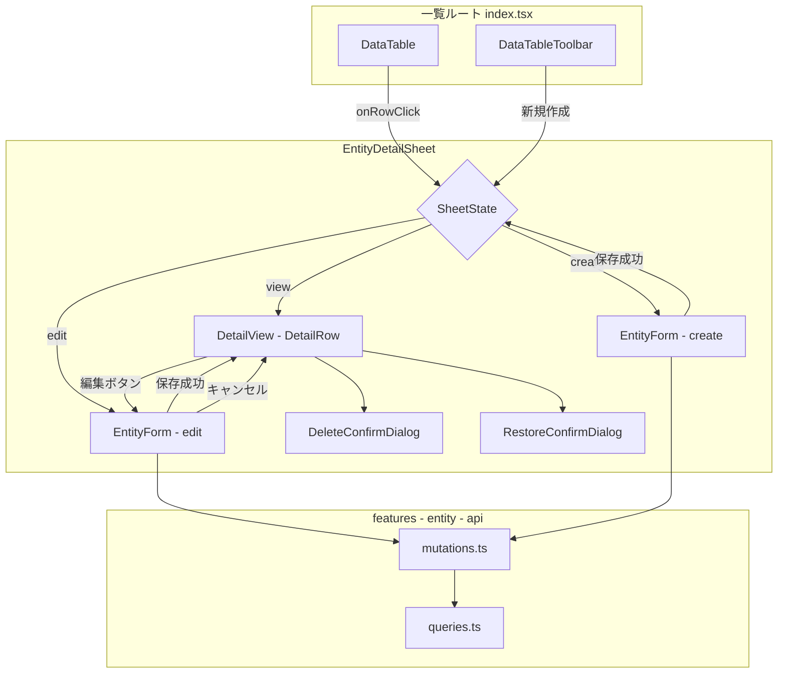
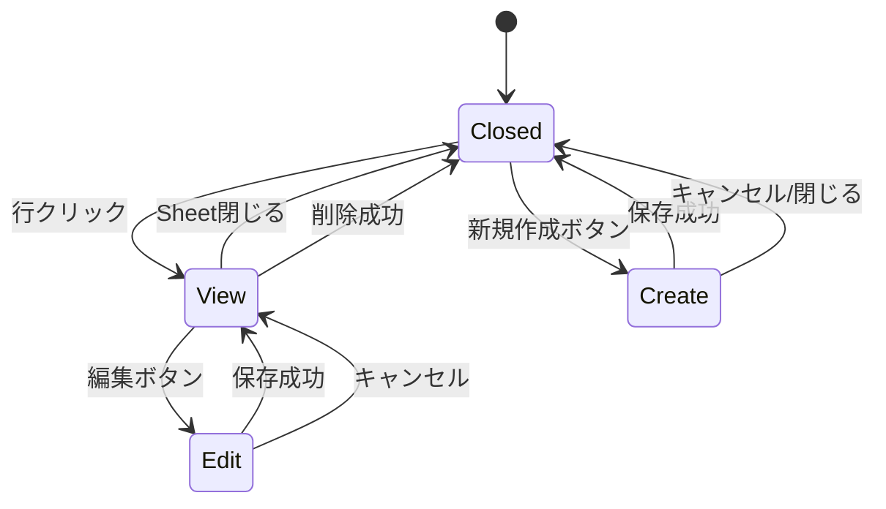

# Design Document: master-sheet-crud

## Overview

**Purpose**: マスター管理画面（business-units, project-types, work-types）の詳細/編集/新規作成をページ遷移からSheet表示に統合し、すべてのCRUD操作を一覧画面内で完結させる。

**Users**: 管理者が一覧画面から直接レコードの閲覧・編集・作成・削除・復元を行う。

**Impact**: 3マスターの合計9ルートファイル（詳細×3, 編集×3, 新規×3）を廃止し、一覧ルート内のSheetに統合する。

### Goals
- ページ遷移を排除し、一覧画面内でCRUD操作を完結
- 閲覧/編集/作成の3モードをSheet内で切り替え
- 3マスターで統一されたUXパターンを提供
- 既存フォームコンポーネントの再利用

### Non-Goals
- バックエンドAPI・データモデルの変更
- 案件（projects）マスターのSheet化（別スコープ）
- 一覧テーブルのカラム構成やフィルタリング機能の変更
- 共通Sheetコンポーネントの汎用ライブラリ化

## Architecture

### Existing Architecture Analysis

**現在のパターン**:
- 一覧 → 詳細 → 編集 の3ページ構成（TanStack Router ファイルベースルーティング）
- `DataTable` の `onRowClick` で詳細ページに `navigate()`
- `features/[entity]/` に api / components / types が凝集
- CRUD ファクトリ（`createCrudClient` / `createQueryKeys` / `createCrudMutations`）で API 層が完全に抽象化

**維持するパターン**:
- feature ベースのディレクトリ構成
- CRUD ファクトリによる API/Query/Mutation 管理
- `mode: "create" | "edit"` のフォームモードパターン
- `DataTable` + `columns.tsx` による一覧表示
- ソフトデリート + 復元の操作フロー

### Architecture Pattern & Boundary Map



**Architecture Integration**:
- **Selected pattern**: ハイブリッド（共通 Hook + 個別 Sheet）。モード管理ロジックを `useMasterSheet` Hook に共通化し、UI は各 feature の Sheet コンポーネントで個別管理
- **Domain boundaries**: 各 feature のコンポーネントは `features/[entity]/components/` に配置。feature 間の依存なし
- **Existing patterns preserved**: CRUD ファクトリ、フォームモードパターン、DetailRow、DeleteConfirmDialog / RestoreConfirmDialog
- **New components rationale**: `useMasterSheet` Hook（モード管理の共通化）、各 `*DetailSheet.tsx`（Sheet UI の実装）
- **Steering compliance**: feature-first 構成、`@/` エイリアス、TypeScript strict mode

### Technology Stack

| Layer | Choice / Version | Role in Feature | Notes |
|-------|------------------|-----------------|-------|
| Frontend | React 19 + TanStack Router | 一覧ルートの変更、旧ルート削除 | 既存技術、追加なし |
| UI | shadcn/ui Sheet (Radix UI Dialog) | Sheet 表示 | `components/ui/sheet.tsx` 既存 |
| State | TanStack Query | キャッシュ無効化 | 既存 mutation hooks 使用 |
| Form | TanStack Form + Zod | Sheet 内フォーム | 既存 Form コンポーネント再利用 |

新規依存なし。すべて既存技術スタック内。

## System Flows

### Sheet モード遷移



## Requirements Traceability

| Requirement | Summary | Components | Interfaces | Flows |
|-------------|---------|------------|------------|-------|
| 1.1 | 行クリックで Sheet 開き詳細表示 | ListRoute, EntityDetailSheet | `onRowClick`, `MasterSheetState` | Closed → View |
| 1.2 | 閲覧モードで全フィールド読み取り専用表示 | EntityDetailSheet (ViewMode) | `DetailView` render | View state |
| 1.3 | Sheet 外クリック/閉じるボタンで Sheet 閉じる | EntityDetailSheet | `onOpenChange` | View → Closed |
| 1.4 | 3 マスターで同一パターン適用 | useMasterSheet, 各 DetailSheet | `MasterSheetState` 共通型 | — |
| 2.1 | 編集ボタンで編集モードに切替 | EntityDetailSheet | `MasterSheetState` transition | View → Edit |
| 2.2 | 保存成功後に閲覧モードに戻る | EntityDetailSheet | mutation `onSuccess` | Edit → View |
| 2.3 | キャンセルで閲覧モードに戻る | EntityDetailSheet | `onCancel` handler | Edit → View |
| 2.4 | バリデーションエラー表示・編集モード維持 | EntityForm | TanStack Form validators | Edit state |
| 2.5 | 保存成功後に一覧更新 | mutations.ts | `queryClient.invalidateQueries` | — |
| 3.1 | 新規作成ボタンで空フォーム Sheet 開く | ListRoute, EntityDetailSheet | `MasterSheetState` create | Closed → Create |
| 3.2 | 新規作成保存 | EntityDetailSheet, EntityForm | mutation `useCreate` | Create → Closed |
| 3.3 | 新規作成後に一覧反映 | mutations.ts | cache invalidation | — |
| 3.4 | 新規作成バリデーションエラー | EntityForm | TanStack Form validators | Create state |
| 4.1 | 削除操作 UI | EntityDetailSheet | DeleteConfirmDialog | — |
| 4.2 | 削除確認ダイアログ | DeleteConfirmDialog | `useDelete` mutation | — |
| 4.3 | 削除成功後 Sheet 閉じ一覧更新 | EntityDetailSheet | mutation `onSuccess` | View → Closed |
| 4.4 | 復元操作 UI | EntityDetailSheet | RestoreConfirmDialog | — |
| 4.5 | 復元成功後に一覧更新 | EntityDetailSheet | `useRestore` mutation | — |
| 5.1–5.3 | 旧ルート廃止 | ルートファイル削除, columns.tsx 変更 | — | — |
| 5.4 | 既存フォーム再利用 | EntityForm | `mode: "create" \| "edit"` | — |
| 6.1–6.3 | 共通パターン | useMasterSheet | `MasterSheetState` | — |

## Components and Interfaces

| Component | Domain/Layer | Intent | Req Coverage | Key Dependencies | Contracts |
|-----------|--------------|--------|--------------|------------------|-----------|
| `MasterSheetState` | Shared/Types | Sheet モード状態の型定義 | 1.1–1.4, 6.1–6.3 | — | State |
| `useMasterSheet` | Shared/Hooks | Sheet モード管理の共通 Hook | 1.1, 1.3, 2.1–2.3, 3.1, 4.3, 6.1–6.3 | MasterSheetState (P0) | State |
| `BusinessUnitDetailSheet` | features/business-units | BU の閲覧/編集/作成 Sheet | 1.1–1.4, 2.1–2.5, 3.1–3.4, 4.1–4.5 | useMasterSheet (P0), BusinessUnitForm (P0), mutations (P0) | State |
| `ProjectTypeDetailSheet` | features/project-types | PT の閲覧/編集/作成 Sheet | 同上 | useMasterSheet (P0), ProjectTypeForm (P0), mutations (P0) | State |
| `WorkTypeDetailSheet` | features/work-types | WT の閲覧/編集/作成 Sheet | 同上 | useMasterSheet (P0), WorkTypeForm (P0), mutations (P0) | State |
| columns.tsx（変更） | features/*/components | code カラムの Link 削除（旧ルート参照を除去） | 5.1–5.3 | — | — |
| ListRoute（変更） | routes/master/* | 一覧画面に Sheet 統合 | 1.1, 3.1 | DataTable (P0), EntityDetailSheet (P0) | — |

### Shared / Types

#### MasterSheetState

| Field | Detail |
|-------|--------|
| Intent | Sheet のモード状態を discriminated union で型安全に管理する |
| Requirements | 1.1–1.4, 2.1, 2.3, 3.1, 6.1–6.3 |

**Responsibilities & Constraints**
- 3 モード（view / edit / create）+ closed 状態を表現
- モードごとに必要なデータ（code, entity）を型レベルで保証
- 不正な状態遷移をコンパイル時に排除

**Contracts**: State [x]

##### State Management

```typescript
type MasterSheetState<TEntity> =
  | { mode: "closed" }
  | { mode: "view"; entity: TEntity }
  | { mode: "edit"; entity: TEntity }
  | { mode: "create" };
```

- State model: 4 状態の discriminated union。`entity` は view/edit で必須、create では不在
- Persistence: React state（`useState`）。URL パラメータへの永続化は行わない
- Concurrency: 単一 Sheet のため排他制御不要

### Shared / Hooks

#### useMasterSheet

| Field | Detail |
|-------|--------|
| Intent | Sheet のモード遷移アクションを共通化する |
| Requirements | 1.1, 1.3, 2.1–2.3, 3.1, 4.3, 6.1–6.3 |

**Responsibilities & Constraints**
- `MasterSheetState` の状態遷移メソッドを提供
- Sheet の open/close 判定を `mode !== "closed"` で導出
- 各遷移の前提条件を型で保証

**Dependencies**
- Inbound: 各 DetailSheet — モード管理 (P0)

**Contracts**: State [x]

##### Service Interface

```typescript
interface UseMasterSheetReturn<TEntity> {
  state: MasterSheetState<TEntity>;
  isOpen: boolean;
  openView: (entity: TEntity) => void;
  openCreate: () => void;
  switchToEdit: () => void;
  switchToView: (updatedEntity?: TEntity) => void;
  close: () => void;
}

function useMasterSheet<TEntity>(): UseMasterSheetReturn<TEntity>;
```

- Preconditions: `switchToEdit` は `state.mode === "view"` のときのみ呼び出し可能。`switchToView` は `state.mode === "edit"` のときのみ呼び出し可能
- Postconditions: `openView` は `{ mode: "view", entity }` に遷移。`switchToView(updatedEntity)` は entity を更新して view に遷移、引数省略時は現在の entity を維持。`close` は `{ mode: "closed" }` に遷移
- Invariants: `isOpen` は `state.mode !== "closed"` と常に一致

### features / EntityDetailSheet（共通パターン）

3 つの Sheet コンポーネント（`BusinessUnitDetailSheet`, `ProjectTypeDetailSheet`, `WorkTypeDetailSheet`）は以下の共通パターンに従う。差異は `DetailView` のフィールドとフォームコンポーネントのみ。

#### Base Props（共通インターフェース）

```typescript
interface EntityDetailSheetProps<TEntity> {
  sheetState: MasterSheetState<TEntity>;
  onOpenChange: (open: boolean) => void;
  onSaveSuccess: (updatedEntity: TEntity) => void;
  onDeleteSuccess: () => void;
  onRestoreSuccess: () => void;
  openEdit: () => void;
  openView: (updatedEntity?: TEntity) => void;
}
```

#### BusinessUnitDetailSheet

| Field | Detail |
|-------|--------|
| Intent | BU の閲覧/編集/作成を Sheet 内で提供 |
| Requirements | 1.1–1.4, 2.1–2.5, 3.1–3.4, 4.1–4.5 |

**Responsibilities & Constraints**
- `sheetState.mode` に応じて DetailView / BusinessUnitForm / 空フォームを切り替え
- mutation の成功/エラーハンドリングを担当
- 既存 `BusinessUnitForm` を `mode: "create" | "edit"` で再利用

**Dependencies**
- Inbound: ListRoute — Sheet 表示 (P0)
- Outbound: `BusinessUnitForm` — フォーム描画 (P0)
- Outbound: `businessUnitMutations` — useCreate / useUpdate / useDelete / useRestore (P0)
- Outbound: `DetailRow` — 閲覧モード表示 (P1)
- Outbound: `DeleteConfirmDialog` — 削除確認 (P1)
- Outbound: `RestoreConfirmDialog` — 復元確認 (P1)

**Contracts**: State [x]

##### State Management

- **View モード**: `DetailRow` で code, name, displayOrder, updatedAt を表示。「編集」「削除」ボタンを配置。deletedAt ありの場合は「復元」ボタンも表示
- **Edit モード**: `BusinessUnitForm` を `mode="edit"` で描画。`defaultValues` に `entity` のフィールドを渡す
- **Create モード**: `BusinessUnitForm` を `mode="create"` で描画。`defaultValues` なし

**Implementation Notes**
- Integration: Sheet の `side="right"`, `className="w-full sm:max-w-lg overflow-y-auto"`（ProjectEditSheet に準拠）
- Validation: フォームコンポーネント側の TanStack Form バリデーションに委任
- Risks: なし

#### ProjectTypeDetailSheet / WorkTypeDetailSheet

`BusinessUnitDetailSheet` と同一パターン。以下の差異のみ:

- **ProjectTypeDetailSheet**: フィールドは code, name, displayOrder, updatedAt
- **WorkTypeDetailSheet**: フィールドに `color` を追加（閲覧モードでカラーインジケータ表示、フォームにカラーピッカー含む）

### routes / ListRoute 変更

各一覧ルート（`routes/master/[entity]/index.tsx`）に以下の変更を適用:

**変更内容**:
1. `useMasterSheet` Hook をインポート・使用
2. `EntityDetailSheet` をインポート・描画
3. `DataTable` の `onRowClick` を `navigate()` から `sheetHook.openView(row)` に変更
4. `DataTableToolbar` の「新規作成」ボタンを `navigate('/master/.../new')` から `sheetHook.openCreate()` に変更
5. hover プリフェッチ（`ensureQueryData`）を削除（Sheet は一覧データを使用するため不要）
6. `onSaveSuccess` / `onDeleteSuccess` / `onRestoreSuccess` で一覧クエリのキャッシュ無効化
7. `columns.tsx` の code カラムから `<Link>` を削除し、プレーンテキスト化（旧詳細ルートへのリンクが dead link になるため）

**削除対象**:
- `$[code]/index.tsx`（詳細ルート）
- `$[code]/edit.tsx`（編集ルート）
- `new.tsx`（新規作成ルート）

## Data Models

データモデルの変更なし。既存の `BusinessUnit`, `ProjectType`, `WorkType` エンティティをそのまま使用。

## Error Handling

### Error Strategy

既存の mutation hooks（`createCrudMutations`）によるエラーハンドリングパターンを踏襲。

### Error Categories and Responses

**User Errors (4xx)**:
- 422（バリデーション）: フォーム上にフィールドレベルエラーを表示、Sheet 維持（2.4, 3.4）
- 409（競合/重複コード）: toast.error で通知、Sheet 維持
- 404（対象不存在）: toast.error で通知、Sheet を閉じる

**System Errors (5xx)**:
- サーバーエラー: toast.error で通知、Sheet 維持

既存の `ApiError` + `problemDetails` パターンに準拠。`ProjectEditSheet` のエラーハンドリングと同一パターン。

## Testing Strategy

### Unit Tests
- `useMasterSheet` Hook: 状態遷移（closed→view→edit→view, closed→create→closed）が正しく動作すること
- `useMasterSheet` Hook: `isOpen` が `mode !== "closed"` と一致すること

### Integration Tests（手動確認）
- 行クリック → Sheet 開き → 詳細表示 → 編集切替 → 保存 → 一覧更新
- 新規作成 → フォーム入力 → 保存 → 一覧反映
- 削除確認ダイアログ → 削除 → Sheet 閉じ → 一覧更新
- 復元確認 → 復元 → 一覧更新
- バリデーションエラー → エラー表示 → Sheet 維持

### E2E/UI Tests
- 3 マスターそれぞれで閲覧/編集/作成/削除/復元の基本フローが動作すること
- 旧ルート（`/master/business-units/BU001` 等）にアクセスすると 404 になること
- TypeScript ビルドエラーがないこと（`pnpm --filter frontend build`）
