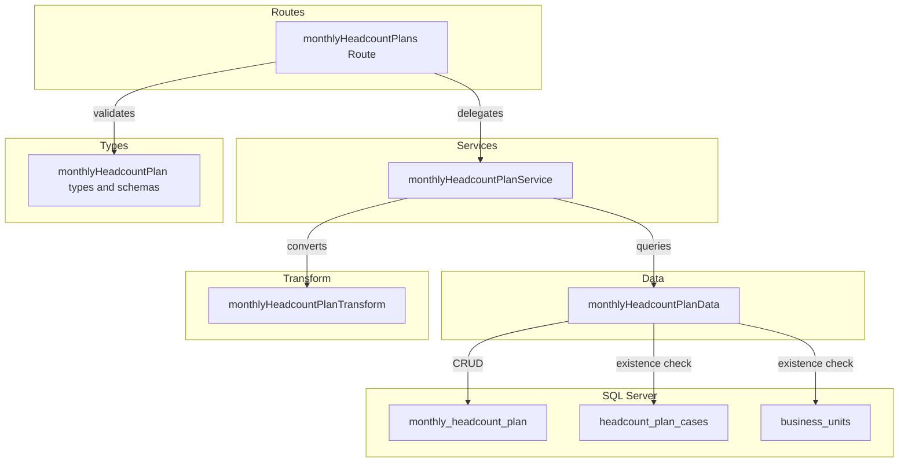
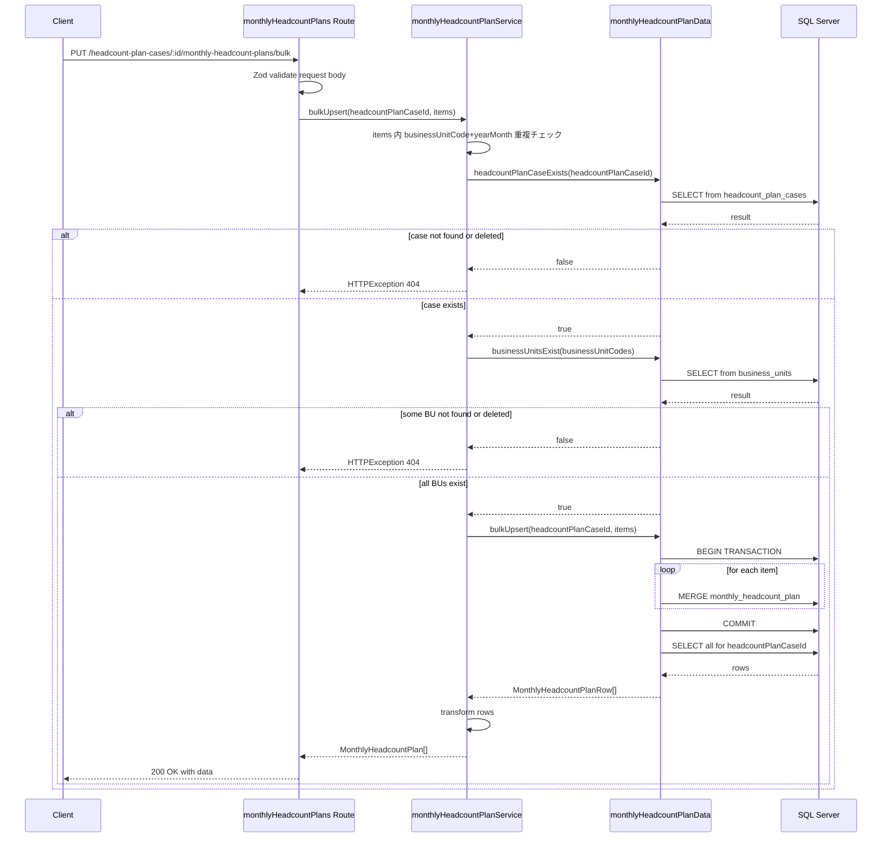
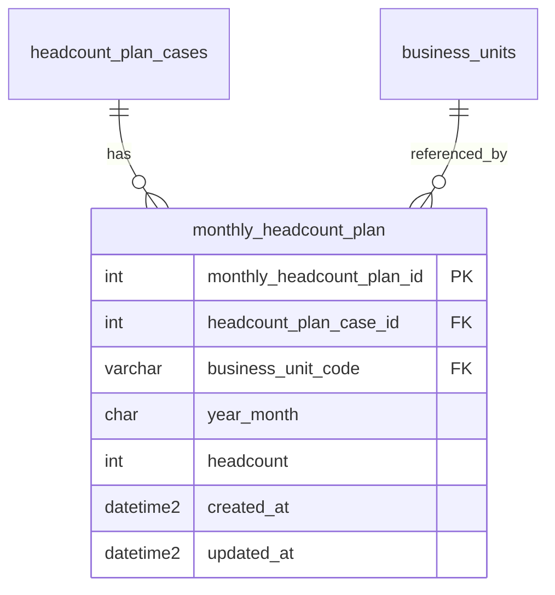

# Technical Design: monthly-headcount-plan-crud-api

## Overview

**Purpose**: 人員計画ケース（headcount_plan_cases）に紐づく月次人員計画データ（monthly_headcount_plan）の CRUD API を提供し、ビジネスユニット別・月別の人員数計画の入力・管理を可能にする。

**Users**: 事業部リーダーがビジネスユニットごとの月次人員数の入力・修正・一括更新に利用する。キャパシティ計画における人員供給側の基盤データとなる。

**Impact**: バックエンドに monthly_headcount_plan ファクトテーブル用の CRUD + バルク Upsert エンドポイントを追加。既存レイヤードアーキテクチャに routes/services/data/transform/types の各ファイルを新設し、`index.ts` にルートをマウントする。

### Goals
- monthly_headcount_plan テーブルに対する CRUD + バルク Upsert API の提供
- ファクトテーブル特有の動作（物理削除、ページネーションなし）の実現
- 3カラム複合ユニーク制約（headcount_plan_case_id, business_unit_code, year_month）に基づく重複チェック
- business_units 外部キーの存在確認
- businessUnitCode によるフィルタリング対応

### Non-Goals
- headcount_plan_cases テーブルの CRUD（別スペックで実装済み）
- business_units テーブルの CRUD（別スペックで実装済み）
- フロントエンド実装
- 認証・認可の実装

## Architecture

### Existing Architecture Analysis

既存バックエンドのレイヤードアーキテクチャをそのまま踏襲する:

- **routes/**: Hono ルート定義 + Zod バリデーション
- **services/**: ビジネスロジック + HTTPException によるエラーハンドリング
- **data/**: mssql による直接 SQL 実行
- **transform/**: DB 行（snake_case）→ API レスポンス（camelCase）変換
- **types/**: Zod スキーマ + TypeScript 型定義
- **utils/**: validate ヘルパー、errorHelper（RFC 9457 対応）

**ファクトテーブルとの差異**:
- 論理削除なし → softDelete/restore エンドポイント不要
- ページネーションなし → 全件返却
- バルク Upsert → 新規エンドポイント追加
- 親テーブル（headcount_plan_cases）の deleted_at チェックが必要
- business_units の deleted_at チェックが追加で必要

### Architecture Pattern & Boundary Map



**Architecture Integration**:
- Selected pattern: 既存レイヤードアーキテクチャの踏襲
- Domain boundaries: monthly_headcount_plan は headcount_plan_cases のファクトデータ（子リソース）、business_units への外部キーを持つ
- Existing patterns preserved: validate → service → data → transform の呼び出しフロー
- New components rationale: 各レイヤーに1ファイルずつ追加（既存パターンと同一構成）
- Steering compliance: routes → services → data の依存方向を遵守

### Technology Stack

| Layer | Choice / Version | Role in Feature | Notes |
|-------|------------------|-----------------|-------|
| Backend | Hono v4 | ルート定義・リクエスト処理 | 既存と同一 |
| Validation | Zod + validate ヘルパー | リクエストバリデーション | 既存パターン利用 |
| Data | mssql | SQL Server 接続・クエリ実行・MERGE 文 | バルク Upsert で MERGE 文を使用 |
| Testing | Vitest | ユニットテスト | app.request() パターン |

## System Flows

### バルク Upsert フロー



## Requirements Traceability

| Requirement | Summary | Components | Interfaces | Flows |
|-------------|---------|------------|------------|-------|
| 1.1 | 一覧取得 | Route, Service, Data | API GET / | - |
| 1.2 | data 配列形式 | Route | API GET / | - |
| 1.3 | BU昇順+yearMonth昇順ソート | Data | Service findAll | - |
| 1.4 | 親ケース不存在 404 | Service | Service findAll | - |
| 1.5 | businessUnitCode フィルタ | Route, Data | API GET / | - |
| 2.1 | 単一取得 | Route, Service, Data | API GET /:id | - |
| 2.2 | 単一 404 | Service | Service findById | - |
| 2.3 | headcountPlanCaseId 不一致 404 | Service | Service findById | - |
| 3.1 | 新規作成 201 | Route, Service, Data | API POST / | - |
| 3.2 | Location ヘッダ | Route | API POST / | - |
| 3.3 | Zod バリデーション | Types | - | - |
| 3.4 | バリデーション 422 | Route (validate) | - | - |
| 3.5 | 親ケース不存在 404 | Service | Service create | - |
| 3.6 | BU 不存在 404 | Service, Data | Service create | - |
| 3.7 | ユニーク制約重複 409 | Service, Data | Service create | - |
| 4.1 | 更新 200 | Route, Service, Data | API PUT /:id | - |
| 4.2 | 更新バリデーション | Types | - | - |
| 4.3 | 更新 404 | Service | Service update | - |
| 4.4 | 更新バリデーション 422 | Route (validate) | - | - |
| 4.5 | updated_at 更新 | Data | - | - |
| 4.6 | ユニーク制約重複 409 | Service, Data | Service update | - |
| 4.7 | BU 不存在 404 | Service, Data | Service update | - |
| 5.1 | 物理削除 204 | Route, Service, Data | API DELETE /:id | - |
| 5.2 | 削除 404 | Service | Service delete | - |
| 5.3 | headcountPlanCaseId 不一致 404 | Service | Service delete | - |
| 6.1 | バルク Upsert 200 | Route, Service, Data | API PUT /bulk | バルク Upsert フロー |
| 6.2 | items 配列形式 | Types | - | - |
| 6.3 | 各アイテムバリデーション | Types | - | - |
| 6.4 | 既存更新/新規作成 | Data | Service bulkUpsert | バルク Upsert フロー |
| 6.5 | バリデーション失敗時全件不変 | Route (validate) | - | - |
| 6.6 | 親ケース不存在 404 | Service | Service bulkUpsert | バルク Upsert フロー |
| 6.7 | 配列内重複 422 | Service | Service bulkUpsert | - |
| 6.8 | トランザクション制御 | Data | - | バルク Upsert フロー |
| 6.9 | BU 不存在 404 | Service, Data | Service bulkUpsert | バルク Upsert フロー |
| 7.1 | data 形式レスポンス | Route | API Contract 全般 | - |
| 7.2 | RFC 9457 エラー | 全コンポーネント（既存 errorHelper） | - | - |
| 7.3 | camelCase レスポンス | Transform | - | - |
| 7.4 | ISO 8601 日時 | Transform | - | - |
| 7.5 | headcount 整数型 | Transform | - | - |
| 8.1 | パスパラメータバリデーション | Route | - | - |
| 8.2 | パスパラメータ 422 | Route | - | - |
| 8.3 | YYYYMM バリデーション | Types | - | - |
| 8.4 | headcount 範囲バリデーション | Types | - | - |
| 8.5 | businessUnitCode バリデーション | Types | - | - |
| 9.1-9.4 | テスト | monthlyHeadcountPlans.test.ts | - | - |

## Components and Interfaces

| Component | Domain/Layer | Intent | Req Coverage | Key Dependencies | Contracts |
|-----------|--------------|--------|--------------|-----------------|-----------|
| monthlyHeadcountPlan types | Types | Zod スキーマ・型定義 | 3.3, 4.2, 6.2-6.3, 8.1-8.5 | - | Service |
| monthlyHeadcountPlanData | Data | SQL クエリ実行・MERGE | 1.1-1.5, 2.1-2.3, 3.1, 3.5-3.7, 4.1, 4.3, 4.5-4.7, 5.1-5.3, 6.1, 6.4, 6.6, 6.8-6.9 | mssql (P0), getPool (P0) | Service |
| monthlyHeadcountPlanTransform | Transform | DB行→APIレスポンス変換 | 7.3-7.5 | monthlyHeadcountPlan types (P0) | - |
| monthlyHeadcountPlanService | Services | ビジネスロジック・エラー | 1.4, 2.2-2.3, 3.5-3.7, 4.3, 4.6-4.7, 5.2-5.3, 6.6-6.7, 6.9 | monthlyHeadcountPlanData (P0), monthlyHeadcountPlanTransform (P0) | Service |
| monthlyHeadcountPlans Route | Routes | エンドポイント定義 | 1.1-1.2, 1.5, 2.1, 3.1-3.2, 3.4, 4.1, 4.4, 5.1, 6.1, 6.5, 7.1-7.2, 8.1-8.2 | monthlyHeadcountPlanService (P0), validate (P0) | API |

### Types Layer

#### monthlyHeadcountPlan types

| Field | Detail |
|-------|--------|
| Intent | monthly_headcount_plan の Zod バリデーションスキーマと TypeScript 型を定義する |
| Requirements | 3.3, 4.2, 6.2-6.3, 8.1-8.5 |

**Responsibilities & Constraints**
- 作成・更新リクエストのバリデーションスキーマ定義
- バルク Upsert リクエストのスキーマ定義（items 配列）
- DB 行型（snake_case）と API レスポンス型（camelCase）の定義
- `any` 型禁止、すべて Zod の `z.infer` で導出

**Dependencies**
- Inbound: routes — バリデーション (P0)

**Contracts**: Service [x]

##### Service Interface

```typescript
// Zod スキーマ
const yearMonthSchema: z.ZodString
// regex(/^\d{6}$/) + refine で月の範囲 01-12 チェック

const businessUnitCodeSchema: z.ZodString
// min(1).max(20)

const createMonthlyHeadcountPlanSchema: z.ZodObject<{
  businessUnitCode: z.ZodString    // 必須・1〜20文字
  yearMonth: z.ZodString           // 必須・YYYYMM形式
  headcount: z.ZodNumber           // 必須・int().min(0)
}>

const updateMonthlyHeadcountPlanSchema: z.ZodObject<{
  businessUnitCode: z.ZodOptional<z.ZodString>  // 任意・1〜20文字
  yearMonth: z.ZodOptional<z.ZodString>          // 任意・YYYYMM形式
  headcount: z.ZodOptional<z.ZodNumber>           // 任意・int().min(0)
}>

const bulkUpsertItemSchema: z.ZodObject<{
  businessUnitCode: z.ZodString    // 必須・1〜20文字
  yearMonth: z.ZodString           // 必須・YYYYMM形式
  headcount: z.ZodNumber           // 必須・int().min(0)
}>

const bulkUpsertMonthlyHeadcountPlanSchema: z.ZodObject<{
  items: z.ZodArray<typeof bulkUpsertItemSchema>  // min(1)
}>

// TypeScript 型
type CreateMonthlyHeadcountPlan = z.infer<typeof createMonthlyHeadcountPlanSchema>
type UpdateMonthlyHeadcountPlan = z.infer<typeof updateMonthlyHeadcountPlanSchema>
type BulkUpsertMonthlyHeadcountPlan = z.infer<typeof bulkUpsertMonthlyHeadcountPlanSchema>

type MonthlyHeadcountPlanRow = {
  monthly_headcount_plan_id: number
  headcount_plan_case_id: number
  business_unit_code: string
  year_month: string
  headcount: number
  created_at: Date
  updated_at: Date
}

type MonthlyHeadcountPlan = {
  monthlyHeadcountPlanId: number
  headcountPlanCaseId: number
  businessUnitCode: string
  yearMonth: string
  headcount: number
  createdAt: string       // ISO 8601
  updatedAt: string       // ISO 8601
}
```

- Preconditions: なし
- Postconditions: すべてのスキーマが TypeScript 型と整合
- Invariants: DB 行型は snake_case、API レスポンス型は camelCase

### Data Layer

#### monthlyHeadcountPlanData

| Field | Detail |
|-------|--------|
| Intent | monthly_headcount_plan テーブルへの SQL クエリ実行（CRUD + MERGE によるバルク Upsert） |
| Requirements | 1.1-1.5, 2.1-2.3, 3.1, 3.5-3.7, 4.1, 4.3, 4.5-4.7, 5.1-5.3, 6.1, 6.4, 6.6, 6.8-6.9 |

**Responsibilities & Constraints**
- SQL Server へのクエリ実行のみ担当（ビジネスロジックを含めない）
- headcount_plan_cases テーブルの存在確認 + deleted_at チェック
- business_units テーブルの存在確認 + deleted_at チェック
- (headcount_plan_case_id, business_unit_code, year_month) ユニーク制約に基づく重複チェック
- バルク Upsert はトランザクション内で MERGE 文をループ実行
- 物理削除（DELETE 文）

**Dependencies**
- Inbound: monthlyHeadcountPlanService — 全メソッド呼び出し (P0)
- Outbound: `@/database/client` — getPool (P0)
- External: mssql — SQL Server 接続 (P0)

**Contracts**: Service [x]

##### Service Interface

```typescript
interface MonthlyHeadcountPlanDataInterface {
  findAll(headcountPlanCaseId: number, businessUnitCode?: string): Promise<MonthlyHeadcountPlanRow[]>
  // ORDER BY business_unit_code ASC, year_month ASC
  // businessUnitCode が指定された場合は WHERE 条件に追加

  findById(monthlyHeadcountPlanId: number): Promise<MonthlyHeadcountPlanRow | undefined>

  create(data: {
    headcountPlanCaseId: number
    businessUnitCode: string
    yearMonth: string
    headcount: number
  }): Promise<MonthlyHeadcountPlanRow>

  update(
    monthlyHeadcountPlanId: number,
    data: Partial<{
      businessUnitCode: string
      yearMonth: string
      headcount: number
    }>
  ): Promise<MonthlyHeadcountPlanRow | undefined>

  deleteById(monthlyHeadcountPlanId: number): Promise<boolean>
  // 物理削除。削除成功 true、レコード不存在 false

  bulkUpsert(
    headcountPlanCaseId: number,
    items: Array<{ businessUnitCode: string; yearMonth: string; headcount: number }>
  ): Promise<MonthlyHeadcountPlanRow[]>
  // トランザクション内で MERGE 文をループ実行
  // 完了後、headcountPlanCaseId の全レコードを business_unit_code ASC, year_month ASC で返却

  headcountPlanCaseExists(headcountPlanCaseId: number): Promise<boolean>
  // headcount_plan_cases テーブルで deleted_at IS NULL のレコードの存在確認

  businessUnitExists(businessUnitCode: string): Promise<boolean>
  // business_units テーブルで deleted_at IS NULL のレコードの存在確認

  businessUnitsExist(businessUnitCodes: string[]): Promise<boolean>
  // 複数 BU の一括存在確認。全て存在すれば true

  uniqueConstraintExists(
    headcountPlanCaseId: number,
    businessUnitCode: string,
    yearMonth: string,
    excludeId?: number
  ): Promise<boolean>
  // ユニーク制約チェック（更新時は自身を除外）
}
```

- Preconditions: DB 接続プールが利用可能
- Postconditions: 各メソッドは MonthlyHeadcountPlanRow またはプリミティブ値を返却
- Invariants: findAll は business_unit_code ASC, year_month ASC でソート。bulkUpsert はトランザクション内で全操作を実行し、失敗時はロールバック

**Implementation Notes**
- findAll の SELECT: `SELECT * FROM monthly_headcount_plan WHERE headcount_plan_case_id = @headcountPlanCaseId [AND business_unit_code = @businessUnitCode] ORDER BY business_unit_code ASC, year_month ASC`
- create は OUTPUT 句で IDENTITY 値を取得後、findById で行を返却
- bulkUpsert の MERGE 文: `MERGE monthly_headcount_plan AS target USING (SELECT @headcountPlanCaseId, @businessUnitCode, @yearMonth) AS source(headcount_plan_case_id, business_unit_code, year_month) ON target.headcount_plan_case_id = source.headcount_plan_case_id AND target.business_unit_code = source.business_unit_code AND target.year_month = source.year_month WHEN MATCHED THEN UPDATE SET headcount = @headcount, updated_at = GETDATE() WHEN NOT MATCHED THEN INSERT (...) VALUES (...)`
- deleteById は `DELETE FROM monthly_headcount_plan WHERE monthly_headcount_plan_id = @monthlyHeadcountPlanId` で rowsAffected > 0 を返却
- businessUnitsExist: `SELECT COUNT(DISTINCT business_unit_code) FROM business_units WHERE business_unit_code IN (...) AND deleted_at IS NULL` の結果と入力配列長を比較

### Transform Layer

#### monthlyHeadcountPlanTransform

| Field | Detail |
|-------|--------|
| Intent | MonthlyHeadcountPlanRow（snake_case）から MonthlyHeadcountPlan（camelCase）への変換 |
| Requirements | 7.3-7.5 |

**Responsibilities & Constraints**
- snake_case → camelCase のフィールド名変換
- Date → ISO 8601 文字列変換
- headcount は number 型（INT）のまま返却

**Dependencies**
- Inbound: monthlyHeadcountPlanService — 変換処理 (P0)
- Outbound: monthlyHeadcountPlan types — MonthlyHeadcountPlanRow, MonthlyHeadcountPlan (P0)

**Contracts**: Service [x]

##### Service Interface

```typescript
function toMonthlyHeadcountPlanResponse(row: MonthlyHeadcountPlanRow): MonthlyHeadcountPlan
```

- Preconditions: row が null でないこと
- Postconditions: camelCase の MonthlyHeadcountPlan オブジェクトを返却
- Invariants: created_at/updated_at は ISO 8601 文字列に変換

### Service Layer

#### monthlyHeadcountPlanService

| Field | Detail |
|-------|--------|
| Intent | 月次人員計画データのビジネスロジック・エラーハンドリングを集約する |
| Requirements | 1.4, 2.2-2.3, 3.5-3.7, 4.3, 4.6-4.7, 5.2-5.3, 6.6-6.7, 6.9 |

**Responsibilities & Constraints**
- 親リソース（headcount_plan_cases）の存在確認（deleted_at IS NULL）
- business_units の存在確認（deleted_at IS NULL）
- (headcount_plan_case_id, business_unit_code, year_month) ユニーク制約に基づく重複チェック（create/update 時）
- バルク Upsert 時の配列内 (businessUnitCode, yearMonth) 重複チェック
- headcountPlanCaseId の親子整合性チェック（単一取得/更新/削除時）
- HTTPException による統一的なエラー送出

**Dependencies**
- Inbound: monthlyHeadcountPlans Route — 全エンドポイント (P0)
- Outbound: monthlyHeadcountPlanData — DB アクセス (P0)
- Outbound: monthlyHeadcountPlanTransform — レスポンス変換 (P0)

**Contracts**: Service [x]

##### Service Interface

```typescript
interface MonthlyHeadcountPlanServiceInterface {
  findAll(headcountPlanCaseId: number, businessUnitCode?: string): Promise<MonthlyHeadcountPlan[]>
  // Throws: HTTPException(404) if headcountPlanCase not found or deleted (1.4)

  findById(headcountPlanCaseId: number, monthlyHeadcountPlanId: number): Promise<MonthlyHeadcountPlan>
  // Throws: HTTPException(404) if not found or headcountPlanCaseId mismatch (2.2, 2.3)

  create(headcountPlanCaseId: number, data: CreateMonthlyHeadcountPlan): Promise<MonthlyHeadcountPlan>
  // Throws: HTTPException(404) if headcountPlanCase not found or deleted (3.5)
  // Throws: HTTPException(404) if businessUnit not found or deleted (3.6)
  // Throws: HTTPException(409) if unique constraint violation (3.7)

  update(
    headcountPlanCaseId: number,
    monthlyHeadcountPlanId: number,
    data: UpdateMonthlyHeadcountPlan
  ): Promise<MonthlyHeadcountPlan>
  // Throws: HTTPException(404) if not found or headcountPlanCaseId mismatch (4.3)
  // Throws: HTTPException(409) if unique constraint conflict (4.6)
  // Throws: HTTPException(404) if businessUnit not found or deleted (4.7)

  delete(headcountPlanCaseId: number, monthlyHeadcountPlanId: number): Promise<void>
  // Throws: HTTPException(404) if not found or headcountPlanCaseId mismatch (5.2, 5.3)

  bulkUpsert(
    headcountPlanCaseId: number,
    data: BulkUpsertMonthlyHeadcountPlan
  ): Promise<MonthlyHeadcountPlan[]>
  // Throws: HTTPException(404) if headcountPlanCase not found or deleted (6.6)
  // Throws: HTTPException(422) if (businessUnitCode, yearMonth) duplicates in items array (6.7)
  // Throws: HTTPException(404) if any businessUnit not found or deleted (6.9)
}
```

- Preconditions: 各メソッドの引数が型スキーマに適合
- Postconditions: 正常時は MonthlyHeadcountPlan を返却、異常時は HTTPException を送出
- Invariants: headcountPlanCaseId の親子整合性は全操作で検証

**Implementation Notes**
- findById/update/delete 時: data 層で取得した行の `headcount_plan_case_id` と URL の `headcountPlanCaseId` を比較し、不一致なら 404
- bulkUpsert: 配列内の (businessUnitCode, yearMonth) を Set（`${businessUnitCode}:${yearMonth}` をキー）で重複チェック → businessUnitsExist で BU 一括存在確認 → data 層の bulkUpsert を呼び出し → 結果を transform

### Route Layer

#### monthlyHeadcountPlans Route

| Field | Detail |
|-------|--------|
| Intent | `/headcount-plan-cases/:headcountPlanCaseId/monthly-headcount-plans` 配下の HTTP エンドポイントを定義する |
| Requirements | 1.1-1.2, 1.5, 2.1, 3.1-3.2, 3.4, 4.1, 4.4, 5.1, 6.1, 6.5, 7.1-7.2, 8.1-8.2 |

**Responsibilities & Constraints**
- Zod バリデーション（json）の適用
- パスパラメータ（headcountPlanCaseId, monthlyHeadcountPlanId）の parseInt 変換とバリデーション
- クエリパラメータ businessUnitCode の取得
- サービス層への委譲
- HTTP ステータスコードとレスポンス形式の制御
- Location ヘッダの設定（POST 201 時）
- `/bulk` エンドポイントを `:monthlyHeadcountPlanId` の前に定義してルーティング衝突を回避

**Dependencies**
- Inbound: index.ts — app.route() でマウント (P0)
- Outbound: monthlyHeadcountPlanService — ビジネスロジック (P0)
- Outbound: validate — Zod バリデーション (P0)
- Outbound: monthlyHeadcountPlan types — スキーマ (P0)

**Contracts**: API [x]

##### API Contract

| Method | Endpoint | Request | Response | Errors |
|--------|----------|---------|----------|--------|
| GET | / | query: businessUnitCode (optional) | `{ data: MonthlyHeadcountPlan[] }` 200 | 404, 422 |
| GET | /:monthlyHeadcountPlanId | param: monthlyHeadcountPlanId (int) | `{ data: MonthlyHeadcountPlan }` 200 | 404, 422 |
| POST | / | json: createMonthlyHeadcountPlanSchema | `{ data: MonthlyHeadcountPlan }` 201 + Location | 404, 409, 422 |
| PUT | /bulk | json: bulkUpsertMonthlyHeadcountPlanSchema | `{ data: MonthlyHeadcountPlan[] }` 200 | 404, 422 |
| PUT | /:monthlyHeadcountPlanId | json: updateMonthlyHeadcountPlanSchema | `{ data: MonthlyHeadcountPlan }` 200 | 404, 409, 422 |
| DELETE | /:monthlyHeadcountPlanId | - | 204 No Content | 404 |

**Implementation Notes**
- index.ts に `app.route('/headcount-plan-cases/:headcountPlanCaseId/monthly-headcount-plans', monthlyHeadcountPlans)` でマウント
- headcountPlanCaseId は各ハンドラで `c.req.param('headcountPlanCaseId')` → `parseInt` で取得。NaN の場合は HTTPException(422)
- `PUT /bulk` は `PUT /:monthlyHeadcountPlanId` より前に定義してルーティング衝突を回避
- GET 一覧のクエリパラメータ businessUnitCode は `c.req.query('businessUnitCode')` で取得（undefined 許容）

## Data Models

### Domain Model



- **Aggregate**: monthly_headcount_plan は headcount_plan_cases の子ファクトデータ
- **Business Rules**:
  - 同一 (headcount_plan_case_id, business_unit_code, year_month) の組み合わせは一意
  - 物理削除（deleted_at なし）
  - 親テーブル削除時は ON DELETE CASCADE で自動削除
  - business_units テーブルの削除済みレコードは参照不可

### Physical Data Model

monthly_headcount_plan テーブルの既存定義（`docs/database/table-spec.md` 参照）をそのまま利用する。スキーマ変更は不要。

| Column | Type | Nullable | Description |
|--------|------|----------|-------------|
| monthly_headcount_plan_id | INT IDENTITY(1,1) | NO | 主キー |
| headcount_plan_case_id | INT | NO | FK → headcount_plan_cases(ON DELETE CASCADE) |
| business_unit_code | VARCHAR(20) | NO | FK → business_units |
| year_month | CHAR(6) | NO | 年月 YYYYMM |
| headcount | INT | NO | 人数 |
| created_at | DATETIME2 | NO | 作成日時 |
| updated_at | DATETIME2 | NO | 更新日時 |

**ユニークインデックス**: UQ_monthly_headcount_plan_case_bu_ym (headcount_plan_case_id, business_unit_code, year_month)

### Data Contracts & Integration

**API Data Transfer**

リクエスト: camelCase（Zod スキーマで定義）
レスポンス: camelCase（monthlyHeadcountPlanTransform で変換）
シリアライゼーション: JSON

## Error Handling

### Error Strategy

既存のグローバルエラーハンドラ（`index.ts` の `app.onError`）と validate ヘルパー（`utils/validate.ts`）を利用する。新規のエラーハンドリングコードは不要。

### Error Categories and Responses

| Category | Status | Trigger | Detail |
|----------|--------|---------|--------|
| バリデーション | 422 | Zod スキーマ不適合、パスパラメータ不正、バルク配列内重複 | RFC 9457 + errors 配列 |
| リソース不存在 | 404 | headcountPlanCaseId 不存在/論理削除済み、businessUnitCode 不存在/論理削除済み、monthlyHeadcountPlanId 不存在、headcountPlanCaseId 不一致 | RFC 9457 |
| 競合 | 409 | (headcount_plan_case_id, business_unit_code, year_month) ユニーク制約違反（create/update 時） | RFC 9457 |
| 内部エラー | 500 | 予期しない例外 | RFC 9457（グローバルハンドラ） |

## Testing Strategy

### Unit Tests

テストファイル: `src/__tests__/routes/monthlyHeadcountPlans.test.ts`

パターン: Vitest + `app.request()` を使用した HTTP レベルテスト。service 層をモック。

| テスト区分 | テスト内容 |
|-----------|-----------|
| GET / 正常系 | 一覧取得、BU昇順+yearMonth昇順ソート、data 配列形式、businessUnitCode フィルタ |
| GET /:id 正常系 | 単一取得、data オブジェクト形式 |
| POST / 正常系 | 作成、201 + Location ヘッダ、レスポンスボディ |
| PUT /:id 正常系 | 更新、200 + 更新されたフィールド確認 |
| DELETE /:id 正常系 | 物理削除、204 No Content |
| PUT /bulk 正常系 | バルク Upsert、200 + data 配列形式 |
| GET / 異常系 | 不存在/削除済み headcountPlanCaseId → 404 |
| GET /:id 異常系 | 不存在 → 404、headcountPlanCaseId 不一致 → 404 |
| POST / 異常系 | バリデーション → 422、親ケース不存在 → 404、BU不存在 → 404、ユニーク重複 → 409 |
| PUT /:id 異常系 | 不存在 → 404、バリデーション → 422、ユニーク重複 → 409、BU不存在 → 404 |
| DELETE /:id 異常系 | 不存在 → 404 |
| PUT /bulk 異常系 | バリデーション → 422、親ケース不存在 → 404、配列内重複 → 422、BU不存在 → 404 |
