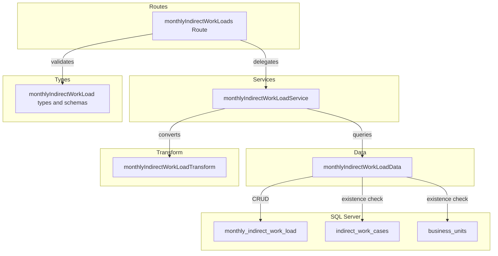
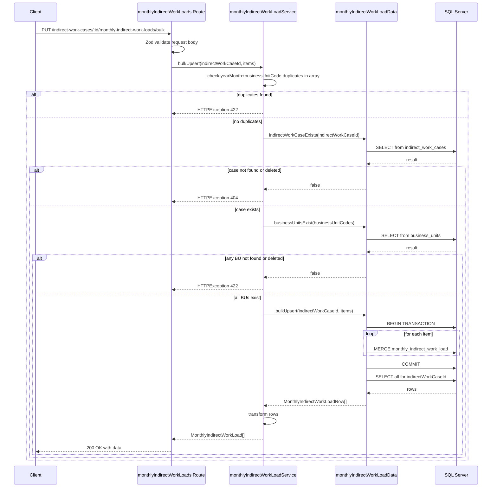
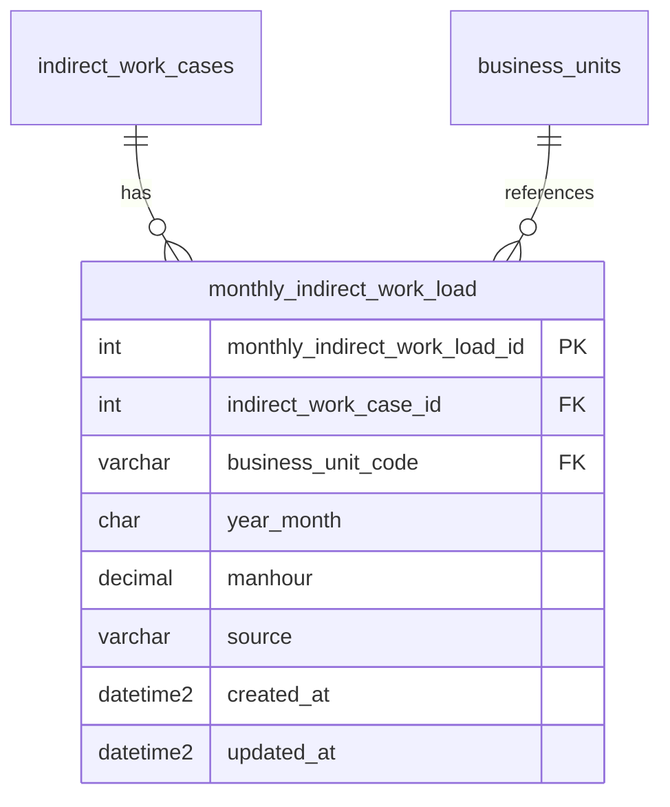

# Technical Design: monthly-indirect-work-load-crud-api

## Overview

**Purpose**: 間接作業ケース（indirect_work_cases）に紐づく月次間接作業負荷データ（monthly_indirect_work_load）の CRUD API を提供し、間接作業工数計画の入力・管理を可能にする。

**Users**: 事業部リーダーが月次の間接作業負荷の入力・修正・一括更新に利用する。フロントエンドの積み上げチャートでの間接作業負荷可視化の基盤データとなる。

**Impact**: バックエンドに monthly_indirect_work_load ファクトテーブル用の CRUD + バルク Upsert エンドポイントを追加。既存レイヤードアーキテクチャに routes/services/data/transform/types の各ファイルを新設し、`index.ts` にルートをマウントする。

### Goals
- monthly_indirect_work_load テーブルに対する CRUD + バルク Upsert API の提供
- ファクトテーブル特有の動作（物理削除、ページネーションなし）の実現
- 既存の CRUD 実装パターンとの一貫性維持
- (indirect_work_case_id, business_unit_code, year_month) ユニーク制約に基づく重複チェック
- source フィールド（"calculated" / "manual"）のバリデーション

### Non-Goals
- indirect_work_cases テーブルの CRUD（別スペックで実装済み）
- フロントエンド実装
- 認証・認可の実装
- 間接作業負荷の自動計算ロジック（calculated ソースのデータ生成ロジック）

## Architecture

### Existing Architecture Analysis

既存バックエンドのレイヤードアーキテクチャをそのまま踏襲する:

- **routes/**: Hono ルート定義 + Zod バリデーション
- **services/**: ビジネスロジック + HTTPException によるエラーハンドリング
- **data/**: mssql による直接 SQL 実行
- **transform/**: DB 行（snake_case）→ API レスポンス（camelCase）変換
- **types/**: Zod スキーマ + TypeScript 型定義
- **utils/**: validate ヘルパー、errorHelper（RFC 9457 対応）

**ファクトテーブルとの差異**:
- 論理削除なし → softDelete/restore エンドポイント不要
- ページネーションなし → 全件返却
- バルク Upsert → 新規エンドポイント追加
- 親テーブル（indirect_work_cases）の deleted_at チェックが必要
- business_unit_code の外部キー存在確認が必要（monthly_capacity と同パターン）

### Architecture Pattern & Boundary Map



**Architecture Integration**:
- Selected pattern: 既存レイヤードアーキテクチャの踏襲
- Domain boundaries: monthly_indirect_work_load は indirect_work_cases のファクトデータ（子リソース）
- Existing patterns preserved: validate → service → data → transform の呼び出しフロー
- New components rationale: 各レイヤーに1ファイルずつ追加（既存パターンと同一構成）
- Steering compliance: routes → services → data の依存方向を遵守

### Technology Stack

| Layer | Choice / Version | Role in Feature | Notes |
|-------|------------------|-----------------|-------|
| Backend | Hono v4 | ルート定義・リクエスト処理 | 既存と同一 |
| Validation | Zod + validate ヘルパー | リクエストバリデーション | 既存パターン利用 |
| Data | mssql | SQL Server 接続・クエリ実行・MERGE 文 | バルク Upsert で MERGE 文を使用 |
| Testing | Vitest | ユニットテスト | app.request() パターン |

## System Flows

### バルク Upsert フロー



## Requirements Traceability

| Requirement | Summary | Components | Interfaces | Flows |
|-------------|---------|------------|------------|-------|
| 1.1 | 一覧取得 | monthlyIndirectWorkLoads Route, Service, Data | API GET / | - |
| 1.2 | data 配列形式 | monthlyIndirectWorkLoads Route | API GET / | - |
| 1.3 | BU+year_month 昇順ソート | monthlyIndirectWorkLoadData | Service findAll | - |
| 1.4 | 親ケース不存在 404 | monthlyIndirectWorkLoadService | Service findAll | - |
| 2.1 | 単一取得 | monthlyIndirectWorkLoads Route, Service, Data | API GET /:id | - |
| 2.2 | 単一 404 | monthlyIndirectWorkLoadService | Service findById | - |
| 2.3 | indirectWorkCaseId 不一致 404 | monthlyIndirectWorkLoadService | Service findById | - |
| 3.1 | 新規作成 201 | monthlyIndirectWorkLoads Route, Service, Data | API POST / | - |
| 3.2 | Location ヘッダ | monthlyIndirectWorkLoads Route | API POST / | - |
| 3.3 | Zod バリデーション | monthlyIndirectWorkLoad types | - | - |
| 3.4 | バリデーション 422 | monthlyIndirectWorkLoads Route (validate) | - | - |
| 3.5 | 親ケース不存在 404 | monthlyIndirectWorkLoadService | Service create | - |
| 3.6 | BU 不存在 422 | monthlyIndirectWorkLoadService, Data | Service create | - |
| 3.7 | BU+yearMonth 重複 409 | monthlyIndirectWorkLoadService, Data | Service create | - |
| 4.1 | 更新 200 | monthlyIndirectWorkLoads Route, Service, Data | API PUT /:id | - |
| 4.2 | 更新バリデーション | monthlyIndirectWorkLoad types | - | - |
| 4.3 | 更新 404 | monthlyIndirectWorkLoadService | Service update | - |
| 4.4 | 更新バリデーション 422 | monthlyIndirectWorkLoads Route (validate) | - | - |
| 4.5 | updated_at 更新 | monthlyIndirectWorkLoadData | - | - |
| 4.6 | BU+yearMonth 重複 409 | monthlyIndirectWorkLoadService, Data | Service update | - |
| 4.7 | 更新後 BU 不存在 422 | monthlyIndirectWorkLoadService, Data | Service update | - |
| 5.1 | 物理削除 204 | monthlyIndirectWorkLoads Route, Service, Data | API DELETE /:id | - |
| 5.2 | 削除 404 | monthlyIndirectWorkLoadService | Service delete | - |
| 5.3 | indirectWorkCaseId 不一致 404 | monthlyIndirectWorkLoadService | Service delete | - |
| 6.1 | バルク Upsert 200 | monthlyIndirectWorkLoads Route, Service, Data | API PUT /bulk | バルク Upsert フロー |
| 6.2 | items 配列形式 | monthlyIndirectWorkLoad types | - | - |
| 6.3 | 各アイテムバリデーション | monthlyIndirectWorkLoad types | - | - |
| 6.4 | 既存更新/新規作成 | monthlyIndirectWorkLoadData | Service bulkUpsert | バルク Upsert フロー |
| 6.5 | バリデーション失敗時全件不変 | monthlyIndirectWorkLoads Route (validate) | - | - |
| 6.6 | 親ケース不存在 404 | monthlyIndirectWorkLoadService | Service bulkUpsert | バルク Upsert フロー |
| 6.7 | BU+yearMonth 配列内重複 422 | monthlyIndirectWorkLoadService | Service bulkUpsert | - |
| 6.8 | トランザクション制御 | monthlyIndirectWorkLoadData | - | バルク Upsert フロー |
| 6.9 | BU 不存在 422 | monthlyIndirectWorkLoadService, Data | Service bulkUpsert | バルク Upsert フロー |
| 7.1 | data 形式レスポンス | monthlyIndirectWorkLoads Route | API Contract 全般 | - |
| 7.2 | RFC 9457 エラー | 全コンポーネント（既存 errorHelper） | - | - |
| 7.3 | camelCase レスポンス | monthlyIndirectWorkLoadTransform | - | - |
| 7.4 | ISO 8601 日時 | monthlyIndirectWorkLoadTransform | - | - |
| 7.5 | manhour 数値型 | monthlyIndirectWorkLoadTransform | - | - |
| 8.1 | パスパラメータバリデーション | monthlyIndirectWorkLoads Route | - | - |
| 8.2 | パスパラメータ 422 | monthlyIndirectWorkLoads Route | - | - |
| 8.3 | YYYYMM バリデーション | monthlyIndirectWorkLoad types | - | - |
| 8.4 | manhour 範囲バリデーション | monthlyIndirectWorkLoad types | - | - |
| 8.5 | businessUnitCode バリデーション | monthlyIndirectWorkLoad types | - | - |
| 8.6 | source enum バリデーション | monthlyIndirectWorkLoad types | - | - |
| 9.1-9.4 | テスト | monthlyIndirectWorkLoads.test.ts | - | - |

## Components and Interfaces

| Component | Domain/Layer | Intent | Req Coverage | Key Dependencies | Contracts |
|-----------|--------------|--------|--------------|-----------------|-----------|
| monthlyIndirectWorkLoad types | Types | Zod スキーマ・型定義 | 3.3, 4.2, 6.2-6.3, 8.1-8.6 | - | Service |
| monthlyIndirectWorkLoadData | Data | SQL クエリ実行・MERGE | 1.1-1.4, 2.1-2.3, 3.1, 3.5-3.7, 4.1, 4.3, 4.5-4.7, 5.1-5.3, 6.1, 6.4, 6.6, 6.8-6.9 | mssql (P0), getPool (P0) | Service |
| monthlyIndirectWorkLoadTransform | Transform | DB行→APIレスポンス変換 | 7.3-7.5 | monthlyIndirectWorkLoad types (P0) | - |
| monthlyIndirectWorkLoadService | Services | ビジネスロジック・エラー | 1.4, 2.2-2.3, 3.5-3.7, 4.3, 4.6-4.7, 5.2-5.3, 6.6-6.7, 6.9 | monthlyIndirectWorkLoadData (P0), monthlyIndirectWorkLoadTransform (P0) | Service |
| monthlyIndirectWorkLoads Route | Routes | エンドポイント定義 | 1.1-1.2, 2.1, 3.1-3.2, 3.4, 4.1, 4.4, 5.1, 6.1, 6.5, 7.1-7.2, 8.1-8.2 | monthlyIndirectWorkLoadService (P0), validate (P0) | API |

### Types Layer

#### monthlyIndirectWorkLoad types

| Field | Detail |
|-------|--------|
| Intent | monthly_indirect_work_load の Zod バリデーションスキーマと TypeScript 型を定義する |
| Requirements | 3.3, 4.2, 6.2-6.3, 8.1-8.6 |

**Responsibilities & Constraints**
- 作成・更新リクエストのバリデーションスキーマ定義
- バルク Upsert リクエストのスキーマ定義（items 配列）
- DB 行型（snake_case）と API レスポンス型（camelCase）の定義
- source フィールドの enum バリデーション（"calculated" | "manual"）
- `any` 型禁止、すべて Zod の `z.infer` で導出

**Dependencies**
- Inbound: routes — バリデーション (P0)

**Contracts**: Service [x]

##### Service Interface

```typescript
// Zod スキーマ
const yearMonthSchema: z.ZodString
// regex(/^\d{6}$/) + refine で月の範囲 01-12 チェック

const sourceSchema: z.ZodEnum<["calculated", "manual"]>

const createMonthlyIndirectWorkLoadSchema: z.ZodObject<{
  businessUnitCode: z.ZodString    // 必須・min(1).max(20)
  yearMonth: z.ZodString           // 必須・YYYYMM形式
  manhour: z.ZodNumber             // 必須・min(0).max(99999999.99)
  source: z.ZodEnum<["calculated", "manual"]>  // 必須
}>

const updateMonthlyIndirectWorkLoadSchema: z.ZodObject<{
  businessUnitCode: z.ZodOptional<z.ZodString>   // 任意・min(1).max(20)
  yearMonth: z.ZodOptional<z.ZodString>          // 任意・YYYYMM形式
  manhour: z.ZodOptional<z.ZodNumber>            // 任意・min(0).max(99999999.99)
  source: z.ZodOptional<z.ZodEnum<["calculated", "manual"]>>  // 任意
}>

const bulkUpsertItemSchema: z.ZodObject<{
  businessUnitCode: z.ZodString    // 必須・min(1).max(20)
  yearMonth: z.ZodString           // 必須・YYYYMM形式
  manhour: z.ZodNumber             // 必須・min(0).max(99999999.99)
  source: z.ZodEnum<["calculated", "manual"]>  // 必須
}>

const bulkUpsertMonthlyIndirectWorkLoadSchema: z.ZodObject<{
  items: z.ZodArray<typeof bulkUpsertItemSchema>  // min(1)
}>

// TypeScript 型
type CreateMonthlyIndirectWorkLoad = z.infer<typeof createMonthlyIndirectWorkLoadSchema>
type UpdateMonthlyIndirectWorkLoad = z.infer<typeof updateMonthlyIndirectWorkLoadSchema>
type BulkUpsertMonthlyIndirectWorkLoad = z.infer<typeof bulkUpsertMonthlyIndirectWorkLoadSchema>

type MonthlyIndirectWorkLoadRow = {
  monthly_indirect_work_load_id: number
  indirect_work_case_id: number
  business_unit_code: string
  year_month: string
  manhour: number         // DECIMAL(10,2) → number
  source: string          // "calculated" | "manual"
  created_at: Date
  updated_at: Date
}

type MonthlyIndirectWorkLoad = {
  monthlyIndirectWorkLoadId: number
  indirectWorkCaseId: number
  businessUnitCode: string
  yearMonth: string
  manhour: number
  source: string          // "calculated" | "manual"
  createdAt: string       // ISO 8601
  updatedAt: string       // ISO 8601
}
```

- Preconditions: なし
- Postconditions: すべてのスキーマが TypeScript 型と整合
- Invariants: DB 行型は snake_case、API レスポンス型は camelCase

### Data Layer

#### monthlyIndirectWorkLoadData

| Field | Detail |
|-------|--------|
| Intent | monthly_indirect_work_load テーブルへの SQL クエリ実行（CRUD + MERGE によるバルク Upsert） |
| Requirements | 1.1-1.4, 2.1-2.3, 3.1, 3.5-3.7, 4.1, 4.3, 4.5-4.7, 5.1-5.3, 6.1, 6.4, 6.6, 6.8-6.9 |

**Responsibilities & Constraints**
- SQL Server へのクエリ実行のみ担当（ビジネスロジックを含めない）
- indirect_work_cases テーブルの存在確認 + deleted_at チェック
- business_units テーブルの存在確認 + deleted_at チェック
- (indirect_work_case_id, business_unit_code, year_month) ユニーク制約に基づく重複チェック
- バルク Upsert はトランザクション内で MERGE 文をループ実行
- 物理削除（DELETE 文）

**Dependencies**
- Inbound: monthlyIndirectWorkLoadService — 全メソッド呼び出し (P0)
- Outbound: `@/database/client` — getPool (P0)
- External: mssql — SQL Server 接続 (P0)

**Contracts**: Service [x]

##### Service Interface

```typescript
interface MonthlyIndirectWorkLoadDataInterface {
  findAll(indirectWorkCaseId: number): Promise<MonthlyIndirectWorkLoadRow[]>
  // ORDER BY business_unit_code ASC, year_month ASC

  findById(monthlyIndirectWorkLoadId: number): Promise<MonthlyIndirectWorkLoadRow | undefined>

  create(data: {
    indirectWorkCaseId: number
    businessUnitCode: string
    yearMonth: string
    manhour: number
    source: string
  }): Promise<MonthlyIndirectWorkLoadRow>

  update(
    monthlyIndirectWorkLoadId: number,
    data: Partial<{
      businessUnitCode: string
      yearMonth: string
      manhour: number
      source: string
    }>
  ): Promise<MonthlyIndirectWorkLoadRow | undefined>

  deleteById(monthlyIndirectWorkLoadId: number): Promise<boolean>
  // 物理削除。削除成功 true、レコード不存在 false

  bulkUpsert(
    indirectWorkCaseId: number,
    items: Array<{ businessUnitCode: string; yearMonth: string; manhour: number; source: string }>
  ): Promise<MonthlyIndirectWorkLoadRow[]>
  // トランザクション内で MERGE 文をループ実行
  // 完了後、indirectWorkCaseId の全レコードを business_unit_code ASC, year_month ASC で返却

  indirectWorkCaseExists(indirectWorkCaseId: number): Promise<boolean>
  // indirect_work_cases テーブルで deleted_at IS NULL のレコードの存在確認

  businessUnitExists(businessUnitCode: string): Promise<boolean>
  // business_units テーブルで deleted_at IS NULL のレコードの存在確認

  businessUnitsExist(businessUnitCodes: string[]): Promise<boolean>
  // 複数の businessUnitCode をまとめて存在確認（バルク Upsert 用）

  uniqueKeyExists(
    indirectWorkCaseId: number,
    businessUnitCode: string,
    yearMonth: string,
    excludeId?: number
  ): Promise<boolean>
  // ユニーク制約チェック（更新時は自身を除外）
}
```

- Preconditions: DB 接続プールが利用可能
- Postconditions: 各メソッドは MonthlyIndirectWorkLoadRow またはプリミティブ値を返却
- Invariants: findAll は business_unit_code ASC, year_month ASC でソート。bulkUpsert はトランザクション内で全操作を実行し、失敗時はロールバック

**Implementation Notes**
- findAll の SELECT: `SELECT * FROM monthly_indirect_work_load WHERE indirect_work_case_id = @indirectWorkCaseId ORDER BY business_unit_code ASC, year_month ASC`
- create は OUTPUT 句で IDENTITY 値を取得後、findById で行を返却
- bulkUpsert の MERGE 文: `MERGE monthly_indirect_work_load AS target USING (SELECT @indirectWorkCaseId, @businessUnitCode, @yearMonth) AS source(indirect_work_case_id, business_unit_code, year_month) ON target.indirect_work_case_id = source.indirect_work_case_id AND target.business_unit_code = source.business_unit_code AND target.year_month = source.year_month WHEN MATCHED THEN UPDATE SET manhour = @manhour, source = @source, updated_at = GETDATE() WHEN NOT MATCHED THEN INSERT (...) VALUES (...)`
- deleteById は `DELETE FROM monthly_indirect_work_load WHERE monthly_indirect_work_load_id = @monthlyIndirectWorkLoadId` で rowsAffected > 0 を返却

### Transform Layer

#### monthlyIndirectWorkLoadTransform

| Field | Detail |
|-------|--------|
| Intent | MonthlyIndirectWorkLoadRow（snake_case）から MonthlyIndirectWorkLoad（camelCase）への変換 |
| Requirements | 7.3-7.5 |

**Responsibilities & Constraints**
- snake_case → camelCase のフィールド名変換
- Date → ISO 8601 文字列変換
- manhour は number 型のまま返却（DECIMAL → number は mssql ライブラリが自動変換）
- source はそのまま文字列で返却

**Dependencies**
- Inbound: monthlyIndirectWorkLoadService — 変換処理 (P0)
- Outbound: monthlyIndirectWorkLoad types — MonthlyIndirectWorkLoadRow, MonthlyIndirectWorkLoad (P0)

**Contracts**: Service [x]

##### Service Interface

```typescript
function toMonthlyIndirectWorkLoadResponse(row: MonthlyIndirectWorkLoadRow): MonthlyIndirectWorkLoad
```

- Preconditions: row が null でないこと
- Postconditions: camelCase の MonthlyIndirectWorkLoad オブジェクトを返却
- Invariants: created_at/updated_at は ISO 8601 文字列に変換

### Service Layer

#### monthlyIndirectWorkLoadService

| Field | Detail |
|-------|--------|
| Intent | 月次間接作業負荷データのビジネスロジック・エラーハンドリングを集約する |
| Requirements | 1.4, 2.2-2.3, 3.5-3.7, 4.3, 4.6-4.7, 5.2-5.3, 6.6-6.7, 6.9 |

**Responsibilities & Constraints**
- 親リソース（indirect_work_cases）の存在確認（deleted_at IS NULL）
- business_units の存在確認（deleted_at IS NULL）
- (indirect_work_case_id, business_unit_code, year_month) ユニーク制約に基づく重複チェック（create/update 時）
- バルク Upsert 時の配列内 businessUnitCode + yearMonth 重複チェック
- indirectWorkCaseId の親子整合性チェック（単一取得/更新/削除時）
- HTTPException による統一的なエラー送出

**Dependencies**
- Inbound: monthlyIndirectWorkLoads Route — 全エンドポイント (P0)
- Outbound: monthlyIndirectWorkLoadData — DB アクセス (P0)
- Outbound: monthlyIndirectWorkLoadTransform — レスポンス変換 (P0)

**Contracts**: Service [x]

##### Service Interface

```typescript
interface MonthlyIndirectWorkLoadServiceInterface {
  findAll(indirectWorkCaseId: number): Promise<MonthlyIndirectWorkLoad[]>
  // Throws: HTTPException(404) if indirectWorkCase not found or deleted (1.4)

  findById(indirectWorkCaseId: number, monthlyIndirectWorkLoadId: number): Promise<MonthlyIndirectWorkLoad>
  // Throws: HTTPException(404) if not found or indirectWorkCaseId mismatch (2.2, 2.3)

  create(indirectWorkCaseId: number, data: CreateMonthlyIndirectWorkLoad): Promise<MonthlyIndirectWorkLoad>
  // Throws: HTTPException(404) if indirectWorkCase not found or deleted (3.5)
  // Throws: HTTPException(422) if businessUnitCode not found or deleted (3.6)
  // Throws: HTTPException(409) if businessUnitCode+yearMonth already exists (3.7)

  update(
    indirectWorkCaseId: number,
    monthlyIndirectWorkLoadId: number,
    data: UpdateMonthlyIndirectWorkLoad
  ): Promise<MonthlyIndirectWorkLoad>
  // Throws: HTTPException(404) if not found or indirectWorkCaseId mismatch (4.3)
  // Throws: HTTPException(409) if businessUnitCode+yearMonth conflict (4.6)
  // Throws: HTTPException(422) if businessUnitCode not found or deleted (4.7)

  delete(indirectWorkCaseId: number, monthlyIndirectWorkLoadId: number): Promise<void>
  // Throws: HTTPException(404) if not found or indirectWorkCaseId mismatch (5.2, 5.3)

  bulkUpsert(indirectWorkCaseId: number, data: BulkUpsertMonthlyIndirectWorkLoad): Promise<MonthlyIndirectWorkLoad[]>
  // Throws: HTTPException(404) if indirectWorkCase not found or deleted (6.6)
  // Throws: HTTPException(422) if businessUnitCode+yearMonth duplicates in items array (6.7)
  // Throws: HTTPException(422) if any businessUnitCode not found or deleted (6.9)
}
```

- Preconditions: 各メソッドの引数が型スキーマに適合
- Postconditions: 正常時は MonthlyIndirectWorkLoad を返却、異常時は HTTPException を送出
- Invariants: indirectWorkCaseId の親子整合性は全操作で検証

**Implementation Notes**
- findById/update/delete 時: data 層で取得した行の `indirect_work_case_id` と URL の `indirectWorkCaseId` を比較し、不一致なら 404
- bulkUpsert: 配列内の businessUnitCode+yearMonth を Set で重複チェック → businessUnitsExist で全 BU 存在確認 → data 層の bulkUpsert を呼び出し → 結果を transform
- create/update 時: businessUnitExists で BU 存在確認 → uniqueKeyExists でユニーク制約チェック

### Route Layer

#### monthlyIndirectWorkLoads Route

| Field | Detail |
|-------|--------|
| Intent | `/indirect-work-cases/:indirectWorkCaseId/monthly-indirect-work-loads` 配下の HTTP エンドポイントを定義する |
| Requirements | 1.1-1.2, 2.1, 3.1-3.2, 3.4, 4.1, 4.4, 5.1, 6.1, 6.5, 7.1-7.2, 8.1-8.2 |

**Responsibilities & Constraints**
- Zod バリデーション（json）の適用
- パスパラメータ（indirectWorkCaseId, monthlyIndirectWorkLoadId）の parseInt 変換とバリデーション
- サービス層への委譲
- HTTP ステータスコードとレスポンス形式の制御
- Location ヘッダの設定（POST 201 時）
- `/bulk` エンドポイントを `:monthlyIndirectWorkLoadId` の前に定義してルーティング衝突を回避

**Dependencies**
- Inbound: index.ts — app.route() でマウント (P0)
- Outbound: monthlyIndirectWorkLoadService — ビジネスロジック (P0)
- Outbound: validate — Zod バリデーション (P0)
- Outbound: monthlyIndirectWorkLoad types — スキーマ (P0)

**Contracts**: API [x]

##### API Contract

| Method | Endpoint | Request | Response | Errors |
|--------|----------|---------|----------|--------|
| GET | / | - | `{ data: MonthlyIndirectWorkLoad[] }` 200 | 404, 422 |
| GET | /:monthlyIndirectWorkLoadId | param: monthlyIndirectWorkLoadId (int) | `{ data: MonthlyIndirectWorkLoad }` 200 | 404, 422 |
| POST | / | json: createMonthlyIndirectWorkLoadSchema | `{ data: MonthlyIndirectWorkLoad }` 201 + Location | 404, 409, 422 |
| PUT | /bulk | json: bulkUpsertMonthlyIndirectWorkLoadSchema | `{ data: MonthlyIndirectWorkLoad[] }` 200 | 404, 422 |
| PUT | /:monthlyIndirectWorkLoadId | json: updateMonthlyIndirectWorkLoadSchema | `{ data: MonthlyIndirectWorkLoad }` 200 | 404, 409, 422 |
| DELETE | /:monthlyIndirectWorkLoadId | - | 204 No Content | 404 |

**Implementation Notes**
- index.ts に `app.route('/indirect-work-cases/:indirectWorkCaseId/monthly-indirect-work-loads', monthlyIndirectWorkLoads)` でマウント
- indirectWorkCaseId は各ハンドラで `c.req.param('indirectWorkCaseId')` → `parseInt` で取得。NaN の場合は HTTPException(422)
- `PUT /bulk` は `PUT /:monthlyIndirectWorkLoadId` より前に定義してルーティング衝突を回避
- GET 一覧はページネーション不要のため query バリデーションなし

## Data Models

### Domain Model



- **Aggregate**: monthly_indirect_work_load は indirect_work_cases の子ファクトデータ
- **Business Rules**:
  - 同一 indirect_work_case_id + business_unit_code 内で year_month は一意
  - 物理削除（deleted_at なし）
  - 親テーブル削除時は ON DELETE CASCADE で自動削除
  - source は "calculated" または "manual" のいずれか

### Physical Data Model

monthly_indirect_work_load テーブルの既存定義（`docs/database/table-spec.md` 参照）をそのまま利用する。スキーマ変更は不要。

| Column | Type | Nullable | Description |
|--------|------|----------|-------------|
| monthly_indirect_work_load_id | INT IDENTITY(1,1) | NO | 主キー |
| indirect_work_case_id | INT | NO | FK → indirect_work_cases(ON DELETE CASCADE) |
| business_unit_code | VARCHAR(20) | NO | FK → business_units |
| year_month | CHAR(6) | NO | 年月 YYYYMM |
| manhour | DECIMAL(10,2) | NO | 工数（人時） |
| source | VARCHAR(20) | NO | データソース（calculated/manual） |
| created_at | DATETIME2 | NO | 作成日時 |
| updated_at | DATETIME2 | NO | 更新日時 |

**ユニークインデックス**: UQ_monthly_indirect_work_load_case_bu_ym (indirect_work_case_id, business_unit_code, year_month)

### Data Contracts & Integration

**API Data Transfer**

リクエスト: camelCase（Zod スキーマで定義）
レスポンス: camelCase（monthlyIndirectWorkLoadTransform で変換）
シリアライゼーション: JSON

## Error Handling

### Error Strategy

既存のグローバルエラーハンドラ（`index.ts` の `app.onError`）と validate ヘルパー（`utils/validate.ts`）を利用する。新規のエラーハンドリングコードは不要。

### Error Categories and Responses

| Category | Status | Trigger | Detail |
|----------|--------|---------|--------|
| バリデーション | 422 | Zod スキーマ不適合、パスパラメータ不正、バルク配列内 BU+yearMonth 重複、BU 不存在 | RFC 9457 + errors 配列 |
| リソース不存在 | 404 | indirectWorkCaseId 不存在/論理削除済み、monthlyIndirectWorkLoadId 不存在、indirectWorkCaseId 不一致 | RFC 9457 |
| 競合 | 409 | (indirect_work_case_id, business_unit_code, year_month) ユニーク制約違反（create/update 時） | RFC 9457 |
| 内部エラー | 500 | 予期しない例外 | RFC 9457（グローバルハンドラ） |

## Testing Strategy

### Unit Tests

テストファイル: `src/__tests__/routes/monthlyIndirectWorkLoads.test.ts`

パターン: Vitest + `app.request()` を使用した HTTP レベルテスト。service 層をモック。

| テスト区分 | テスト内容 |
|-----------|-----------|
| GET / 正常系 | 一覧取得、BU+year_month 昇順ソート、data 配列形式 |
| GET /:id 正常系 | 単一取得、data オブジェクト形式 |
| POST / 正常系 | 作成、201 + Location ヘッダ、レスポンスボディ |
| PUT /:id 正常系 | 更新、200 + 更新されたフィールド確認 |
| DELETE /:id 正常系 | 物理削除、204 No Content |
| PUT /bulk 正常系 | バルク Upsert、200 + data 配列形式 |
| GET / 異常系 | 不存在/削除済み indirectWorkCaseId → 404 |
| GET /:id 異常系 | 不存在 → 404、indirectWorkCaseId 不一致 → 404 |
| POST / 異常系 | バリデーション → 422、親ケース不存在 → 404、BU 不存在 → 422、BU+yearMonth 重複 → 409 |
| PUT /:id 異常系 | 不存在 → 404、バリデーション → 422、BU+yearMonth 重複 → 409、BU 不存在 → 422 |
| DELETE /:id 異常系 | 不存在 → 404 |
| PUT /bulk 異常系 | バリデーション → 422、親ケース不存在 → 404、配列内 BU+yearMonth 重複 → 422、BU 不存在 → 422 |
