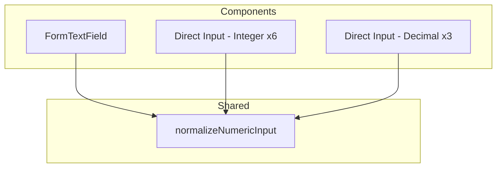

# Design Document: numeric-input-ime-support

## Overview

**Purpose**: 数値入力フィールドの IME 互換性を改善し、日本語 IME 全角モードでも数値入力を可能にする。全角→半角自動変換を統一適用することで、入力ミスを防止する。

**Users**: 操業管理システムのすべてのユーザーが、プロジェクト工数・期間・人員数・比率等の数値入力で恩恵を受ける。

**Impact**: 直接 `type="number"` を使用している9箇所の Input を `type="text"` + `inputMode` パターンに変更し、全角→半角変換ユーティリティを統一適用する。既存の FormTextField の小数点入力バグも修正する。

### Goals
- `type="number"` の直接使用を排除し、IME 互換パターンに統一
- 全角→半角変換ロジックをユーティリティ関数として一元化
- 整数/小数フィールドの区別に応じた適切な入力制御
- FormTextField の小数入力バグ修正

### Non-Goals
- FormTextField を使用していない箇所の FormTextField への置換（各箇所の固有ロジックを維持）
- 全角マイナス記号の変換対応
- 数値入力以外のフィールドへの IME 対応拡張

## Architecture

### Existing Architecture Analysis

現在の数値入力は2つのパターンが混在:

1. **FormTextField 経由（4箇所）**: `type="number"` → 内部で `type="text"` + `inputMode="numeric"` に変換。全角→半角変換済みだが、小数点が除去されるバグあり
2. **直接 Input 使用（9箇所）**: `type="number"` のまま。全角変換なし。onChange は各箇所で個別実装（parseInt/parseFloat/Number、null許容、範囲制限等）

### Architecture Pattern & Boundary Map



- **Selected pattern**: ユーティリティ関数抽出 — 変換ロジックを単一関数に集約し、各コンポーネントの onChange で呼び出し
- **Existing patterns preserved**: 各 Input の固有 onChange ロジック（範囲制限、null許容、onBlur検証）はそのまま維持
- **New components rationale**: `normalizeNumericInput` のみ新規作成。変換ロジックの DRY 化とテスト容易性のため
- **Steering compliance**: `src/lib/` への共有ユーティリティ配置は structure.md に準拠

### Technology Stack

| Layer | Choice / Version | Role in Feature | Notes |
|-------|------------------|-----------------|-------|
| Frontend | React 19 + TanStack Form | フォーム状態管理 | 既存利用、変更なし |
| UI | shadcn/ui Input | 入力コンポーネント | `type` / `inputMode` 属性のみ変更 |
| Validation | Zod v3 | フィールドバリデーション | 既存利用、変更なし |

## Requirements Traceability

| Requirement | Summary | Components | Interfaces |
|-------------|---------|------------|------------|
| 1.1 | `type="text"` + `inputMode` の使用 | 全9箇所の Input, FormTextField | — |
| 1.2 | モバイルテンキー表示 | 全9箇所の Input, FormTextField | inputMode 属性 |
| 1.3 | 全角モードでの入力受付 | normalizeNumericInput | NormalizeOptions |
| 2.1 | 全角数字→半角変換 | normalizeNumericInput | NormalizeOptions |
| 2.2 | 全角ピリオド→半角変換 | normalizeNumericInput | NormalizeOptions |
| 2.3 | FormTextField パターンとの一貫性 | normalizeNumericInput, FormTextField | — |
| 3.1 | 整数フィールドの数字のみ受付 | normalizeNumericInput | NormalizeOptions |
| 3.2 | 整数フィールドの小数点拒否 | normalizeNumericInput | NormalizeOptions |
| 3.3 | 整数フィールドの不正文字除去 | normalizeNumericInput | NormalizeOptions |
| 4.1 | 小数フィールドの数字+ピリオド受付 | normalizeNumericInput | NormalizeOptions |
| 4.2 | 小数フィールドの不正文字除去 | normalizeNumericInput | NormalizeOptions |
| 4.3 | 既存バリデーションルール維持 | 各変更対象コンポーネント | — |
| 5.1 | フォーム送信データの互換性 | 各変更対象コンポーネント | — |
| 5.2 | 既存バリデーション動作維持 | 各変更対象コンポーネント | — |
| 5.3 | 半角直接入力の動作維持 | normalizeNumericInput | NormalizeOptions |

## Components and Interfaces

| Component | Domain/Layer | Intent | Req Coverage | Key Dependencies | Contracts |
|-----------|-------------|--------|--------------|------------------|-----------|
| normalizeNumericInput | lib/共有ユーティリティ | 全角→半角変換 + 不正文字除去 | 1.3, 2.1-2.3, 3.1-3.3, 4.1-4.2, 5.3 | なし | Service |
| FormTextField | components/shared | フォーム数値入力（小数対応追加） | 1.1-1.3, 2.3, 4.3 | normalizeNumericInput (P0) | State |
| Direct Input 変更（9箇所） | features/各コンポーネント | 個別の数値入力フィールド | 1.1-1.2, 5.1-5.2 | normalizeNumericInput (P0) | — |

### Shared Utility

#### normalizeNumericInput

| Field | Detail |
|-------|--------|
| Intent | 全角→半角変換と不正文字除去を行う純粋関数 |
| Requirements | 1.3, 2.1, 2.2, 2.3, 3.1, 3.2, 3.3, 4.1, 4.2, 5.3 |

**Responsibilities & Constraints**
- 入力文字列の全角数字を半角数字に変換
- 全角ピリオドを半角ピリオドに変換（小数モード時のみ）
- 整数/小数モードに応じて不正文字を除去
- 純粋関数として副作用なし。数値型への変換は呼び出し側の責務

**Dependencies**
- なし（外部依存ゼロ）

**Contracts**: Service [x]

##### Service Interface

```typescript
interface NormalizeOptions {
  /** 小数点の入力を許可する（default: false） */
  allowDecimal?: boolean;
}

/**
 * 全角数字を半角に変換し、不正文字を除去する。
 * 数値型への変換は行わない（文字列を返す）。
 */
function normalizeNumericInput(
  value: string,
  options?: NormalizeOptions
): string;
```

- Preconditions: `value` は任意の文字列
- Postconditions:
  - 戻り値は半角数字のみ（`allowDecimal: false` 時）または半角数字 + 半角ピリオド（`allowDecimal: true` 時）で構成される文字列
  - 空文字列の入力に対しては空文字列を返す
- Invariants: 入力文字列を変更せず、新しい文字列を返す

**Implementation Notes**
- 配置先: `apps/frontend/src/lib/normalizeNumericInput.ts`
- 変換順序: 全角数字→半角数字 → 全角ピリオド→半角ピリオド（allowDecimal時） → 不正文字除去
- テスト: ユニットテストで全角/半角/混在/空文字/小数パターンを網羅

### Shared Components

#### FormTextField（既存修正）

| Field | Detail |
|-------|--------|
| Intent | TanStack Form 連携の数値入力ラッパー（小数対応追加） |
| Requirements | 1.1, 1.2, 1.3, 2.3, 4.3 |

**変更内容**

`type` プロパティの型を拡張:

```typescript
interface FormTextFieldProps {
  // 既存プロパティは省略
  /** Input の type 属性 */
  type?: "text" | "number" | "decimal";
  // ...
}
```

**Contracts**: State [x]

##### State Management

- `type="number"`: 整数入力モード（`inputMode="numeric"`、`normalizeNumericInput()` で変換）
- `type="decimal"`: 小数入力モード（`inputMode="decimal"`、`normalizeNumericInput({ allowDecimal: true })` で変換）
- `type="text"`: テキスト入力（変換なし、既存動作維持）

**Implementation Notes**
- 既存の onChange 内インライン変換ロジックを `normalizeNumericInput` 呼び出しに置換
- `type="decimal"` 時は `Number()` 変換で小数値を正しく処理（空文字は `0`）
- ProjectForm の `totalManhour` フィールドは `type="decimal"` に変更して小数入力バグを修正

### Feature Components（9箇所の変更対象）

各箇所の変更パターンは以下の通り統一:

1. `type="number"` → `type="text"`
2. `inputMode="numeric"` または `inputMode="decimal"` を追加
3. onChange ハンドラの先頭で `normalizeNumericInput()` を呼び出し
4. 既存の後処理ロジック（Number/parseInt/parseFloat、範囲制限、null変換等）はそのまま維持

#### 変更対象一覧

| # | ファイル | フィールド | 型 | inputMode | 固有ロジック |
|---|---------|----------|-----|-----------|------------|
| 1 | ProjectForm.tsx:278 | durationMonths | 整数 | numeric | null許容 |
| 2 | CaseForm.tsx:290 | durationMonths | 整数 | numeric | null許容 |
| 3 | CaseForm.tsx:316 | totalManhour | 小数 | decimal | null許容 |
| 4 | PeriodSelector.tsx:100 | months | 整数 | numeric | useState管理 |
| 5 | ScenarioFormSheet.tsx:158 | hoursPerPerson | 小数 | decimal | step=0.01 |
| 6 | WorkloadCard.tsx:249 | manhour | 整数 | numeric | onBlur範囲検証 |
| 7 | BulkInputDialog.tsx:76 | headcount | 整数 | numeric | parseInt+非負制限 |
| 8 | IndirectWorkRatioMatrix.tsx:135 | ratio | 小数 | decimal | parseFloat+0-100範囲 |
| 9 | MonthlyHeadcountGrid.tsx:191 | headcount | 整数 | numeric | parseInt+非負制限 |

**共通の onChange 変更パターン（整数フィールドの例）**:
```typescript
// Before
onChange={(e) => {
  const val = parseInt(e.target.value, 10);
  // ... 既存処理
}}

// After
onChange={(e) => {
  const normalized = normalizeNumericInput(e.target.value);
  const val = parseInt(normalized, 10);
  // ... 既存処理（変更なし）
}}
```

**共通の onChange 変更パターン（小数フィールドの例）**:
```typescript
// Before
onChange={(e) => {
  const val = parseFloat(e.target.value);
  // ... 既存処理
}}

// After
onChange={(e) => {
  const normalized = normalizeNumericInput(e.target.value, { allowDecimal: true });
  const val = parseFloat(normalized);
  // ... 既存処理（変更なし）
}}
```

## Error Handling

### Error Strategy
本機能はフロントエンドの入力正規化のみで、新たなエラーカテゴリは発生しない。

- **不正文字入力**: `normalizeNumericInput` で自動除去。エラー表示は不要
- **空文字入力**: 各フィールドの既存バリデーション（Zod / カスタム）がそのまま処理
- **範囲外入力**: 各フィールドの既存範囲チェックロジックがそのまま処理

## Testing Strategy

### Unit Tests
- `normalizeNumericInput` のユニットテスト（`src/lib/__tests__/normalizeNumericInput.test.ts`）:
  1. 半角数字がそのまま通過する
  2. 全角数字（`０１２３`）が半角（`0123`）に変換される
  3. 全角・半角混在文字列が正しく変換される
  4. 整数モードで小数点が除去される
  5. 小数モード（`allowDecimal: true`）で半角ピリオドが保持される
  6. 小数モードで全角ピリオド（`．`）が半角に変換される
  7. 空文字列に対して空文字列を返す
  8. アルファベット・記号が除去される

### Integration Tests
- FormTextField の数値入力テスト（既存テストファイルを拡充）:
  1. `type="number"` で全角数字入力→半角数値に変換
  2. `type="decimal"` で小数入力→正しく数値変換
  3. `type="text"` で変換が適用されない
