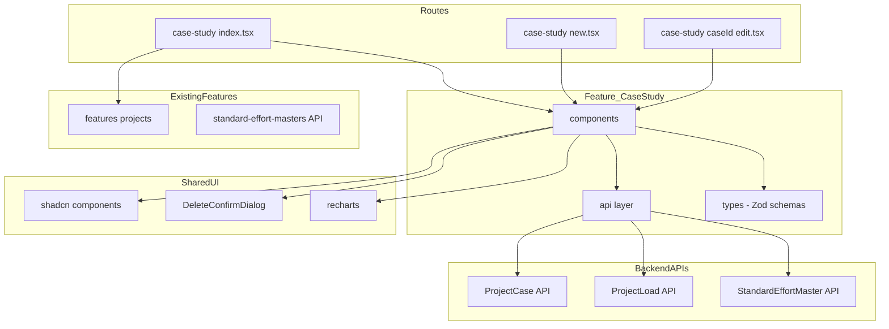
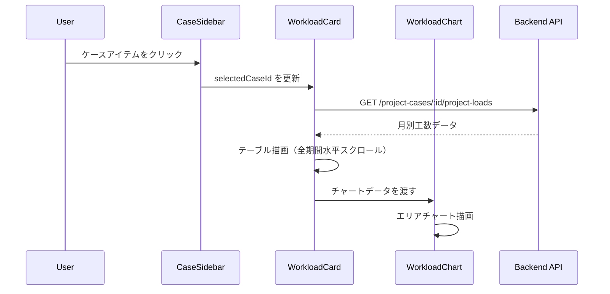
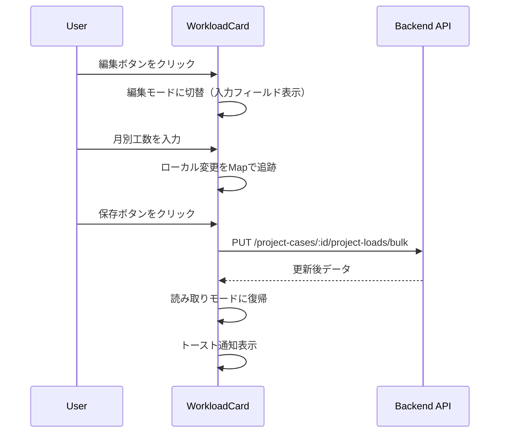
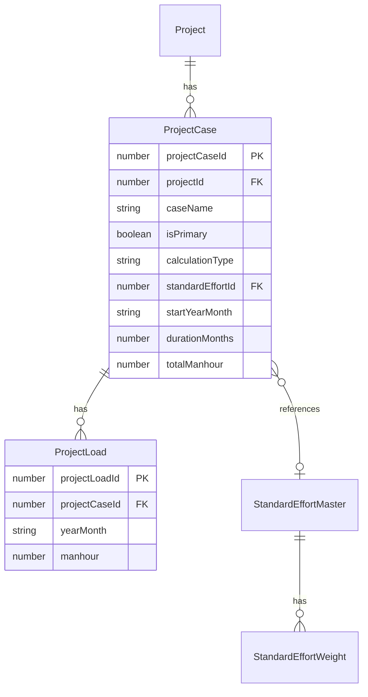

# Design Document: project-case-study-ui

## Overview

**Purpose**: プロジェクトケーススタディUI は、案件（プロジェクト）の工数見積を複数のパターン（ケース）で作成・比較するためのフロントエンド画面を提供する。案件詳細画面（`/master/projects/$projectId`）のサブ画面として、STANDARDモード（標準工数マスタ活用）とMANUALモード（手動入力）の2計算モードに対応し、月別工数の表示・編集・チャート可視化を行う。

**Users**: プロジェクトマネージャーがケース作成・編集・比較を行い、計画担当者が標準工数マスタを活用した工数見積を実行する。

**Impact**: フロントエンド層にのみ変更を加える。バックエンドAPIは全て実装済みであり、新規featureモジュール `features/case-study/` とルートファイル3つを新規作成する。既存の案件詳細画面にケーススタディへのリンクを1箇所追加する。

### Goals
- 案件に紐づくケースのCRUD操作（一覧・作成・編集・削除）をサイドバー+専用ページで実現する
- 月別工数の全期間水平スクロールテーブル表示とインライン編集を実現する
- 月別工数のエリアチャートによる可視化を実現する
- STANDARDモード選択時の標準工数プレビュー表示を実現する
- 既存のfeatureパターン（TanStack Query/Form/Router + Zod + shadcn/ui）に完全準拠する

### Non-Goals
- 工数自動分配ロジック（STANDARD計算モードの月別工数自動生成）は対象外
- 複数ケースの重畳チャート比較は対象外
- ケース複製機能は対象外
- Excel エクスポート/インポートは対象外
- 認証・認可（RBAC）は対象外
- レスポンシブ対応（モバイル）は対象外

## Architecture

### Existing Architecture Analysis

**既存パターンと制約**:
- Feature-First 構成: `features/[feature]/` に api, components, hooks, types, index.ts を内包
- TanStack Router ファイルベースルーティング: `routes/master/projects/$projectId/` 配下にネストルート
- TanStack Query: queryOptions ファクトリ + QueryKey Factory + useMutation hooks
- TanStack Form + Zod: フォームバリデーション（onChange validators）
- API基盤: `lib/api/` の `handleResponse`, `ApiError`, `API_BASE_URL`
- UI基盤: shadcn/ui コンポーネント群（Button, Input, Label, Select, Table, Badge, AlertDialog）
- トースト: sonner の `toast.success` / `toast.error`

**統合ポイント**:
- `routes/master/projects/$projectId/index.tsx` にケーススタディリンクを追加
- `features/projects/` のQueryOptionsで案件情報を参照（パンくずリスト用）
- recharts v3.7.0（導入済み）でエリアチャートを描画

### Architecture Pattern & Boundary Map



**Architecture Integration**:
- **Selected pattern**: Feature-First モジュール（既存パターン準拠）
- **Domain boundaries**: `features/case-study/` が ProjectCase + ProjectLoad のデータ管理を担当。StandardEffortMaster は参照のみ（既存API呼び出し）
- **Existing patterns preserved**: QueryKey Factory, useMutation + invalidateQueries, TanStack Form + Zod, ApiError ハンドリング
- **New components rationale**: 全て新規だが、既存パターンのインスタンス化であり、アーキテクチャ的な新規性はない
- **Steering compliance**: Feature-First 構成、features間の依存禁止、@エイリアスインポート

### Technology Stack

| Layer | Choice / Version | Role in Feature | Notes |
|-------|------------------|-----------------|-------|
| Frontend Framework | React 19 + Vite 7 | SPA コンポーネント描画 | 既存 |
| Routing | TanStack Router | ファイルベースルーティング（3ルート） | 既存 |
| Data Fetching | TanStack Query | サーバー状態管理（5クエリ + 5ミューテーション） | 既存 |
| Form | TanStack Form + Zod v3 | フォームバリデーション | 既存 |
| UI Components | shadcn/ui + Radix UI | プリミティブUIコンポーネント | 既存 |
| Chart | recharts v3.7.0 | エリアチャート描画 | 既存（workload featureで使用実績あり） |
| Notification | sonner | トースト通知 | 既存 |
| Icons | lucide-react | アイコン | 既存 |

## System Flows

### ケース選択 → 工数表示フロー



### 月別工数インライン編集フロー



## Requirements Traceability

| Requirement | Summary | Components | Interfaces | Flows |
|-------------|---------|------------|------------|-------|
| 1.1-1.8 | ケース一覧サイドバー | CaseSidebar | projectCaseQueries, State | ケース選択フロー |
| 2.1-2.9 | ケース新規作成 | CaseForm, new.tsx | createProjectCase mutation | - |
| 3.1-3.6 | 標準工数プレビュー | StandardEffortPreview | standardEffortMasterQuery | - |
| 4.1-4.8 | ケース編集 | CaseForm, edit.tsx | updateProjectCase mutation | - |
| 5.1-5.6 | ケース削除 | DeleteCaseDialog | deleteProjectCase mutation | - |
| 6.1-6.7 | 月別工数テーブル | WorkloadCard | projectLoadQueries | ケース選択フロー |
| 7.1-7.9 | 月別工数インライン編集 | WorkloadCard | bulkUpsertProjectLoads mutation | インライン編集フロー |
| 8.1-8.7 | 月別工数チャート | WorkloadChart | - | ケース選択フロー |
| 9.1-9.7 | フォームバリデーション | CaseForm, types | Zod schemas | - |
| 10.1-10.7 | ルーティング・レイアウト | index/new/edit ルート | TanStack Router | - |
| 11.1-11.7 | サーバー状態管理 | queries.ts, mutations.ts | QueryKey Factory | - |
| 12.1-12.6 | 操作フィードバック | 全コンポーネント | sonner toast | - |

## Components and Interfaces

| Component | Domain/Layer | Intent | Req Coverage | Key Dependencies | Contracts |
|-----------|-------------|--------|--------------|------------------|-----------|
| api-client | API | ProjectCase/ProjectLoad APIクライアント | 11 | lib/api (P0) | Service |
| queries | API | QueryKey Factory + queryOptions | 11 | api-client (P0), TanStack Query (P0) | Service |
| mutations | API | Mutation hooks (CRUD + bulk) | 11, 12 | api-client (P0), queries (P0) | Service |
| types | Types | Zod schemas + TypeScript型定義 | 9 | Zod v3 (P0) | - |
| CaseSidebar | UI | ケース一覧サイドバー表示・選択 | 1 | queries (P0), Badge (P1) | State |
| CaseForm | UI | ケース作成/編集フォーム | 2, 3, 4, 9 | TanStack Form (P0), types (P0), StandardEffortPreview (P1) | State |
| StandardEffortPreview | UI | 標準工数プレビューテーブル | 3 | queries (P0), Table (P1) | - |
| WorkloadCard | UI | 月別工数テーブル表示・インライン編集 | 6, 7 | queries (P0), mutations (P0) | State |
| WorkloadChart | UI | 月別工数エリアチャート | 8 | recharts (P0) | - |
| DeleteCaseDialog | UI | ケース削除確認ダイアログ | 5 | AlertDialog (P0), mutations (P0) | - |
| case-study/index.tsx | Route | メイン画面（サイドバー+工数表示） | 1, 6, 7, 8, 10 | CaseSidebar (P0), WorkloadCard (P0), WorkloadChart (P0) | - |
| case-study/new.tsx | Route | ケース新規作成ページ | 2, 3, 10 | CaseForm (P0) | - |
| case-study/$caseId/edit.tsx | Route | ケース編集ページ | 4, 10 | CaseForm (P0) | - |

### API Layer

#### api-client.ts

| Field | Detail |
|-------|--------|
| Intent | ProjectCase / ProjectLoad / StandardEffortMaster の HTTPクライアント関数群 |
| Requirements | 11.1-11.5 |

**Responsibilities & Constraints**
- バックエンドAPIへのHTTPリクエスト送信とレスポンス変換
- `lib/api` の `handleResponse` / `ApiError` / `API_BASE_URL` に依存
- URL構築とクエリパラメータのシリアライズ

**Dependencies**
- Outbound: `lib/api` — HTTP基盤（P0）
- External: Backend ProjectCase API, ProjectLoad API, StandardEffortMaster API（P0）

**Contracts**: Service [x]

##### Service Interface

```typescript
// ProjectCase
function fetchProjectCases(projectId: number, params: ProjectCaseListParams): Promise<PaginatedResponse<ProjectCase>>
function fetchProjectCase(projectId: number, projectCaseId: number): Promise<SingleResponse<ProjectCase>>
function createProjectCase(projectId: number, input: CreateProjectCaseInput): Promise<SingleResponse<ProjectCase>>
function updateProjectCase(projectId: number, projectCaseId: number, input: UpdateProjectCaseInput): Promise<SingleResponse<ProjectCase>>
function deleteProjectCase(projectId: number, projectCaseId: number): Promise<void>
function restoreProjectCase(projectId: number, projectCaseId: number): Promise<SingleResponse<ProjectCase>>

// ProjectLoad
function fetchProjectLoads(projectCaseId: number): Promise<{ data: ProjectLoad[] }>
function bulkUpsertProjectLoads(projectCaseId: number, input: BulkProjectLoadInput): Promise<{ data: ProjectLoad[] }>

// StandardEffortMaster
function fetchStandardEffortMasters(params?: StandardEffortMasterListParams): Promise<PaginatedResponse<StandardEffortMaster>>
function fetchStandardEffortMaster(id: number): Promise<SingleResponse<StandardEffortMasterDetail>>
```

#### queries.ts

| Field | Detail |
|-------|--------|
| Intent | QueryKey Factory と queryOptions 定義 |
| Requirements | 11.1-11.5 |

**Contracts**: Service [x]

##### Service Interface

```typescript
const caseStudyKeys = {
  all: ['case-study'] as const,
  projectCases: (projectId: number) => [...caseStudyKeys.all, 'project-cases', projectId] as const,
  projectCase: (projectId: number, caseId: number) => [...caseStudyKeys.all, 'project-case', projectId, caseId] as const,
  projectLoads: (caseId: number) => [...caseStudyKeys.all, 'project-loads', caseId] as const,
  standardEffortMasters: () => [...caseStudyKeys.all, 'standard-effort-masters'] as const,
  standardEffortMaster: (id: number) => [...caseStudyKeys.all, 'standard-effort-master', id] as const,
}

function projectCasesQueryOptions(projectId: number, params?: ProjectCaseListParams): QueryOptions<PaginatedResponse<ProjectCase>>
function projectCaseQueryOptions(projectId: number, caseId: number): QueryOptions<SingleResponse<ProjectCase>>
function projectLoadsQueryOptions(caseId: number): QueryOptions<{ data: ProjectLoad[] }>
function standardEffortMastersQueryOptions(params?: StandardEffortMasterListParams): QueryOptions<PaginatedResponse<StandardEffortMaster>>
function standardEffortMasterQueryOptions(id: number): QueryOptions<SingleResponse<StandardEffortMasterDetail>>
```

- Preconditions: `projectId > 0`, `caseId > 0`, `id > 0`
- staleTime: データクエリ 5分、マスタクエリ 30分

#### mutations.ts

| Field | Detail |
|-------|--------|
| Intent | CRUD + bulk upsert のミューテーションhooks |
| Requirements | 11.6, 11.7, 12.1-12.6 |

**Contracts**: Service [x]

##### Service Interface

```typescript
function useCreateProjectCase(): UseMutationResult<SingleResponse<ProjectCase>, Error, { projectId: number; input: CreateProjectCaseInput }>
function useUpdateProjectCase(): UseMutationResult<SingleResponse<ProjectCase>, Error, { projectId: number; projectCaseId: number; input: UpdateProjectCaseInput }>
function useDeleteProjectCase(): UseMutationResult<void, Error, { projectId: number; projectCaseId: number }>
function useRestoreProjectCase(): UseMutationResult<SingleResponse<ProjectCase>, Error, { projectId: number; projectCaseId: number }>
function useBulkUpsertProjectLoads(): UseMutationResult<{ data: ProjectLoad[] }, Error, { projectCaseId: number; input: BulkProjectLoadInput }>
```

- Postconditions: 成功時に関連クエリキーのキャッシュを無効化
- `useCreateProjectCase`: `caseStudyKeys.projectCases(projectId)` を無効化
- `useUpdateProjectCase`: `projectCases` + `projectCase` を無効化
- `useDeleteProjectCase`: `caseStudyKeys.projectCases(projectId)` を無効化
- `useBulkUpsertProjectLoads`: `caseStudyKeys.projectLoads(caseId)` を無効化

### Types Layer

#### types/index.ts

| Field | Detail |
|-------|--------|
| Intent | Zodスキーマ定義とTypeScript型導出 |
| Requirements | 9.1-9.7 |

**Contracts**: Service [x]

##### Service Interface

```typescript
// ProjectCase
interface ProjectCase {
  projectCaseId: number
  projectId: number
  caseName: string
  isPrimary: boolean
  description: string | null
  calculationType: 'STANDARD' | 'MANUAL'
  standardEffortId: number | null
  startYearMonth: string | null
  durationMonths: number | null
  totalManhour: number | null
  createdAt: string
  updatedAt: string
  projectName: string
  standardEffortName: string | null
}

// Zodスキーマ
const createProjectCaseSchema: z.ZodObject<{
  caseName: z.ZodString          // min(1), max(100)
  calculationType: z.ZodEnum<['STANDARD', 'MANUAL']>
  standardEffortId: z.ZodNullable<z.ZodNumber>  // STANDARDモード時は必須（refine）
  description: z.ZodNullable<z.ZodString>       // max(500)
  isPrimary: z.ZodBoolean
  startYearMonth: z.ZodNullable<z.ZodString>    // regex /^\d{6}$/
  durationMonths: z.ZodNullable<z.ZodNumber>    // positive int
  totalManhour: z.ZodNullable<z.ZodNumber>      // non-negative int
}>

const updateProjectCaseSchema: z.ZodObject  // createと同一だが全フィールドoptional

// ProjectLoad
interface ProjectLoad {
  projectLoadId: number
  projectCaseId: number
  yearMonth: string
  manhour: number
  createdAt: string
  updatedAt: string
}

interface BulkProjectLoadInput {
  items: Array<{ yearMonth: string; manhour: number }>
}

// StandardEffortMaster
interface StandardEffortMaster {
  standardEffortId: number
  businessUnitCode: string
  projectTypeCode: string
  name: string
}

interface StandardEffortMasterDetail extends StandardEffortMaster {
  weights: Array<{
    standardEffortWeightId: number
    progressRate: number
    weight: number
  }>
}
```

### UI Layer

#### CaseSidebar

| Field | Detail |
|-------|--------|
| Intent | ケース一覧をサイドバーリスト形式で表示し、ケース選択・新規作成・編集・削除のトリガーを提供 |
| Requirements | 1.1-1.8 |

**Responsibilities & Constraints**
- ケース一覧データの表示（ケース名、計算モードバッジ、プライマリバッジ、説明）
- 選択状態の視覚フィードバック（左ボーダー + 背景色変化）
- 編集・削除ボタンのイベント伝搬停止
- 空状態・ローディング状態の表示

**Dependencies**
- Inbound: index.tsx — selectedCaseId, onSelectCase, onEdit, onDelete（P0）
- Outbound: queries — projectCasesQueryOptions（P0）
- External: Badge, Button（P1）

**Contracts**: State [x]

##### State Management

```typescript
interface CaseSidebarProps {
  projectId: number
  selectedCaseId: number | null
  onSelectCase: (caseId: number) => void
  onEditCase: (caseId: number) => void
  onDeleteCase: (projectCase: ProjectCase) => void
}
```

**Implementation Notes**
- ページネーション: API のデフォルト20件/ページで十分（ケース数は一般的に少数）
- 計算モードバッジ: STANDARD → `variant="default"`, MANUAL → `variant="secondary"`
- 編集/削除ボタンの `onClick` に `e.stopPropagation()` を設定

#### CaseForm

| Field | Detail |
|-------|--------|
| Intent | ケース作成/編集の共通フォーム。STANDARD/MANUALモードの入力分岐と標準工数プレビューを含む |
| Requirements | 2.1-2.9, 3.1-3.6, 4.1-4.8, 9.1-9.7 |

**Responsibilities & Constraints**
- TanStack Form によるフォーム状態管理
- Zod バリデーション（onChange validators）
- STANDARD/MANUAL モードによる入力項目の条件表示
- 標準工数マスタセレクトボックス（STANDARDモード時のみ有効）
- `mode: 'create' | 'edit'` での共通化

**Dependencies**
- Inbound: new.tsx / edit.tsx — mode, defaultValues, onSubmit（P0）
- Outbound: StandardEffortPreview — standardEffortId（P1）
- External: TanStack Form, Zod, shadcn/ui Input/Select/Label（P0）

**Contracts**: State [x]

##### State Management

```typescript
interface CaseFormProps {
  mode: 'create' | 'edit'
  defaultValues?: Partial<CreateProjectCaseInput>
  onSubmit: (values: CreateProjectCaseInput | UpdateProjectCaseInput) => Promise<void>
  isSubmitting: boolean
  onCancel: () => void
}
```

**Implementation Notes**
- 計算モード切替時: MANUAL → standardEffortId を null にリセット
- STANDARDモード必須バリデーション: Zod refine で `calculationType === 'STANDARD'` 時に `standardEffortId` 必須を強制
- フォームカード: `rounded-2xl border shadow-sm p-6` スタイル

#### StandardEffortPreview

| Field | Detail |
|-------|--------|
| Intent | 選択された標準工数マスタの重み付け分布テーブルを表示 |
| Requirements | 3.1-3.6 |

**Dependencies**
- Inbound: CaseForm — standardEffortId（P0）
- Outbound: queries — standardEffortMasterQueryOptions（P0）

**Implementation Notes**
- `standardEffortId` が null/undefined の場合は「標準工数マスタを選択してください」を表示
- テーブル: 2列（進捗率%, 重み）、max-h-64 overflow-y-auto
- データ取得は `enabled: standardEffortId != null` で制御

#### WorkloadCard

| Field | Detail |
|-------|--------|
| Intent | 月別工数の全期間水平スクロールテーブル表示とインライン編集 |
| Requirements | 6.1-6.7, 7.1-7.9 |

**Responsibilities & Constraints**
- 読み取りモード: 月別工数を数値テキストで表示
- 編集モード: 月別工数を入力フィールドに切替
- 変更追跡: `Map<string, number>` でYYYYMM→manhour を管理
- 表示範囲決定: startYearMonth + durationMonths → データ範囲 → デフォルト12ヶ月
- 日本語ロケール数値フォーマット（カンマ区切り）

**Dependencies**
- Inbound: index.tsx — selectedCase, projectLoads（P0）
- Outbound: mutations — useBulkUpsertProjectLoads（P0）
- External: Table, Input, Button, sonner（P0）

**Contracts**: State [x]

##### State Management

```typescript
interface WorkloadCardProps {
  projectCase: ProjectCase
  projectLoads: ProjectLoad[]
  onWorkloadsChange?: (workloads: Array<{ yearMonth: string; manhour: number }>) => void
}

// 内部状態
interface WorkloadCardState {
  isEditing: boolean
  isSaving: boolean
  editedWorkloads: Map<string, number>  // key: YYYYMM, value: manhour
}
```

- 表示範囲決定ロジック: `generateMonthRange(projectCase, projectLoads)` ユーティリティ関数
- 編集モード切替: `isEditing` フラグ
- 保存時: editedWorkloads の差分のみ bulk upsert に送信
- blur バリデーション: 非整数・範囲外の場合は元の値に復元

**Implementation Notes**
- 水平スクロール: `overflow-x-auto` ラッパー
- 入力フィールド: `w-20 h-8 text-center [appearance:textfield] [&::-webkit-outer-spin-button]:appearance-none [&::-webkit-inner-spin-button]:appearance-none`
- `onWorkloadsChange` コールバック: チャートへのリアルタイム反映用

#### WorkloadChart

| Field | Detail |
|-------|--------|
| Intent | 月別工数のエリアチャートによる可視化 |
| Requirements | 8.1-8.7 |

**Dependencies**
- Inbound: index.tsx — chartData（P0）
- External: recharts AreaChart, Area, XAxis, YAxis, Tooltip, ResponsiveContainer（P0）

**Implementation Notes**
- recharts の `AreaChart` + `Area` を使用（workload feature の WorkloadChart をパターン参考）
- グラデーション: `<defs><linearGradient>` で `stopOpacity` 0.6 → 0.05
- `ResponsiveContainer` で高さ256px、幅100%
- ツールチップ: カスタムフォーマッタ（`{value} 工数`, `年月 {YYYY/MM}`）
- データ0件: 「月次工数データがありません」メッセージ表示
- 編集モード中のリアルタイム反映: WorkloadCard の `onWorkloadsChange` からチャートデータを更新

#### DeleteCaseDialog

| Field | Detail |
|-------|--------|
| Intent | ケース削除の確認ダイアログ |
| Requirements | 5.1-5.6 |

**Implementation Notes**
- 既存の `DeleteConfirmDialog` 共有コンポーネントを利用可能
- ただし要件定義書のメッセージ仕様（「ケースを削除しますか？」+「この操作により、ケースが無効化されます。」）に合わせてカスタマイズが必要な場合は、AlertDialogで直接実装
- 409 Conflict エラー時: 「他のデータから参照されているため削除できません」エラートースト

### Route Layer

#### case-study/index.tsx（メイン画面）

| Field | Detail |
|-------|--------|
| Intent | ケーススタディメイン画面。サイドバー + メインエリアの2カラムレイアウト |
| Requirements | 1, 5, 6, 7, 8, 10 |

**Responsibilities & Constraints**
- 2カラムレイアウト: 左サイドバー（w-64）+ 右メインエリア（flex-1）
- `selectedCaseId` をローカルステートで管理
- 削除ダイアログの開閉状態管理
- パンくずリスト表示（案件一覧 > {案件名} > ケーススタディ）
- チャートへのデータ連携（編集時のリアルタイム反映含む）

**Contracts**: State [x]

##### State Management

```typescript
// ローカル状態
const [selectedCaseId, setSelectedCaseId] = useState<number | null>(null)
const [isDeleteDialogOpen, setIsDeleteDialogOpen] = useState(false)
const [caseToDelete, setCaseToDelete] = useState<ProjectCase | null>(null)
const [chartData, setChartData] = useState<Array<{ yearMonth: string; manhour: number }>>([])
```

#### case-study/new.tsx（作成ページ）

| Field | Detail |
|-------|--------|
| Intent | ケース新規作成ページ |
| Requirements | 2, 3, 10 |

**Implementation Notes**
- `createFileRoute('/master/projects/$projectId/case-study/new')` でルート定義
- `useCreateProjectCase` ミューテーションで作成
- 成功時: トースト通知 + `/master/projects/$projectId/case-study` に遷移
- エラーハンドリング: `ApiError` の status コード分岐（409, 422）

#### case-study/$caseId/edit.tsx（編集ページ）

| Field | Detail |
|-------|--------|
| Intent | ケース編集ページ |
| Requirements | 4, 10 |

**Implementation Notes**
- `createFileRoute('/master/projects/$projectId/case-study/$caseId/edit')` でルート定義
- `projectCaseQueryOptions` でケース詳細を取得し、フォームのdefaultValuesに設定
- `useUpdateProjectCase` ミューテーションで更新
- 成功時: トースト通知 + `/master/projects/$projectId/case-study` に遷移

## Data Models

### Domain Model



**Invariants**:
- ProjectCase は projectId に従属（URLパスパラメータで確定）
- ProjectLoad は (projectCaseId, yearMonth) で一意
- STANDARD モード時は standardEffortId が必須
- manhour: 0 ≤ value ≤ 99,999,999

### Data Contracts & Integration

**API Data Transfer**:
- リクエスト/レスポンス: JSON
- 一覧: `{ data: T[], meta: { pagination } }` 形式
- 単一: `{ data: T }` 形式
- 削除: 204 No Content
- エラー: RFC 9457 ProblemDetails

## Error Handling

### Error Categories and Responses

**User Errors (4xx)**:
- 404 Not Found: 案件・ケースが存在しない → 「ケースが見つかりません」+ 一覧へのリンク
- 409 Conflict: 参照先があり削除不可 → 「他のデータから参照されているため削除できません」エラートースト（duration: Infinity）
- 422 Validation Error: リクエストボディ不正 → 「入力内容にエラーがあります」エラートースト

**System Errors (5xx)**:
- 汎用エラー → `ApiError.message` をエラートーストで表示

**Business Logic Errors**:
- STANDARD モードで standardEffortId 未指定 → フロントバリデーションで阻止（フォーム送信前）
- 変更なしで保存 → 情報トースト「変更がありません」

## Testing Strategy

### Unit Tests
- `types/index.ts`: Zodスキーマのバリデーション（STANDARD必須条件、YYYYMM形式、数値範囲）
- `generateMonthRange` ユーティリティ: 表示範囲決定ロジックのパターン網羅
- 変更追跡Map: 差分検出ロジック

### Integration Tests
- CaseForm: STANDARD/MANUALモード切替時の入力項目表示・非表示
- WorkloadCard: 編集モード切替 → 値入力 → 保存フロー
- CaseSidebar: ケース選択 → selectedCaseId 更新

### E2E/UI Tests
- ケース作成フロー: 新規作成ページ → フォーム入力 → 作成 → 一覧に反映
- インライン編集フロー: 編集ボタン → 値変更 → 保存 → テーブル・チャート反映
- ケース削除フロー: 削除ボタン → 確認ダイアログ → 削除 → 一覧から除外
