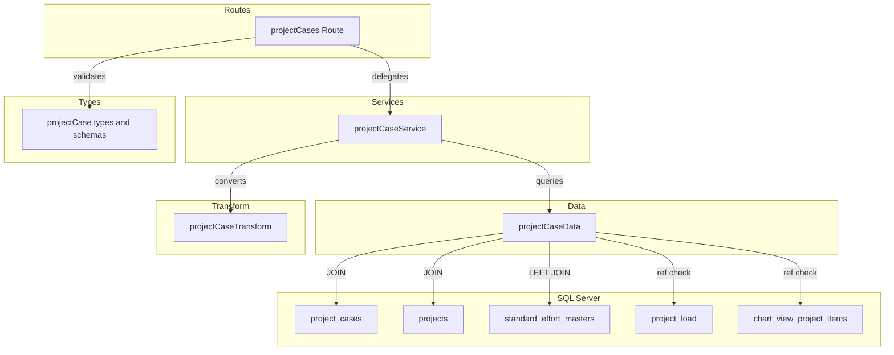
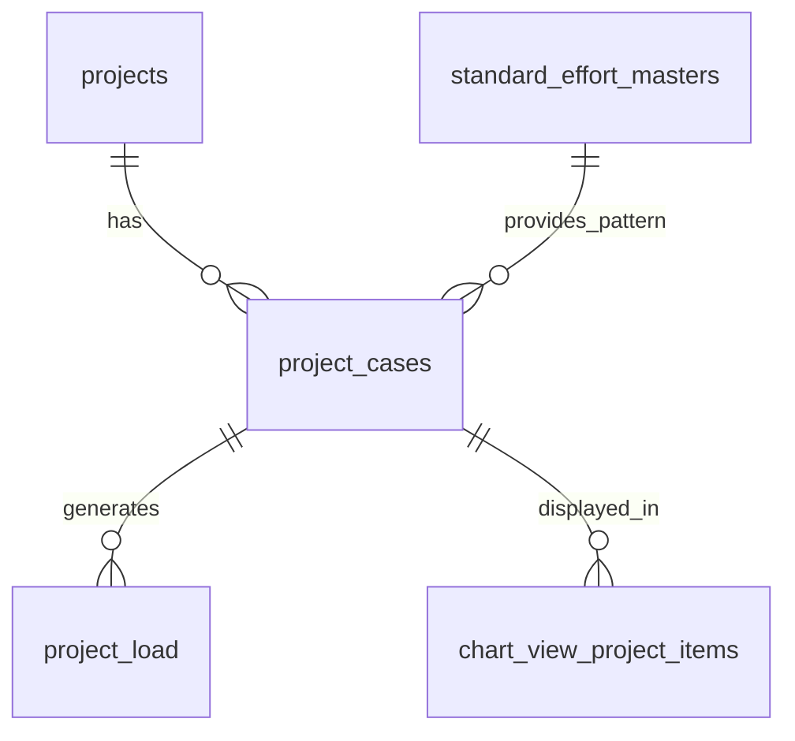

# Technical Design: project-cases-crud-api

## Overview

**Purpose**: 案件ケース（project_cases）の CRUD API を提供し、1つの案件に対する複数の工数計画パターン（楽観/標準/悲観等）の管理を可能にする。

**Users**: プロジェクトマネージャーが案件ごとの工数シミュレーションに利用する。

**Impact**: バックエンドに新規エンティティの CRUD エンドポイントを追加。既存の routes/services/data/transform/types レイヤーに project_cases 用のファイルを新設する。`index.ts` にネストルートをマウントする。

### Goals
- project_cases テーブルに対する完全な CRUD + ソフトデリート/復元 API の提供
- 外部キーの付随名称（projectName, standardEffortName）を JOIN で取得しレスポンスに含める
- 既存の businessUnits CRUD パターンとの一貫性維持
- calculationType に基づく条件付きバリデーションの実現

### Non-Goals
- projects テーブル自体の CRUD API 実装（別スペックで対応）
- project_load（月次負荷データ）の CRUD（別スペック）
- フロントエンド実装
- 認証・認可の実装

## Architecture

### Existing Architecture Analysis

既存のバックエンドは以下のレイヤードアーキテクチャで構成されている:

- **routes/**: Hono ルート定義 + Zod バリデーション
- **services/**: ビジネスロジック + HTTPException によるエラーハンドリング
- **data/**: mssql による直接 SQL 実行
- **transform/**: DB 行（snake_case）→ API レスポンス（camelCase）変換
- **types/**: Zod スキーマ + TypeScript 型定義
- **utils/**: validate ヘルパー、errorHelper（RFC 9457 対応）

既存実装（businessUnits, projectTypes, workTypes）はすべてフラットルートだが、project_cases は projects の子リソースとしてネストルーティングが必要。

### Architecture Pattern & Boundary Map



**Architecture Integration**:
- Selected pattern: 既存レイヤードアーキテクチャの踏襲
- Domain boundaries: project_cases は projects ドメインに属する子リソース
- Existing patterns preserved: validate → service → data → transform の呼び出しフロー
- New components rationale: 各レイヤーに1ファイルずつ追加（既存パターンと同一構成）
- Steering compliance: routes → services → data の依存方向を遵守

### Technology Stack

| Layer | Choice / Version | Role in Feature | Notes |
|-------|------------------|-----------------|-------|
| Backend | Hono v4 | ルート定義・リクエスト処理 | 既存と同一 |
| Validation | Zod + @hono/zod-validator | リクエストバリデーション | 既存 validate ヘルパー利用 |
| Data | mssql | SQL Server 接続・クエリ実行 | JOIN クエリが追加 |
| Testing | Vitest | ユニットテスト | app.request() パターン |

## Requirements Traceability

| Requirement | Summary | Components | Interfaces | Flows |
|-------------|---------|------------|------------|-------|
| 1.1 | 一覧取得 | projectCases Route, projectCaseService, projectCaseData | API Contract GET / | - |
| 1.2 | ページネーション | projectCases Route | API Contract GET / | - |
| 1.3 | ソフトデリート除外 | projectCaseData | Service Interface findAll | - |
| 1.4 | includeDisabled フィルタ | projectCase types, projectCaseData | Service Interface findAll | - |
| 1.5 | JOIN による名称取得 | projectCaseData, projectCaseTransform | Service Interface | - |
| 1.6 | projectId 不存在時 404 | projectCaseService | Service Interface findAll | - |
| 1.7 | created_at 昇順ソート | projectCaseData | - | - |
| 2.1 | 単一取得 | projectCases Route, projectCaseService, projectCaseData | API Contract GET /:id | - |
| 2.2 | 単一取得 JOIN | projectCaseData, projectCaseTransform | - | - |
| 2.3 | 単一 404 | projectCaseService | Service Interface findById | - |
| 2.4 | projectId 不一致チェック | projectCaseService | Service Interface findById | - |
| 3.1 | 新規作成 | projectCases Route, projectCaseService, projectCaseData | API Contract POST / | - |
| 3.2 | Location ヘッダ | projectCases Route | API Contract POST / | - |
| 3.3 | Zod バリデーション | projectCase types | - | - |
| 3.4 | バリデーション 422 | projectCases Route (validate) | - | - |
| 3.5 | projectId 不存在 404 | projectCaseService | Service Interface create | - |
| 3.6 | STANDARD + standardEffortId 必須 | projectCaseService | Service Interface create | - |
| 3.7 | standardEffortId 存在確認 | projectCaseService, projectCaseData | Service Interface create | - |
| 4.1 | 更新 | projectCases Route, projectCaseService, projectCaseData | API Contract PUT /:id | - |
| 4.2 | 更新バリデーション | projectCase types | - | - |
| 4.3 | 更新 404 | projectCaseService | Service Interface update | - |
| 4.4 | 更新 422 | projectCases Route (validate) | - | - |
| 4.5 | updated_at 更新 | projectCaseData | - | - |
| 4.6 | STANDARD 変更時チェック | projectCaseService | Service Interface update | - |
| 5.1 | 論理削除 | projectCases Route, projectCaseService, projectCaseData | API Contract DELETE /:id | - |
| 5.2 | 削除 404 | projectCaseService | Service Interface delete | - |
| 5.3 | 参照チェック 409 | projectCaseService, projectCaseData | Service Interface delete | - |
| 6.1 | 復元 | projectCases Route, projectCaseService, projectCaseData | API Contract POST restore | - |
| 6.2 | 復元 404 | projectCaseService | Service Interface restore | - |
| 6.3 | 復元 409 | projectCaseService | Service Interface restore | - |
| 7.1 | RFC 9457 エラー | 全コンポーネント（既存 errorHelper） | - | - |
| 7.2 | パスパラメータバリデーション | projectCases Route | - | - |
| 7.3 | パスパラメータ 422 | projectCases Route | - | - |
| 7.4 | camelCase レスポンス | projectCaseTransform | - | - |
| 7.5 | YYYYMM バリデーション | projectCase types | - | - |
| 8.1-8.4 | テスト | projectCases.test.ts | - | - |

## Components and Interfaces

| Component | Domain/Layer | Intent | Req Coverage | Key Dependencies | Contracts |
|-----------|--------------|--------|--------------|-----------------|-----------|
| projectCase types | Types | Zod スキーマ・型定義 | 3.3, 4.2, 7.2, 7.5 | pagination types (P0) | - |
| projectCaseData | Data | SQL クエリ実行・JOIN | 1.1-1.7, 2.1-2.4, 3.1, 4.1, 5.1, 6.1 | mssql (P0), getPool (P0) | Service |
| projectCaseTransform | Transform | DB行→APIレスポンス変換 | 1.5, 2.2, 7.4 | projectCase types (P0) | - |
| projectCaseService | Services | ビジネスロジック・エラーハンドリング | 1.6, 2.3-2.4, 3.5-3.7, 4.3, 4.6, 5.2-5.3, 6.2-6.3 | projectCaseData (P0), projectCaseTransform (P0) | Service |
| projectCases Route | Routes | エンドポイント定義・レスポンス返却 | 1.1-1.2, 2.1, 3.1-3.2, 3.4, 4.1, 4.4, 5.1, 6.1, 7.1-7.3 | projectCaseService (P0), validate (P0) | API |

### Types Layer

#### projectCase types

| Field | Detail |
|-------|--------|
| Intent | project_cases の Zod バリデーションスキーマと TypeScript 型を定義する |
| Requirements | 3.3, 4.2, 7.2, 7.5 |

**Responsibilities & Constraints**
- 作成・更新リクエストのバリデーションスキーマ定義
- 一覧取得クエリのページネーション + フィルタスキーマ定義
- DB 行型（snake_case、JOIN 名称フィールド含む）と API レスポンス型（camelCase）の定義
- `any` 型禁止、すべて Zod の `z.infer` で導出

**Dependencies**
- Inbound: routes — バリデーション (P0)
- Outbound: `@/types/pagination` — paginationQuerySchema 拡張 (P0)

**Contracts**: Service [x]

##### Service Interface

```typescript
// Zod スキーマ
const createProjectCaseSchema: z.ZodObject<{
  caseName: z.ZodString            // min(1).max(100)
  isPrimary: z.ZodDefault<z.ZodBoolean>  // default(false)
  description: z.ZodOptional<z.ZodString>  // max(500)
  calculationType: z.ZodDefault<z.ZodEnum<['MANUAL', 'STANDARD']>>  // default('MANUAL')
  standardEffortId: z.ZodOptional<z.ZodNumber>  // int().positive()
  startYearMonth: z.ZodOptional<z.ZodString>  // regex(/^\d{6}$/)
  durationMonths: z.ZodOptional<z.ZodNumber>  // int().positive()
  totalManhour: z.ZodOptional<z.ZodNumber>  // int().min(0)
}>

const updateProjectCaseSchema: z.ZodObject<{
  caseName: z.ZodOptional<z.ZodString>
  isPrimary: z.ZodOptional<z.ZodBoolean>
  description: z.ZodOptional<z.ZodNullable<z.ZodString>>
  calculationType: z.ZodOptional<z.ZodEnum<['MANUAL', 'STANDARD']>>
  standardEffortId: z.ZodOptional<z.ZodNullable<z.ZodNumber>>
  startYearMonth: z.ZodOptional<z.ZodNullable<z.ZodString>>
  durationMonths: z.ZodOptional<z.ZodNullable<z.ZodNumber>>
  totalManhour: z.ZodOptional<z.ZodNullable<z.ZodNumber>>
}>

const projectCaseListQuerySchema  // extends paginationQuerySchema with filter[includeDisabled]

// TypeScript 型
type CreateProjectCase = z.infer<typeof createProjectCaseSchema>
type UpdateProjectCase = z.infer<typeof updateProjectCaseSchema>
type ProjectCaseListQuery = z.infer<typeof projectCaseListQuerySchema>

type ProjectCaseRow = {
  project_case_id: number
  project_id: number
  case_name: string
  is_primary: boolean
  description: string | null
  calculation_type: string
  standard_effort_id: number | null
  start_year_month: string | null
  duration_months: number | null
  total_manhour: number | null
  created_at: Date
  updated_at: Date
  deleted_at: Date | null
  // JOIN フィールド
  project_name: string
  standard_effort_name: string | null
}

type ProjectCase = {
  projectCaseId: number
  projectId: number
  caseName: string
  isPrimary: boolean
  description: string | null
  calculationType: string
  standardEffortId: number | null
  startYearMonth: string | null
  durationMonths: number | null
  totalManhour: number | null
  createdAt: string
  updatedAt: string
  // JOIN フィールド
  projectName: string
  standardEffortName: string | null
}
```

- Preconditions: なし
- Postconditions: すべてのスキーマが TypeScript 型と整合
- Invariants: DB 行型は snake_case、API レスポンス型は camelCase

### Data Layer

#### projectCaseData

| Field | Detail |
|-------|--------|
| Intent | project_cases テーブルへの SQL クエリ実行と JOIN による名称取得 |
| Requirements | 1.1-1.7, 2.1-2.4, 3.1, 4.1, 4.5, 5.1, 6.1, 5.3 |

**Responsibilities & Constraints**
- SQL Server へのクエリ実行のみ担当（ビジネスロジックを含めない）
- projects テーブルへの INNER JOIN と standard_effort_masters への LEFT JOIN を実行
- ソフトデリートフィルタリングの制御
- OUTPUT 句を使用した INSERT/UPDATE 結果の取得
- 参照チェック（project_load, chart_view_project_items）

**Dependencies**
- Inbound: projectCaseService — 全メソッド呼び出し (P0)
- Outbound: `@/database/client` — getPool (P0)
- External: mssql — SQL Server 接続 (P0)

**Contracts**: Service [x]

##### Service Interface

```typescript
interface ProjectCaseDataInterface {
  findAll(params: {
    projectId: number
    page: number
    pageSize: number
    includeDisabled: boolean
  }): Promise<{ items: ProjectCaseRow[]; totalCount: number }>

  findById(projectCaseId: number): Promise<ProjectCaseRow | undefined>

  findByIdIncludingDeleted(projectCaseId: number): Promise<ProjectCaseRow | undefined>

  create(data: {
    projectId: number
    caseName: string
    isPrimary: boolean
    description: string | null
    calculationType: string
    standardEffortId: number | null
    startYearMonth: string | null
    durationMonths: number | null
    totalManhour: number | null
  }): Promise<ProjectCaseRow>

  update(
    projectCaseId: number,
    data: Partial<{
      caseName: string
      isPrimary: boolean
      description: string | null
      calculationType: string
      standardEffortId: number | null
      startYearMonth: string | null
      durationMonths: number | null
      totalManhour: number | null
    }>
  ): Promise<ProjectCaseRow | undefined>

  softDelete(projectCaseId: number): Promise<ProjectCaseRow | undefined>

  restore(projectCaseId: number): Promise<ProjectCaseRow | undefined>

  hasReferences(projectCaseId: number): Promise<boolean>

  projectExists(projectId: number): Promise<boolean>

  standardEffortExists(standardEffortId: number): Promise<boolean>
}
```

- Preconditions: DB 接続プールが利用可能
- Postconditions: 各メソッドは ProjectCaseRow（JOIN フィールド含む）またはプリミティブ値を返却
- Invariants: findAll/findById は projects/standard_effort_masters を JOIN して名称を含める。create/update の OUTPUT 句後は別途 findById で JOIN 結果を取得する

**Implementation Notes**
- findAll の SELECT クエリ: `project_cases pc INNER JOIN projects p ON pc.project_id = p.project_id LEFT JOIN standard_effort_masters se ON pc.standard_effort_id = se.standard_effort_id`
- create/update は OUTPUT 句で IDENTITY 値を取得後、findById を呼び出して JOIN 済みの行を返却する
- hasReferences は project_load と chart_view_project_items の EXISTS チェック
- update は動的 SET 句生成（businessUnitData.update と同じパターン）

### Transform Layer

#### projectCaseTransform

| Field | Detail |
|-------|--------|
| Intent | ProjectCaseRow（snake_case + JOIN フィールド）から ProjectCase（camelCase）への変換 |
| Requirements | 1.5, 2.2, 7.4 |

**Responsibilities & Constraints**
- snake_case → camelCase のフィールド名変換
- Date → ISO 8601 文字列変換
- deleted_at はレスポンスに含めない

**Dependencies**
- Inbound: projectCaseService — 変換処理 (P0)
- Outbound: projectCase types — ProjectCaseRow, ProjectCase (P0)

**Contracts**: Service [x]

##### Service Interface

```typescript
function toProjectCaseResponse(row: ProjectCaseRow): ProjectCase
```

- Preconditions: row が null でないこと
- Postconditions: camelCase の ProjectCase オブジェクトを返却
- Invariants: created_at/updated_at は ISO 8601 文字列に変換

### Service Layer

#### projectCaseService

| Field | Detail |
|-------|--------|
| Intent | 案件ケースのビジネスロジック・エラーハンドリングを集約する |
| Requirements | 1.6, 2.3-2.4, 3.5-3.7, 4.3, 4.6, 5.2-5.3, 6.2-6.3 |

**Responsibilities & Constraints**
- 親リソース（project）の存在確認
- calculationType と standardEffortId の整合性チェック
- 参照チェックによる削除ガード
- ソフトデリート/復元の状態チェック
- HTTPException による統一的なエラー送出

**Dependencies**
- Inbound: projectCases Route — 全エンドポイント (P0)
- Outbound: projectCaseData — DB アクセス (P0)
- Outbound: projectCaseTransform — レスポンス変換 (P0)

**Contracts**: Service [x]

##### Service Interface

```typescript
interface ProjectCaseServiceInterface {
  findAll(params: {
    projectId: number
    page: number
    pageSize: number
    includeDisabled: boolean
  }): Promise<{ items: ProjectCase[]; totalCount: number }>
  // Throws: HTTPException(404) if project not found (3.5, 1.6)

  findById(projectId: number, projectCaseId: number): Promise<ProjectCase>
  // Throws: HTTPException(404) if not found, soft-deleted, or projectId mismatch (2.3, 2.4)

  create(projectId: number, data: CreateProjectCase): Promise<ProjectCase>
  // Throws: HTTPException(404) if project not found (3.5)
  // Throws: HTTPException(422) if STANDARD without standardEffortId (3.6)
  // Throws: HTTPException(422) if standardEffortId not found (3.7)

  update(projectId: number, projectCaseId: number, data: UpdateProjectCase): Promise<ProjectCase>
  // Throws: HTTPException(404) if not found or soft-deleted (4.3)
  // Throws: HTTPException(422) if STANDARD without standardEffortId (4.6)

  delete(projectId: number, projectCaseId: number): Promise<void>
  // Throws: HTTPException(404) if not found or soft-deleted (5.2)
  // Throws: HTTPException(409) if referenced (5.3)

  restore(projectId: number, projectCaseId: number): Promise<ProjectCase>
  // Throws: HTTPException(404) if not found (6.2)
  // Throws: HTTPException(409) if not soft-deleted (6.3)
}
```

- Preconditions: 各メソッドの引数が型スキーマに適合
- Postconditions: 正常時は ProjectCase を返却、異常時は HTTPException を送出
- Invariants: projectId の親子整合性は全操作で検証

**Implementation Notes**
- create/update 時の calculationType チェック: 現在の calculationType（既存値または更新値）が 'STANDARD' で standardEffortId が null の場合は 422 を送出
- update 時は既存行の calculationType と更新データをマージして判定する

### Route Layer

#### projectCases Route

| Field | Detail |
|-------|--------|
| Intent | `/projects/:projectId/project-cases` 配下の HTTP エンドポイントを定義する |
| Requirements | 1.1-1.2, 2.1, 3.1-3.2, 3.4, 4.1, 4.4, 5.1, 6.1, 7.1-7.3 |

**Responsibilities & Constraints**
- Zod バリデーション（query, json）の適用
- パスパラメータ（projectId, projectCaseId）の parseInt 変換とバリデーション
- サービス層への委譲
- HTTP ステータスコードとレスポンス形式の制御
- Location ヘッダの設定（POST 201 時）

**Dependencies**
- Inbound: index.ts — app.route() でマウント (P0)
- Outbound: projectCaseService — ビジネスロジック (P0)
- Outbound: validate — Zod バリデーション (P0)
- Outbound: projectCase types — スキーマ (P0)

**Contracts**: API [x]

##### API Contract

| Method | Endpoint | Request | Response | Errors |
|--------|----------|---------|----------|--------|
| GET | / | query: projectCaseListQuerySchema | `{ data: ProjectCase[], meta: { pagination } }` 200 | 404, 422 |
| GET | /:projectCaseId | param: projectCaseId (int) | `{ data: ProjectCase }` 200 | 404, 422 |
| POST | / | json: createProjectCaseSchema | `{ data: ProjectCase }` 201 + Location | 404, 409, 422 |
| PUT | /:projectCaseId | json: updateProjectCaseSchema | `{ data: ProjectCase }` 200 | 404, 422 |
| DELETE | /:projectCaseId | - | 204 No Content | 404, 409 |
| POST | /:projectCaseId/actions/restore | - | `{ data: ProjectCase }` 200 | 404, 409 |

**Implementation Notes**
- index.ts に `app.route('/projects/:projectId/project-cases', projectCases)` でマウント
- projectId は各ハンドラで `c.req.param('projectId')` → `parseInt` で取得。NaN の場合は HTTPException(422) を送出
- RPC 型推論のためメソッドチェーンで定義し、`ProjectCasesRoute` 型をエクスポート

## Data Models

### Domain Model



- **Aggregate Root**: project_cases は projects の子エンティティ
- **Business Rules**:
  - calculationType = 'STANDARD' の場合、standard_effort_id は必須
  - is_primary は同一 project_id 内での選定ケースを示す（本スコープではユニーク制約は設けない）
  - 削除は論理削除（deleted_at）で管理

### Physical Data Model

project_cases テーブルの既存定義（`docs/database/table-spec.md` 参照）をそのまま利用する。スキーマ変更は不要。

| Column | Type | Nullable | Description |
|--------|------|----------|-------------|
| project_case_id | INT IDENTITY(1,1) | NO | 主キー |
| project_id | INT | NO | FK → projects |
| case_name | NVARCHAR(100) | NO | ケース名 |
| is_primary | BIT | NO (default 0) | プライマリケースフラグ |
| description | NVARCHAR(500) | YES | 説明 |
| calculation_type | VARCHAR(10) | NO (default 'MANUAL') | 計算タイプ |
| standard_effort_id | INT | YES | FK → standard_effort_masters |
| start_year_month | CHAR(6) | YES | 開始年月 YYYYMM |
| duration_months | INT | YES | 期間（月数） |
| total_manhour | INT | YES | 総工数（人時） |
| created_at | DATETIME2 | NO | 作成日時 |
| updated_at | DATETIME2 | NO | 更新日時 |
| deleted_at | DATETIME2 | YES | 削除日時 |

### Data Contracts & Integration

**API Data Transfer**

リクエスト: camelCase（Zod スキーマで定義）
レスポンス: camelCase（projectCaseTransform で変換）
シリアライゼーション: JSON

## Error Handling

### Error Strategy

既存のグローバルエラーハンドラ（`index.ts` の `app.onError`）と validate ヘルパー（`utils/validate.ts`）を利用する。新規のエラーハンドリングコードは不要。

### Error Categories and Responses

| Category | Status | Trigger | Detail |
|----------|--------|---------|--------|
| バリデーション | 422 | Zod スキーマ不適合、パスパラメータ不正 | RFC 9457 + errors 配列 |
| リソース不存在 | 404 | projectId/projectCaseId 不存在、ソフトデリート済み、projectId 不一致 | RFC 9457 |
| 競合 | 409 | 参照されたケースの削除試行、未削除ケースの復元試行 | RFC 9457 |
| 内部エラー | 500 | 予期しない例外 | RFC 9457（グローバルハンドラ） |

## Testing Strategy

### Unit Tests

テストファイル: `src/__tests__/routes/projectCases.test.ts`

パターン: Vitest + `app.request()` を使用した HTTP レベルテスト。

| テスト区分 | テスト内容 |
|-----------|-----------|
| GET / 正常系 | 一覧取得、ページネーション、includeDisabled フィルタ |
| GET /:id 正常系 | 単一取得、JOIN 名称含むレスポンス確認 |
| POST / 正常系 | 作成、201 + Location ヘッダ、レスポンスボディ |
| PUT /:id 正常系 | 更新、200 + 更新されたフィールド確認 |
| DELETE /:id 正常系 | 論理削除、204 No Content |
| POST restore 正常系 | 復元、200 + 復元されたリソース |
| GET / 異常系 | 不存在 projectId → 404 |
| GET /:id 異常系 | 不存在 → 404、projectId 不一致 → 404 |
| POST / 異常系 | バリデーション → 422、projectId 不存在 → 404、STANDARD + standardEffortId 未指定 → 422 |
| PUT /:id 異常系 | 不存在 → 404、バリデーション → 422 |
| DELETE /:id 異常系 | 不存在 → 404、参照あり → 409 |
| POST restore 異常系 | 不存在 → 404、未削除 → 409 |

テスト時は DB モック（mssql の getPool をモック）を使用し、データ層の振る舞いを制御する。
