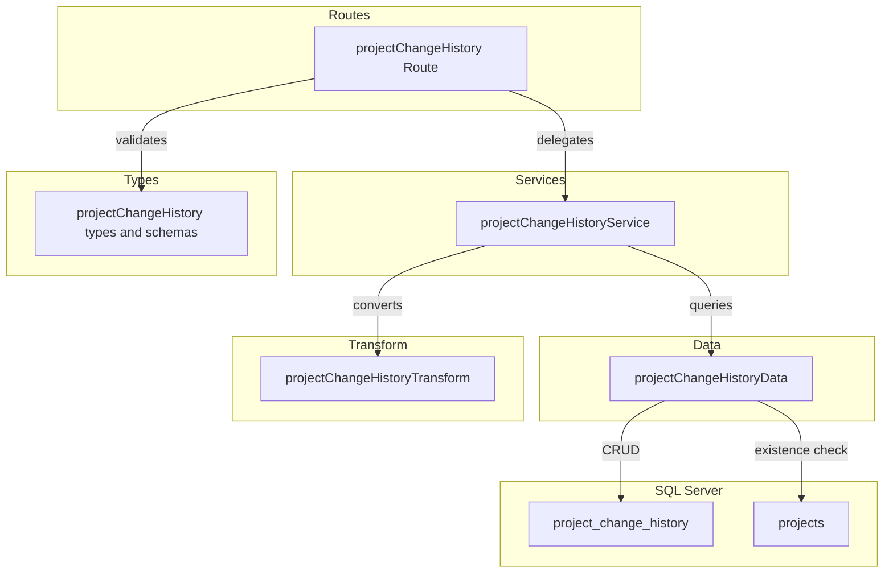
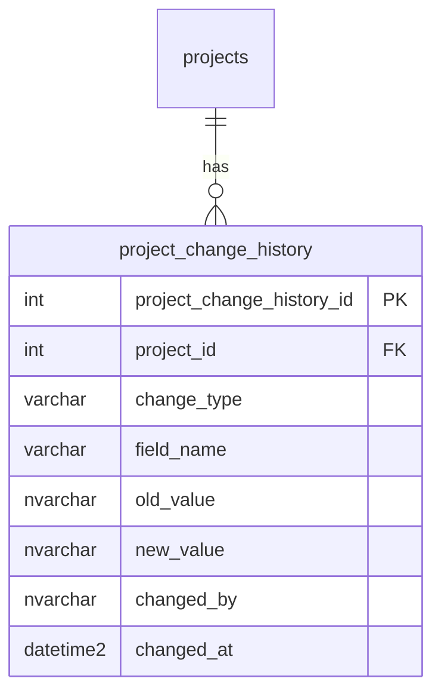

# Technical Design: project-change-history-crud-api

## Overview

**Purpose**: 案件（projects）に紐づく変更履歴（project_change_history）の CRUD API を提供し、案件の変更追跡・監査を可能にする。

**Users**: プロジェクトマネージャーが案件の変更経緯を確認し、システムが案件変更時に履歴を記録する。

**Impact**: バックエンドに project_change_history 関連テーブル用の CRD エンドポイントを追加。既存レイヤードアーキテクチャに routes/services/data/transform/types の各ファイルを新設し、`index.ts` にルートをマウントする。

### Goals
- project_change_history テーブルに対する CRD（作成・参照・削除）API の提供
- 関連テーブル特有の動作（物理削除・deleted_at なし）の実現
- 既存の CRUD 実装パターンとの一貫性維持
- `changed_at` 降順ソートによる直近変更の優先表示

### Non-Goals
- 変更履歴の更新（PUT）エンドポイント（履歴の不変性を担保）
- バルク Upsert（一括操作は不要）
- 案件変更時の自動履歴記録ロジック（本スペックは API 層のみ）
- フロントエンド実装
- 認証・認可の実装

## Architecture

### Existing Architecture Analysis

既存バックエンドのレイヤードアーキテクチャをそのまま踏襲する:

- **routes/**: Hono ルート定義 + Zod バリデーション
- **services/**: ビジネスロジック + HTTPException によるエラーハンドリング
- **data/**: mssql による直接 SQL 実行
- **transform/**: DB 行（snake_case）→ API レスポンス（camelCase）変換
- **types/**: Zod スキーマ + TypeScript 型定義
- **utils/**: validate ヘルパー、errorHelper（RFC 9457 対応）

**関連テーブルとの差異**:
- 論理削除なし → softDelete/restore エンドポイント不要
- ページネーションなし → 全件返却
- 更新エンドポイントなし → 変更履歴の不変性を担保
- `created_at`/`updated_at` なし → `changed_at` のみの特殊カラム構成
- 親テーブル（projects）の deleted_at チェックが必要

### Architecture Pattern & Boundary Map



**Architecture Integration**:
- Selected pattern: 既存レイヤードアーキテクチャの踏襲
- Domain boundaries: project_change_history は projects の関連データ（子リソース）
- Existing patterns preserved: validate → service → data → transform の呼び出しフロー
- New components rationale: 各レイヤーに1ファイルずつ追加（既存パターンと同一構成）
- Steering compliance: routes → services → data の依存方向を遵守

### Technology Stack

| Layer | Choice / Version | Role in Feature | Notes |
|-------|------------------|-----------------|-------|
| Backend | Hono v4 | ルート定義・リクエスト処理 | 既存と同一 |
| Validation | Zod + validate ヘルパー | リクエストバリデーション | 既存パターン利用 |
| Data | mssql | SQL Server 接続・クエリ実行 | 標準的な CRUD クエリのみ |
| Testing | Vitest | ユニットテスト | app.request() パターン |

## Requirements Traceability

| Requirement | Summary | Components | Interfaces | Flows |
|-------------|---------|------------|------------|-------|
| 1.1 | 一覧取得 | projectChangeHistory Route, Service, Data | API GET / | - |
| 1.2 | data 配列形式 | projectChangeHistory Route | API GET / | - |
| 1.3 | changed_at 降順ソート | projectChangeHistoryData | Service findAll | - |
| 1.4 | 親案件不存在 404 | projectChangeHistoryService | Service findAll | - |
| 2.1 | 単一取得 | projectChangeHistory Route, Service, Data | API GET /:id | - |
| 2.2 | 単一 404 | projectChangeHistoryService | Service findById | - |
| 2.3 | projectId 不一致 404 | projectChangeHistoryService | Service findById | - |
| 3.1 | 新規作成 201 | projectChangeHistory Route, Service, Data | API POST / | - |
| 3.2 | Location ヘッダ | projectChangeHistory Route | API POST / | - |
| 3.3 | Zod バリデーション | projectChangeHistory types | - | - |
| 3.4 | バリデーション 422 | projectChangeHistory Route (validate) | - | - |
| 3.5 | 親案件不存在 404 | projectChangeHistoryService | Service create | - |
| 4.1 | 物理削除 204 | projectChangeHistory Route, Service, Data | API DELETE /:id | - |
| 4.2 | 削除 404 | projectChangeHistoryService | Service delete | - |
| 4.3 | projectId 不一致 404 | projectChangeHistoryService | Service delete | - |
| 5.1 | data 形式レスポンス | projectChangeHistory Route | API Contract 全般 | - |
| 5.2 | RFC 9457 エラー | 全コンポーネント（既存 errorHelper） | - | - |
| 5.3 | camelCase レスポンス | projectChangeHistoryTransform | - | - |
| 5.4 | ISO 8601 日時 | projectChangeHistoryTransform | - | - |
| 6.1 | パスパラメータバリデーション | projectChangeHistory Route | - | - |
| 6.2 | パスパラメータ 422 | projectChangeHistory Route | - | - |
| 6.3 | changeType バリデーション | projectChangeHistory types | - | - |
| 6.4 | changedBy バリデーション | projectChangeHistory types | - | - |
| 7.1-7.4 | テスト | projectChangeHistory.test.ts | - | - |

## Components and Interfaces

| Component | Domain/Layer | Intent | Req Coverage | Key Dependencies | Contracts |
|-----------|--------------|--------|--------------|-----------------|-----------|
| projectChangeHistory types | Types | Zod スキーマ・型定義 | 3.3, 6.1-6.4 | - | Service |
| projectChangeHistoryData | Data | SQL クエリ実行 | 1.1-1.4, 2.1-2.3, 3.1, 3.5, 4.1-4.3 | mssql (P0), getPool (P0) | Service |
| projectChangeHistoryTransform | Transform | DB行→APIレスポンス変換 | 5.3-5.4 | projectChangeHistory types (P0) | - |
| projectChangeHistoryService | Services | ビジネスロジック・エラー | 1.4, 2.2-2.3, 3.5, 4.2-4.3 | Data (P0), Transform (P0) | Service |
| projectChangeHistory Route | Routes | エンドポイント定義 | 1.1-1.2, 2.1, 3.1-3.2, 3.4, 4.1, 5.1-5.2, 6.1-6.2 | Service (P0), validate (P0) | API |

### Types Layer

#### projectChangeHistory types

| Field | Detail |
|-------|--------|
| Intent | project_change_history の Zod バリデーションスキーマと TypeScript 型を定義する |
| Requirements | 3.3, 6.1-6.4 |

**Responsibilities & Constraints**
- 作成リクエストのバリデーションスキーマ定義
- DB 行型（snake_case）と API レスポンス型（camelCase）の定義
- `any` 型禁止、すべて Zod の `z.infer` で導出

**Dependencies**
- Inbound: routes — バリデーション (P0)

**Contracts**: Service [x]

##### Service Interface

```typescript
// Zod スキーマ
const createProjectChangeHistorySchema: z.ZodObject<{
  changeType: z.ZodString       // 必須・min(1).max(50)
  fieldName: z.ZodOptional<z.ZodString>   // 任意・max(100)
  oldValue: z.ZodOptional<z.ZodString>    // 任意・max(1000)
  newValue: z.ZodOptional<z.ZodString>    // 任意・max(1000)
  changedBy: z.ZodString        // 必須・min(1).max(100)
}>

// TypeScript 型
type CreateProjectChangeHistory = z.infer<typeof createProjectChangeHistorySchema>

type ProjectChangeHistoryRow = {
  project_change_history_id: number
  project_id: number
  change_type: string
  field_name: string | null
  old_value: string | null
  new_value: string | null
  changed_by: string
  changed_at: Date
}

type ProjectChangeHistory = {
  projectChangeHistoryId: number
  projectId: number
  changeType: string
  fieldName: string | null
  oldValue: string | null
  newValue: string | null
  changedBy: string
  changedAt: string       // ISO 8601
}
```

- Preconditions: なし
- Postconditions: すべてのスキーマが TypeScript 型と整合
- Invariants: DB 行型は snake_case、API レスポンス型は camelCase

### Data Layer

#### projectChangeHistoryData

| Field | Detail |
|-------|--------|
| Intent | project_change_history テーブルへの SQL クエリ実行（CRD） |
| Requirements | 1.1-1.4, 2.1-2.3, 3.1, 3.5, 4.1-4.3 |

**Responsibilities & Constraints**
- SQL Server へのクエリ実行のみ担当（ビジネスロジックを含めない）
- projects テーブルの存在確認 + deleted_at チェック
- 物理削除（DELETE 文）
- 一覧取得は `changed_at` 降順ソート

**Dependencies**
- Inbound: projectChangeHistoryService — 全メソッド呼び出し (P0)
- Outbound: `@/database/client` — getPool (P0)
- External: mssql — SQL Server 接続 (P0)

**Contracts**: Service [x]

##### Service Interface

```typescript
interface ProjectChangeHistoryDataInterface {
  findAll(projectId: number): Promise<ProjectChangeHistoryRow[]>
  // ORDER BY changed_at DESC

  findById(projectChangeHistoryId: number): Promise<ProjectChangeHistoryRow | undefined>

  create(data: {
    projectId: number
    changeType: string
    fieldName?: string
    oldValue?: string
    newValue?: string
    changedBy: string
  }): Promise<ProjectChangeHistoryRow>

  deleteById(projectChangeHistoryId: number): Promise<boolean>
  // 物理削除。削除成功 true、レコード不存在 false

  projectExists(projectId: number): Promise<boolean>
  // projects テーブルで deleted_at IS NULL のレコードの存在確認
}
```

- Preconditions: DB 接続プールが利用可能
- Postconditions: 各メソッドは ProjectChangeHistoryRow またはプリミティブ値を返却
- Invariants: findAll は changed_at DESC でソート

**Implementation Notes**
- findAll: `SELECT * FROM project_change_history WHERE project_id = @projectId ORDER BY changed_at DESC`
- create は OUTPUT 句で IDENTITY 値を取得後、findById で行を返却
- deleteById は `DELETE FROM project_change_history WHERE project_change_history_id = @id` で rowsAffected > 0 を返却
- projectExists: `SELECT 1 FROM projects WHERE project_id = @projectId AND deleted_at IS NULL`

### Transform Layer

#### projectChangeHistoryTransform

| Field | Detail |
|-------|--------|
| Intent | ProjectChangeHistoryRow（snake_case）から ProjectChangeHistory（camelCase）への変換 |
| Requirements | 5.3-5.4 |

**Responsibilities & Constraints**
- snake_case → camelCase のフィールド名変換
- `changed_at`: Date → ISO 8601 文字列変換
- null フィールド（fieldName, oldValue, newValue）はそのまま null を維持

**Dependencies**
- Inbound: projectChangeHistoryService — 変換処理 (P0)
- Outbound: projectChangeHistory types — ProjectChangeHistoryRow, ProjectChangeHistory (P0)

**Contracts**: Service [x]

##### Service Interface

```typescript
function toProjectChangeHistoryResponse(row: ProjectChangeHistoryRow): ProjectChangeHistory
```

- Preconditions: row が null でないこと
- Postconditions: camelCase の ProjectChangeHistory オブジェクトを返却
- Invariants: changed_at は ISO 8601 文字列に変換

### Service Layer

#### projectChangeHistoryService

| Field | Detail |
|-------|--------|
| Intent | 案件変更履歴のビジネスロジック・エラーハンドリングを集約する |
| Requirements | 1.4, 2.2-2.3, 3.5, 4.2-4.3 |

**Responsibilities & Constraints**
- 親リソース（projects）の存在確認（deleted_at IS NULL）
- projectId の親子整合性チェック（単一取得/削除時）
- HTTPException による統一的なエラー送出

**Dependencies**
- Inbound: projectChangeHistory Route — 全エンドポイント (P0)
- Outbound: projectChangeHistoryData — DB アクセス (P0)
- Outbound: projectChangeHistoryTransform — レスポンス変換 (P0)

**Contracts**: Service [x]

##### Service Interface

```typescript
interface ProjectChangeHistoryServiceInterface {
  findAll(projectId: number): Promise<ProjectChangeHistory[]>
  // Throws: HTTPException(404) if project not found or deleted (1.4)

  findById(projectId: number, projectChangeHistoryId: number): Promise<ProjectChangeHistory>
  // Throws: HTTPException(404) if not found or projectId mismatch (2.2, 2.3)

  create(projectId: number, data: CreateProjectChangeHistory): Promise<ProjectChangeHistory>
  // Throws: HTTPException(404) if project not found or deleted (3.5)

  delete(projectId: number, projectChangeHistoryId: number): Promise<void>
  // Throws: HTTPException(404) if not found or projectId mismatch (4.2, 4.3)
}
```

- Preconditions: 各メソッドの引数が型スキーマに適合
- Postconditions: 正常時は ProjectChangeHistory を返却、異常時は HTTPException を送出
- Invariants: projectId の親子整合性は全操作で検証

**Implementation Notes**
- findById/delete 時: data 層で取得した行の `project_id` と URL の `projectId` を比較し、不一致なら 404

### Route Layer

#### projectChangeHistory Route

| Field | Detail |
|-------|--------|
| Intent | `/projects/:projectId/change-history` 配下の HTTP エンドポイントを定義する |
| Requirements | 1.1-1.2, 2.1, 3.1-3.2, 3.4, 4.1, 5.1-5.2, 6.1-6.2 |

**Responsibilities & Constraints**
- Zod バリデーション（json）の適用
- パスパラメータ（projectId, projectChangeHistoryId）の parseInt 変換とバリデーション
- サービス層への委譲
- HTTP ステータスコードとレスポンス形式の制御
- Location ヘッダの設定（POST 201 時）

**Dependencies**
- Inbound: index.ts — app.route() でマウント (P0)
- Outbound: projectChangeHistoryService — ビジネスロジック (P0)
- Outbound: validate — Zod バリデーション (P0)
- Outbound: projectChangeHistory types — スキーマ (P0)

**Contracts**: API [x]

##### API Contract

| Method | Endpoint | Request | Response | Errors |
|--------|----------|---------|----------|--------|
| GET | / | - | `{ data: ProjectChangeHistory[] }` 200 | 404, 422 |
| GET | /:projectChangeHistoryId | param: projectChangeHistoryId (int) | `{ data: ProjectChangeHistory }` 200 | 404, 422 |
| POST | / | json: createProjectChangeHistorySchema | `{ data: ProjectChangeHistory }` 201 + Location | 404, 422 |
| DELETE | /:projectChangeHistoryId | - | 204 No Content | 404 |

**Implementation Notes**
- index.ts に `app.route('/projects/:projectId/change-history', projectChangeHistory)` でマウント
- projectId は各ハンドラで `c.req.param('projectId')` → `parseInt` で取得。NaN の場合は HTTPException(422)
- GET 一覧はページネーション不要のため query バリデーションなし

## Data Models

### Domain Model



- **Aggregate**: project_change_history は projects の関連データ
- **Business Rules**:
  - 物理削除（deleted_at なし）
  - 親テーブル削除時は ON DELETE CASCADE で自動削除
  - `changed_at` は DB のデフォルト値（GETDATE()）で自動設定
  - 一度作成された履歴レコードは更新不可（不変性）

### Physical Data Model

project_change_history テーブルの既存定義（`docs/database/table-spec.md` 参照）をそのまま利用する。スキーマ変更は不要。

| Column | Type | Nullable | Description |
|--------|------|----------|-------------|
| project_change_history_id | INT IDENTITY(1,1) | NO | 主キー |
| project_id | INT | NO | FK → projects(ON DELETE CASCADE) |
| change_type | VARCHAR(50) | NO | 変更タイプ |
| field_name | VARCHAR(100) | YES | 変更フィールド名 |
| old_value | NVARCHAR(1000) | YES | 変更前の値 |
| new_value | NVARCHAR(1000) | YES | 変更後の値 |
| changed_by | NVARCHAR(100) | NO | 変更者 |
| changed_at | DATETIME2 | NO | 変更日時（DEFAULT GETDATE()） |

**インデックス**:
- PK_project_change_history (project_change_history_id)
- IX_project_change_history_project (project_id)
- IX_project_change_history_changed_at (changed_at)

### Data Contracts & Integration

**API Data Transfer**

リクエスト: camelCase（Zod スキーマで定義）
レスポンス: camelCase（projectChangeHistoryTransform で変換）
シリアライゼーション: JSON

## Error Handling

### Error Strategy

既存のグローバルエラーハンドラ（`index.ts` の `app.onError`）と validate ヘルパー（`utils/validate.ts`）を利用する。新規のエラーハンドリングコードは不要。

### Error Categories and Responses

| Category | Status | Trigger | Detail |
|----------|--------|---------|--------|
| バリデーション | 422 | Zod スキーマ不適合、パスパラメータ不正 | RFC 9457 + errors 配列 |
| リソース不存在 | 404 | projectId 不存在/論理削除済み、projectChangeHistoryId 不存在、projectId 不一致 | RFC 9457 |
| 内部エラー | 500 | 予期しない例外 | RFC 9457（グローバルハンドラ） |

## Testing Strategy

### Unit Tests

テストファイル: `src/__tests__/routes/projectChangeHistory.test.ts`

パターン: Vitest + `app.request()` を使用した HTTP レベルテスト。service 層をモック。

| テスト区分 | テスト内容 |
|-----------|-----------|
| GET / 正常系 | 一覧取得、changed_at 降順ソート、data 配列形式 |
| GET /:id 正常系 | 単一取得、data オブジェクト形式 |
| POST / 正常系 | 作成、201 + Location ヘッダ、レスポンスボディ |
| DELETE /:id 正常系 | 物理削除、204 No Content |
| GET / 異常系 | 不存在/削除済み projectId → 404 |
| GET /:id 異常系 | 不存在 → 404、projectId 不一致 → 404 |
| POST / 異常系 | バリデーション → 422、親案件不存在 → 404 |
| DELETE /:id 異常系 | 不存在 → 404 |
