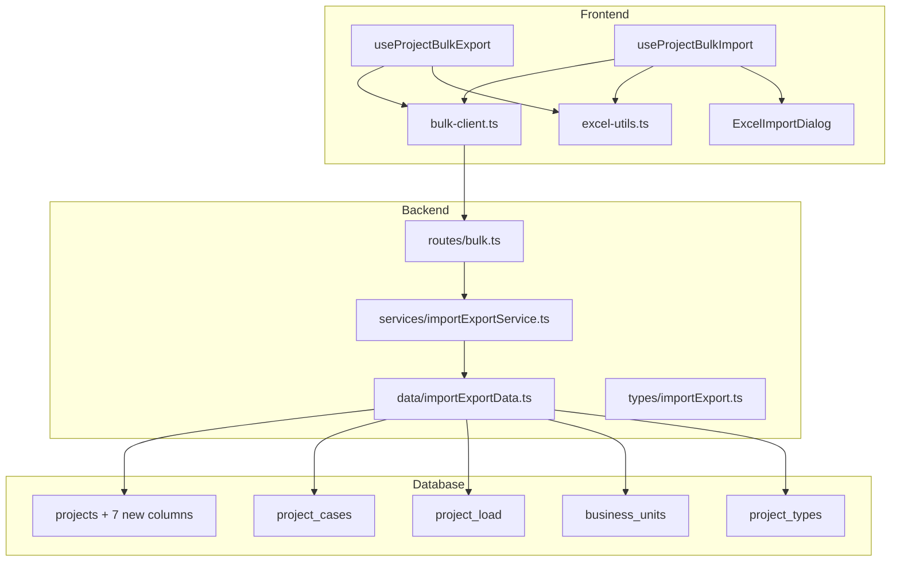
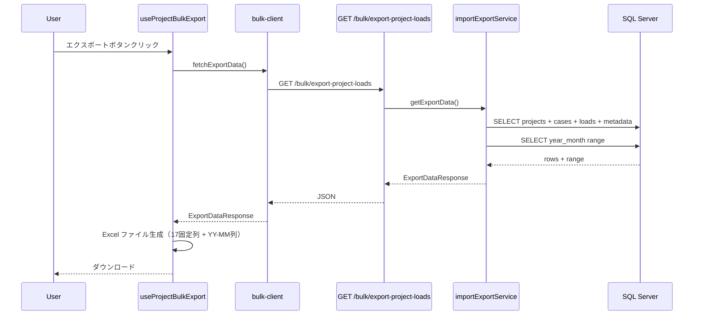
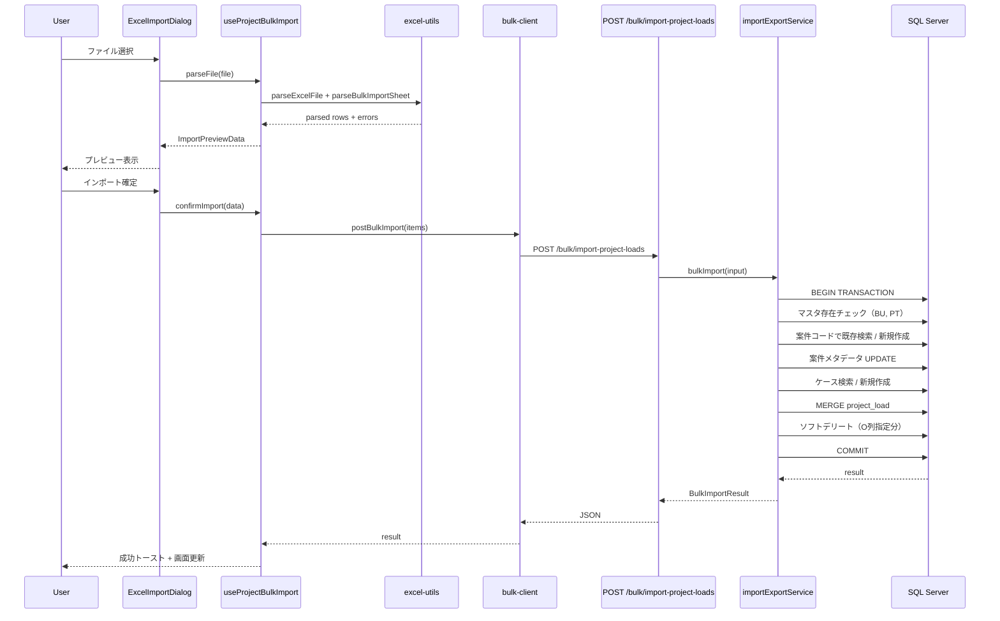

# Design Document: 案件工数インポート・エクスポート機能改善

## Overview

**Purpose**: 案件工数の Excel インポート・エクスポート機能を刷新し、案件メタデータ（BU・工事種別・客先名・地域等）を含む拡張フォーマットと、全 BU 横断のデータ入出力を実現する。

**Users**: プロジェクトマネージャー・事業部リーダーが、案件工数の一括管理・外部資料との連携に使用する。

**Impact**: 既存の Bulk API（`routes/bulk.ts` 系）を刷新し、3列固定フォーマットから 17列固定 + 動的年月列フォーマットへ移行する。DB スキーマに 7 カラムを追加する。

### Goals

- Excel 列構成を 17 固定列 + 動的年月列に拡張
- 全 BU 横断の一括インポート・エクスポート
- 案件コード未入力時の新規案件自動登録（`AUTO-{NNN}` 方式）
- 工数ケースの新規自動登録
- ラウンドトリップ互換性の確保

### Non-Goals

- 間接工数のインポート・エクスポート（別 spec で管理）
- Excel テンプレートダウンロード機能
- インポート履歴・監査ログ
- 単一ケース単位のインポート・エクスポート（既存 case-study 機能は維持）

## Architecture

### Existing Architecture Analysis

既存 Bulk API は以下のレイヤードパターンで構成されている:

```
routes/bulk.ts → services/importExportService.ts → data/importExportData.ts
                                                     ↓
                                                  types/importExport.ts
```

- **現行エクスポート**: 3 テーブル JOIN（projects + project_cases + project_load）→ ケース単位グループ化 → JSON レスポンス
- **現行インポート**: projectCaseId バリデーション → MERGE upsert（1 トランザクション）
- **現行 Excel 処理**: フロントエンドで完結（xlsx パッケージ）

### Architecture Pattern & Boundary Map

**Selected pattern**: 既存レイヤードアーキテクチャ（routes → services → data）の直接拡張



**Existing patterns preserved**: レイヤード依存方向（routes → services → data）、Zod スキーマ中心の型安全、MERGE upsert パターン、フロントエンド Excel 処理

**Steering compliance**: モノレポ構成、camelCase/snake_case 変換、RFC 9457 エラー形式

### Technology Stack

| Layer | Choice / Version | Role in Feature | Notes |
|-------|------------------|-----------------|-------|
| Frontend | React 19 + TanStack Query | Excel 生成・パース、API 連携 | 既存 hook 拡張 |
| Frontend | xlsx パッケージ | Excel ファイル読み書き | 既存利用 |
| Backend | Hono v4 | REST API エンドポイント | 既存 bulk.ts 拡張 |
| Backend | Zod v4 | リクエスト・レスポンスバリデーション | スキーマ拡張 |
| Database | SQL Server + mssql | データ永続化、MERGE upsert | 7 カラム追加 |

## System Flows

### エクスポートフロー



### インポートフロー



**Key Decisions**:
- バリデーションはフロントエンド（パース時）で実施。バックエンドはスキーマ検証 + マスタ存在チェックのみ
- 全行を 1 トランザクションで処理（All-or-Nothing）
- 案件コード空欄 → `AUTO-{NNN}` 自動採番（トランザクション内で MAX 取得）

## Requirements Traceability

| Requirement | Summary | Components | Interfaces | Flows |
|-------------|---------|------------|------------|-------|
| 1.1-1.4 | Excel 列構成拡張 + DB カラム追加 | importExport.ts, importExportData, excel-utils, projectData | ExportRow, BulkImportRow | Export, Import |
| 2.1-2.4 | 全BU横断インポート | importExportService, importExportData | BulkImportInput | Import |
| 3.1-3.4 | 新規案件自動登録 | importExportService, importExportData | BulkImportInput | Import |
| 4.1-4.3 | 工数ケース自動登録 | importExportService, importExportData | BulkImportInput | Import |
| 5.1-5.5 | 全案件エクスポート | importExportService, importExportData, useProjectBulkExport | ExportDataResponse | Export |
| 6.1-6.4 | 動的年月列取込 | excel-utils, useProjectBulkImport | parseBulkImportSheet | Import |
| 7.1-7.3 | 削除フラグ | importExportService, importExportData | BulkImportInput | Import |
| 8.1-8.3 | ラウンドトリップ | useProjectBulkExport, useProjectBulkImport, excel-utils | ExportRow | Export, Import |
| 9.1-9.9 | バリデーション | excel-utils, importExportService | ValidationError | Import |

## Components and Interfaces

| Component | Domain/Layer | Intent | Req Coverage | Key Dependencies | Contracts |
|-----------|--------------|--------|--------------|-----------------|-----------|
| importExport.ts | Backend/Types | 拡張 Zod スキーマ・型定義 | 1, 2, 3, 4, 7 | Zod v4 (P0) | — |
| importExportService.ts | Backend/Service | エクスポート集約・インポートオーケストレーション | 全 Req | importExportData (P0) | Service |
| importExportData.ts | Backend/Data | 拡張 SQL クエリ・MERGE・マスタ検証 | 1, 2, 3, 4, 5, 7 | mssql (P0) | — |
| routes/bulk.ts | Backend/Routes | エンドポイント定義 | 全 Req | importExportService (P0) | API |
| projectData.ts | Backend/Data | projects テーブル拡張（7カラム追加対応） | 1.4 | mssql (P0) | — |
| excel-utils.ts | Frontend/Lib | YY-MM 変換・17列パース | 1, 6, 8, 9 | xlsx (P0) | — |
| useProjectBulkExport.ts | Frontend/Hook | エクスポート Excel 生成 | 1, 5, 8 | bulk-client (P0) | — |
| useProjectBulkImport.ts | Frontend/Hook | インポートパース・確定 | 1, 2, 3, 4, 6, 7, 9 | bulk-client (P0), excel-utils (P0) | — |
| bulk-client.ts | Frontend/API | Bulk API クライアント | 全 Req | fetch (P0) | API |

### Backend / Types

#### types/importExport.ts

| Field | Detail |
|-------|--------|
| Intent | インポート・エクスポートの Zod スキーマと TypeScript 型定義を拡張 |
| Requirements | 1.1-1.4, 2.1, 3.1-3.4, 4.1-4.3, 7.1 |

**Responsibilities & Constraints**
- 17 固定列に対応するインポートアイテムスキーマを定義
- エクスポート行型に案件メタデータを追加
- 新規カラム（7 列）の型定義

**Contracts**: Service [x]

##### Service Interface

```typescript
/** インポートアイテム（1行 = 1案件ケース + 月次データ） */
interface BulkImportRow {
  projectCode: string | null;       // A列: 空 = 新規
  businessUnitCode: string;         // B列
  fiscalYear: number | null;        // C列
  projectTypeCode: string | null;   // D列
  name: string;                     // E列
  nickname: string | null;          // F列
  customerName: string | null;      // G列
  orderNumber: string | null;       // H列
  startYearMonth: string;           // I列: YYYYMM
  totalManhour: number;             // J列
  durationMonths: number | null;    // K列
  calculationBasis: string | null;  // L列
  remarks: string | null;           // M列
  region: string | null;            // N列
  deleteFlag: boolean;              // O列
  projectCaseId: number | null;     // P列: 空 = 新規ケース
  caseName: string;                 // Q列
  loads: Array<{                    // R列以降
    yearMonth: string;              // YYYYMM
    manhour: number;
  }>;
}

/** インポートリクエスト */
interface BulkImportInput {
  items: BulkImportRow[];           // min 1
}

/** インポート結果 */
interface BulkImportResult {
  createdProjects: number;
  updatedProjects: number;
  deletedProjects: number;
  createdCases: number;
  updatedCases: number;
  updatedRecords: number;
}

/** エクスポート行（案件メタデータ付き） */
interface ExportRow {
  projectCode: string;
  businessUnitCode: string;
  fiscalYear: number | null;
  projectTypeCode: string | null;
  name: string;
  nickname: string | null;
  customerName: string | null;
  orderNumber: string | null;
  startYearMonth: string;
  totalManhour: number;
  durationMonths: number | null;
  calculationBasis: string | null;
  remarks: string | null;
  region: string | null;
  projectCaseId: number;
  caseName: string;
  loads: Array<{ yearMonth: string; manhour: number }>;
}

/** エクスポートレスポンス */
interface ExportDataResponse {
  data: ExportRow[];
  yearMonths: string[];
}
```

### Backend / Service

#### services/importExportService.ts

| Field | Detail |
|-------|--------|
| Intent | エクスポートデータ集約・インポートのオーケストレーション（案件CRUD + ケースCRUD + 月次データ upsert） |
| Requirements | 全 Req |

**Responsibilities & Constraints**
- エクスポート: 全案件 + 全ケース + 月次データ + メタデータを集約してレスポンス生成
- インポート: マスタ存在チェック → 案件 upsert → ケース upsert → 月次データ MERGE → ソフトデリート（全体を 1 トランザクション）
- 案件コード自動生成: 空欄行に `AUTO-{NNN}` を割り当て

**Dependencies**
- Outbound: importExportData — DB アクセス委譲 (P0)

**Contracts**: Service [x]

##### Service Interface

```typescript
interface ImportExportService {
  /** 全案件エクスポート */
  getExportData(): Promise<ExportDataResponse>;

  /** 一括インポート（案件 + ケース + 月次データ） */
  bulkImport(input: BulkImportInput): Promise<BulkImportResult>;
}
```

- **Preconditions (bulkImport)**:
  - items が 1 件以上
  - Zod スキーマバリデーション通過済み
- **Postconditions (bulkImport)**:
  - 成功: 全データがコミット済み
  - 失敗: 全データがロールバック済み（All-or-Nothing）
- **Invariants**:
  - 自動生成された案件コードは既存コードと重複しない
  - BU コード・PT コードはマスタに存在する

**Implementation Notes**
- インポート処理のフロー:
  1. 入力から一意な BU コード・PT コード・案件コードを抽出
  2. バリデーション: BU/PT のマスタ存在チェック（トランザクション外）
  3. トランザクション開始
  4. 案件コードごとにグループ化し、既存案件を一括検索
  5. 案件コード空欄行: `AUTO-{NNN}` を生成して INSERT
  6. 案件コード既存行: メタデータ UPDATE
  7. 各案件のケースについて: P列空 → INSERT、P列あり → 月次データ MERGE
  8. O列が削除指定の行: ソフトデリート実行
  9. トランザクションコミット

### Backend / Data

#### data/importExportData.ts

| Field | Detail |
|-------|--------|
| Intent | 拡張エクスポート SQL（案件メタデータ含む）、一括インポート SQL（案件・ケース CRUD + MERGE） |
| Requirements | 1, 2, 3, 4, 5, 7 |

**Responsibilities & Constraints**
- エクスポート SQL: projects + project_cases + project_load の JOIN に案件メタデータカラム（7 新カラム含む）を追加
- マスタ存在チェック: BU コード・PT コードのバッチ検証
- 案件 upsert: project_code で検索 → INSERT or UPDATE
- ケース upsert: project_case_id で検索 → INSERT or 既存利用
- 月次データ MERGE: 既存パターンを維持
- ソフトデリート: deleted_at = GETDATE() の UPDATE
- 案件コード自動生成: `SELECT MAX(project_code) FROM projects WHERE project_code LIKE 'AUTO-%'` → インクリメント

**Contracts**: Service [x]

##### Service Interface

```typescript
interface ImportExportData {
  /** 拡張エクスポートデータ取得 */
  getExportData(): Promise<ExportDataRow[]>;

  /** 年月範囲取得 */
  getYearMonthRange(): Promise<{ minYearMonth: string; maxYearMonth: string } | null>;

  /** BU コードバッチ検証 */
  validateBusinessUnitCodes(codes: string[]): Promise<string[]>;

  /** PT コードバッチ検証 */
  validateProjectTypeCodes(codes: string[]): Promise<string[]>;

  /** 案件コードで既存案件をバッチ検索 */
  findProjectsByProjectCodes(codes: string[]): Promise<Map<string, ProjectRow>>;

  /** 次の AUTO 案件コードを生成 */
  generateNextAutoCode(transaction: sql.Transaction): Promise<string>;

  /** 案件を INSERT（トランザクション内） */
  createProject(data: CreateProjectData, transaction: sql.Transaction): Promise<number>;

  /** 案件メタデータを UPDATE（トランザクション内） */
  updateProject(projectId: number, data: UpdateProjectData, transaction: sql.Transaction): Promise<void>;

  /** ケースを INSERT（トランザクション内） */
  createProjectCase(projectId: number, caseName: string, transaction: sql.Transaction): Promise<number>;

  /** 月次データ MERGE（トランザクション内） */
  mergeProjectLoad(projectCaseId: number, yearMonth: string, manhour: number, transaction: sql.Transaction): Promise<void>;

  /** ソフトデリート（トランザクション内） */
  softDeleteProject(projectId: number, transaction: sql.Transaction): Promise<void>;
}
```

### Backend / Routes

#### routes/bulk.ts

| Field | Detail |
|-------|--------|
| Intent | Bulk API エンドポイント定義（エクスポート・インポート） |
| Requirements | 全 Req |

**Contracts**: API [x]

##### API Contract

| Method | Endpoint | Request | Response | Errors |
|--------|----------|---------|----------|--------|
| GET | /bulk/export-project-loads | — | `ExportDataResponse` | 500 |
| POST | /bulk/import-project-loads | `BulkImportInput` | `{ data: BulkImportResult }` | 422, 500 |

**Implementation Notes**
- エンドポイントパスは既存を維持（フロントエンドの URL 変更を最小化）
- POST のリクエストボディは新 `bulkImportSchema` でバリデーション
- 422: バリデーションエラー（Zod エラー or マスタ不整合）

### Backend / Data（拡張）

#### data/projectData.ts

| Field | Detail |
|-------|--------|
| Intent | projects テーブルの 7 カラム追加に伴う SELECT_COLUMNS・fieldMap 拡張 |
| Requirements | 1.4 |

**Implementation Notes**
- `SELECT_COLUMNS` に 7 新カラムを追加
- `create()` の INSERT 文に 7 新カラムを追加
- `update()` の `fieldMap` に 7 新カラムのマッピングを追加
- `ProjectRow` 型に 7 新フィールドを追加

### Frontend / Lib

#### lib/excel-utils.ts

| Field | Detail |
|-------|--------|
| Intent | YY-MM ⇔ YYYYMM 変換関数の追加、17 固定列対応 |
| Requirements | 1.2-1.3, 6.1-6.4 |

**Implementation Notes**
- `convertShortYearMonthHeader(header: string): string | null` 追加 — YY-MM → YYYYMM（例: "25-04" → "202504"）
- `formatShortYearMonth(ym: string): string` 追加 — YYYYMM → YY-MM（例: "202504" → "25-04"）
- 既存の `convertYearMonthHeader`（YYYY-MM → YYYYMM）は他機能で使用中のため維持
- `parseBulkImportSheet` の `fixedColumnCount` を 17 に変更して呼び出す（hook 側で指定）

### Frontend / Hooks

#### features/projects/hooks/useProjectBulkExport.ts

| Field | Detail |
|-------|--------|
| Intent | 17 固定列 + YY-MM 年月列の Excel エクスポート生成 |
| Requirements | 1.1-1.3, 5.1-5.5, 8.1-8.3 |

**Implementation Notes**
- `fixedHeaders` を 17 列に拡張: ["案件コード", "BU", "年度", "工事種別", "案件名", "通称・略称", "客先名", "オーダ", "開始時期", "案件工数", "月数", "算出根拠", "備考", "地域", "削除", "工数ケースNo", "工数ケース名"]
- 年月列ヘッダーを YY-MM 形式で出力
- `fixedValues` に案件メタデータをマッピング
- ファイル名: `案件工数一括_{YYYYMMDD}.xlsx`

#### features/projects/hooks/useProjectBulkImport.ts

| Field | Detail |
|-------|--------|
| Intent | 17 固定列 Excel のパース・バリデーション・インポート確定 |
| Requirements | 1.1, 2.1-2.4, 3.1-3.4, 4.1-4.3, 6.1-6.4, 7.1-7.2, 9.1-9.9 |

**Implementation Notes**
- `fixedColumnCount: 17` で `parseBulkImportSheet` を呼び出し
- `parseYearMonth` に `convertShortYearMonthHeader`（YY-MM → YYYYMM）を使用
- `validateRow` でフォーマット・必須チェック:
  - B列（BU）: 必須
  - E列（案件名）: 必須（案件コード空欄時）
  - I列（開始時期）: YYYYMM 形式（案件コード空欄時に必須）
  - J列（全体工数）: 数値・範囲チェック（案件コード空欄時に必須）
- `confirmImport`: 17 固定列データを `BulkImportRow[]` に変換して API 送信
- プレビュー用 label: `{projectCode} | {name} / {caseName}`

### Frontend / API

#### features/projects/api/bulk-client.ts

| Field | Detail |
|-------|--------|
| Intent | Bulk API クライアントの型定義更新 |
| Requirements | 全 Req |

**Implementation Notes**
- `ExportRow` 型を 17 列対応に拡張
- `postBulkImport` のリクエスト型を `BulkImportRow[]` に変更
- `BulkImportResult` に createdProjects, deletedProjects 等を追加
- エンドポイント URL は変更なし

## Data Models

### Physical Data Model

#### projects テーブル: 7 カラム追加

```sql
ALTER TABLE projects ADD fiscal_year INT NULL;
ALTER TABLE projects ADD nickname NVARCHAR(120) NULL;
ALTER TABLE projects ADD customer_name NVARCHAR(120) NULL;
ALTER TABLE projects ADD order_number NVARCHAR(120) NULL;
ALTER TABLE projects ADD calculation_basis NVARCHAR(500) NULL;
ALTER TABLE projects ADD remarks NVARCHAR(500) NULL;
ALTER TABLE projects ADD region NVARCHAR(100) NULL;
```

| カラム名 | データ型 | NULL | 説明 | Excel 列 |
|---------|---------|------|------|---------|
| fiscal_year | INT | YES | 年度 | C列 |
| nickname | NVARCHAR(120) | YES | 通称・略称 | F列 |
| customer_name | NVARCHAR(120) | YES | 客先名 | G列 |
| order_number | NVARCHAR(120) | YES | オーダ | H列 |
| calculation_basis | NVARCHAR(500) | YES | 算出根拠 | L列 |
| remarks | NVARCHAR(500) | YES | 備考 | M列 |
| region | NVARCHAR(100) | YES | 地域 | N列 |

### Data Contracts

#### Excel フォーマット定義

| 列 | ヘッダー名 | 型 | DB マッピング | 備考 |
|----|----------|----|----|------|
| A | 案件コード | string | projects.project_code | 空 = 新規（AUTO 採番） |
| B | BU | string | projects.business_unit_code | 必須、マスタ検証 |
| C | 年度 | number | projects.fiscal_year | 任意 |
| D | 工事種別 | string | projects.project_type_code | 任意、マスタ検証 |
| E | 案件名 | string | projects.name | 新規時必須 |
| F | 通称・略称 | string | projects.nickname | 任意 |
| G | 客先名 | string | projects.customer_name | 任意 |
| H | オーダ | string | projects.order_number | 任意 |
| I | 開始時期 | string | projects.start_year_month | YYYYMM、新規時必須 |
| J | 案件工数 | number | projects.total_manhour | 新規時必須 |
| K | 月数 | number | projects.duration_months | 任意 |
| L | 算出根拠 | string | projects.calculation_basis | 任意 |
| M | 備考 | string | projects.remarks | 任意 |
| N | 地域 | string | projects.region | 任意 |
| O | 削除 | string | → softDelete 操作 | "1" or "削除" で論理削除 |
| P | 工数ケースNo | number | project_cases.project_case_id | 空 = 新規ケース |
| Q | 工数ケース名 | string | project_cases.case_name | 新規ケース時必須 |
| R+ | YY-MM | number | project_load.manhour | 空セル = 0 |

#### 案件コード自動生成ルール

- フォーマット: `AUTO-{NNN}`（NNN = 0 埋め 6 桁、例: `AUTO-000001`）
- 採番方式: トランザクション内で `SELECT MAX(project_code) FROM projects WHERE project_code LIKE 'AUTO-%'` → パース → +1
- 初期値: `AUTO-000001`
- 衝突防止: トランザクション分離レベルで排他制御

## Error Handling

### Error Categories and Responses

**User Errors (422)**:
- Zod バリデーションエラー（型・形式不正）→ RFC 9457 Problem Details
- マスタ不整合（BU/PT コード不存在）→ 無効なコードの一覧を返却

**System Errors (500)**:
- トランザクション失敗 → 自動ロールバック + エラーメッセージ

**Frontend Validation Errors**:
- `ValidationError[]` としてプレビュー画面に表示
- エラーがある場合はインポート確定ボタン無効化

### バリデーション詳細

| 対象 | チェック場所 | 内容 |
|------|-----------|------|
| B列（BU） | Frontend + Backend | 必須 + マスタ存在 |
| D列（工事種別） | Frontend + Backend | 任意だが値ありならマスタ存在 |
| I列（開始時期） | Frontend | YYYYMM 形式 |
| J列（全体工数） | Frontend | 数値・0〜99,999,999 |
| R列以降（工数） | Frontend | 数値・0〜99,999,999 |
| 年月ヘッダー | Frontend | YY-MM 形式 |
| 新規案件必須項目 | Frontend | B, E, I, J が空でないこと |
| 新規ケース必須項目 | Frontend | Q が空でないこと |

## Testing Strategy

### Unit Tests
- `importExportService.getExportData()` — 全案件メタデータがエクスポートに含まれること
- `importExportService.bulkImport()` — 新規案件・既存案件・新規ケース・ソフトデリートの各パス
- `generateNextAutoCode()` — 連番の正しい採番と 0 埋め
- `convertShortYearMonthHeader()` — YY-MM → YYYYMM 変換の正確性
- `formatShortYearMonth()` — YYYYMM → YY-MM 変換の正確性

### Integration Tests
- エクスポート → インポートのラウンドトリップ（17 列フォーマット）
- 複数 BU 混在データのインポート
- 案件コード空欄行の新規登録（AUTO 採番）+ 既存行の更新の混在
- マスタ不整合時の 422 エラーレスポンス
- ソフトデリート指定行の論理削除

### Performance
- 1000 行インポートの処理時間計測
- エクスポートデータ量が大きい場合のレスポンスサイズ確認

## Migration Strategy

### Phase 1: DB スキーマ変更

```sql
-- 7 カラム追加（全て NULL 許容のため既存データに影響なし）
ALTER TABLE projects ADD fiscal_year INT NULL;
ALTER TABLE projects ADD nickname NVARCHAR(120) NULL;
ALTER TABLE projects ADD customer_name NVARCHAR(120) NULL;
ALTER TABLE projects ADD order_number NVARCHAR(120) NULL;
ALTER TABLE projects ADD calculation_basis NVARCHAR(500) NULL;
ALTER TABLE projects ADD remarks NVARCHAR(500) NULL;
ALTER TABLE projects ADD region NVARCHAR(100) NULL;
```

- ロールバック: `ALTER TABLE projects DROP COLUMN ...`
- 全て NULL 許容のため、既存データ・既存 API への影響なし

### Phase 2: バックエンド型定義・Transform 更新

- `types/project.ts` — スキーマ・型に 7 フィールド追加
- `types/importExport.ts` — 新スキーマ・型定義
- `transform/projectTransform.ts` — フィールドマッピング追加
- `data/projectData.ts` — SELECT_COLUMNS, fieldMap 拡張

### Phase 3: バックエンドサービス・データ・ルート刷新

- `data/importExportData.ts` — エクスポート SQL 拡張、インポート SQL 新規（案件/ケース CRUD、マスタ検証、AUTO 採番）
- `services/importExportService.ts` — インポートオーケストレーション刷新
- `routes/bulk.ts` — 新スキーマでバリデーション

### Phase 4: フロントエンド刷新

- `lib/excel-utils.ts` — YY-MM 変換関数追加
- `features/projects/hooks/useProjectBulkExport.ts` — 17 列エクスポート
- `features/projects/hooks/useProjectBulkImport.ts` — 17 列インポート
- `features/projects/api/bulk-client.ts` — 型定義更新
