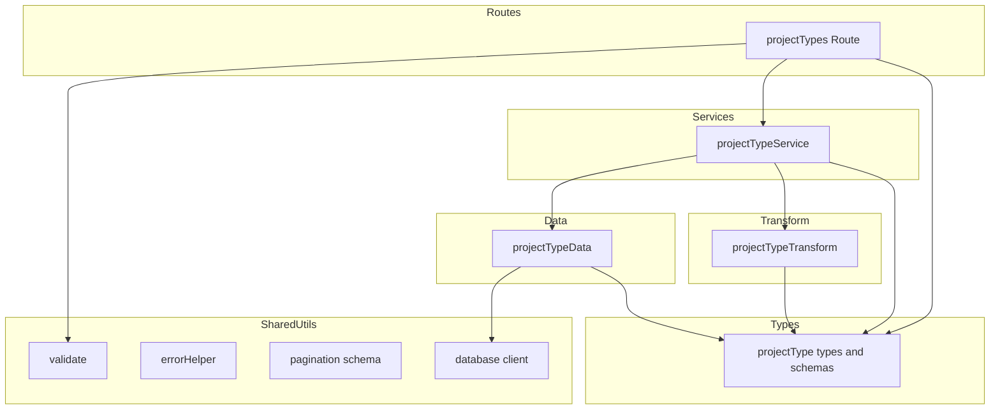

# 技術設計書: project-types-crud

## Overview

案件タイプ（`project_types`）マスタテーブルに対する CRUD API を提供する。案件タイプは案件の分類に使用されるマスタデータであり、一覧取得・単一取得・作成・更新・論理削除・復元の6つの操作をサポートする。

**Purpose**: 案件タイプの管理機能を API として公開し、フロントエンドおよび他のサービスから案件種別を操作可能にする。

**Users**: API 利用者（フロントエンドアプリケーション、外部連携サービス）が案件タイプのマスタ管理に使用する。

### Goals
- `project_types` テーブルに対する完全な CRUD API を提供する
- 既存の `business-units` API と一貫したインターフェース・アーキテクチャを維持する
- 論理削除・復元・参照整合性チェックをサポートする
- RFC 9457 準拠のエラーハンドリングを実装する

### Non-Goals
- 汎用マスタ CRUD 基盤の構築（YAGNI、将来検討）
- フロントエンド UI の実装
- `work_types` など他のマスタテーブルの CRUD 実装

## Architecture

### Existing Architecture Analysis

既存の `business-units` CRUD API が完全なリファレンス実装として稼働中。以下のパターンが確立されている：

- 3層アーキテクチャ: Routes → Services → Data（+ Transform）
- Zod バリデーション + `validate()` ミドルウェア
- RFC 9457 エラーハンドリング（グローバルエラーハンドラ）
- MSSQL パラメータ化クエリ + `OUTPUT INSERTED.*`
- `paginationQuerySchema` による JSON:API 互換ページネーション

本設計は上記パターンを完全に踏襲する。

### Architecture Pattern & Boundary Map



**Architecture Integration**:
- 選択パターン: 3層アーキテクチャ（business_units と同一）
- ドメイン境界: `projectType` を独立したモジュールとして各レイヤーに配置
- 既存パターン保持: Routes → Services → Data の依存方向、Transform による snake_case → camelCase 変換
- 新コンポーネント根拠: 独立したドメインエンティティであり、business_units への混入は責務の混在となる
- 統合ポイント: `src/index.ts` へのルート登録追加のみ

### Technology Stack

| Layer | Choice / Version | Role in Feature | Notes |
|-------|------------------|-----------------|-------|
| Backend | Hono | ルーティング・ミドルウェア | 既存と同一 |
| Validation | Zod + @hono/zod-validator | リクエストバリデーション | 既存 `validate()` を再利用 |
| Data | mssql | MSSQL クエリ実行 | 既存 `getPool()` を再利用 |
| Testing | vitest | 全層のユニットテスト | 既存パターンを踏襲 |

## Requirements Traceability

| Requirement | Summary | Components | Interfaces | Flows |
|-------------|---------|------------|------------|-------|
| 1.1 | 一覧取得（display_order 昇順） | projectTypeData, projectTypeService, projectTypes Route | API: GET /project-types | - |
| 1.2 | ページネーション | projectTypeData, projectTypes Route | Query: page[number], page[size] | - |
| 1.3 | 論理削除済み含む一覧 | projectTypeData, projectTypes Route | Query: filter[includeDisabled] | - |
| 1.4 | クエリバリデーションエラー | validate middleware | API: 422 response | - |
| 2.1 | 単一取得 | projectTypeData, projectTypeService, projectTypes Route | API: GET /project-types/:projectTypeCode | - |
| 2.2 | 存在しない場合 404 | projectTypeService | API: 404 response | - |
| 3.1 | 新規作成 201 + Location | projectTypeData, projectTypeService, projectTypes Route | API: POST /project-types | - |
| 3.2 | 作成リクエストボディ | projectType types | Schema: createProjectTypeSchema | - |
| 3.3 | 重複時 409 | projectTypeService, projectTypeData | API: 409 response | - |
| 3.4 | 作成バリデーションエラー | validate middleware | API: 422 response | - |
| 4.1 | 更新 200 | projectTypeData, projectTypeService, projectTypes Route | API: PUT /project-types/:projectTypeCode | - |
| 4.2 | 更新リクエストボディ | projectType types | Schema: updateProjectTypeSchema | - |
| 4.3 | updated_at 自動更新 | projectTypeData | SQL: SET updated_at = GETDATE() | - |
| 4.4 | 存在しない場合 404 | projectTypeService | API: 404 response | - |
| 4.5 | 更新バリデーションエラー | validate middleware | API: 422 response | - |
| 5.1 | 論理削除 204 | projectTypeData, projectTypeService, projectTypes Route | API: DELETE /project-types/:projectTypeCode | - |
| 5.2 | 存在しない場合 404 | projectTypeService | API: 404 response | - |
| 5.3 | 参照中 409 | projectTypeService, projectTypeData | API: 409 response | - |
| 6.1 | 復元 200 | projectTypeData, projectTypeService, projectTypes Route | API: POST /project-types/:projectTypeCode/actions/restore | - |
| 6.2 | 存在しない場合 404 | projectTypeService | API: 404 response | - |
| 6.3 | 未削除時 409 | projectTypeService | API: 409 response | - |
| 7.1 | 成功レスポンス構造 | projectTypes Route | API: { data, meta?, links? } | - |
| 7.2 | エラーレスポンス RFC 9457 | errorHelper (既存) | API: application/problem+json | - |
| 7.3 | camelCase フィールド名 | projectTypeTransform | Transform: snake_case → camelCase | - |
| 7.4 | リソースフィールド | projectType types | Type: ProjectType | - |
| 8.1 | projectTypeCode バリデーション | projectType types | Schema: 1-20文字, /^[a-zA-Z0-9_-]+$/ | - |
| 8.2 | name バリデーション | projectType types | Schema: 1-100文字 | - |
| 8.3 | displayOrder バリデーション | projectType types | Schema: 0以上整数 | - |
| 8.4 | 複数エラー集約 | validate middleware (既存) | API: errors 配列 | - |

## Components and Interfaces

| Component | Domain/Layer | Intent | Req Coverage | Key Dependencies | Contracts |
|-----------|--------------|--------|--------------|-----------------|-----------|
| projectType types | Types | Zod スキーマ・TypeScript 型定義 | 3.2, 4.2, 7.3, 7.4, 8.1-8.3 | paginationQuerySchema (P1) | - |
| projectTypeTransform | Transform | DB行 → APIレスポンス変換 | 7.3, 7.4 | projectType types (P0) | - |
| projectTypeData | Data | MSSQL クエリ実行 | 1.1-1.3, 2.1, 3.1, 3.3, 4.1, 4.3, 5.1, 5.3, 6.1 | getPool (P0), projectType types (P0) | Service |
| projectTypeService | Services | ビジネスロジック・エラー判定 | 2.2, 3.3, 4.4, 5.2, 5.3, 6.2, 6.3 | projectTypeData (P0), projectTypeTransform (P0) | Service |
| projectTypes Route | Routes | HTTP エンドポイント定義 | 1.1-1.4, 2.1, 3.1, 4.1, 5.1, 6.1, 7.1 | projectTypeService (P0), validate (P0) | API |

### Types Layer

#### projectType types

| Field | Detail |
|-------|--------|
| Intent | 案件タイプの Zod バリデーションスキーマと TypeScript 型を定義する |
| Requirements | 3.2, 4.2, 7.3, 7.4, 8.1, 8.2, 8.3 |

**Responsibilities & Constraints**
- 作成・更新・一覧取得クエリの Zod スキーマを定義する
- DB 行型（snake_case）と API レスポンス型（camelCase）の TypeScript 型を定義する
- `paginationQuerySchema` を拡張して一覧クエリスキーマを構成する

**Dependencies**
- Inbound: projectTypeData, projectTypeService, projectTypes Route, projectTypeTransform — 型参照 (P0)
- External: `@/types/pagination` — paginationQuerySchema 再利用 (P1)

**Contracts**: State [x]

##### State Management

```typescript
// --- Zod スキーマ ---

/** 作成用スキーマ */
const createProjectTypeSchema: z.ZodObject<{
  projectTypeCode: z.ZodString    // 1-20文字, /^[a-zA-Z0-9_-]+$/
  name: z.ZodString               // 1-100文字
  displayOrder: z.ZodDefault<z.ZodNumber>  // int, min(0), default(0)
}>

/** 更新用スキーマ */
const updateProjectTypeSchema: z.ZodObject<{
  name: z.ZodString               // 1-100文字
  displayOrder: z.ZodOptional<z.ZodNumber>  // int, min(0), optional
}>

/** 一覧取得クエリスキーマ */
const projectTypeListQuerySchema: z.ZodObject<{
  'page[number]': z.ZodDefault<z.ZodNumber>     // int, min(1), default(1)
  'page[size]': z.ZodDefault<z.ZodNumber>       // int, min(1), max(1000), default(20)
  'filter[includeDisabled]': z.ZodDefault<z.ZodBoolean>  // default(false)
}>

// --- TypeScript 型 ---

type CreateProjectType = z.infer<typeof createProjectTypeSchema>
type UpdateProjectType = z.infer<typeof updateProjectTypeSchema>
type ProjectTypeListQuery = z.infer<typeof projectTypeListQuerySchema>

type ProjectTypeRow = {
  project_type_code: string
  name: string
  display_order: number
  created_at: Date
  updated_at: Date
  deleted_at: Date | null
}

type ProjectType = {
  projectTypeCode: string
  name: string
  displayOrder: number
  createdAt: string
  updatedAt: string
}
```

### Transform Layer

#### projectTypeTransform

| Field | Detail |
|-------|--------|
| Intent | DB 行型（ProjectTypeRow）を API レスポンス型（ProjectType）に変換する |
| Requirements | 7.3, 7.4 |

**Responsibilities & Constraints**
- `project_type_code` → `projectTypeCode` 等の snake_case → camelCase 変換
- `Date` → ISO 8601 文字列変換
- `deleted_at` フィールドはレスポンスから除外

**Dependencies**
- Inbound: projectTypeService — 変換呼び出し (P0)
- Outbound: projectType types — ProjectTypeRow, ProjectType 型 (P0)

**Contracts**: Service [x]

##### Service Interface

```typescript
function toProjectTypeResponse(row: ProjectTypeRow): ProjectType
```

- Preconditions: `row` が null/undefined でないこと
- Postconditions: `createdAt`, `updatedAt` が ISO 8601 形式文字列であること
- Invariants: `deleted_at` はレスポンスに含まれない

### Data Layer

#### projectTypeData

| Field | Detail |
|-------|--------|
| Intent | `project_types` テーブルに対する MSSQL クエリを実行する |
| Requirements | 1.1, 1.2, 1.3, 2.1, 3.1, 3.3, 4.1, 4.3, 5.1, 5.3, 6.1 |

**Responsibilities & Constraints**
- SQL パラメータ化クエリによるインジェクション対策
- `OUTPUT INSERTED.*` による INSERT/UPDATE 後の結果即時取得
- OFFSET-FETCH 方式のページネーション
- 参照チェック対象: `projects` テーブルと `standard_effort_masters` テーブル

**Dependencies**
- Inbound: projectTypeService — データ操作呼び出し (P0)
- External: `@/database/client` — getPool() (P0)
- External: mssql — SQL 型・接続プール (P0)

**Contracts**: Service [x]

##### Service Interface

```typescript
interface ProjectTypeDataInterface {
  findAll(params: {
    page: number
    pageSize: number
    includeDisabled: boolean
  }): Promise<{ items: ProjectTypeRow[]; totalCount: number }>

  findByCode(code: string): Promise<ProjectTypeRow | undefined>

  findByCodeIncludingDeleted(code: string): Promise<ProjectTypeRow | undefined>

  create(data: {
    projectTypeCode: string
    name: string
    displayOrder: number
  }): Promise<ProjectTypeRow>

  update(
    code: string,
    data: { name: string; displayOrder?: number },
  ): Promise<ProjectTypeRow | undefined>

  softDelete(code: string): Promise<ProjectTypeRow | undefined>

  restore(code: string): Promise<ProjectTypeRow | undefined>

  hasReferences(code: string): Promise<boolean>
}
```

- Preconditions（findAll）: `page >= 1`, `pageSize >= 1`
- Preconditions（create）: `projectTypeCode` が空でないこと
- Postconditions（create）: `OUTPUT INSERTED.*` で挿入行を返却
- Postconditions（update）: `updated_at` が `GETDATE()` で更新される
- Invariants（hasReferences）: `projects` と `standard_effort_masters` の `deleted_at IS NULL` レコードのみ対象

**Implementation Notes**
- `hasReferences` の SQL は `projects` と `standard_effort_masters` の2テーブルを EXISTS で確認する（business_units の4テーブルとは異なる）
- `findAll` のソートは `display_order ASC`
- `softDelete` / `restore` は `WHERE deleted_at IS NULL` / `IS NOT NULL` 条件で冪等性を考慮

### Services Layer

#### projectTypeService

| Field | Detail |
|-------|--------|
| Intent | 案件タイプのビジネスロジック・エラー判定を担当する |
| Requirements | 2.2, 3.3, 4.4, 5.2, 5.3, 6.2, 6.3 |

**Responsibilities & Constraints**
- データ層の呼び出しと結果の Transform 層変換
- HTTPException による適切なステータスコード判定（404 / 409）
- 論理削除済みコードの再利用防止（409 Conflict で soft-delete 復元を案内）
- 削除前の参照整合性チェック

**Dependencies**
- Inbound: projectTypes Route — ビジネスロジック呼び出し (P0)
- Outbound: projectTypeData — データ操作 (P0)
- Outbound: projectTypeTransform — レスポンス変換 (P0)

**Contracts**: Service [x]

##### Service Interface

```typescript
interface ProjectTypeServiceInterface {
  findAll(params: {
    page: number
    pageSize: number
    includeDisabled: boolean
  }): Promise<{ items: ProjectType[]; totalCount: number }>

  findByCode(code: string): Promise<ProjectType>
  // Throws: HTTPException(404) - 存在しない or 論理削除済み

  create(data: CreateProjectType): Promise<ProjectType>
  // Throws: HTTPException(409) - 重複（論理削除済み含む）

  update(code: string, data: UpdateProjectType): Promise<ProjectType>
  // Throws: HTTPException(404) - 存在しない or 論理削除済み

  delete(code: string): Promise<void>
  // Throws: HTTPException(404) - 存在しない or 論理削除済み
  // Throws: HTTPException(409) - 他テーブルから参照中

  restore(code: string): Promise<ProjectType>
  // Throws: HTTPException(404) - 存在しない
  // Throws: HTTPException(409) - 論理削除されていない
}
```

### Routes Layer

#### projectTypes Route

| Field | Detail |
|-------|--------|
| Intent | 案件タイプ CRUD の HTTP エンドポイントを定義する |
| Requirements | 1.1-1.4, 2.1, 3.1, 4.1, 5.1, 6.1, 7.1 |

**Responsibilities & Constraints**
- 各エンドポイントで `validate()` ミドルウェアを適用
- サービス層呼び出しとレスポンス構成
- ページネーション meta 情報の構築
- `Location` ヘッダの設定（POST 作成時）

**Dependencies**
- Outbound: projectTypeService — ビジネスロジック (P0)
- External: `@/utils/validate` — Zod バリデーションミドルウェア (P0)
- External: projectType types — スキーマインポート (P0)

**Contracts**: API [x]

##### API Contract

| Method | Endpoint | Request | Response | Errors |
|--------|----------|---------|----------|--------|
| GET | /project-types | Query: page[number], page[size], filter[includeDisabled] | 200: { data: ProjectType[], meta: { pagination } } | 422 |
| GET | /project-types/:projectTypeCode | Param: projectTypeCode | 200: { data: ProjectType } | 404 |
| POST | /project-types | Body: { projectTypeCode, name, displayOrder? } | 201: { data: ProjectType } + Location header | 409, 422 |
| PUT | /project-types/:projectTypeCode | Param: projectTypeCode, Body: { name, displayOrder? } | 200: { data: ProjectType } | 404, 422 |
| DELETE | /project-types/:projectTypeCode | Param: projectTypeCode | 204: No Content | 404, 409 |
| POST | /project-types/:projectTypeCode/actions/restore | Param: projectTypeCode | 200: { data: ProjectType } | 404, 409 |

**Implementation Notes**
- `src/index.ts` に `app.route('/project-types', projectTypes)` を追加して登録する
- Hono の `new Hono()` でチェーン定義し、`export default app` でエクスポートする
- 型エクスポート: `export type ProjectTypesRoute = typeof app`

## Data Models

### Domain Model

案件タイプ（ProjectType）は単一のエンティティであり、集約ルートとして機能する。

- **エンティティ**: ProjectType（主キー: `project_type_code`、自然キー）
- **ビジネスルール**:
  - コードは作成後に変更不可
  - 論理削除済みのコードは新規作成に再利用不可（復元のみ可能）
  - 他テーブルから参照されている場合は削除不可

### Physical Data Model

既存の `project_types` テーブルをそのまま使用する（DDL 変更なし）。

| カラム名 | データ型 | NULL | デフォルト | 説明 |
|---------|---------|------|-----------|------|
| project_type_code | VARCHAR(20) | NO | - | 主キー。案件タイプコード |
| name | NVARCHAR(100) | NO | - | 案件タイプ名 |
| display_order | INT | NO | 0 | 表示順序 |
| created_at | DATETIME2 | NO | GETDATE() | 作成日時 |
| updated_at | DATETIME2 | NO | GETDATE() | 更新日時 |
| deleted_at | DATETIME2 | YES | NULL | 削除日時（論理削除） |

**インデックス**: PK_project_types (project_type_code)

**参照元テーブル**:
- `projects.project_type_code` → FK_projects_project_type
- `standard_effort_masters.project_type_code` → FK_standard_effort_masters_pt

### Data Contracts & Integration

**API Data Transfer**

リクエスト・レスポンスのスキーマは Components セクションの projectType types で定義済み。

- フィールド名: リクエスト/レスポンスともに camelCase
- DB カラム名: snake_case
- 変換: projectTypeTransform で双方向変換

## Error Handling

### Error Strategy

既存のグローバルエラーハンドラ（`src/index.ts` の `app.onError`）をそのまま活用する。サービス層で `HTTPException` を throw し、グローバルハンドラが RFC 9457 形式に変換する。

### Error Categories and Responses

| エラー種別 | ステータス | 発生条件 | 対応 |
|-----------|----------|---------|------|
| バリデーションエラー | 422 | Zod スキーマ違反 | `validate()` ミドルウェアが自動処理 |
| リソース未検出 | 404 | コード不一致 or 論理削除済み | サービス層で HTTPException(404) |
| 重複コンフリクト | 409 | 同一コード既存（論理削除済み含む） | サービス層で HTTPException(409) |
| 参照コンフリクト | 409 | 他テーブルから参照中の削除 | サービス層で HTTPException(409) |
| 未削除コンフリクト | 409 | 未削除リソースの復元要求 | サービス層で HTTPException(409) |

## Testing Strategy

### Unit Tests

| テスト対象 | ファイル | テスト内容 |
|-----------|---------|-----------|
| Types / Schemas | `__tests__/types/projectType.test.ts` | Zod スキーマの各フィールドバリデーション（正常値・境界値・異常値） |
| Transform | `__tests__/transform/projectTypeTransform.test.ts` | snake_case → camelCase 変換、Date → ISO 文字列変換 |
| Data | `__tests__/data/projectTypeData.test.ts` | 各メソッドの SQL パラメータ・結果マッピング（getPool モック） |
| Service | `__tests__/services/projectTypeService.test.ts` | ビジネスロジック（正常系・404/409 エラー系） |

### Integration Tests

| テスト対象 | ファイル | テスト内容 |
|-----------|---------|-----------|
| Routes | `__tests__/routes/projectTypes.test.ts` | 全6エンドポイントの HTTP テスト（Hono test client、サービス層モック） |

テストパターンは business_units のテストスイートを踏襲する。
