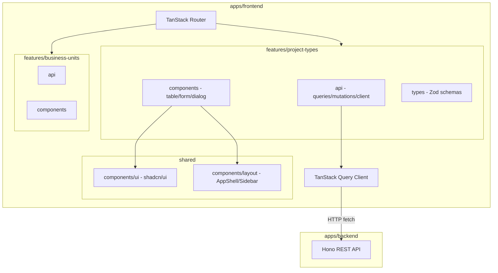
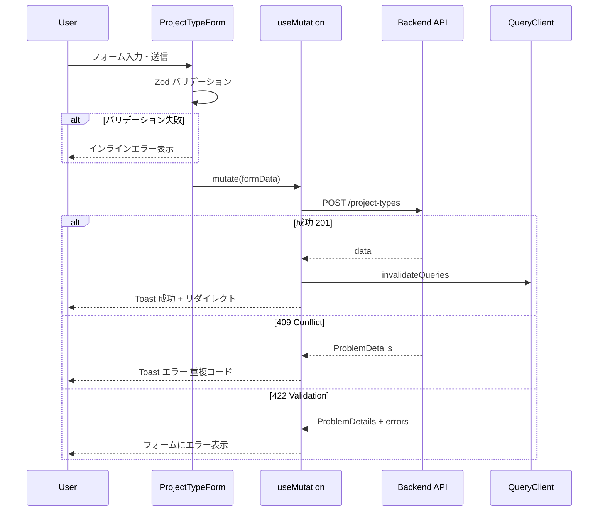
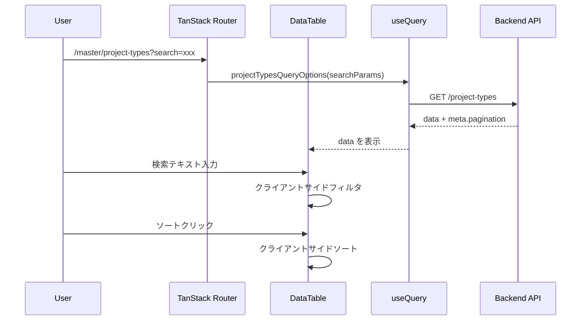

# Design Document

## Overview

**Purpose**: 案件タイプ（`project_types`）マスターデータの管理画面を提供し、管理者が案件種別の一覧閲覧・検索・詳細確認・新規登録・編集・削除・復元を行えるようにする。

**Users**: 事業部リーダー・プロジェクトマネージャーが、案件種別マスターの日常的なメンテナンスに使用する。

**Impact**: 既存のバックエンド CRUD API（`/project-types`）に対するフロントエンド UI を新規構築する。バックエンドの変更は不要。既存の business-units マスタ UI と同一のアーキテクチャ・デザインパターンを踏襲する。

### Goals
- 既存 `project-types` API を呼び出す型安全なフロントエンド管理画面の提供
- business-units マスタ UI と一貫したデザイン・操作体験の実現
- TanStack エコシステム（Router/Query/Table/Form）とプロジェクトルールへの準拠
- feature-first アーキテクチャによる高凝集・低結合なモジュール構成

### Non-Goals
- バックエンド API の変更・拡張
- DataTable 等の共通コンポーネント抽出（将来スコープ）
- 認証・認可の実装
- E2E テストの実装

## Architecture

### Existing Architecture Analysis

- **バックエンド**: Hono v4 による REST API が `apps/backend` に実装済み。`project-types` の 6 エンドポイント（CRUD + 復元）が稼働
- **フロントエンド**: `apps/frontend` は稼働中。`features/business-units/` と `routes/master/business-units/` が同一パターンの参照実装として存在
- **拡張方針**: 既存のフロントエンドプロジェクトに `features/project-types/` と `routes/master/project-types/` を追加。AppShell / Sidebar は既存のものを再利用

### Architecture Pattern & Boundary Map



**Architecture Integration**:
- **Selected pattern**: Feature-first SPA — `features/project-types/` にすべてのドメインロジックを凝集。business-units と同一パターン
- **Domain boundaries**: API 層・表示層・型定義層を feature 内で分離。feature 外への依存は共有 UI コンポーネントとルーティングのみ
- **Existing patterns preserved**: business-units で確立されたパターン（api-client, queries, mutations, DataTable, Form, ConfirmDialog）をそのまま踏襲
- **New components rationale**: project-types 固有の feature モジュールとルートファイルを新規作成。features 間依存禁止の規約に従い、business-units のコンポーネントは参照しない
- **Steering compliance**: feature-first 構成、`@/` エイリアス、TanStack エコシステム統一、Zod 中心の型安全性

### Technology Stack

| Layer | Choice / Version | Role in Feature | Notes |
|-------|------------------|-----------------|-------|
| Routing | `@tanstack/react-router` | ファイルベースルーティング | search params は Zod adapter でバリデーション |
| Data Fetching | `@tanstack/react-query` v5 | API データの取得・キャッシュ・ミューテーション | queryOptions パターン |
| Table | `@tanstack/react-table` v8 | ヘッドレス UI テーブル | ソート・フィルタ |
| Form | `@tanstack/react-form` v1 | フォーム状態管理・バリデーション | Standard Schema 対応 |
| UI Components | shadcn/ui | デザインシステムプリミティブ | 既存テーマ踏襲 |
| Styling | Tailwind CSS v4 | ユーティリティファーストCSS | - |
| Validation | Zod v3 | スキーマ定義・型導出 | - |

## System Flows

### 案件タイプ作成フロー



### 一覧表示・検索フロー



## Requirements Traceability

| Requirement | Summary | Components | Interfaces | Flows |
|-------------|---------|------------|------------|-------|
| 1.1 | 一覧画面で API 呼び出し | ProjectTypeListPage, DataTable | projectTypesQueryOptions | 一覧表示フロー |
| 1.2 | テーブルカラム表示 | columns.tsx | ColumnDef | - |
| 1.3 | ソート機能 | DataTable | SortingState | - |
| 1.4 | ローディング状態 | DataTable | isLoading | - |
| 1.5 | エラー表示 | DataTable | isError | - |
| 2.1 | 検索入力欄 | DataTableToolbar | globalFilter | - |
| 2.2 | クライアントサイドフィルタ | DataTable | filterFn | 一覧表示フロー |
| 2.3 | 削除済みトグル | DataTableToolbar | includeDisabled search param | - |
| 2.4 | 削除済みの視覚的区別 | columns.tsx, StatusBadge | deletedAt | - |
| 3.1 | 詳細画面遷移 | ProjectTypeDetailPage | projectTypeQueryOptions | - |
| 3.2 | 詳細情報表示 | ProjectTypeDetailPage | ProjectType 型 | - |
| 3.3 | 編集・削除ボタン | ProjectTypeDetailPage | Link, Dialog | - |
| 3.4 | 戻るナビゲーション | Breadcrumb | - | - |
| 3.5 | 404 表示 | ProjectTypeDetailPage | notFoundComponent | - |
| 4.1 | 新規登録画面遷移 | ProjectTypeListPage | Link | - |
| 4.2 | 登録フォーム | ProjectTypeForm | createProjectTypeSchema | - |
| 4.3 | リアルタイムバリデーション | ProjectTypeForm | Zod validators | - |
| 4.4 | POST API 呼び出し | useCreateProjectType | createProjectType mutation | 作成フロー |
| 4.5 | 成功時リダイレクト | useCreateProjectType | navigate, toast | 作成フロー |
| 4.6 | 409 エラー表示 | useCreateProjectType | toast | 作成フロー |
| 4.7 | 422 エラー表示 | ProjectTypeForm | form errors | 作成フロー |
| 5.1 | 編集画面遷移 | ProjectTypeEditPage | projectTypeQueryOptions | - |
| 5.2 | コード読み取り専用 | ProjectTypeForm | mode prop | - |
| 5.3 | 編集バリデーション | ProjectTypeForm | updateProjectTypeSchema | - |
| 5.4 | PUT API 呼び出し | useUpdateProjectType | updateProjectType mutation | - |
| 5.5 | 更新成功リダイレクト | useUpdateProjectType | navigate, toast | - |
| 5.6 | 404 エラー | useUpdateProjectType | toast | - |
| 5.7 | 422 エラー | ProjectTypeForm | form errors | - |
| 6.1 | 削除確認ダイアログ | DeleteConfirmDialog | AlertDialog | - |
| 6.2 | DELETE API 呼び出し | useDeleteProjectType | deleteProjectType mutation | - |
| 6.3 | 削除成功リダイレクト | useDeleteProjectType | navigate, toast | - |
| 6.4 | 409 エラー参照制約 | useDeleteProjectType | toast | - |
| 6.5 | 404 エラー | useDeleteProjectType | toast | - |
| 7.1 | 復元ボタン表示 | columns.tsx | deletedAt 条件 | - |
| 7.2 | 復元確認ダイアログ | RestoreConfirmDialog | AlertDialog | - |
| 7.3 | 復元 API 呼び出し | useRestoreProjectType | restoreProjectType mutation | - |
| 7.4 | 復元成功・再取得 | useRestoreProjectType | invalidateQueries, toast | - |
| 7.5 | 復元 409 エラー | useRestoreProjectType | toast | - |
| 8.1 | ファイルベースルーティング | routes/master/project-types/ | Route files | - |
| 8.2 | 検索条件 search params | Route validateSearch | searchSchema | - |
| 9.1-9.4 | ビジュアルデザイン | 全コンポーネント | shadcn/ui + Tailwind | - |
| 10.1-10.5 | インタラクション・フィードバック | Toast, StatusBadge, Transitions | Sonner, CSS | - |
| 11.1-11.4 | feature モジュール構成 | features/project-types/ | index.ts exports | - |

## Components and Interfaces

| Component | Domain/Layer | Intent | Req Coverage | Key Dependencies | Contracts |
|-----------|--------------|--------|--------------|------------------|-----------|
| ProjectTypeListPage | Route/Page | 一覧画面のルートコンポーネント | 1.1-1.5, 2.1-2.4, 4.1 | DataTable (P0), QueryClient (P0) | - |
| ProjectTypeDetailPage | Route/Page | 詳細画面のルートコンポーネント | 3.1-3.5 | QueryClient (P0) | - |
| ProjectTypeNewPage | Route/Page | 新規登録画面のルートコンポーネント | 4.1-4.7 | ProjectTypeForm (P0) | - |
| ProjectTypeEditPage | Route/Page | 編集画面のルートコンポーネント | 5.1-5.7 | ProjectTypeForm (P0), QueryClient (P0) | - |
| DataTable | Feature/UI | TanStack Table ラッパー（ソート・フィルタ） | 1.1-1.5, 2.1-2.2 | @tanstack/react-table (P0), shadcn/ui Table (P0) | State |
| DataTableToolbar | Feature/UI | 検索・フィルタ・新規登録ボタンのツールバー | 2.1-2.4, 4.1 | shadcn/ui Input, Switch (P0) | - |
| columns.tsx | Feature/Config | カラム定義・セルレンダラー | 1.2, 2.4, 7.1 | ColumnDef (P0) | - |
| ProjectTypeForm | Feature/UI | 新規登録・編集共通フォーム | 4.2-4.3, 5.2-5.3 | @tanstack/react-form (P0), Zod (P0) | Service |
| projectTypesApi | Feature/API | API クライアント関数群 | 全 CRUD | fetch (P0) | API |
| projectTypesQueries | Feature/API | queryOptions / mutation 定義 | 1.1, 3.1, 4.4, 5.4, 6.2, 7.3 | @tanstack/react-query (P0) | Service |
| DeleteConfirmDialog | Feature/UI | 削除確認ダイアログ | 6.1-6.2 | shadcn/ui AlertDialog (P0) | - |
| RestoreConfirmDialog | Feature/UI | 復元確認ダイアログ | 7.2-7.3 | shadcn/ui AlertDialog (P0) | - |
| DebouncedSearchInput | Feature/UI | IME 対応デバウンス検索入力 | 2.1-2.2 | - | - |

### Feature/API Layer

#### projectTypesApi (api-client.ts)

| Field | Detail |
|-------|--------|
| Intent | バックエンド API との HTTP 通信を抽象化する薄い fetch ラッパー |
| Requirements | 1.1, 3.1, 4.4, 5.4, 6.2, 7.3 |

**Responsibilities & Constraints**
- 各 API エンドポイントに対応する関数を提供
- レスポンスの JSON パースと型アサーションを一箇所に集約
- エラーレスポンス（RFC 9457 ProblemDetails）のパースと型付きエラーの throw

**Dependencies**
- External: `fetch` API — HTTP 通信 (P0)
- Outbound: Backend API `GET/POST/PUT/DELETE /project-types` (P0)

**Contracts**: API [x]

##### API Contract

| Method | Endpoint | Request | Response | Errors |
|--------|----------|---------|----------|--------|
| GET | /project-types | `ProjectTypeListParams` | `PaginatedResponse<ProjectType>` | 422 |
| GET | /project-types/:code | - | `SingleResponse<ProjectType>` | 404 |
| POST | /project-types | `CreateProjectTypeInput` | `SingleResponse<ProjectType>` | 409, 422 |
| PUT | /project-types/:code | `UpdateProjectTypeInput` | `SingleResponse<ProjectType>` | 404, 422 |
| DELETE | /project-types/:code | - | 204 No Content | 404, 409 |
| POST | /project-types/:code/actions/restore | - | `SingleResponse<ProjectType>` | 404, 409 |

**Implementation Notes**
- API ベース URL は環境変数 `VITE_API_BASE_URL` で設定（既存の business-units と共通）
- レスポンスの `!response.ok` 時に `ProblemDetails` 型のエラーオブジェクトを throw
- `ApiError` クラスは business-units の実装と同一パターン

#### projectTypesQueries (queries.ts / mutations.ts)

| Field | Detail |
|-------|--------|
| Intent | TanStack Query の queryOptions / useMutation を定義し、キャッシュキーと取得ロジックを co-locate |
| Requirements | 1.1, 3.1, 4.4-4.7, 5.4-5.7, 6.2-6.5, 7.3-7.5 |

**Responsibilities & Constraints**
- `queryOptions` パターンで queryKey と queryFn を一体管理
- Mutation の `onSuccess` でキャッシュ無効化（`invalidateQueries`）
- エラーハンドリングは mutation の `onError` で Toast 表示に委譲

**Dependencies**
- Inbound: Route components — クエリ・ミューテーションの使用 (P0)
- Outbound: projectTypesApi — API 通信 (P0)

**Contracts**: Service [x]

##### Service Interface

```typescript
// Query Key Factory
const projectTypeKeys = {
  all: ['project-types'] as const,
  lists: () => [...projectTypeKeys.all, 'list'] as const,
  list: (params: ProjectTypeListParams) => [...projectTypeKeys.lists(), params] as const,
  details: () => [...projectTypeKeys.all, 'detail'] as const,
  detail: (code: string) => [...projectTypeKeys.details(), code] as const,
}

// queries.ts
function projectTypesQueryOptions(params: ProjectTypeListParams): QueryOptions<PaginatedResponse<ProjectType>>
function projectTypeQueryOptions(code: string): QueryOptions<SingleResponse<ProjectType>>

// mutations.ts
function useCreateProjectType(): UseMutationResult<ProjectType, ProblemDetails, CreateProjectTypeInput>
function useUpdateProjectType(code: string): UseMutationResult<ProjectType, ProblemDetails, UpdateProjectTypeInput>
function useDeleteProjectType(): UseMutationResult<void, ProblemDetails, string>
function useRestoreProjectType(): UseMutationResult<ProjectType, ProblemDetails, string>
```

- Preconditions: QueryClient がプロバイダーで提供されていること
- Postconditions: 成功時にキャッシュが無効化され、一覧データが最新になること
- Invariants: queryKey はエンティティ名 `'project-types'` をプレフィクスとして持つ

### Feature/UI Layer

#### DataTable

| Field | Detail |
|-------|--------|
| Intent | TanStack Table のソート・フィルタをラップした汎用テーブルコンポーネント |
| Requirements | 1.1-1.5, 2.1-2.2 |

**Responsibilities & Constraints**
- `useReactTable` でテーブルインスタンスを生成
- ソート状態（`SortingState`）はクライアントサイドで管理
- ページネーション非表示（business-units と同様、マスタデータのレコード数が少ないため）
- ローディング・エラー状態の表示を内包

**Dependencies**
- External: `@tanstack/react-table` v8 (P0)
- External: shadcn/ui `Table`, `TableHeader`, `TableBody`, `TableRow`, `TableCell` (P0)

**Contracts**: State [x]

##### State Management

```typescript
type DataTableState = {
  sorting: SortingState
  globalFilter: string
}
```

- Persistence: 検索条件は URL search params に永続化。ソートはクライアントサイド状態
- Concurrency: シングルユーザー操作のため競合なし

#### ProjectTypeForm

| Field | Detail |
|-------|--------|
| Intent | 新規登録・編集で共有するフォームコンポーネント（TanStack Form + Zod） |
| Requirements | 4.2-4.3, 5.2-5.3 |

**Responsibilities & Constraints**
- `mode: 'create' | 'edit'` プロパティで新規/編集を切り替え
- `edit` モードでは案件タイプコードフィールドを `disabled` にする
- Zod スキーマによるフィールドレベルバリデーション

**Dependencies**
- External: `@tanstack/react-form` v1 (P0)
- External: `zod` (P0)
- Outbound: shadcn/ui `Input`, `Button`, `Label` (P1)

**Contracts**: Service [x]

##### Service Interface

```typescript
type ProjectTypeFormProps = {
  mode: 'create' | 'edit'
  defaultValues?: ProjectTypeFormValues
  onSubmit: (values: ProjectTypeFormValues) => Promise<void>
  isSubmitting: boolean
}

type ProjectTypeFormValues = {
  projectTypeCode: string
  name: string
  displayOrder: number
}
```

- Preconditions: `edit` モード時に `defaultValues` が提供されること
- Postconditions: `onSubmit` が呼ばれた時点でフォーム値は Zod スキーマでバリデーション済み

## Data Models

### Domain Model

案件タイプは単一のエンティティであり、フロントエンドでは API レスポンスの DTO をそのまま使用する。

```typescript
/** API レスポンス型（バックエンドの ProjectType 型と一致） */
type ProjectType = {
  projectTypeCode: string
  name: string
  displayOrder: number
  createdAt: string
  updatedAt: string
  deletedAt?: string | null  // includeDisabled 時のみ含まれる
}
```

### Data Contracts & Integration

**API Data Transfer**

```typescript
/** 一覧取得パラメータ */
type ProjectTypeListParams = {
  includeDisabled: boolean
}

/** ページネーション付きレスポンス */
type PaginatedResponse<T> = {
  data: T[]
  meta: {
    pagination: {
      currentPage: number
      pageSize: number
      totalItems: number
      totalPages: number
    }
  }
}

/** 単一リソースレスポンス */
type SingleResponse<T> = {
  data: T
}

/** 作成リクエスト */
type CreateProjectTypeInput = {
  projectTypeCode: string
  name: string
  displayOrder?: number
}

/** 更新リクエスト */
type UpdateProjectTypeInput = {
  name: string
  displayOrder?: number
}

/** RFC 9457 ProblemDetails エラー */
type ProblemDetails = {
  type: string
  status: number
  title: string
  detail: string
  instance?: string
  errors?: Array<{
    field: string
    message: string
  }>
}
```

**Zod Schemas（フロントエンド用）**

```typescript
const createProjectTypeSchema = z.object({
  projectTypeCode: z.string().min(1).max(20).regex(/^[a-zA-Z0-9_-]+$/),
  name: z.string().min(1).max(100),
  displayOrder: z.number().int().min(0).default(0),
})

const updateProjectTypeSchema = z.object({
  name: z.string().min(1).max(100),
  displayOrder: z.number().int().min(0).optional(),
})

const projectTypeSearchSchema = z.object({
  search: fallback(z.string(), '').default(''),
  includeDisabled: fallback(z.boolean(), false).default(false),
})
```

## Error Handling

### Error Strategy

business-units マスタ UI と同一の 3 層エラー処理パターンを踏襲する:
1. **フォームバリデーション**: Zod スキーマによるクライアントサイドバリデーション → インラインエラー表示
2. **API エラー**: `ProblemDetails` 形式のレスポンスを解析 → Toast 通知またはフォームエラー
3. **予期しないエラー**: Error Boundary でキャッチ → エラー画面表示

### Error Categories and Responses

**User Errors (4xx)**:
- 422 バリデーションエラー → `errors` 配列の各 `field` をフォームフィールドにマッピングしてインライン表示
- 404 Not Found → 「案件タイプが見つかりません」Toast + 一覧画面へリダイレクト
- 409 Conflict（作成時重複）→ 「同一コードの案件タイプが既に存在します」Toast
- 409 Conflict（削除時参照制約）→ 「この案件タイプは他のデータから参照されているため削除できません」Toast

**System Errors (5xx)**:
- ネットワークエラー / 500 → 「サーバーとの通信に失敗しました」Toast（手動閉じ）
- TanStack Query のリトライ（デフォルト 3 回）で自動復旧を試行

## Testing Strategy

### Unit Tests
- Zod スキーマのバリデーション（`createProjectTypeSchema`, `updateProjectTypeSchema`, `projectTypeSearchSchema`）
- API クライアント関数のレスポンスパース・エラーハンドリング
- カラム定義のアクセサ・セルレンダラー

### Integration Tests
- `projectTypesQueryOptions` が正しいキャッシュキーと取得関数を返すこと
- Mutation の `onSuccess` でキャッシュが無効化されること
- フォームの Zod バリデーションが TanStack Form と正しく統合されること

## Optional Sections

### Performance & Scalability

- TanStack Query の `staleTime` 設定で短時間内の同一リクエストを抑制
- TanStack Table のクライアントサイドソート/フィルタにより、ソート/検索時の API コール不要
- TanStack Router の `autoCodeSplitting` によるルート単位のバンドル分割
