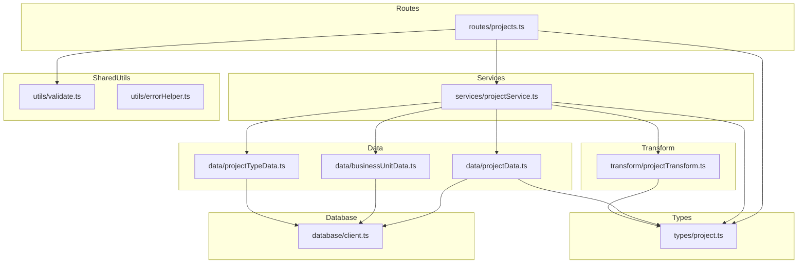

# 設計ドキュメント: Projects CRUD API

## Overview

本フィーチャーは、案件（projects）エンティティに対する CRUD API を提供する。プロジェクトマネージャーが案件の登録・参照・更新・削除を行い、工数管理の基盤データとして活用する。

**ユーザー**: プロジェクトマネージャー、事業部リーダー
**影響**: バックエンドに新規エンドポイント群（`/projects`）を追加。既存マスタ CRUD のアーキテクチャパターンを踏襲しつつ、JOIN による外部キー名称取得・複合フィルタリング・INT IDENTITY 主キーへの対応を行う。

### ゴール
- projects テーブルに対する完全な CRUD API（一覧・単一・作成・更新・論理削除・復元）を実装する
- 外部キー先の名称（`businessUnitName`, `projectTypeName`）を JOIN で取得し、レスポンスに含める
- 既存のマスタ CRUD と一貫したアーキテクチャ・エラーハンドリング・レスポンス形式を維持する

### 非ゴール
- フロントエンド実装（別スペックで対応）
- project_cases / project_load 等の子テーブル CRUD
- 検索・ソート機能の高度化（全文検索等）
- 認証・認可の実装

## Architecture

### 既存アーキテクチャ分析

既存のマスタ CRUD（business_units / project_types / work_types）は以下のレイヤードアーキテクチャを採用しており、本フィーチャーもこのパターンを踏襲する。

- **routes/**: Hono ルートハンドラ。バリデーション + レスポンス返却
- **services/**: ビジネスロジック。HTTPException によるエラー制御
- **data/**: DB アクセス。`mssql` パッケージによるパラメータ付き SQL 実行
- **transform/**: DB 行（snake_case）→ API レスポンス（camelCase）変換
- **types/**: Zod スキーマ + TypeScript 型定義

既存パターンとの主な差異:
- **INT IDENTITY 主キー**: 既存は VARCHAR 自然キー → パスパラメータが数値に変更
- **JOIN が必要**: 既存は単一テーブル SELECT → business_units / project_types との JOIN 追加
- **複合フィルタリング**: 既存は `includeDisabled` のみ → `businessUnitCode`, `status` フィルタ追加
- **外部キー存在チェック**: 既存マスタには不要 → Service 層でクロステーブル検証追加

### Architecture Pattern & Boundary Map



**アーキテクチャ統合**:
- **選択パターン**: レイヤードアーキテクチャ（既存パターン踏襲）
- **ドメイン境界**: projects は独立したエンティティとして 5 ファイルで構成。外部キー検証のみ既存マスタの Data 層メソッドを参照
- **既存パターンの維持**: routes → services → data の依存方向、Zod スキーマ中心の型定義、RFC 9457 エラーハンドリング
- **新規コンポーネントの根拠**: projects は独自の要件（JOIN, フィルタ, INT PK, FK 検証）を持つため、既存マスタファイルの拡張ではなく新規作成が適切

### Technology Stack

| レイヤー | 選択 / バージョン | フィーチャーでの役割 | 備考 |
|---------|-----------------|-------------------|------|
| Backend | Hono v4 | ルーティング・ミドルウェア | 既存と同一 |
| Validation | Zod + @hono/zod-validator | リクエストバリデーション | 既存と同一 |
| Data | mssql | SQL Server 接続・クエリ実行 | JOIN クエリ追加 |
| Test | Vitest | ユニットテスト | 既存と同一 |

新規ライブラリの追加なし。

## Requirements Traceability

| 要件 | 概要 | コンポーネント | インターフェース | フロー |
|------|------|--------------|----------------|-------|
| 1.1 | 一覧取得 200 | routes, services, data | GET /projects | Request → Validate → FindAll → Transform → Response |
| 1.2 | ページネーション | data, types | Query params | Offset 計算 |
| 1.3 | includeDisabled フィルタ | data | Query params | WHERE 条件分岐 |
| 1.4 | デフォルトで有効のみ | data | — | WHERE deleted_at IS NULL |
| 1.5 | JOIN で名称取得 | data, transform, types | — | INNER/LEFT JOIN |
| 1.6 | businessUnitCode フィルタ | data, types | Query params | WHERE 条件追加 |
| 1.7 | status フィルタ | data, types | Query params | WHERE 条件追加 |
| 2.1 | 単一取得 200 | routes, services, data | GET /projects/:id | Request → FindById → Transform → Response |
| 2.2 | JOIN で名称取得 | data, transform | — | 1.5 と同一パターン |
| 2.3 | 404 エラー | services | — | HTTPException |
| 3.1 | 作成 201 | routes, services, data | POST /projects | Request → Validate → Create → Transform → Response |
| 3.2 | Location ヘッダ | routes | — | c.header |
| 3.3 | projectCode 重複 409 | services, data | — | findByProjectCode |
| 3.4 | バリデーション 422 | routes, utils | — | validate middleware |
| 3.5 | 必須フィールド検証 | types | — | Zod schema |
| 3.6 | 任意フィールド | types | — | Zod optional |
| 3.7 | BU 存在チェック | services | — | businessUnitData.findByCode |
| 3.8 | PT 存在チェック | services | — | projectTypeData.findByCode |
| 4.1 | 更新 200 | routes, services, data | PUT /projects/:id | Request → Validate → Update → Transform → Response |
| 4.2 | 404 エラー | services | — | HTTPException |
| 4.3 | バリデーション 422 | routes, utils | — | validate middleware |
| 4.4 | projectCode 重複 409 | services, data | — | findByProjectCode (自身を除外) |
| 4.5 | updated_at 自動更新 | data | — | SQL SET GETDATE() |
| 4.6 | JOIN レスポンス | data, transform | — | 1.5 と同一 |
| 4.7 | BU 存在チェック | services | — | 3.7 と同一 |
| 4.8 | PT 存在チェック | services | — | 3.8 と同一 |
| 5.1 | 論理削除 204 | routes, services, data | DELETE /projects/:id | Request → SoftDelete → 204 |
| 5.2 | deleted_at 設定 | data | — | SQL SET GETDATE() |
| 5.3 | 404 エラー | services | — | HTTPException |
| 5.4 | 参照チェック 409 | services, data | — | hasReferences |
| 6.1 | 復元 200 | routes, services, data | POST /projects/:id/actions/restore | Request → Restore → Transform → Response |
| 6.2 | 404 エラー | services | — | HTTPException |
| 6.3 | 未削除 409 | services | — | HTTPException |
| 6.4 | projectCode 重複 409 | services, data | — | findByProjectCode |
| 7.1–7.10 | バリデーション規約 | types, utils | — | Zod スキーマ定義 |
| 8.1–8.6 | レスポンス形式 | transform, types, routes | — | camelCase 変換 + レスポンス構造 |
| 9.1–9.4 | テスト | __tests__/ | — | Vitest + app.request() |
| 10.1–10.5 | アーキテクチャ | 全層 | — | レイヤード構成 |

## Components and Interfaces

| コンポーネント | レイヤー | 意図 | 要件カバレッジ | 主な依存 | コントラクト |
|-------------|--------|------|-------------|---------|-----------|
| types/project.ts | Types | Zod スキーマ・型定義 | 3.5, 3.6, 7.1–7.10, 8.3–8.6 | pagination.ts (P0) | — |
| data/projectData.ts | Data | DB アクセス・SQL 実行 | 1.1–1.7, 2.1, 3.1, 4.1, 5.1–5.2, 6.1 | database/client.ts (P0), types/project.ts (P0) | Service |
| transform/projectTransform.ts | Transform | DB行 → API レスポンス変換 | 1.5, 2.2, 4.6, 8.3–8.6 | types/project.ts (P0) | — |
| services/projectService.ts | Services | ビジネスロジック・エラー制御 | 2.3, 3.3, 3.7, 3.8, 4.2, 4.4, 4.7, 4.8, 5.3, 5.4, 6.2–6.4 | projectData (P0), businessUnitData (P1), projectTypeData (P1), projectTransform (P0) | Service |
| routes/projects.ts | Routes | エンドポイント定義 | 1.1, 2.1, 3.1–3.2, 4.1, 5.1, 6.1, 8.1 | projectService (P0), validate (P0), types/project.ts (P0) | API |

### Types レイヤー

#### types/project.ts

| フィールド | 詳細 |
|-----------|------|
| 意図 | projects の Zod スキーマ・DB 行型・API レスポンス型を一元定義する |
| 要件 | 3.5, 3.6, 7.1–7.10, 8.3–8.6 |

**責務 & 制約**
- Zod スキーマから TypeScript 型を導出（`z.infer`）
- DB 行型は snake_case、API レスポンス型は camelCase
- JOIN 結果を含む拡張行型を定義

**コントラクト**: Service [x] / State [x]

##### 型定義

```typescript
// 作成用 Zod スキーマ
createProjectSchema: z.ZodObject<{
  projectCode: z.ZodString        // min(1).max(120)
  name: z.ZodString               // min(1).max(120)
  businessUnitCode: z.ZodString   // min(1).max(20).regex(/^[a-zA-Z0-9_-]+$/)
  projectTypeCode: z.ZodOptional<z.ZodString>  // min(1).max(20).regex(/^[a-zA-Z0-9_-]+$/)
  startYearMonth: z.ZodString     // regex(/^\d{6}$/)
  totalManhour: z.ZodNumber       // int().positive()
  status: z.ZodString             // min(1).max(20)
  durationMonths: z.ZodOptional<z.ZodNumber>   // int().positive()
}>

// 更新用 Zod スキーマ
updateProjectSchema: z.ZodObject<{
  projectCode: z.ZodOptional<z.ZodString>
  name: z.ZodOptional<z.ZodString>
  businessUnitCode: z.ZodOptional<z.ZodString>
  projectTypeCode: z.ZodOptional<z.ZodNullable<z.ZodString>>  // null で解除可能
  startYearMonth: z.ZodOptional<z.ZodString>
  totalManhour: z.ZodOptional<z.ZodNumber>
  status: z.ZodOptional<z.ZodString>
  durationMonths: z.ZodOptional<z.ZodNullable<z.ZodNumber>>   // null で解除可能
}>

// 一覧取得クエリスキーマ
projectListQuerySchema: extends paginationQuerySchema with {
  'filter[includeDisabled]': z.ZodDefault<z.ZodBoolean>    // default(false)
  'filter[businessUnitCode]': z.ZodOptional<z.ZodString>
  'filter[status]': z.ZodOptional<z.ZodString>
}

// DB 行型（JOIN 結果を含む）
type ProjectRow = {
  project_id: number
  project_code: string
  name: string
  business_unit_code: string
  business_unit_name: string          // JOIN: business_units.name
  project_type_code: string | null
  project_type_name: string | null    // JOIN: project_types.name
  start_year_month: string
  total_manhour: number
  status: string
  duration_months: number | null
  created_at: Date
  updated_at: Date
  deleted_at: Date | null
}

// API レスポンス型
type Project = {
  projectId: number
  projectCode: string
  name: string
  businessUnitCode: string
  businessUnitName: string
  projectTypeCode: string | null
  projectTypeName: string | null
  startYearMonth: string
  totalManhour: number
  status: string
  durationMonths: number | null
  createdAt: string
  updatedAt: string
}
```

### Data レイヤー

#### data/projectData.ts

| フィールド | 詳細 |
|-----------|------|
| 意図 | projects テーブルへの DB アクセスと SQL 実行を担当する |
| 要件 | 1.1–1.7, 2.1–2.2, 3.1, 3.3, 4.1, 4.4, 5.1–5.2, 5.4, 6.1, 6.4 |

**責務 & 制約**
- パラメータバインディングによる安全な SQL 実行
- JOIN（INNER JOIN business_units + LEFT JOIN project_types）による名称取得
- 動的 WHERE 句の組み立て（フィルタ条件）
- ビジネスロジックを含めない

**依存**
- Inbound: projectService — CRUD 操作の委譲 (P0)
- Outbound: database/client.ts — DB 接続プール取得 (P0)

**コントラクト**: Service [x]

##### Service Interface

```typescript
interface ProjectData {
  findAll(params: {
    page: number
    pageSize: number
    includeDisabled: boolean
    businessUnitCode?: string
    status?: string
  }): Promise<{ items: ProjectRow[]; totalCount: number }>

  findById(id: number): Promise<ProjectRow | undefined>

  findByIdIncludingDeleted(id: number): Promise<ProjectRow | undefined>

  findByProjectCode(code: string): Promise<ProjectRow | undefined>

  create(data: CreateProject): Promise<ProjectRow>

  update(id: number, data: Partial<CreateProject>): Promise<ProjectRow | undefined>

  softDelete(id: number): Promise<ProjectRow | undefined>

  restore(id: number): Promise<ProjectRow | undefined>

  hasReferences(id: number): Promise<boolean>
}
```

- 前提条件: DB 接続プールが初期化済み
- 事後条件: `create` は INSERT された行を OUTPUT で返却。`update` / `softDelete` / `restore` は更新対象がなければ `undefined`
- 不変条件: 全クエリでパラメータバインディングを使用

**実装ノート**
- `findAll` の SQL は `INNER JOIN business_units ON p.business_unit_code = bu.business_unit_code AND bu.deleted_at IS NULL` + `LEFT JOIN project_types ON p.project_type_code = pt.project_type_code AND pt.deleted_at IS NULL`
- `create` の OUTPUT 句では JOIN カラムを取得できないため、INSERT 後に `findById` で完全な行を取得する
- `hasReferences`: `project_cases` テーブル（`deleted_at IS NULL`）の存在チェック
- `findByProjectCode`: `WHERE project_code = @code AND deleted_at IS NULL` で有効な案件のみ検索

### Transform レイヤー

#### transform/projectTransform.ts

| フィールド | 詳細 |
|-----------|------|
| 意図 | DB 行（snake_case + JOIN カラム）を API レスポンス（camelCase）に変換する |
| 要件 | 1.5, 2.2, 4.6, 8.3–8.6 |

**責務 & 制約**
- `ProjectRow` → `Project` の変換
- Date 型 → ISO 8601 文字列の変換
- snake_case → camelCase のマッピング

**コントラクト**: なし（純粋関数）

```typescript
function toProjectResponse(row: ProjectRow): Project
```

### Services レイヤー

#### services/projectService.ts

| フィールド | 詳細 |
|-----------|------|
| 意図 | projects のビジネスロジック・バリデーション・エラー制御を担当する |
| 要件 | 2.3, 3.3, 3.7, 3.8, 4.2, 4.4, 4.7, 4.8, 5.3, 5.4, 6.2–6.4 |

**責務 & 制約**
- 外部キー参照先（business_units, project_types）の存在チェック
- projectCode の一意性検証
- 削除時の参照チェック（project_cases）
- HTTPException によるエラー通知

**依存**
- Inbound: routes/projects.ts — エンドポイントハンドラからの呼び出し (P0)
- Outbound: data/projectData.ts — DB 操作の委譲 (P0)
- Outbound: data/businessUnitData.ts — BU 存在チェック (P1)
- Outbound: data/projectTypeData.ts — PT 存在チェック (P1)
- Outbound: transform/projectTransform.ts — レスポンス変換 (P0)

**コントラクト**: Service [x]

##### Service Interface

```typescript
interface ProjectService {
  findAll(params: {
    page: number
    pageSize: number
    includeDisabled: boolean
    businessUnitCode?: string
    status?: string
  }): Promise<{ items: Project[]; totalCount: number }>

  findById(id: number): Promise<Project>
  // throws HTTPException(404) if not found

  create(data: CreateProject): Promise<Project>
  // throws HTTPException(409) if projectCode duplicated
  // throws HTTPException(422) if businessUnitCode or projectTypeCode not found

  update(id: number, data: UpdateProject): Promise<Project>
  // throws HTTPException(404) if not found
  // throws HTTPException(409) if projectCode duplicated (excluding self)
  // throws HTTPException(422) if businessUnitCode or projectTypeCode not found

  delete(id: number): Promise<void>
  // throws HTTPException(404) if not found
  // throws HTTPException(409) if referenced by project_cases

  restore(id: number): Promise<Project>
  // throws HTTPException(404) if not found
  // throws HTTPException(409) if not soft-deleted
  // throws HTTPException(409) if projectCode conflicts on restore
}
```

- 前提条件: 呼び出し元がバリデーション済みデータを渡す
- 事後条件: 成功時は変換済みレスポンスを返却。失敗時は HTTPException を throw
- 不変条件: `projectCode` の一意性（`deleted_at IS NULL` の範囲）

**実装ノート**
- `create` / `update` で `businessUnitCode` が指定された場合、`businessUnitData.findByCode` で存在チェック。存在しなければ 422
- `create` / `update` で `projectTypeCode` が指定された場合、同様に `projectTypeData` の findByCode で存在チェック
- `update` の projectCode 重複チェックでは、自身の `project_id` を除外する必要がある

### Routes レイヤー

#### routes/projects.ts

| フィールド | 詳細 |
|-----------|------|
| 意図 | /projects エンドポイントのルート定義・バリデーション・レスポンス返却 |
| 要件 | 1.1, 2.1, 3.1–3.2, 4.1, 5.1, 6.1, 8.1 |

**責務 & 制約**
- Zod バリデーションミドルウェアの適用
- Service 層への委譲
- レスポンス構造（`{ data }`, `{ data, meta }`) の組み立て
- ビジネスロジックを含めない

**依存**
- Outbound: services/projectService.ts — ビジネスロジック委譲 (P0)
- Outbound: utils/validate.ts — バリデーションミドルウェア (P0)
- Outbound: types/project.ts — スキーマ参照 (P0)

**コントラクト**: API [x]

##### API Contract

| Method | Endpoint | Request | Response | Errors |
|--------|----------|---------|----------|--------|
| GET | /projects | Query: projectListQuerySchema | `{ data: Project[], meta: { pagination } }` 200 | 422 |
| GET | /projects/:id | Param: id (number) | `{ data: Project }` 200 | 404 |
| POST | /projects | Body: createProjectSchema | `{ data: Project }` 201 + Location | 409, 422 |
| PUT | /projects/:id | Param: id + Body: updateProjectSchema | `{ data: Project }` 200 | 404, 409, 422 |
| DELETE | /projects/:id | Param: id (number) | 204 No Content | 404, 409 |
| POST | /projects/:id/actions/restore | Param: id (number) | `{ data: Project }` 200 | 404, 409 |

**実装ノート**
- メソッドチェーンで定義し `ProjectsRoute` 型をエクスポート（RPC 対応）
- `src/index.ts` に `app.route('/projects', projects)` を追加

## Data Models

### Domain Model

projects エンティティは以下のドメイン境界を持つ:
- **集約ルート**: `Project`（project_id が識別子）
- **値オブジェクト**: `ProjectCode`（ユニーク制約）, `YearMonth`（YYYYMM 形式）
- **参照**: `BusinessUnit`（必須）, `ProjectType`（任意）
- **ビジネスルール**: projectCode は有効な案件の範囲でユニーク。削除時は子テーブル参照がないこと

### Physical Data Model

テーブル定義は `docs/database/table-spec.md` の projects セクションに従う。本設計で追加・変更するスキーマはない。

**主要カラム**:

| カラム | 型 | NULL | 説明 |
|-------|-----|------|------|
| project_id | INT IDENTITY(1,1) | NO | 主キー |
| project_code | NVARCHAR(120) | NO | ユニーク（deleted_at IS NULL） |
| name | NVARCHAR(120) | NO | 案件名 |
| business_unit_code | VARCHAR(20) | NO | FK → business_units |
| project_type_code | VARCHAR(20) | YES | FK → project_types |
| start_year_month | CHAR(6) | NO | YYYYMM 形式 |
| total_manhour | INT | NO | 総工数（人時） |
| status | VARCHAR(20) | NO | ステータス |
| duration_months | INT | YES | 期間（月数） |
| created_at | DATETIME2 | NO | 作成日時 |
| updated_at | DATETIME2 | NO | 更新日時 |
| deleted_at | DATETIME2 | YES | 論理削除日時 |

### Data Contracts & Integration

**API データ転送**

リクエスト・レスポンスのスキーマは types/project.ts の Zod スキーマで定義。シリアライゼーション形式は JSON。

レスポンスの `projectTypeName` / `projectTypeCode` は NULL 許容（project_type_code が NULL の場合、両フィールドとも null）。

## Error Handling

### エラー戦略

既存のグローバルエラーハンドラ（`index.ts` の `app.onError`）が HTTPException をキャッチし、RFC 9457 Problem Details 形式に変換する。本フィーチャーでは Service 層で HTTPException を throw し、このグローバルハンドラに委譲する。

### エラーカテゴリとレスポンス

| ステータス | トリガー | Problem Type | 詳細 |
|----------|---------|-------------|------|
| 404 | ID に該当する有効な案件なし | resource-not-found | `Project with ID '{id}' not found` |
| 409 | projectCode 重複 | conflict | `Project with code '{code}' already exists` |
| 409 | 参照あり削除 | conflict | `Project with ID '{id}' is referenced by other resources and cannot be deleted` |
| 409 | 未削除の復元 | conflict | `Project with ID '{id}' is not soft-deleted` |
| 409 | 復元時 projectCode 重複 | conflict | `Project with code '{code}' conflicts with an existing active project` |
| 422 | バリデーションエラー | validation-error | errors 配列にフィールド詳細を含む |
| 422 | BU 存在しない | validation-error | `Business unit with code '{code}' not found` |
| 422 | PT 存在しない | validation-error | `Project type with code '{code}' not found` |

## Testing Strategy

### ユニットテスト

| テストファイル | 対象 | テスト内容 |
|-------------|------|-----------|
| `__tests__/types/project.test.ts` | Zod スキーマ | 各フィールドの正常値・境界値・無効値のバリデーション |
| `__tests__/transform/projectTransform.test.ts` | Transform 関数 | snake_case → camelCase 変換、Date → ISO 文字列、null フィールドの処理 |
| `__tests__/services/projectService.test.ts` | Service 層 | 正常系 CRUD + 404/409/422 エラーケース。Data 層をモック |
| `__tests__/routes/projects.test.ts` | Route 層 | `app.request()` による HTTP レベルテスト。Service 層をモック |

### テスト方針
- 既存テストパターン（businessUnit テスト群）を踏襲
- Service テストでは Data 層をモックし、ビジネスロジックの分岐を網羅
- Route テストでは Service 層をモックし、レスポンス構造・ステータスコード・ヘッダを検証
