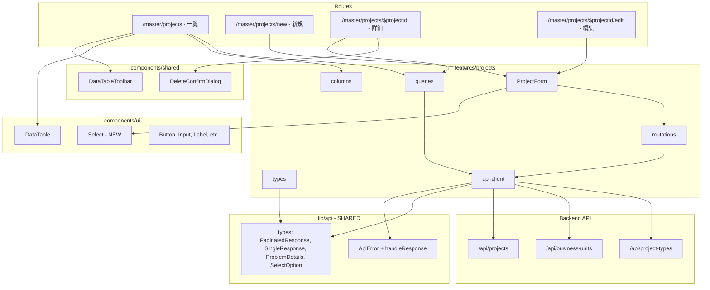
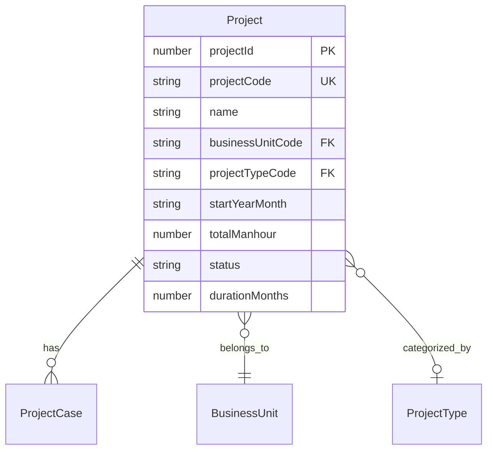

# Design Document

## Overview

**Purpose**: 案件（Projects）マスター管理画面を提供し、PM・事業部リーダーが案件データの CRUD 操作を行えるようにする。

**Users**: PM・事業部リーダーが案件の登録・編集・検索・削除・復元のワークフローで利用する。

**Impact**: 既存のフロントエンドに `features/projects/` と `/master/projects` ルートを追加。`DataTableToolbar` と `DeleteConfirmDialog` を共通化し、既存の business-units 管理画面にも適用する。また、API 共通型（`PaginatedResponse`, `SingleResponse`, `ProblemDetails`）と共通ユーティリティ（`ApiError`, `handleResponse`）を `lib/api/` に抽出し、features 間の型重複を解消する。

### Goals
- 既存の事業部マスター管理画面と統一されたUXで案件CRUDを提供する
- 外部キー参照（事業部・プロジェクト種別）を名前表示・ドロップダウン選択で直感的に操作可能にする
- DataTableToolbar と DeleteConfirmDialog を共通コンポーネント化し再利用性を高める
- API 共通型・ユーティリティを `lib/api/` に抽出し、features 間の型重複を排除する
- shadcn/ui Select コンポーネントを導入しUI基盤を拡充する

### Non-Goals
- バックエンド API の変更（実装済み API をそのまま利用）
- 案件に紐づく子エンティティ（project_cases, project_load 等）の管理画面
- バルク操作（一括作成・一括削除）
- 高度なフィルタリング（事業部別・ステータス別のフィルタドロップダウン）

## Architecture

### Existing Architecture Analysis

既存の business-units マスター管理画面が確立したパターン:
- **Feature-first 構成**: `features/[entity]/` に types, api, components を凝集
- **レイヤー分離**: routes（画面） → features（ロジック・UI） → components/ui（プリミティブ）
- **TanStack エコシステム**: Router（ファイルベースルーティング + Search Params）→ Query（データフェッチ + キャッシュ）→ Table（一覧表示）→ Form（入力フォーム）
- **API クライアントパターン**: `ApiError` クラス + `handleResponse<T>` ユーティリティ + RFC 9457 Problem Details

### Architecture Pattern & Boundary Map



**Architecture Integration**:
- Selected pattern: Feature-first + 共通レイヤー抽出（既存パターンの自然な拡張）
- Domain boundaries: `features/projects/` が案件ドメインを所有、`lib/api/` が API 通信の共通基盤を所有、`components/shared/` がドメイン横断UIを所有
- Existing patterns preserved: Query Key Factory、TanStack Form + Zod バリデーション
- Shared layer rationale: `ApiError`/`handleResponse`/`PaginatedResponse`/`SingleResponse`/`ProblemDetails` は全 feature 共通。`lib/api/` に集約し features 間の型重複を排除
- New components rationale: Select（FK ドロップダウン基盤）、共通 DataTableToolbar（コード重複排除）
- Steering compliance: features 間依存禁止（共有レイヤーへの依存は許容）、@エイリアスインポート、camelCase 命名

### Technology Stack

| Layer | Choice / Version | Role in Feature | Notes |
|-------|------------------|-----------------|-------|
| UI Framework | React 19 + TanStack Router | ルーティング・画面コンポーネント | 既存踏襲 |
| State / Cache | TanStack Query v5 | サーバー状態管理・キャッシュ | 既存踏襲 |
| Table | TanStack Table v8 | 一覧テーブル・ソート・フィルタ | 既存踏襲 |
| Form | TanStack Form v1 | フォームバリデーション・状態管理 | 既存踏襲 |
| Validation | Zod v3 | クライアントバリデーション | 既存踏襲 |
| UI Primitives | shadcn/ui + Radix UI | Select, AlertDialog, Badge 等 | **Select 新規追加** |
| Notification | sonner | トースト通知 | 既存踏襲 |
| Styling | Tailwind CSS v4 | ユーティリティ CSS | 既存踏襲 |

> `@radix-ui/react-select` を新規依存として追加。詳細は `research.md` 参照。

## Requirements Traceability

| Requirement | Summary | Components | Interfaces |
|-------------|---------|------------|------------|
| 1.1 | 一覧テーブル表示 | DataTable, columns, ListPage | projectsQueryOptions |
| 1.2 | カラム定義（FK名前表示含む） | columns | Project 型 |
| 1.3 | FK名前表示 | columns | Project.businessUnitName, Project.projectTypeName |
| 1.4 | null値ハイフン表示 | columns | — |
| 1.5 | ソート機能 | DataTable, columns | — |
| 1.6 | 行クリック遷移 | columns | Router Link |
| 2.1 | デバウンス検索 | DataTableToolbar, DebouncedSearchInput | — |
| 2.2 | 検索フィルタリング | ListPage | projectSearchSchema |
| 2.3 | 削除済みトグル | DataTableToolbar | — |
| 2.4 | 削除済み行スタイル | ListPage | rowClassName |
| 2.5 | Search Params 管理 | ListPage | projectSearchSchema |
| 3.1 | 詳細表示 | DetailPage | projectQueryOptions |
| 3.2 | 詳細のFK名前表示 | DetailPage | Project 型 |
| 3.3 | 編集・削除ボタン | DetailPage | — |
| 3.4 | 削除確認ダイアログ | DeleteConfirmDialog | — |
| 3.5 | ソフトデリート実行 | DetailPage | useDeleteProject |
| 3.6 | 409参照エラー通知 | DetailPage | ApiError |
| 4.1 | 作成フォーム表示 | NewPage, ProjectForm | — |
| 4.2 | 入力フィールド定義 | ProjectForm | createProjectSchema |
| 4.3 | 事業部ドロップダウン | ProjectForm, Select | businessUnitsForSelectQueryOptions |
| 4.4 | 種別ドロップダウン | ProjectForm, Select | projectTypesForSelectQueryOptions |
| 4.5 | Zodバリデーション | ProjectForm | createProjectSchema |
| 4.6 | 作成API呼び出し | NewPage | useCreateProject |
| 4.7 | 409重複エラー | NewPage | ApiError |
| 4.8 | 422バリデーションエラー | NewPage | ApiError |
| 5.1 | 編集フォーム表示 | EditPage, ProjectForm | projectQueryOptions |
| 5.2 | コード編集不可 | ProjectForm | mode='edit' |
| 5.3 | FK初期値設定 | ProjectForm | Project.businessUnitCode, Project.projectTypeCode |
| 5.4 | 更新API呼び出し | EditPage | useUpdateProject |
| 5.5 | 404エラー表示 | EditPage | ApiError |
| 5.6 | 409重複エラー | EditPage | ApiError |
| 6.1 | 復元ボタン表示 | columns, ListPage | — |
| 6.2 | 復元確認ダイアログ | RestoreConfirmDialog | — |
| 6.3 | 復元API呼び出し | ListPage | useRestoreProject |
| 6.4 | 復元409エラー | ListPage | ApiError |
| 7.1 | パンくずリスト | DetailPage, EditPage, NewPage | — |
| 7.2 | 新規作成ボタン | DataTableToolbar | newItemHref prop |
| 7.3 | ルートパス定義 | Routes | — |
| 8.1 | 事業部アクティブのみ | businessUnitsForSelectQueryOptions | — |
| 8.2 | 種別アクティブのみ | projectTypesForSelectQueryOptions | — |
| 8.3 | ローディング状態 | ProjectForm | isLoading state |
| 8.4 | エラー状態 | ProjectForm | isError state |
| 8.5 | 名前ラベル・コード値 | Select options | — |

## Components and Interfaces

| Component | Domain/Layer | Intent | Req Coverage | Key Dependencies | Contracts |
|-----------|-------------|--------|--------------|-----------------|-----------|
| lib/api/types.ts | lib/api (shared) | API共通型定義 | 全CRUD | — | State |
| lib/api/client.ts | lib/api (shared) | API共通ユーティリティ | 全CRUD | fetch (P0) | Service |
| types/index.ts | projects/types | 案件固有の型・スキーマ | 1.2, 2.2, 2.5, 4.2, 4.5 | Zod (P0), lib/api (P0) | — |
| api-client.ts | projects/api | API通信 | 全CRUD | lib/api (P0) | API |
| queries.ts | projects/api | クエリオプション | 1.1, 3.1, 5.1, 8.1, 8.2 | TanStack Query (P0) | — |
| mutations.ts | projects/api | ミューテーション | 4.6, 5.4, 3.5, 6.3 | TanStack Query (P0) | — |
| columns.tsx | projects/components | カラム定義 | 1.2-1.6, 6.1 | TanStack Table (P0) | — |
| ProjectForm.tsx | projects/components | 作成・編集フォーム | 4.1-4.5, 5.1-5.3, 8.1-8.5 | TanStack Form (P0), Select (P0) | State |
| Select | ui | ドロップダウンUI | 4.3, 4.4, 8.5 | Radix Select (P0) | — |
| DataTableToolbar | shared | ツールバー共通 | 2.1, 2.3, 7.2 | DebouncedSearchInput (P1) | — |
| DeleteConfirmDialog | shared | 削除確認共通 | 3.4 | AlertDialog (P0) | — |

### Shared API Layer (lib/api/) — NEW

#### lib/api/types.ts

| Field | Detail |
|-------|--------|
| Intent | 全 feature 共通の API レスポンス型・エラー型を一元管理 |
| Requirements | 全 CRUD（横断） |

**Responsibilities & Constraints**
- features 間で重複していた共通型を単一の場所に集約
- 各 feature の types は本モジュールから import して利用

**Contracts**: State [x]

```typescript
type PaginatedResponse<T> = {
  data: T[]
  meta: {
    pagination: {
      currentPage: number
      pageSize: number
      totalItems: number
      totalPages: number
    }
  }
}

type SingleResponse<T> = { data: T }

type ProblemDetails = {
  type: string
  status: number
  title: string
  detail: string
  instance?: string
  errors?: Array<{ field: string; message: string }>
}

type SelectOption = { value: string; label: string }
```

#### lib/api/client.ts

| Field | Detail |
|-------|--------|
| Intent | API 共通のエラークラスとレスポンスハンドリングユーティリティ |
| Requirements | 全 CRUD（横断） |

**Responsibilities & Constraints**
- `ApiError` クラスと `handleResponse<T>` を提供
- `API_BASE_URL` の解決も本モジュールが担当

**Contracts**: Service [x]

```typescript
const API_BASE_URL: string  // import.meta.env.VITE_API_BASE_URL ?? '/api'

class ApiError extends Error {
  readonly problemDetails: ProblemDetails
  constructor(problemDetails: ProblemDetails)
}

function handleResponse<T>(response: Response): Promise<T>
```

**Implementation Notes**
- 既存の `features/business-units/api/api-client.ts` から `ApiError`, `handleResponse`, `API_BASE_URL` を抽出
- business-units の api-client.ts は本モジュールから import するよう移行

### UI Primitives Layer

#### Select (components/ui/select.tsx) — NEW

| Field | Detail |
|-------|--------|
| Intent | shadcn/ui 準拠の汎用ドロップダウン選択コンポーネント |
| Requirements | 4.3, 4.4, 8.5 |

**Responsibilities & Constraints**
- Radix UI Select プリミティブのスタイル付きラッパー
- shadcn/ui の既存パターン（forwardRef, cn ユーティリティ）に準拠
- アクセシビリティ（キーボード操作、ARIA属性）は Radix が担保

**Dependencies**
- External: `@radix-ui/react-select` — Select プリミティブ (P0)

**Contracts**: State [ ]

エクスポートするサブコンポーネント:

```typescript
// shadcn/ui 標準パターンに従う
export { Select, SelectGroup, SelectValue, SelectTrigger, SelectContent, SelectLabel, SelectItem, SelectSeparator, SelectScrollUpButton, SelectScrollDownButton }
```

### Shared Components Layer

#### DataTableToolbar (components/shared/DataTableToolbar.tsx) — REFACTORED

| Field | Detail |
|-------|--------|
| Intent | 検索・フィルタ・新規作成ボタンを含む汎用テーブルツールバー |
| Requirements | 2.1, 2.3, 7.2 |

**Responsibilities & Constraints**
- 検索入力（DebouncedSearchInput）、削除済みトグル、新規作成ボタンのレイアウト
- エンティティ固有の文言・リンク先を props で受け取る

**Dependencies**
- Inbound: ListPage (business-units, projects) — ツールバー利用 (P0)
- Outbound: DebouncedSearchInput — 検索入力 (P1)

**Contracts**: Service [x]

```typescript
interface DataTableToolbarProps {
  search: string
  onSearchChange: (value: string) => void
  includeDisabled: boolean
  onIncludeDisabledChange: (value: boolean) => void
  newItemHref: string
  searchPlaceholder?: string  // default: "コードまたは名称で検索..."
}
```

**Implementation Notes**
- 既存 `features/business-units/components/DataTableToolbar.tsx` からの移行
- business-units 側は共通版を import するよう変更

#### DeleteConfirmDialog (components/shared/DeleteConfirmDialog.tsx) — REFACTORED

| Field | Detail |
|-------|--------|
| Intent | エンティティ削除の汎用確認ダイアログ |
| Requirements | 3.4 |

**Responsibilities & Constraints**
- エンティティ種別名と対象名を props で受け取り、確認メッセージを構成

**Contracts**: Service [x]

```typescript
interface DeleteConfirmDialogProps {
  open: boolean
  onOpenChange: (open: boolean) => void
  onConfirm: () => void
  entityLabel: string       // 例: "案件", "ビジネスユニット"
  entityName: string        // 例: "プロジェクトA"
  isDeleting: boolean
}
```

### Projects Feature Layer

#### types/index.ts

| Field | Detail |
|-------|--------|
| Intent | 案件固有の型・Zodスキーマ・検索パラメータ定義 |
| Requirements | 1.2, 2.2, 2.5, 4.2, 4.5 |

**Dependencies**
- Outbound: `@/lib/api` — 共通型（PaginatedResponse, SingleResponse, ProblemDetails, SelectOption）の import (P0)

**Contracts**: State [x]

```typescript
// 共通型は lib/api から re-export
export type { PaginatedResponse, SingleResponse, ProblemDetails, SelectOption } from '@/lib/api'

// 案件固有の API レスポンス型
type Project = {
  projectId: number
  projectCode: string
  name: string
  businessUnitCode: string
  businessUnitName: string
  projectTypeCode: string | null
  projectTypeName: string | null
  startYearMonth: string
  totalManhour: number
  status: string
  durationMonths: number | null
  createdAt: string
  updatedAt: string
  deletedAt?: string | null
}

// ステータス定数
const PROJECT_STATUSES: ReadonlyArray<{ value: string; label: string }>

// Zod スキーマ
const createProjectSchema: ZodObject  // projectCode, name, businessUnitCode, projectTypeCode?, startYearMonth, totalManhour, status, durationMonths?
const updateProjectSchema: ZodObject  // 全フィールド optional（少なくとも1つ必須）
const projectSearchSchema: ZodObject  // page, pageSize, search, includeDisabled

// 入力型
type CreateProjectInput = z.infer<typeof createProjectSchema>
type UpdateProjectInput = z.infer<typeof updateProjectSchema>
type ProjectSearchParams = z.infer<typeof projectSearchSchema>

// API パラメータ型
type ProjectListParams = { page: number; pageSize: number; includeDisabled: boolean }
```

#### api-client.ts

| Field | Detail |
|-------|--------|
| Intent | Projects/BusinessUnits/ProjectTypes API との HTTP 通信 |
| Requirements | 全 CRUD + FK 選択肢取得 |

**Dependencies**
- External: `/api/projects`, `/api/business-units`, `/api/project-types` — Backend API (P0)

**Contracts**: API [x]

| Method | Endpoint | Request | Response | Errors |
|--------|----------|---------|----------|--------|
| GET | /api/projects | ProjectListParams (query) | PaginatedResponse\<Project\> | — |
| GET | /api/projects/:id | id (path) | SingleResponse\<Project\> | 404 |
| POST | /api/projects | CreateProjectInput (body) | SingleResponse\<Project\> | 409, 422 |
| PUT | /api/projects/:id | UpdateProjectInput (body) | SingleResponse\<Project\> | 404, 409, 422 |
| DELETE | /api/projects/:id | id (path) | void (204) | 404, 409 |
| POST | /api/projects/:id/actions/restore | id (path) | SingleResponse\<Project\> | 404, 409 |
| GET | /api/business-units | page, pageSize (query) | PaginatedResponse\<BusinessUnit\> | — |
| GET | /api/project-types | page, pageSize (query) | PaginatedResponse\<ProjectType\> | — |

**Dependencies**
- Outbound: `@/lib/api` — `ApiError`, `handleResponse`, `API_BASE_URL` の import (P0)

**Implementation Notes**
- `ApiError` と `handleResponse<T>` は `@/lib/api/client` から import（共有レイヤーを利用）
- Projects API は数値 ID（`/projects/${id}`）、BusinessUnits/ProjectTypes API は文字列コードでアクセス
- FK 選択肢取得: `includeDisabled=false` 固定、全件取得（`pageSize=1000` 等の十分大きい値）。前提: FK マスターデータは数百件以下を想定。超過時は検索可能なコンボボックスへの移行を検討

#### queries.ts

| Field | Detail |
|-------|--------|
| Intent | TanStack Query オプション定義（Query Key Factory） |
| Requirements | 1.1, 3.1, 5.1, 8.1, 8.2 |

**Contracts**: Service [x]

```typescript
// Query Key Factory
const projectKeys = {
  all: ['projects'] as const
  lists: () => [...projectKeys.all, 'list'] as const
  list: (params: ProjectListParams) => [...projectKeys.lists(), params] as const
  details: () => [...projectKeys.all, 'detail'] as const
  detail: (id: number) => [...projectKeys.details(), id] as const
}

// Query Options
function projectsQueryOptions(params: ProjectListParams): QueryOptions<PaginatedResponse<Project>>
function projectQueryOptions(id: number): QueryOptions<SingleResponse<Project>>

// FK 選択肢用 Query Options
function businessUnitsForSelectQueryOptions(): QueryOptions<SelectOption[]>
function projectTypesForSelectQueryOptions(): QueryOptions<SelectOption[]>
```

**Implementation Notes**
- FK 選択肢クエリは `select` オプションで `PaginatedResponse` → `SelectOption[]` に変換
- staleTime を長めに設定（マスターデータは頻繁に変更されないため）

#### mutations.ts

| Field | Detail |
|-------|--------|
| Intent | CRUD ミューテーションフック |
| Requirements | 4.6, 5.4, 3.5, 6.3 |

**Contracts**: Service [x]

```typescript
// ApiError は @/lib/api から import
function useCreateProject(): UseMutationResult<SingleResponse<Project>, ApiError, CreateProjectInput>
function useUpdateProject(id: number): UseMutationResult<SingleResponse<Project>, ApiError, UpdateProjectInput>
function useDeleteProject(): UseMutationResult<void, ApiError, number>
function useRestoreProject(): UseMutationResult<SingleResponse<Project>, ApiError, number>
```

- 全ミューテーション: `onSuccess` で `projectKeys.lists()` を invalidate
- `useUpdateProject`: 追加で `projectKeys.detail(id)` も invalidate

#### columns.tsx

| Field | Detail |
|-------|--------|
| Intent | TanStack Table カラム定義 |
| Requirements | 1.2-1.6, 6.1 |

**Responsibilities & Constraints**
- FK フィールド（事業部名・種別名）は `businessUnitName` / `projectTypeName` をアクセサとして使用
- `projectTypeName` が null の場合は `"—"` を表示
- コードカラムは Link で詳細ページへ遷移
- 削除済み行に「復元」ボタンを条件表示

**Contracts**: Service [x]

```typescript
function createColumns(options: {
  onRestore?: (id: number) => void
  onRowClick: (id: number) => void
}): ColumnDef<Project>[]
```

カラム構成:
1. `projectCode` — ソート可、Link で詳細遷移
2. `name` — ソート可
3. `businessUnitName` — ソート可
4. `projectTypeName` — ソート可、null → "—"
5. `startYearMonth` — ソート可、YYYY/MM 表示
6. `totalManhour` — ソート可、数値表示
7. `status` — Badge 表示（計画/確定）
8. `createdAt` — ソート可、日時フォーマット
9. `updatedAt` — ソート可、日時フォーマット
10. `actions` — 復元ボタン（条件付き）

#### ProjectForm.tsx

| Field | Detail |
|-------|--------|
| Intent | 案件の作成・編集共通フォーム |
| Requirements | 4.1-4.5, 5.1-5.3, 8.1-8.5 |

**Dependencies**
- Outbound: Select (components/ui) — FK ドロップダウン (P0)
- Outbound: businessUnitsForSelectQueryOptions, projectTypesForSelectQueryOptions — FK データ (P0)

**Contracts**: State [x]

```typescript
type ProjectFormValues = {
  projectCode: string
  name: string
  businessUnitCode: string
  projectTypeCode: string      // 空文字 = 未選択
  startYearMonth: string
  totalManhour: number
  status: string
  durationMonths: number | null
}

interface ProjectFormProps {
  mode: 'create' | 'edit'
  defaultValues?: ProjectFormValues
  onSubmit: (values: ProjectFormValues) => Promise<void>
  isSubmitting: boolean
}
```

**Implementation Notes**
- フォーム内で `useQuery(businessUnitsForSelectQueryOptions())` と `useQuery(projectTypesForSelectQueryOptions())` を呼び出し、Select の選択肢を動的取得
- `projectTypeCode` は空文字で送信時に `undefined` に変換（optional フィールド）
- `durationMonths` も空値で送信時に `null` に変換
- status は `PROJECT_STATUSES` 定数から Select で選択
- mode='edit' 時は `projectCode` フィールドを disabled

### Routes Layer

各ルートコンポーネントは100行前後でレイアウトを記述し、ロジックは features 層に委譲する。

#### ListPage (routes/master/projects/index.tsx)

| Field | Detail |
|-------|--------|
| Intent | 案件一覧画面 |
| Requirements | 1.1-1.6, 2.1-2.5, 6.1-6.4 |

- `validateSearch: projectSearchSchema` で URL パラメータをバリデーション
- DataTableToolbar に `newItemHref="/master/projects/new"` を渡す
- DataTable に columns, data, pagination, rowClassName を渡す
- 復元処理: RestoreConfirmDialog を使用（business-units の RestoreConfirmDialog を同パターンで実装）

#### NewPage (routes/master/projects/new.tsx)

| Field | Detail |
|-------|--------|
| Intent | 案件新規作成画面 |
| Requirements | 4.1-4.8, 7.1 |

- パンくず: 一覧 → 新規登録
- ProjectForm に mode="create" を渡す
- onSubmit: `useCreateProject` → 成功時に一覧へ遷移 + toast
- エラー処理: 409 → 重複メッセージ、422 → バリデーションエラー

#### DetailPage (routes/master/projects/$projectId/index.tsx)

| Field | Detail |
|-------|--------|
| Intent | 案件詳細画面 |
| Requirements | 3.1-3.6, 7.1 |

- パンくず: 一覧 → 案件名
- `useQuery(projectQueryOptions(Number(projectId)))` でデータ取得
- DetailRow でフィールド表示（FK は名前表示）
- 編集・削除ボタン配置
- DeleteConfirmDialog に `entityLabel="案件"` を渡す

#### EditPage (routes/master/projects/$projectId/edit.tsx)

| Field | Detail |
|-------|--------|
| Intent | 案件編集画面 |
| Requirements | 5.1-5.6, 7.1 |

- パンくず: 一覧 → 案件名 → 編集
- 既存データをプリフィルして ProjectForm に渡す
- onSubmit: `useUpdateProject(id)` → 成功時に詳細へ遷移 + toast
- エラー処理: 404, 409, 422

### Infrastructure Layer

#### AppShell メニュー追加

| Field | Detail |
|-------|--------|
| Intent | サイドバーに案件メニューを追加 |
| Requirements | 7.3 |

`menuItems` 配列に追加:

```typescript
{
  label: '案件',
  href: '/master/projects',
  icon: FolderKanban,  // lucide-react
}
```

## Data Models

### Domain Model

本機能はフロントエンド専用のため、DB スキーマの変更は不要。バックエンド API が返す `Project` 型をドメインモデルとして利用する。



### Data Contracts & Integration

**API Data Transfer**
- リクエスト/レスポンスは camelCase（バックエンド Transform 層が snake_case ↔ camelCase を変換）
- FK 選択肢は一覧 API のレスポンスから `{ value: code, label: name }` に変換
- 日時は ISO 8601 文字列、フロントエンドで `toLocaleString('ja-JP')` フォーマット

## Error Handling

### Error Categories and Responses

**User Errors (4xx)**:
- 404: 「案件が見つかりません」→ 一覧へのリンク表示
- 409 (重複): 「この案件コードは既に使用されています」→ フォームエラー表示
- 409 (参照制約): 「この案件は他のデータから参照されているため削除できません」→ toast.error (duration: Infinity)
- 409 (復元重複): 「同じ案件コードが既に存在するため復元できません」→ toast.error
- 422: サーバーバリデーションエラー → フィールド別エラー or toast

**Error Handling Pattern**:
- `ApiError` インスタンスの `problemDetails.status` で分岐
- 重要エラーは `toast.error(..., { duration: Infinity })` で永続表示
- フォーム送信エラーはダイアログを閉じてから通知

## Testing Strategy

### Unit Tests
- `createProjectSchema` / `updateProjectSchema` のバリデーション（境界値、必須フィールド、YYYYMM形式）
- `projectSearchSchema` のデフォルト値・catch 動作
- `PROJECT_STATUSES` 定数の値検証

### Integration Tests
- 一覧ページ: データ取得 → テーブル表示 → 検索 → ページネーション
- 作成フォーム: FK ドロップダウン選択 → バリデーション → 送信 → リダイレクト
- 詳細ページ: データ表示 → 削除 → エラーハンドリング
- 編集フォーム: プリフィル → FK 変更 → 送信 → リダイレクト

### E2E Tests
- 一覧 → 新規作成 → 詳細 → 編集 → 一覧の完全ワークフロー
- 削除 → 削除済み表示 → 復元のワークフロー
- FK ドロップダウンの選択肢表示と選択操作
