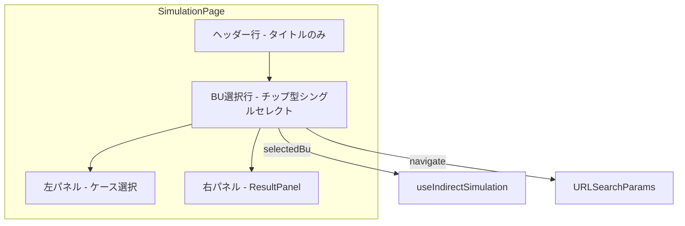

# Design Document

## Overview

**Purpose**: 間接作業シミュレーション画面のBU選択UIをヘッダー右端のドロップダウンからヘッダー直下のチップ型シングルセレクトUIに変更する。山積ダッシュボードとの視覚的一貫性を確保し、BU選択の発見性と操作性を向上させる。

**Users**: 事業部リーダーがBUを切り替えてシミュレーションを実行するワークフローで利用する。

**Impact**: シミュレーション画面（`/indirect/simulation`）のレイアウト構造を変更する。バックエンド・DBへの影響なし。

### Goals
- BU選択を山積ダッシュボードと同じ配置パターン（ヘッダー直下の独立行）に統一する
- チップ型UIにより全BUの一覧と選択状態を一目で把握可能にする
- 既存のURL同期・BU切替リセット機能を維持する

### Non-Goals
- マルチBU選択の対応（シミュレーションは単一BU前提）
- 既存 `BusinessUnitSelector`（workload feature）の改修
- features 間の共通コンポーネント化（将来課題）

## Architecture

### Existing Architecture Analysis

現行のシミュレーション画面は以下の構造:

```
ヘッダー行（タイトル + BUドロップダウン）
└─ 2カラムレイアウト
   ├─ 左パネル（ケース選択 + 計算ボタン）
   └─ 右パネル（ResultPanel）
```

**維持するパターン**:
- TanStack Router の search params (`bu`) による BU 状態管理
- `useIndirectSimulation` フックの BU 変更リセット機構（prev-value 比較パターン）
- `businessUnitsQueryOptions` による BU データ取得

**変更するパターン**:
- ヘッダー右端のドロップダウンを削除し、ヘッダー直下に独立行を追加

### Architecture Pattern & Boundary Map



**Architecture Integration**:
- **Selected pattern**: 山積ダッシュボードと同じ「ヘッダー → BU選択行 → メインコンテンツ」の3層レイアウト
- **Domain boundary**: `BusinessUnitSingleSelector` は `indirect-case-study` feature 内に配置（features 間依存禁止）
- **Existing patterns preserved**: URL search params 同期、`useIndirectSimulation` のリセット機構
- **Steering compliance**: feature-first 構成、`@/` エイリアスインポート

### Technology Stack

| Layer | Choice / Version | Role in Feature | Notes |
|-------|------------------|-----------------|-------|
| Frontend | React 19 + TanStack Router | ページレイアウト・ルーティング | 既存技術。変更なし |
| UI | shadcn/ui + Tailwind CSS v4 + lucide-react | チップ型UIのスタイリング | `Building2` アイコン再利用 |
| State | TanStack Query + URL search params | BUデータ取得・BU選択状態 | 既存パターン維持 |

## Requirements Traceability

| Requirement | Summary | Components | Interfaces |
|-------------|---------|------------|------------|
| 1.1 | ヘッダー直下にBU選択行を表示 | IndirectSimulationPage | — |
| 1.2 | ヘッダーのドロップダウンを削除 | IndirectSimulationPage | — |
| 1.3 | 山積ダッシュボードと同じレイアウトスタイル | IndirectSimulationPage | — |
| 2.1 | チップとして横並び表示 | BusinessUnitSingleSelector | BusinessUnitSingleSelectorProps |
| 2.2 | シングルセレクト動作 | BusinessUnitSingleSelector | BusinessUnitSingleSelectorProps |
| 2.3 | アクティブスタイル | BusinessUnitSingleSelector | — |
| 2.4 | ホバースタイル | BusinessUnitSingleSelector | — |
| 2.5 | ラベルとアイコン | BusinessUnitSingleSelector | — |
| 3.1 | クリック時にURL更新 | IndirectSimulationPage | BusinessUnitSingleSelectorProps.onChange |
| 3.2 | URL paramsからBU復元 | IndirectSimulationPage | — |
| 3.3 | 未指定時に先頭BU選択 | IndirectSimulationPage | — |
| 4.1 | BU切替時にケース選択リセット | useIndirectSimulation | — (既存実装) |
| 4.2 | BU切替時に計算結果クリア | useIndirectSimulation | — (既存実装) |
| 4.3 | BU切替時にケース一覧再取得 | useIndirectSimulation | — (既存実装) |
| 5.1 | 山積ダッシュボードと同じ視覚パターン | BusinessUnitSingleSelector | — |
| 5.2 | 全選択ボタンなし | BusinessUnitSingleSelector | — |

## Components and Interfaces

| Component | Domain/Layer | Intent | Req Coverage | Key Dependencies | Contracts |
|-----------|-------------|--------|--------------|------------------|-----------|
| BusinessUnitSingleSelector | indirect-case-study / UI | チップ型シングルセレクトBU選択 | 2.1-2.5, 5.1, 5.2 | businessUnitsQueryOptions (P0) | Props |
| IndirectSimulationPage | routes / Page | レイアウト再構成・BU選択行配置 | 1.1-1.3, 3.1-3.3 | BusinessUnitSingleSelector (P0), useIndirectSimulation (P0) | — |

### UI Layer

#### BusinessUnitSingleSelector

| Field | Detail |
|-------|--------|
| Intent | 全BUをチップとして表示し、シングルセレクトでBUを選択する |
| Requirements | 2.1, 2.2, 2.3, 2.4, 2.5, 5.1, 5.2 |

**Responsibilities & Constraints**
- BUデータの取得と一覧表示
- シングルセレクト動作（1つのみ選択可能、必ず1つ選択状態）
- 山積ダッシュボードの `BusinessUnitSelector` と同じ視覚スタイルを維持

**Dependencies**
- External: `businessUnitsQueryOptions` — BU一覧データ取得 (P0)
- External: `lucide-react` — `Building2` アイコン (P2)

**Contracts**: State [x]

##### State Management

```typescript
interface BusinessUnitSingleSelectorProps {
  /** 現在選択中のBUコード */
  selectedCode: string;
  /** BU選択変更時のコールバック */
  onChange: (code: string) => void;
}
```

- 状態は親コンポーネント（ページ）が管理する（controlled component パターン）
- BU一覧データはコンポーネント内部で `useQuery(businessUnitsQueryOptions())` により取得する
- 選択中チップ: `border-primary bg-primary/10 text-primary`
- 未選択チップ: `border-border bg-background text-muted-foreground hover:bg-accent hover:text-accent-foreground`

**Implementation Notes**
- `BusinessUnitSelector`（workload feature）の視覚スタイルをベースにするが、features 間依存禁止のためコード共有はしない
- 「全選択」ボタンは含めない（シングルセレクトのため不要）
- BUデータのローディング中は空表示（親コンポーネントの `buLoading` ガードで全体がローディング状態になるため）

### Page Layer

#### IndirectSimulationPage（既存改修）

| Field | Detail |
|-------|--------|
| Intent | レイアウト構造を変更し、BU選択をヘッダー直下の独立行に配置する |
| Requirements | 1.1, 1.2, 1.3, 3.1, 3.2, 3.3 |

**変更内容**

1. **ヘッダー行**: `Building2` アイコン + `Select` ドロップダウンを削除。タイトルのみ残す。
2. **BU選択行（新規）**: ヘッダー直下に `<div className="border-b border-border px-4 py-3">` で独立行を追加。`BusinessUnitSingleSelector` を配置。
3. **BU選択行の props 接続**: `selectedCode={selectedBu}` + `onChange={handleBuChange}` で既存ロジックに接続。

**Implementation Notes**
- `shadcn/ui` の `Select`, `SelectTrigger`, `SelectValue`, `SelectContent`, `SelectItem` のインポートは不要になるため削除する
- `handleBuChange` は既存の `navigate({ search: { bu: code } })` をそのまま利用する
- `selectedBu` の算出ロジック（URL params or 先頭BU）は変更不要

## Testing Strategy

### Unit Tests
- `BusinessUnitSingleSelector`: チップクリック時に `onChange` が正しいBUコードで呼ばれること
- `BusinessUnitSingleSelector`: 選択中のBUに `border-primary` クラスが適用されること
- `BusinessUnitSingleSelector`: BUデータが空の場合にラベルのみ表示されること

### E2E/UI Tests
- シミュレーション画面でBU選択行がヘッダー直下に表示されること
- BUチップクリックでURL search params が更新されること
- BU切替後にケース選択がリセットされること
