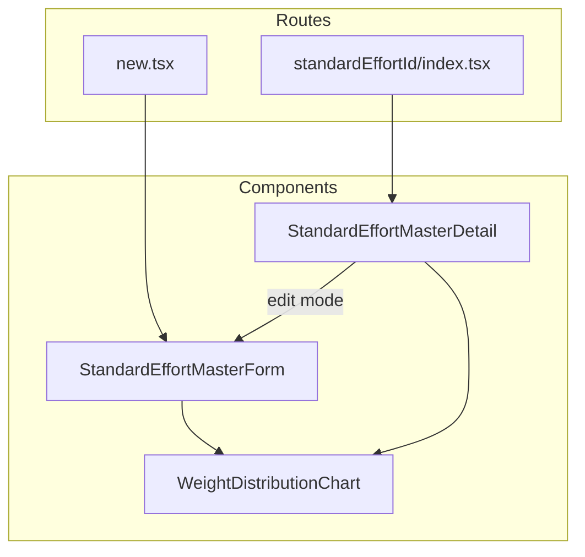

# Design Document: standard-effort-layout-improvement

## Overview

**Purpose**: 標準工数パターン画面（詳細・新規登録・編集）のレイアウトを改善し、情報の視認性と操作性を向上させる。

**Users**: 事業部リーダー・プロジェクトマネージャーが、標準工数パターンの登録・確認・編集ワークフローで利用する。

**Impact**: 既存の3コンポーネント（`StandardEffortMasterForm`, `StandardEffortMasterDetail`, `WeightDistributionChart`）のレイアウト構造を変更する。データモデル・API・バリデーションへの影響なし。

### Goals
- カード配置を上下構成にし、テーブル・グラフの横幅を最大化する
- テーブルを横方向（進捗率を列）に転置し、重み分布の一覧性を向上させる
- ラベル表記・フォームレイアウト・カード背景色を統一し、画面間の一貫性を確保する

### Non-Goals
- テーブルへのソート・フィルタ機能の追加
- レスポンシブ対応（モバイル・タブレット向けレイアウト）
- ダークテーマ対応（ただし `bg-card` 使用によりテーマ変数準拠にはなる）
- バックエンドAPI・データモデルの変更

## Architecture

### Existing Architecture Analysis

現在の標準工数パターン画面は以下の構成:

- **ルートコンポーネント**: `new.tsx`（新規登録）、`$standardEffortId/index.tsx`（詳細）がそれぞれ `StandardEffortMasterForm` / `StandardEffortMasterDetail` を描画
- **フォーム**: TanStack Form で状態管理。`form.Field` で各入力を管理し、`form.Subscribe` でチャートにリアクティブにデータ連携
- **テーブル**: ネイティブ `<table>` 要素。21行（進捗率）×2列（進捗率・重み）の縦方向構造
- **チャート**: Recharts `AreaChart` を `ResponsiveContainer` でラップ。固定高さ `256px`

制約:
- `StandardEffortMasterDetail` は読み取り専用モードと編集モード（`StandardEffortMasterForm` を再利用）を内部で切り替える
- TanStack Form の `form.Field` バインディングがテーブルのInput要素に直接紐づいている

### Architecture Pattern & Boundary Map



**Architecture Integration**:
- Selected pattern: 既存コンポーネントの直接修正（Option A）
- Domain boundaries: `features/standard-effort-masters/components/` 内に閉じた変更
- Existing patterns preserved: TanStack Form バインディング、Recharts チャート構成、ルートコンポーネントの責務分離
- New components: なし
- Steering compliance: features ディレクトリ構成、`components/` 配下にフォルダ未作成

### Technology Stack

| Layer | Choice / Version | Role in Feature | Notes |
|-------|------------------|-----------------|-------|
| Frontend | React 19 + Tailwind CSS v4 | レイアウト変更 | 既存技術のみ、新規依存なし |
| Form | TanStack Form | フォーム状態管理 | 既存のまま変更なし |
| Chart | Recharts | エリアチャート表示 | 高さ調整のみ |

## Requirements Traceability

| Requirement | Summary | Components | Interfaces |
|-------------|---------|------------|------------|
| 1.1, 1.2, 1.3, 1.4 | ラベル「事業部」→「ビジネスユニット」、プレースホルダー変更 | StandardEffortMasterForm | — |
| 2.1, 2.2 | BU + 案件タイプの横並びレイアウト | StandardEffortMasterForm | — |
| 3.1, 3.2 | カード背景色 `bg-card` | StandardEffortMasterForm, WeightDistributionChart | — |
| 4.1, 4.2, 4.3 | カード配置を上下構成に | StandardEffortMasterForm, StandardEffortMasterDetail | — |
| 5.1, 5.2, 5.3 | テーブル横方向転置 | StandardEffortMasterForm, StandardEffortMasterDetail | — |
| 6.1, 6.2 | グラフ高さ調整 | WeightDistributionChart | — |
| 7.1, 7.2, 7.3 | 全画面統一レイアウト・TypeScriptエラーなし | 全コンポーネント | — |

## Components and Interfaces

| Component | Domain/Layer | Intent | Req Coverage | Key Dependencies | Contracts |
|-----------|--------------|--------|--------------|------------------|-----------|
| StandardEffortMasterForm | UI / features | フォーム表示・編集（ラベル・レイアウト・テーブル転置） | 1, 2, 3, 4, 5, 7 | TanStack Form (P0), QuerySelect (P1) | State |
| StandardEffortMasterDetail | UI / features | 詳細表示（テーブル転置・カード配置） | 4, 5, 7 | StandardEffortMasterForm (P1) | — |
| WeightDistributionChart | UI / features | エリアチャート表示（背景色・高さ調整） | 3, 6 | Recharts (P0) | — |

### UI Layer

#### StandardEffortMasterForm

| Field | Detail |
|-------|--------|
| Intent | 標準工数パターンの新規登録・編集フォーム。ラベル変更、フィールド横並び、テーブル転置、カード配置変更を実施 |
| Requirements | 1.1, 1.2, 1.3, 1.4, 2.1, 2.2, 3.1, 4.2, 4.3, 5.1, 5.2, 5.3, 7.3 |

**Responsibilities & Constraints**
- フォームフィールド（BU・案件タイプ・パターン名）の表示とバリデーション
- 重み配分テーブル（編集可能）の横方向表示
- チャートコンポーネントへのリアクティブデータ連携
- TanStack Form の `form.Field` バインディングを維持すること

**Dependencies**
- Inbound: `new.tsx`, `StandardEffortMasterDetail`（編集モード）— フォーム描画 (P0)
- Outbound: `WeightDistributionChart` — 重みデータのチャート表示 (P1)
- External: `@tanstack/react-form` — フォーム状態管理 (P0)

##### Layout Changes

**A. ラベル変更（1.1〜1.4）**
```
変更前: label="事業部", placeholder="事業部を選択"
変更後: label="ビジネスユニット", placeholder="ビジネスユニットを選択"
```

**B. フォームフィールド横並び（2.1, 2.2）**
```
変更前: <div className="grid grid-cols-1 gap-6 max-w-md">
         {BU} {案件タイプ} {パターン名}
変更後: <div className="space-y-6">
           <div className="grid grid-cols-2 gap-6 max-w-2xl">
             {BU} {案件タイプ}
           </div>
           <div className="max-w-md">
             {パターン名}
           </div>
```

**C. カード配置変更（4.2, 4.3）**
```
変更前: <div className="grid grid-cols-1 lg:grid-cols-2 gap-6">
変更後: <div className="grid grid-cols-1 gap-6">
```

**D. カード背景色（3.1）**
```
変更前: <div className="rounded-3xl border p-6">
変更後: <div className="rounded-3xl border bg-card p-6">
```

**E. テーブル構造転置（5.1, 5.2, 5.3）**

転置前の構造:
```
| 進捗率 | 重み   |
|--------|--------|
| 0%     | [input]|
| 5%     | [input]|
| ...    | ...    |
| 100%   | [input]|
```

転置後の構造:
```
|      | 0%  | 5%  | 10% | ... | 100% |
|------|-----|-----|-----|-----|------|
| 重み | [in]| [in]| [in]| ... | [in] |
```

テーブル設計仕様:
- ヘッダー行: `PROGRESS_RATES.map()` で進捗率ラベルを列として展開
- ボディ行: 1行のみ。各セルに `form.Field name={weights[i].weight}` のInputを配置
- ヘッダーセル: `text-[11px] font-medium text-muted-foreground text-center` + `px-1 py-2`
- ボディセル（編集）: `<Input type="text" inputMode="numeric" className="w-full min-w-0 h-7 text-xs text-right tabular-nums px-1" />`
- テーブルラッパー: `overflow-x-hidden`（横スクロール防止）
- テーブル: `table-fixed w-full`（均等幅配分）

**Implementation Notes**
- TanStack Form の `form.Field` インデックスアクセス `weights[${i}].weight` は転置後も同じパターンを維持
- 全角数値→半角変換ロジック（IME対応）はInputのonChangeハンドラに既存のまま保持
- `max-h-[480px] overflow-y-auto` は転置後不要（1行のみ）。削除する

#### StandardEffortMasterDetail

| Field | Detail |
|-------|--------|
| Intent | 標準工数パターンの詳細表示。読み取り専用テーブルの転置とカード配置変更を実施 |
| Requirements | 4.1, 5.1, 5.2, 5.3, 7.1, 7.2 |

**Responsibilities & Constraints**
- 基本情報（パターン名・BU・案件タイプ）の読み取り表示
- 重み配分テーブル（読み取り専用）の横方向表示
- 編集モード切替時は `StandardEffortMasterForm` を再利用

**Dependencies**
- Inbound: `$standardEffortId/index.tsx` — 詳細画面描画 (P0)
- Outbound: `StandardEffortMasterForm` — 編集モード (P1), `WeightDistributionChart` — チャート表示 (P1)

##### Layout Changes

**A. カード配置変更（4.1）**
```
変更前: <div className="grid grid-cols-1 lg:grid-cols-2 gap-6">
変更後: <div className="grid grid-cols-1 gap-6">
```

**B. テーブル構造転置（5.1, 5.2, 5.3）**

転置後の構造（読み取り専用）:
```
|      | 0% | 5% | 10% | ... | 100% |
|------|----|----|-----|-----|------|
| 重み | 0  | 10 | 25  | ... | 0    |
```

テーブル設計仕様:
- ヘッダー行: Form版と同一構造
- ボディセル（読み取り専用）: `text-xs text-right tabular-nums px-1 py-1.5`
- テーブル: `table-fixed w-full`
- `max-h-[480px] overflow-y-auto` を削除

**Implementation Notes**
- DetailのラベルはIssueの変更対象外のため「事業部」のまま維持（`DetailRow label="事業部"` は変更しない）
- 編集モード時は `StandardEffortMasterForm` が全レイアウト変更を適用するため、Detail側での編集モード対応は不要

#### WeightDistributionChart

| Field | Detail |
|-------|--------|
| Intent | 重み分布のエリアチャート表示。背景色修正と高さ調整を実施 |
| Requirements | 3.1, 3.2, 6.1, 6.2 |

**Responsibilities & Constraints**
- `weights` 配列を受け取りRecharts `AreaChart` で描画
- カード背景色をテーマ変数準拠に変更
- 全幅カード前提での高さ最適化

**Dependencies**
- Inbound: `StandardEffortMasterForm`（`form.Subscribe`経由）, `StandardEffortMasterDetail` — 重みデータ (P0)
- External: `recharts` — チャートライブラリ (P0)

##### Layout Changes

**A. 背景色修正（3.1, 3.2）**
```
変更前: <div className="rounded-3xl border bg-white p-6">
変更後: <div className="rounded-3xl border bg-card p-6">
```

**B. 高さ調整（6.1, 6.2）**
```
変更前: <div className="h-[256px]">
変更後: <div className="h-[200px]">
```

**Implementation Notes**
- `h-[200px]` は初期値。実装後のレビューで調整可能（`research.md` Q8-2参照）
- `ResponsiveContainer width="100%" height="100%"` は変更不要（親の高さに追従）

## Testing Strategy

### Visual Confirmation（手動テスト）
- 新規登録画面: ラベル「ビジネスユニット」表示、BU+案件タイプ横並び、テーブル21列表示、横スクロールなし
- 詳細画面: カード上下配置、テーブル横方向表示、読み取り専用値の正確表示
- 編集画面: テーブル内Input操作（数値入力・全角→半角変換）、チャートのリアクティブ更新
- ブレークポイント確認: 1280px、1440px、1920px でのテーブル表示

### TypeScript Compilation
- `pnpm --filter frontend build` でTypeScriptエラーなしを確認（7.3）

### Lint
- `pnpm --filter frontend lint` でリントエラーなしを確認
